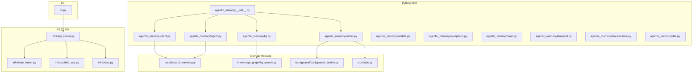
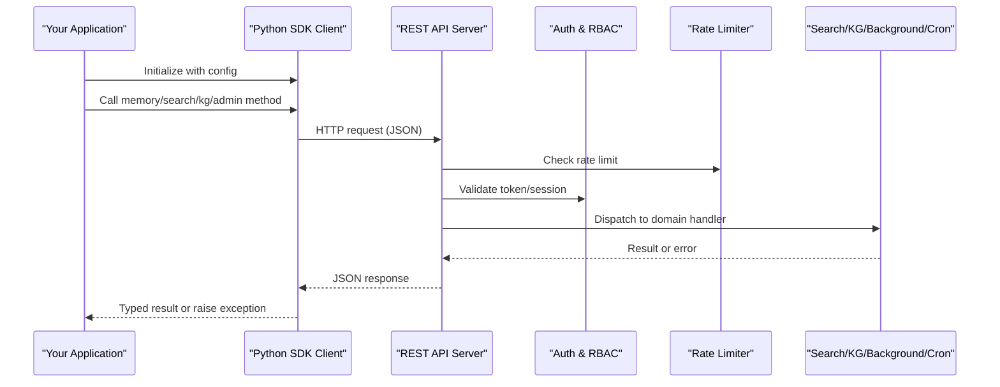
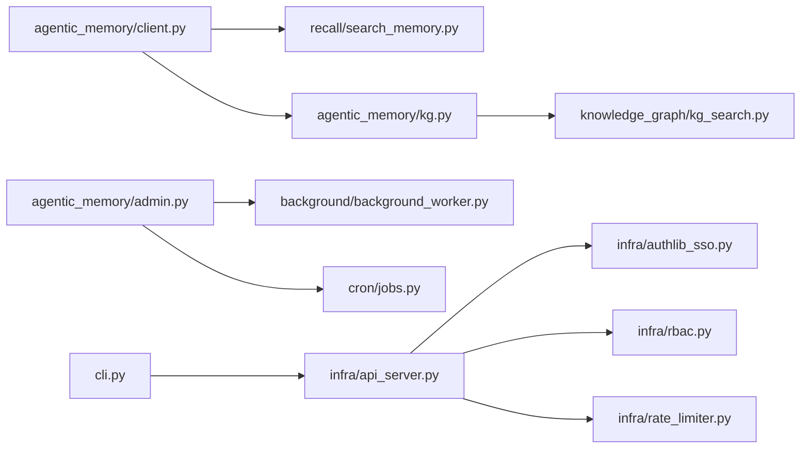

# API Reference

<cite>
**Referenced Files in This Document**
- [agentic_memory/__init__.py](file://agentic_memory/__init__.py)
- [agentic_memory/client.py](file://agentic_memory/client.py)
- [agentic_memory/kg.py](file://agentic_memory/kg.py)
- [agentic_memory/agent.py](file://agentic_memory/agent.py)
- [agentic_memory/admin.py](file://agentic_memory/admin.py)
- [agentic_memory/models.py](file://agentic_memory/models.py)
- [agentic_memory/exceptions.py](file://agentic_memory/exceptions.py)
- [agentic_memory/sync.py](file://agentic_memory/sync.py)
- [agentic_memory/temporal.py](file://agentic_memory/temporal.py)
- [agentic_memory/maintenance.py](file://agentic_memory/maintenance.py)
- [agentic_memory/utils.py](file://agentic_memory/utils.py)
- [cli.py](file://cli.py)
- [infra/api_server.py](file://infra/api_server.py)
- [infra/rate_limiter.py](file://infra/rate_limiter.py)
- [infra/authlib_sso.py](file://infra/authlib_sso.py)
- [infra/rbac.py](file://infra/rbac.py)
- [recall/search_memory.py](file://recall/search_memory.py)
- [knowledge_graph/kg_search.py](file://knowledge_graph/kg_search.py)
- [background/background_worker.py](file://background/background_worker.py)
- [cron/jobs.py](file://cron/jobs.py)
- [examples/basic_save_search.py](file://examples/basic_save_search.py)
- [examples/streaming_ingest.py](file://examples/streaming_ingest.py)
</cite>

## Table of Contents
1. [Introduction](#introduction)
2. [Project Structure](#project-structure)
3. [Core Components](#core-components)
4. [Architecture Overview](#architecture-overview)
5. [Detailed Component Analysis](#detailed-component-analysis)
6. [Dependency Analysis](#dependency-analysis)
7. [Performance Considerations](#performance-considerations)
8. [Troubleshooting Guide](#troubleshooting-guide)
9. [Conclusion](#conclusion)
10. [Appendices](#appendices)

## Introduction
This document provides a comprehensive API reference for Agentic Memory’s public interfaces, including:
- Python SDK methods and classes with parameters, return values, and error handling
- REST API endpoints (HTTP methods, request/response schemas, authentication, rate limiting)
- CLI command reference with options and usage patterns
- Code examples for memory CRUD, search queries, knowledge graph manipulation, and background task management
- Authentication methods, configuration options, and integration patterns

The goal is to enable developers to integrate with Agentic Memory quickly and reliably across multiple access surfaces.

## Project Structure
Agentic Memory exposes three primary access surfaces:
- Python SDK under agentic_memory package
- REST API server under infra/api_server.py
- CLI entry point under cli.py

**Diagram sources**
- [agentic_memory/__init__.py](file://agentic_memory/__init__.py)
- [agentic_memory/client.py](file://agentic_memory/client.py)
- [agentic_memory/kg.py](file://agentic_memory/kg.py)
- [agentic_memory/agent.py](file://agentic_memory/agent.py)
- [agentic_memory/admin.py](file://agentic_memory/admin.py)
- [agentic_memory/models.py](file://agentic_memory/models.py)
- [agentic_memory/exceptions.py](file://agentic_memory/exceptions.py)
- [agentic_memory/sync.py](file://agentic_memory/sync.py)
- [agentic_memory/temporal.py](file://agentic_memory/temporal.py)
- [agentic_memory/maintenance.py](file://agentic_memory/maintenance.py)
- [agentic_memory/utils.py](file://agentic_memory/utils.py)
- [infra/api_server.py](file://infra/api_server.py)
- [infra/rate_limiter.py](file://infra/rate_limiter.py)
- [infra/authlib_sso.py](file://infra/authlib_sso.py)
- [infra/rbac.py](file://infra/rbac.py)
- [cli.py](file://cli.py)
- [recall/search_memory.py](file://recall/search_memory.py)
- [knowledge_graph/kg_search.py](file://knowledge_graph/kg_search.py)
- [background/background_worker.py](file://background/background_worker.py)
- [cron/jobs.py](file://cron/jobs.py)

**Section sources**
- [agentic_memory/__init__.py](file://agentic_memory/__init__.py)
- [agentic_memory/client.py](file://agentic_memory/client.py)
- [agentic_memory/kg.py](file://agentic_memory/kg.py)
- [agentic_memory/agent.py](file://agentic_memory/agent.py)
- [agentic_memory/admin.py](file://agentic_memory/admin.py)
- [agentic_memory/models.py](file://agentic_memory/models.py)
- [agentic_memory/exceptions.py](file://agentic_memory/exceptions.py)
- [agentic_memory/sync.py](file://agentic_memory/sync.py)
- [agentic_memory/temporal.py](file://agentic_memory/temporal.py)
- [agentic_memory/maintenance.py](file://agentic_memory/maintenance.py)
- [agentic_memory/utils.py](file://agentic_memory/utils.py)
- [infra/api_server.py](file://infra/api_server.py)
- [infra/rate_limiter.py](file://infra/rate_limiter.py)
- [infra/authlib_sso.py](file://infra/authlib_sso.py)
- [infra/rbac.py](file://infra/rbac.py)
- [cli.py](file://cli.py)
- [recall/search_memory.py](file://recall/search_memory.py)
- [knowledge_graph/kg_search.py](file://knowledge_graph/kg_search.py)
- [background/background_worker.py](file://background/background_worker.py)
- [cron/jobs.py](file://cron/jobs.py)

## Core Components
This section summarizes the main public components exposed by the SDK and server.

- Python SDK client and models
  - Client initialization and configuration
  - Memory CRUD operations
  - Search and retrieval
  - Knowledge graph operations
  - Admin and maintenance utilities
  - Sync and temporal helpers
  - Error types and exceptions

- REST API server
  - HTTP endpoints for memory, search, KG, admin, and maintenance
  - Authentication via SSO/JWT and RBAC
  - Rate limiting and quotas

- CLI
  - Commands for memory, search, KG, admin, and maintenance tasks

**Section sources**
- [agentic_memory/client.py](file://agentic_memory/client.py)
- [agentic_memory/models.py](file://agentic_memory/models.py)
- [agentic_memory/kg.py](file://agentic_memory/kg.py)
- [agentic_memory/agent.py](file://agentic_memory/agent.py)
- [agentic_memory/admin.py](file://agentic_memory/admin.py)
- [agentic_memory/exceptions.py](file://agentic_memory/exceptions.py)
- [agentic_memory/sync.py](file://agentic_memory/sync.py)
- [agentic_memory/temporal.py](file://agentic_memory/temporal.py)
- [agentic_memory/maintenance.py](file://agentic_memory/maintenance.py)
- [infra/api_server.py](file://infra/api_server.py)
- [infra/rate_limiter.py](file://infra/rate_limiter.py)
- [infra/authlib_sso.py](file://infra/authlib_sso.py)
- [infra/rbac.py](file://infra/rbac.py)
- [cli.py](file://cli.py)

## Architecture Overview
High-level architecture showing how clients interact with the system through SDK, REST API, and CLI.

**Diagram sources**
- [agentic_memory/client.py](file://agentic_memory/client.py)
- [infra/api_server.py](file://infra/api_server.py)
- [infra/rate_limiter.py](file://infra/rate_limiter.py)
- [infra/authlib_sso.py](file://infra/authlib_sso.py)
- [infra/rbac.py](file://infra/rbac.py)
- [recall/search_memory.py](file://recall/search_memory.py)
- [knowledge_graph/kg_search.py](file://knowledge_graph/kg_search.py)
- [background/background_worker.py](file://background/background_worker.py)
- [cron/jobs.py](file://cron/jobs.py)

## Detailed Component Analysis

### Python SDK

#### Client Initialization and Configuration
- Purpose: Configure connection, credentials, tenant, timeouts, retries, and optional features.
- Typical parameters:
  - Base URL or local path
  - Authentication token or session cookie
  - Tenant identifier
  - Timeout and retry policy
  - Optional feature flags (e.g., streaming, compression)
- Behavior:
  - Establishes persistent HTTP client or local DB access depending on deployment mode
  - Applies default headers and auth middleware
  - Validates environment and configuration

**Section sources**
- [agentic_memory/client.py](file://agentic_memory/client.py)
- [agentic_memory/models.py](file://agentic_memory/models.py)
- [agentic_memory/utils.py](file://agentic_memory/utils.py)

#### Memory CRUD Operations
- Create memory:
  - Parameters: content, tags, metadata, observed_at, session_id, tier hints
  - Returns: created memory object with id and timestamps
  - Errors: validation errors, quota exceeded, write conflicts
- Read memory:
  - Parameters: memory id, include fields, version
  - Returns: memory object or None if not found
  - Errors: not found, permission denied
- Update memory:
  - Parameters: memory id, fields to update, conflict resolution strategy
  - Returns: updated memory object
  - Errors: not found, conflict, invalid update
- Delete memory:
  - Parameters: memory id, soft delete flag
  - Returns: deletion status
  - Errors: not found, permission denied

**Section sources**
- [agentic_memory/client.py](file://agentic_memory/client.py)
- [agentic_memory/models.py](file://agentic_memory/models.py)
- [agentic_memory/exceptions.py](file://agentic_memory/exceptions.py)

#### Search and Retrieval
- Query parameters:
  - Text query, filters (tags, time range, sessions), ranking options, top_k, hybrid mode
- Response:
  - Ranked list of memories with scores and snippets
- Advanced options:
  - Temporal filtering, reranking strategies, skill-aware boosting
- Errors:
  - Invalid query, index unavailable, timeout

**Section sources**
- [agentic_memory/client.py](file://agentic_memory/client.py)
- [recall/search_memory.py](file://recall/search_memory.py)
- [agentic_memory/models.py](file://agentic_memory/models.py)

#### Knowledge Graph Operations
- Entity and fact management:
  - Create/update/delete entities and facts
  - Link entities to memories
- Traversal and analytics:
  - Path queries, community detection, centrality metrics
- CRDT-backed consistency:
  - Conflict-free merges, append-only logs
- Errors:
  - Validation failures, integrity constraints, sync conflicts

**Section sources**
- [agentic_memory/kg.py](file://agentic_memory/kg.py)
- [knowledge_graph/kg_search.py](file://knowledge_graph/kg_search.py)
- [agentic_memory/models.py](file://agentic_memory/models.py)

#### Admin and Maintenance Utilities
- System health checks
- Index rebuilds and backfills
- Retention policies and purging
- Audit log export and GDPR erasure requests
- Errors:
  - Permission denied, operation in progress, resource limits

**Section sources**
- [agentic_memory/admin.py](file://agentic_memory/admin.py)
- [agentic_memory/maintenance.py](file://agentic_memory/maintenance.py)

#### Sync and Temporal Helpers
- Multi-agent synchronization:
  - Push/pull changes, conflict resolution
- Temporal querying:
  - As-of-time reads, historical snapshots
- Errors:
  - Network errors, schema drift, inconsistent state

**Section sources**
- [agentic_memory/sync.py](file://agentic_memory/sync.py)
- [agentic_memory/temporal.py](file://agentic_memory/temporal.py)

#### Background Task Management
- Enqueue tasks:
  - Task type, payload, priority, scheduling
- Monitor tasks:
  - Status, retries, results
- Errors:
  - Queue full, invalid task type, unauthorized

**Section sources**
- [agentic_memory/admin.py](file://agentic_memory/admin.py)
- [background/background_worker.py](file://background/background_worker.py)
- [cron/jobs.py](file://cron/jobs.py)

#### Exceptions and Error Handling
- Exception hierarchy:
  - Base SDK error
  - Validation error
  - Not found
  - Permission denied
  - Conflict
  - Rate limited
  - Timeout
- Usage:
  - Catch specific exceptions for robust error handling
  - Inspect error codes and messages for diagnostics

**Section sources**
- [agentic_memory/exceptions.py](file://agentic_memory/exceptions.py)

### REST API

#### Authentication and Authorization
- Methods:
  - JWT bearer tokens
  - Session cookies (SSO)
- Authorization:
  - Role-based access control (RBAC)
  - Tenant isolation enforced per request
- Headers:
  - Authorization: Bearer <token>
  - X-Tenant-ID (if required)

**Section sources**
- [infra/authlib_sso.py](file://infra/authlib_sso.py)
- [infra/rbac.py](file://infra/rbac.py)

#### Rate Limiting
- Scope:
  - Per-client or per-tenant limits
- Responses:
  - 429 Too Many Requests with retry-after header
- Configuration:
  - Window size, max requests, burst allowance

**Section sources**
- [infra/rate_limiter.py](file://infra/rate_limiter.py)

#### Endpoints Overview
- Memory endpoints:
  - POST /api/v1/memories
  - GET /api/v1/memories/{id}
  - PATCH /api/v1/memories/{id}
  - DELETE /api/v1/memories/{id}
- Search endpoint:
  - POST /api/v1/search
- Knowledge Graph endpoints:
  - POST /api/v1/kg/entities
  - PUT /api/v1/kg/entities/{id}
  - DELETE /api/v1/kg/entities/{id}
  - POST /api/v1/kg/facts
  - GET /api/v1/kg/traverse
- Admin/Maintenance endpoints:
  - GET /api/v1/admin/health
  - POST /api/v1/admin/rebuild-index
  - POST /api/v1/admin/backfill
  - POST /api/v1/admin/purge
- Background Tasks endpoints:
  - POST /api/v1/tasks
  - GET /api/v1/tasks/{id}

Request/Response Schemas:
- Memory:
  - Request: {content, tags, metadata, observed_at, session_id}
  - Response: {id, content, tags, metadata, observed_at, created_at, updated_at}
- Search:
  - Request: {query, filters, top_k, mode}
  - Response: {results: [{memory, score}], total}
- KG Entities/Facts:
  - Request: entity/fact payloads with relationships
  - Response: persisted objects with ids and timestamps
- Tasks:
  - Request: {type, payload, priority, schedule}
  - Response: {task_id, status}

Authentication:
- All endpoints require valid token or session unless explicitly marked public (e.g., health).

Rate Limiting:
- Applied globally and per-tenant; consult server configuration for exact limits.

**Section sources**
- [infra/api_server.py](file://infra/api_server.py)
- [infra/rate_limiter.py](file://infra/rate_limiter.py)
- [infra/authlib_sso.py](file://infra/authlib_sso.py)
- [infra/rbac.py](file://infra/rbac.py)

### CLI Command Reference

Common Options:
- --base-url or --local-path
- --token or --session
- --tenant
- --timeout
- --verbose

Commands:
- memory
  - create: add new memory
  - get: retrieve memory by id
  - update: patch memory fields
  - delete: remove memory
- search
  - run: execute text/hybrid search with filters
- kg
  - entity create/update/delete
  - fact create/list
  - traverse: path queries
- admin
  - health: check service status
  - rebuild-index: rebuild search indexes
  - backfill: run data backfills
  - purge: apply retention and purge expired items
- tasks
  - enqueue: submit background task
  - status: monitor task execution

Usage Patterns:
- Combine filters and modes for precise searches
- Use verbose output for debugging
- Pipe outputs to scripts for automation

**Section sources**
- [cli.py](file://cli.py)

### Code Examples

- Basic save and search
  - Demonstrates creating a memory and searching by query
  - See example file for complete flow

**Section sources**
- [examples/basic_save_search.py](file://examples/basic_save_search.py)

- Streaming ingest
  - Shows high-throughput ingestion with batching and retries
  - See example file for complete flow

**Section sources**
- [examples/streaming_ingest.py](file://examples/streaming_ingest.py)

## Dependency Analysis

**Diagram sources**
- [agentic_memory/client.py](file://agentic_memory/client.py)
- [recall/search_memory.py](file://recall/search_memory.py)
- [agentic_memory/kg.py](file://agentic_memory/kg.py)
- [knowledge_graph/kg_search.py](file://knowledge_graph/kg_search.py)
- [agentic_memory/admin.py](file://agentic_memory/admin.py)
- [background/background_worker.py](file://background/background_worker.py)
- [cron/jobs.py](file://cron/jobs.py)
- [infra/api_server.py](file://infra/api_server.py)
- [infra/authlib_sso.py](file://infra/authlib_sso.py)
- [infra/rbac.py](file://infra/rbac.py)
- [infra/rate_limiter.py](file://infra/rate_limiter.py)
- [cli.py](file://cli.py)

**Section sources**
- [agentic_memory/client.py](file://agentic_memory/client.py)
- [recall/search_memory.py](file://recall/search_memory.py)
- [agentic_memory/kg.py](file://agentic_memory/kg.py)
- [knowledge_graph/kg_search.py](file://knowledge_graph/kg_search.py)
- [agentic_memory/admin.py](file://agentic_memory/admin.py)
- [background/background_worker.py](file://background/background_worker.py)
- [cron/jobs.py](file://cron/jobs.py)
- [infra/api_server.py](file://infra/api_server.py)
- [infra/authlib_sso.py](file://infra/authlib_sso.py)
- [infra/rbac.py](file://infra/rbac.py)
- [infra/rate_limiter.py](file://infra/rate_limiter.py)
- [cli.py](file://cli.py)

## Performance Considerations
- Use batched writes for high-throughput ingestion
- Enable hybrid search and reranking for improved relevance at scale
- Tune top_k and filters to reduce payload sizes
- Leverage caching where appropriate (e.g., recent saves hint)
- Monitor rate limits and implement exponential backoff
- Prefer pagination for large result sets

[No sources needed since this section provides general guidance]

## Troubleshooting Guide
Common issues and resolutions:
- Authentication failures:
  - Verify token validity and expiration
  - Ensure correct tenant context
- Rate limiting:
  - Implement retry with backoff
  - Reduce request frequency or increase quotas
- Search performance:
  - Adjust filters and top_k
  - Rebuild indexes after major updates
- Write conflicts:
  - Use conflict resolution strategies
  - Retry with updated versions
- Background tasks:
  - Check queue depth and worker capacity
  - Review task logs for failures

**Section sources**
- [agentic_memory/exceptions.py](file://agentic_memory/exceptions.py)
- [infra/rate_limiter.py](file://infra/rate_limiter.py)
- [background/background_worker.py](file://background/background_worker.py)

## Conclusion
Agentic Memory provides a robust, multi-surface API for managing memories, performing advanced search, manipulating knowledge graphs, and orchestrating background tasks. The Python SDK offers typed interfaces and consistent error handling, while the REST API supports secure, rate-limited access with RBAC. The CLI enables operational workflows and automation. Follow the examples and best practices to achieve reliable integrations at scale.

[No sources needed since this section summarizes without analyzing specific files]

## Appendices

### Authentication Methods
- JWT Bearer Token:
  - Include Authorization header with token
- SSO Session Cookie:
  - Authenticate via identity provider and maintain session
- Tenant Isolation:
  - Pass tenant context when required

**Section sources**
- [infra/authlib_sso.py](file://infra/authlib_sso.py)
- [infra/rbac.py](file://infra/rbac.py)

### Configuration Options
- Connection settings:
  - Base URL or local path
  - Timeouts and retries
- Feature flags:
  - Streaming, compression, advanced search modes
- Security:
  - Token storage, tenant scoping

**Section sources**
- [agentic_memory/client.py](file://agentic_memory/client.py)
- [agentic_memory/utils.py](file://agentic_memory/utils.py)

### Integration Patterns
- Microservices:
  - Use REST API with JWT and RBAC
- Agents:
  - Use Python SDK for idiomatic interactions
- Batch Processing:
  - Use CLI and background tasks for maintenance and backfills

**Section sources**
- [agentic_memory/client.py](file://agentic_memory/client.py)
- [cli.py](file://cli.py)
- [background/background_worker.py](file://background/background_worker.py)