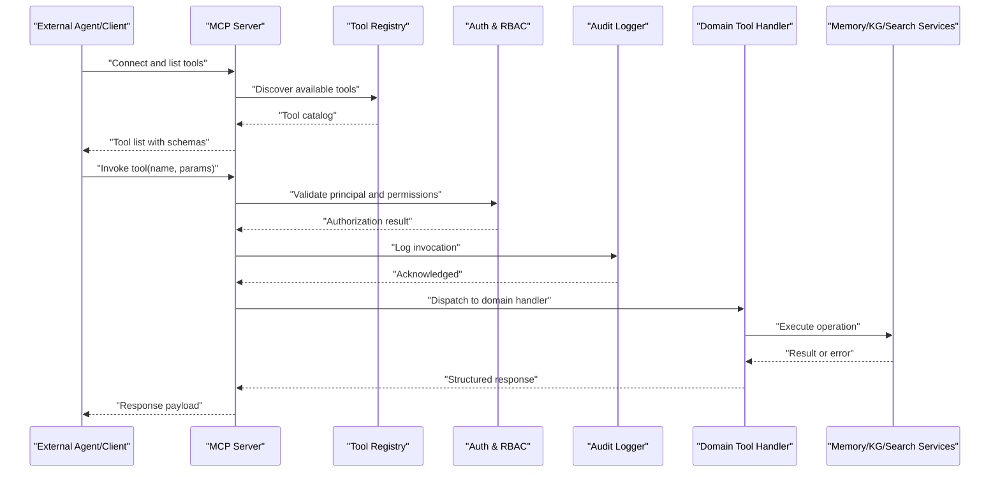
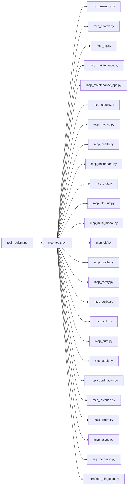

# MCP Tools

<cite>
**Referenced Files in This Document**
- [mcp_tools.py](file://mcp_tools.py)
- [mcp_memory.py](file://mcp_memory.py)
- [mcp_search.py](file://mcp_search.py)
- [mcp_kg.py](file://mcp_kg.py)
- [mcp_maintenance.py](file://mcp_maintenance.py)
- [mcp_maintenance_ops.py](file://mcp_maintenance_ops.py)
- [mcp_session.py](file://mcp_session.py)
- [mcp_sharing.py](file://mcp_sharing.py)
- [mcp_summarization.py](file://mcp_summarization.py)
- [mcp_quality.py](file://mcp_quality.py)
- [mcp_retention.py](file://mcp_retention.py)
- [mcp_rebuild.py](file://mcp_rebuild.py)
- [mcp_metrics.py](file://mcp_metrics.py)
- [mcp_health.py](file://mcp_health.py)
- [mcp_dashboard.py](file://mcp_dashboard.py)
- [mcp_auth.py](file://mcp_auth.py)
- [mcp_crdt.py](file://mcp_crdt.py)
- [mcp_ctr_drift.py](file://mcp_ctr_drift.py)
- [mcp_multi_modal.py](file://mcp_multi_modal.py)
- [mcp_okf.py](file://mcp_okf.py)
- [mcp_profile.py](file://mcp_profile.py)
- [mcp_safety.py](file://mcp_safety.py)
- [mcp_sdk.py](file://mcp_sdk.py)
- [mcp_verbs.py](file://mcp_verbs.py)
- [tool_registry.py](file://tool_registry.py)
- [memory_mcp.py](file://memory_mcp.py)
- [mcp_singleton.py](file://infra/mcp_singleton.py)
- [mcp_common.py](file://mcp_common.py)
- [mcp_coordination.py](file://mcp_coordination.py)
- [mcp_audit.py](file://mcp_audit.py)
- [mcp_instance.py](file://mcp_instance.py)
- [mcp_agent.py](file://mcp_agent.py)
- [mcp_async.py](file://mcp_async.py)
</cite>

## Table of Contents
1. [Introduction](#introduction)
2. [Project Structure](#project-structure)
3. [Core Components](#core-components)
4. [Architecture Overview](#architecture-overview)
5. [Detailed Component Analysis](#detailed-component-analysis)
6. [Dependency Analysis](#dependency-analysis)
7. [Performance Considerations](#performance-considerations)
8. [Troubleshooting Guide](#troubleshooting-guide)
9. [Conclusion](#conclusion)
10. [Appendices](#appendices)

## Introduction
This document provides comprehensive documentation for the Model Context Protocol (MCP) tools exposed by Agentic Memory’s external integration surface. It covers tool categories including memory operations, search functionality, knowledge graph manipulation, system administration, and maintenance tools. It also documents the tool registration process, custom tool development guidelines, authentication and authorization patterns, error handling strategies, and examples for integrating MCP tools with external systems and agents. Security considerations and performance optimization tips are included to help operators deploy robust integrations.

## Project Structure
The MCP tooling is implemented across a set of focused modules:
- Tool definitions and dispatch: mcp_tools.py, tool_registry.py
- Domain-specific tool sets: memory, search, knowledge graph, session, sharing, summarization, quality, retention, rebuild, metrics, health, dashboard, CRDT, CTR drift, multi-modal, OKF export/import, profile, safety, SDK, verbs
- Cross-cutting concerns: auth, audit, coordination, instance lifecycle, agent wiring, async support, common utilities

```mermaid
graph TB
subgraph "MCP Surface"
A["mcp_tools.py"]
B["tool_registry.py"]
C["mcp_common.py"]
end
subgraph "Domain Tools"
D["mcp_memory.py"]
E["mcp_search.py"]
F["mcp_kg.py"]
G["mcp_session.py"]
H["mcp_sharing.py"]
I["mcp_summarization.py"]
J["mcp_quality.py"]
K["mcp_retention.py"]
L["mcp_rebuild.py"]
M["mcp_metrics.py"]
N["mcp_health.py"]
O["mcp_dashboard.py"]
P["mcp_crdt.py"]
Q["mcp_ctr_drift.py"]
R["mcp_multi_modal.py"]
S["mcp_okf.py"]
T["mcp_profile.py"]
U["mcp_safety.py"]
V["mcp_sdk.py"]
W["mcp_verbs.py"]
end
subgraph "Cross-Cutting"
X["mcp_auth.py"]
Y["mcp_audit.py"]
Z["mcp_coordination.py"]
AA["mcp_instance.py"]
AB["mcp_agent.py"]
AC["mcp_async.py"]
AD["infra/mcp_singleton.py"]
end
A --> B
A --> C
A --> D
A --> E
A --> F
A --> G
A --> H
A --> I
A --> J
A --> K
A --> L
A --> M
A --> N
A --> O
A --> P
A --> Q
A --> R
A --> S
A --> T
A --> U
A --> V
A --> W
A --> X
A --> Y
A --> Z
A --> AA
A --> AB
A --> AC
A --> AD
```

**Diagram sources**
- [mcp_tools.py](file://mcp_tools.py)
- [tool_registry.py](file://tool_registry.py)
- [mcp_common.py](file://mcp_common.py)
- [mcp_memory.py](file://mcp_memory.py)
- [mcp_search.py](file://mcp_search.py)
- [mcp_kg.py](file://mcp_kg.py)
- [mcp_session.py](file://mcp_session.py)
- [mcp_sharing.py](file://mcp_sharing.py)
- [mcp_summarization.py](file://mcp_summarization.py)
- [mcp_quality.py](file://mcp_quality.py)
- [mcp_retention.py](file://mcp_retention.py)
- [mcp_rebuild.py](file://mcp_rebuild.py)
- [mcp_metrics.py](file://mcp_metrics.py)
- [mcp_health.py](file://mcp_health.py)
- [mcp_dashboard.py](file://mcp_dashboard.py)
- [mcp_crdt.py](file://mcp_crdt.py)
- [mcp_ctr_drift.py](file://mcp_ctr_drift.py)
- [mcp_multi_modal.py](file://mcp_multi_modal.py)
- [mcp_okf.py](file://mcp_okf.py)
- [mcp_profile.py](file://mcp_profile.py)
- [mcp_safety.py](file://mcp_safety.py)
- [mcp_sdk.py](file://mcp_sdk.py)
- [mcp_verbs.py](file://mcp_verbs.py)
- [mcp_auth.py](file://mcp_auth.py)
- [mcp_audit.py](file://mcp_audit.py)
- [mcp_coordination.py](file://mcp_coordination.py)
- [mcp_instance.py](file://mcp_instance.py)
- [mcp_agent.py](file://mcp_agent.py)
- [mcp_async.py](file://mcp_async.py)
- [infra/mcp_singleton.py](file://infra/mcp_singleton.py)

**Section sources**
- [mcp_tools.py](file://mcp_tools.py)
- [tool_registry.py](file://tool_registry.py)
- [mcp_common.py](file://mcp_common.py)
- [memory_mcp.py](file://memory_mcp.py)
- [mcp_instance.py](file://mcp_instance.py)
- [mcp_agent.py](file://mcp_agent.py)
- [mcp_async.py](file://mcp_async.py)
- [infra/mcp_singleton.py](file://infra/mcp_singleton.py)

## Core Components
- Tool registry and discovery: Central registry that exposes tool names, descriptions, parameters, and return types to clients. It supports dynamic registration and hot-reloading of tool sets.
- Domain tool modules: Each module implements a cohesive set of tools for a specific domain (e.g., memory CRUD, search queries, KG mutations).
- Cross-cutting services: Authentication/authorization, auditing, coordination primitives, instance lifecycle, and async execution helpers.

Key responsibilities:
- Define tool schemas and metadata
- Enforce access control and tenant scoping
- Provide consistent error responses and audit trails
- Support both synchronous and asynchronous invocation patterns

**Section sources**
- [mcp_tools.py](file://mcp_tools.py)
- [tool_registry.py](file://tool_registry.py)
- [mcp_common.py](file://mcp_common.py)
- [mcp_auth.py](file://mcp_auth.py)
- [mcp_audit.py](file://mcp_audit.py)
- [mcp_coordination.py](file://mcp_coordination.py)
- [mcp_instance.py](file://mcp_instance.py)
- [mcp_agent.py](file://mcp_agent.py)
- [mcp_async.py](file://mcp_async.py)

## Architecture Overview
The MCP surface exposes a uniform API to external agents and systems. Clients connect via an MCP server or SDK, authenticate, and call tools by name with typed parameters. The dispatcher validates requests, enforces policies, routes to the appropriate domain handler, and returns structured results.

**Diagram sources**
- [mcp_tools.py](file://mcp_tools.py)
- [tool_registry.py](file://tool_registry.py)
- [mcp_auth.py](file://mcp_auth.py)
- [mcp_audit.py](file://mcp_audit.py)
- [mcp_memory.py](file://mcp_memory.py)
- [mcp_search.py](file://mcp_search.py)
- [mcp_kg.py](file://mcp_kg.py)

## Detailed Component Analysis

### Memory Operations Tools
Purpose: Create, read, update, delete, and manage memories; attach sessions; manage skills and tags; perform bulk operations.

Typical capabilities:
- Save/update/delete memories
- Query memories by filters (time range, tags, skill, session)
- List sessions and their associated memories
- Bulk import/export of memories
- Manage memory tiers and retention hints

Parameters and return values:
- Parameters include identifiers, content payloads, filters, pagination tokens, and optional metadata such as timestamps and tags.
- Return values include lists of memory records, counts, and status indicators.

Usage example:
- An agent saves a new memory with content and tags, then retrieves recent memories filtered by time and tags.

Security and scope:
- Tenant-scoped access enforced at the registry level.
- Optional role-based checks for write-heavy operations.

Error handling:
- Validation errors for malformed inputs.
- Conflict resolution for concurrent updates.
- Consistent error codes and messages.

**Section sources**
- [mcp_memory.py](file://mcp_memory.py)
- [mcp_session.py](file://mcp_session.py)
- [mcp_tools.py](file://mcp_tools.py)
- [tool_registry.py](file://tool_registry.py)
- [mcp_auth.py](file://mcp_auth.py)
- [mcp_audit.py](file://mcp_audit.py)

### Search Functionality Tools
Purpose: Execute full-text, semantic, hybrid, and temporal searches; rerank results; retrieve snippets and context.

Typical capabilities:
- Text and vector search with query expansion
- Temporal filtering (as-of queries)
- Skill-aware retrieval
- Result reranking and synthesis
- Pagination and cursor-based navigation

Parameters and return values:
- Query text, filters (time, tags, entities), top-k, mode (text/vector/hybrid), reranker options.
- Results include ranked items, scores, and optional highlights.

Usage example:
- An agent performs a hybrid search with temporal constraints and applies a reranker to refine answers.

Performance considerations:
- Use pagination and limit top-k for large corpora.
- Prefer cached rerankers when available.

**Section sources**
- [mcp_search.py](file://mcp_search.py)
- [mcp_tools.py](file://mcp_tools.py)
- [tool_registry.py](file://tool_registry.py)
- [mcp_auth.py](file://mcp_auth.py)

### Knowledge Graph Manipulation Tools
Purpose: Read and mutate the knowledge graph; manage entities, relations, facts, and temporal assertions; run analytics and traversal.

Typical capabilities:
- Entity and relation CRUD
- Fact extraction and validation
- Temporal fact management
- Graph traversal and community detection
- Analytics snapshots and exports

Parameters and return values:
- Entity/relation identifiers, attributes, predicates, temporal bounds, traversal depth.
- Returns graph fragments, fact lists, and analytics summaries.

Usage example:
- An agent extracts facts from a conversation, asserts them into the KG, and queries related entities within a time window.

Consistency and concurrency:
- CRDT-backed writes ensure conflict-free merges.
- Append-only semantics where applicable.

**Section sources**
- [mcp_kg.py](file://mcp_kg.py)
- [mcp_crdt.py](file://mcp_crdt.py)
- [mcp_tools.py](file://mcp_tools.py)
- [tool_registry.py](file://tool_registry.py)
- [mcp_auth.py](file://mcp_auth.py)
- [mcp_audit.py](file://mcp_audit.py)

### System Administration and Maintenance Tools
Purpose: Operate and maintain the system; manage indexes, backfills, compaction, policy hashes, health checks, and metrics.

Typical capabilities:
- Index rebuilds and re-indexing
- Backfill orchestration and monitoring
- Compaction and cleanup tasks
- Policy hash verification and drift checks
- Health probes and metrics exposure

Parameters and return values:
- Task identifiers, scopes, dry-run flags, and progress cursors.
- Returns task status, logs, and summary outcomes.

Usage example:
- An operator triggers a targeted index rebuild for a subset of data and monitors progress via polling.

Safety and idempotency:
- Idempotent operations with explicit confirmation flags.
- Audited actions with rollback-friendly design.

**Section sources**
- [mcp_maintenance.py](file://mcp_maintenance.py)
- [mcp_maintenance_ops.py](file://mcp_maintenance_ops.py)
- [mcp_rebuild.py](file://mcp_rebuild.py)
- [mcp_metrics.py](file://mcp_metrics.py)
- [mcp_health.py](file://mcp_health.py)
- [mcp_dashboard.py](file://mcp_dashboard.py)
- [mcp_tools.py](file://mcp_tools.py)
- [tool_registry.py](file://tool_registry.py)
- [mcp_auth.py](file://mcp_auth.py)
- [mcp_audit.py](file://mcp_audit.py)

### Additional Tool Categories
- Sharing and collaboration: Share memories and graphs across tenants or agents with scoped permissions.
- Summarization: Generate concise summaries over memories or graph segments.
- Quality gates: Evaluate recall/precision signals and apply feedback loops.
- Retention policies: Adjust retention tiers and decay schedules.
- Multi-modal: Handle non-text assets and associated embeddings.
- OKF export/import: Interoperate with Open Knowledge Framework datasets.
- Profile and safety: Manage user profiles and enforce safety policies.
- Verbs and SDK: High-level verb abstractions and SDK bindings for programmatic use.

**Section sources**
- [mcp_sharing.py](file://mcp_sharing.py)
- [mcp_summarization.py](file://mcp_summarization.py)
- [mcp_quality.py](file://mcp_quality.py)
- [mcp_retention.py](file://mcp_retention.py)
- [mcp_multi_modal.py](file://mcp_multi_modal.py)
- [mcp_okf.py](file://mcp_okf.py)
- [mcp_profile.py](file://mcp_profile.py)
- [mcp_safety.py](file://mcp_safety.py)
- [mcp_verbs.py](file://mcp_verbs.py)
- [mcp_sdk.py](file://mcp_sdk.py)
- [mcp_tools.py](file://mcp_tools.py)
- [tool_registry.py](file://tool_registry.py)

## Dependency Analysis
The MCP surface depends on core infrastructure for authentication, auditing, coordination, and instance lifecycle. Domain modules depend on shared utilities and backend services.

**Diagram sources**
- [tool_registry.py](file://tool_registry.py)
- [mcp_tools.py](file://mcp_tools.py)
- [mcp_memory.py](file://mcp_memory.py)
- [mcp_search.py](file://mcp_search.py)
- [mcp_kg.py](file://mcp_kg.py)
- [mcp_maintenance.py](file://mcp_maintenance.py)
- [mcp_maintenance_ops.py](file://mcp_maintenance_ops.py)
- [mcp_rebuild.py](file://mcp_rebuild.py)
- [mcp_metrics.py](file://mcp_metrics.py)
- [mcp_health.py](file://mcp_health.py)
- [mcp_dashboard.py](file://mcp_dashboard.py)
- [mcp_crdt.py](file://mcp_crdt.py)
- [mcp_ctr_drift.py](file://mcp_ctr_drift.py)
- [mcp_multi_modal.py](file://mcp_multi_modal.py)
- [mcp_okf.py](file://mcp_okf.py)
- [mcp_profile.py](file://mcp_profile.py)
- [mcp_safety.py](file://mcp_safety.py)
- [mcp_verbs.py](file://mcp_verbs.py)
- [mcp_sdk.py](file://mcp_sdk.py)
- [mcp_auth.py](file://mcp_auth.py)
- [mcp_audit.py](file://mcp_audit.py)
- [mcp_coordination.py](file://mcp_coordination.py)
- [mcp_instance.py](file://mcp_instance.py)
- [mcp_agent.py](file://mcp_agent.py)
- [mcp_async.py](file://mcp_async.py)
- [mcp_common.py](file://mcp_common.py)
- [infra/mcp_singleton.py](file://infra/mcp_singleton.py)

**Section sources**
- [mcp_tools.py](file://mcp_tools.py)
- [tool_registry.py](file://tool_registry.py)
- [mcp_common.py](file://mcp_common.py)
- [mcp_auth.py](file://mcp_auth.py)
- [mcp_audit.py](file://mcp_audit.py)
- [mcp_coordination.py](file://mcp_coordination.py)
- [mcp_instance.py](file://mcp_instance.py)
- [mcp_agent.py](file://mcp_agent.py)
- [mcp_async.py](file://mcp_async.py)
- [infra/mcp_singleton.py](file://infra/mcp_singleton.py)

## Performance Considerations
- Batch operations: Prefer batched writes and reads to reduce round-trips and contention.
- Pagination: Use cursor-based pagination for large result sets.
- Caching: Leverage built-in caches for rerankers and frequently accessed entities.
- Time-bounded queries: Apply temporal filters to narrow search space.
- Idempotency: Design long-running maintenance tasks to be retriable without side effects.
- Rate limiting: Respect rate limits and implement client-side backoff.

[No sources needed since this section provides general guidance]

## Troubleshooting Guide
Common issues and resolutions:
- Authorization failures: Verify principal identity, roles, and tenant scoping.
- Validation errors: Check parameter schemas and required fields.
- Concurrency conflicts: Retry with idempotency keys or adjust update strategies.
- Index inconsistencies: Trigger targeted rebuilds and monitor backfill jobs.
- Health degradation: Inspect health endpoints and metrics dashboards.

Operational steps:
- Use health and metrics tools to diagnose latency spikes and resource saturation.
- Review audit logs for unauthorized or anomalous invocations.
- Validate configuration drift and policy hashes before applying changes.

**Section sources**
- [mcp_health.py](file://mcp_health.py)
- [mcp_metrics.py](file://mcp_metrics.py)
- [mcp_dashboard.py](file://mcp_dashboard.py)
- [mcp_audit.py](file://mcp_audit.py)
- [mcp_maintenance.py](file://mcp_maintenance.py)
- [mcp_rebuild.py](file://mcp_rebuild.py)

## Conclusion
Agentic Memory’s MCP tools provide a rich, secure, and extensible surface for external agents and systems to interact with memory, search, knowledge graph, and operational capabilities. By following the registration and development guidelines, enforcing authentication and authorization, and adopting robust error handling and performance practices, teams can build reliable integrations that scale safely.

[No sources needed since this section summarizes without analyzing specific files]

## Appendices

### Tool Registration Process
- Discover existing tools via the registry endpoint.
- Register new tools by adding definitions to the appropriate domain module and ensuring they are exported through the central registry.
- Validate schemas and test with the SDK or CLI.
- Enable hot reload if supported by your deployment.

**Section sources**
- [mcp_tools.py](file://mcp_tools.py)
- [tool_registry.py](file://tool_registry.py)
- [mcp_common.py](file://mcp_common.py)

### Custom Tool Development Guidelines
- Define clear input/output schemas and descriptive metadata.
- Implement idempotent operations where possible.
- Enforce tenant isolation and RBAC checks.
- Emit audit events for all state-changing calls.
- Provide meaningful error codes and messages.
- Add tests covering success paths, edge cases, and failure modes.

**Section sources**
- [mcp_tools.py](file://mcp_tools.py)
- [mcp_auth.py](file://mcp_auth.py)
- [mcp_audit.py](file://mcp_audit.py)
- [mcp_common.py](file://mcp_common.py)

### Authentication and Authorization Patterns
- Authenticate principals via supported mechanisms (e.g., SSO/JWT).
- Map principals to roles and enforce least privilege.
- Scope operations to tenants and subjects.
- Log all authorization decisions for compliance.

**Section sources**
- [mcp_auth.py](file://mcp_auth.py)
- [mcp_audit.py](file://mcp_audit.py)
- [mcp_tools.py](file://mcp_tools.py)

### Error Handling Strategies
- Validate inputs early and return structured errors.
- Distinguish between client errors (validation) and server errors (internal).
- Use retryable error codes for transient failures.
- Include correlation IDs for tracing across components.

**Section sources**
- [mcp_tools.py](file://mcp_tools.py)
- [mcp_common.py](file://mcp_common.py)

### Integration Examples
- External agent invokes memory save and search tools to enrich conversational context.
- Operator uses maintenance tools to rebuild indexes and verify policy hashes.
- Data pipeline imports OKF datasets and asserts KG facts with temporal bounds.

[No sources needed since this section provides conceptual examples]

### Security Considerations
- Enforce tenant isolation and RBAC consistently.
- Redact sensitive fields in audit logs.
- Validate and sanitize all inputs.
- Limit exposure of administrative tools to privileged principals.

**Section sources**
- [mcp_auth.py](file://mcp_auth.py)
- [mcp_audit.py](file://mcp_audit.py)
- [mcp_safety.py](file://mcp_safety.py)

### Performance Optimization Tips
- Use pagination and limit top-k for large queries.
- Prefer batched operations and idempotent retries.
- Monitor metrics and health endpoints to detect bottlenecks.
- Tune caching and reranker settings based on workload characteristics.

[No sources needed since this section provides general guidance]