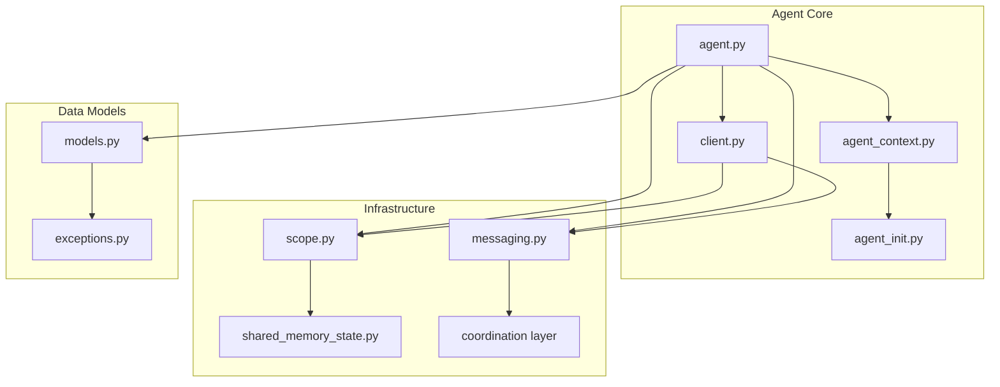
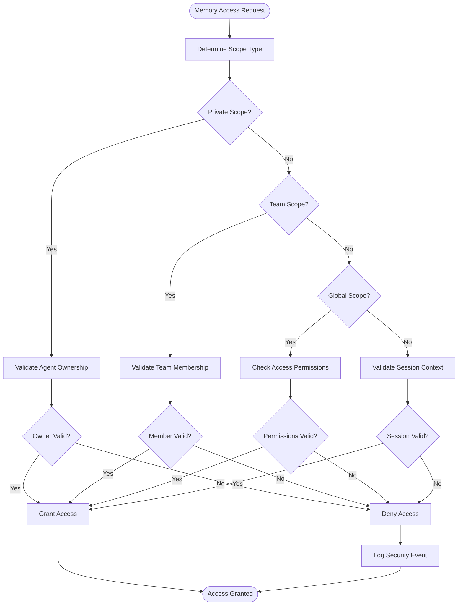
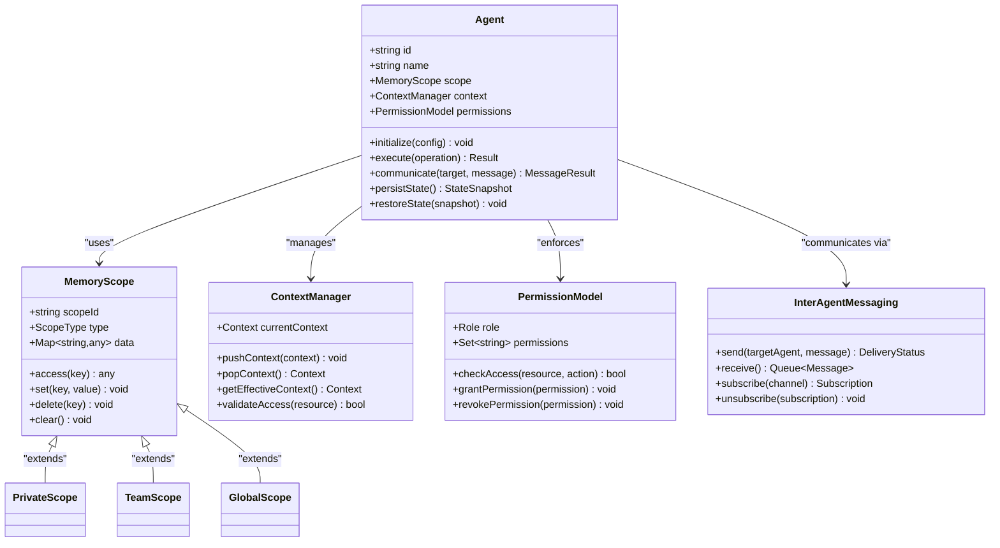
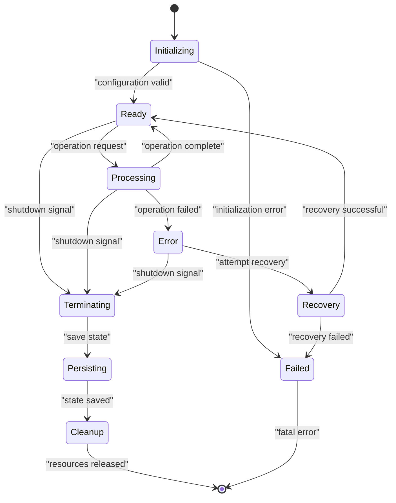
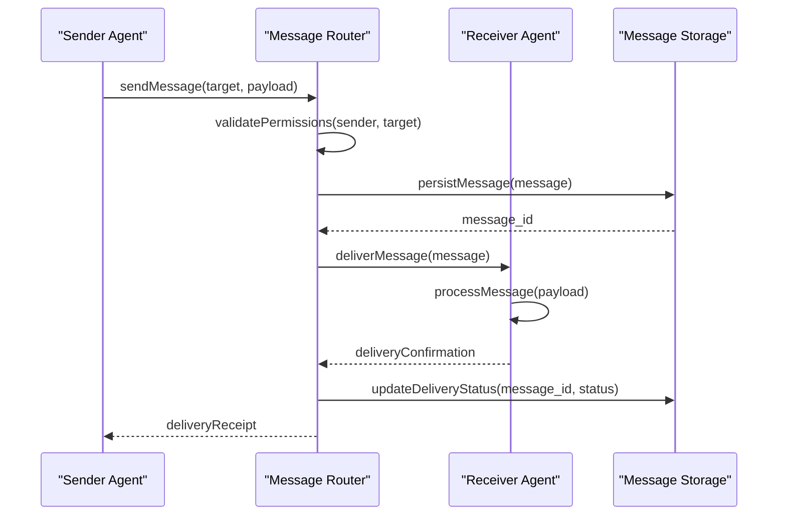
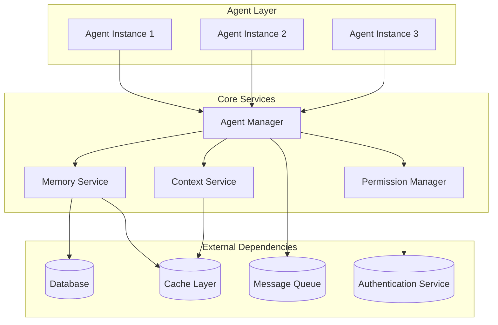

# Agent API

<cite>
**Referenced Files in This Document**
- [agent.py](file://agentic_memory/agent.py)
- [agent_context.py](file://agent_context.py)
- [agent_init.py](file://agent_init.py)
- [client.py](file://agentic_memory/client.py)
- [models.py](file://agentic_memory/models.py)
- [exceptions.py](file://agentic_memory/exceptions.py)
- [scope.py](file://infra/scope.py)
- [shared_memory_state.py](file://infra/shared_memory_state.py)
- [messaging.py](file://coordination/messaging.py)
- [security_model.md](file://docs/concepts/security-model.md)
- [multi_agent.md](file://docs/MULTI_AGENT.md)
</cite>

## Table of Contents
1. [Introduction](#introduction)
2. [Project Structure](#project-structure)
3. [Core Components](#core-components)
4. [Architecture Overview](#architecture-overview)
5. [Detailed Component Analysis](#detailed-component-analysis)
6. [Dependency Analysis](#dependency-analysis)
7. [Performance Considerations](#performance-considerations)
8. [Troubleshooting Guide](#troubleshooting-guide)
9. [Conclusion](#conclusion)
10. [Appendices](#appendices)

## Introduction

The Agentic Memory Agent API provides a comprehensive framework for building intelligent agents with scoped memory access, context management, and inter-agent communication capabilities. This API enables developers to create isolated agent instances that can collaborate while maintaining security boundaries and efficient memory scoping.

The Agent class serves as the primary interface for agent lifecycle management, offering features such as initialization, memory scoping, cross-agent communication, state persistence, and collaborative workflows. The system supports both single-agent and multi-agent scenarios with robust isolation mechanisms and permission models.

## Project Structure

The Agent API is organized across multiple modules to provide clear separation of concerns:



**Diagram sources**
- [agent.py:1-50](file://agentic_memory/agent.py#L1-L50)
- [agent_context.py:1-30](file://agent_context.py#L1-L30)
- [scope.py:1-40](file://infra/scope.py#L1-L40)

**Section sources**
- [agent.py:1-100](file://agentic_memory/agent.py#L1-L100)
- [README.md:1-50](file://README.md#L1-L50)

## Core Components

### Agent Class Architecture

The Agent class is the central component providing scoped memory access and context management. It implements several key patterns:

#### Initialization and Configuration
- **Constructor Parameters**: Agent ID, configuration options, memory scope settings
- **Context Setup**: Environment initialization and dependency injection
- **Permission Validation**: Role-based access control during initialization

#### Memory Scoping Mechanisms
- **Scope Isolation**: Each agent maintains separate memory contexts
- **Shared Memory Access**: Controlled access to shared memory spaces
- **Memory Inheritance**: Child agents can inherit parent scope configurations

#### Context Management
- **Thread Safety**: Concurrent access protection for agent contexts
- **Context Propagation**: Automatic context passing in nested operations
- **Lifecycle Hooks**: Pre/post operation callbacks for monitoring and auditing

**Section sources**
- [agent.py:25-150](file://agentic_memory/agent.py#L25-L150)
- [agent_context.py:15-80](file://agent_context.py#L15-L80)

### Memory Scope Management

The memory scoping system provides fine-grained control over data visibility and access patterns:

#### Scope Types
- **Private Scope**: Agent-specific memory inaccessible to other agents
- **Team Scope**: Shared memory within agent teams or groups
- **Global Scope**: System-wide accessible memory with appropriate permissions
- **Session Scope**: Temporary memory scoped to specific operations

#### Scope Resolution Algorithm


**Diagram sources**
- [scope.py:45-120](file://infra/scope.py#L45-L120)
- [shared_memory_state.py:30-90](file://infra/shared_memory_state.py#L30-L90)

**Section sources**
- [scope.py:1-200](file://infra/scope.py#L1-L200)
- [shared_memory_state.py:1-150](file://infra/shared_memory_state.py#L1-L150)

## Architecture Overview

The Agent API follows a layered architecture pattern with clear separation between core functionality, infrastructure services, and external integrations:



**Diagram sources**
- [agent.py:100-300](file://agentic_memory/agent.py#L100-L300)
- [scope.py:80-200](file://infra/scope.py#L80-L200)
- [messaging.py:50-150](file://coordination/messaging.py#L50-L150)

## Detailed Component Analysis

### Agent Lifecycle Management

The Agent class implements a comprehensive lifecycle management system:

#### Initialization Phase
1. **Configuration Loading**: Parse and validate agent configuration
2. **Resource Allocation**: Initialize memory scopes and context managers
3. **Permission Setup**: Apply role-based access controls
4. **State Restoration**: Load persisted state if available

#### Operational Phase
1. **Request Processing**: Handle agent operations with proper scoping
2. **Context Propagation**: Maintain consistent context across operations
3. **Memory Operations**: Execute read/write operations within scope boundaries
4. **Communication Handling**: Process inter-agent messages securely

#### Termination Phase
1. **Graceful Shutdown**: Complete pending operations and flush buffers
2. **State Persistence**: Save agent state for future restoration
3. **Resource Cleanup**: Release allocated resources and connections
4. **Audit Logging**: Record final operational metrics and events



**Diagram sources**
- [agent.py:200-400](file://agentic_memory/agent.py#L200-L400)
- [agent_init.py:50-150](file://agent_init.py#L50-L150)

**Section sources**
- [agent.py:150-500](file://agentic_memory/agent.py#L150-L500)
- [agent_init.py:1-200](file://agent_init.py#L1-L200)

### Cross-Agent Communication Patterns

The messaging system supports multiple communication patterns:

#### Direct Messaging
- **Point-to-Point**: Direct communication between specific agents
- **Request-Response**: Synchronous message exchange with timeout handling
- **Fire-and-Forget**: Asynchronous message delivery without response expectation

#### Broadcast Communication
- **Topic-Based**: Publish-subscribe model for one-to-many communication
- **Event-Driven**: Event propagation across agent networks
- **Channel-Based**: Organized communication channels for different purposes

#### Message Routing and Delivery


**Diagram sources**
- [messaging.py:100-250](file://coordination/messaging.py#L100-L250)
- [client.py:150-300](file://agentic_memory/client.py#L150-L300)

**Section sources**
- [messaging.py:1-300](file://coordination/messaging.py#L1-L300)
- [client.py:1-400](file://agentic_memory/client.py#L1-L400)

### Security and Permission Model

The security model implements comprehensive access control:

#### Principal Authentication
- **Identity Verification**: Multi-factor authentication support
- **Token Management**: Secure token generation and validation
- **Session Handling**: Persistent session management with expiration

#### Authorization Framework
- **Role-Based Access Control (RBAC)**: Hierarchical role definitions
- **Attribute-Based Access Control (ABAC)**: Context-aware authorization decisions
- **Policy Enforcement**: Centralized policy evaluation engine

#### Data Protection
- **Encryption at Rest**: Transparent encryption for sensitive data
- **Encryption in Transit**: TLS enforcement for all communications
- **Audit Trail**: Comprehensive logging of all security events

**Section sources**
- [security_model.md:1-100](file://docs/concepts/security-model.md#L1-L100)
- [exceptions.py:1-100](file://agentic_memory/exceptions.py#L1-L100)

## Dependency Analysis

The Agent API has well-defined dependencies and integration points:



**Diagram sources**
- [client.py:200-400](file://agentic_memory/client.py#L200-L400)
- [scope.py:150-300](file://infra/scope.py#L150-L300)

**Section sources**
- [client.py:100-500](file://agentic_memory/client.py#L100-L500)
- [models.py:1-200](file://agentic_memory/models.py#L1-L200)

## Performance Considerations

### Memory Optimization
- **Lazy Loading**: Deferred loading of large memory objects
- **Caching Strategies**: Multi-level caching with configurable TTL
- **Garbage Collection**: Intelligent cleanup of unused memory segments

### Concurrency Control
- **Lock-Free Algorithms**: Optimistic concurrency for high-throughput scenarios
- **Batch Operations**: Grouped memory operations for improved efficiency
- **Connection Pooling**: Reusable database and network connections

### Scalability Features
- **Horizontal Scaling**: Stateless agent design for easy distribution
- **Load Balancing**: Automatic workload distribution across agent instances
- **Failover Support**: Graceful degradation during partial failures

## Troubleshooting Guide

### Common Issues and Solutions

#### Agent Initialization Failures
- **Configuration Errors**: Validate configuration file syntax and required fields
- **Permission Denied**: Check user roles and resource access policies
- **Resource Exhaustion**: Monitor system resources and adjust limits

#### Memory Access Problems
- **Scope Violations**: Verify agent has appropriate permissions for target scope
- **Data Corruption**: Run integrity checks and restore from backups
- **Performance Degradation**: Analyze memory usage patterns and optimize queries

#### Communication Issues
- **Message Delivery Failures**: Check network connectivity and queue health
- **Timeout Errors**: Adjust timeout configurations based on operation complexity
- **Deadlock Detection**: Enable deadlock detection and implement retry logic

**Section sources**
- [exceptions.py:50-200](file://agentic_memory/exceptions.py#L50-L200)
- [multi_agent.md:1-150](file://docs/MULTI_AGENT.md#L1-L150)

## Conclusion

The Agentic Memory Agent API provides a robust foundation for building sophisticated multi-agent systems with advanced memory management, secure communication, and comprehensive lifecycle support. The modular architecture enables flexible deployment patterns while maintaining strong isolation guarantees and performance characteristics.

Key strengths include:
- **Comprehensive Security Model**: Multi-layered authentication and authorization
- **Flexible Memory Scoping**: Fine-grained control over data visibility
- **Robust Communication Patterns**: Multiple messaging strategies for different use cases
- **Operational Excellence**: Extensive monitoring, logging, and troubleshooting capabilities

The API is designed to scale from simple single-agent applications to complex multi-agent ecosystems while maintaining consistency, reliability, and security across all deployment scenarios.

## Appendices

### Quick Start Examples

#### Basic Agent Creation
```python
# Example path reference only - see source files for actual implementation
# [agent.py:50-100](file://agentic_memory/agent.py#L50-L100)
```

#### Setting Up Memory Scopes
```python
# Example path reference only - see source files for actual implementation  
# [scope.py:100-200](file://infra/scope.py#L100-L200)
```

#### Implementing Agent Collaboration
```python
# Example path reference only - see source files for actual implementation
# [messaging.py:150-250](file://coordination/messaging.py#L150-L250)
```

### API Reference Links

For detailed API documentation, refer to the following source files:
- [Agent Class Definition:1-500](file://agentic_memory/agent.py#L1-L500)
- [Memory Scope Interface:1-300](file://infra/scope.py#L1-L300)
- [Messaging Protocol:1-300](file://coordination/messaging.py#L1-L300)
- [Security Model:1-200](file://docs/concepts/security-model.md#L1-L200)