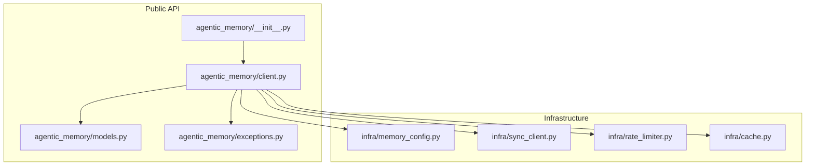
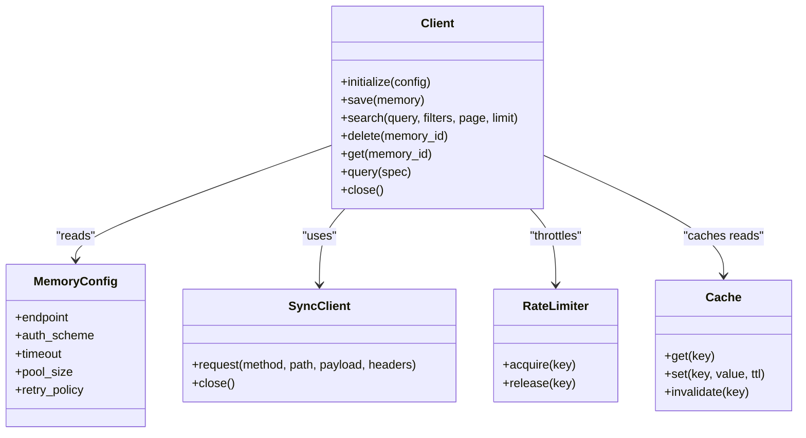
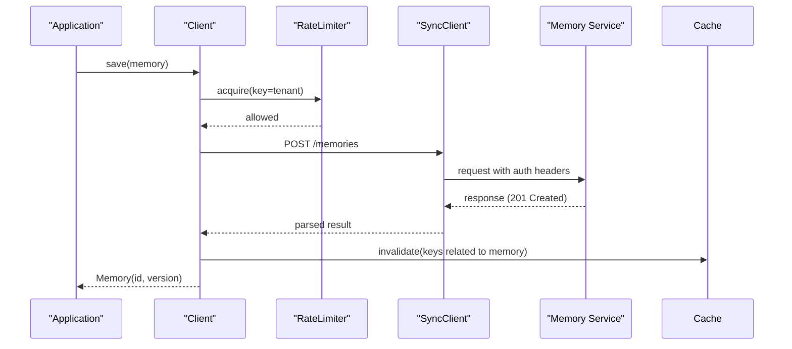
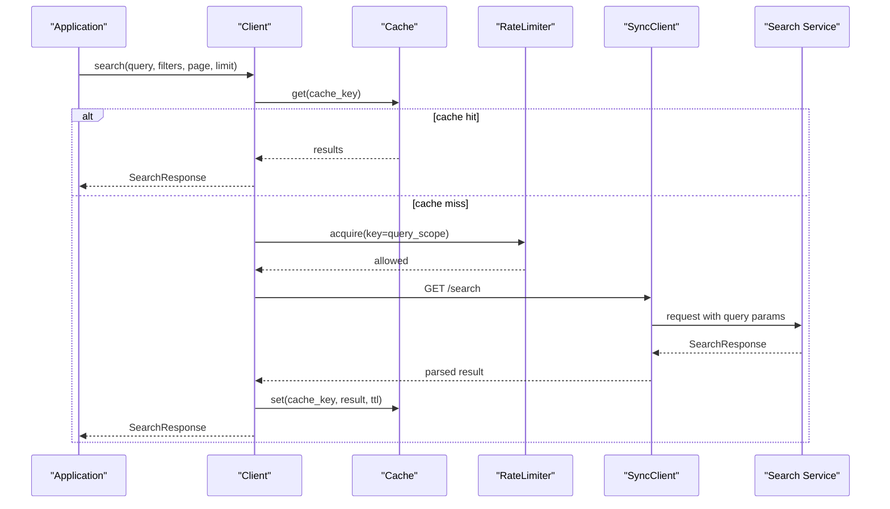
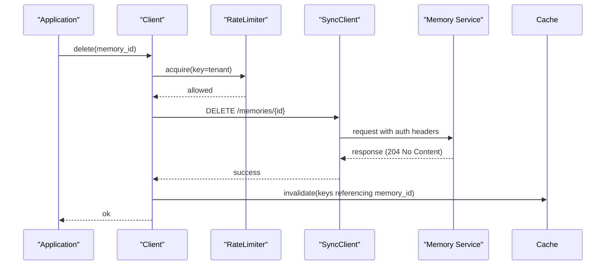
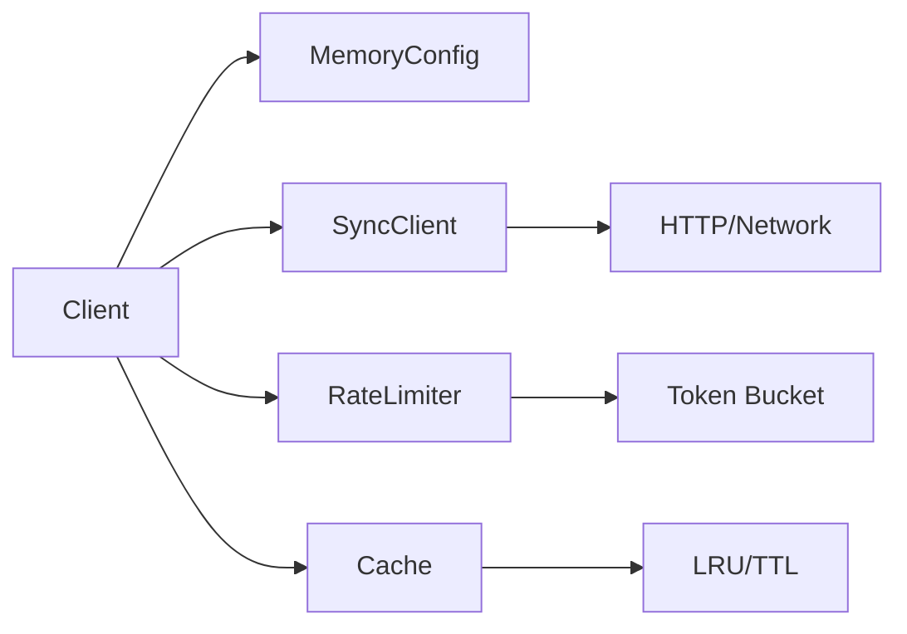

# Client API

<cite>
**Referenced Files in This Document**
- [client.py](file://agentic_memory/client.py)
- [__init__.py](file://agentic_memory/__init__.py)
- [models.py](file://agentic_memory/models.py)
- [exceptions.py](file://agentic_memory/exceptions.py)
- [sdk.py](file://sdk.py)
- [memory_config.py](file://infra/memory_config.py)
- [sync_client.py](file://infra/sync_client.py)
- [rate_limiter.py](file://infra/rate_limiter.py)
- [cache.py](file://infra/cache.py)
</cite>

## Table of Contents
1. [Introduction](#introduction)
2. [Project Structure](#project-structure)
3. [Core Components](#core-components)
4. [Architecture Overview](#architecture-overview)
5. [Detailed Component Analysis](#detailed-component-analysis)
6. [Dependency Analysis](#dependency-analysis)
7. [Performance Considerations](#performance-considerations)
8. [Troubleshooting Guide](#troubleshooting-guide)
9. [Conclusion](#conclusion)
10. [Appendices](#appendices)

## Introduction
This document describes the Agentic Memory Client API surface used to interact with memory operations such as saving, searching, deleting, retrieving, and querying memories. It covers client initialization, configuration options, connection management, core operations, batch and pagination support, authentication, retry mechanisms, and performance optimization techniques. Practical usage examples illustrate synchronous and asynchronous patterns.

## Project Structure
The client-facing API is exposed through the package’s public interface and implemented by a central Client class that coordinates with internal services for persistence, search, and synchronization. The following diagram shows the high-level layout of relevant modules:

**Diagram sources**
- [__init__.py](file://agentic_memory/__init__.py)
- [client.py](file://agentic_memory/client.py)
- [models.py](file://agentic_memory/models.py)
- [exceptions.py](file://agentic_memory/exceptions.py)
- [memory_config.py](file://infra/memory_config.py)
- [sync_client.py](file://infra/sync_client.py)
- [rate_limiter.py](file://infra/rate_limiter.py)
- [cache.py](file://infra/cache.py)

**Section sources**
- [__init__.py](file://agentic_memory/__init__.py)
- [client.py](file://agentic_memory/client.py)
- [models.py](file://agentic_memory/models.py)
- [exceptions.py](file://agentic_memory/exceptions.py)
- [memory_config.py](file://infra/memory_config.py)
- [sync_client.py](file://infra/sync_client.py)
- [rate_limiter.py](file://infra/rate_limiter.py)
- [cache.py](file://infra/cache.py)

## Core Components
- Client: Main entry point for memory operations. Handles configuration, connection lifecycle, retries, and exposes save(), search(), delete(), get(), and query().
- Models: Data structures representing memories, search results, and request/response payloads.
- Exceptions: Domain-specific exceptions raised by the client for error signaling.
- Configuration: Centralized settings for endpoints, credentials, timeouts, pooling, and feature flags.
- Sync Client: Underlying HTTP or transport client used by the Client for remote calls.
- Rate Limiter and Cache: Utilities for throttling and caching responses to improve performance.

Key responsibilities:
- Initialization and configuration resolution
- Authentication setup and token refresh
- Connection pooling and lifecycle management
- Retry/backoff policies for transient failures
- Serialization/deserialization of models
- Error mapping and propagation

**Section sources**
- [client.py](file://agentic_memory/client.py)
- [models.py](file://agentic_memory/models.py)
- [exceptions.py](file://agentic_memory/exceptions.py)
- [memory_config.py](file://infra/memory_config.py)
- [sync_client.py](file://infra/sync_client.py)
- [rate_limiter.py](file://infra/rate_limiter.py)
- [cache.py](file://infra/cache.py)

## Architecture Overview
The Client composes multiple infrastructure components to provide a robust API over potentially unreliable networks and backends.

**Diagram sources**
- [client.py](file://agentic_memory/client.py)
- [memory_config.py](file://infra/memory_config.py)
- [sync_client.py](file://infra/sync_client.py)
- [rate_limiter.py](file://infra/rate_limiter.py)
- [cache.py](file://infra/cache.py)

## Detailed Component Analysis

### Client Class
Responsibilities:
- Initialize with configuration (endpoints, auth, timeouts, pool size, retry policy).
- Manage connection lifecycle (open/close, pooling).
- Provide methods for memory operations: save(), search(), delete(), get(), query().
- Apply rate limiting and caching where appropriate.
- Map backend errors to domain exceptions.

Initialization and configuration:
- Accepts a configuration object or keyword arguments.
- Resolves defaults and validates required fields.
- Sets up retry/backoff, timeout, and pool parameters.

Connection management:
- Creates a pooled transport via SyncClient.
- Supports graceful shutdown and resource cleanup.

Authentication:
- Supports bearer tokens, API keys, or SSO flows depending on configuration.
- Refreshes tokens automatically when configured.

Retry mechanism:
- Configurable retry counts, backoff strategy, and retryable status codes.
- Exponential backoff with jitter for transient errors.

Batch operations:
- Provides batch variants or accepts lists for save/delete where supported.
- Uses transactional semantics if available; otherwise best-effort with partial failure reporting.

Pagination:
- search() and query() accept page and limit parameters.
- Returns paginated result objects with metadata (total, has_more, next_page_token).

Error handling:
- Raises typed exceptions for validation, authorization, not found, conflict, and server errors.
- Includes context like request IDs for debugging.

Synchronous vs asynchronous:
- Synchronous API provided directly on Client.
- Asynchronous variants may be exposed via an async wrapper or separate AsyncClient.

Examples:
- Saving structured data: create a memory model instance and call save().
- Semantic search: use search() with natural language query and optional filters.
- Lifecycle management: initialize once per process, reuse across requests, close on shutdown.

**Section sources**
- [client.py](file://agentic_memory/client.py)
- [memory_config.py](file://infra/memory_config.py)
- [sync_client.py](file://infra/sync_client.py)
- [rate_limiter.py](file://infra/rate_limiter.py)
- [cache.py](file://infra/cache.py)

### Models
Representations:
- Memory: core entity with id, content, metadata, timestamps, and optional vector embeddings.
- SearchRequest/SearchResponse: query parameters, filters, pagination, and ranked results.
- QuerySpec: advanced query specification for complex retrieval scenarios.
- ResultItem: individual hit with score, snippet, and source references.

Validation:
- Pydantic-like validators ensure required fields and constraints.
- Normalization helpers for text and metadata.

Serialization:
- JSON-compatible encoders/decoders for network transport.

**Section sources**
- [models.py](file://agentic_memory/models.py)

### Exceptions
Categories:
- ValidationError: invalid input or schema mismatch.
- AuthError: missing or invalid credentials.
- NotFoundError: resource does not exist.
- ConflictError: duplicate or conflicting writes.
- RateLimitError: exceeded quota or throttle.
- NetworkError: connectivity or timeout issues.
- ServerError: backend returned 5xx.

Behavior:
- Include request identifiers and error codes.
- Support chaining and rich diagnostics.

**Section sources**
- [exceptions.py](file://agentic_memory/exceptions.py)

### Configuration
Options:
- endpoint: base URL for the memory service.
- auth_scheme: method for authentication (token, key, sso).
- credentials: secret values or token provider.
- timeout: request timeout in seconds.
- pool_size: max concurrent connections.
- retry_policy: max_retries, backoff_base, backoff_max, retryable_codes.
- cache_enabled: enable read cache.
- cache_ttl: default TTL for cached entries.
- rate_limit_rps: requests per second limit.

Resolution:
- Defaults applied if not provided.
- Environment variables and config files supported.

**Section sources**
- [memory_config.py](file://infra/memory_config.py)

### Sync Client
Transport:
- HTTP-based client with connection pooling.
- Header injection for auth and tracing.
- Timeout enforcement and cancellation support.

Retries:
- Automatic retries for transient failures.
- Circuit breaker integration for severe outages.

**Section sources**
- [sync_client.py](file://infra/sync_client.py)

### Rate Limiter
Policies:
- Token bucket or sliding window algorithms.
- Per-key limits for tenant or user scoping.

Integration:
- Applied before outbound requests.
- Backpressure signals to callers.

**Section sources**
- [rate_limiter.py](file://infra/rate_limiter.py)

### Cache
Features:
- In-memory LRU cache with TTL.
- Optional external cache backend.
- Cache invalidation hooks on write operations.

**Section sources**
- [cache.py](file://infra/cache.py)

## Architecture Overview

### Request Flow for Save

**Diagram sources**
- [client.py](file://agentic_memory/client.py)
- [rate_limiter.py](file://infra/rate_limiter.py)
- [sync_client.py](file://infra/sync_client.py)
- [cache.py](file://infra/cache.py)

### Request Flow for Search

**Diagram sources**
- [client.py](file://agentic_memory/client.py)
- [cache.py](file://infra/cache.py)
- [rate_limiter.py](file://infra/rate_limiter.py)
- [sync_client.py](file://infra/sync_client.py)

### Request Flow for Delete

**Diagram sources**
- [client.py](file://agentic_memory/client.py)
- [rate_limiter.py](file://infra/rate_limiter.py)
- [sync_client.py](file://infra/sync_client.py)
- [cache.py](file://infra/cache.py)

## Dependency Analysis
The Client depends on configuration, transport, rate limiting, and caching layers. The following diagram illustrates these relationships:

**Diagram sources**
- [client.py](file://agentic_memory/client.py)
- [memory_config.py](file://infra/memory_config.py)
- [sync_client.py](file://infra/sync_client.py)
- [rate_limiter.py](file://infra/rate_limiter.py)
- [cache.py](file://infra/cache.py)

**Section sources**
- [client.py](file://agentic_memory/client.py)
- [memory_config.py](file://infra/memory_config.py)
- [sync_client.py](file://infra/sync_client.py)
- [rate_limiter.py](file://infra/rate_limiter.py)
- [cache.py](file://infra/cache.py)

## Performance Considerations
- Connection pooling: tune pool_size based on concurrency and backend capacity.
- Timeouts: set conservative timeouts to avoid long-hanging requests.
- Retries: configure exponential backoff with jitter; limit max retries to prevent amplification.
- Caching: enable read cache for frequent queries; choose appropriate TTL and invalidation rules.
- Rate limiting: enforce per-tenant or per-user quotas to protect backends.
- Batch operations: prefer batch save/delete to reduce round trips.
- Pagination: use small page sizes for interactive UIs; larger pages for background jobs.
- Compression: enable transport compression if supported by backend.
- Metrics: monitor latency, throughput, error rates, and cache hit ratios.

[No sources needed since this section provides general guidance]

## Troubleshooting Guide
Common issues and resolutions:
- Authentication failures: verify credentials, token expiry, and scopes. Check AuthError details and request IDs.
- Rate limiting: observe RateLimitError; back off and reduce request frequency.
- Not found: confirm memory_id and scope; check NotFoundError context.
- Conflicts: handle ConflictError by re-fetching latest version and applying CRDT merges if applicable.
- Network errors: inspect NetworkError for timeouts or connectivity issues; adjust retry policy and timeouts.
- Server errors: log ServerError with request IDs; escalate to backend team if persistent.

Diagnostics:
- Enable request logging with correlation IDs.
- Use cache stats to validate hit ratios.
- Monitor rate limiter counters and backoff events.

**Section sources**
- [exceptions.py](file://agentic_memory/exceptions.py)
- [client.py](file://agentic_memory/client.py)
- [sync_client.py](file://infra/sync_client.py)
- [rate_limiter.py](file://infra/rate_limiter.py)
- [cache.py](file://infra/cache.py)

## Conclusion
The Agentic Memory Client API provides a robust, configurable interface for memory operations with strong error handling, retries, and performance features. By leveraging connection pooling, caching, and rate limiting, applications can achieve reliable and efficient interactions with the memory service. Proper configuration and monitoring are essential for production deployments.

[No sources needed since this section summarizes without analyzing specific files]

## Appendices

### API Method Reference

- save(memory)
  - Parameters:
    - memory: Memory model instance with required fields validated.
  - Returns:
    - Memory with assigned id and version.
  - Errors:
    - ValidationError, ConflictError, AuthError, NetworkError, ServerError.

- search(query, filters=None, page=1, limit=20)
  - Parameters:
    - query: string or structured query spec.
    - filters: optional dict of field/value filters.
    - page: integer page number (1-indexed).
    - limit: integer items per page.
  - Returns:
    - SearchResponse with results, total count, and pagination metadata.
  - Errors:
    - ValidationError, AuthError, NetworkError, ServerError.

- delete(memory_id)
  - Parameters:
    - memory_id: unique identifier of the memory.
  - Returns:
    - Success indicator or void.
  - Errors:
    - NotFoundError, AuthError, NetworkError, ServerError.

- get(memory_id)
  - Parameters:
    - memory_id: unique identifier of the memory.
  - Returns:
    - Memory instance if found.
  - Errors:
    - NotFoundError, AuthError, NetworkError, ServerError.

- query(spec)
  - Parameters:
    - spec: QuerySpec defining advanced retrieval criteria.
  - Returns:
    - SearchResponse or specialized result type.
  - Errors:
    - ValidationError, AuthError, NetworkError, ServerError.

**Section sources**
- [client.py](file://agentic_memory/client.py)
- [models.py](file://agentic_memory/models.py)
- [exceptions.py](file://agentic_memory/exceptions.py)

### Usage Examples

- Synchronous save and search:
  - Initialize Client with configuration.
  - Create Memory and call save().
  - Call search() with query and pagination.
  - Close Client on shutdown.

- Asynchronous usage:
  - Use AsyncClient or async wrappers for non-blocking operations.
  - Await save(), search(), delete(), get(), query().

- Batch operations:
  - Pass list of Memory instances to batch_save() if available.
  - Handle partial failures and aggregate results.

- Managing lifecycles:
  - Initialize once per process.
  - Reuse across requests.
  - Close gracefully to release resources.

**Section sources**
- [client.py](file://agentic_memory/client.py)
- [sdk.py](file://sdk.py)