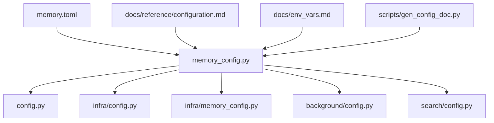
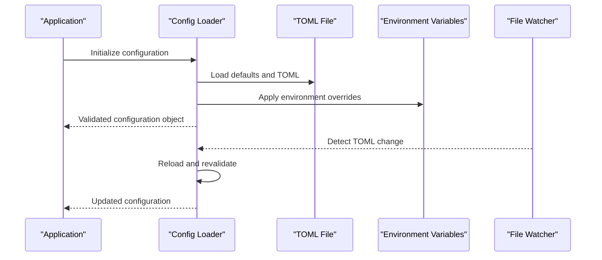
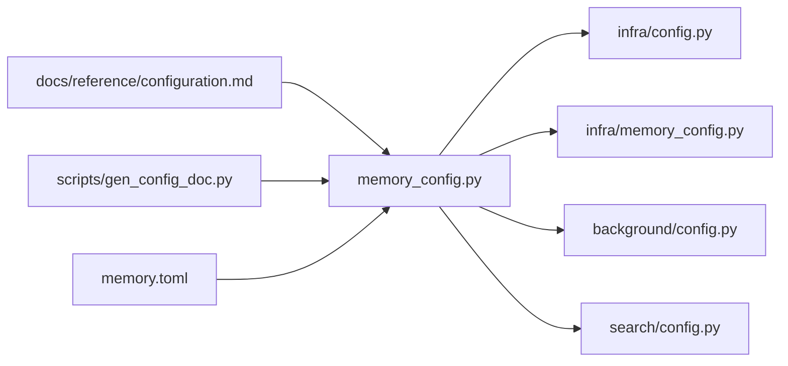

# Configuration

<cite>
**Referenced Files in This Document**
- [memory_config.py](file://memory_config.py)
- [config.py](file://config.py)
- [infra/config.py](file://infra/config.py)
- [infra/memory_config.py](file://infra/memory_config.py)
- [background/config.py](file://background/config.py)
- [search/config.py](file://search/config.py)
- [memory.toml](file://memory.toml)
- [docs/reference/configuration.md](file://docs/reference/configuration.md)
- [docs/env_vars.md](file://docs/env_vars.md)
- [scripts/gen_config_doc.py](file://scripts/gen_config_doc.py)
</cite>

## Table of Contents
1. [Introduction](#introduction)
2. [Project Structure](#project-structure)
3. [Core Components](#core-components)
4. [Architecture Overview](#architecture-overview)
5. [Detailed Component Analysis](#detailed-component-analysis)
6. [Dependency Analysis](#dependency-analysis)
7. [Performance Considerations](#performance-considerations)
8. [Troubleshooting Guide](#troubleshooting-guide)
9. [Conclusion](#conclusion)
10. [Appendices](#appendices)

## Introduction
This document provides comprehensive configuration guidance for the Python SDK and its runtime components. It covers environment variables, TOML configuration files, programmatic configuration methods, authentication settings, connection parameters, security configurations, search tuning, embedding model parameters, and performance optimizations. It also includes deployment templates for development, staging, and production environments, explains validation and defaults, and offers troubleshooting guidance for common issues.

## Project Structure
Configuration is implemented across multiple modules:
- Top-level memory configuration loader and schema definitions
- Infrastructure configuration utilities and watchers
- Background worker configuration
- Search pipeline configuration
- Documentation and generation scripts for configuration reference

**Diagram sources**
- [memory_config.py](file://memory_config.py)
- [config.py](file://config.py)
- [infra/config.py](file://infra/config.py)
- [infra/memory_config.py](file://infra/memory_config.py)
- [background/config.py](file://background/config.py)
- [search/config.py](file://search/config.py)
- [memory.toml](file://memory.toml)
- [docs/reference/configuration.md](file://docs/reference/configuration.md)
- [docs/env_vars.md](file://docs/env_vars.md)
- [scripts/gen_config_doc.py](file://scripts/gen_config_doc.py)

**Section sources**
- [memory_config.py](file://memory_config.py)
- [config.py](file://config.py)
- [infra/config.py](file://infra/config.py)
- [infra/memory_config.py](file://infra/memory_config.py)
- [background/config.py](file://background/config.py)
- [search/config.py](file://search/config.py)
- [memory.toml](file://memory.toml)
- [docs/reference/configuration.md](file://docs/reference/configuration.md)
- [docs/env_vars.md](file://docs/env_vars.md)
- [scripts/gen_config_doc.py](file://scripts/gen_config_doc.py)

## Core Components
- Memory configuration loader: centralizes loading from TOML and environment variables, validates fields, and exposes typed accessors.
- Infrastructure config helpers: provide shared utilities for reading configuration, watching file changes, and resolving overrides.
- Background worker config: defines task queue, retention, and scheduling-related options.
- Search config: encapsulates retrieval strategy, reranking, chunking, and vector index tuning.
- Documentation and generator: maintain human-readable references and auto-generate configuration docs from code.

Key responsibilities:
- Define default values and validation rules
- Resolve precedence (environment > TOML > defaults)
- Provide programmatic APIs to read and override at runtime
- Surface configuration drift detection and hot reload where applicable

**Section sources**
- [memory_config.py](file://memory_config.py)
- [infra/config.py](file://infra/config.py)
- [infra/memory_config.py](file://infra/memory_config.py)
- [background/config.py](file://background/config.py)
- [search/config.py](file://search/config.py)

## Architecture Overview
The configuration system follows a layered approach:
- Defaults are defined in code
- TOML file(s) supply project-specific settings
- Environment variables override both defaults and TOML
- Runtime overrides can be applied programmatically
- Optional watchers detect TOML changes and trigger reloads or audits

**Diagram sources**
- [memory_config.py](file://memory_config.py)
- [infra/config.py](file://infra/config.py)
- [infra/memory_config.py](file://infra/memory_config.py)
- [memory.toml](file://memory.toml)

## Detailed Component Analysis

### Memory Configuration Loader
Responsibilities:
- Parse and validate TOML sections for database, embeddings, search, background tasks, and security
- Merge with environment variables using explicit precedence rules
- Expose typed getters and setters for programmatic access
- Support hot reload via watcher integration

Highlights:
- Centralized schema definition ensures consistent defaults and validation
- Clear separation between immutable defaults and mutable runtime overrides
- Integration with drift detection and audit logging

**Section sources**
- [memory_config.py](file://memory_config.py)
- [infra/memory_config.py](file://infra/memory_config.py)

### Infrastructure Config Utilities
Responsibilities:
- Shared functions for reading configuration values
- File watching and change notification
- Safe resolution of nested configuration keys
- Logging and metrics hooks for configuration events

Highlights:
- Robust error handling for missing files or malformed TOML
- Consistent key naming conventions across modules
- Extensible plugin points for custom loaders

**Section sources**
- [infra/config.py](file://infra/config.py)
- [infra/memory_config.py](file://infra/memory_config.py)

### Background Worker Configuration
Responsibilities:
- Define concurrency limits, queue backpressure, and retry policies
- Configure retention windows, purging schedules, and adaptive strategies
- Set up health checks and watchdog behaviors

Highlights:
- Tunable parameters for throughput vs. resource usage trade-offs
- Safety guards against runaway workers or excessive memory consumption
- Integration with cron and scheduler subsystems

**Section sources**
- [background/config.py](file://background/config.py)

### Search Pipeline Configuration
Responsibilities:
- Control retrieval strategies (BM25, vector, hybrid)
- Configure rerankers, chunk sizes, and query expansion
- Tune vector index parameters and caching behavior

Highlights:
- Modular reranker selection with fallbacks
- Query-time budget controls and latency targets
- Index rebuild triggers and incremental updates

**Section sources**
- [search/config.py](file://search/config.py)

### TOML Configuration File
Purpose:
- Provide declarative, versioned configuration for deployments
- Organize settings by domain (database, embeddings, search, background, security)
- Serve as source of truth for non-secret settings

Guidelines:
- Keep secrets out of TOML; use environment variables for sensitive values
- Use clear section names matching loader expectations
- Validate with provided tools before deploying

**Section sources**
- [memory.toml](file://memory.toml)

### Documentation and Generation
Purpose:
- Maintain human-readable configuration reference
- Auto-generate documentation from code schemas
- Track environment variable reference

Highlights:
- Single source of truth in code with generated outputs
- Cross-references between docs and implementation
- Automated updates on schema changes

**Section sources**
- [docs/reference/configuration.md](file://docs/reference/configuration.md)
- [docs/env_vars.md](file://docs/env_vars.md)
- [scripts/gen_config_doc.py](file://scripts/gen_config_doc.py)

## Dependency Analysis
Configuration modules depend on each other through well-defined interfaces:
- Loader depends on infrastructure utilities for parsing and watching
- Background and search configs consume shared infrastructure helpers
- Documentation depends on loader schemas for accuracy

**Diagram sources**
- [memory_config.py](file://memory_config.py)
- [infra/config.py](file://infra/config.py)
- [infra/memory_config.py](file://infra/memory_config.py)
- [background/config.py](file://background/config.py)
- [search/config.py](file://search/config.py)
- [docs/reference/configuration.md](file://docs/reference/configuration.md)
- [scripts/gen_config_doc.py](file://scripts/gen_config_doc.py)
- [memory.toml](file://memory.toml)

**Section sources**
- [memory_config.py](file://memory_config.py)
- [infra/config.py](file://infra/config.py)
- [infra/memory_config.py](file://infra/memory_config.py)
- [background/config.py](file://background/config.py)
- [search/config.py](file://search/config.py)
- [docs/reference/configuration.md](file://docs/reference/configuration.md)
- [scripts/gen_config_doc.py](file://scripts/gen_config_doc.py)
- [memory.toml](file://memory.toml)

## Performance Considerations
- Embedding models: choose model size and batch size based on available CPU/GPU resources; enable caching where supported
- Search tuning: adjust chunk sizes, reranker selection, and cache TTL to balance recall and latency
- Background workers: set concurrency limits aligned with hardware capacity; monitor queue depth and tail latencies
- Database connections: tune pool sizes and timeouts to match workload patterns; avoid over-provisioning
- Hot reload: limit frequency of TOML reloads in production to reduce overhead; prefer rolling restarts when necessary

[No sources needed since this section provides general guidance]

## Troubleshooting Guide
Common issues and resolutions:
- Missing or invalid TOML: verify syntax and required sections; use validation tooling before deployment
- Environment variable conflicts: ensure precedence rules are understood; check for typos and case sensitivity
- Authentication failures: confirm credentials and scopes; validate token lifetimes and endpoint URLs
- Connection errors: inspect network reachability, TLS settings, and proxy configurations
- Search degradation: review reranker logs, vector index health, and query budgets
- Drift detection alerts: reconcile configuration differences between environments; apply policy patches if allowed

Operational tips:
- Enable detailed logging for configuration load and reload events
- Monitor metrics around configuration changes and their impact on latency and error rates
- Use staged rollouts for configuration updates; validate with smoke tests

**Section sources**
- [memory_config.py](file://memory_config.py)
- [infra/config.py](file://infra/config.py)
- [infra/memory_config.py](file://infra/memory_config.py)
- [background/config.py](file://background/config.py)
- [search/config.py](file://search/config.py)
- [docs/reference/configuration.md](file://docs/reference/configuration.md)
- [docs/env_vars.md](file://docs/env_vars.md)

## Conclusion
The configuration system provides a robust, extensible foundation for managing settings across environments. By adhering to the documented precedence rules, leveraging environment variables for secrets, and using TOML for declarative settings, teams can achieve consistent, auditable, and high-performance deployments. The included diagrams and references help visualize flows and dependencies, while troubleshooting guidance accelerates issue resolution.

[No sources needed since this section summarizes without analyzing specific files]

## Appendices

### Deployment Templates
- Development: minimal concurrency, local database paths, verbose logging, relaxed safety checks
- Staging: moderate concurrency, dedicated DB instance, structured logging, enabled drift detection
- Production: tuned concurrency, hardened TLS, strict validation, monitoring and alerting enabled

[No sources needed since this section provides general guidance]

### Programmatic Configuration Methods
- Initialize configuration with defaults
- Override specific keys at runtime
- Subscribe to reload events for dynamic updates
- Validate configuration before applying critical changes

[No sources needed since this section provides general guidance]