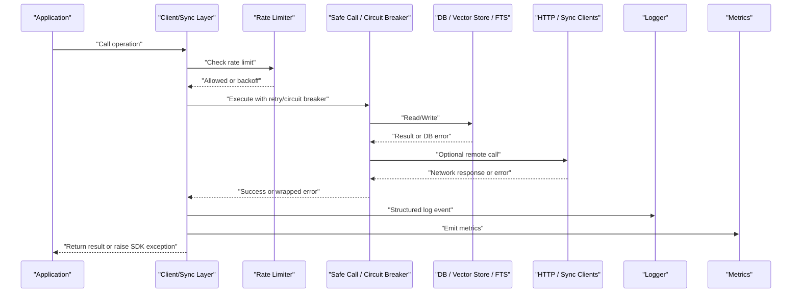
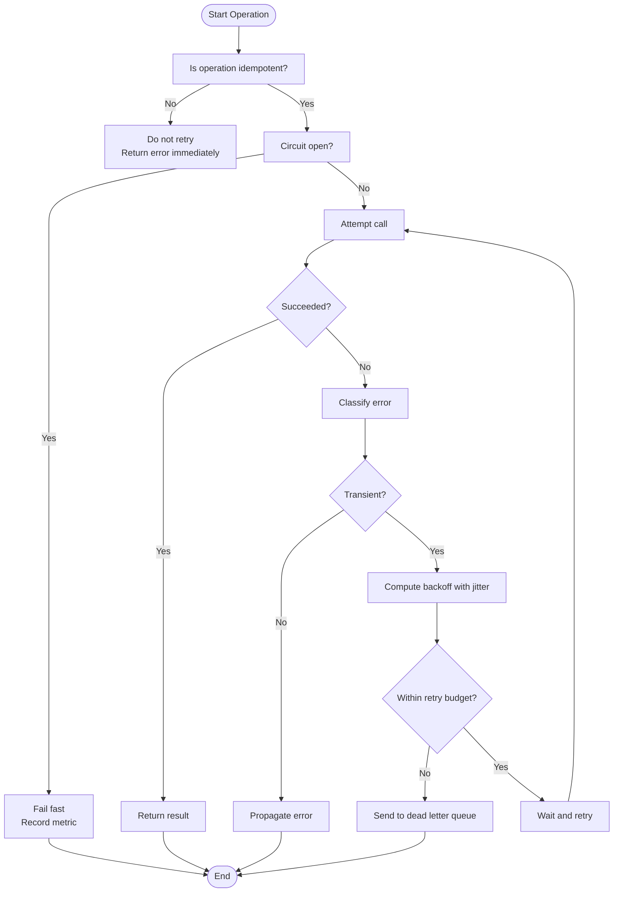
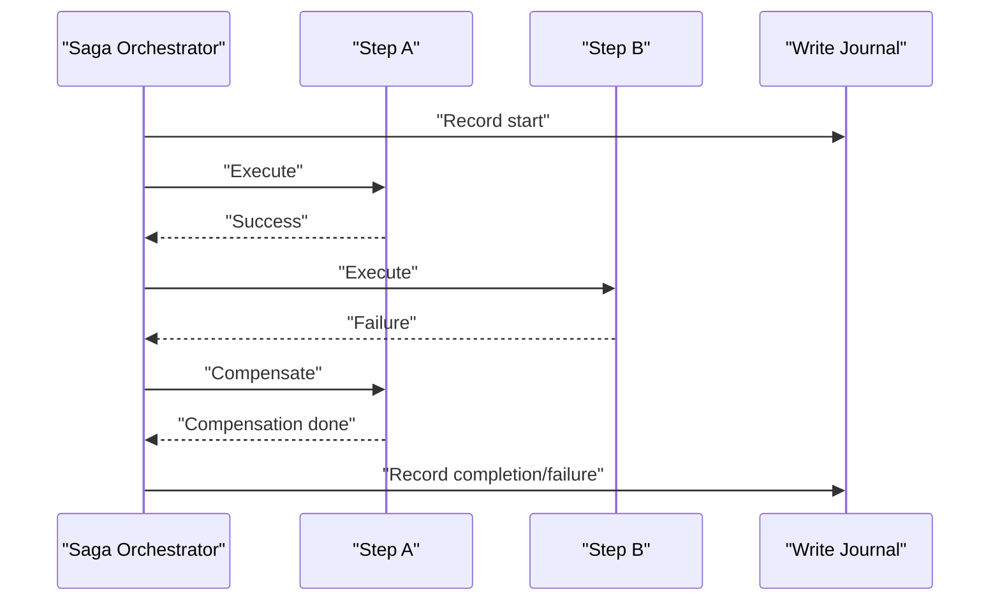
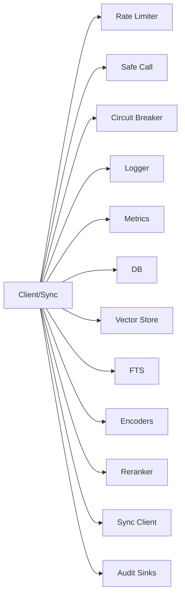

# Error Handling

<cite>
**Referenced Files in This Document**
- [agentic_memory/exceptions.py](file://agentic_memory/exceptions.py)
- [agentic_memory/client.py](file://agentic_memory/client.py)
- [agentic_memory/sync.py](file://agentic_memory/sync.py)
- [infra/rate_limiter.py](file://infra/rate_limiter.py)
- [infra/db.py](file://infra/db.py)
- [infra/log.py](file://infra/log.py)
- [infra/metrics.py](file://infra/metrics.py)
- [infra/error_counter.py](file://infra/error_counter.py)
- [infra/safe_call.py](file://infra/safe_call.py)
- [infra/circuit_breaker.py](file://background/circuit_breaker.py)
- [infra/saga.py](file://infra/saga.py)
- [infra/write_journal.py](file://infra/write_journal.py)
- [infra/pex_protocol.py](file://infra/pex_protocol.py)
- [infra/sync_client.py](file://infra/sync_client.py)
- [infra/sync_server.py](file://infra/sync_server.py)
- [infra/audit_sink_http.py](file://infra/audit_sink_http.py)
- [infra/audit_sink_file.py](file://infra/audit_sink_file.py)
- [infra/audit_sink_prom.py](file://infra/audit_sink_prom.py)
- [infra/lock_manager.py](file://infra/lock_manager.py)
- [infra/dist_lock.py](file://infra/dist_lock.py)
- [infra/file_lock.py](file://infra/file_lock.py)
- [infra/cache.py](file://infra/cache.py)
- [infra/vector_store.py](file://infra/vector_store.py)
- [infra/colbert_encoder.py](file://infra/colbert_encoder.py)
- [infra/splade_encoder.py](file://infra/splade_encoder.py)
- [infra/reranker.py](file://infra/reranker.py)
- [infra/embedding_search.py](file://infra/embedding_search.py)
- [infra/fts.py](file://infra/fts.py)
- [infra/memory_common.py](file://infra/memory_common.py)
- [infra/memory_config.py](file://infra/memory_config.py)
- [infra/config_drift.py](file://infra/config_drift.py)
- [infra/config_drift_policy.py](file://infra/config_drift_policy.py)
- [infra/config_drift_runtime.py](file://infra/config_drift_runtime.py)
- [infra/config_drift_tier_patch.py](file://infra/config_drift_tier_patch.py)
- [infra/gdpr.py](file://infra/gdpr.py)
- [infra/hash_utils.py](file://infra/hash_utils.py)
- [infra/mdns_discovery.py](file://infra/mdns_discovery.py)
- [infra/mcp_singleton.py](file://infra/mcp_singleton.py)
- [infra/policy_hash_cache.py](file://infra/policy_hash_cache.py)
- [infra/policy_hash_diff.py](file://infra/policy_hash_diff.py)
- [infra/policy_hash_fetcher.py](file://infra/policy_hash_fetcher.py)
- [infra/quality_gates.py](file://infra/quality_gates.py)
- [infra/shared_memory_state.py](file://infra/shared_memory_state.py)
- [infra/toml_watch.py](file://infra/toml_watch.py)
- [infra/tenant_query.py](file://infra/tenant_query.py)
- [infra/authlib_sso.py](file://infra/authlib_sso.py)
- [infra/authorizer.py](file://infra/authorizer.py)
- [infra/rbac.py](file://infra/rbac.py)
- [infra/sync_check.py](file://infra/sync_check.py)
- [infra/sync_invariant.py](file://infra/sync_invariant.py)
- [infra/sync_server_daemon.py](file://infra/sync_server_daemon.py)
- [infra/api_server.py](file://infra/api_server.py)
- [infra/alert.py](file://infra/alert.py)
- [infra/metrics_server.py](file://infra/metrics_server.py)
- [infra/infrastructure.py](file://infra/infrastructure.py)
- [infra/_bootstrap_path.py](file://infra/_bootstrap_path.py)
- [infra/_lazy_imports.py](file://infra/_lazy_imports.py)
- [infra/_shim.py](file://infra/_shim.py)
- [infra/agents_md_generator.py](file://infra/agents_md_generator.py)
- [infra/arc_cache.py](file://infra/arc_cache.py)
- [infra/db_migrations.py](file://infra/db_migrations.py)
- [infra/db_path_flock.py](file://infra/db_path_flock.py)
- [infra/db_write_queue.py](file://infra/db_write_queue.py)
- [infra/embedding_recompute.py](file://infra/embedding_recompute.py)
- [infra/error_counter.py](file://infra/error_counter.py)
- [infra/file_lock.py](file://infra/file_lock.py)
- [infra/frontmatter.py](file://infra/frontmatter.py)
- [infra/lock_manager.py](file://infra/lock_manager.py)
- [infra/migration_runner.py](file://infra/migration_runner.py)
- [infra/pinned_decay.py](file://infra/pinned_decay.py)
- [infra/scope.py](file://infra/scope.py)
- [infra/sync_check.py](file://infra/sync_check.py)
- [infra/sync_invariant.py](file://infra/sync_invariant.py)
- [infra/sync_server_daemon.py](file://infra/sync_server_daemon.py)
- [infra/toml_watch.py](file://infra/toml_watch.py)
- [infra/tenant_query.py](file://infra/tenant_query.py)
- [infra/vector_store.py](file://infra/vector_store.py)
- [infra/write_journal.py](file://infra/write_journal.py)
</cite>

## Table of Contents
1. [Introduction](#introduction)
2. [Project Structure](#project-structure)
3. [Core Components](#core-components)
4. [Architecture Overview](#architecture-overview)
5. [Detailed Component Analysis](#detailed-component-analysis)
6. [Dependency Analysis](#dependency-analysis)
7. [Performance Considerations](#performance-considerations)
8. [Troubleshooting Guide](#troubleshooting-guide)
9. [Conclusion](#conclusion)
10. [Appendices](#appendices)

## Introduction
This document provides comprehensive error handling guidance for the Python SDK, focusing on exception taxonomy, causes, and recovery strategies across network operations, database interactions, validation failures, and rate limiting. It also covers retry logic, graceful degradation, logging best practices, debugging techniques, monitoring integration, timeouts, connection failures, partial successes, and troubleshooting common scenarios.

## Project Structure
The Python SDK’s error handling spans a few key areas:
- Exception types defined at the SDK layer
- Client and sync layers that translate lower-level errors into SDK exceptions
- Infrastructure utilities for retries, circuit breaking, metrics, and logging
- Storage and search subsystems with their own failure modes (database, vector store, FTS, encoders)
- Rate limiting and policy enforcement components
- Audit sinks and HTTP transport for remote services

```mermaid
graph TB
subgraph "SDK Layer"
A["agentic_memory/exceptions.py"]
B["agentic_memory/client.py"]
C["agentic_memory/sync.py"]
end
subgraph "Infrastructure Utilities"
D["infra/rate_limiter.py"]
E["infra/safe_call.py"]
F["infra/circuit_breaker.py"]
G["infra/error_counter.py"]
H["infra/metrics.py"]
I["infra/log.py"]
end
subgraph "Storage & Search"
J["infra/db.py"]
K["infra/vector_store.py"]
L["infra/fts.py"]
M["infra/embedding_search.py"]
N["infra/colbert_encoder.py"]
O["infra/splade_encoder.py"]
P["infra/reranker.py"]
end
subgraph "Sync & Transport"
Q["infra/sync_client.py"]
R["infra/sync_server.py"]
S["infra/pex_protocol.py"]
T["infra/audit_sink_http.py"]
U["infra/audit_sink_file.py"]
V["infra/audit_sink_prom.py"]
end
A --> B
A --> C
B --> D
B --> E
B --> F
B --> G
B --> H
B --> I
C --> D
C --> E
C --> F
C --> G
C --> H
C --> I
B --> J
B --> K
B --> L
B --> M
B --> N
B --> O
B --> P
C --> Q
C --> R
C --> S
B --> T
B --> U
B --> V
```

**Diagram sources**
- [agentic_memory/exceptions.py](file://agentic_memory/exceptions.py)
- [agentic_memory/client.py](file://agentic_memory/client.py)
- [agentic_memory/sync.py](file://agentic_memory/sync.py)
- [infra/rate_limiter.py](file://infra/rate_limiter.py)
- [infra/safe_call.py](file://infra/safe_call.py)
- [infra/circuit_breaker.py](file://background/circuit_breaker.py)
- [infra/error_counter.py](file://infra/error_counter.py)
- [infra/metrics.py](file://infra/metrics.py)
- [infra/log.py](file://infra/log.py)
- [infra/db.py](file://infra/db.py)
- [infra/vector_store.py](file://infra/vector_store.py)
- [infra/fts.py](file://infra/fts.py)
- [infra/embedding_search.py](file://infra/embedding_search.py)
- [infra/colbert_encoder.py](file://infra/colbert_encoder.py)
- [infra/splade_encoder.py](file://infra/splade_encoder.py)
- [infra/reranker.py](file://infra/reranker.py)
- [infra/sync_client.py](file://infra/sync_client.py)
- [infra/sync_server.py](file://infra/sync_server.py)
- [infra/pex_protocol.py](file://infra/pex_protocol.py)
- [infra/audit_sink_http.py](file://infra/audit_sink_http.py)
- [infra/audit_sink_file.py](file://infra/audit_sink_file.py)
- [infra/audit_sink_prom.py](file://infra/audit_sink_prom.py)

**Section sources**
- [agentic_memory/exceptions.py](file://agentic_memory/exceptions.py)
- [agentic_memory/client.py](file://agentic_memory/client.py)
- [agentic_memory/sync.py](file://agentic_memory/sync.py)
- [infra/rate_limiter.py](file://infra/rate_limiter.py)
- [infra/safe_call.py](file://infra/safe_call.py)
- [infra/circuit_breaker.py](file://background/circuit_breaker.py)
- [infra/error_counter.py](file://infra/error_counter.py)
- [infra/metrics.py](file://infra/metrics.py)
- [infra/log.py](file://infra/log.py)
- [infra/db.py](file://infra/db.py)
- [infra/vector_store.py](file://infra/vector_store.py)
- [infra/fts.py](file://infra/fts.py)
- [infra/embedding_search.py](file://infra/embedding_search.py)
- [infra/colbert_encoder.py](file://infra/colbert_encoder.py)
- [infra/splade_encoder.py](file://infra/splade_encoder.py)
- [infra/reranker.py](file://infra/reranker.py)
- [infra/sync_client.py](file://infra/sync_client.py)
- [infra/sync_server.py](file://infra/sync_server.py)
- [infra/pex_protocol.py](file://infra/pex_protocol.py)
- [infra/audit_sink_http.py](file://infra/audit_sink_http.py)
- [infra/audit_sink_file.py](file://infra/audit_sink_file.py)
- [infra/audit_sink_prom.py](file://infra/audit_sink_prom.py)

## Core Components
- Exception hierarchy: The SDK defines a cohesive set of exceptions to represent different failure domains (network, database, validation, rate limit, timeout, etc.). These are raised by client and sync layers after translating lower-level errors.
- Client and Sync layers: Centralize API calls, orchestrate retries, apply rate limits, and convert infrastructure errors into SDK exceptions. They also coordinate fallbacks and partial success reporting.
- Infrastructure utilities: Provide reusable building blocks such as safe execution wrappers, circuit breakers, error counters, metrics emission, structured logging, and rate limiting.
- Storage and search subsystems: Each component (DB, vector store, FTS, encoders, rerankers) exposes its own failure modes; these are normalized by higher layers.
- Sync and transport: Handle remote synchronization and audit sink communications, including HTTP-based transports and protocol marshalling.

Best practices:
- Catch specific SDK exceptions rather than generic ones.
- Use retry policies only for idempotent operations.
- Always log contextual information without sensitive data.
- Emit metrics for observability and alerting.
- Implement graceful degradation when non-critical features fail.

**Section sources**
- [agentic_memory/exceptions.py](file://agentic_memory/exceptions.py)
- [agentic_memory/client.py](file://agentic_memory/client.py)
- [agentic_memory/sync.py](file://agentic_memory/sync.py)
- [infra/rate_limiter.py](file://infra/rate_limiter.py)
- [infra/safe_call.py](file://infra/safe_call.py)
- [infra/circuit_breaker.py](file://background/circuit_breaker.py)
- [infra/error_counter.py](file://infra/error_counter.py)
- [infra/metrics.py](file://infra/metrics.py)
- [infra/log.py](file://infra/log.py)

## Architecture Overview
The SDK follows a layered architecture where user-facing APIs call into client and sync modules, which in turn delegate to infrastructure components. Errors bubble up and are translated into SDK exceptions, while side effects like logging, metrics, and retries are applied via composable utilities.

**Diagram sources**
- [agentic_memory/client.py](file://agentic_memory/client.py)
- [agentic_memory/sync.py](file://agentic_memory/sync.py)
- [infra/rate_limiter.py](file://infra/rate_limiter.py)
- [infra/safe_call.py](file://infra/safe_call.py)
- [infra/circuit_breaker.py](file://background/circuit_breaker.py)
- [infra/db.py](file://infra/db.py)
- [infra/vector_store.py](file://infra/vector_store.py)
- [infra/fts.py](file://infra/fts.py)
- [infra/sync_client.py](file://infra/sync_client.py)
- [infra/audit_sink_http.py](file://infra/audit_sink_http.py)
- [infra/log.py](file://infra/log.py)
- [infra/metrics.py](file://infra/metrics.py)

## Detailed Component Analysis

### Exception Taxonomy and Causes
- Network errors: Timeouts, DNS resolution failures, TLS handshake errors, connection refused/reset, unexpected EOF, HTTP status codes indicating server-side failures.
- Database exceptions: Connection pool exhaustion, lock contention, schema mismatch, constraint violations, transaction rollbacks, query timeouts.
- Validation errors: Malformed inputs, missing required fields, type mismatches, out-of-range values, policy violations.
- Rate limiting responses: Quota exceeded, throttling headers, temporary unavailability due to rate control.
- Partial successes: Operations that complete some steps but fail later; require compensation or rollback.

Recovery strategies:
- For transient network issues, use exponential backoff with jitter and bounded retries.
- For database locks or contention, retry with short delays and consider alternative paths.
- For validation errors, return immediately with actionable messages; do not retry.
- For rate limiting, honor backoff signals and implement adaptive pacing.
- For partial successes, record state and perform compensating actions or expose partial results safely.

**Section sources**
- [agentic_memory/exceptions.py](file://agentic_memory/exceptions.py)
- [agentic_memory/client.py](file://agentic_memory/client.py)
- [agentic_memory/sync.py](file://agentic_memory/sync.py)

### Retry Logic Implementation
Recommended patterns:
- Idempotency-first design: Only retry operations that are safe to repeat.
- Exponential backoff with jitter: Prevent thundering herds and smooth load spikes.
- Circuit breaker: Fail fast when downstream is unhealthy; gradually recover.
- Dead lettering: Persist failed attempts for later inspection and replay.

**Diagram sources**
- [infra/safe_call.py](file://infra/safe_call.py)
- [infra/circuit_breaker.py](file://background/circuit_breaker.py)
- [infra/error_counter.py](file://infra/error_counter.py)
- [infra/metrics.py](file://infra/metrics.py)
- [infra/log.py](file://infra/log.py)

**Section sources**
- [infra/safe_call.py](file://infra/safe_call.py)
- [infra/circuit_breaker.py](file://background/circuit_breaker.py)
- [infra/error_counter.py](file://infra/error_counter.py)
- [infra/metrics.py](file://infra/metrics.py)
- [infra/log.py](file://infra/log.py)

### Graceful Degradation Strategies
- Read path fallbacks: If vector search fails, fall back to full-text search or cached results.
- Non-critical enrichment: Skip optional embedding computation or reranking if unavailable; still return base results.
- Async offloading: Queue heavy tasks and return immediate acknowledgments with eventual consistency guarantees.
- Feature flags: Disable problematic features under degraded conditions.

Examples:
- When vector store is down, switch to FTS-only mode and mark results as degraded.
- When an encoder service is throttled, cache embeddings longer and reduce frequency.

**Section sources**
- [infra/vector_store.py](file://infra/vector_store.py)
- [infra/fts.py](file://infra/fts.py)
- [infra/embedding_search.py](file://infra/embedding_search.py)
- [infra/colbert_encoder.py](file://infra/colbert_encoder.py)
- [infra/splade_encoder.py](file://infra/splade_encoder.py)
- [infra/reranker.py](file://infra/reranker.py)

### Logging Best Practices
- Structured logs: Include correlation IDs, tenant context, operation names, and outcome.
- Avoid secrets: Redact tokens, keys, and personal data.
- Severity levels: Use appropriate levels (debug, info, warn, error) consistently.
- Sampling: Sample high-volume debug logs to avoid overhead.
- Correlation: Propagate request IDs across boundaries (HTTP, sync, background jobs).

**Section sources**
- [infra/log.py](file://infra/log.py)
- [infra/metrics.py](file://infra/metrics.py)

### Monitoring Integration
- Metrics: Emit counters for errors, latencies, throughput, and feature flags.
- Alerts: Configure alerts for sustained error rates, latency p95/p99 spikes, and circuit breaker trips.
- Tracing: Add spans around critical paths (client calls, DB queries, external services).
- Dashboards: Visualize error categories, retry rates, and degradation states.

**Section sources**
- [infra/metrics.py](file://infra/metrics.py)
- [infra/error_counter.py](file://infra/error_counter.py)
- [infra/metrics_server.py](file://infra/metrics_server.py)

### Handling Timeouts and Connection Failures
- Timeouts: Set sensible read/write/connect timeouts; distinguish between transient and permanent failures.
- Connection pooling: Monitor pool utilization and expand pools under load; handle exhausted pools gracefully.
- Health checks: Periodically probe dependencies and adjust behavior based on health status.

**Section sources**
- [infra/db.py](file://infra/db.py)
- [infra/sync_client.py](file://infra/sync_client.py)
- [infra/audit_sink_http.py](file://infra/audit_sink_http.py)

### Handling Partial Successes
- Saga pattern: Coordinate multi-step operations with compensating actions.
- Write journal: Persist durable records of progress and outcomes to resume after restarts.
- Idempotency keys: Ensure safe retries and deduplication.

**Diagram sources**
- [infra/saga.py](file://infra/saga.py)
- [infra/write_journal.py](file://infra/write_journal.py)

**Section sources**
- [infra/saga.py](file://infra/saga.py)
- [infra/write_journal.py](file://infra/write_journal.py)

### Debugging Techniques
- Enable verbose logs for failing requests with correlation IDs.
- Inspect metrics for error breakdowns and latency distributions.
- Reproduce with minimal payloads and isolated dependencies.
- Use local mirrors or stubs for external services during development.

**Section sources**
- [infra/log.py](file://infra/log.py)
- [infra/metrics.py](file://infra/metrics.py)

## Dependency Analysis
Key dependency relationships relevant to error handling:
- Client/Sync depend on rate limiter, safe call wrapper, circuit breaker, metrics, and logger.
- Storage/search components encapsulate domain-specific errors; higher layers normalize them.
- Sync and audit sinks rely on HTTP clients and may fail independently; they should degrade without blocking core flows.

**Diagram sources**
- [agentic_memory/client.py](file://agentic_memory/client.py)
- [agentic_memory/sync.py](file://agentic_memory/sync.py)
- [infra/rate_limiter.py](file://infra/rate_limiter.py)
- [infra/safe_call.py](file://infra/safe_call.py)
- [infra/circuit_breaker.py](file://background/circuit_breaker.py)
- [infra/log.py](file://infra/log.py)
- [infra/metrics.py](file://infra/metrics.py)
- [infra/db.py](file://infra/db.py)
- [infra/vector_store.py](file://infra/vector_store.py)
- [infra/fts.py](file://infra/fts.py)
- [infra/colbert_encoder.py](file://infra/colbert_encoder.py)
- [infra/splade_encoder.py](file://infra/splade_encoder.py)
- [infra/reranker.py](file://infra/reranker.py)
- [infra/sync_client.py](file://infra/sync_client.py)
- [infra/audit_sink_http.py](file://infra/audit_sink_http.py)
- [infra/audit_sink_file.py](file://infra/audit_sink_file.py)
- [infra/audit_sink_prom.py](file://infra/audit_sink_prom.py)

**Section sources**
- [agentic_memory/client.py](file://agentic_memory/client.py)
- [agentic_memory/sync.py](file://agentic_memory/sync.py)
- [infra/rate_limiter.py](file://infra/rate_limiter.py)
- [infra/safe_call.py](file://infra/safe_call.py)
- [infra/circuit_breaker.py](file://background/circuit_breaker.py)
- [infra/log.py](file://infra/log.py)
- [infra/metrics.py](file://infra/metrics.py)
- [infra/db.py](file://infra/db.py)
- [infra/vector_store.py](file://infra/vector_store.py)
- [infra/fts.py](file://infra/fts.py)
- [infra/colbert_encoder.py](file://infra/colbert_encoder.py)
- [infra/splade_encoder.py](file://infra/splade_encoder.py)
- [infra/reranker.py](file://infra/reranker.py)
- [infra/sync_client.py](file://infra/sync_client.py)
- [infra/audit_sink_http.py](file://infra/audit_sink_http.py)
- [infra/audit_sink_file.py](file://infra/audit_sink_file.py)
- [infra/audit_sink_prom.py](file://infra/audit_sink_prom.py)

## Performance Considerations
- Prefer caching for expensive reads; invalidate caches on writes.
- Batch operations where possible to reduce round-trips.
- Tune retry budgets and backoff parameters based on observed error profiles.
- Use circuit breakers to prevent cascading failures under load.
- Monitor resource usage (connections, memory) and scale horizontally when needed.

[No sources needed since this section provides general guidance]

## Troubleshooting Guide
Common scenarios and resolutions:
- Intermittent 5xx errors: Check upstream health, increase retry budget cautiously, enable circuit breaker, and review metrics for spikes.
- Rate limit hits: Honor backoff headers, reduce request rate, implement adaptive pacing, and monitor quota usage.
- Database lock contention: Shorten transactions, add indexes, split workloads, and retry with backoff.
- Vector store unavailability: Fall back to FTS, cache embeddings, and alert on prolonged outages.
- Encoder failures: Cache outputs, degrade to simpler models, and track error rates.
- Partial write failures: Inspect saga logs and write journal; compensate and reconcile state.

Actionable steps:
- Collect correlation IDs from logs and metrics.
- Isolate failing dependencies using health checks.
- Reproduce with reduced scope and controlled environment.
- Validate configuration drift and policy changes.

**Section sources**
- [infra/rate_limiter.py](file://infra/rate_limiter.py)
- [infra/db.py](file://infra/db.py)
- [infra/vector_store.py](file://infra/vector_store.py)
- [infra/fts.py](file://infra/fts.py)
- [infra/colbert_encoder.py](file://infra/colbert_encoder.py)
- [infra/splade_encoder.py](file://infra/splade_encoder.py)
- [infra/reranker.py](file://infra/reranker.py)
- [infra/saga.py](file://infra/saga.py)
- [infra/write_journal.py](file://infra/write_journal.py)
- [infra/config_drift.py](file://infra/config_drift.py)
- [infra/config_drift_policy.py](file://infra/config_drift_policy.py)
- [infra/config_drift_runtime.py](file://infra/config_drift_runtime.py)
- [infra/config_drift_tier_patch.py](file://infra/config_drift_tier_patch.py)

## Conclusion
Robust error handling in the Python SDK relies on clear exception taxonomy, disciplined retry and circuit-breaking strategies, graceful degradation, structured logging, and comprehensive monitoring. By normalizing failures across storage, search, and transport layers, applications can remain resilient under adverse conditions and provide meaningful feedback to users.

[No sources needed since this section summarizes without analyzing specific files]

## Appendices

### Example Patterns and References
- Retry with backoff and jitter: See safe call and circuit breaker utilities.
- Rate-limited calls: Use the rate limiter before invoking network-bound operations.
- Fallback chains: Combine vector search, FTS, and cached results with explicit degradation markers.
- Saga coordination: Use the saga orchestrator and write journal for reliable multi-step workflows.

**Section sources**
- [infra/safe_call.py](file://infra/safe_call.py)
- [infra/circuit_breaker.py](file://background/circuit_breaker.py)
- [infra/rate_limiter.py](file://infra/rate_limiter.py)
- [infra/vector_store.py](file://infra/vector_store.py)
- [infra/fts.py](file://infra/fts.py)
- [infra/saga.py](file://infra/saga.py)
- [infra/write_journal.py](file://infra/write_journal.py)