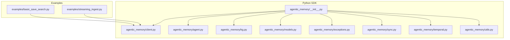
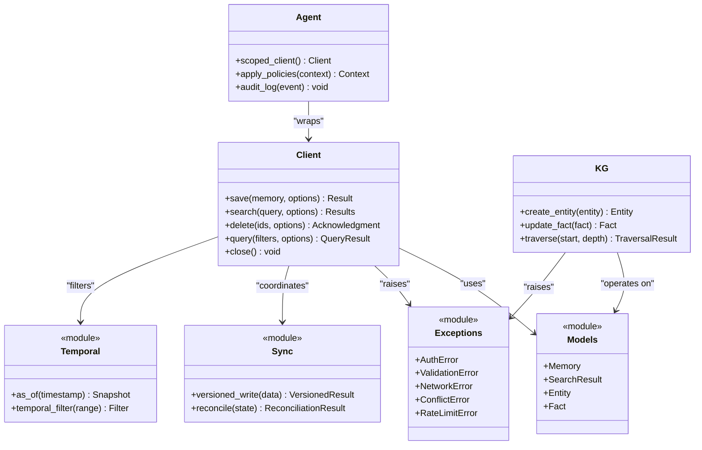
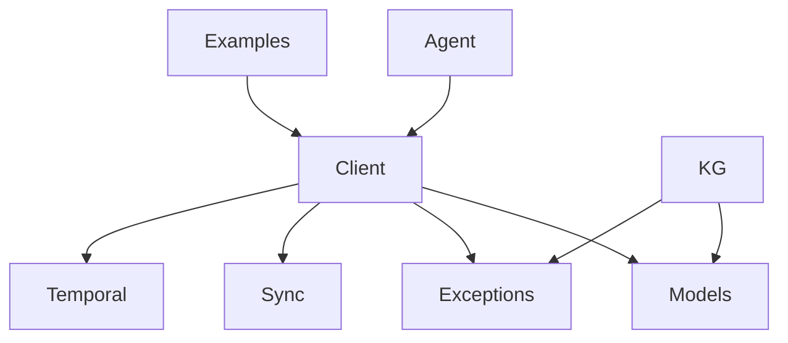

# Python SDK

<cite>
**Referenced Files in This Document**
- [client.py](file://agentic_memory/client.py)
- [agent.py](file://agentic_memory/agent.py)
- [kg.py](file://agentic_memory/kg.py)
- [models.py](file://agentic_memory/models.py)
- [exceptions.py](file://agentic_memory/exceptions.py)
- [sync.py](file://agentic_memory/sync.py)
- [temporal.py](file://agentic_memory/temporal.py)
- [utils.py](file://agentic_memory/utils.py)
- [__init__.py](file://agentic_memory/__init__.py)
- [__init__.pyi](file://agentic_memory/__init__.pyi)
- [basic_save_search.py](file://examples/basic_save_search.py)
- [streaming_ingest.py](file://examples/streaming_ingest.py)
- [python-sdk.md](file://docs/api/python-sdk.md)
</cite>

## Table of Contents
1. [Introduction](#introduction)
2. [Project Structure](#project-structure)
3. [Core Components](#core-components)
4. [Architecture Overview](#architecture-overview)
5. [Detailed Component Analysis](#detailed-component-analysis)
6. [Dependency Analysis](#dependency-analysis)
7. [Performance Considerations](#performance-considerations)
8. [Troubleshooting Guide](#troubleshooting-guide)
9. [Conclusion](#conclusion)
10. [Appendices](#appendices)

## Introduction
This document provides comprehensive documentation for the Agentic Memory Python SDK. It focuses on the public API surface exposed by the SDK, including the main Client class for memory operations (save, search, delete, query), Agent-specific functionality for scoped memory access, configuration and authentication setup, connection management, error handling patterns, async/await usage, streaming responses, and performance optimization techniques. Practical examples are included to demonstrate common workflows such as saving memories, performing semantic searches, managing knowledge graphs, and handling background tasks.

## Project Structure
The Python SDK is implemented under the agentic_memory package and exposes a clean public interface via its __init__ module. The core runtime components include:
- Client: primary entry point for memory operations
- Agent: agent-scoped memory access with tenant/project/session scoping
- Knowledge Graph helpers: entity/fact management and traversal utilities
- Models: data structures used across the SDK
- Exceptions: typed errors raised by the SDK
- Sync and Temporal modules: synchronization and time-aware querying features
- Utilities: helper functions for serialization, validation, and formatting

**Diagram sources**
- [__init__.py](file://agentic_memory/__init__.py)
- [client.py](file://agentic_memory/client.py)
- [agent.py](file://agentic_memory/agent.py)
- [kg.py](file://agentic_memory/kg.py)
- [models.py](file://agentic_memory/models.py)
- [exceptions.py](file://agentic_memory/exceptions.py)
- [sync.py](file://agentic_memory/sync.py)
- [temporal.py](file://agentic_memory/temporal.py)
- [utils.py](file://agentic_memory/utils.py)
- [basic_save_search.py](file://examples/basic_save_search.py)
- [streaming_ingest.py](file://examples/streaming_ingest.py)

**Section sources**
- [__init__.py](file://agentic_memory/__init__.py)
- [client.py](file://agentic_memory/client.py)
- [agent.py](file://agentic_memory/agent.py)
- [kg.py](file://agentic_memory/kg.py)
- [models.py](file://agentic_memory/models.py)
- [exceptions.py](file://agentic_memory/exceptions.py)
- [sync.py](file://agentic_memory/sync.py)
- [temporal.py](file://agentic_memory/temporal.py)
- [utils.py](file://agentic_memory/utils.py)
- [basic_save_search.py](file://examples/basic_save_search.py)
- [streaming_ingest.py](file://examples/streaming_ingest.py)

## Core Components
This section documents the primary classes and methods exposed by the SDK.

### Client
The Client class is the main entry point for interacting with Agentic Memory. It provides methods for saving memories, searching, deleting, and querying. It also supports configuration options for authentication, connection settings, and behavior tuning.

Key responsibilities:
- Initialize connections and manage lifecycle
- Save structured or unstructured memories
- Perform semantic and hybrid search
- Delete memories by identifiers
- Query with filters, temporal constraints, and aggregation
- Stream results where supported
- Handle retries, timeouts, and backoff strategies

Typical parameters and behaviors:
- Authentication: token-based or session-based credentials
- Connection: endpoint URL, timeout, retry policy, TLS settings
- Search: top_k, filters, mode (semantic/hybrid), reranking options
- Save: content, metadata, tags, scope, idempotency tokens
- Delete: memory IDs, soft-delete flags
- Query: filters, temporal range, grouping, pagination

Return types:
- Save: success status, memory ID, version info
- Search: list of ranked results with scores and snippets
- Delete: acknowledgment or deletion count
- Query: aggregated results, facets, or paginated sets

Error handling:
- Network errors, timeouts, rate limits
- Validation errors for invalid payloads
- Authorization failures and tenant isolation violations
- Consistency conflicts during concurrent writes

Async support:
- Async variants of save(), search(), delete(), query() using await
- Streaming responses via async generators

Background tasks:
- Enqueue indexing or re-ranking jobs
- Monitor job status and outcomes

**Section sources**
- [client.py](file://agentic_memory/client.py)
- [__init__.py](file://agentic_memory/__init__.py)
- [python-sdk.md](file://docs/api/python-sdk.md)

### Agent
Agent provides scoped memory access tailored for multi-agent environments. It enforces tenant, project, and session boundaries and can apply agent-specific policies and hooks.

Key responsibilities:
- Scope memory reads/writes to an agent identity
- Apply per-agent filters and retention rules
- Integrate with shared memory and cross-session learning
- Support audit logging and compliance checks

Common use cases:
- Isolated workspace per agent
- Shared knowledge base with controlled visibility
- Policy-driven write paths and read-time enrichment

**Section sources**
- [agent.py](file://agentic_memory/agent.py)
- [__init__.py](file://agentic_memory/__init__.py)

### Knowledge Graph (KG)
KG helpers expose entity and fact management, graph traversal, and analytics. They integrate with the memory pipeline to enrich search and reasoning.

Key responsibilities:
- Create/update entities and facts
- Traverse relationships and compute metrics
- Extract and validate schema-constrained facts
- Backfill and reconcile graph state

**Section sources**
- [kg.py](file://agentic_memory/kg.py)
- [models.py](file://agentic_memory/models.py)

### Models
Models define the data structures used throughout the SDK, including Memory, SearchResult, Entity, Fact, and query/response envelopes.

Responsibilities:
- Provide type hints and validation schemas
- Standardize serialization formats
- Support optional fields and extensions

**Section sources**
- [models.py](file://agentic_memory/models.py)

### Exceptions
Exceptions define typed errors raised by the SDK for consistent client-side handling.

Categories:
- Authentication and authorization errors
- Validation and payload errors
- Network and transport errors
- Consistency and conflict errors
- Rate limiting and quota exceeded

**Section sources**
- [exceptions.py](file://agentic_memory/exceptions.py)

### Sync and Temporal
Sync provides synchronization primitives and consistency guarantees for distributed operations. Temporal enables time-aware queries and historical views.

Capabilities:
- Versioned reads and writes
- As-of timestamps and temporal filters
- Conflict resolution and reconciliation

**Section sources**
- [sync.py](file://agentic_memory/sync.py)
- [temporal.py](file://agentic_memory/temporal.py)

### Utils
Utilities offer helper functions for serialization, hashing, validation, and formatting that are reused across the SDK.

**Section sources**
- [utils.py](file://agentic_memory/utils.py)

## Architecture Overview
The SDK architecture centers around the Client class, which orchestrates calls to backend services and local processing pipelines. Agent wraps Client with scoping and policy enforcement. KG integrates with the memory pipeline to maintain a structured knowledge representation. Models standardize data contracts, while exceptions provide clear error semantics. Sync and Temporal ensure consistency and historical querying capabilities.

**Diagram sources**
- [client.py](file://agentic_memory/client.py)
- [agent.py](file://agentic_memory/agent.py)
- [kg.py](file://agentic_memory/kg.py)
- [models.py](file://agentic_memory/models.py)
- [exceptions.py](file://agentic_memory/exceptions.py)
- [sync.py](file://agentic_memory/sync.py)
- [temporal.py](file://agentic_memory/temporal.py)

## Detailed Component Analysis

### Client Methods
This subsection details the primary methods of the Client class, their parameters, return types, and error handling.

#### save()
Purpose: Persist a memory item with optional metadata, tags, and scoping.

Parameters:
- memory: structured or unstructured content object
- options: includes idempotency_token, tags, metadata, scope, tier_hint

Return:
- Success status, memory_id, version, and optional warnings

Errors:
- ValidationError if payload fails schema checks
- AuthError if insufficient permissions
- ConflictError on concurrent write collisions
- NetworkError for transport failures

Async variant:
- await client.save(...) returns the same result envelope

Example reference:
- [basic_save_search.py](file://examples/basic_save_search.py)

**Section sources**
- [client.py](file://agentic_memory/client.py)
- [basic_save_search.py](file://examples/basic_save_search.py)

#### search()
Purpose: Perform semantic or hybrid search over memories with ranking and filtering.

Parameters:
- query: text or structured query
- top_k: number of results
- filters: tag, tenant, project, session constraints
- mode: semantic, hybrid, keyword
- rerank: enable/disable reranking and strategy

Return:
- Ranked results with scores, snippets, and metadata

Errors:
- ValidationError for malformed queries
- RateLimitError when exceeding quotas
- NetworkError for transport issues

Streaming:
- Optional stream=True yields incremental results

Example reference:
- [basic_save_search.py](file://examples/basic_save_search.py)

**Section sources**
- [client.py](file://agentic_memory/client.py)
- [basic_save_search.py](file://examples/basic_save_search.py)

#### delete()
Purpose: Remove memories by identifiers with optional soft-delete behavior.

Parameters:
- ids: list of memory identifiers
- soft_delete: boolean flag
- reason: optional audit reason

Return:
- Acknowledgment with deleted count and statuses

Errors:
- AuthError if unauthorized
- NotFoundError for missing identifiers
- NetworkError for transport failures

**Section sources**
- [client.py](file://agentic_memory/client.py)

#### query()
Purpose: Execute advanced queries with filters, temporal ranges, grouping, and aggregation.

Parameters:
- filters: complex filter expressions
- temporal_range: start/end timestamps
- group_by: dimensions for aggregation
- pagination: page_size, cursor

Return:
- Aggregated results, facets, and pagination tokens

Errors:
- ValidationError for invalid filter syntax
- RateLimitError for heavy queries
- NetworkError for transport failures

Temporal integration:
- Use as_of or temporal_filter from Temporal module

**Section sources**
- [client.py](file://agentic_memory/client.py)
- [temporal.py](file://agentic_memory/temporal.py)

### Agent Scoping
Agent wraps Client to enforce scoping and policies.

Responsibilities:
- ScopedClient creation with tenant/project/session context
- Policy application before requests
- Audit logging for compliance

Usage pattern:
- Instantiate Agent with identity and context
- Obtain scoped_client() for restricted operations
- Apply policies via apply_policies(context)

**Section sources**
- [agent.py](file://agentic_memory/agent.py)

### Knowledge Graph Operations
KG helpers manage entities and facts and support traversal.

Operations:
- create_entity(entity): add new entity
- update_fact(fact): modify existing fact
- traverse(start, depth): explore relationships

Integration:
- Uses Models for data contracts
- Raises Exceptions for errors
- Coordinates with Client for persistence

**Section sources**
- [kg.py](file://agentic_memory/kg.py)
- [models.py](file://agentic_memory/models.py)

### Streaming Ingest
Streaming ingest demonstrates how to process large volumes incrementally.

Pattern:
- Open a stream source
- Batch items and call save() with idempotency tokens
- Monitor progress and handle partial failures
- Close resources gracefully

Example reference:
- [streaming_ingest.py](file://examples/streaming_ingest.py)

**Section sources**
- [streaming_ingest.py](file://examples/streaming_ingest.py)

### Async/Await Patterns
Async support allows non-blocking operations.

Patterns:
- Use await client.save(...), await client.search(...), etc.
- Combine with asyncio.gather for concurrency
- Manage resource lifecycles with async context managers

Best practices:
- Set appropriate timeouts and retries
- Avoid excessive parallelism to prevent rate limits
- Use streaming APIs for large result sets

**Section sources**
- [client.py](file://agentic_memory/client.py)

### Configuration and Authentication
Configuration covers endpoints, credentials, and behavior.

Options:
- endpoint_url: service address
- auth_token or session_credentials: authentication
- timeout_seconds: request timeout
- max_retries: retry policy
- tls_verify: certificate verification

Authentication flow:
- Provide token or session credentials at initialization
- SDK attaches headers or cookies as required
- Refresh tokens automatically if supported

Connection management:
- Reuse connections via pooling
- Graceful close() to release resources

**Section sources**
- [client.py](file://agentic_memory/client.py)

### Error Handling Patterns
Consistent error handling improves robustness.

Strategy:
- Catch specific Exceptions subclasses
- Log contextual information
- Implement retry/backoff for transient errors
- Surface user-friendly messages

Common scenarios:
- NetworkError: retry with exponential backoff
- RateLimitError: wait and retry with jitter
- ConflictError: resolve versions and retry
- ValidationError: fix payload and resubmit

**Section sources**
- [exceptions.py](file://agentic_memory/exceptions.py)
- [client.py](file://agentic_memory/client.py)

## Dependency Analysis
The SDK’s internal dependencies are cohesive and modular. Client depends on Models, Exceptions, Sync, and Temporal. Agent wraps Client with additional scoping logic. KG operates on Models and raises Exceptions. Examples depend on Client for practical demonstrations.

**Diagram sources**
- [client.py](file://agentic_memory/client.py)
- [agent.py](file://agentic_memory/agent.py)
- [kg.py](file://agentic_memory/kg.py)
- [models.py](file://agentic_memory/models.py)
- [exceptions.py](file://agentic_memory/exceptions.py)
- [sync.py](file://agentic_memory/sync.py)
- [temporal.py](file://agentic_memory/temporal.py)
- [basic_save_search.py](file://examples/basic_save_search.py)
- [streaming_ingest.py](file://examples/streaming_ingest.py)

**Section sources**
- [client.py](file://agentic_memory/client.py)
- [agent.py](file://agentic_memory/agent.py)
- [kg.py](file://agentic_memory/kg.py)
- [models.py](file://agentic_memory/models.py)
- [exceptions.py](file://agentic_memory/exceptions.py)
- [sync.py](file://agentic_memory/sync.py)
- [temporal.py](file://agentic_memory/temporal.py)
- [basic_save_search.py](file://examples/basic_save_search.py)
- [streaming_ingest.py](file://examples/streaming_ingest.py)

## Performance Considerations
- Use batching for bulk saves to reduce overhead
- Enable reranking selectively based on latency requirements
- Tune top_k and filters to minimize payload size
- Leverage streaming for large result sets
- Configure retries and timeouts appropriately
- Prefer async patterns for high-throughput workloads
- Cache frequently accessed entities and facts locally when safe

[No sources needed since this section provides general guidance]

## Troubleshooting Guide
Common issues and resolutions:
- Authentication failures: verify credentials and token refresh
- Rate limit errors: implement backoff and reduce concurrency
- Validation errors: inspect payload schema and required fields
- Network errors: check connectivity and proxy settings
- Conflicts: resolve version mismatches and retry writes
- Timeouts: increase timeout values or optimize queries

Diagnostic steps:
- Enable detailed logs for SDK calls
- Inspect exception types and messages
- Validate filters and temporal ranges
- Test with smaller datasets to isolate issues

**Section sources**
- [exceptions.py](file://agentic_memory/exceptions.py)
- [client.py](file://agentic_memory/client.py)

## Conclusion
The Agentic Memory Python SDK provides a robust, scalable interface for memory operations, agent-scoped access, and knowledge graph management. With strong typing, clear error semantics, async support, and streaming capabilities, it enables efficient integration into diverse applications. Following the configuration, authentication, and performance recommendations will help achieve reliable and high-performance deployments.

[No sources needed since this section summarizes without analyzing specific files]

## Appendices

### Quick Start Examples
- Saving memories: see [basic_save_search.py](file://examples/basic_save_search.py)
- Streaming ingestion: see [streaming_ingest.py](file://examples/streaming_ingest.py)
- SDK API overview: see [python-sdk.md](file://docs/api/python-sdk.md)

**Section sources**
- [basic_save_search.py](file://examples/basic_save_search.py)
- [streaming_ingest.py](file://examples/streaming_ingest.py)
- [python-sdk.md](file://docs/api/python-sdk.md)