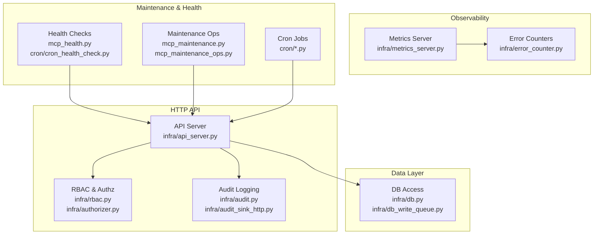
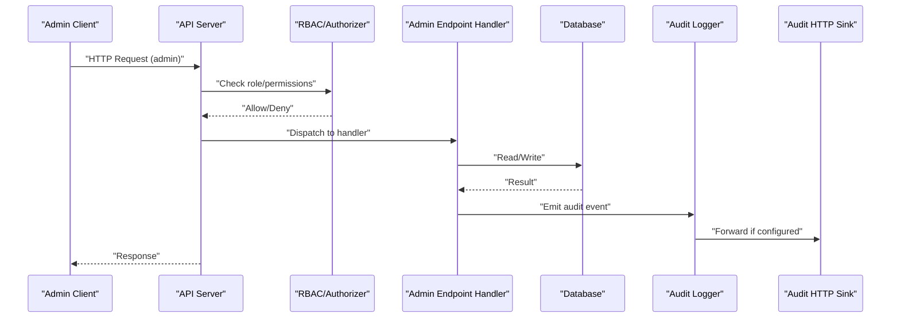
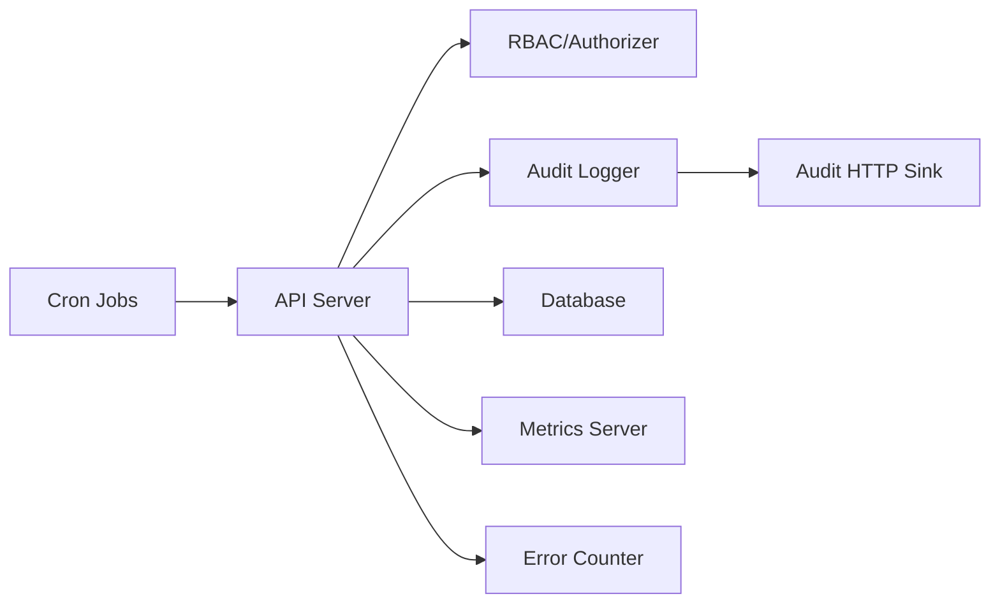

# Admin & System API

<cite>
**Referenced Files in This Document**
- [api_server.py](file://infra/api_server.py)
- [metrics_server.py](file://infra/metrics_server.py)
- [mcp_health.py](file://mcp_health.py)
- [mcp_metrics.py](file://mcp_metrics.py)
- [mcp_maintenance.py](file://mcp_maintenance.py)
- [mcp_maintenance_ops.py](file://mcp_maintenance_ops.py)
- [mcp_session.py](file://mcp_session.py)
- [mcp_dashboard.py](file://mcp_dashboard.py)
- [rbac.py](file://infra/rbac.py)
- [authorizer.py](file://infra/authorizer.py)
- [audit.py](file://infra/audit.py)
- [audit_sink_http.py](file://infra/audit_sink_http.py)
- [cron_health_check.py](file://cron/cron_health_check.py)
- [cron_backup.py](file://cron/cron_backup.py)
- [cron_backup_validate.py](file://cron/cron_backup_validate.py)
- [cron_compact.py](file://cron/cron_compact.py)
- [cron_integrity_check.py](file://cron/cron_integrity_check.py)
- [cron_rebuild_fts.py](file://cron/cron_rebuild_fts.py)
- [cron_purge_expired.py](file://cron/cron_purge_expired.py)
- [cron_cleanup_auto_logs.py](file://cron/cron_cleanup_auto_logs.py)
- [cron_watchdog.py](file://cron/cron_watchdog.py)
- [cron_daemon_watchdog.py](file://cron/cron_daemon_watchdog.py)
- [config_drift.py](file://infra/config_drift.py)
- [db.py](file://infra/db.py)
- [db_write_queue.py](file://infra/db_write_queue.py)
- [rate_limiter.py](file://infra/rate_limiter.py)
- [error_counter.py](file://infra/error_counter.py)
- [rest-api.md](file://docs/api/rest-api.md)
</cite>

## Table of Contents
1. [Introduction](#introduction)
2. [Project Structure](#project-structure)
3. [Core Components](#core-components)
4. [Architecture Overview](#architecture-overview)
5. [Detailed Component Analysis](#detailed-component-analysis)
6. [Dependency Analysis](#dependency-analysis)
7. [Performance Considerations](#performance-considerations)
8. [Troubleshooting Guide](#troubleshooting-guide)
9. [Conclusion](#conclusion)
10. [Appendices](#appendices)

## Introduction
This document provides comprehensive REST API documentation for administrative and system management endpoints. It covers health checks, configuration management, monitoring metrics, maintenance operations, user and role-based access control (RBAC), audit log retrieval, diagnostics, backup and restore, database maintenance, performance tuning interfaces, security requirements, admin-only protections, and operational best practices. It also includes example workflows for configuration updates, monitoring setup, and troubleshooting procedures.

The project exposes both an HTTP API server and a metrics server. Administrative capabilities are implemented via the HTTP API with RBAC enforcement and audit logging. Background tasks are scheduled through cron jobs that perform maintenance, backups, compaction, integrity checks, and more.

## Project Structure
Administrative and system management functionality is primarily implemented in:
- HTTP API server and routing
- Metrics server for observability
- RBAC and authorization middleware
- Audit logging and sinks
- Cron-based maintenance and health checks
- Database utilities and write queueing
- Rate limiting and error counters

**Diagram sources**
- [api_server.py](file://infra/api_server.py)
- [metrics_server.py](file://infra/metrics_server.py)
- [mcp_health.py](file://mcp_health.py)
- [mcp_maintenance.py](file://mcp_maintenance.py)
- [mcp_maintenance_ops.py](file://mcp_maintenance_ops.py)
- [cron_health_check.py](file://cron/cron_health_check.py)
- [cron_backup.py](file://cron/cron_backup.py)
- [cron_backup_validate.py](file://cron/cron_backup_validate.py)
- [cron_compact.py](file://cron/cron_compact.py)
- [cron_integrity_check.py](file://cron/cron_integrity_check.py)
- [cron_rebuild_fts.py](file://cron/cron_rebuild_fts.py)
- [cron_purge_expired.py](file://cron/cron_purge_expired.py)
- [cron_cleanup_auto_logs.py](file://cron/cron_cleanup_auto_logs.py)
- [cron_watchdog.py](file://cron/cron_watchdog.py)
- [cron_daemon_watchdog.py](file://cron/cron_daemon_watchdog.py)
- [rbac.py](file://infra/rbac.py)
- [authorizer.py](file://infra/authorizer.py)
- [audit.py](file://infra/audit.py)
- [audit_sink_http.py](file://infra/audit_sink_http.py)
- [db.py](file://infra/db.py)
- [db_write_queue.py](file://infra/db_write_queue.py)
- [error_counter.py](file://infra/error_counter.py)

**Section sources**
- [rest-api.md](file://docs/api/rest-api.md)

## Core Components
- API Server: Central HTTP entrypoint for admin endpoints, request lifecycle, and integration with RBAC and audit.
- RBAC & Authorization: Role definitions, policy evaluation, and per-request authorization checks.
- Audit Logging: Structured event emission and pluggable sinks including HTTP delivery.
- Metrics Server: Dedicated endpoint(s) exposing runtime metrics for monitoring systems.
- Maintenance Operations: Endpoints and background jobs for backups, compaction, integrity checks, index rebuilds, purges, and cleanup.
- Health Checks: Readiness/liveness probes and service-specific health signals.
- Data Layer Utilities: Database connections, migrations, and write queueing to ensure durability and throughput.
- Rate Limiting & Error Counters: Protection against abuse and visibility into failure rates.

**Section sources**
- [api_server.py](file://infra/api_server.py)
- [rbac.py](file://infra/rbac.py)
- [authorizer.py](file://infra/authorizer.py)
- [audit.py](file://infra/audit.py)
- [audit_sink_http.py](file://infra/audit_sink_http.py)
- [metrics_server.py](file://infra/metrics_server.py)
- [mcp_health.py](file://mcp_health.py)
- [mcp_maintenance.py](file://mcp_maintenance.py)
- [mcp_maintenance_ops.py](file://mcp_maintenance_ops.py)
- [cron_health_check.py](file://cron/cron_health_check.py)
- [cron_backup.py](file://cron/cron_backup.py)
- [cron_backup_validate.py](file://cron/cron_backup_validate.py)
- [cron_compact.py](file://cron/cron_compact.py)
- [cron_integrity_check.py](file://cron/cron_integrity_check.py)
- [cron_rebuild_fts.py](file://cron/cron_rebuild_fts.py)
- [cron_purge_expired.py](file://cron/cron_purge_expired.py)
- [cron_cleanup_auto_logs.py](file://cron/cron_cleanup_auto_logs.py)
- [cron_watchdog.py](file://cron/cron_watchdog.py)
- [cron_daemon_watchdog.py](file://cron/cron_daemon_watchdog.py)
- [db.py](file://infra/db.py)
- [db_write_queue.py](file://infra/db_write_queue.py)
- [rate_limiter.py](file://infra/rate_limiter.py)
- [error_counter.py](file://infra/error_counter.py)

## Architecture Overview
The Admin & System API follows a layered architecture:
- Client requests enter the API Server.
- Requests pass through RBAC and authorization middleware.
- Handlers invoke business logic and data layer components.
- All significant actions emit audit events; sensitive or external calls may be forwarded to audit sinks.
- Observability is exposed via a separate metrics server and internal counters.
- Long-running or periodic tasks are executed by cron jobs.

**Diagram sources**
- [api_server.py](file://infra/api_server.py)
- [rbac.py](file://infra/rbac.py)
- [authorizer.py](file://infra/authorizer.py)
- [audit.py](file://infra/audit.py)
- [audit_sink_http.py](file://infra/audit_sink_http.py)
- [db.py](file://infra/db.py)

## Detailed Component Analysis

### Health Check Endpoints
Purpose: Provide liveness/readiness and component health status for orchestrators and load balancers.

Key behaviors:
- Liveness probe indicates process health.
- Readiness probe verifies dependencies (e.g., database connectivity).
- Optional component-level health details can be included.

Operational notes:
- These endpoints should be lightweight and fast.
- Avoid heavy computations or blocking I/O.

Example workflow:
- Orchestrator periodically calls readiness endpoint before accepting traffic.

**Section sources**
- [mcp_health.py](file://mcp_health.py)
- [cron_health_check.py](file://cron/cron_health_check.py)

### Configuration Management
Purpose: Inspect and manage runtime configuration and detect drift from declared policies.

Capabilities:
- Retrieve current effective configuration.
- Validate configuration against policy.
- Detect and report configuration drift.

Security:
- Require admin roles for mutation endpoints.
- Emit audit events for all changes.

Operational notes:
- Prefer declarative configuration files and version control.
- Use drift detection to enforce compliance.

Example workflow:
- Operator updates configuration file, triggers drift check, validates, then applies change.

**Section sources**
- [config_drift.py](file://infra/config_drift.py)
- [rbac.py](file://infra/rbac.py)
- [audit.py](file://infra/audit.py)

### Monitoring Metrics
Purpose: Expose system metrics for dashboards and alerting.

Endpoints:
- Metrics server exposes aggregated metrics suitable for scraping.

What to monitor:
- Request latency and error rates.
- Database connection pool stats.
- Background job queue lengths and durations.
- Custom application metrics.

Operational notes:
- Configure scrape intervals appropriate for your environment.
- Avoid high-cardinality labels to prevent metric explosion.

**Section sources**
- [metrics_server.py](file://infra/metrics_server.py)
- [error_counter.py](file://infra/error_counter.py)

### Maintenance Operations
Purpose: Perform system maintenance tasks such as backups, compaction, integrity checks, index rebuilds, and purges.

Operations:
- Backup creation and validation.
- Database compaction and vacuum-like tasks.
- Full-text search index rebuild.
- Expired data purge and auto-log cleanup.
- Watchdog and daemon supervision.

Scheduling:
- Many operations are available as cron jobs for automated execution.

Safety:
- Ensure idempotency where possible.
- Guard long-running tasks with locks and timeouts.
- Record audit events for each operation.

Example workflow:
- Trigger backup, validate snapshot, schedule compaction during off-peak hours.

**Section sources**
- [mcp_maintenance.py](file://mcp_maintenance.py)
- [mcp_maintenance_ops.py](file://mcp_maintenance_ops.py)
- [cron_backup.py](file://cron/cron_backup.py)
- [cron_backup_validate.py](file://cron/cron_backup_validate.py)
- [cron_compact.py](file://cron/cron_compact.py)
- [cron_integrity_check.py](file://cron/cron_integrity_check.py)
- [cron_rebuild_fts.py](file://cron/cron_rebuild_fts.py)
- [cron_purge_expired.py](file://cron/cron_purge_expired.py)
- [cron_cleanup_auto_logs.py](file://cron/cron_cleanup_auto_logs.py)
- [cron_watchdog.py](file://cron/cron_watchdog.py)
- [cron_daemon_watchdog.py](file://cron/cron_daemon_watchdog.py)

### User Management and RBAC
Purpose: Manage principals, roles, and permissions; enforce access control on admin endpoints.

Capabilities:
- Create, update, and delete users and roles.
- Assign roles and permissions.
- Enforce admin-only access on sensitive endpoints.

Security:
- Fail closed by default when authorization fails.
- Log authorization decisions to audit.

Operational notes:
- Use least privilege principle.
- Regularly review role assignments.

Example workflow:
- Onboard new operator, assign minimal required roles, verify access via test call.

**Section sources**
- [rbac.py](file://infra/rbac.py)
- [authorizer.py](file://infra/authorizer.py)
- [audit.py](file://infra/audit.py)

### Audit Log Retrieval
Purpose: Query audit logs for compliance, forensics, and debugging.

Capabilities:
- Filter by time range, principal, action type, and tenant scope.
- Paginated retrieval for large datasets.
- Optional redaction of sensitive fields.

Security:
- Restrict to admin roles.
- Respect tenant isolation.

Operational notes:
- Store logs externally for retention and analysis.
- Integrate with SIEM tools via HTTP sink.

Example workflow:
- Investigate unauthorized access attempt using filtered audit queries.

**Section sources**
- [audit.py](file://infra/audit.py)
- [audit_sink_http.py](file://infra/audit_sink_http.py)
- [rbac.py](file://infra/rbac.py)

### Session Administration
Purpose: Manage sessions used by agents and operators for context and state.

Capabilities:
- List, inspect, and terminate sessions.
- View session metadata and activity summaries.

Security:
- Admin-only access.
- Tenant-scoped visibility.

Operational notes:
- Use session termination judiciously to avoid disrupting active workloads.

**Section sources**
- [mcp_session.py](file://mcp_session.py)

### Dashboard Integration
Purpose: Provide administrative UI integrations and data for dashboard tabs.

Capabilities:
- Serve aggregated views for operations, settings, and compliance.
- Expose read-only endpoints for dashboard consumption.

Security:
- Protect sensitive tabs behind admin authentication.

**Section sources**
- [mcp_dashboard.py](file://mcp_dashboard.py)

## Dependency Analysis
Administrative endpoints depend on several core subsystems:
- RBAC and authorizer enforce permissions.
- Audit logger records actions and forwards to sinks.
- Database layer provides persistence and transactional guarantees.
- Metrics server and error counters provide observability.
- Cron jobs execute periodic maintenance tasks.

**Diagram sources**
- [api_server.py](file://infra/api_server.py)
- [rbac.py](file://infra/rbac.py)
- [authorizer.py](file://infra/authorizer.py)
- [audit.py](file://infra/audit.py)
- [audit_sink_http.py](file://infra/audit_sink_http.py)
- [metrics_server.py](file://infra/metrics_server.py)
- [error_counter.py](file://infra/error_counter.py)
- [cron_health_check.py](file://cron/cron_health_check.py)
- [cron_backup.py](file://cron/cron_backup.py)
- [cron_backup_validate.py](file://cron/cron_backup_validate.py)
- [cron_compact.py](file://cron/cron_compact.py)
- [cron_integrity_check.py](file://cron/cron_integrity_check.py)
- [cron_rebuild_fts.py](file://cron/cron_rebuild_fts.py)
- [cron_purge_expired.py](file://cron/cron_purge_expired.py)
- [cron_cleanup_auto_logs.py](file://cron/cron_cleanup_auto_logs.py)
- [cron_watchdog.py](file://cron/cron_watchdog.py)
- [cron_daemon_watchdog.py](file://cron/cron_daemon_watchdog.py)

**Section sources**
- [api_server.py](file://infra/api_server.py)
- [rbac.py](file://infra/rbac.py)
- [authorizer.py](file://infra/authorizer.py)
- [audit.py](file://infra/audit.py)
- [audit_sink_http.py](file://infra/audit_sink_http.py)
- [metrics_server.py](file://infra/metrics_server.py)
- [error_counter.py](file://infra/error_counter.py)
- [cron_health_check.py](file://cron/cron_health_check.py)
- [cron_backup.py](file://cron/cron_backup.py)
- [cron_backup_validate.py](file://cron/cron_backup_validate.py)
- [cron_compact.py](file://cron/cron_compact.py)
- [cron_integrity_check.py](file://cron/cron_integrity_check.py)
- [cron_rebuild_fts.py](file://cron/cron_rebuild_fts.py)
- [cron_purge_expired.py](file://cron/cron_purge_expired.py)
- [cron_cleanup_auto_logs.py](file://cron/cron_cleanup_auto_logs.py)
- [cron_watchdog.py](file://cron/cron_watchdog.py)
- [cron_daemon_watchdog.py](file://cron/cron_daemon_watchdog.py)

## Performance Considerations
- Keep health checks lightweight; avoid expensive queries.
- Use pagination and filters for audit log retrieval to reduce payload size.
- Schedule heavy maintenance tasks (compaction, index rebuilds) during off-peak windows.
- Monitor database connection pools and adjust sizing based on workload.
- Enable rate limiting on admin endpoints to prevent abuse.
- Use metrics to identify hotspots and tune accordingly.

[No sources needed since this section provides general guidance]

## Troubleshooting Guide
Common issues and resolutions:
- Authorization failures: Verify RBAC roles and permissions; check audit logs for denied attempts.
- High error rates: Inspect error counters and metrics; correlate with recent deployments or config changes.
- Slow responses: Profile database queries; consider adding indexes or adjusting query parameters.
- Stale configuration: Run drift checks and reconcile differences.
- Failed backups: Validate snapshots and storage connectivity; review cron job logs.

Operational tips:
- Use watchdogs to restart unhealthy services automatically.
- Maintain runbooks for frequent incidents.
- Retain audit logs externally for forensic analysis.

**Section sources**
- [rbac.py](file://infra/rbac.py)
- [authorizer.py](file://infra/authorizer.py)
- [audit.py](file://infra/audit.py)
- [error_counter.py](file://infra/error_counter.py)
- [config_drift.py](file://infra/config_drift.py)
- [cron_backup.py](file://cron/cron_backup.py)
- [cron_backup_validate.py](file://cron/cron_backup_validate.py)
- [cron_watchdog.py](file://cron/cron_watchdog.py)
- [cron_daemon_watchdog.py](file://cron/cron_daemon_watchdog.py)

## Conclusion
The Admin & System API provides robust controls for managing the platform securely and efficiently. With strong RBAC enforcement, comprehensive audit logging, and a suite of maintenance operations, administrators can maintain system health, ensure compliance, and respond quickly to incidents. Follow the recommended best practices for security, performance, and reliability to operate at scale.

[No sources needed since this section summarizes without analyzing specific files]

## Appendices

### Security Requirements
- Enforce admin-only access on sensitive endpoints.
- Use least privilege roles and regularly review assignments.
- Enable audit logging for all administrative actions.
- Apply rate limiting to protect against misuse.
- Ensure tenant isolation for multi-tenant deployments.

**Section sources**
- [rbac.py](file://infra/rbac.py)
- [authorizer.py](file://infra/authorizer.py)
- [audit.py](file://infra/audit.py)
- [rate_limiter.py](file://infra/rate_limiter.py)

### Operational Best Practices
- Version control configuration files and track drift.
- Automate backups and validations; store artifacts securely.
- Schedule maintenance tasks during low-traffic periods.
- Monitor metrics and set alerts for anomalies.
- Maintain clear runbooks and escalation paths.

**Section sources**
- [config_drift.py](file://infra/config_drift.py)
- [cron_backup.py](file://cron/cron_backup.py)
- [cron_backup_validate.py](file://cron/cron_backup_validate.py)
- [metrics_server.py](file://infra/metrics_server.py)

### Example Workflows

#### Configuration Update Workflow
- Review current configuration and drift status.
- Update configuration file in version control.
- Validate configuration against policy.
- Apply change and confirm drift resolved.
- Audit trail confirms the update.

**Section sources**
- [config_drift.py](file://infra/config_drift.py)
- [audit.py](file://infra/audit.py)

#### Monitoring Setup Workflow
- Deploy metrics server and configure scraper.
- Define dashboards for key metrics.
- Set up alerts for error rates and latency thresholds.
- Validate scrape targets and data quality.

**Section sources**
- [metrics_server.py](file://infra/metrics_server.py)
- [error_counter.py](file://infra/error_counter.py)

#### Troubleshooting Procedure
- Check health endpoints for liveness/readiness.
- Inspect metrics and error counters for anomalies.
- Review audit logs for relevant events.
- Validate configuration drift and recent changes.
- If needed, trigger targeted maintenance (e.g., index rebuild).

**Section sources**
- [mcp_health.py](file://mcp_health.py)
- [metrics_server.py](file://infra/metrics_server.py)
- [error_counter.py](file://infra/error_counter.py)
- [audit.py](file://infra/audit.py)
- [config_drift.py](file://infra/config_drift.py)
- [cron_rebuild_fts.py](file://cron/cron_rebuild_fts.py)