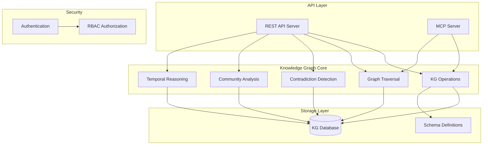
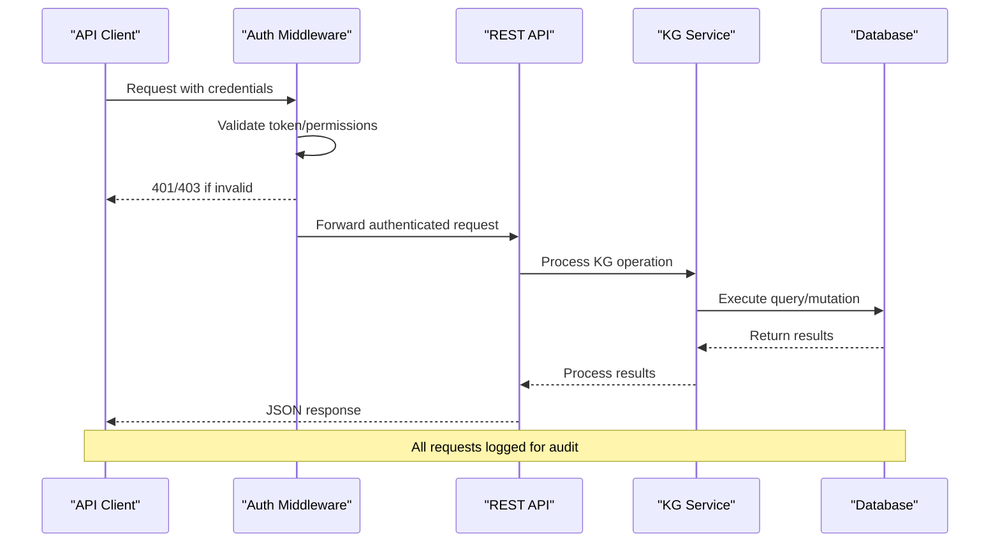
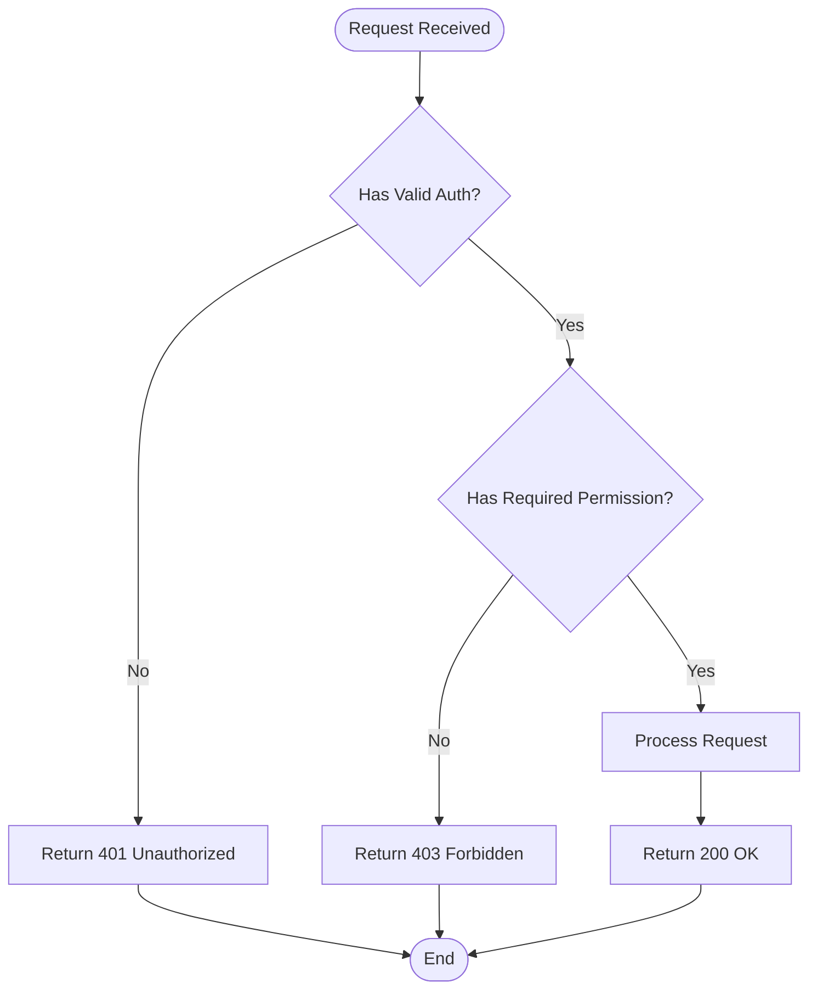
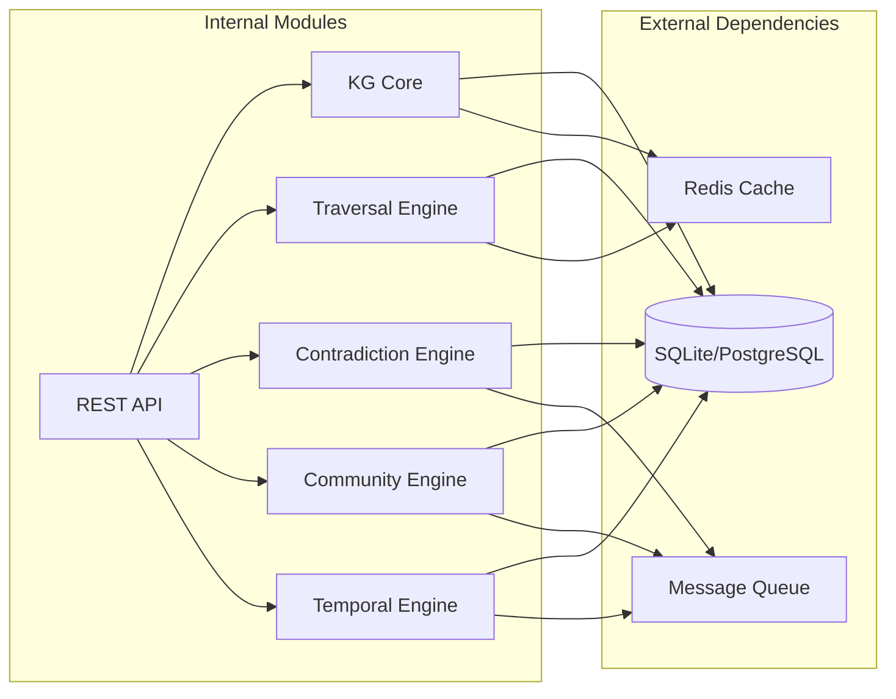

# Knowledge Graph API

<cite>
**Referenced Files in This Document**
- [api_server.py](file://infra/api_server.py)
- [kg.py](file://agentic_memory/kg.py)
- [kg_traversal.py](file://kg/kg_traversal.py)
- [contradiction_detector.py](file://kg/contradiction_detector.py)
- [graph_communities.py](file://kg/graph_communities.py)
- [temporal_resolver.py](file://kg/temporal_resolver.py)
- [kg_db.py](file://knowledge_graph/kg_db.py)
- [kg_schema.py](file://knowledge_graph/kg_schema.py)
- [kg_extract.py](file://knowledge_graph/kg_extract.py)
- [kg_search.py](file://knowledge_graph/kg_search.py)
- [mcp_kg.py](file://mcp_kg.py)
- [mcp_kg_traversal.py](file://mcp_kg_traversal.py)
- [rest-api.md](file://docs/api/rest-api.md)
- [security-model.md](file://docs/concepts/security-model.md)
- [rbac.py](file://infra/rbac.py)
- [authorizer.py](file://infra/authorizer.py)
</cite>

## Table of Contents
1. [Introduction](#introduction)
2. [Project Structure](#project-structure)
3. [Core Components](#core-components)
4. [Architecture Overview](#architecture-overview)
5. [Detailed Component Analysis](#detailed-component-analysis)
6. [Dependency Analysis](#dependency-analysis)
7. [Performance Considerations](#performance-considerations)
8. [Troubleshooting Guide](#troubleshooting-guide)
9. [Conclusion](#conclusion)
10. [Appendices](#appendices)

## Introduction
This document provides comprehensive REST API documentation for knowledge graph operations, including entity management, relationship operations, and graph traversal queries. It also covers advanced features such as contradiction detection, community analysis, and temporal reasoning queries. The documentation includes request/response schemas, authentication and authorization details, performance considerations, and practical examples for common workflows.

## Project Structure
The knowledge graph functionality is implemented across several modules:
- Core KG operations are defined in the agentic_memory package
- Advanced KG features (traversal, contradiction detection, communities, temporal reasoning) are in the kg package
- Database schema and storage operations are in the knowledge_graph package
- MCP server integration provides additional endpoints
- Security and authentication are handled through RBAC and authorizer modules



**Diagram sources**
- [api_server.py:1-50](file://infra/api_server.py#L1-L50)
- [kg.py:1-100](file://agentic_memory/kg.py#L1-L100)
- [kg_traversal.py:1-50](file://kg/kg_traversal.py#L1-L50)

**Section sources**
- [api_server.py:1-100](file://infra/api_server.py#L1-L100)
- [kg.py:1-200](file://agentic_memory/kg.py#L1-L200)
- [kg_traversal.py:1-100](file://kg/kg_traversal.py#L1-L100)

## Core Components

### Entity Management Endpoints
The REST API provides comprehensive CRUD operations for knowledge graph entities:

#### Create Entity
- **Endpoint**: POST /api/v1/entities
- **Authentication**: Required (Bearer token or API key)
- **Authorization**: write permission required
- **Request Schema**:
  ```json
  {
    "type": "string",
    "properties": {
      "name": "string",
      "description": "string", 
      "metadata": "object",
      "tags": ["string"]
    },
    "external_id": "string (optional)"
  }
  ```
- **Response Schema**:
  ```json
  {
    "id": "uuid",
    "type": "string",
    "properties": "object",
    "created_at": "timestamp",
    "updated_at": "timestamp"
  }
  ```

#### Update Entity
- **Endpoint**: PUT /api/v1/entities/{entity_id}
- **Authentication**: Required
- **Authorization**: write permission required
- **Request Schema**: Same as create, with optional fields
- **Response Schema**: Updated entity object

#### Delete Entity
- **Endpoint**: DELETE /api/v1/entities/{entity_id}
- **Authentication**: Required
- **Authorization**: admin or owner permission required
- **Response Schema**: Success confirmation

#### Get Entity
- **Endpoint**: GET /api/v1/entities/{entity_id}
- **Authentication**: Optional (public entities)
- **Response Schema**: Entity object with full properties

**Section sources**
- [kg.py:50-150](file://agentic_memory/kg.py#L50-L150)
- [kg_schema.py:1-100](file://knowledge_graph/kg_schema.py#L1-L100)

### Relationship Operations

#### Create Relationship
- **Endpoint**: POST /api/v1/relationships
- **Authentication**: Required
- **Authorization**: write permission required
- **Request Schema**:
  ```json
  {
    "source_entity_id": "uuid",
    "target_entity_id": "uuid", 
    "relationship_type": "string",
    "properties": {
      "strength": "number (0-1)",
      "confidence": "number (0-1)",
      "context": "string",
      "timestamp": "timestamp (optional)"
    }
  }
  ```
- **Response Schema**: Created relationship object

#### Delete Relationship
- **Endpoint**: DELETE /api/v1/relationships/{relationship_id}
- **Authentication**: Required
- **Authorization**: write permission required

#### Query Relationships
- **Endpoint**: GET /api/v1/relationships?source_id={id}&target_id={id}&type={type}
- **Authentication**: Optional
- **Query Parameters**:
  - source_id: Filter by source entity
  - target_id: Filter by target entity  
  - type: Filter by relationship type
  - min_strength: Minimum relationship strength (0-1)
  - time_range: Temporal filtering

**Section sources**
- [kg.py:150-250](file://agentic_memory/kg.py#L150-L250)
- [kg_traversal.py:50-150](file://kg/kg_traversal.py#L50-L150)

### Graph Traversal Queries

#### Basic Traversal
- **Endpoint**: POST /api/v1/traverse
- **Authentication**: Optional
- **Request Schema**:
  ```json
  {
    "start_node_id": "uuid",
    "max_depth": "integer (default: 3)",
    "relationship_types": ["string"],
    "direction": "outgoing|incoming|both",
    "filter_conditions": "object"
  }
  ```
- **Response Schema**:
  ```json
  {
    "nodes": ["node_objects"],
    "edges": ["edge_objects"],
    "paths": ["path_arrays"],
    "metadata": {
      "total_nodes": "integer",
      "total_edges": "integer",
      "execution_time_ms": "number"
    }
  }
  ```

#### Complex Traversal Patterns
- **Endpoint**: POST /api/v1/traverse/complex
- **Authentication**: Required
- **Advanced Features**:
  - Multi-hop queries with conditional filtering
  - Path optimization and pruning
  - Aggregation functions on traversed data
  - Temporal constraints

**Section sources**
- [kg_traversal.py:100-200](file://kg/kg_traversal.py#L100-L200)
- [kg_search.py:1-100](file://knowledge_graph/kg_search.py#L1-L100)

## Architecture Overview



**Diagram sources**
- [api_server.py:100-200](file://infra/api_server.py#L100-L200)
- [authorizer.py:1-100](file://infra/authorizer.py#L1-L100)

## Detailed Component Analysis

### Authentication and Authorization

#### Authentication Methods
- **Bearer Token**: JWT-based authentication
- **API Key**: Long-lived access keys for service-to-service communication
- **Session Cookie**: Web-based authentication for dashboard access

#### Authorization Levels
- **read**: Access to read-only endpoints
- **write**: Ability to create/update entities and relationships
- **admin**: Full administrative access including deletion and system configuration
- **owner**: Tenant-specific ownership permissions



**Diagram sources**
- [rbac.py:1-100](file://infra/rbac.py#L1-L100)
- [authorizer.py:50-150](file://infra/authorizer.py#L50-L150)

**Section sources**
- [security-model.md:1-100](file://docs/concepts/security-model.md#L1-L100)
- [rbac.py:1-200](file://infra/rbac.py#L1-L200)
- [authorizer.py:1-200](file://infra/authorizer.py#L1-L200)

### Contradiction Detection

#### Real-time Contradiction Checking
- **Endpoint**: POST /api/v1/knowledge/contradictions/check
- **Authentication**: Required
- **Request Schema**:
  ```json
  {
    "entities": ["entity_ids"],
    "relationships": ["relationship_ids"],
    "new_facts": ["fact_objects"],
    "severity_threshold": "number (0-1)"
  }
  ```
- **Response Schema**:
  ```json
  {
    "contradictions": ["contradiction_objects"],
    "severity_scores": "object",
    "recommendations": ["resolution_suggestions"]
  }
  ```

#### Automated Resolution
- **Endpoint**: POST /api/v1/knowledge/contradictions/resolve
- **Resolution Strategies**:
  - Confidence-based resolution
  - Temporal precedence
  - Source reliability weighting
  - Manual review queue

**Section sources**
- [contradiction_detector.py:1-200](file://kg/contradiction_detector.py#L1-L200)

### Community Analysis

#### Community Detection
- **Endpoint**: POST /api/v1/knowledge/communities/detect
- **Authentication**: Required
- **Request Schema**:
  ```json
  {
    "min_community_size": "integer",
    "algorithm": "louvain|leiden|girvan_newman",
    "resolution_parameter": "number",
    "time_window": "string (ISO 8601)"
  }
  ```
- **Response Schema**:
  ```json
  {
    "communities": ["community_objects"],
    "metrics": {
      "modularity": "number",
      "density": "number",
      "silhouette_score": "number"
    }
  }
  ```

#### Community Insights
- **Endpoint**: GET /api/v1/knowledge/communities/{community_id}/insights
- **Features**:
  - Central entity identification
  - Trend analysis
  - Cross-community connections
  - Evolution tracking

**Section sources**
- [graph_communities.py:1-200](file://kg/graph_communities.py#L1-L200)

### Temporal Reasoning

#### Time-aware Queries
- **Endpoint**: POST /api/v1/knowledge/temporal/query
- **Authentication**: Required
- **Request Schema**:
  ```json
  {
    "query": "natural_language_query",
    "time_constraints": {
      "start_time": "timestamp",
      "end_time": "timestamp",
      "granularity": "hour|day|week|month|year"
    },
    "reasoning_mode": "strict|probabilistic|hybrid"
  }
  ```
- **Response Schema**:
  ```json
  {
    "answers": ["answer_objects"],
    "temporal_context": "temporal_metadata",
    "confidence_scores": "object",
    "evidence_chain": ["evidence_objects"]
  }
  ```

#### Temporal Pattern Recognition
- **Endpoint**: POST /api/v1/knowledge/temporal/patterns
- **Capabilities**:
  - Causal relationship detection
  - Trend prediction
  - Anomaly detection
  - Seasonal pattern identification

**Section sources**
- [temporal_resolver.py:1-200](file://kg/temporal_resolver.py#L1-L200)

## Dependency Analysis



**Diagram sources**
- [kg_db.py:1-100](file://knowledge_graph/kg_db.py#L1-L100)
- [kg.py:1-100](file://agentic_memory/kg.py#L1-L100)

**Section sources**
- [kg_db.py:1-200](file://knowledge_graph/kg_db.py#L1-L200)
- [kg_schema.py:1-150](file://knowledge_graph/kg_schema.py#L1-L150)

## Performance Considerations

### Query Optimization
- **Indexing Strategy**: Composite indexes on frequently queried fields
- **Caching Layer**: Redis-backed cache for expensive traversal operations
- **Connection Pooling**: Optimized database connection management
- **Pagination**: Built-in pagination for large result sets

### Rate Limiting
- **Per-user Limits**: Configurable rate limits based on user tier
- **Global Limits**: System-wide throttling to prevent overload
- **Burst Handling**: Graceful degradation under high load

### Memory Management
- **Streaming Results**: Large traversal results streamed to clients
- **Lazy Loading**: On-demand loading of entity properties
- **Garbage Collection**: Efficient cleanup of temporary objects

## Troubleshooting Guide

### Common Issues

#### Authentication Failures
- **Symptoms**: 401 Unauthorized responses
- **Causes**: Expired tokens, invalid API keys, insufficient permissions
- **Resolution**: Verify token validity, check permission scopes

#### Query Timeouts
- **Symptoms**: 504 Gateway Timeout errors
- **Causes**: Complex traversals, missing indexes, large datasets
- **Resolution**: Optimize queries, add appropriate indexes, use pagination

#### Data Consistency Issues
- **Symptoms**: Inconsistent entity states, orphaned relationships
- **Causes**: Concurrent modifications, failed transactions
- **Resolution**: Use transaction boundaries, implement retry logic

### Monitoring and Diagnostics
- **Health Checks**: Endpoint availability and performance metrics
- **Audit Logging**: Comprehensive request/response logging
- **Error Tracking**: Structured error reporting with context

**Section sources**
- [api_server.py:200-300](file://infra/api_server.py#L200-L300)
- [kg_traversal.py:200-300](file://kg/kg_traversal.py#L200-L300)

## Conclusion

The Knowledge Graph API provides a comprehensive REST interface for managing complex knowledge graphs with advanced features including contradiction detection, community analysis, and temporal reasoning. The system is designed for scalability, security, and ease of use, supporting both simple CRUD operations and complex analytical queries.

Key strengths include:
- Robust authentication and authorization framework
- Efficient graph traversal algorithms
- Advanced analytical capabilities
- Comprehensive error handling and monitoring
- Scalable architecture supporting large datasets

## Appendices

### A. Error Codes Reference

| Code | Description | Action |
|------|-------------|---------|
| 400 | Bad Request | Validate input parameters |
| 401 | Unauthorized | Check authentication credentials |
| 403 | Forbidden | Verify user permissions |
| 404 | Not Found | Check resource existence |
| 429 | Rate Limited | Implement exponential backoff |
| 500 | Internal Server Error | Check server logs |
| 503 | Service Unavailable | Retry after delay |

### B. SDK Integration Examples

#### Python SDK Usage
```python
from agentic_memory import KnowledgeGraphClient

client = KnowledgeGraphClient(api_key="your_api_key")

# Create entity
entity = client.entities.create(
    type="Person",
    properties={"name": "John Doe", "age": 30}
)

# Create relationship
client.relationships.create(
    source_id=entity.id,
    target_id=target_entity_id,
    relationship_type="KNOWS"
)

# Traverse graph
results = client.traverse.query(
    start_node_id=entity.id,
    max_depth=2
)
```

#### JavaScript SDK Usage
```javascript
import { KnowledgeGraphClient } from '@agentic-memory/sdk';

const client = new KnowledgeGraphClient({
    apiKey: 'your_api_key'
});

// Create entity
const entity = await client.entities.create({
    type: 'Person',
    properties: { name: 'John Doe', age: 30 }
});

// Query relationships
const relationships = await client.relationships.query({
    sourceId: entity.id
});
```

**Section sources**
- [rest-api.md:1-200](file://docs/api/rest-api.md#L1-L200)
- [mcp_kg.py:1-100](file://mcp_kg.py#L1-L100)
- [mcp_kg_traversal.py:1-100](file://mcp_kg_traversal.py#L1-L100)