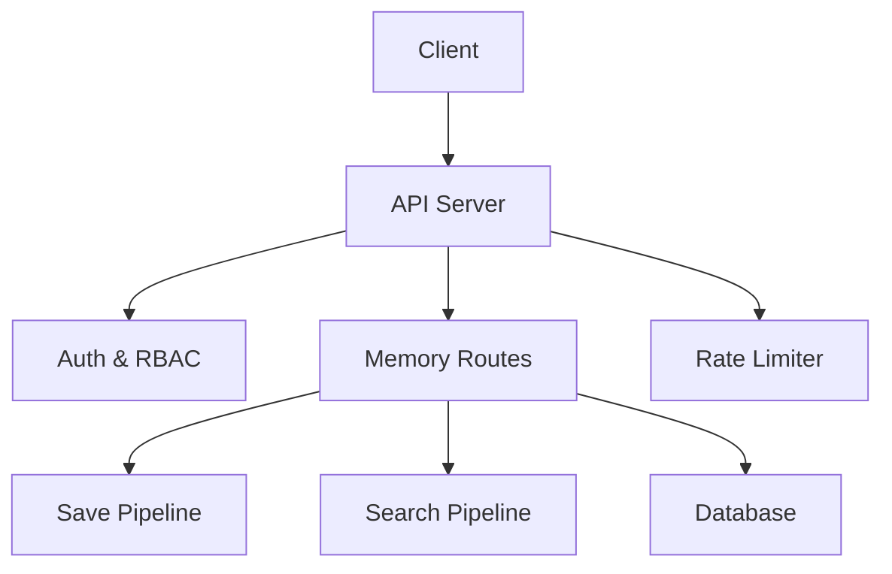
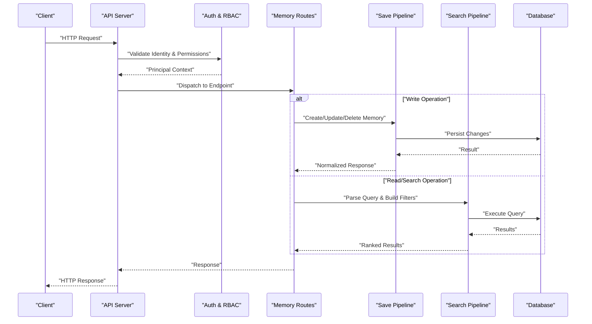
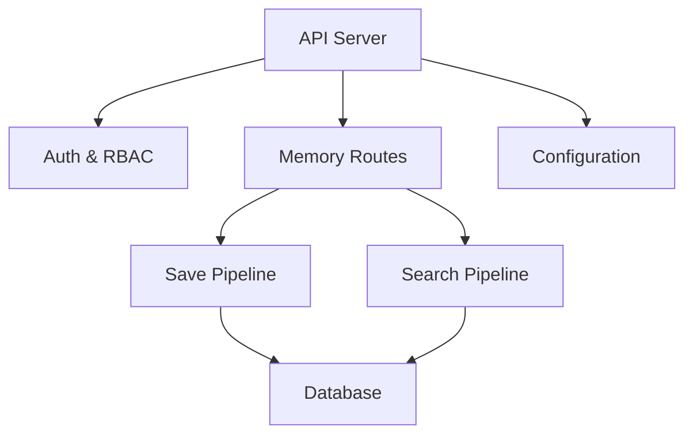

# Memory Operations API

<cite>
**Referenced Files in This Document**
- [api_server.py](file://infra/api_server.py)
- [mcp_memory.py](file://mcp_memory.py)
- [memory_common.py](file://memory_common.py)
- [models.py](file://agentic_memory/models.py)
- [client.py](file://agentic_memory/client.py)
- [rate_limiter.py](file://infra/rate_limiter.py)
- [authlib_sso.py](file://infra/authlib_sso.py)
- [rbac.py](file://infra/rbac.py)
- [search_pipeline.py](file://search_pipeline.py)
- [save_pipeline.py](file://save_pipeline.py)
- [db.py](file://db.py)
- [config.py](file://config.py)
- [rest-api.md](file://docs/api/rest-api.md)
</cite>

## Table of Contents
1. [Introduction](#introduction)
2. [Project Structure](#project-structure)
3. [Core Components](#core-components)
4. [Architecture Overview](#architecture-overview)
5. [Detailed Component Analysis](#detailed-component-analysis)
6. [Dependency Analysis](#dependency-analysis)
7. [Performance Considerations](#performance-considerations)
8. [Troubleshooting Guide](#troubleshooting-guide)
9. [Conclusion](#conclusion)
10. [Appendices](#appendices)

## Introduction
This document provides detailed REST API documentation for memory operations endpoints, including HTTP methods (GET, POST, PUT, DELETE) for creating, reading, updating, and deleting memories. It covers request/response schemas, validation rules, search queries with filtering, pagination, and sorting, authentication requirements, rate limiting policies, error response formats, and examples for common operations such as bulk writes, metadata management, and temporal queries. Client implementation guidelines and best practices are included to help you integrate safely and efficiently in production environments.

## Project Structure
The memory operations API is implemented as a web server that exposes REST endpoints over HTTP. The core components include:
- API server entrypoint and route registration
- Request/response models and validation
- Authentication and authorization middleware
- Search pipeline integration for query processing
- Persistence layer interactions via the database module
- Rate limiting and policy enforcement

[No sources needed since this diagram shows conceptual workflow, not actual code structure]

## Core Components
- API Server: Registers routes, handles HTTP lifecycle, and applies global middleware such as authentication and rate limiting.
- Memory Routes: Define endpoints for CRUD operations on memories and related resources.
- Models: Define request and response schemas used by the API.
- Search Pipeline: Implements search logic, filtering, pagination, and sorting.
- Save Pipeline: Implements write path logic for creating and updating memories.
- Database: Provides persistence operations for memory data.
- Authentication and Authorization: Enforce identity and access control.
- Rate Limiter: Applies per-client or per-route throttling policies.

**Section sources**
- [api_server.py:1-200](file://infra/api_server.py#L1-L200)
- [mcp_memory.py:1-200](file://mcp_memory.py#L1-L200)
- [memory_common.py:1-200](file://memory_common.py#L1-L200)
- [models.py:1-200](file://agentic_memory/models.py#L1-L200)
- [client.py:1-200](file://agentic_memory/client.py#L1-L200)
- [rate_limiter.py:1-200](file://infra/rate_limiter.py#L1-L200)
- [authlib_sso.py:1-200](file://infra/authlib_sso.py#L1-L200)
- [rbac.py:1-200](file://infra/rbac.py#L1-L200)
- [search_pipeline.py:1-200](file://search_pipeline.py#L1-L200)
- [save_pipeline.py:1-200](file://save_pipeline.py#L1-L200)
- [db.py:1-200](file://db.py#L1-L200)
- [config.py:1-200](file://config.py#L1-L200)
- [rest-api.md:1-200](file://docs/api/rest-api.md#L1-L200)

## Architecture Overview
The memory operations API follows a layered architecture:
- Presentation Layer: HTTP endpoints defined in the API server and memory routes.
- Business Logic Layer: Save and search pipelines orchestrate domain-specific workflows.
- Data Access Layer: Database module abstracts storage operations.
- Cross-Cutting Concerns: Authentication, authorization, rate limiting, and configuration.

**Diagram sources**
- [api_server.py:1-200](file://infra/api_server.py#L1-L200)
- [mcp_memory.py:1-200](file://mcp_memory.py#L1-L200)
- [save_pipeline.py:1-200](file://save_pipeline.py#L1-L200)
- [search_pipeline.py:1-200](file://search_pipeline.py#L1-L200)
- [db.py:1-200](file://db.py#L1-L200)

## Detailed Component Analysis

### Authentication and Authorization
- Authentication: Supports token-based and SSO flows; principal context is attached to requests after successful verification.
- Authorization: Role-based access control (RBAC) enforces permissions on endpoints and resources.
- Principal Scoping: Tenant isolation ensures clients can only access their own data.

Best practices:
- Always include valid credentials in the Authorization header.
- Use short-lived tokens and refresh securely.
- Respect tenant boundaries and avoid cross-tenant calls.

**Section sources**
- [authlib_sso.py:1-200](file://infra/authlib_sso.py#L1-L200)
- [rbac.py:1-200](file://infra/rbac.py#L1-L200)
- [api_server.py:1-200](file://infra/api_server.py#L1-L200)

### Rate Limiting
- Global and per-route limits are enforced to protect service stability.
- Limits may vary by client tier or role.
- Responses include headers indicating remaining quota and reset time.

Implementation notes:
- Clients should implement exponential backoff on 429 responses.
- Cache results when possible to reduce request volume.

**Section sources**
- [rate_limiter.py:1-200](file://infra/rate_limiter.py#L1-L200)
- [api_server.py:1-200](file://infra/api_server.py#L1-L200)

### Memory Endpoints

#### Create Memory (POST /memories)
- Purpose: Create one or more memories in a single request.
- Authentication: Required.
- Rate Limiting: Applies.
- Request Schema:
  - body: Array of memory objects
    - content: string (required)
    - metadata: object (optional)
      - tags: array of strings (optional)
      - source: string (optional)
      - version: integer (optional)
    - observed_at: string ISO-8601 (optional)
    - session_id: string (optional)
    - agent_id: string (optional)
    - priority: number (optional)
- Validation Rules:
  - content must be non-empty.
  - observed_at must be valid ISO-8601 if provided.
  - metadata fields must conform to expected types.
- Response Schema:
  - id: string
  - status: string ("created")
  - created_at: string ISO-8601
  - version: integer
  - metadata: object
- Bulk Behavior:
  - Partial failures return individual item statuses.
  - Idempotency keys supported via optional header.

Example:
- Create multiple memories with metadata and timestamps.

**Section sources**
- [mcp_memory.py:1-200](file://mcp_memory.py#L1-L200)
- [save_pipeline.py:1-200](file://save_pipeline.py#L1-L200)
- [models.py:1-200](file://agentic_memory/models.py#L1-L200)
- [db.py:1-200](file://db.py#L1-L200)

#### Read Memory (GET /memories/{id})
- Purpose: Retrieve a specific memory by ID.
- Authentication: Required.
- Response Schema:
  - id: string
  - content: string
  - metadata: object
  - observed_at: string ISO-8601
  - session_id: string
  - agent_id: string
  - priority: number
  - created_at: string ISO-8601
  - updated_at: string ISO-8601
  - version: integer
- Error Codes:
  - 404 Not Found if memory does not exist.

Example:
- Fetch a memory by ID and inspect its metadata.

**Section sources**
- [mcp_memory.py:1-200](file://mcp_memory.py#L1-L200)
- [db.py:1-200](file://db.py#L1-L200)

#### Update Memory (PUT /memories/{id})
- Purpose: Update an existing memory’s content or metadata.
- Authentication: Required.
- Request Schema:
  - content: string (optional)
  - metadata: object (optional)
  - observed_at: string ISO-8601 (optional)
  - priority: number (optional)
- Validation Rules:
  - At least one updatable field must be provided.
  - observed_at must be valid ISO-8601 if provided.
- Response Schema:
  - id: string
  - status: string ("updated")
  - updated_at: string ISO-8601
  - version: integer
- Conflict Handling:
  - Optimistic concurrency via version field; returns 409 Conflict if mismatched.

Example:
- Update metadata tags and adjust priority.

**Section sources**
- [mcp_memory.py:1-200](file://mcp_memory.py#L1-L200)
- [save_pipeline.py:1-200](file://save_pipeline.py#L1-L200)
- [models.py:1-200](file://agentic_memory/models.py#L1-L200)
- [db.py:1-200](file://db.py#L1-L200)

#### Delete Memory (DELETE /memories/{id})
- Purpose: Permanently remove a memory.
- Authentication: Required.
- Response Schema:
  - id: string
  - status: string ("deleted")
  - deleted_at: string ISO-8601
- Soft Delete Policy:
  - If enabled, returns soft-deleted state with tombstone metadata.

Example:
- Delete a memory and verify removal.

**Section sources**
- [mcp_memory.py:1-200](file://mcp_memory.py#L1-L200)
- [save_pipeline.py:1-200](file://save_pipeline.py#L1-L200)
- [db.py:1-200](file://db.py#L1-L200)

#### Search Memories (GET /memories/search)
- Purpose: Search memories using full-text, filters, pagination, and sorting.
- Authentication: Required.
- Query Parameters:
  - q: string (full-text query)
  - filters: object (optional)
    - tags: array of strings (optional)
    - source: string (optional)
    - session_id: string (optional)
    - agent_id: string (optional)
    - min_priority: number (optional)
    - max_priority: number (optional)
  - temporal: object (optional)
    - from: string ISO-8601 (optional)
    - to: string ISO-8601 (optional)
    - as_of: string ISO-8601 (optional)
  - pagination: object (optional)
    - page: integer (default 1)
    - size: integer (default 20, max 100)
  - sort: object (optional)
    - field: string (e.g., "observed_at", "priority", "score")
    - order: string ("asc" | "desc")
- Response Schema:
  - results: array of memory objects
  - total: integer
  - page: integer
  - size: integer
  - has_more: boolean
- Sorting Capabilities:
  - Default relevance scoring unless overridden.
  - Temporal queries support “as-of” semantics for historical views.

Example:
- Search memories tagged with “project-alpha”, within a date range, sorted by priority descending.

**Section sources**
- [mcp_memory.py:1-200](file://mcp_memory.py#L1-L200)
- [search_pipeline.py:1-200](file://search_pipeline.py#L1-L200)
- [db.py:1-200](file://db.py#L1-L200)

### Metadata Management
- Metadata fields:
  - tags: array of strings for categorization.
  - source: string indicating origin system.
  - version: integer for change tracking.
- Best Practices:
  - Keep metadata small and indexed-friendly.
  - Avoid storing large blobs in metadata.

**Section sources**
- [models.py:1-200](file://agentic_memory/models.py#L1-L200)
- [memory_common.py:1-200](file://memory_common.py#L1-L200)

### Temporal Queries
- Time-bounded searches:
  - Use from/to to constrain observed_at.
  - Use as_of to retrieve state at a specific point in time.
- Temporal Semantics:
  - Observations are treated as events; versions reflect updates.

Example:
- Retrieve memories as of a given timestamp for audit purposes.

**Section sources**
- [search_pipeline.py:1-200](file://search_pipeline.py#L1-L200)
- [models.py:1-200](file://agentic_memory/models.py#L1-L200)

### Bulk Operations
- Create many memories in one request.
- Partial failure handling with per-item statuses.
- Idempotency via optional idempotency key header.

Example:
- Ingest a batch of logs with metadata and timestamps.

**Section sources**
- [mcp_memory.py:1-200](file://mcp_memory.py#L1-L200)
- [save_pipeline.py:1-200](file://save_pipeline.py#L1-L200)

### Error Response Formats
- Standardized error envelope:
  - code: string (error code)
  - message: string (human-readable description)
  - details: object (optional, additional context)
- Common Status Codes:
  - 200 OK: Successful read/update/delete.
  - 201 Created: Successful creation.
  - 400 Bad Request: Validation errors.
  - 401 Unauthorized: Missing or invalid credentials.
  - 403 Forbidden: Insufficient permissions.
  - 404 Not Found: Resource does not exist.
  - 409 Conflict: Version mismatch or duplicate.
  - 429 Too Many Requests: Rate limit exceeded.
  - 500 Internal Server Error: Unexpected failure.

**Section sources**
- [api_server.py:1-200](file://infra/api_server.py#L1-L200)
- [mcp_memory.py:1-200](file://mcp_memory.py#L1-L200)

## Dependency Analysis
The memory operations API depends on several subsystems:
- Authentication and RBAC enforce security.
- Save and search pipelines encapsulate business logic.
- Database abstraction ensures consistent persistence.
- Configuration drives runtime behavior.

**Diagram sources**
- [api_server.py:1-200](file://infra/api_server.py#L1-L200)
- [mcp_memory.py:1-200](file://mcp_memory.py#L1-L200)
- [save_pipeline.py:1-200](file://save_pipeline.py#L1-L200)
- [search_pipeline.py:1-200](file://search_pipeline.py#L1-L200)
- [db.py:1-200](file://db.py#L1-L200)
- [config.py:1-200](file://config.py#L1-L200)

**Section sources**
- [api_server.py:1-200](file://infra/api_server.py#L1-L200)
- [mcp_memory.py:1-200](file://mcp_memory.py#L1-L200)
- [save_pipeline.py:1-200](file://save_pipeline.py#L1-L200)
- [search_pipeline.py:1-200](file://search_pipeline.py#L1-L200)
- [db.py:1-200](file://db.py#L1-L200)
- [config.py:1-200](file://config.py#L1-L200)

## Performance Considerations
- Pagination: Use reasonable page sizes to avoid heavy payloads.
- Indexing: Ensure frequently filtered fields (tags, source, session_id) are indexed.
- Caching: Cache frequent reads where appropriate.
- Backpressure: Implement retries with jitter and respect rate limit headers.
- Batch Writes: Prefer bulk create to reduce round trips.

[No sources needed since this section provides general guidance]

## Troubleshooting Guide
Common issues and resolutions:
- Authentication Failures:
  - Verify token validity and scope.
  - Check tenant isolation settings.
- Rate Limit Exceeded:
  - Monitor 429 responses and back off.
  - Adjust client-side retry strategies.
- Validation Errors:
  - Ensure required fields are present and correctly typed.
  - Validate ISO-8601 timestamps.
- Concurrency Conflicts:
  - Handle 409 responses by re-fetching latest version and retrying.

**Section sources**
- [authlib_sso.py:1-200](file://infra/authlib_sso.py#L1-L200)
- [rate_limiter.py:1-200](file://infra/rate_limiter.py#L1-L200)
- [mcp_memory.py:1-200](file://mcp_memory.py#L1-L200)

## Conclusion
The Memory Operations API provides robust CRUD capabilities, advanced search with filtering and temporal queries, strong authentication and authorization, and rate limiting for production safety. By following the schemas, validation rules, and best practices outlined here, clients can integrate reliably and efficiently.

[No sources needed since this section summarizes without analyzing specific files]

## Appendices

### Client Implementation Guidelines
- Use SDK wrappers where available for type safety and convenience.
- Implement exponential backoff and circuit breakers for resilience.
- Log requests and responses for observability while redacting sensitive data.
- Respect tenant boundaries and never mix principals across tenants.

**Section sources**
- [client.py:1-200](file://agentic_memory/client.py#L1-L200)
- [rest-api.md:1-200](file://docs/api/rest-api.md#L1-L200)