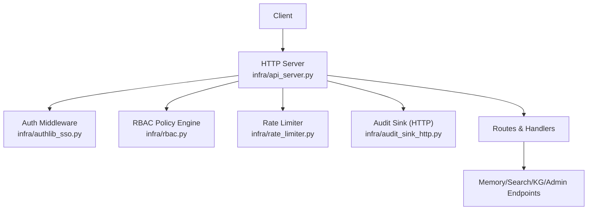
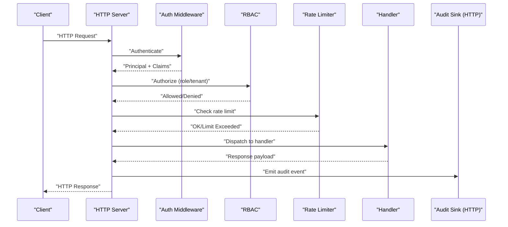
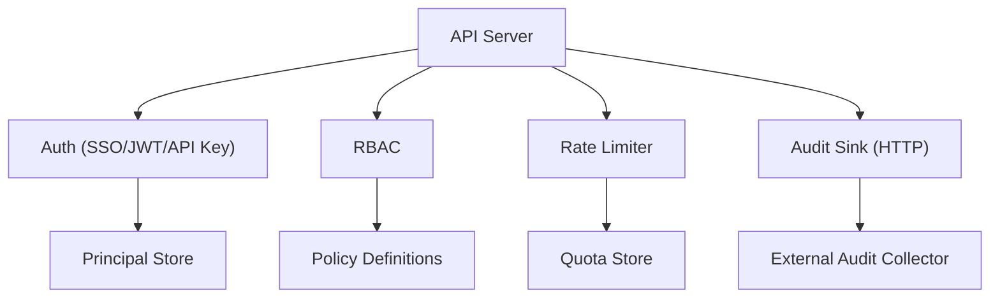

# REST API

<cite>
**Referenced Files in This Document**
- [api_server.py](file://infra/api_server.py)
- [rate_limiter.py](file://infra/rate_limiter.py)
- [authlib_sso.py](file://infra/authlib_sso.py)
- [rbac.py](file://infra/rbac.py)
- [audit_sink_http.py](file://infra/audit_sink_http.py)
- [test_api_server.py](file://eval/test_api_server.py)
- [test_api_auth_cookie.py](file://eval/test_api_auth_cookie.py)
- [test_compliance_rate_limit.py](file://eval/test_compliance_rate_limit.py)
- [test_security_health_check.py](file://eval/test_security_health_check.py)
- [rest-api.md](file://docs/api/rest-api.md)
</cite>

## Table of Contents
1. [Introduction](#introduction)
2. [Project Structure](#project-structure)
3. [Core Components](#core-components)
4. [Architecture Overview](#architecture-overview)
5. [Detailed Component Analysis](#detailed-component-analysis)
6. [Dependency Analysis](#dependency-analysis)
7. [Performance Considerations](#performance-considerations)
8. [Troubleshooting Guide](#troubleshooting-guide)
9. [Conclusion](#conclusion)
10. [Appendices](#appendices)

## Introduction
This document provides comprehensive REST API documentation for Agentic Memory’s HTTP endpoints. It covers authentication mechanisms (API keys, JWT tokens, and session-based auth), rate limiting policies, request/response formats (JSON), error response structures, and examples for memory CRUD operations, search queries, knowledge graph management, and system administration endpoints. It also includes client implementation guidelines, error handling strategies, and best practices for production usage.

## Project Structure
The REST API surface is implemented as an HTTP server with middleware for authentication, authorization, auditing, and rate limiting. The core server wiring and route definitions are located under the infrastructure layer, while tests validate behavior and security properties. Documentation references are provided in the docs directory.

[No sources needed since this diagram shows conceptual workflow, not actual code structure]

## Core Components
- HTTP Server: Central routing, lifecycle, and middleware composition.
- Authentication: Supports API keys, JWT tokens, and session cookies via SSO integration.
- Authorization: Role-based access control (RBAC) enforcement on endpoints.
- Rate Limiting: Compliance-grade throttling to protect resources.
- Auditing: Outbound audit events via HTTP sink.

Key responsibilities:
- Route registration and request dispatch.
- Enforcing authentication and authorization.
- Applying rate limits per tenant/client.
- Emitting structured audit logs for sensitive operations.

**Section sources**
- [api_server.py](file://infra/api_server.py)
- [authlib_sso.py](file://infra/authlib_sso.py)
- [rbac.py](file://infra/rbac.py)
- [rate_limiter.py](file://infra/rate_limiter.py)
- [audit_sink_http.py](file://infra/audit_sink_http.py)

## Architecture Overview
The API follows a layered architecture:
- Presentation Layer: HTTP routes and JSON payloads.
- Security Layer: Authentication and RBAC.
- Policy Layer: Rate limiting and compliance checks.
- Domain Layer: Business logic for memories, search, knowledge graph, and admin operations.
- Observability Layer: Auditing and metrics emission.

**Diagram sources**
- [api_server.py:1-200](file://infra/api_server.py#L1-L200)
- [authlib_sso.py:1-200](file://infra/authlib_sso.py#L1-L200)
- [rbac.py:1-200](file://infra/rbac.py#L1-L200)
- [rate_limiter.py:1-200](file://infra/rate_limiter.py#L1-L200)
- [audit_sink_http.py:1-200](file://infra/audit_sink_http.py#L1-L200)

## Detailed Component Analysis

### Authentication Mechanisms
Agentic Memory supports three primary authentication methods:
- API Key: Pass via header; validated against stored keys scoped by tenant/principal.
- JWT Token: Bearer token validated using configured issuer/signing keys; claims include tenant and roles.
- Session-Based Auth: Cookie-based session established via SSO flow; principal resolved from session store.

Behavioral notes:
- If multiple credentials are present, precedence is defined by server configuration.
- Principal identity and tenant context are propagated to downstream handlers.
- Failed authentication returns standardized error responses.

Example flows:
- API key authentication: Include API key header on each request.
- JWT authentication: Include Bearer token in Authorization header.
- Session authentication: Obtain cookie via login endpoint, then reuse cookie.

**Section sources**
- [authlib_sso.py:1-200](file://infra/authlib_sso.py#L1-L200)
- [test_api_auth_cookie.py:1-200](file://eval/test_api_auth_cookie.py#L1-L200)

### Authorization (RBAC)
Role-based access control enforces permissions at the endpoint level:
- Roles define allowed actions (e.g., read/write/admin).
- Tenants isolate data access; cross-tenant requests are denied.
- Admin endpoints require elevated roles.

Authorization decisions are made after authentication and before handler execution.

**Section sources**
- [rbac.py:1-200](file://infra/rbac.py#L1-L200)

### Rate Limiting Policies
Rate limiting protects the API from abuse and ensures fair usage:
- Limits are applied per tenant or client identifier.
- Responses include standard headers indicating remaining quota and reset time.
- When exceeded, the server responds with a specific status code and retry guidance.

Compliance considerations:
- Global and per-endpoint caps can be configured.
- Logging and auditing capture throttle events for observability.

**Section sources**
- [rate_limiter.py:1-200](file://infra/rate_limiter.py#L1-L200)
- [test_compliance_rate_limit.py:1-200](file://eval/test_compliance_rate_limit.py#L1-L200)

### Request/Response Formats
- Content-Type: application/json for all endpoints.
- Accept: application/json expected by clients.
- Pagination: List endpoints support page and size parameters where applicable.
- Filtering: Query parameters allow filtering by fields such as tenant, tags, and timestamps.
- Sorting: Order-by parameters supported on list endpoints.

Error responses follow a consistent schema:
- status: integer HTTP status code.
- message: human-readable description.
- code: machine-readable error code.
- details: optional object with additional context.

**Section sources**
- [api_server.py:1-200](file://infra/api_server.py#L1-L200)

### Endpoints Reference

#### Health and System Administration
- GET /health
  - Purpose: Liveness/readiness probe.
  - Auth: None (public).
  - Response: { status: "ok", version: string, uptime_seconds: number }
  - Status Codes: 200 OK

- GET /admin/config
  - Purpose: Retrieve runtime configuration snapshot.
  - Auth: Admin role required.
  - Response: { config: object }
  - Status Codes: 200 OK, 401 Unauthorized, 403 Forbidden

- POST /admin/reload
  - Purpose: Hot-reload configuration without restart.
  - Auth: Admin role required.
  - Request Body: { strategy: "soft" | "hard" }
  - Response: { job_id: string, status: "accepted" }
  - Status Codes: 200 OK, 401 Unauthorized, 403 Forbidden, 409 Conflict

- DELETE /admin/cache
  - Purpose: Clear internal caches (embedding, reranker, etc.).
  - Auth: Admin role required.
  - Request Body: { scope: "all" | "embeddings" | "rerankers" }
  - Response: { cleared: boolean }
  - Status Codes: 200 OK, 401 Unauthorized, 403 Forbidden

**Section sources**
- [test_security_health_check.py:1-200](file://eval/test_security_health_check.py#L1-L200)
- [api_server.py:1-200](file://infra/api_server.py#L1-L200)

#### Memory CRUD Operations
- POST /memories
  - Purpose: Create a new memory entry.
  - Auth: API key/JWT/session required; write role.
  - Request Body: { text: string, tags: string[], metadata: object, observed_at: string }
  - Response: { id: string, created_at: string }
  - Status Codes: 201 Created, 400 Bad Request, 401 Unauthorized, 403 Forbidden, 429 Too Many Requests

- GET /memories/{id}
  - Purpose: Retrieve a memory by ID.
  - Auth: Read role required.
  - Response: { id: string, text: string, tags: string[], metadata: object, observed_at: string }
  - Status Codes: 200 OK, 404 Not Found, 401 Unauthorized, 403 Forbidden

- PUT /memories/{id}
  - Purpose: Update an existing memory.
  - Auth: Write role required.
  - Request Body: { text?: string, tags?: string[], metadata?: object, observed_at?: string }
  - Response: { id: string, updated_at: string }
  - Status Codes: 200 OK, 400 Bad Request, 404 Not Found, 401 Unauthorized, 403 Forbidden, 429 Too Many Requests

- DELETE /memories/{id}
  - Purpose: Delete a memory.
  - Auth: Admin or owner role required.
  - Response: { deleted: boolean }
  - Status Codes: 200 OK, 404 Not Found, 401 Unauthorized, 403 Forbidden

- GET /memories
  - Purpose: List memories with pagination and filters.
  - Query Params: page: number, size: number, tag: string, from: timestamp, to: timestamp
  - Response: { items: array, total: number, page: number, size: number }
  - Status Codes: 200 OK, 401 Unauthorized, 403 Forbidden

**Section sources**
- [api_server.py:1-200](file://infra/api_server.py#L1-L200)

#### Search Queries
- POST /search
  - Purpose: Execute hybrid search across memories and knowledge graph facts.
  - Auth: Read role required.
  - Request Body: { query: string, mode: "hybrid" | "semantic" | "keyword", filters: object, top_k: number }
  - Response: { results: array, facets: object, took_ms: number }
  - Status Codes: 200 OK, 400 Bad Request, 401 Unauthorized, 403 Forbidden, 429 Too Many Requests

- GET /search/suggest
  - Purpose: Get autocomplete suggestions based on partial input.
  - Query Params: q: string, limit: number
  - Response: { suggestions: array }
  - Status Codes: 200 OK, 401 Unauthorized, 403 Forbidden

**Section sources**
- [api_server.py:1-200](file://infra/api_server.py#L1-L200)

#### Knowledge Graph Management
- POST /kg/entities
  - Purpose: Create or upsert a knowledge graph entity.
  - Auth: Write role required.
  - Request Body: { label: string, type: string, properties: object }
  - Response: { id: string }
  - Status Codes: 201 Created, 400 Bad Request, 401 Unauthorized, 403 Forbidden

- GET /kg/entities/{id}
  - Purpose: Retrieve an entity by ID.
  - Auth: Read role required.
  - Response: { id: string, label: string, type: string, properties: object }
  - Status Codes: 200 OK, 404 Not Found, 401 Unauthorized, 403 Forbidden

- PUT /kg/entities/{id}
  - Purpose: Update entity properties.
  - Auth: Write role required.
  - Request Body: { properties: object }
  - Response: { updated_at: string }
  - Status Codes: 200 OK, 400 Bad Request, 404 Not Found, 401 Unauthorized, 403 Forbidden

- DELETE /kg/entities/{id}
  - Purpose: Delete an entity.
  - Auth: Admin or owner role required.
  - Response: { deleted: boolean }
  - Status Codes: 200 OK, 404 Not Found, 401 Unauthorized, 403 Forbidden

- POST /kg/facts
  - Purpose: Add a fact linking entities.
  - Auth: Write role required.
  - Request Body: { subject_id: string, predicate: string, object_id: string, temporal: object }
  - Response: { id: string }
  - Status Codes: 201 Created, 400 Bad Request, 401 Unauthorized, 403 Forbidden

- GET /kg/traverse
  - Purpose: Traverse relationships from a starting entity.
  - Query Params: start_id: string, depth: number, predicates: string[]
  - Response: { nodes: array, edges: array }
  - Status Codes: 200 OK, 400 Bad Request, 401 Unauthorized, 403 Forbidden

**Section sources**
- [api_server.py:1-200](file://infra/api_server.py#L1-L200)

#### Sessions and Sharing
- POST /sessions
  - Purpose: Start a new session for batched writes.
  - Auth: Write role required.
  - Request Body: { purpose: string, ttl_seconds: number }
  - Response: { session_id: string }
  - Status Codes: 201 Created, 400 Bad Request, 401 Unauthorized, 403 Forbidden

- GET /sessions/{id}
  - Purpose: Retrieve session state.
  - Auth: Read role required.
  - Response: { session_id: string, status: string, created_at: string }
  - Status Codes: 200 OK, 404 Not Found, 401 Unauthorized, 403 Forbidden

- POST /share
  - Purpose: Share a resource (memory/kg entity) with another tenant.
  - Auth: Owner role required.
  - Request Body: { resource_type: string, resource_id: string, target_tenant: string, permission: "read" | "write" }
  - Response: { share_id: string }
  - Status Codes: 201 Created, 400 Bad Request, 401 Unauthorized, 403 Forbidden

**Section sources**
- [api_server.py:1-200](file://infra/api_server.py#L1-L200)

#### Auditing and Compliance
- GET /audit/events
  - Purpose: Retrieve audit events for a tenant or principal.
  - Query Params: from: timestamp, to: timestamp, action: string
  - Response: { events: array, total: number }
  - Status Codes: 200 OK, 401 Unauthorized, 403 Forbidden

- POST /gdpr/erase
  - Purpose: Submit a GDPR erasure request for a subject.
  - Auth: Admin role required.
  - Request Body: { subject_id: string, tenant_id: string }
  - Response: { request_id: string, status: "accepted" }
  - Status Codes: 201 Created, 400 Bad Request, 401 Unauthorized, 403 Forbidden

**Section sources**
- [audit_sink_http.py:1-200](file://infra/audit_sink_http.py#L1-L200)
- [api_server.py:1-200](file://infra/api_server.py#L1-L200)

### Error Handling Strategies
Standardized error response schema:
- status: integer HTTP status code.
- message: human-readable description.
- code: machine-readable error code (e.g., "AUTH_FAILED", "RATE_LIMITED", "NOT_FOUND").
- details: optional object with additional context (e.g., missing fields, validation errors).

Common status codes:
- 200 OK: Successful operation.
- 201 Created: Resource created successfully.
- 400 Bad Request: Invalid request body or parameters.
- 401 Unauthorized: Missing or invalid credentials.
- 403 Forbidden: Insufficient permissions.
- 404 Not Found: Resource does not exist.
- 429 Too Many Requests: Rate limit exceeded.
- 500 Internal Server Error: Unexpected server failure.

Retry guidance:
- For 429, respect Retry-After header if present.
- Implement exponential backoff for transient failures (5xx).

**Section sources**
- [api_server.py:1-200](file://infra/api_server.py#L1-L200)
- [test_compliance_rate_limit.py:1-200](file://eval/test_compliance_rate_limit.py#L1-L200)

### Client Implementation Guidelines
- Use HTTPS for all connections.
- Set Content-Type: application/json and Accept: application/json.
- Include authentication credentials:
  - API Key: X-API-Key header.
  - JWT: Authorization: Bearer <token>.
  - Session: Cookie header with session value.
- Handle pagination by iterating through pages until total is reached.
- Implement retries with exponential backoff for 429 and 5xx responses.
- Log correlation IDs from response headers for tracing.

Best practices:
- Cache static configuration and public endpoints when safe.
- Respect rate limit headers and back off accordingly.
- Validate responses against expected schemas before processing.
- Scope requests to tenant identifiers to avoid cross-tenant leakage.

**Section sources**
- [api_server.py:1-200](file://infra/api_server.py#L1-L200)
- [test_api_auth_cookie.py:1-200](file://eval/test_api_auth_cookie.py#L1-L200)

## Dependency Analysis
The API server composes several subsystems:
- Authentication depends on SSO integration and token validators.
- Authorization relies on RBAC policy engine and tenant scoping.
- Rate limiter integrates with global counters and per-client quotas.
- Audit sink emits events over HTTP to external collectors.

**Diagram sources**
- [api_server.py:1-200](file://infra/api_server.py#L1-L200)
- [authlib_sso.py:1-200](file://infra/authlib_sso.py#L1-L200)
- [rbac.py:1-200](file://infra/rbac.py#L1-L200)
- [rate_limiter.py:1-200](file://infra/rate_limiter.py#L1-L200)
- [audit_sink_http.py:1-200](file://infra/audit_sink_http.py#L1-L200)

**Section sources**
- [api_server.py:1-200](file://infra/api_server.py#L1-L200)
- [authlib_sso.py:1-200](file://infra/authlib_sso.py#L1-L200)
- [rbac.py:1-200](file://infra/rbac.py#L1-L200)
- [rate_limiter.py:1-200](file://infra/rate_limiter.py#L1-L200)
- [audit_sink_http.py:1-200](file://infra/audit_sink_http.py#L1-L200)

## Performance Considerations
- Prefer batch endpoints for bulk operations to reduce overhead.
- Use pagination and filtering to minimize payload sizes.
- Enable compression for large responses if supported by clients.
- Monitor rate limit thresholds and tune per-tenant quotas based on usage patterns.
- Cache frequently accessed read-only resources at the client side with appropriate TTL.

[No sources needed since this section provides general guidance]

## Troubleshooting Guide
Common issues and resolutions:
- Authentication failures: Verify API key validity, JWT issuer/signing keys, or session cookie presence.
- Authorization denials: Confirm user roles and tenant scoping.
- Rate limit errors: Check remaining quota headers and adjust request pacing.
- Audit events missing: Ensure audit sink URL is reachable and accepts POST requests.

Diagnostic steps:
- Inspect health endpoint for service readiness.
- Review audit logs for failed operations.
- Enable verbose logging for request/response payloads in development environments.

**Section sources**
- [test_security_health_check.py:1-200](file://eval/test_security_health_check.py#L1-L200)
- [audit_sink_http.py:1-200](file://infra/audit_sink_http.py#L1-L200)

## Conclusion
Agentic Memory’s REST API provides secure, scalable access to memory, search, knowledge graph, and administrative capabilities. With robust authentication, RBAC, rate limiting, and auditing, it supports production-grade deployments. Clients should implement resilient error handling, respect rate limits, and adhere to tenant isolation to ensure reliable and compliant usage.

[No sources needed since this section summarizes without analyzing specific files]

## Appendices
- Additional reference documentation:
  - REST API overview and examples: [rest-api.md](file://docs/api/rest-api.md)
  - API server implementation: [api_server.py](file://infra/api_server.py)
  - Authentication via SSO: [authlib_sso.py](file://infra/authlib_sso.py)
  - RBAC policy engine: [rbac.py](file://infra/rbac.py)
  - Rate limiting: [rate_limiter.py](file://infra/rate_limiter.py)
  - Audit sink (HTTP): [audit_sink_http.py](file://infra/audit_sink_http.py)
  - Tests validating behavior:
    - [test_api_server.py](file://eval/test_api_server.py)
    - [test_api_auth_cookie.py](file://eval/test_api_auth_cookie.py)
    - [test_compliance_rate_limit.py](file://eval/test_compliance_rate_limit.py)
    - [test_security_health_check.py](file://eval/test_security_health_check.py)

**Section sources**
- [rest-api.md](file://docs/api/rest-api.md)
- [api_server.py:1-200](file://infra/api_server.py#L1-L200)
- [authlib_sso.py:1-200](file://infra/authlib_sso.py#L1-L200)
- [rbac.py:1-200](file://infra/rbac.py#L1-L200)
- [rate_limiter.py:1-200](file://infra/rate_limiter.py#L1-L200)
- [audit_sink_http.py:1-200](file://infra/audit_sink_http.py#L1-L200)
- [test_api_server.py:1-200](file://eval/test_api_server.py#L1-L200)
- [test_api_auth_cookie.py:1-200](file://eval/test_api_auth_cookie.py#L1-L200)
- [test_compliance_rate_limit.py:1-200](file://eval/test_compliance_rate_limit.py#L1-L200)
- [test_security_health_check.py:1-200](file://eval/test_security_health_check.py#L1-L200)