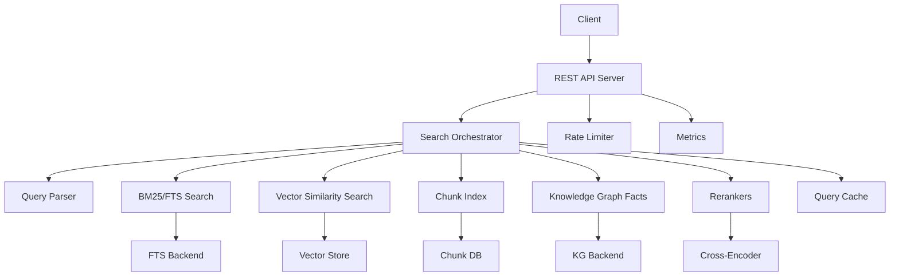
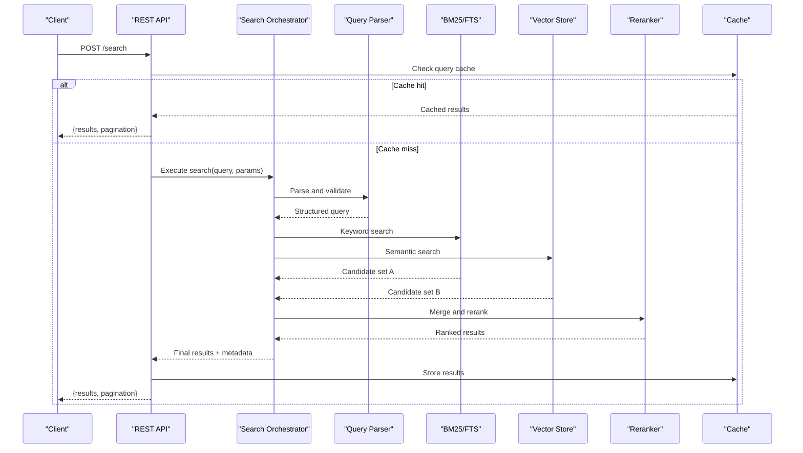
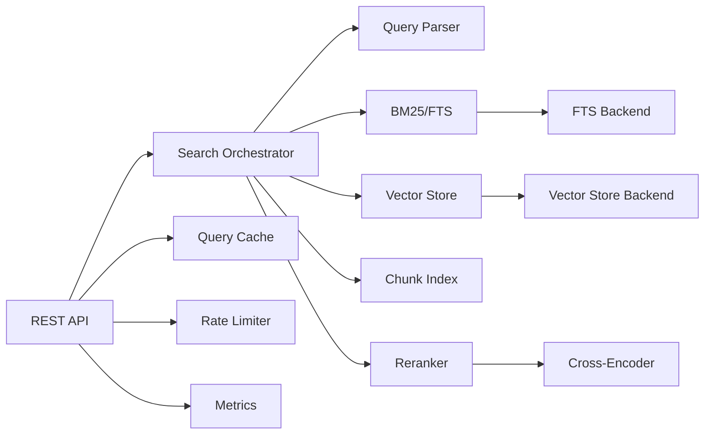

# Search Endpoints

<cite>
**Referenced Files in This Document**
- [rest-api.md](file://docs/api/rest-api.md)
- [search-pipeline.md](file://docs/concepts/search-pipeline.md)
- [api_server.py](file://infra/api_server.py)
- [mcp_search.py](file://mcp_search.py)
- [search_memory.py](file://search_memory.py)
- [search_pipeline.py](file://search_pipeline.py)
- [orchestrator.py](file://search/orchestrator.py)
- [query_parser.py](file://search/query_parser.py)
- [rerankers.py](file://search/rerankers.py)
- [config.py](file://search/config.py)
- [state.py](file://search/state.py)
- [scoring.py](file://search/scoring.py)
- [enrichment.py](file://search/enrichment.py)
- [feedback.py](file://search/feedback.py)
- [answer_rerank.py](file://search/answer_rerank.py)
- [colbert_rerank.py](file://search/colbert_rerank.py)
- [splade_index.py](file://search/splade_index.py)
- [colbert_index.py](file://search/colbert_index.py)
- [chunk_index.py](file://search/chunk_index.py)
- [fts.py](file://infra/fts.py)
- [vector_store.py](file://infra/vector_store.py)
- [embedding_search.py](file://infra/embedding_search.py)
- [cache.py](file://infra/cache.py)
- [arc_cache.py](file://arc_cache.py)
- [memory_config.py](file://infra/memory_config.py)
- [config.py](file://infra/config.py)
- [rate_limiter.py](file://infra/rate_limiter.py)
- [metrics.py](file://infra/metrics.py)
- [test_search_modes.py](file://eval/test_search_modes.py)
- [test_hybrid_strategy.py](file://eval/test_hybrid_strategy.py)
- [test_qw3_query_types.py](file://eval/test_qw3_query_types.py)
- [test_qw4_cross_encoder.py](file://eval/test_qw4_cross_encoder.py)
- [test_reranker_unit.py](file://eval/test_reranker_unit.py)
- [test_search_temporal_as_of.py](file://eval/test_search_temporal_as_of.py)
- [test_multi_hop_traversal.py](file://eval/test_multi_hop_traversal.py)
- [test_search_ce_cache.py](file://eval/test_search_ce_cache.py)
- [test_search_concurrent.py](file://eval/test_search_concurrent.py)
- [test_search_large_corpus.py](file://eval/test_search_large_corpus.py)
</cite>

## Table of Contents
1. [Introduction](#introduction)
2. [Project Structure](#project-structure)
3. [Core Components](#core-components)
4. [Architecture Overview](#architecture-overview)
5. [Detailed Component Analysis](#detailed-component-analysis)
6. [Dependency Analysis](#dependency-analysis)
7. [Performance Considerations](#performance-considerations)
8. [Troubleshooting Guide](#troubleshooting-guide)
9. [Conclusion](#conclusion)
10. [Appendices](#appendices)

## Introduction
This document provides detailed REST API documentation for search and retrieval endpoints, focusing on hybrid search that combines BM25 keyword matching with vector similarity search. It covers query parameters for text search, semantic search, temporal filtering, ranking options, configuration, result formatting, pagination, advanced features (query expansion, reranking strategies, multi-hop reasoning), example scenarios, performance optimization tips, and caching strategies.

## Project Structure
The search functionality is implemented across several modules:
- HTTP API surface and routing
- Query parsing and orchestration
- Retrieval phases (BM25, vector, KG facts)
- Reranking and scoring
- Indexing backends (FTS, vector store, chunk index)
- Caching and rate limiting
- Configuration and metrics

**Diagram sources**
- [api_server.py](file://infra/api_server.py)
- [orchestrator.py](file://search/orchestrator.py)
- [query_parser.py](file://search/query_parser.py)
- [fts.py](file://infra/fts.py)
- [vector_store.py](file://infra/vector_store.py)
- [chunk_index.py](file://search/chunk_index.py)
- [rerankers.py](file://search/rerankers.py)
- [colbert_rerank.py](file://search/colbert_rerank.py)
- [cache.py](file://infra/cache.py)
- [rate_limiter.py](file://infra/rate_limiter.py)
- [metrics.py](file://infra/metrics.py)

**Section sources**
- [rest-api.md](file://docs/api/rest-api.md)
- [search-pipeline.md](file://docs/concepts/search-pipeline.md)

## Core Components
- REST API server exposes search endpoints and enforces authentication, rate limits, and metrics collection.
- Query parser validates and normalizes user queries into structured forms supporting text, semantic, temporal, and ranking options.
- Orchestrator coordinates retrieval phases (BM25, vector, chunk, KG facts), merges results, applies reranking, and formats outputs.
- Rerankers include cross-encoder and model-based strategies to refine rankings.
- Indexing backends provide BM25 via FTS, vector embeddings via vector store, and chunk-level indexing for fine-grained retrieval.
- Caching layer accelerates repeated queries; rate limiter protects the system under load; metrics capture latency and throughput.

**Section sources**
- [api_server.py](file://infra/api_server.py)
- [query_parser.py](file://search/query_parser.py)
- [orchestrator.py](file://search/orchestrator.py)
- [rerankers.py](file://search/rerankers.py)
- [fts.py](file://infra/fts.py)
- [vector_store.py](file://infra/vector_store.py)
- [chunk_index.py](file://search/chunk_index.py)
- [cache.py](file://infra/cache.py)
- [rate_limiter.py](file://infra/rate_limiter.py)
- [metrics.py](file://infra/metrics.py)

## Architecture Overview
The search pipeline follows a hybrid approach:
- Text search uses BM25 over full-text indices.
- Semantic search computes vector similarity against embedding indices.
- Temporal filters constrain results by observed time or as-of timestamps.
- Results are merged and optionally reranked using cross-encoders or learned models.
- Output supports multiple formats and pagination controls.

**Diagram sources**
- [api_server.py](file://infra/api_server.py)
- [orchestrator.py](file://search/orchestrator.py)
- [query_parser.py](file://search/query_parser.py)
- [fts.py](file://infra/fts.py)
- [vector_store.py](file://infra/vector_store.py)
- [rerankers.py](file://search/rerankers.py)
- [cache.py](file://infra/cache.py)

## Detailed Component Analysis

### REST API Endpoints
- Endpoint: POST /search
  - Purpose: Execute hybrid search combining BM25 and vector similarity.
  - Request body fields:
    - query: string or object specifying text, semantic, temporal, and ranking options.
    - filters: optional constraints (e.g., tenant_id, session_id, entity types).
    - config: search configuration overrides (weights, strategy, reranker selection).
    - format: output format (json, markdown, structured).
    - pagination: page, per_page, cursor.
  - Response fields:
    - results: array of scored items with metadata.
    - pagination: total, page, per_page, next_cursor.
    - meta: timing, strategy used, cache status.
  - Error responses:
    - 400 Bad Request for invalid parameters.
    - 429 Too Many Requests when rate limited.
    - 500 Internal Server Error for backend failures.

- Endpoint: GET /health
  - Purpose: Health check including search subsystems.
  - Response: status, components (fts, vector_store, cache), uptime.

- Endpoint: POST /search/debug
  - Purpose: Debug mode returning intermediate stages and timings.
  - Response: stages, timings, candidates, rerank_scores.

**Section sources**
- [rest-api.md](file://docs/api/rest-api.md)
- [api_server.py](file://infra/api_server.py)

### Query Parsing and Validation
- Supports:
  - text: BM25 keyword search terms.
  - semantic: vector query text or embedding vector.
  - temporal: as_of timestamp, observed_after, observed_before.
  - ranking: weights for BM25 vs vector, boost factors, diversity.
  - filters: tenant_id, session_id, entity_type, tags.
  - config: strategy (bm25, vector, hybrid), reranker (none, cross_encoder, colbert), cache_ttl.
- Validation ensures required fields, type checks, and constraint enforcement.

**Section sources**
- [query_parser.py](file://search/query_parser.py)
- [config.py](file://search/config.py)

### Search Orchestration
- Coordinates retrieval phases:
  - BM25 over FTS index.
  - Vector similarity over embedding index.
  - Chunk-level retrieval for granular matches.
  - Knowledge graph facts for entity-centric queries.
- Merges candidate sets, applies deduplication, and ranks results.
- Applies reranking strategies based on configuration.

**Section sources**
- [orchestrator.py](file://search/orchestrator.py)
- [state.py](file://search/state.py)

### Reranking Strategies
- None: Use initial merge scores.
- Cross-encoder: Re-score pairs using a trained model.
- Colbert: Fine-grained token-level similarity.
- Learned-to-rank: Model-based scoring using LTR features.

**Section sources**
- [rerankers.py](file://search/rerankers.py)
- [colbert_rerank.py](file://search/colbert_rerank.py)
- [answer_rerank.py](file://search/answer_rerank.py)

### Indexing Backends
- FTS: Full-text search with BM25 scoring.
- Vector Store: Embedding storage and similarity search.
- Chunk Index: Fine-grained chunk retrieval and scoring.
- SPLADE: Sparse lexical representations for enhanced BM25.

**Section sources**
- [fts.py](file://infra/fts.py)
- [vector_store.py](file://infra/vector_store.py)
- [chunk_index.py](file://search/chunk_index.py)
- [splade_index.py](file://search/splade_index.py)

### Caching and Rate Limiting
- Query cache stores recent results keyed by normalized query and filters.
- TTL configurable per endpoint or globally.
- Rate limiter enforces per-client request quotas.
- ARC cache optimizes frequent access patterns.

**Section sources**
- [cache.py](file://infra/cache.py)
- [arc_cache.py](file://arc_cache.py)
- [rate_limiter.py](file://infra/rate_limiter.py)

### Metrics and Observability
- Tracks latency, throughput, cache hit ratio, rerank usage.
- Exposes metrics for monitoring and alerting.
- Integrates with logging for debugging search pipelines.

**Section sources**
- [metrics.py](file://infra/metrics.py)
- [api_server.py](file://infra/api_server.py)

## Dependency Analysis

**Diagram sources**
- [api_server.py](file://infra/api_server.py)
- [orchestrator.py](file://search/orchestrator.py)
- [query_parser.py](file://search/query_parser.py)
- [fts.py](file://infra/fts.py)
- [vector_store.py](file://infra/vector_store.py)
- [chunk_index.py](file://search/chunk_index.py)
- [rerankers.py](file://search/rerankers.py)
- [colbert_rerank.py](file://search/colbert_rerank.py)
- [cache.py](file://infra/cache.py)
- [rate_limiter.py](file://infra/rate_limiter.py)
- [metrics.py](file://infra/metrics.py)

**Section sources**
- [search-pipeline.md](file://docs/concepts/search-pipeline.md)

## Performance Considerations
- Use hybrid strategy judiciously: combine BM25 and vector only when needed to balance precision and latency.
- Enable query caching for repeated queries with short TTLs.
- Tune reranker selection: cross-encoder improves accuracy but adds latency; use selectively.
- Optimize vector store queries with appropriate top_k and distance thresholds.
- Monitor metrics and adjust rate limits to prevent overload.
- Precompute embeddings and SPLADE indices to reduce runtime overhead.

[No sources needed since this section provides general guidance]

## Troubleshooting Guide
- Validate query structure using debug endpoint to inspect parsed fields.
- Check cache hit ratio and TTL settings if results seem stale.
- Inspect reranker logs to understand score changes.
- Verify FTS and vector index health via health endpoint.
- Use metrics to identify bottlenecks in specific phases.

**Section sources**
- [api_server.py](file://infra/api_server.py)
- [metrics.py](file://infra/metrics.py)

## Conclusion
The search endpoints provide a robust hybrid search capability combining BM25 and vector similarity, with flexible configuration, temporal filtering, and advanced reranking. Proper tuning of parameters, caching, and rerankers can significantly improve performance and relevance. Monitoring and debugging tools help maintain reliability and efficiency.

[No sources needed since this section summarizes without analyzing specific files]

## Appendices

### Example Scenarios
- Fact-based query: Use BM25 with temporal filters to retrieve precise facts within a time range.
- Semantic similarity search: Use vector similarity with high weight to find conceptually related content.
- Temporal reasoning query: Combine as_of timestamp with BM25 to retrieve context at a specific time.

[No sources needed since this section provides conceptual examples]

### Advanced Features
- Query expansion: Automatically expand terms using synonyms or related entities.
- Multi-hop reasoning: Traverse knowledge graph edges to answer complex queries.
- Diversity ranking: Promote diverse results to avoid redundancy.

[No sources needed since this section provides conceptual examples]