# Administration and Operations

<cite>
**Referenced Files in This Document**
- [dashboard.py](file://dashboard.py)
- [dashboard/tabs.py](file://dashboard/tabs.py)
- [dashboard/tab_dashboard.py](file://dashboard/tab_dashboard.py)
- [dashboard/tab_operations.py](file://dashboard/tab_operations.py)
- [dashboard/tab_settings.py](file://dashboard/tab_settings.py)
- [dashboard/tab_audit.py](file://dashboard/tab_audit.py)
- [dashboard/tab_compliance.py](file://dashboard/tab_compliance.py)
- [dashboard/tab_billing.py](file://dashboard/tab_billing.py)
- [dashboard/tab_coordination.py](file://dashboard/tab_coordination.py)
- [dashboard/tab_knowledge.py](file://dashboard/tab_knowledge.py)
- [dashboard/tab_memories.py](file://dashboard/tab_memories.py)
- [dashboard/tab_quality.py](file://dashboard/tab_quality.py)
- [dashboard/api_client.py](file://dashboard/api_client.py)
- [dashboard/login.py](file://dashboard/login.py)
- [docker/entrypoint.sh](file://docker/entrypoint.sh)
- [docker/cron_runner.py](file://docker/cron_runner.py)
- [docker/schedule.json](file://docker/schedule.json)
- [docker/README.md](file://docker/README.md)
- [Dockerfile](file://Dockerfile)
- [docker-compose.yml](file://docker-compose.yml)
- [infra/metrics_server.py](file://infra/metrics_server.py)
- [cron/cron_health_check.py](file://cron/cron_health_check.py)
- [cron/cron_pipeline_health.py](file://cron/cron_pipeline_health.py)
- [cron/cron_watchdog.py](file://cron/cron_watchdog.py)
- [cron/cron_backup.py](file://cron/cron_backup.py)
- [cron/cron_backup_validate.py](file://cron/cron_backup_validate.py)
- [cron/cron_log_retention.py](file://cron/cron_log_retention.py)
- [cron/cron_cleanup_auto_logs.py](file://cron/cron/cron_cleanup_auto_logs.py)
- [cron/jobs.py](file://cron/jobs.py)
- [cron/scheduler.py](file://cron/scheduler.py)
- [infra/config.py](file://infra/config.py)
- [memory.toml](file://memory.toml)
- [docs/env_vars.md](file://docs/env_vars.md)
- [docs/self-hosting.md](file://docs/self-hosting.md)
- [docs/reference/configuration.md](file://docs/reference/configuration.md)
- [docs/security/sso_setup.md](file://docs/security/sso_setup.md)
- [docs/compliance/ACCESS_CONTROL_POLICY.md](file://docs/compliance/ACCESS_CONTROL_POLICY.md)
- [docs/compliance/DATA_RETENTION_POLICY.md](file://docs/compliance/DATA_RETENTION_POLICY.md)
- [docs/compliance/INCIDENT_RESPONSE_PLAN.md](file://docs/compliance/INCIDENT_RESPONSE_PLAN.md)
- [infra/rbac.py](file://infra/rbac.py)
- [infra/authlib_sso.py](file://infra/authlib_sso.py)
- [infra/audit.py](file://infra/audit.py)
- [infra/audit_sink.py](file://infra/audit_sink.py)
- [infra/audit_sink_file.py](file://infra/audit_sink_file.py)
- [infra/audit_sink_http.py](file://infra/audit_sink_http.py)
- [infra/audit_sink_prom.py](file://infra/audit_sink_prom.py)
- [infra/log.py](file://infra/log.py)
- [infra/alert.py](file://infra/alert.py)
- [mcp_health.py](file://mcp_health.py)
- [mcp_metrics.py](file://mcp_metrics.py)
- [mcp_maintenance.py](file://mcp_maintenance.py)
- [mcp_maintenance_ops.py](file://mcp_maintenance_ops.py)
</cite>

## Table of Contents
1. [Introduction](#introduction)
2. [Project Structure](#project-structure)
3. [Core Components](#core-components)
4. [Architecture Overview](#architecture-overview)
5. [Detailed Component Analysis](#detailed-component-analysis)
6. [Dependency Analysis](#dependency-analysis)
7. [Performance Considerations](#performance-considerations)
8. [Troubleshooting Guide](#troubleshooting-guide)
9. [Conclusion](#conclusion)
10. [Appendices](#appendices)

## Introduction
This document provides administration and operational guidance for Agentic Memory, focusing on the web dashboard for monitoring and operations, configuration management, environment variables, Docker-based deployment, monitoring and alerting, log analysis, troubleshooting, scaling, backup and restore, security configurations, access control policies, and compliance requirements. It is intended for operators, SREs, and platform engineers who deploy and manage Agentic Memory in production environments.

## Project Structure
The repository includes a comprehensive set of modules supporting operations:
- Dashboard UI and tabs for system health, operations, settings, audit, compliance, billing, coordination, knowledge graph, memories, and quality.
- Docker packaging and runtime helpers for cron execution and entrypoint behavior.
- Metrics server and cron jobs for health checks, pipeline health, watchdogs, backups, and log retention.
- Configuration loading from TOML and environment variables.
- Security features including RBAC, SSO integration, and audit logging with multiple sinks.
- MCP tools for maintenance and metrics exposure.

```mermaid
graph TB
subgraph "Dashboard"
DMain["dashboard.py"]
DTabs["dashboard/tabs.py"]
DDash["dashboard/tab_dashboard.py"]
DOps["dashboard/tab_operations.py"]
DSet["dashboard/tab_settings.py"]
DAudit["dashboard/tab_audit.py"]
DComp["dashboard/tab_compliance.py"]
DBill["dashboard/tab_billing.py"]
DCoord["dashboard/tab_coordination.py"]
DKg["dashboard/tab_knowledge.py"]
DMem["dashboard/tab_memories.py"]
DQual["dashboard/tab_quality.py"]
DAPI["dashboard/api_client.py"]
DLogin["dashboard/login.py"]
end
subgraph "Runtime & Cron"
Entrypoint["docker/entrypoint.sh"]
CronRunner["docker/cron_runner.py"]
Schedule["docker/schedule.json"]
CronJobs["cron/jobs.py"]
Scheduler["cron/scheduler.py"]
HealthCron["cron/cron_health_check.py"]
PipelineCron["cron/cron_pipeline_health.py"]
WatchdogCron["cron/cron_watchdog.py"]
BackupCron["cron/cron_backup.py"]
BackupValCron["cron/cron_backup_validate.py"]
LogRetCron["cron/cron_log_retention.py"]
CleanupAutoLogs["cron/cron_cleanup_auto_logs.py"]
end
subgraph "Metrics & Observability"
MetricsServer["infra/metrics_server.py"]
MCPHealth["mcp_health.py"]
MCPMetrics["mcp_metrics.py"]
MCPMaint["mcp_maintenance.py"]
MCPMaintOps["mcp_maintenance_ops.py"]
end
subgraph "Config & Docs"
InfraCfg["infra/config.py"]
MemToml["memory.toml"]
EnvVarsDoc["docs/env_vars.md"]
SelfHostDoc["docs/self-hosting.md"]
ConfigRef["docs/reference/configuration.md"]
end
subgraph "Security & Compliance"
RBAC["infra/rbac.py"]
SSO["infra/authlib_sso.py"]
AuditCore["infra/audit.py"]
AuditSink["infra/audit_sink.py"]
AuditFile["infra/audit_sink_file.py"]
AuditHTTP["infra/audit_sink_http.py"]
AuditProm["infra/audit_sink_prom.py"]
AccessPolicy["docs/compliance/ACCESS_CONTROL_POLICY.md"]
DataRetentionPolicy["docs/compliance/DATA_RETENTION_POLICY.md"]
IncidentPlan["docs/compliance/INCIDENT_RESPONSE_PLAN.md"]
SSODoc["docs/security/sso_setup.md"]
end
DMain --> DTabs
DTabs --> DDash
DTabs --> DOps
DTabs --> DSet
DTabs --> DAudit
DTabs --> DComp
DTabs --> DBill
DTabs --> DCoord
DTabs --> DKg
DTabs --> DMem
DTabs --> DQual
DMain --> DAPI
DMain --> DLogin
Entrypoint --> CronRunner
CronRunner --> Schedule
CronRunner --> CronJobs
CronRunner --> Scheduler
CronJobs --> HealthCron
CronJobs --> PipelineCron
CronJobs --> WatchdogCron
CronJobs --> BackupCron
CronJobs --> BackupValCron
CronJobs --> LogRetCron
CronJobs --> CleanupAutoLogs
DAPI --> MetricsServer
DAPI --> MCPHealth
DAPI --> MCPMetrics
DAPI --> MCPMaint
DAPI --> MCPMaintOps
DSet --> InfraCfg
DSet --> MemToml
DSet --> EnvVarsDoc
DSet --> SelfHostDoc
DSet --> ConfigRef
DAuth["Authentication"] --> RBAC
DAuth --> SSO
DAuth --> SSODoc
DAuth --> AccessPolicy
DAuditUI["Audit UI"] --> AuditCore
DAuditUI --> AuditSink
DAuditUI --> AuditFile
DAuditUI --> AuditHTTP
DAuditUI --> AuditProm
DAuditUI --> DataRetentionPolicy
DAuditUI --> IncidentPlan
```

**Diagram sources**
- [dashboard.py](file://dashboard.py)
- [dashboard/tabs.py](file://dashboard/tabs.py)
- [dashboard/tab_dashboard.py](file://dashboard/tab_dashboard.py)
- [dashboard/tab_operations.py](file://dashboard/tab_operations.py)
- [dashboard/tab_settings.py](file://dashboard/tab_settings.py)
- [dashboard/tab_audit.py](file://dashboard/tab_audit.py)
- [dashboard/tab_compliance.py](file://dashboard/tab_compliance.py)
- [dashboard/tab_billing.py](file://dashboard/tab_billing.py)
- [dashboard/tab_coordination.py](file://dashboard/tab_coordination.py)
- [dashboard/tab_knowledge.py](file://dashboard/tab_knowledge.py)
- [dashboard/tab_memories.py](file://dashboard/tab_memories.py)
- [dashboard/tab_quality.py](file://dashboard/tab_quality.py)
- [dashboard/api_client.py](file://dashboard/api_client.py)
- [dashboard/login.py](file://dashboard/login.py)
- [docker/entrypoint.sh](file://docker/entrypoint.sh)
- [docker/cron_runner.py](file://docker/cron_runner.py)
- [docker/schedule.json](file://docker/schedule.json)
- [cron/jobs.py](file://cron/jobs.py)
- [cron/scheduler.py](file://cron/scheduler.py)
- [cron/cron_health_check.py](file://cron/cron_health_check.py)
- [cron/cron_pipeline_health.py](file://cron/cron_pipeline_health.py)
- [cron/cron_watchdog.py](file://cron/cron_watchdog.py)
- [cron/cron_backup.py](file://cron/cron_backup.py)
- [cron/cron_backup_validate.py](file://cron/cron_backup_validate.py)
- [cron/cron_log_retention.py](file://cron/cron_log_retention.py)
- [cron/cron_cleanup_auto_logs.py](file://cron/cron/cron_cleanup_auto_logs.py)
- [infra/metrics_server.py](file://infra/metrics_server.py)
- [mcp_health.py](file://mcp_health.py)
- [mcp_metrics.py](file://mcp_metrics.py)
- [mcp_maintenance.py](file://mcp_maintenance.py)
- [mcp_maintenance_ops.py](file://mcp_maintenance_ops.py)
- [infra/config.py](file://infra/config.py)
- [memory.toml](file://memory.toml)
- [docs/env_vars.md](file://docs/env_vars.md)
- [docs/self-hosting.md](file://docs/self-hosting.md)
- [docs/reference/configuration.md](file://docs/reference/configuration.md)
- [infra/rbac.py](file://infra/rbac.py)
- [infra/authlib_sso.py](file://infra/authlib_sso.py)
- [docs/security/sso_setup.md](file://docs/security/sso_setup.md)
- [infra/audit.py](file://infra/audit.py)
- [infra/audit_sink.py](file://infra/audit_sink.py)
- [infra/audit_sink_file.py](file://infra/audit_sink_file.py)
- [infra/audit_sink_http.py](file://infra/audit_sink_http.py)
- [infra/audit_sink_prom.py](file://infra/audit_sink_prom.py)
- [docs/compliance/ACCESS_CONTROL_POLICY.md](file://docs/compliance/ACCESS_CONTROL_POLICY.md)
- [docs/compliance/DATA_RETENTION_POLICY.md](file://docs/compliance/DATA_RETENTION_POLICY.md)
- [docs/compliance/INCIDENT_RESPONSE_PLAN.md](file://docs/compliance/INCIDENT_RESPONSE_PLAN.md)

**Section sources**
- [dashboard.py](file://dashboard.py)
- [docker/entrypoint.sh](file://docker/entrypoint.sh)
- [docker/cron_runner.py](file://docker/cron_runner.py)
- [docker/schedule.json](file://docker/schedule.json)
- [infra/metrics_server.py](file://infra/metrics_server.py)
- [infra/config.py](file://infra/config.py)
- [memory.toml](file://memory.toml)
- [docs/env_vars.md](file://docs/env_vars.md)
- [docs/self-hosting.md](file://docs/self-hosting.md)
- [docs/reference/configuration.md](file://docs/reference/configuration.md)
- [infra/rbac.py](file://infra/rbac.py)
- [infra/authlib_sso.py](file://infra/authlib_sso.py)
- [docs/security/sso_setup.md](file://docs/security/sso_setup.md)
- [infra/audit.py](file://infra/audit.py)
- [infra/audit_sink.py](file://infra/audit_sink.py)
- [infra/audit_sink_file.py](file://infra/audit_sink_file.py)
- [infra/audit_sink_http.py](file://infra/audit_sink_http.py)
- [infra/audit_sink_prom.py](file://infra/audit_sink_prom.py)
- [docs/compliance/ACCESS_CONTROL_POLICY.md](file://docs/compliance/ACCESS_CONTROL_POLICY.md)
- [docs/compliance/DATA_RETENTION_POLICY.md](file://docs/compliance/DATA_RETENTION_POLICY.md)
- [docs/compliance/INCIDENT_RESPONSE_PLAN.md](file://docs/compliance/INCIDENT_RESPONSE_PLAN.md)

## Core Components
- Web Dashboard: Provides tabs for overview, operations, settings, audit, compliance, billing, coordination, knowledge graph, memories, and quality. The dashboard uses an API client to interact with backend services and exposes login flows.
- Docker Runtime: Entrypoint script initializes the container, and a cron runner executes scheduled tasks based on a schedule file.
- Metrics Server: Exposes operational metrics for Prometheus scraping or other collectors.
- Cron Jobs: Health checks, pipeline health, watchdogs, backups, backup validation, log retention, and auto-log cleanup.
- Configuration Management: Loads configuration from memory.toml and environment variables; reference docs describe available options.
- Security and Compliance: RBAC enforcement, SSO integration, audit logging with multiple sinks (file, HTTP, Prometheus), and policy documents.

Key responsibilities:
- Dashboard UI and navigation orchestration.
- Background task scheduling and lifecycle management.
- Operational metrics collection and export.
- Secure access via SSO and RBAC.
- Auditing and compliance reporting.

**Section sources**
- [dashboard.py](file://dashboard.py)
- [dashboard/tabs.py](file://dashboard/tabs.py)
- [dashboard/api_client.py](file://dashboard/api_client.py)
- [dashboard/login.py](file://dashboard/login.py)
- [docker/entrypoint.sh](file://docker/entrypoint.sh)
- [docker/cron_runner.py](file://docker/cron_runner.py)
- [docker/schedule.json](file://docker/schedule.json)
- [infra/metrics_server.py](file://infra/metrics_server.py)
- [cron/jobs.py](file://cron/jobs.py)
- [cron/scheduler.py](file://cron/scheduler.py)
- [infra/config.py](file://infra/config.py)
- [memory.toml](file://memory.toml)
- [docs/env_vars.md](file://docs/env_vars.md)
- [docs/reference/configuration.md](file://docs/reference/configuration.md)
- [infra/rbac.py](file://infra/rbac.py)
- [infra/authlib_sso.py](file://infra/authlib_sso.py)
- [infra/audit.py](file://infra/audit.py)
- [infra/audit_sink.py](file://infra/audit_sink.py)
- [infra/audit_sink_file.py](file://infra/audit_sink_file.py)
- [infra/audit_sink_http.py](file://infra/audit_sink_http.py)
- [infra/audit_sink_prom.py](file://infra/audit_sink_prom.py)

## Architecture Overview
The operational architecture integrates the dashboard, background workers, metrics, and cron subsystems. The dashboard consumes APIs and MCP tools to present real-time status and perform administrative actions. Cron jobs run periodically to maintain system health, perform backups, and enforce retention policies. Metrics are exposed for external monitoring systems.

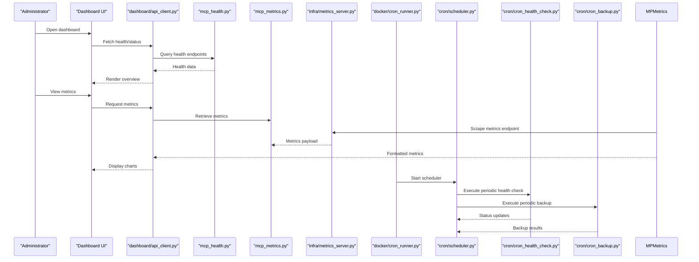

**Diagram sources**
- [dashboard.py](file://dashboard.py)
- [dashboard/api_client.py](file://dashboard/api_client.py)
- [mcp_health.py](file://mcp_health.py)
- [mcp_metrics.py](file://mcp_metrics.py)
- [infra/metrics_server.py](file://infra/metrics_server.py)
- [docker/cron_runner.py](file://docker/cron_runner.py)
- [cron/scheduler.py](file://cron/scheduler.py)
- [cron/cron_health_check.py](file://cron/cron_health_check.py)
- [cron/cron_backup.py](file://cron/cron_backup.py)

## Detailed Component Analysis

### Web Dashboard Interface
The dashboard organizes functionality into tabs:
- Overview tab: System health, key indicators, recent events.
- Operations tab: Maintenance actions, job controls, resource usage.
- Settings tab: Configuration editing, environment variable references.
- Audit tab: Audit logs, compliance reports, evidence collection.
- Compliance tab: Policy adherence, drift detection, risk assessments.
- Billing tab: Usage metrics, cost tracking (if applicable).
- Coordination tab: Distributed locks, messaging, state synchronization.
- Knowledge Graph tab: Entity analytics, community detection, temporal facts.
- Memories tab: Memory lifecycle, tier migration, retention stats.
- Quality tab: Search quality, reranking, embedding recompute status.

The dashboard uses an API client to communicate with MCP tools and internal services. Authentication is handled via login flow and SSO integration.

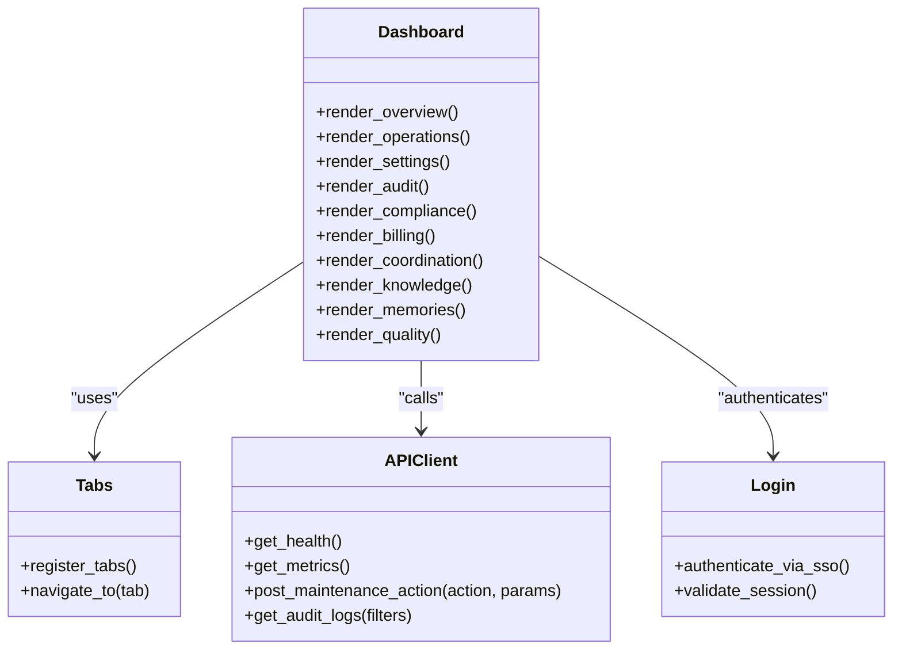

**Diagram sources**
- [dashboard.py](file://dashboard.py)
- [dashboard/tabs.py](file://dashboard/tabs.py)
- [dashboard/api_client.py](file://dashboard/api_client.py)
- [dashboard/login.py](file://dashboard/login.py)
- [dashboard/tab_dashboard.py](file://dashboard/tab_dashboard.py)
- [dashboard/tab_operations.py](file://dashboard/tab_operations.py)
- [dashboard/tab_settings.py](file://dashboard/tab_settings.py)
- [dashboard/tab_audit.py](file://dashboard/tab_audit.py)
- [dashboard/tab_compliance.py](file://dashboard/tab_compliance.py)
- [dashboard/tab_billing.py](file://dashboard/tab_billing.py)
- [dashboard/tab_coordination.py](file://dashboard/tab_coordination.py)
- [dashboard/tab_knowledge.py](file://dashboard/tab_knowledge.py)
- [dashboard/tab_memories.py](file://dashboard/tab_memories.py)
- [dashboard/tab_quality.py](file://dashboard/tab_quality.py)

**Section sources**
- [dashboard.py](file://dashboard.py)
- [dashboard/tabs.py](file://dashboard/tabs.py)
- [dashboard/api_client.py](file://dashboard/api_client.py)
- [dashboard/login.py](file://dashboard/login.py)
- [dashboard/tab_dashboard.py](file://dashboard/tab_dashboard.py)
- [dashboard/tab_operations.py](file://dashboard/tab_operations.py)
- [dashboard/tab_settings.py](file://dashboard/tab_settings.py)
- [dashboard/tab_audit.py](file://dashboard/tab_audit.py)
- [dashboard/tab_compliance.py](file://dashboard/tab_compliance.py)
- [dashboard/tab_billing.py](file://dashboard/tab_billing.py)
- [dashboard/tab_coordination.py](file://dashboard/tab_coordination.py)
- [dashboard/tab_knowledge.py](file://dashboard/tab_knowledge.py)
- [dashboard/tab_memories.py](file://dashboard/tab_memories.py)
- [dashboard/tab_quality.py](file://dashboard/tab_quality.py)

### Configuration Management
Configuration is loaded from a TOML file and environment variables. Operators can adjust runtime parameters such as database paths, feature flags, and integrations. Reference documentation enumerates available options and their scopes.

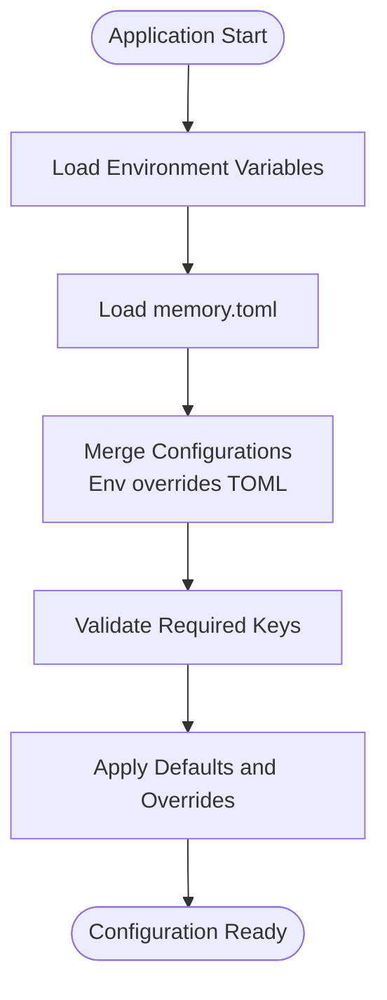

**Diagram sources**
- [infra/config.py](file://infra/config.py)
- [memory.toml](file://memory.toml)
- [docs/env_vars.md](file://docs/env_vars.md)
- [docs/reference/configuration.md](file://docs/reference/configuration.md)

**Section sources**
- [infra/config.py](file://infra/config.py)
- [memory.toml](file://memory.toml)
- [docs/env_vars.md](file://docs/env_vars.md)
- [docs/reference/configuration.md](file://docs/reference/configuration.md)

### Docker Deployment
Containerized deployment uses a Dockerfile and docker-compose for orchestration. The entrypoint script initializes the environment, and a cron runner executes scheduled tasks defined in a schedule file.

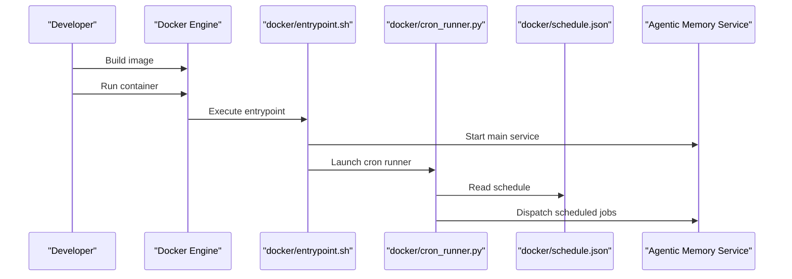

**Diagram sources**
- [Dockerfile](file://Dockerfile)
- [docker-compose.yml](file://docker-compose.yml)
- [docker/entrypoint.sh](file://docker/entrypoint.sh)
- [docker/cron_runner.py](file://docker/cron_runner.py)
- [docker/schedule.json](file://docker/schedule.json)
- [docker/README.md](file://docker/README.md)

**Section sources**
- [Dockerfile](file://Dockerfile)
- [docker-compose.yml](file://docker-compose.yml)
- [docker/entrypoint.sh](file://docker/entrypoint.sh)
- [docker/cron_runner.py](file://docker/cron_runner.py)
- [docker/schedule.json](file://docker/schedule.json)
- [docker/README.md](file://docker/README.md)

### Monitoring and Alerting
Operational metrics are exposed via a metrics server and accessible through MCP tools. Cron jobs provide health checks and pipeline health monitoring. Alerts can be configured using the alerting module and integrated with external systems.

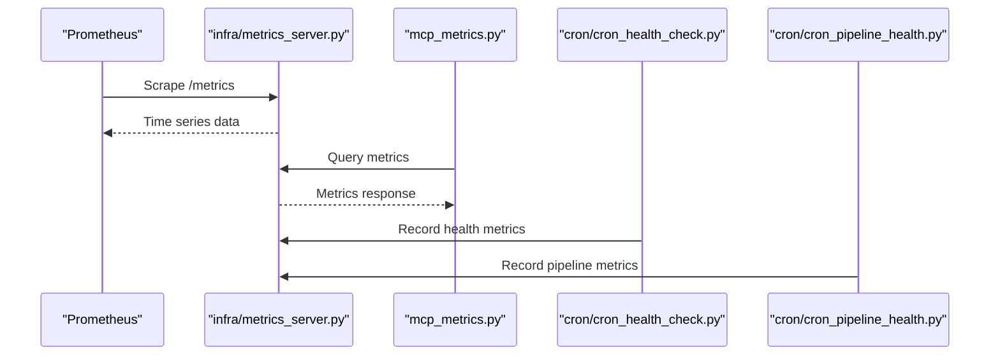

**Diagram sources**
- [infra/metrics_server.py](file://infra/metrics_server.py)
- [mcp_metrics.py](file://mcp_metrics.py)
- [cron/cron_health_check.py](file://cron/cron_health_check.py)
- [cron/cron_pipeline_health.py](file://cron/cron_pipeline_health.py)

**Section sources**
- [infra/metrics_server.py](file://infra/metrics_server.py)
- [mcp_metrics.py](file://mcp_metrics.py)
- [cron/cron_health_check.py](file://cron/cron_health_check.py)
- [cron/cron_pipeline_health.py](file://cron/cron_pipeline_health.py)
- [infra/alert.py](file://infra/alert.py)

### Logging and Log Retention
Logging infrastructure supports structured logs and retention policies enforced by cron jobs. Auto-log cleanup ensures storage hygiene.

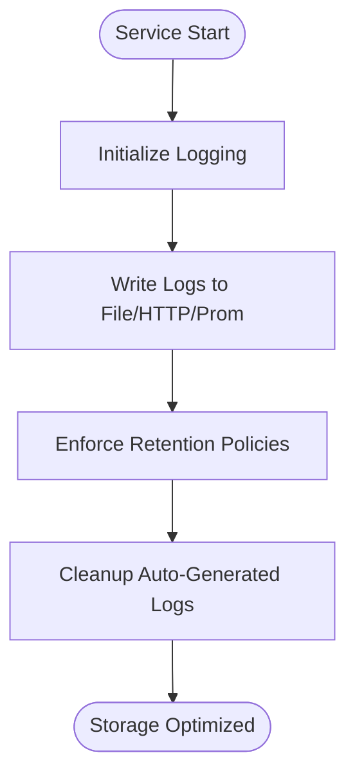

**Diagram sources**
- [infra/log.py](file://infra/log.py)
- [cron/cron_log_retention.py](file://cron/cron_log_retention.py)
- [cron/cron_cleanup_auto_logs.py](file://cron/cron/cron_cleanup_auto_logs.py)

**Section sources**
- [infra/log.py](file://infra/log.py)
- [cron/cron_log_retention.py](file://cron/cron_log_retention.py)
- [cron/cron_cleanup_auto_logs.py](file://cron/cron/cron_cleanup_auto_logs.py)

### Backup and Restore Procedures
Periodic backups are orchestrated by cron jobs, with validation steps to ensure integrity. Operators should configure backup destinations and retention windows according to policy.

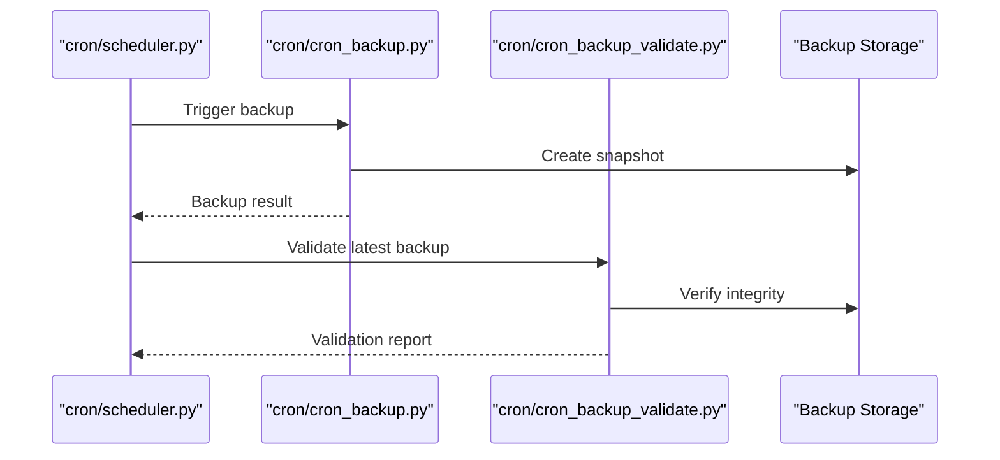

**Diagram sources**
- [cron/scheduler.py](file://cron/scheduler.py)
- [cron/cron_backup.py](file://cron/cron_backup.py)
- [cron/cron_backup_validate.py](file://cron/cron_backup_validate.py)

**Section sources**
- [cron/scheduler.py](file://cron/scheduler.py)
- [cron/cron_backup.py](file://cron/cron_backup.py)
- [cron/cron_backup_validate.py](file://cron/cron_backup_validate.py)

### Security Configurations and Access Control
RBAC enforces role-based permissions, while SSO integrates with identity providers. Audit logging captures administrative actions and compliance-related events.

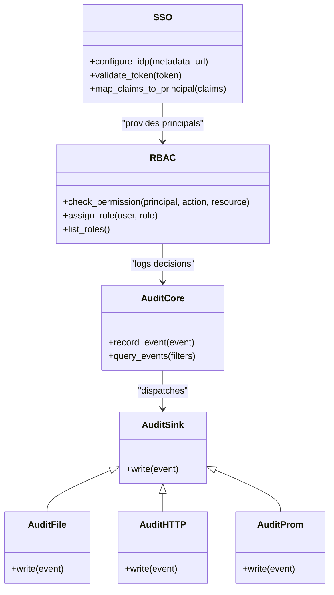

**Diagram sources**
- [infra/rbac.py](file://infra/rbac.py)
- [infra/authlib_sso.py](file://infra/authlib_sso.py)
- [infra/audit.py](file://infra/audit.py)
- [infra/audit_sink.py](file://infra/audit_sink.py)
- [infra/audit_sink_file.py](file://infra/audit_sink_file.py)
- [infra/audit_sink_http.py](file://infra/audit_sink_http.py)
- [infra/audit_sink_prom.py](file://infra/audit_sink_prom.py)

**Section sources**
- [infra/rbac.py](file://infra/rbac.py)
- [infra/authlib_sso.py](file://infra/authlib_sso.py)
- [infra/audit.py](file://infra/audit.py)
- [infra/audit_sink.py](file://infra/audit_sink.py)
- [infra/audit_sink_file.py](file://infra/audit_sink_file.py)
- [infra/audit_sink_http.py](file://infra/audit_sink_http.py)
- [infra/audit_sink_prom.py](file://infra/audit_sink_prom.py)
- [docs/security/sso_setup.md](file://docs/security/sso_setup.md)
- [docs/compliance/ACCESS_CONTROL_POLICY.md](file://docs/compliance/ACCESS_CONTROL_POLICY.md)
- [docs/compliance/DATA_RETENTION_POLICY.md](file://docs/compliance/DATA_RETENTION_POLICY.md)
- [docs/compliance/INCIDENT_RESPONSE_PLAN.md](file://docs/compliance/INCIDENT_RESPONSE_PLAN.md)

### MCP Tools for Maintenance and Metrics
MCP tools expose maintenance operations and metrics retrieval for automation and dashboard interactions.

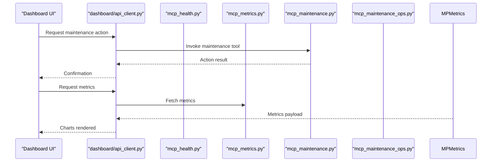

**Diagram sources**
- [dashboard/api_client.py](file://dashboard/api_client.py)
- [mcp_health.py](file://mcp_health.py)
- [mcp_metrics.py](file://mcp_metrics.py)
- [mcp_maintenance.py](file://mcp_maintenance.py)
- [mcp_maintenance_ops.py](file://mcp_maintenance_ops.py)

**Section sources**
- [dashboard/api_client.py](file://dashboard/api_client.py)
- [mcp_health.py](file://mcp_health.py)
- [mcp_metrics.py](file://mcp_metrics.py)
- [mcp_maintenance.py](file://mcp_maintenance.py)
- [mcp_maintenance_ops.py](file://mcp_maintenance_ops.py)

## Dependency Analysis
Operational components depend on configuration, metrics, cron scheduling, and security modules. The dashboard relies on API clients and authentication flows. Cron jobs depend on the scheduler and execute specific maintenance tasks.

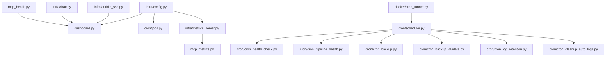

**Diagram sources**
- [infra/config.py](file://infra/config.py)
- [dashboard.py](file://dashboard.py)
- [infra/authlib_sso.py](file://infra/authlib_sso.py)
- [infra/rbac.py](file://infra/rbac.py)
- [infra/metrics_server.py](file://infra/metrics_server.py)
- [mcp_metrics.py](file://mcp_metrics.py)
- [mcp_health.py](file://mcp_health.py)
- [docker/cron_runner.py](file://docker/cron_runner.py)
- [cron/scheduler.py](file://cron/scheduler.py)
- [cron/cron_health_check.py](file://cron/cron_health_check.py)
- [cron/cron_pipeline_health.py](file://cron/cron_pipeline_health.py)
- [cron/cron_backup.py](file://cron/cron_backup.py)
- [cron/cron_backup_validate.py](file://cron/cron_backup_validate.py)
- [cron/cron_log_retention.py](file://cron/cron_log_retention.py)
- [cron/cron_cleanup_auto_logs.py](file://cron/cron/cron_cleanup_auto_logs.py)

**Section sources**
- [infra/config.py](file://infra/config.py)
- [dashboard.py](file://dashboard.py)
- [infra/authlib_sso.py](file://infra/authlib_sso.py)
- [infra/rbac.py](file://infra/rbac.py)
- [infra/metrics_server.py](file://infra/metrics_server.py)
- [mcp_metrics.py](file://mcp_metrics.py)
- [mcp_health.py](file://mcp_health.py)
- [docker/cron_runner.py](file://docker/cron_runner.py)
- [cron/scheduler.py](file://cron/scheduler.py)
- [cron/cron_health_check.py](file://cron/cron_health_check.py)
- [cron/cron_pipeline_health.py](file://cron/cron_pipeline_health.py)
- [cron/cron_backup.py](file://cron/cron_backup.py)
- [cron/cron_backup_validate.py](file://cron/cron_backup_validate.py)
- [cron/cron_log_retention.py](file://cron/cron_log_retention.py)
- [cron/cron_cleanup_auto_logs.py](file://cron/cron/cron_cleanup_auto_logs.py)

## Performance Considerations
- Metrics scraping intervals should align with system load and retention policies.
- Cron job frequencies must balance freshness of health checks with resource consumption.
- Log retention windows should consider storage capacity and compliance requirements.
- Dashboard queries should leverage caching where appropriate to reduce backend load.
- Scaling considerations include horizontal scaling of dashboard instances behind a reverse proxy and ensuring shared state isolation for background workers.

[No sources needed since this section provides general guidance]

## Troubleshooting Guide
Common operational issues and resolutions:
- Health checks failing: Inspect cron health check outputs and metrics server availability.
- Backup failures: Validate backup destination connectivity and permissions; review backup validation logs.
- Log retention not applied: Confirm cron job schedules and storage quotas.
- SSO authentication errors: Review IDP metadata and token validation settings.
- RBAC denials: Check principal roles and permission mappings.
- Audit logs missing: Verify audit sink configuration and network reachability for HTTP sinks.

**Section sources**
- [cron/cron_health_check.py](file://cron/cron_health_check.py)
- [cron/cron_backup.py](file://cron/cron_backup.py)
- [cron/cron_backup_validate.py](file://cron/cron_backup_validate.py)
- [cron/cron_log_retention.py](file://cron/cron_log_retention.py)
- [infra/authlib_sso.py](file://infra/authlib_sso.py)
- [infra/rbac.py](file://infra/rbac.py)
- [infra/audit_sink_http.py](file://infra/audit_sink_http.py)

## Conclusion
Agentic Memory provides a robust operational foundation with a comprehensive dashboard, configurable runtime settings, Docker-based deployment, metrics and alerting, logging and retention, backup and restore procedures, and strong security and compliance features. Operators should tailor cron schedules, retention policies, and security configurations to meet organizational requirements and continuously monitor system health through the dashboard and external observability tools.

[No sources needed since this section summarizes without analyzing specific files]

## Appendices
- Practical examples of containerized deployment: Refer to Dockerfile, docker-compose.yml, and docker README for build and run instructions.
- Scaling considerations: Use reverse proxies for dashboard instances, isolate background workers, and tune cron job concurrency.
- Backup/restore procedures: Configure backup destinations, validate snapshots regularly, and test restore processes.
- Security configurations: Enable SSO, assign roles via RBAC, and configure audit sinks per compliance needs.
- Compliance requirements: Follow access control, data retention, and incident response policies documented in compliance guides.

**Section sources**
- [Dockerfile](file://Dockerfile)
- [docker-compose.yml](file://docker-compose.yml)
- [docker/README.md](file://docker/README.md)
- [docs/compliance/ACCESS_CONTROL_POLICY.md](file://docs/compliance/ACCESS_CONTROL_POLICY.md)
- [docs/compliance/DATA_RETENTION_POLICY.md](file://docs/compliance/DATA_RETENTION_POLICY.md)
- [docs/compliance/INCIDENT_RESPONSE_PLAN.md](file://docs/compliance/INCIDENT_RESPONSE_PLAN.md)