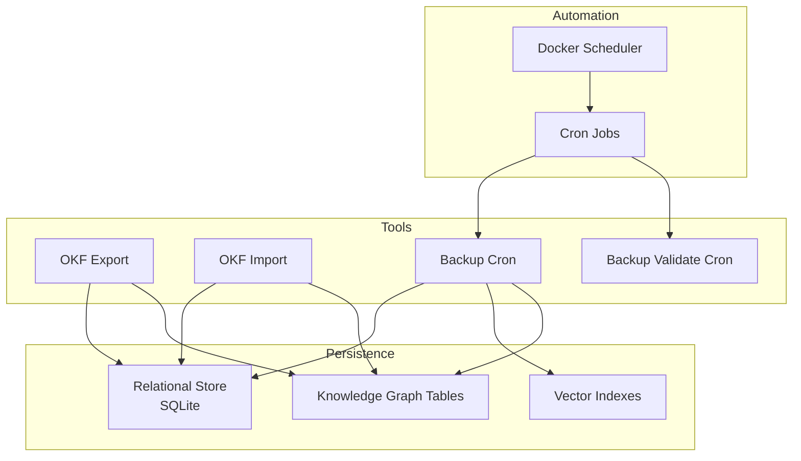
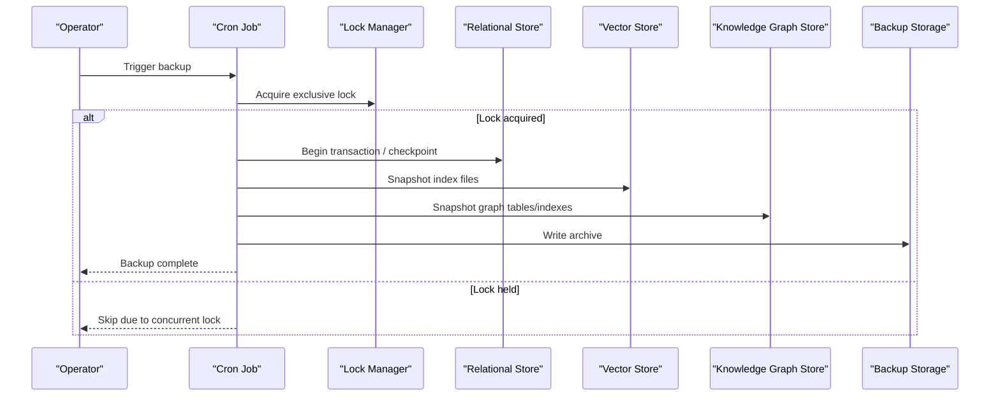
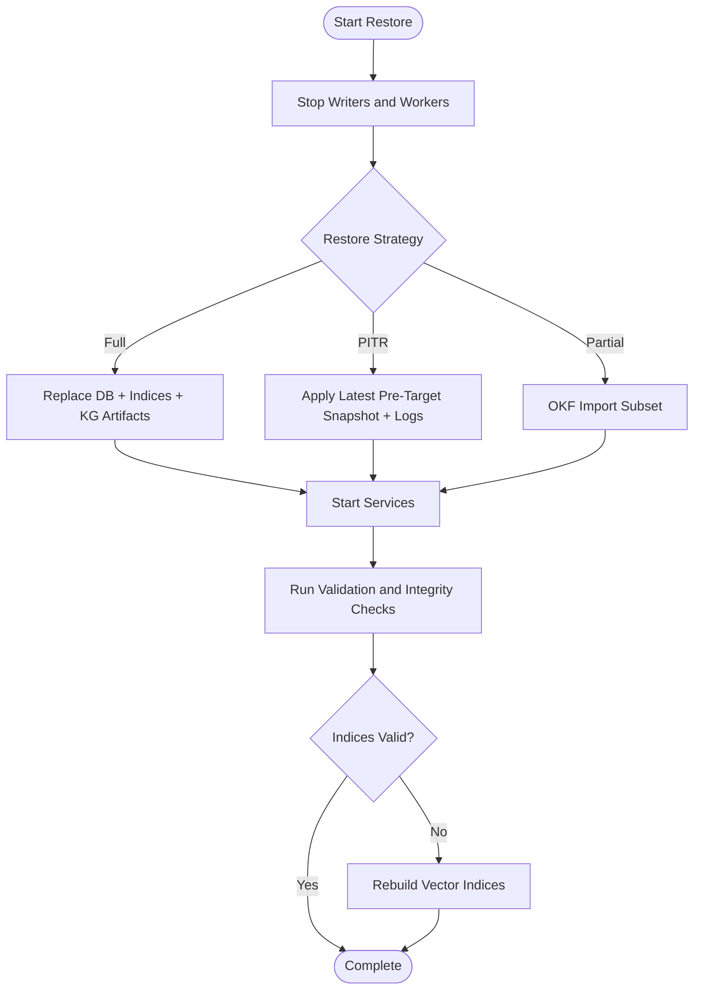
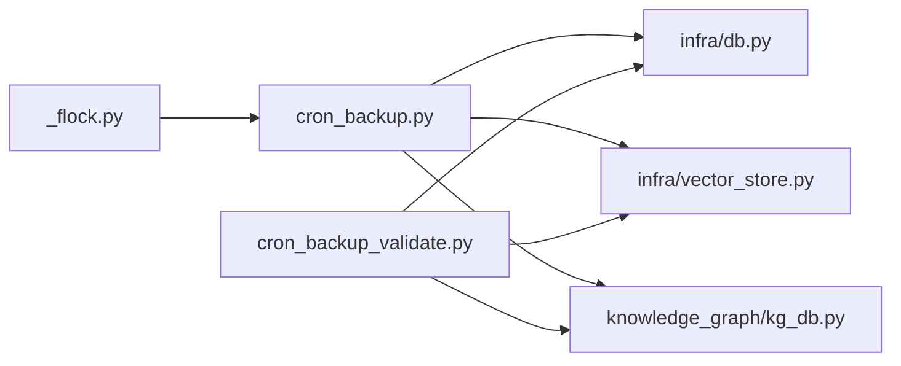

# Backup and Restore

<cite>
**Referenced Files in This Document**
- [cron/cron_backup.py](file://cron/cron_backup.py)
- [cron/cron_backup_validate.py](file://cron/cron_backup_validate.py)
- [cron/install_crontab.sh](file://cron/install_crontab.sh)
- [cron/_flock.py](file://cron/_flock.py)
- [okf_export.py](file://okf_export.py)
- [okf_import.py](file://okf_import.py)
- [infra/db.py](file://infra/db.py)
- [infra/vector_store.py](file://infra/vector_store.py)
- [knowledge_graph/kg_db.py](file://knowledge_graph/kg_db.py)
- [migrations/000_base_schema.sql](file://migrations/000_base_schema.sql)
- [migrations/004_memory_vec_idx.sql](file://migrations/004_memory_vec_idx.sql)
- [docker/entrypoint.sh](file://docker/entrypoint.sh)
- [docker/schedule.json](file://docker/schedule.json)
</cite>

## Table of Contents
1. [Introduction](#introduction)
2. [Project Structure](#project-structure)
3. [Core Components](#core-components)
4. [Architecture Overview](#architecture-overview)
5. [Detailed Component Analysis](#detailed-component-analysis)
6. [Dependency Analysis](#dependency-analysis)
7. [Performance Considerations](#performance-considerations)
8. [Troubleshooting Guide](#troubleshooting-guide)
9. [Conclusion](#conclusion)
10. [Appendices](#appendices)

## Introduction
This document provides comprehensive backup and restore guidance for Agentic Memory data protection. It covers automated backup strategies using cron jobs, manual backup procedures, and data export/import tools. It explains database backup formats, vector index preservation, and knowledge graph consistency during backups. It also details restore procedures for different failure scenarios, point-in-time recovery, and data migration between versions. Finally, it includes scheduling best practices, storage optimization, verification procedures, cross-platform compatibility considerations, and disaster recovery planning.

## Project Structure
The repository implements a layered approach to persistence:
- Relational store (SQLite-based) with schema migrations
- Vector indices for semantic search
- Knowledge graph tables and indexes
- Automated maintenance via cron jobs and Docker scheduling
- Export/import utilities for Open Knowledge Format (OKF)

[No sources needed since this diagram shows conceptual workflow, not actual code structure]

## Core Components
- Automated backup job: schedules consistent snapshots of the relational store, vector indices, and knowledge graph artifacts.
- Backup validation job: verifies integrity and completeness of created backups.
- Manual export/import: OKF-based tools for exporting and importing knowledge graph content.
- Database layer: SQLite-backed relational store with migrations and WAL mode support.
- Vector store: stores embedding indices used by search pipelines.
- Knowledge graph store: persists entities, facts, and temporal metadata.

Key responsibilities:
- Ensure atomicity and consistency across components during backup windows.
- Preserve vector index fidelity and knowledge graph referential integrity.
- Provide deterministic validation checks post-backup.

**Section sources**
- [cron/cron_backup.py](file://cron/cron_backup.py)
- [cron/cron_backup_validate.py](file://cron/cron_backup_validate.py)
- [okf_export.py](file://okf_export.py)
- [okf_import.py](file://okf_import.py)
- [infra/db.py](file://infra/db.py)
- [infra/vector_store.py](file://infra/vector_store.py)
- [knowledge_graph/kg_db.py](file://knowledge_graph/kg_db.py)

## Architecture Overview
The backup architecture coordinates multiple subsystems to produce a coherent snapshot:

**Diagram sources**
- [cron/cron_backup.py](file://cron/cron_backup.py)
- [cron/_flock.py](file://cron/_flock.py)
- [infra/db.py](file://infra/db.py)
- [infra/vector_store.py](file://infra/vector_store.py)
- [knowledge_graph/kg_db.py](file://knowledge_graph/kg_db.py)

## Detailed Component Analysis

### Automated Backup Strategy (Cron)
- Scheduling:
  - System crontab installation helper is provided for Unix-like systems.
  - Docker deployments can use a schedule manifest to drive periodic tasks.
- Concurrency control:
  - A file-based lock prevents overlapping backups.
- Data capture:
  - Relational store snapshot via transactional operations and checkpoints.
  - Vector index files are copied atomically where supported.
  - Knowledge graph tables and indexes are included in the snapshot.
- Output format:
  - Backups are archived into versioned directories with timestamps and checksums.
- Validation:
  - A separate cron validates recent backups by re-opening the store and verifying key invariants.

Best practices:
- Schedule backups during low-write periods.
- Retain multiple generations with rotation policies.
- Offload archives to durable storage (e.g., object storage).

**Section sources**
- [cron/cron_backup.py](file://cron/cron_backup.py)
- [cron/cron_backup_validate.py](file://cron/cron_backup_validate.py)
- [cron/install_crontab.sh](file://cron/install_crontab.sh)
- [cron/_flock.py](file://cron/_flock.py)
- [docker/schedule.json](file://docker/schedule.json)

### Manual Backup Procedures
- Stop or quiesce background workers to minimize writes.
- Use the provided backup command to create an archive of:
  - The relational database file
  - Vector index directory
  - Knowledge graph artifacts
- Verify the archive with the validation tool.
- Copy the archive to offsite storage.

Operational notes:
- Prefer read-only mounts or WAL checkpoints when available.
- Record the timestamp and checksum for auditability.

**Section sources**
- [cron/cron_backup.py](file://cron/cron_backup.py)
- [cron/cron_backup_validate.py](file://cron/cron_backup_validate.py)

### Data Export/Import Tools (OKF)
- Export:
  - Exports knowledge graph entities, facts, and relationships to OKF-compliant files.
  - Useful for portability, audits, and partial restores.
- Import:
  - Imports OKF datasets into the knowledge graph store.
  - Validates referential constraints and deduplicates where applicable.

Use cases:
- Migrating subsets of knowledge between environments.
- Producing human-readable records for compliance.

Limitations:
- OKF export/import focuses on knowledge graph content; it does not replace full system backups.
- Vector indices must be rebuilt after import if embeddings are required.

**Section sources**
- [okf_export.py](file://okf_export.py)
- [okf_import.py](file://okf_import.py)

### Database Backup Formats and Consistency
- Primary format:
  - SQLite database file with optional WAL mode for safer concurrent reads.
- Schema evolution:
  - Migrations define forward-compatible schema changes.
- Consistency guarantees:
  - Transactions and checkpoints ensure a consistent snapshot.
  - File locks prevent concurrent modifications during backup.

Recommendations:
- Enable WAL mode for reduced locking overhead during backups.
- Periodically run integrity checks against the live store.

**Section sources**
- [infra/db.py](file://infra/db.py)
- [migrations/000_base_schema.sql](file://migrations/000_base_schema.sql)

### Vector Index Preservation
- Vector indices are stored as files alongside the relational store.
- During backup, copy index files atomically to avoid partial states.
- After restore, validate that index dimensions and counts match the database state.

Recovery options:
- If indices are corrupted, rebuild from embeddings using the provided rebuild utility.

**Section sources**
- [infra/vector_store.py](file://infra/vector_store.py)

### Knowledge Graph Consistency
- Knowledge graph tables include entities, facts, temporal metadata, and indexes.
- Backups should include both base tables and auxiliary indexes.
- Post-restore, run consistency checks to ensure referential integrity and deduplication invariants hold.

**Section sources**
- [knowledge_graph/kg_db.py](file://knowledge_graph/kg_db.py)

### Restore Procedures

#### Full Restore
- Stop all writers and background workers.
- Replace the database file, vector index directory, and knowledge graph artifacts with those from the backup.
- Start services and run validation to confirm integrity.

#### Point-in-Time Recovery
- Identify the latest valid backup before the target time.
- Apply incremental logs if available (WAL segments), otherwise roll back to the nearest snapshot.
- Rebuild vector indices if necessary.

#### Partial Restore (Knowledge Graph Subset)
- Use OKF import to load specific datasets.
- Validate imports and rebuild indices if needed.

#### Cross-Version Migration
- Before restoring, apply schema migrations to align the target environment.
- Run backfills and consistency checks to reconcile differences.

[No sources needed since this diagram shows conceptual workflow, not actual code structure]

### Backup Scheduling Best Practices
- Frequency:
  - Daily full backups with hourly incremental snapshots if WAL is enabled.
- Retention:
  - Keep at least 7 daily, 4 weekly, and 1 monthly archives.
- Offsite replication:
  - Mirror backups to a separate region or cloud bucket.
- Monitoring:
  - Alert on failed backups and validation errors.
- Locking:
  - Ensure only one backup runs concurrently using the provided lock mechanism.

**Section sources**
- [cron/install_crontab.sh](file://cron/install_crontab.sh)
- [cron/_flock.py](file://cron/_flock.py)
- [docker/schedule.json](file://docker/schedule.json)

### Storage Optimization
- Compression:
  - Compress archives using gzip or zstd.
- Deduplication:
  - Use block-level deduplication on storage targets.
- Tiering:
  - Move older backups to cold storage.
- Size monitoring:
  - Track growth trends and adjust retention accordingly.

[No sources needed since this section provides general guidance]

### Verification Procedures
- Automated validation:
  - Run the backup validation cron to verify recent archives.
- Manual checks:
  - Open the restored database and run integrity checks.
  - Compare row counts and checksums for critical tables.
  - Validate vector index dimensions and record counts.
  - Re-run sample queries to confirm retrieval performance.

**Section sources**
- [cron/cron_backup_validate.py](file://cron/cron_backup_validate.py)

### Cross-Platform Compatibility
- Linux/macOS:
  - Use system crontab installer script.
- Windows:
  - Schedule via Task Scheduler; adapt paths and locking strategy.
- Docker:
  - Use the provided entrypoint and schedule manifest to orchestrate backups.

**Section sources**
- [cron/install_crontab.sh](file://cron/install_crontab.sh)
- [docker/entrypoint.sh](file://docker/entrypoint.sh)
- [docker/schedule.json](file://docker/schedule.json)

### Disaster Recovery Planning
- RTO/RPO:
  - Define acceptable recovery time and point objectives based on business needs.
- Testing:
  - Regularly test restores in isolated environments.
- Documentation:
  - Maintain runbooks for common failure scenarios.
- Communication:
  - Establish escalation paths and stakeholder notifications.

[No sources needed since this section provides general guidance]

## Dependency Analysis
The backup process depends on coordination primitives and persistent stores:

**Diagram sources**
- [cron/_flock.py](file://cron/_flock.py)
- [cron/cron_backup.py](file://cron/cron_backup.py)
- [cron/cron_backup_validate.py](file://cron/cron_backup_validate.py)
- [infra/db.py](file://infra/db.py)
- [infra/vector_store.py](file://infra/vector_store.py)
- [knowledge_graph/kg_db.py](file://knowledge_graph/kg_db.py)

**Section sources**
- [cron/_flock.py](file://cron/_flock.py)
- [cron/cron_backup.py](file://cron/cron_backup.py)
- [cron/cron_backup_validate.py](file://cron/cron_backup_validate.py)
- [infra/db.py](file://infra/db.py)
- [infra/vector_store.py](file://infra/vector_store.py)
- [knowledge_graph/kg_db.py](file://knowledge_graph/kg_db.py)

## Performance Considerations
- Minimize write contention:
  - Schedule backups during low-traffic windows.
- WAL mode:
  - Improves concurrency and reduces backup duration.
- Index rebuilds:
  - Avoid rebuilding indices during peak hours; batch them.
- I/O throughput:
  - Use fast local disks for temporary staging and compress before offloading.

[No sources needed since this section provides general guidance]

## Troubleshooting Guide
Common issues and resolutions:
- Concurrent lock conflicts:
  - Ensure only one backup runs; check lock files and processes.
- Validation failures:
  - Inspect logs for missing files or inconsistent counts; re-run validation.
- Vector index mismatch:
  - Rebuild indices after restore if dimensions or sizes differ.
- Schema drift:
  - Apply pending migrations before restore; run backfills if required.

**Section sources**
- [cron/_flock.py](file://cron/_flock.py)
- [cron/cron_backup_validate.py](file://cron/cron_backup_validate.py)

## Conclusion
Agentic Memory’s backup and restore capabilities combine automated cron-driven snapshots, robust validation, and portable OKF export/import tools. By following the recommended scheduling, storage, and verification practices—and preparing for cross-platform deployment and disaster recovery—you can protect your memory assets effectively and recover quickly from failures.

## Appendices

### Quick Reference: Key Files
- Automated backup and validation:
  - [cron/cron_backup.py](file://cron/cron_backup.py)
  - [cron/cron_backup_validate.py](file://cron/cron_backup_validate.py)
- Scheduling and locking:
  - [cron/install_crontab.sh](file://cron/install_crontab.sh)
  - [cron/_flock.py](file://cron/_flock.py)
  - [docker/schedule.json](file://docker/schedule.json)
- Persistence layers:
  - [infra/db.py](file://infra/db.py)
  - [infra/vector_store.py](file://infra/vector_store.py)
  - [knowledge_graph/kg_db.py](file://knowledge_graph/kg_db.py)
- Export/import:
  - [okf_export.py](file://okf_export.py)
  - [okf_import.py](file://okf_import.py)
- Schema baseline:
  - [migrations/000_base_schema.sql](file://migrations/000_base_schema.sql)
  - [migrations/004_memory_vec_idx.sql](file://migrations/004_memory_vec_idx.sql)
- Container orchestration:
  - [docker/entrypoint.sh](file://docker/entrypoint.sh)