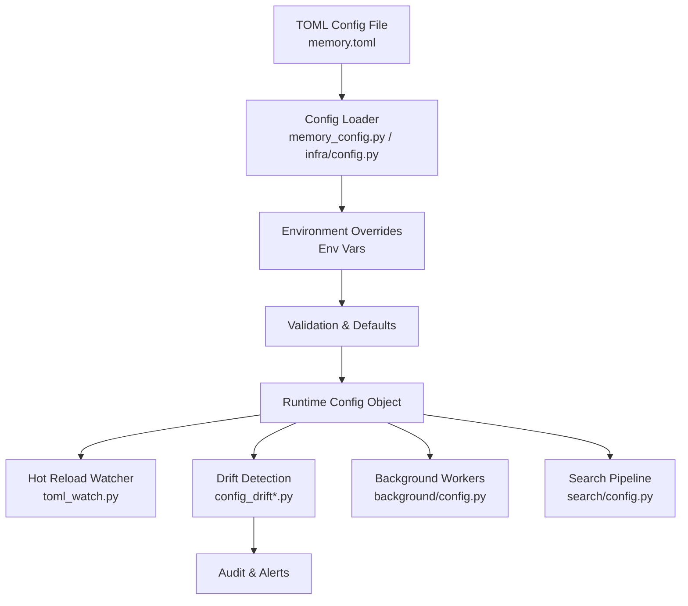
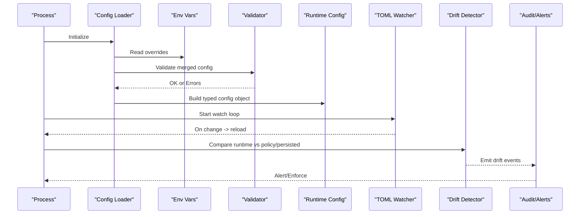
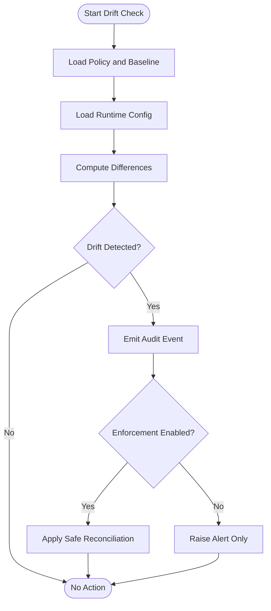
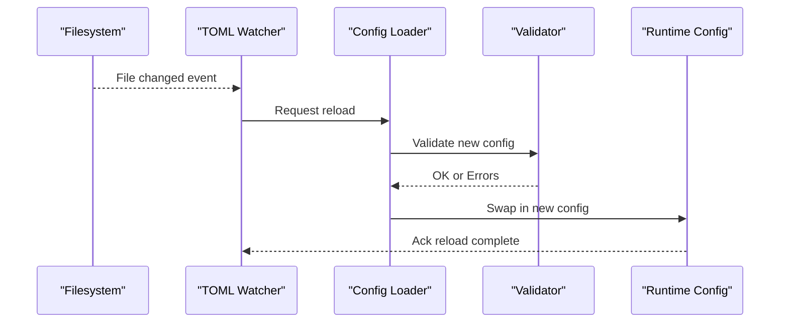
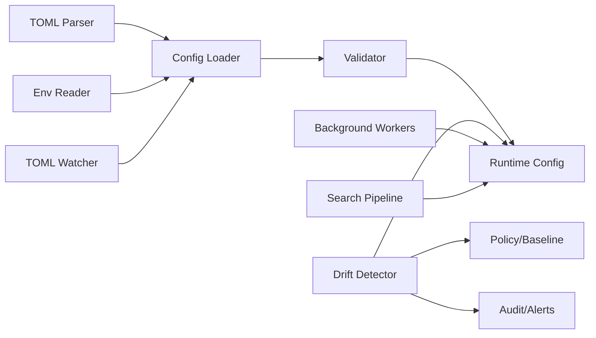

# Configuration Management

<cite>
**Referenced Files in This Document**
- [memory_config.py](file://memory_config.py)
- [config.py](file://config.py)
- [infra/config.py](file://infra/config.py)
- [infra/memory_config.py](file://infra/memory_config.py)
- [infra/toml_watch.py](file://infra/toml_watch.py)
- [cron/cron_check_config_drift.py](file://cron/cron_check_config_drift.py)
- [infra/config_drift.py](file://infra/config_drift.py)
- [infra/config_drift_runtime.py](file://infra/config_drift_runtime.py)
- [infra/config_drift_audit.py](file://infra/config_drift_audit.py)
- [infra/config_drift_policy.py](file://infra/config_drift_policy.py)
- [infra/config_drift_escape.py](file://infra/config_drift_escape.py)
- [infra/config_drift_tier_patch.py](file://infra/config_drift_tier_patch.py)
- [background/config.py](file://background/config.py)
- [search/config.py](file://search/config.py)
- [docs/reference/configuration.md](file://docs/reference/configuration.md)
- [docs/env_vars.md](file://docs/env_vars.md)
- [test_toml_hot_reload.py](file://test_toml_hot_reload.py)
- [test_toml_watch.py](file://test_toml_watch.py)
- [test_config_loading.py](file://test_config_loading.py)
- [test_config_drift.py](file://test_config_drift.py)
- [test_config_drift_cron.py](file://test_config_drift_cron.py)
- [test_config_drift_runtime.py](file://test_config_drift_runtime.py)
- [test_config_drift_persistence.py](file://test_config_drift_persistence.py)
- [test_config_drift_policy.py](file://test_config_drift_policy.py)
- [test_config_drift_tier_overrides.py](file://test_config_drift_tier_overrides.py)
- [test_config_drift_tier_patching.py](file://test_config_drift_tier_patching.py)
- [test_config_drift_tier_reset.py](file://test_config_drift_tier_reset.py)
- [test_config_drift_init_hook.py](file://test_config_drift_init_hook.py)
- [test_config_drift_audit.py](file://test_config_drift_audit.py)
- [test_config_drift_enforcement.py](file://test_config_drift_enforcement.py)
- [test_config_drift_escape.py](file://test_config_drift_escape.py)
</cite>

## Table of Contents
1. [Introduction](#introduction)
2. [Project Structure](#project-structure)
3. [Core Components](#core-components)
4. [Architecture Overview](#architecture-overview)
5. [Detailed Component Analysis](#detailed-component-analysis)
6. [Dependency Analysis](#dependency-analysis)
7. [Performance Considerations](#performance-considerations)
8. [Troubleshooting Guide](#troubleshooting-guide)
9. [Conclusion](#conclusion)
10. [Appendices](#appendices)

## Introduction
This document explains how Agentic Memory manages configuration at runtime, including TOML-based settings, environment variables, validation, drift detection, and hot-reloading. It also covers multi-tenant configuration, environment-specific overrides, security considerations, performance tuning, backup strategies, and migration procedures for configuration changes.

## Project Structure
Configuration is primarily defined in a TOML file and can be overridden by environment variables. The system loads, validates, watches, and reconciles configuration across processes and tenants. Drift detection ensures that the running configuration matches the declared policy and persisted state.

**Diagram sources**
- [memory_config.py:1-200](file://memory_config.py#L1-L200)
- [infra/config.py:1-200](file://infra/config.py#L1-L200)
- [infra/toml_watch.py:1-200](file://infra/toml_watch.py#L1-L200)
- [infra/config_drift.py:1-200](file://infra/config_drift.py#L1-L200)
- [background/config.py:1-200](file://background/config.py#L1-L200)
- [search/config.py:1-200](file://search/config.py#L1-L200)

**Section sources**
- [memory_config.py:1-200](file://memory_config.py#L1-L200)
- [infra/config.py:1-200](file://infra/config.py#L1-L200)
- [docs/reference/configuration.md:1-200](file://docs/reference/configuration.md#L1-L200)
- [docs/env_vars.md:1-200](file://docs/env_vars.md#L1-L200)

## Core Components
- TOML loader and schema resolver: Loads memory.toml, merges defaults, applies environment overrides, and resolves per-tenant or per-tier sections.
- Environment variable integration: Reads env vars to override TOML values with precedence rules.
- Validation engine: Enforces required fields, types, ranges, and cross-field constraints; emits actionable errors.
- Hot reload watcher: Monitors config files for changes and triggers safe reloads without restarts.
- Drift detection: Compares live runtime config against declared policy and persisted baseline; persists drift records and emits audit events.
- Tiered overrides: Supports base, tier, and tenant-level patches to tailor behavior per deployment or customer.
- Background and search integration: Exposes typed configuration to background workers and search pipeline components.

Key responsibilities are implemented across these modules:
- Loading and merging: [memory_config.py](file://memory_config.py), [infra/config.py](file://infra/config.py), [infra/memory_config.py](file://infra/memory_config.py)
- Watching and reloading: [infra/toml_watch.py](file://infra/toml_watch.py)
- Drift detection and enforcement: [infra/config_drift.py](file://infra/config_drift.py), [infra/config_drift_runtime.py](file://infra/config_drift_runtime.py), [infra/config_drift_audit.py](file://infra/config_drift_audit.py), [infra/config_drift_policy.py](file://infra/config_drift_policy.py), [infra/config_drift_escape.py](file://infra/config_drift_escape.py), [infra/config_drift_tier_patch.py](file://infra/config_drift_tier_patch.py)
- Worker and search wiring: [background/config.py](file://background/config.py), [search/config.py](file://search/config.py)

**Section sources**
- [memory_config.py:1-200](file://memory_config.py#L1-L200)
- [infra/config.py:1-200](file://infra/config.py#L1-L200)
- [infra/memory_config.py:1-200](file://infra/memory_config.py#L1-L200)
- [infra/toml_watch.py:1-200](file://infra/toml_watch.py#L1-L200)
- [infra/config_drift.py:1-200](file://infra/config_drift.py#L1-L200)
- [infra/config_drift_runtime.py:1-200](file://infra/config_drift_runtime.py#L1-L200)
- [infra/config_drift_audit.py:1-200](file://infra/config_drift_audit.py#L1-L200)
- [infra/config_drift_policy.py:1-200](file://infra/config_drift_policy.py#L1-L200)
- [infra/config_drift_escape.py:1-200](file://infra/config_drift_escape.py#L1-L200)
- [infra/config_drift_tier_patch.py:1-200](file://infra/config_drift_tier_patch.py#L1-L200)
- [background/config.py:1-200](file://background/config.py#L1-L200)
- [search/config.py:1-200](file://search/config.py#L1-L200)

## Architecture Overview
The configuration lifecycle spans loading, validation, watching, and drift reconciliation.

**Diagram sources**
- [memory_config.py:1-200](file://memory_config.py#L1-L200)
- [infra/config.py:1-200](file://infra/config.py#L1-L200)
- [infra/toml_watch.py:1-200](file://infra/toml_watch.py#L1-L200)
- [infra/config_drift.py:1-200](file://infra/config_drift.py#L1-L200)
- [infra/config_drift_audit.py:1-200](file://infra/config_drift_audit.py#L1-L200)

## Detailed Component Analysis

### TOML Configuration Structure
- Base sections define global defaults (e.g., logging, persistence, embedding, search).
- Per-tier sections allow overriding defaults for specific tiers (e.g., dev, staging, prod).
- Per-tenant sections enable tenant-scoped overrides when multi-tenancy is enabled.
- Keys are validated against a schema; unknown keys may be rejected or warned depending on policy.

Practical guidance:
- Keep base configuration minimal and explicit.
- Use tiers for environment-specific differences (e.g., concurrency limits, model endpoints).
- Use tenant overrides sparingly and consistently; prefer shared policies where possible.

**Section sources**
- [memory_config.py:1-200](file://memory_config.py#L1-L200)
- [infra/config.py:1-200](file://infra/config.py#L1-L200)
- [docs/reference/configuration.md:1-200](file://docs/reference/configuration.md#L1-L200)

### Environment Variables Setup
- Environment variables override TOML values with well-defined precedence.
- Naming conventions map hierarchical TOML keys to uppercase dotted or nested env var names.
- Sensitive values (tokens, secrets) should be provided via environment variables rather than TOML.

Best practices:
- Centralize secret management using your platform’s secret store and inject via env vars.
- Avoid committing secrets to version control; rely on env-only injection.
- Document all supported env vars and their precedence in your runbooks.

**Section sources**
- [docs/env_vars.md:1-200](file://docs/env_vars.md#L1-L200)
- [infra/config.py:1-200](file://infra/config.py#L1-L200)

### Runtime Configuration Options
- Typed configuration objects expose strongly-typed attributes to services (workers, search, etc.).
- Lazy initialization avoids heavy resource allocation until needed.
- Cross-service consistency is ensured by centralized loading and watchers.

Integration points:
- Background workers read from [background/config.py](file://background/config.py).
- Search pipeline reads from [search/config.py](file://search/config.py).

**Section sources**
- [background/config.py:1-200](file://background/config.py#L1-L200)
- [search/config.py:1-200](file://search/config.py#L1-L200)
- [infra/memory_config.py:1-200](file://infra/memory_config.py#L1-L200)

### Configuration Validation
- Schema checks enforce presence, types, enums, and value ranges.
- Cross-field validations ensure logical consistency (e.g., timeouts relative to intervals).
- Validation failures produce structured error messages indicating exact keys and reasons.

Operational tips:
- Run validation early in startup to fail fast.
- Log validation results with context (env, tier, tenant).
- Treat validation errors as non-recoverable until corrected.

**Section sources**
- [memory_config.py:1-200](file://memory_config.py#L1-L200)
- [infra/config.py:1-200](file://infra/config.py#L1-L200)
- [test_config_loading.py:1-200](file://test_config_loading.py#L1-L200)

### Drift Detection
Drift detection compares:
- Declared policy (source-of-truth TOML and policy definitions)
- Persisted baseline (last known-good snapshot)
- Live runtime configuration

When drift is detected:
- Events are emitted to audit logs.
- Optional enforcement actions can be triggered based on policy.
- Escapes and exceptions are tracked to avoid accidental lockouts.

**Diagram sources**
- [infra/config_drift.py:1-200](file://infra/config_drift.py#L1-L200)
- [infra/config_drift_runtime.py:1-200](file://infra/config_drift_runtime.py#L1-L200)
- [infra/config_drift_audit.py:1-200](file://infra/config_drift_audit.py#L1-L200)
- [infra/config_drift_policy.py:1-200](file://infra/config_drift_policy.py#L1-L200)
- [infra/config_drift_escape.py:1-200](file://infra/config_drift_escape.py#L1-L200)

**Section sources**
- [infra/config_drift.py:1-200](file://infra/config_drift.py#L1-L200)
- [infra/config_drift_runtime.py:1-200](file://infra/config_drift_runtime.py#L1-L200)
- [infra/config_drift_audit.py:1-200](file://infra/config_drift_audit.py#L1-L200)
- [infra/config_drift_policy.py:1-200](file://infra/config_drift_policy.py#L1-L200)
- [infra/config_drift_escape.py:1-200](file://infra/config_drift_escape.py#L1-L200)
- [infra/config_drift_tier_patch.py:1-200](file://infra/config_drift_tier_patch.py#L1-L200)
- [cron/cron_check_config_drift.py:1-200](file://cron/cron_check_config_drift.py#L1-L200)
- [test_config_drift.py:1-200](file://test_config_drift.py#L1-L200)
- [test_config_drift_cron.py:1-200](file://test_config_drift_cron.py#L1-L200)
- [test_config_drift_runtime.py:1-200](file://test_config_drift_runtime.py#L1-L200)
- [test_config_drift_persistence.py:1-200](file://test_config_drift_persistence.py#L1-L200)
- [test_config_drift_policy.py:1-200](file://test_config_drift_policy.py#L1-L200)
- [test_config_drift_tier_overrides.py:1-200](file://test_config_drift_tier_overrides.py#L1-L200)
- [test_config_drift_tier_patching.py:1-200](file://test_config_drift_tier_patching.py#L1-L200)
- [test_config_drift_tier_reset.py:1-200](file://test_config_drift_tier_reset.py#L1-L200)
- [test_config_drift_init_hook.py:1-200](file://test_config_drift_init_hook.py#L1-L200)
- [test_config_drift_audit.py:1-200](file://test_config_drift_audit.py#L1-L200)
- [test_config_drift_enforcement.py:1-200](file://test_config_drift_enforcement.py#L1-L200)
- [test_config_drift_escape.py:1-200](file://test_config_drift_escape.py#L1-L200)

### Hot-Reloading Capabilities
- A file watcher monitors TOML changes and triggers a controlled reload.
- Reload path re-validates configuration before applying it to the runtime.
- Partial reloads minimize disruption; dependent subsystems receive updated references safely.

**Diagram sources**
- [infra/toml_watch.py:1-200](file://infra/toml_watch.py#L1-L200)
- [memory_config.py:1-200](file://memory_config.py#L1-L200)
- [test_toml_hot_reload.py:1-200](file://test_toml_hot_reload.py#L1-L200)
- [test_toml_watch.py:1-200](file://test_toml_watch.py#L1-L200)

**Section sources**
- [infra/toml_watch.py:1-200](file://infra/toml_watch.py#L1-L200)
- [test_toml_hot_reload.py:1-200](file://test_toml_hot_reload.py#L1-L200)
- [test_toml_watch.py:1-200](file://test_toml_watch.py#L1-L200)

### Multi-Tenant Configuration
- Tenant-scoped overrides allow per-tenant behavior while preserving shared defaults.
- Drift detection respects tenant boundaries and reports tenant-specific deviations.
- Ensure isolation between tenants’ configuration contexts during load and validation.

**Section sources**
- [infra/config_drift.py:1-200](file://infra/config_drift.py#L1-L200)
- [infra/config_drift_tier_patch.py:1-200](file://infra/config_drift_tier_patch.py#L1-L200)
- [test_config_drift_tier_overrides.py:1-200](file://test_config_drift_tier_overrides.py#L1-L200)

### Environment-Specific Settings
- Use tiers to separate development, staging, and production configurations.
- Combine tiers with environment variables for secrets and endpoints.
- Maintain consistent key namespaces across environments to simplify drift detection.

**Section sources**
- [infra/config_drift_tier_patch.py:1-200](file://infra/config_drift_tier_patch.py#L1-L200)
- [docs/env_vars.md:1-200](file://docs/env_vars.md#L1-L200)

## Dependency Analysis
Configuration components interact through clear interfaces:
- Loader depends on TOML parser and env reader.
- Validator depends on schema definitions and cross-field rules.
- Watcher depends on filesystem events and loader reload hooks.
- Drift detector depends on policy, baseline, and runtime config snapshots.
- Background and search modules depend on the final runtime config object.

**Diagram sources**
- [memory_config.py:1-200](file://memory_config.py#L1-L200)
- [infra/config.py:1-200](file://infra/config.py#L1-L200)
- [infra/toml_watch.py:1-200](file://infra/toml_watch.py#L1-L200)
- [infra/config_drift.py:1-200](file://infra/config_drift.py#L1-L200)
- [background/config.py:1-200](file://background/config.py#L1-L200)
- [search/config.py:1-200](file://search/config.py#L1-L200)

**Section sources**
- [memory_config.py:1-200](file://memory_config.py#L1-L200)
- [infra/config.py:1-200](file://infra/config.py#L1-L200)
- [infra/toml_watch.py:1-200](file://infra/toml_watch.py#L1-L200)
- [infra/config_drift.py:1-200](file://infra/config_drift.py#L1-L200)
- [background/config.py:1-200](file://background/config.py#L1-L200)
- [search/config.py:1-200](file://search/config.py#L1-L200)

## Performance Considerations
- Prefer lazy initialization for expensive resources (embeddings, indexes) behind configuration flags.
- Tune concurrency and queue sizes via configuration to match workload characteristics.
- Use tiered overrides to reduce redundant configuration duplication.
- Enable efficient watchers to avoid excessive polling; leverage OS-level file events.
- Cache resolved configuration within process lifetimes to minimize reload overhead.

[No sources needed since this section provides general guidance]

## Troubleshooting Guide
Common issues and resolutions:
- Validation errors: Review structured error messages and correct keys/types/ranges.
- Drift alerts: Inspect drift diffs and reconcile with policy/baseline; use escapes only when necessary.
- Hot reload failures: Confirm TOML syntax and schema compliance; check reload logs for partial updates.
- Secret injection problems: Verify environment variable names and precedence; ensure secrets are not committed to TOML.

Operational checks:
- Run drift detection manually to validate recent changes.
- Inspect audit logs for drift events and enforcement outcomes.
- Use tier reset and patching utilities to restore expected states.

**Section sources**
- [infra/config_drift_audit.py:1-200](file://infra/config_drift_audit.py#L1-L200)
- [infra/config_drift_escape.py:1-200](file://infra/config_drift_escape.py#L1-L200)
- [infra/config_drift_tier_patch.py:1-200](file://infra/config_drift_tier_patch.py#L1-L200)
- [test_config_drift_audit.py:1-200](file://test_config_drift_audit.py#L1-L200)
- [test_config_drift_enforcement.py:1-200](file://test_config_drift_enforcement.py#L1-L200)
- [test_config_drift_escape.py:1-200](file://test_config_drift_escape.py#L1-L200)

## Conclusion
Agentic Memory’s configuration management combines robust TOML-based declarations, environment overrides, strict validation, hot reloading, and comprehensive drift detection. With tiered and tenant-scoped overrides, operators can maintain secure, performant, and compliant deployments across diverse environments. Following best practices for secrets, backups, and migrations ensures stability and traceability throughout the configuration lifecycle.

[No sources needed since this section summarizes without analyzing specific files]

## Appendices

### Practical Examples and Scenarios
- Local development: Minimal TOML with dev tier overrides and env-provided secrets.
- Staging: Enable additional diagnostics and moderate concurrency.
- Production: Restrict features, harden security, and tune performance parameters.

For concrete examples and reference tables, see:
- [docs/reference/configuration.md](file://docs/reference/configuration.md)
- [docs/env_vars.md](file://docs/env_vars.md)

**Section sources**
- [docs/reference/configuration.md:1-200](file://docs/reference/configuration.md#L1-L200)
- [docs/env_vars.md:1-200](file://docs/env_vars.md#L1-L200)

### Security Settings
- Store secrets exclusively in environment variables.
- Restrict access to TOML files and configuration directories.
- Use drift enforcement to prevent unauthorized changes.
- Audit all configuration changes and drift events.

**Section sources**
- [docs/env_vars.md:1-200](file://docs/env_vars.md#L1-L200)
- [infra/config_drift_audit.py:1-200](file://infra/config_drift_audit.py#L1-L200)

### Backup Strategies
- Version-control TOML files and policy definitions.
- Snapshot last-known-good configuration baselines used by drift detection.
- Back up environment variable stores according to platform best practices.

**Section sources**
- [infra/config_drift.py:1-200](file://infra/config_drift.py#L1-L200)
- [infra/config_drift_persistence.py:1-200](file://infra/config_drift_persistence.py#L1-L200)

### Migration Procedures
- Plan configuration changes with tiered patches and tenant overrides.
- Validate changes locally and in staging before production rollout.
- Use drift detection to confirm post-deployment alignment.
- Roll back by restoring previous TOML and policy versions and resetting tiers if needed.

**Section sources**
- [infra/config_drift_tier_patch.py:1-200](file://infra/config_drift_tier_patch.py#L1-L200)
- [test_config_drift_tier_reset.py:1-200](file://test_config_drift_tier_reset.py#L1-L200)
- [test_config_drift_policy.py:1-200](file://test_config_drift_policy.py#L1-L200)