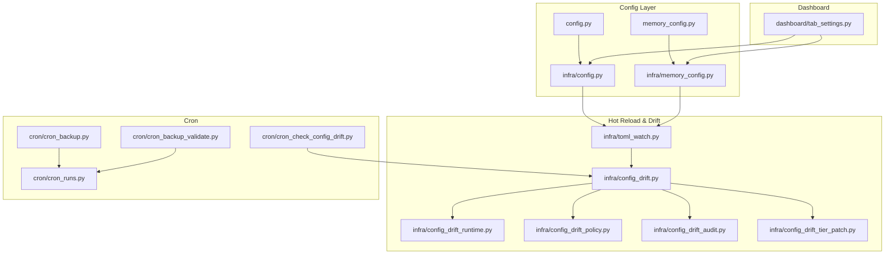
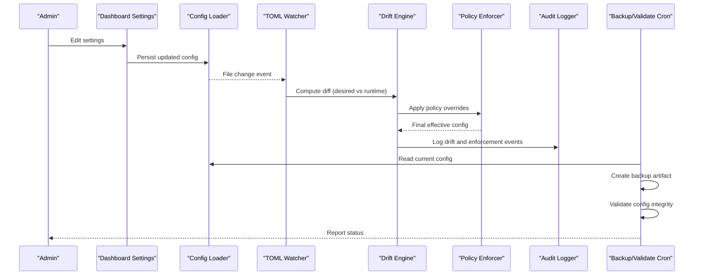
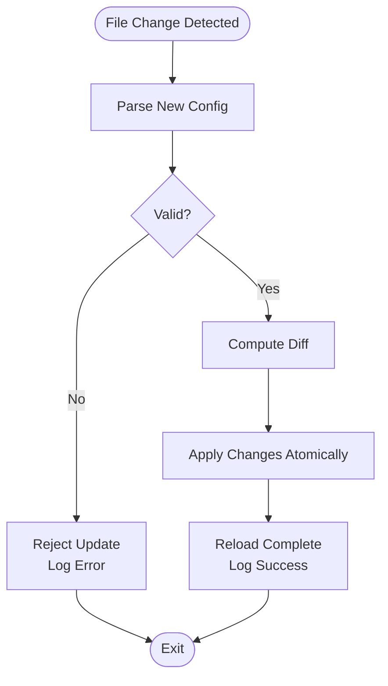
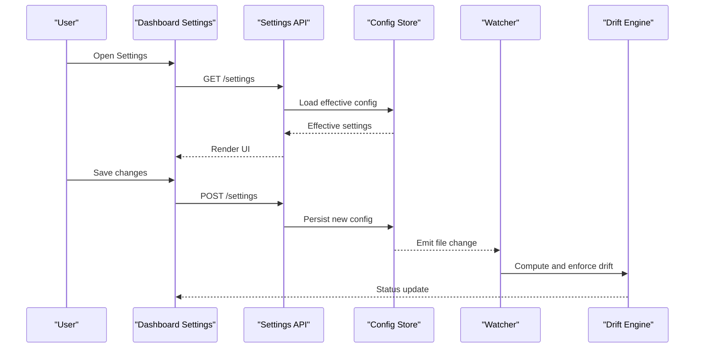
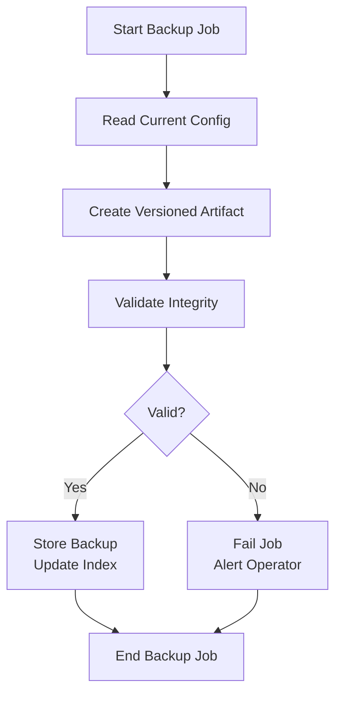
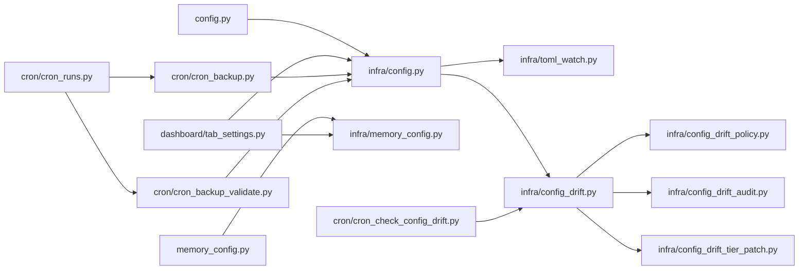

# Configuration and Settings

<cite>
**Referenced Files in This Document**
- [config.py](file://config.py)
- [memory_config.py](file://memory_config.py)
- [infra/config.py](file://infra/config.py)
- [infra/memory_config.py](file://infra/memory_config.py)
- [dashboard/tab_settings.py](file://dashboard/tab_settings.py)
- [cron/cron_check_config_drift.py](file://cron/cron_check_config_drift.py)
- [infra/toml_watch.py](file://infra/toml_watch.py)
- [infra/config_drift.py](file://infra/config_drift.py)
- [infra/config_drift_runtime.py](file://infra/config_drift_runtime.py)
- [infra/config_drift_policy.py](file://infra/config_drift_policy.py)
- [infra/config_drift_audit.py](file://infra/config_drift_audit.py)
- [infra/config_drift_tier_patch.py](file://infra/config_drift_tier_patch.py)
- [cron/cron_backup.py](file://cron/cron_backup.py)
- [cron/cron_backup_validate.py](file://cron/cron_backup_validate.py)
- [cron/cron_runs.py](file://cron/cron_runs.py)
- [docs/reference/configuration.md](file://docs/reference/configuration.md)
- [docs/env_vars.md](file://docs/env_vars.md)
</cite>

## Table of Contents
1. [Introduction](#introduction)
2. [Project Structure](#project-structure)
3. [Core Components](#core-components)
4. [Architecture Overview](#architecture-overview)
5. [Detailed Component Analysis](#detailed-component-analysis)
6. [Dependency Analysis](#dependency-analysis)
7. [Performance Considerations](#performance-considerations)
8. [Troubleshooting Guide](#troubleshooting-guide)
9. [Conclusion](#conclusion)
10. [Appendices](#appendices)

## Introduction
This document explains the configuration and settings interface, focusing on runtime configuration management, parameter validation, hot-reloading, system-wide and agent-specific settings, environment variable management, security and authentication configuration, integration parameters, templates and defaults, best practices for deployments, and operational procedures for backup, versioning, and rollback via the dashboard.

## Project Structure
Configuration is implemented across multiple layers:
- Core configuration loading and resolution (system-wide and per-agent)
- Hot-reload watcher for TOML-based configuration
- Drift detection and enforcement between desired and runtime state
- Audit logging for configuration changes
- Dashboard UI for viewing and editing settings
- Cron jobs for backups and validation

**Diagram sources**
- [config.py:1-200](file://config.py#L1-L200)
- [memory_config.py:1-200](file://memory_config.py#L1-L200)
- [infra/config.py:1-200](file://infra/config.py#L1-L200)
- [infra/memory_config.py:1-200](file://infra/memory_config.py#L1-L200)
- [infra/toml_watch.py:1-200](file://infra/toml_watch.py#L1-L200)
- [infra/config_drift.py:1-200](file://infra/config_drift.py#L1-L200)
- [infra/config_drift_runtime.py:1-200](file://infra/config_drift_runtime.py#L1-L200)
- [infra/config_drift_policy.py:1-200](file://infra/config_drift_policy.py#L1-L200)
- [infra/config_drift_audit.py:1-200](file://infra/config_drift_audit.py#L1-L200)
- [infra/config_drift_tier_patch.py:1-200](file://infra/config_drift_tier_patch.py#L1-L200)
- [dashboard/tab_settings.py:1-200](file://dashboard/tab_settings.py#L1-L200)
- [cron/cron_check_config_drift.py:1-200](file://cron/cron_check_config_drift.py#L1-L200)
- [cron/cron_backup.py:1-200](file://cron/cron_backup.py#L1-L200)
- [cron/cron_backup_validate.py:1-200](file://cron/cron_backup_validate.py#L1-L200)
- [cron/cron_runs.py:1-200](file://cron/cron_runs.py#L1-L200)

**Section sources**
- [config.py:1-200](file://config.py#L1-L200)
- [memory_config.py:1-200](file://memory_config.py#L1-L200)
- [infra/config.py:1-200](file://infra/config.py#L1-L200)
- [infra/memory_config.py:1-200](file://infra/memory_config.py#L1-L200)
- [infra/toml_watch.py:1-200](file://infra/toml_watch.py#L1-L200)
- [infra/config_drift.py:1-200](file://infra/config_drift.py#L1-L200)
- [dashboard/tab_settings.py:1-200](file://dashboard/tab_settings.py#L1-L200)
- [cron/cron_check_config_drift.py:1-200](file://cron/cron_check_config_drift.py#L1-L200)
- [cron/cron_backup.py:1-200](file://cron/cron_backup.py#L1-L200)
- [cron/cron_backup_validate.py:1-200](file://cron/cron_backup_validate.py#L1-L200)
- [cron/cron_runs.py:1-200](file://cron/cron_runs.py#L1-L200)

## Core Components
- Runtime configuration loader: Provides a unified API to read system-wide and agent-scoped settings with type-safe accessors and default values.
- Environment variable manager: Resolves sensitive or deployment-specific values from environment variables and merges them into the configuration.
- Hot-reload watcher: Monitors configuration files for changes and triggers safe reloads without restarts.
- Drift detection and enforcement: Compares desired configuration against runtime state, applies policy-driven overrides, and logs audit events.
- Dashboard settings UI: Presents current settings, allows edits, and exposes actions like reload and rollback.
- Backup and validation cron: Periodically backs up configuration and validates integrity.

Key responsibilities:
- Centralized configuration schema and defaults
- Validation rules and error reporting
- Secure handling of secrets
- Versioned configuration artifacts and rollback support

**Section sources**
- [config.py:1-200](file://config.py#L1-L200)
- [memory_config.py:1-200](file://memory_config.py#L1-L200)
- [infra/config.py:1-200](file://infra/config.py#L1-L200)
- [infra/memory_config.py:1-200](file://infra/memory_config.py#L1-L200)
- [infra/toml_watch.py:1-200](file://infra/toml_watch.py#L1-L200)
- [infra/config_drift.py:1-200](file://infra/config_drift.py#L1-L200)
- [dashboard/tab_settings.py:1-200](file://dashboard/tab_settings.py#L1-L200)

## Architecture Overview
The configuration architecture separates concerns across loading, watching, validating, enforcing, and exposing settings. The flow begins with file-based configuration and environment variables, proceeds through validation and drift checks, and culminates in a live runtime view exposed by the dashboard.

**Diagram sources**
- [dashboard/tab_settings.py:1-200](file://dashboard/tab_settings.py#L1-L200)
- [infra/toml_watch.py:1-200](file://infra/toml_watch.py#L1-L200)
- [infra/config_drift.py:1-200](file://infra/config_drift.py#L1-L200)
- [infra/config_drift_policy.py:1-200](file://infra/config_drift_policy.py#L1-L200)
- [infra/config_drift_audit.py:1-200](file://infra/config_drift_audit.py#L1-L200)
- [cron/cron_backup.py:1-200](file://cron/cron_backup.py#L1-L200)
- [cron/cron_backup_validate.py:1-200](file://cron/cron_backup_validate.py#L1-L200)

## Detailed Component Analysis

### Runtime Configuration Management
- System-wide settings are loaded from central configuration files and merged with environment variables.
- Agent-specific configurations are resolved by scoping keys to agents and applying precedence rules.
- Type-safe accessors ensure that values conform to expected schemas and provide meaningful errors on invalid inputs.

Operational characteristics:
- Deterministic precedence: explicit overrides > environment variables > defaults.
- Lazy evaluation where appropriate to minimize startup overhead.
- Clear separation between immutable defaults and mutable runtime values.

Best practices:
- Keep secrets out of configuration files; use environment variables.
- Group related settings under logical namespaces.
- Use descriptive keys and consistent naming conventions.

**Section sources**
- [config.py:1-200](file://config.py#L1-L200)
- [memory_config.py:1-200](file://memory_config.py#L1-L200)
- [infra/config.py:1-200](file://infra/config.py#L1-L200)
- [infra/memory_config.py:1-200](file://infra/memory_config.py#L1-L200)

### Parameter Validation
Validation enforces constraints such as allowed ranges, required fields, and cross-field dependencies. Errors are surfaced early with actionable messages.

Highlights:
- Schema definitions define types, defaults, and constraints.
- Validation runs at load time and again after hot-reloads.
- Invalid configurations are rejected and logged with context.

Recommendations:
- Prefer strict validation in production environments.
- Provide fallback defaults for non-critical optional settings.
- Include validation tests for critical paths.

**Section sources**
- [config.py:1-200](file://config.py#L1-L200)
- [memory_config.py:1-200](file://memory_config.py#L1-L200)
- [infra/config.py:1-200](file://infra/config.py#L1-L200)

### Hot-Reloading Capabilities
A file watcher monitors configuration files for changes and triggers a controlled reload cycle. The process ensures atomic updates and prevents partial application states.

Flow overview:
- Detect file modification events.
- Parse and validate new configuration.
- Compare with current runtime state.
- Apply changes atomically and log outcomes.

**Diagram sources**
- [infra/toml_watch.py:1-200](file://infra/toml_watch.py#L1-L200)
- [infra/config_drift.py:1-200](file://infra/config_drift.py#L1-L200)

**Section sources**
- [infra/toml_watch.py:1-200](file://infra/toml_watch.py#L1-L200)
- [infra/config_drift.py:1-200](file://infra/config_drift.py#L1-L200)

### System-Wide Settings and Agent-Specific Configurations
System-wide settings apply globally, while agent-specific settings override or extend base behavior for particular agents. Resolution follows a well-defined precedence to avoid ambiguity.

Guidance:
- Define shared defaults centrally.
- Scope agent-specific overrides explicitly.
- Avoid duplicating settings unnecessarily.

**Section sources**
- [config.py:1-200](file://config.py#L1-L200)
- [memory_config.py:1-200](file://memory_config.py#L1-L200)
- [infra/config.py:1-200](file://infra/config.py#L1-L200)

### Environment Variable Management
Environment variables provide a secure mechanism for injecting secrets and deployment-specific values. They take precedence over file-based settings when configured.

Practices:
- Prefix environment variables clearly to indicate scope.
- Validate presence of required secrets at startup.
- Mask sensitive values in logs and UI.

**Section sources**
- [docs/env_vars.md:1-200](file://docs/env_vars.md#L1-L200)
- [infra/config.py:1-200](file://infra/config.py#L1-L200)

### Security Settings and Authentication Configuration
Security-related settings include TLS options, token policies, and authentication integrations. These should be managed carefully and audited.

Considerations:
- Enforce strong defaults for security-sensitive parameters.
- Restrict access to configuration endpoints.
- Record all changes to security settings in audit logs.

**Section sources**
- [infra/config.py:1-200](file://infra/config.py#L1-L200)
- [infra/config_drift_audit.py:1-200](file://infra/config_drift_audit.py#L1-L200)

### Integration Parameters
Integration parameters configure external services such as LLM providers, vector stores, and sync endpoints. Ensure correct URLs, credentials, and timeouts.

Tips:
- Separate integration configs by provider.
- Use health checks to verify connectivity.
- Cache connection pools where applicable.

**Section sources**
- [config.py:1-200](file://config.py#L1-L200)
- [memory_config.py:1-200](file://memory_config.py#L1-L200)

### Configuration Templates, Defaults, and Best Practices
Templates provide starting points for different deployment scenarios (development, staging, production). Defaults reduce boilerplate while allowing overrides.

Recommendations:
- Maintain scenario-specific templates.
- Document each setting’s purpose and impact.
- Review and update defaults periodically.

**Section sources**
- [docs/reference/configuration.md:1-200](file://docs/reference/configuration.md#L1-L200)
- [config.py:1-200](file://config.py#L1-L200)

### Dashboard Interface for Settings
The dashboard provides a user-friendly interface to view, edit, and manage configuration. It supports:
- Viewing current effective settings
- Editing values with validation feedback
- Triggering reloads and rollbacks
- Inspecting drift reports and audit logs

**Diagram sources**
- [dashboard/tab_settings.py:1-200](file://dashboard/tab_settings.py#L1-L200)
- [infra/toml_watch.py:1-200](file://infra/toml_watch.py#L1-L200)
- [infra/config_drift.py:1-200](file://infra/config_drift.py#L1-L200)

**Section sources**
- [dashboard/tab_settings.py:1-200](file://dashboard/tab_settings.py#L1-L200)

### Backup, Versioning, and Rollback Procedures
Automated cron jobs back up configuration and validate integrity. Rollback can be performed via the dashboard using previously backed-up versions.

Procedures:
- Schedule periodic backups of configuration artifacts.
- Validate backups to ensure they are usable.
- Use the dashboard to select a previous version and apply it.
- Monitor drift and audit logs post-rollback.

**Diagram sources**
- [cron/cron_backup.py:1-200](file://cron/cron_backup.py#L1-L200)
- [cron/cron_backup_validate.py:1-200](file://cron/cron_backup_validate.py#L1-L200)
- [cron/cron_runs.py:1-200](file://cron/cron_runs.py#L1-L200)

**Section sources**
- [cron/cron_backup.py:1-200](file://cron/cron_backup.py#L1-L200)
- [cron/cron_backup_validate.py:1-200](file://cron/cron_backup_validate.py#L1-L200)
- [cron/cron_runs.py:1-200](file://cron/cron_runs.py#L1-L200)

## Dependency Analysis
The configuration subsystem depends on file I/O, watchers, drift detection, policy enforcement, and audit logging. The dashboard consumes the effective configuration and exposes operations to modify it safely.

**Diagram sources**
- [config.py:1-200](file://config.py#L1-L200)
- [memory_config.py:1-200](file://memory_config.py#L1-L200)
- [infra/config.py:1-200](file://infra/config.py#L1-L200)
- [infra/memory_config.py:1-200](file://infra/memory_config.py#L1-L200)
- [infra/toml_watch.py:1-200](file://infra/toml_watch.py#L1-L200)
- [infra/config_drift.py:1-200](file://infra/config_drift.py#L1-L200)
- [infra/config_drift_policy.py:1-200](file://infra/config_drift_policy.py#L1-L200)
- [infra/config_drift_audit.py:1-200](file://infra/config_drift_audit.py#L1-L200)
- [infra/config_drift_tier_patch.py:1-200](file://infra/config_drift_tier_patch.py#L1-L200)
- [dashboard/tab_settings.py:1-200](file://dashboard/tab_settings.py#L1-L200)
- [cron/cron_backup.py:1-200](file://cron/cron_backup.py#L1-L200)
- [cron/cron_backup_validate.py:1-200](file://cron/cron_backup_validate.py#L1-L200)
- [cron/cron_runs.py:1-200](file://cron/cron_runs.py#L1-L200)
- [cron/cron_check_config_drift.py:1-200](file://cron/cron_check_config_drift.py#L1-L200)

**Section sources**
- [config.py:1-200](file://config.py#L1-L200)
- [memory_config.py:1-200](file://memory_config.py#L1-L200)
- [infra/config.py:1-200](file://infra/config.py#L1-L200)
- [infra/memory_config.py:1-200](file://infra/memory_config.py#L1-L200)
- [infra/toml_watch.py:1-200](file://infra/toml_watch.py#L1-L200)
- [infra/config_drift.py:1-200](file://infra/config_drift.py#L1-L200)
- [dashboard/tab_settings.py:1-200](file://dashboard/tab_settings.py#L1-L200)
- [cron/cron_backup.py:1-200](file://cron/cron_backup.py#L1-L200)
- [cron/cron_backup_validate.py:1-200](file://cron/cron_backup_validate.py#L1-L200)
- [cron/cron_runs.py:1-200](file://cron/cron_runs.py#L1-L200)
- [cron/cron_check_config_drift.py:1-200](file://cron/cron_check_config_drift.py#L1-L200)

## Performance Considerations
- Minimize parsing overhead by caching validated configuration until a file change occurs.
- Batch drift computations to avoid excessive comparisons.
- Use efficient watchers that coalesce rapid successive file events.
- Avoid heavy operations during hot-reload; defer to background tasks if necessary.

[No sources needed since this section provides general guidance]

## Troubleshooting Guide
Common issues and resolutions:
- Validation failures: Check error messages for missing or invalid fields; consult reference documentation for allowed values.
- Hot-reload not applied: Verify file permissions and watcher logs; ensure no conflicting processes lock the configuration file.
- Drift detected repeatedly: Inspect policy overrides and tier patches; confirm intended runtime modifications.
- Backup failures: Confirm storage availability and permissions; review validation logs for integrity issues.
- Rollback problems: Ensure selected backup is valid and compatible with current schema; check audit logs for pre/post states.

Useful diagnostics:
- Review drift reports and audit logs for recent changes.
- Inspect cron job run history for backup and validation outcomes.
- Validate configuration against schema using provided tools.

**Section sources**
- [infra/config_drift_audit.py:1-200](file://infra/config_drift_audit.py#L1-L200)
- [cron/cron_runs.py:1-200](file://cron/cron_runs.py#L1-L200)
- [cron/cron_backup_validate.py:1-200](file://cron/cron_backup_validate.py#L1-L200)

## Conclusion
The configuration and settings interface provides robust runtime management with validation, hot-reloading, drift enforcement, and auditability. The dashboard simplifies operations, while automated backups and validations ensure reliability. Following best practices for templates, defaults, and security will help maintain stable and secure deployments across environments.

[No sources needed since this section summarizes without analyzing specific files]

## Appendices

### Reference Documentation
- Configuration reference guide
- Environment variables catalog

**Section sources**
- [docs/reference/configuration.md:1-200](file://docs/reference/configuration.md#L1-L200)
- [docs/env_vars.md:1-200](file://docs/env_vars.md#L1-L200)