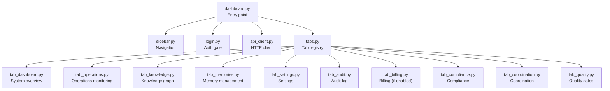
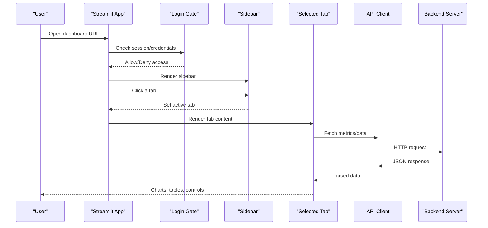
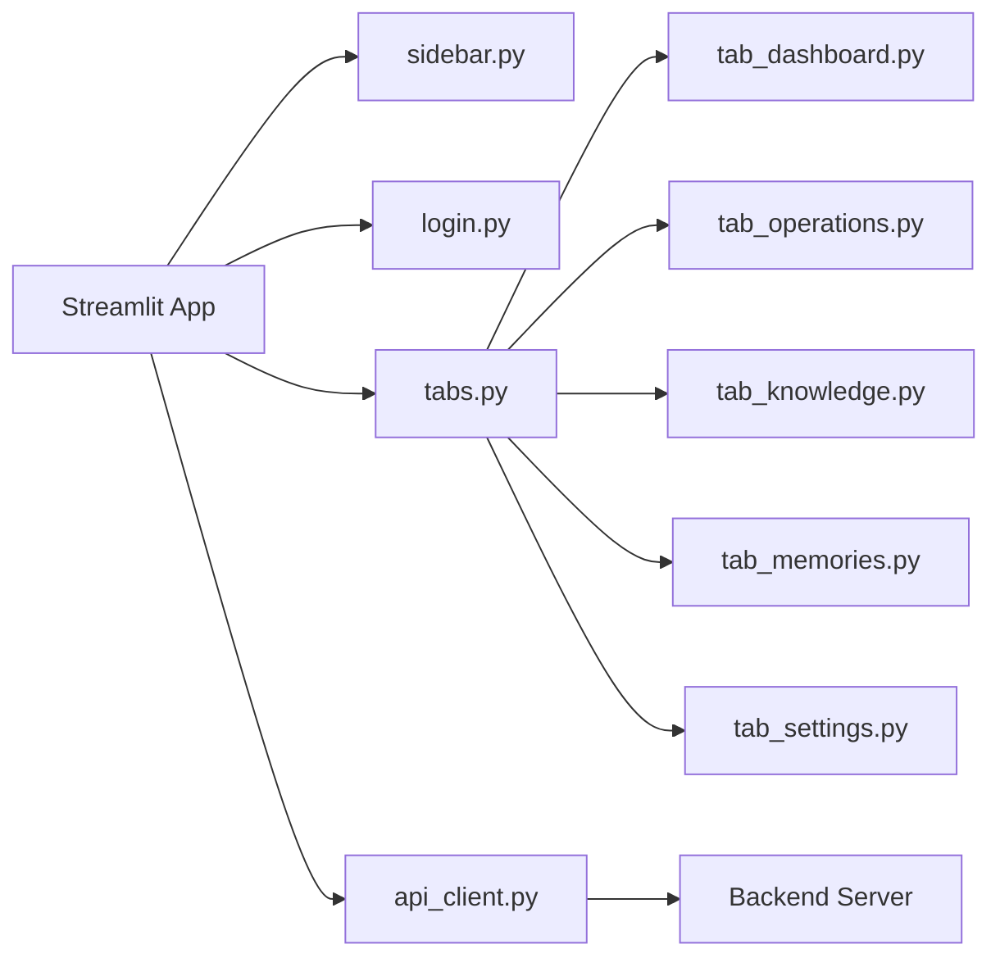

# Dashboard Interface

<cite>
**Referenced Files in This Document**
- [dashboard.py](file://dashboard.py)
- [dashboard/__init__.py](file://dashboard/__init__.py)
- [dashboard/tabs.py](file://dashboard/tabs.py)
- [dashboard/tab_dashboard.py](file://dashboard/tab_dashboard.py)
- [dashboard/tab_operations.py](file://dashboard/tab_operations.py)
- [dashboard/tab_knowledge.py](file://dashboard/tab_knowledge.py)
- [dashboard/tab_memories.py](file://dashboard/tab_memories.py)
- [dashboard/tab_settings.py](file://dashboard/tab_settings.py)
- [dashboard/sidebar.py](file://dashboard/sidebar.py)
- [dashboard/login.py](file://dashboard/login.py)
- [dashboard/api_client.py](file://dashboard/api_client.py)
- [dashboard/tab_audit.py](file://dashboard/tab_audit.py)
- [dashboard/tab_billing.py](file://dashboard/tab_billing.py)
- [dashboard/tab_compliance.py](file://dashboard/tab_compliance.py)
- [dashboard/tab_coordination.py](file://dashboard/tab_coordination.py)
- [dashboard/tab_quality.py](file://dashboard/tab_quality.py)
</cite>

## Table of Contents
1. [Introduction](#introduction)
2. [Project Structure](#project-structure)
3. [Core Components](#core-components)
4. [Architecture Overview](#architecture-overview)
5. [Detailed Component Analysis](#detailed-component-analysis)
6. [Dependency Analysis](#dependency-analysis)
7. [Performance Considerations](#performance-considerations)
8. [Troubleshooting Guide](#troubleshooting-guide)
9. [Conclusion](#conclusion)
10. [Appendices](#appendices)

## Introduction
This document explains the Agentic Memory web dashboard interface, focusing on how to navigate tabs, interpret metrics and charts, and perform administrative tasks. It covers:
- System overview and health monitoring
- Operations monitoring and diagnostics
- Knowledge graph visualization and exploration
- Memory management and search performance analysis
- Settings configuration and security considerations

The goal is to help administrators and operators understand what each tab shows, how to act on insights, and how to configure the system safely.

## Project Structure
The dashboard is implemented as a modular Streamlit application with separate modules for authentication, navigation, API client usage, and per-tab UI logic. The main entry point initializes the app, sets up routing, and wires shared components like sidebar and login handling. Each tab module implements its own view and interactions.

**Diagram sources**
- [dashboard.py](file://dashboard.py)
- [dashboard/sidebar.py](file://dashboard/sidebar.py)
- [dashboard/login.py](file://dashboard/login.py)
- [dashboard/api_client.py](file://dashboard/api_client.py)
- [dashboard/tabs.py](file://dashboard/tabs.py)
- [dashboard/tab_dashboard.py](file://dashboard/tab_dashboard.py)
- [dashboard/tab_operations.py](file://dashboard/tab_operations.py)
- [dashboard/tab_knowledge.py](file://dashboard/tab_knowledge.py)
- [dashboard/tab_memories.py](file://dashboard/tab_memories.py)
- [dashboard/tab_settings.py](file://dashboard/tab_settings.py)
- [dashboard/tab_audit.py](file://dashboard/tab_audit.py)
- [dashboard/tab_billing.py](file://dashboard/tab_billing.py)
- [dashboard/tab_compliance.py](file://dashboard/tab_compliance.py)
- [dashboard/tab_coordination.py](file://dashboard/tab_coordination.py)
- [dashboard/tab_quality.py](file://dashboard/tab_quality.py)

**Section sources**
- [dashboard.py](file://dashboard.py)
- [dashboard/__init__.py](file://dashboard/__init__.py)
- [dashboard/tabs.py](file://dashboard/tabs.py)

## Core Components
- Entry point and app bootstrap: Initializes the Streamlit app, configures global state, and routes to tabs based on user selection.
- Sidebar navigation: Renders tab links and contextual actions; may include tenant or role indicators if configured.
- Authentication gate: Enforces login before rendering protected tabs; supports session-based auth and optional SSO integration.
- API client: Provides typed HTTP calls to backend endpoints used by all tabs (health, metrics, KG, memories, settings).
- Tab registry: Maps tab names to their UI functions and metadata (icons, descriptions).
- Per-tab modules: Implement specific dashboards for overview, operations, knowledge graph, memory management, settings, audit, billing, compliance, coordination, and quality.

Key responsibilities:
- Centralize data fetching via api_client to avoid duplication.
- Keep UI logic isolated per tab for maintainability.
- Provide consistent error handling and loading states across tabs.

**Section sources**
- [dashboard.py](file://dashboard.py)
- [dashboard/sidebar.py](file://dashboard/sidebar.py)
- [dashboard/login.py](file://dashboard/login.py)
- [dashboard/api_client.py](file://dashboard/api_client.py)
- [dashboard/tabs.py](file://dashboard/tabs.py)

## Architecture Overview
The dashboard follows a simple client-server architecture:
- Frontend: Streamlit app with multiple tabs.
- Backend: REST/MCP endpoints exposed by the server.
- Client: api_client module encapsulates requests, retries, and error mapping.

**Diagram sources**
- [dashboard.py](file://dashboard.py)
- [dashboard/login.py](file://dashboard/login.py)
- [dashboard/sidebar.py](file://dashboard/sidebar.py)
- [dashboard/api_client.py](file://dashboard/api_client.py)

## Detailed Component Analysis

### System Overview (Dashboard Tab)
Purpose:
- Provide a high-level snapshot of system health, resource utilization, recent activity, and key alerts.

What you will see:
- Health status indicators (e.g., services, database connectivity, background workers).
- Key metrics such as ingestion rate, search latency percentiles, and storage growth.
- Recent events or cron run summaries.

How to use:
- Refresh the page to pull latest metrics.
- Use any provided filters (time window, tenant scope) to narrow the view.
- Click into details (e.g., a failing service) to jump to the Operations tab for deeper diagnostics.

Interpreting metrics:
- Health status should be green under normal conditions; red indicates failures requiring attention.
- Latency percentiles show tail behavior; spikes may indicate load or downstream issues.
- Storage growth trends help plan capacity and retention policies.

Common tasks:
- Verify system readiness after deployment or maintenance.
- Identify anomalies early by watching alert thresholds.

**Section sources**
- [dashboard/tab_dashboard.py](file://dashboard/tab_dashboard.py)
- [dashboard/api_client.py](file://dashboard/api_client.py)

### Operations Monitoring (Operations Tab)
Purpose:
- Monitor background jobs, cron runs, worker queues, and operational health.

What you will see:
- Cron job schedules and last run results.
- Worker queue depth and task throughput.
- Error logs and retry statuses.

How to use:
- Filter by job type or time range.
- Inspect failed runs and trigger re-runs where applicable.
- Export logs for offline analysis.

Interpreting metrics:
- Queue depth increasing consistently suggests backpressure or slow consumers.
- Frequent retries indicate transient errors; persistent failures require investigation.
- Cron drift or missed runs can impact data freshness.

Common tasks:
- Investigate failed tasks and check dependencies.
- Validate that scheduled maintenance jobs are executing as expected.

**Section sources**
- [dashboard/tab_operations.py](file://dashboard/tab_operations.py)
- [dashboard/api_client.py](file://dashboard/api_client.py)

### Knowledge Graph Visualization (Knowledge Tab)
Purpose:
- Explore entities, relationships, and temporal facts extracted from memories.

What you will see:
- Interactive graph with nodes (entities) and edges (relationships).
- Filters by entity type, relationship type, and time windows.
- Fact summaries and provenance links to source memories.

How to use:
- Search for an entity to highlight related subgraph.
- Toggle layers (temporal facts, community clusters) to analyze structure.
- Click nodes to open detail panels and trace backlinks.

Interpreting visuals:
- Dense clusters often indicate tightly coupled concepts.
- Temporal overlays reveal evolution over time.
- Orphan nodes may need deduplication or merging.

Common tasks:
- Audit entity consistency and resolve duplicates.
- Validate extraction quality by inspecting fact provenance.

**Section sources**
- [dashboard/tab_knowledge.py](file://dashboard/tab_knowledge.py)
- [dashboard/api_client.py](file://dashboard/api_client.py)

### Memory Management (Memories Tab)
Purpose:
- Manage memories, review quality, and analyze search performance.

What you will see:
- List and filter memories by tags, date ranges, and agents.
- Quality scores and review flags.
- Search analytics including recall/precision proxies and latency.

How to use:
- Search and filter to locate specific memories.
- Review flagged items and approve/reject changes.
- Analyze search performance by query type and time window.

Interpreting metrics:
- Quality score distributions highlight areas needing curation.
- Search latency spikes correlate with heavy loads or model bottlenecks.
- Recall improvements after tuning suggest effective parameter changes.

Common tasks:
- Approve or reject memory revisions.
- Trigger re-indexing or embedding recomputation for affected subsets.
- Export datasets for offline evaluation.

**Section sources**
- [dashboard/tab_memories.py](file://dashboard/tab_memories.py)
- [dashboard/api_client.py](file://dashboard/api_client.py)

### Settings Configuration (Settings Tab)
Purpose:
- Configure system parameters, feature flags, and integrations.

What you will see:
- Global settings (retention policies, indexing options).
- Model provider configurations and fallbacks.
- Security and RBAC settings.

How to use:
- Edit settings with validation feedback.
- Apply changes with preview and rollback support where available.
- Save and confirm updates; monitor effects in other tabs.

Interpreting changes:
- Retention policy adjustments affect storage and cost.
- Model provider switches may alter latency and accuracy.
- Feature flags enable/disable capabilities without redeployments.

Common tasks:
- Update embedding models or reranker strategies.
- Adjust rate limits and timeouts for stability.
- Enable audit logging and compliance features.

Security considerations:
- Restrict access to sensitive settings using roles.
- Validate inputs to prevent misconfiguration.
- Log all configuration changes for auditability.

**Section sources**
- [dashboard/tab_settings.py](file://dashboard/tab_settings.py)
- [dashboard/api_client.py](file://dashboard/api_client.py)

### Additional Tabs
- Audit: View immutable logs of critical actions and configuration changes.
- Billing: Track usage and costs if billing integration is enabled.
- Compliance: Ensure adherence to policies and generate reports.
- Coordination: Inspect distributed locks, sync status, and multi-agent coordination.
- Quality: Review quality gates, drift detection, and model performance.

These tabs follow the same patterns: fetch data via api_client, render interactive views, and provide actionable controls.

**Section sources**
- [dashboard/tab_audit.py](file://dashboard/tab_audit.py)
- [dashboard/tab_billing.py](file://dashboard/tab_billing.py)
- [dashboard/tab_compliance.py](file://dashboard/tab_compliance.py)
- [dashboard/tab_coordination.py](file://dashboard/tab_coordination.py)
- [dashboard/tab_quality.py](file://dashboard/tab_quality.py)
- [dashboard/api_client.py](file://dashboard/api_client.py)

## Dependency Analysis
The dashboard’s runtime depends on:
- Streamlit for UI rendering and state management.
- api_client for HTTP communication with backend services.
- Per-tab modules for domain-specific views and interactions.
- Optional SSO/auth providers integrated through login.py.

**Diagram sources**
- [dashboard.py](file://dashboard.py)
- [dashboard/sidebar.py](file://dashboard/sidebar.py)
- [dashboard/login.py](file://dashboard/login.py)
- [dashboard/tabs.py](file://dashboard/tabs.py)
- [dashboard/tab_dashboard.py](file://dashboard/tab_dashboard.py)
- [dashboard/tab_operations.py](file://dashboard/tab_operations.py)
- [dashboard/tab_knowledge.py](file://dashboard/tab_knowledge.py)
- [dashboard/tab_memories.py](file://dashboard/tab_memories.py)
- [dashboard/tab_settings.py](file://dashboard/tab_settings.py)
- [dashboard/api_client.py](file://dashboard/api_client.py)

**Section sources**
- [dashboard/tabs.py](file://dashboard/tabs.py)
- [dashboard/api_client.py](file://dashboard/api_client.py)

## Performance Considerations
- Prefer pagination and incremental loading for large lists (memories, audit logs).
- Cache frequently accessed read-only data at the client level when safe.
- Debounce search inputs and chart filters to reduce network churn.
- Use streaming responses for long-running queries where supported.
- Monitor backend latency and adjust timeout/retry policies accordingly.

[No sources needed since this section provides general guidance]

## Troubleshooting Guide
Common issues and resolutions:
- Authentication failures:
  - Verify credentials and session validity.
  - Check SSO configuration and token expiration.
- Data not loading:
  - Confirm backend availability and endpoint health.
  - Inspect api_client error mappings and retry behavior.
- Slow charts:
  - Narrow time windows and apply filters.
  - Reduce granularity or switch to aggregated views.
- Permission denied:
  - Ensure the user has required roles for the tab or action.
  - Review RBAC policies and principal assignments.

Operational checks:
- Use the System Overview tab to verify overall health.
- Inspect Operations tab for cron and worker status.
- Review Audit tab for recent configuration changes and errors.

**Section sources**
- [dashboard/login.py](file://dashboard/login.py)
- [dashboard/api_client.py](file://dashboard/api_client.py)
- [dashboard/tab_dashboard.py](file://dashboard/tab_dashboard.py)
- [dashboard/tab_operations.py](file://dashboard/tab_operations.py)
- [dashboard/tab_audit.py](file://dashboard/tab_audit.py)

## Conclusion
The Agentic Memory dashboard provides a comprehensive interface for monitoring system health, managing memories, exploring the knowledge graph, and configuring settings securely. By understanding each tab’s purpose, interpreting key metrics, and following best practices for navigation and troubleshooting, administrators can maintain a reliable and high-performing system.

[No sources needed since this section summarizes without analyzing specific files]

## Appendices

### Navigation Quick Start
- Open the dashboard URL and authenticate if prompted.
- Use the sidebar to select tabs:
  - System Overview: health and key metrics.
  - Operations: jobs, workers, and logs.
  - Knowledge: graph exploration and entity details.
  - Memories: list, review, and search analytics.
  - Settings: configuration and security.
  - Additional tabs: Audit, Billing, Compliance, Coordination, Quality.

### Interpreting Metrics and Charts
- Health indicators: green = healthy, yellow = degraded, red = failure.
- Latency percentiles: focus on p95/p99 for tail behavior.
- Throughput: measure ingestion/search rates over time.
- Storage growth: track trends to plan capacity.

### Administrative Tasks
- Viewing system health:
  - Go to System Overview and confirm all services are healthy.
- Managing agents:
  - Use Memories tab to filter by agent and review quality.
- Analyzing search performance:
  - In Memories tab, examine latency and relevance proxies.
- Configuring system parameters:
  - In Settings tab, update policies and model providers; validate and save.

### User Roles and Access Permissions
- Roles determine which tabs and actions are visible.
- Admin roles can modify settings and manage users.
- Operator roles can monitor and perform limited maintenance.
- Viewer roles have read-only access to most tabs.

Security considerations:
- Enforce strong authentication and session management.
- Limit exposure of sensitive settings to authorized roles.
- Enable audit logging for all configuration changes.

[No sources needed since this section provides general guidance]