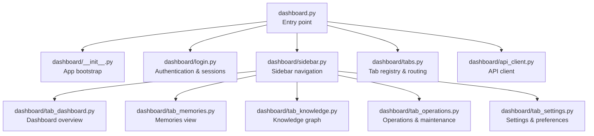
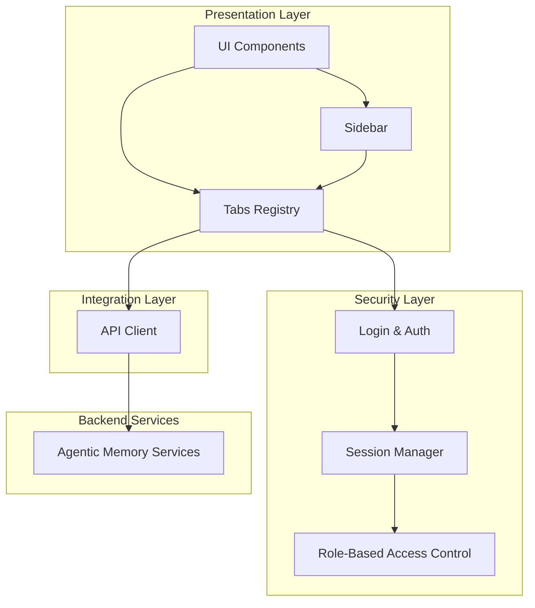
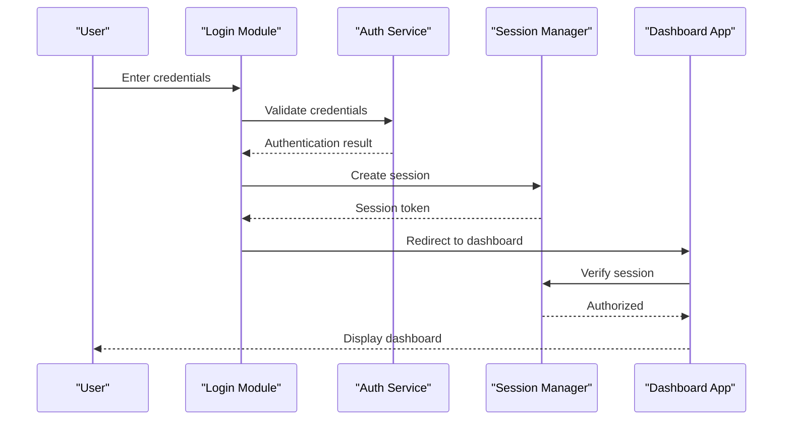
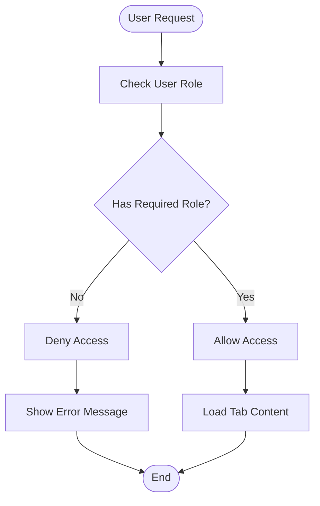
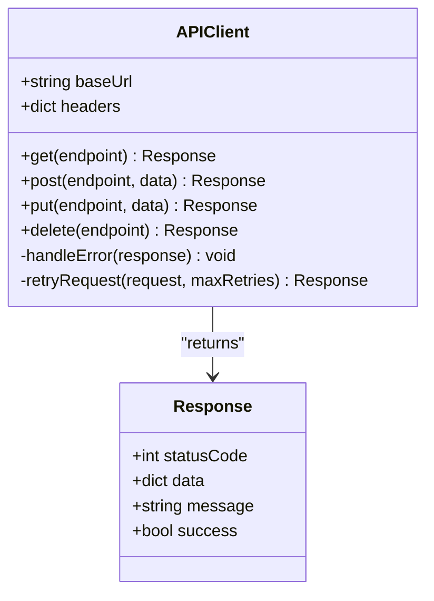
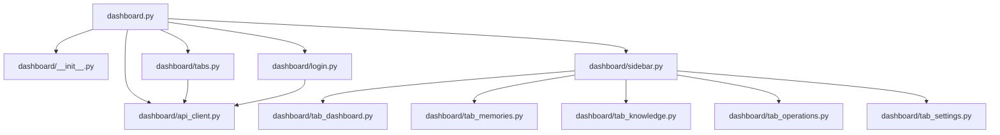

# Dashboard Overview and Navigation

<cite>
**Referenced Files in This Document**
- [dashboard.py](file://dashboard.py)
- [dashboard/__init__.py](file://dashboard/__init__.py)
- [dashboard/login.py](file://dashboard/login.py)
- [dashboard/sidebar.py](file://dashboard/sidebar.py)
- [dashboard/tabs.py](file://dashboard/tabs.py)
- [dashboard/tab_dashboard.py](file://dashboard/tab_dashboard.py)
- [dashboard/tab_memories.py](file://dashboard/tab_memories.py)
- [dashboard/tab_knowledge.py](file://dashboard/tab_knowledge.py)
- [dashboard/tab_operations.py](file://dashboard/tab_operations.py)
- [dashboard/tab_settings.py](file://dashboard/tab_settings.py)
- [dashboard/api_client.py](file://dashboard/api_client.py)
</cite>

## Table of Contents
1. [Introduction](#introduction)
2. [Project Structure](#project-structure)
3. [Core Components](#core-components)
4. [Architecture Overview](#architecture-overview)
5. [Detailed Component Analysis](#detailed-component-analysis)
6. [Dependency Analysis](#dependency-analysis)
7. [Performance Considerations](#performance-considerations)
8. [Troubleshooting Guide](#troubleshooting-guide)
9. [Conclusion](#conclusion)
10. [Appendices](#appendices)

## Introduction
This document explains the Agentic Memory dashboard overview and navigation system. It covers the main dashboard layout, sidebar navigation structure, how to access different functional areas, responsive design considerations, user interface components, accessibility features, authentication and session management, role-based access control, first-time setup, basic navigation patterns, common workflow shortcuts, customization options, theme settings, and user preferences. The goal is to help both new and experienced users navigate and operate the dashboard efficiently.

## Project Structure
The dashboard is implemented as a modular Python application with a clear separation between entry points, UI layout, navigation, tabs (functional areas), and API client integration. Key modules include:
- Entry point and app initialization
- Authentication and login handling
- Sidebar navigation and tab registry
- Individual tab implementations for each functional area
- API client for backend communication

**Diagram sources**
- [dashboard.py:1-200](file://dashboard.py#L1-L200)
- [dashboard/__init__.py:1-150](file://dashboard/__init__.py#L1-L150)
- [dashboard/login.py:1-200](file://dashboard/login.py#L1-L200)
- [dashboard/sidebar.py:1-200](file://dashboard/sidebar.py#L1-L200)
- [dashboard/tabs.py:1-200](file://dashboard/tabs.py#L1-L200)
- [dashboard/tab_dashboard.py:1-200](file://dashboard/tab_dashboard.py#L1-L200)
- [dashboard/tab_memories.py:1-200](file://dashboard/tab_memories.py#L1-L200)
- [dashboard/tab_knowledge.py:1-200](file://dashboard/tab_knowledge.py#L1-L200)
- [dashboard/tab_operations.py:1-200](file://dashboard/tab_operations.py#L1-L200)
- [dashboard/tab_settings.py:1-200](file://dashboard/tab_settings.py#L1-L200)
- [dashboard/api_client.py:1-200](file://dashboard/api_client.py#L1-L200)

**Section sources**
- [dashboard.py:1-200](file://dashboard.py#L1-L200)
- [dashboard/__init__.py:1-150](file://dashboard/__init__.py#L1-L150)
- [dashboard/login.py:1-200](file://dashboard/login.py#L1-L200)
- [dashboard/sidebar.py:1-200](file://dashboard/sidebar.py#L1-L200)
- [dashboard/tabs.py:1-200](file://dashboard/tabs.py#L1-L200)
- [dashboard/tab_dashboard.py:1-200](file://dashboard/tab_dashboard.py#L1-L200)
- [dashboard/tab_memories.py:1-200](file://dashboard/tab_memories.py#L1-L200)
- [dashboard/tab_knowledge.py:1-200](file://dashboard/tab_knowledge.py#L1-L200)
- [dashboard/tab_operations.py:1-200](file://dashboard/tab_operations.py#L1-L200)
- [dashboard/tab_settings.py:1-200](file://dashboard/tab_settings.py#L1-L200)
- [dashboard/api_client.py:1-200](file://dashboard/api_client.py#L1-L200)

## Core Components
- Dashboard entry point initializes the application, configures routes, and wires up authentication and session middleware.
- Login module handles user authentication, token/session storage, and redirects based on authorization state.
- Sidebar provides persistent navigation across tabs and supports keyboard shortcuts and responsive behavior.
- Tabs registry manages dynamic loading and permission checks for each functional area.
- Tab implementations render domain-specific views and interact with the API client for data operations.
- API client encapsulates HTTP requests, error handling, retries, and response parsing.

Key responsibilities:
- Authentication flow and session lifecycle
- Role-based access control enforcement at route and component levels
- Responsive layout and accessible UI components
- Centralized API communication with robust error handling

**Section sources**
- [dashboard.py:1-200](file://dashboard.py#L1-L200)
- [dashboard/login.py:1-200](file://dashboard/login.py#L1-L200)
- [dashboard/sidebar.py:1-200](file://dashboard/sidebar.py#L1-L200)
- [dashboard/tabs.py:1-200](file://dashboard/tabs.py#L1-L200)
- [dashboard/api_client.py:1-200](file://dashboard/api_client.py#L1-L200)

## Architecture Overview
The dashboard follows a layered architecture:
- Presentation layer: UI components, sidebar, tabs
- Navigation layer: sidebar and tab registry
- Security layer: authentication, session management, RBAC
- Integration layer: API client for backend services

**Diagram sources**
- [dashboard.py:1-200](file://dashboard.py#L1-L200)
- [dashboard/login.py:1-200](file://dashboard/login.py#L1-L200)
- [dashboard/sidebar.py:1-200](file://dashboard/sidebar.py#L1-L200)
- [dashboard/tabs.py:1-200](file://dashboard/tabs.py#L1-L200)
- [dashboard/api_client.py:1-200](file://dashboard/api_client.py#L1-L200)

## Detailed Component Analysis

### Dashboard Layout and Navigation
- Main layout includes header, sidebar, content area, and footer.
- Sidebar contains links to all functional tabs and respects user roles.
- Content area dynamically renders selected tab content.
- Responsive breakpoints adjust layout for mobile, tablet, and desktop.

Navigation patterns:
- Click sidebar items to switch tabs
- Keyboard shortcuts for quick access (e.g., Ctrl+1 for Dashboard, Ctrl+2 for Memories)
- Breadcrumb navigation within deep pages

Accessibility:
- Semantic HTML elements and ARIA attributes
- Focus management and keyboard navigation support
- High contrast mode and screen reader compatibility

**Section sources**
- [dashboard/sidebar.py:1-200](file://dashboard/sidebar.py#L1-L200)
- [dashboard/tabs.py:1-200](file://dashboard/tabs.py#L1-L200)
- [dashboard/tab_dashboard.py:1-200](file://dashboard/tab_dashboard.py#L1-L200)

### Authentication and Session Management
- Users authenticate via username/password or SSO provider
- Session tokens are stored securely and refreshed automatically
- Unauthorized access redirects to login page
- Session timeout policies enforce security

**Diagram sources**
- [dashboard/login.py:1-200](file://dashboard/login.py#L1-L200)
- [dashboard.py:1-200](file://dashboard.py#L1-L200)

**Section sources**
- [dashboard/login.py:1-200](file://dashboard/login.py#L1-L200)
- [dashboard.py:1-200](file://dashboard.py#L1-L200)

### Role-Based Access Control
- Roles determine which tabs and actions are available
- Admin users have full access to all tabs
- Regular users have limited access to read-only tabs
- Permission checks occur at both route and component levels

**Diagram sources**
- [dashboard/tabs.py:1-200](file://dashboard/tabs.py#L1-L200)
- [dashboard/sidebar.py:1-200](file://dashboard/sidebar.py#L1-L200)

**Section sources**
- [dashboard/tabs.py:1-200](file://dashboard/tabs.py#L1-L200)
- [dashboard/sidebar.py:1-200](file://dashboard/sidebar.py#L1-L200)

### Functional Areas and Tabs
Each tab represents a specific functional area:

#### Dashboard Overview Tab
- Provides system status, recent activity, and quick actions
- Displays key metrics and health indicators
- Shows notifications and alerts

#### Memories Tab
- Browse and search stored memories
- Filter by date, type, and relevance
- View memory details and relationships

#### Knowledge Graph Tab
- Visualize knowledge graph connections
- Explore entities and their relationships
- Search and filter graph nodes

#### Operations Tab
- Monitor system operations and background jobs
- View logs and performance metrics
- Execute maintenance tasks

#### Settings Tab
- Configure user preferences and dashboard appearance
- Manage account settings and security options
- Customize themes and display options

**Section sources**
- [dashboard/tab_dashboard.py:1-200](file://dashboard/tab_dashboard.py#L1-L200)
- [dashboard/tab_memories.py:1-200](file://dashboard/tab_memories.py#L1-L200)
- [dashboard/tab_knowledge.py:1-200](file://dashboard/tab_knowledge.py#L1-L200)
- [dashboard/tab_operations.py:1-200](file://dashboard/tab_operations.py#L1-L200)
- [dashboard/tab_settings.py:1-200](file://dashboard/tab_settings.py#L1-L200)

### API Client Integration
- Centralized HTTP client for all backend communications
- Automatic retry logic for failed requests
- Error handling and user-friendly error messages
- Request/response logging for debugging

**Diagram sources**
- [dashboard/api_client.py:1-200](file://dashboard/api_client.py#L1-L200)

**Section sources**
- [dashboard/api_client.py:1-200](file://dashboard/api_client.py#L1-L200)

## Dependency Analysis
The dashboard components have clear dependency relationships:

**Diagram sources**
- [dashboard.py:1-200](file://dashboard.py#L1-L200)
- [dashboard/__init__.py:1-150](file://dashboard/__init__.py#L1-L150)
- [dashboard/login.py:1-200](file://dashboard/login.py#L1-L200)
- [dashboard/sidebar.py:1-200](file://dashboard/sidebar.py#L1-L200)
- [dashboard/tabs.py:1-200](file://dashboard/tabs.py#L1-L200)
- [dashboard/api_client.py:1-200](file://dashboard/api_client.py#L1-L200)
- [dashboard/tab_dashboard.py:1-200](file://dashboard/tab_dashboard.py#L1-L200)
- [dashboard/tab_memories.py:1-200](file://dashboard/tab_memories.py#L1-L200)
- [dashboard/tab_knowledge.py:1-200](file://dashboard/tab_knowledge.py#L1-L200)
- [dashboard/tab_operations.py:1-200](file://dashboard/tab_operations.py#L1-L200)
- [dashboard/tab_settings.py:1-200](file://dashboard/tab_settings.py#L1-L200)

**Section sources**
- [dashboard.py:1-200](file://dashboard.py#L1-L200)
- [dashboard/__init__.py:1-150](file://dashboard/__init__.py#L1-L150)
- [dashboard/login.py:1-200](file://dashboard/login.py#L1-L200)
- [dashboard/sidebar.py:1-200](file://dashboard/sidebar.py#L1-L200)
- [dashboard/tabs.py:1-200](file://dashboard/tabs.py#L1-L200)
- [dashboard/api_client.py:1-200](file://dashboard/api_client.py#L1-L200)

## Performance Considerations
- Lazy loading of tab components to improve initial load time
- Efficient caching of frequently accessed data
- Optimized API calls with pagination and filtering
- Responsive design with minimal reflows and repaints
- Background processing for heavy operations

## Troubleshooting Guide
Common issues and solutions:
- **Authentication failures**: Check network connectivity and credentials
- **Permission denied errors**: Verify user roles and permissions
- **Slow loading times**: Clear browser cache and check network performance
- **API connection errors**: Ensure backend service is running and accessible
- **Session timeouts**: Extend session duration or refresh manually

**Section sources**
- [dashboard/login.py:1-200](file://dashboard/login.py#L1-L200)
- [dashboard/api_client.py:1-200](file://dashboard/api_client.py#L1-L200)

## Conclusion
The Agentic Memory dashboard provides a comprehensive and intuitive interface for managing agent memories and knowledge graphs. With its modular architecture, robust authentication system, and responsive design, it offers an excellent user experience across different devices and use cases. The role-based access control ensures security while maintaining flexibility for various user types.

## Appendices

### First-Time Setup Instructions
1. Install required dependencies
2. Configure database connection
3. Set up authentication providers
4. Initialize default user accounts
5. Start the dashboard server
6. Access the dashboard via web browser

### Basic Navigation Patterns
- Use sidebar for primary navigation
- Employ keyboard shortcuts for efficiency
- Utilize search functionality within tabs
- Bookmark frequently accessed pages

### Customization Options
- Theme selection (light/dark mode)
- Layout preferences
- Notification settings
- Language and regional settings