# Knowledge Graph Visualization

<cite>
**Referenced Files in This Document**
- [kg.py](file://agentic_memory/kg.py)
- [kg_traversal.py](file://kg/kg_traversal.py)
- [graph_analytics.py](file://kg/graph_analytics.py)
- [graph_communities.py](file://kg/graph_communities.py)
- [tab_knowledge.py](file://dashboard/tab_knowledge.py)
- [mcp_kg.py](file://mcp_kg.py)
- [mcp_kg_traversal.py](file://mcp_kg_traversal.py)
- [cron_kg_analytics.py](file://cron/cron_kg_analytics.py)
- [kg_db.py](file://knowledge_graph/kg_db.py)
- [kg_search.py](file://knowledge_graph/kg_search.py)
- [kg_schema.py](file://knowledge_graph/kg_schema.py)
- [kg_extract.py](file://knowledge_graph/kg_extract.py)
- [temporal_resolver.py](file://kg/temporal_resolver.py)
- [kg_crdt.py](file://kg/kg_crdt.py)
- [kg_dedup.py](file://kg/kg_dedup.py)
- [kg_backfill.py](file://backfill/kg_backfills.py)
- [cron_kg_backfill.py](file://cron/cron_kg_backfill.py)
- [cron_kg_backfill_monitor.py](file://cron/cron_kg_backfill_monitor.py)
- [test_kg_traversal.py](file://tests/test_kg_traversal.py)
- [test_multi_hop_traversal.py](file://tests/test_multi_hop_traversal.py)
- [test_session_clustering_enhancement.py](file://tests/test_session_clustering_enhancement.py)
- [test_kg_entity_filter.py](file://tests/test_kg_entity_filter.py)
- [test_kg_validation.py](file://tests/test_kg_validation.py)
- [test_kg_analytics_off_save_path.py](file://tests/test_kg_analytics_off_save_path.py)
</cite>

## Table of Contents
1. [Introduction](#introduction)
2. [Project Structure](#project-structure)
3. [Core Components](#core-components)
4. [Architecture Overview](#architecture-overview)
5. [Detailed Component Analysis](#detailed-component-analysis)
6. [Dependency Analysis](#dependency-analysis)
7. [Performance Considerations](#performance-considerations)
8. [Troubleshooting Guide](#troubleshooting-guide)
9. [Conclusion](#conclusion)
10. [Appendices](#appendices)

## Introduction
This document describes the knowledge graph visualization interface and its interactive exploration features. It explains how to browse entities, filter nodes, highlight relationships, traverse paths, cluster concepts, detect communities, query the graph, export data, and analyze topology. It also covers analytics such as centrality measures, density analysis, and temporal evolution tracking, along with performance optimization strategies for large graphs, zoom controls, and export formats.

## Project Structure
The knowledge graph visualization is implemented across several modules:
- Dashboard UI integration for browsing and interacting with the graph
- MCP endpoints exposing traversal and analytics operations
- Core graph algorithms for traversal, community detection, and analytics
- Persistence and schema layers for storing graph data
- Background jobs for backfilling and periodic analytics computation

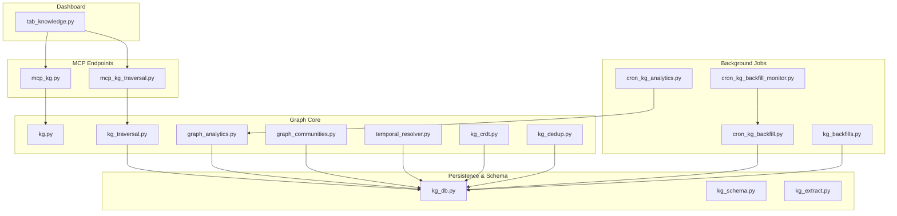

**Diagram sources**
- [tab_knowledge.py](file://dashboard/tab_knowledge.py)
- [mcp_kg.py](file://mcp_kg.py)
- [mcp_kg_traversal.py](file://mcp_kg_traversal.py)
- [kg.py](file://agentic_memory/kg.py)
- [kg_traversal.py](file://kg/kg_traversal.py)
- [graph_analytics.py](file://kg/graph_analytics.py)
- [graph_communities.py](file://kg/graph_communities.py)
- [temporal_resolver.py](file://kg/temporal_resolver.py)
- [kg_crdt.py](file://kg/kg_crdt.py)
- [kg_dedup.py](file://kg/kg_dedup.py)
- [kg_db.py](file://knowledge_graph/kg_db.py)
- [kg_schema.py](file://knowledge_graph/kg_schema.py)
- [kg_extract.py](file://knowledge_graph/kg_extract.py)
- [cron_kg_analytics.py](file://cron/cron_kg_analytics.py)
- [cron_kg_backfill.py](file://cron/cron_kg_backfill.py)
- [cron_kg_backfill_monitor.py](file://cron/cron_kg_backfill_monitor.py)
- [kg_backfills.py](file://backfill/kg_backfills.py)

**Section sources**
- [tab_knowledge.py](file://dashboard/tab_knowledge.py)
- [mcp_kg.py](file://mcp_kg.py)
- [mcp_kg_traversal.py](file://mcp_kg_traversal.py)
- [kg.py](file://agentic_memory/kg.py)
- [kg_traversal.py](file://kg/kg_traversal.py)
- [graph_analytics.py](file://kg/graph_analytics.py)
- [graph_communities.py](file://kg/graph_communities.py)
- [temporal_resolver.py](file://kg/temporal_resolver.py)
- [kg_crdt.py](file://kg/kg_crdt.py)
- [kg_dedup.py](file://kg/kg_dedup.py)
- [kg_db.py](file://knowledge_graph/kg_db.py)
- [kg_schema.py](file://knowledge_graph/kg_schema.py)
- [kg_extract.py](file://knowledge_graph/kg_extract.py)
- [cron_kg_analytics.py](file://cron/cron_kg_analytics.py)
- [cron_kg_backfill.py](file://cron/cron_kg_backfill.py)
- [cron_kg_backfill_monitor.py](file://cron/cron_kg_backfill_monitor.py)
- [kg_backfills.py](file://backfill/kg_backfills.py)

## Core Components
- Interactive graph browser (Dashboard): Provides entity browsing, node filtering, relationship highlighting, path traversal, clustering views, and community detection overlays.
- MCP endpoints: Expose programmatic access to graph queries, traversal, and analytics results for automation and integrations.
- Traversal engine: Implements breadth-first and multi-hop traversal with filters and constraints.
- Analytics engine: Computes centrality measures, density metrics, and supports temporal evolution tracking via snapshots or time-bounded queries.
- Community detection: Identifies clusters and communities using graph partitioning algorithms.
- Temporal resolution: Supports time-aware queries and evolution tracking over graph snapshots.
- Persistence layer: Stores nodes, edges, metadata, and computed analytics; integrates with schema definitions and extraction pipelines.
- Background jobs: Backfill historical graph data and periodically recompute analytics.

**Section sources**
- [tab_knowledge.py](file://dashboard/tab_knowledge.py)
- [mcp_kg.py](file://mcp_kg.py)
- [mcp_kg_traversal.py](file://mcp_kg_traversal.py)
- [kg_traversal.py](file://kg/kg_traversal.py)
- [graph_analytics.py](file://kg/graph_analytics.py)
- [graph_communities.py](file://kg/graph_communities.py)
- [temporal_resolver.py](file://kg/temporal_resolver.py)
- [kg_db.py](file://knowledge_graph/kg_db.py)
- [kg_schema.py](file://knowledge_graph/kg_schema.py)
- [kg_extract.py](file://knowledge_graph/kg_extract.py)
- [cron_kg_analytics.py](file://cron/cron_kg_analytics.py)
- [cron_kg_backfill.py](file://cron/cron_kg_backfill.py)
- [cron_kg_backfill_monitor.py](file://cron/cron_kg_backfill_monitor.py)
- [kg_backfills.py](file://backfill/kg_backfills.py)

## Architecture Overview
The visualization architecture separates concerns between UI, API, algorithms, and storage:
- The dashboard tab renders the graph and handles user interactions (filtering, highlighting, traversal).
- MCP endpoints translate UI actions into server-side operations (queries, traversal, analytics).
- The traversal and analytics engines operate on the persisted graph model.
- Background jobs maintain data freshness and precompute expensive metrics.

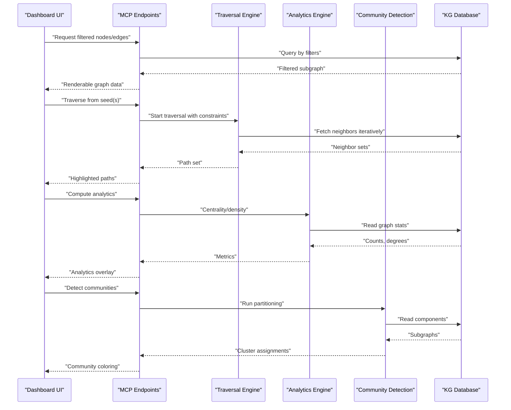

**Diagram sources**
- [tab_knowledge.py](file://dashboard/tab_knowledge.py)
- [mcp_kg.py](file://mcp_kg.py)
- [mcp_kg_traversal.py](file://mcp_kg_traversal.py)
- [kg_traversal.py](file://kg/kg_traversal.py)
- [graph_analytics.py](file://kg/graph_analytics.py)
- [graph_communities.py](file://kg/graph_communities.py)
- [kg_db.py](file://knowledge_graph/kg_db.py)

## Detailed Component Analysis

### Interactive Graph Exploration
- Node filtering: Filter by entity type, label patterns, attributes, and temporal windows.
- Relationship highlighting: Highlight edges based on relation types, weights, or traversal context.
- Path traversal: Start from seeds, expand by hops, apply constraints, and visualize shortest or all paths within limits.
- Entity browsing: Paginated listing, search, and drill-down into node details and incident edges.
- Concept clustering: Group semantically related nodes using extracted concepts or embeddings.
- Community detection: Visualize detected communities with distinct colors and cluster summaries.

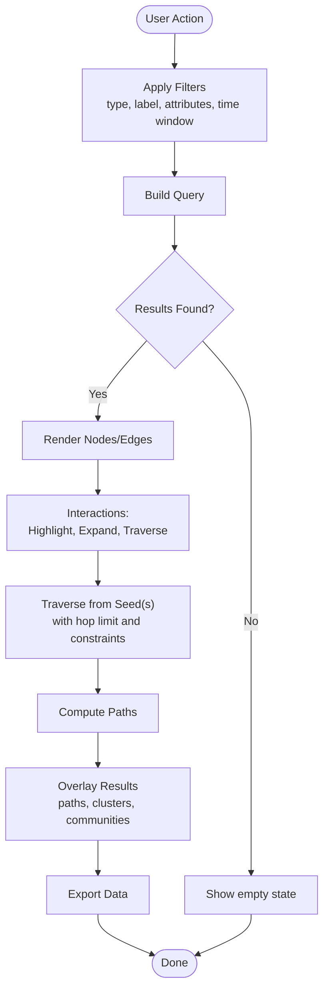

**Diagram sources**
- [tab_knowledge.py](file://dashboard/tab_knowledge.py)
- [mcp_kg.py](file://mcp_kg.py)
- [mcp_kg_traversal.py](file://mcp_kg_traversal.py)
- [kg_traversal.py](file://kg/kg_traversal.py)
- [graph_communities.py](file://kg/graph_communities.py)

**Section sources**
- [tab_knowledge.py](file://dashboard/tab_knowledge.py)
- [mcp_kg.py](file://mcp_kg.py)
- [mcp_kg_traversal.py](file://mcp_kg_traversal.py)
- [kg_traversal.py](file://kg/kg_traversal.py)
- [graph_communities.py](file://kg/graph_communities.py)

### Traversal Engine
- Breadth-first expansion with configurable depth and branching constraints.
- Multi-hop traversal supporting complex filters and early termination conditions.
- Path aggregation and deduplication to avoid redundant computations.
- Integration with temporal resolution for time-bounded traversals.

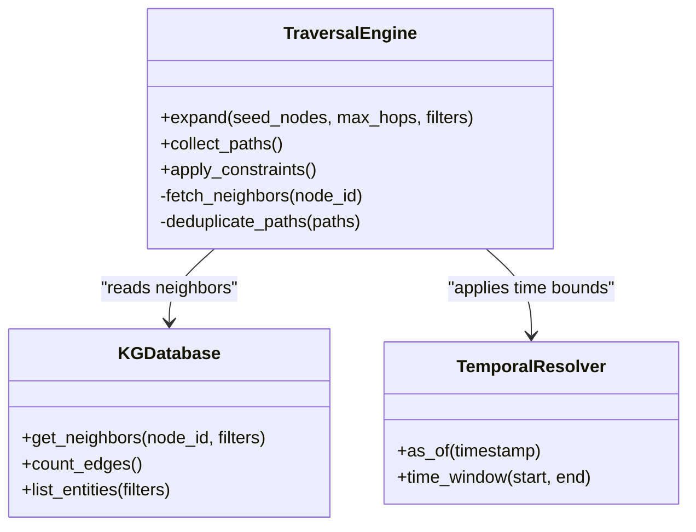

**Diagram sources**
- [kg_traversal.py](file://kg/kg_traversal.py)
- [temporal_resolver.py](file://kg/temporal_resolver.py)
- [kg_db.py](file://knowledge_graph/kg_db.py)

**Section sources**
- [kg_traversal.py](file://kg/kg_traversal.py)
- [temporal_resolver.py](file://kg/temporal_resolver.py)
- [kg_db.py](file://knowledge_graph/kg_db.py)
- [test_kg_traversal.py](file://tests/test_kg_traversal.py)
- [test_multi_hop_traversal.py](file://tests/test_multi_hop_traversal.py)

### Analytics Engine
- Centrality measures: Degree, betweenness, closeness, eigenvector-like approximations where applicable.
- Density analysis: Local and global density metrics, component sizes, and edge-to-node ratios.
- Temporal evolution: Track changes across snapshots or time windows to observe growth and decay.
- Precomputation: Cron job computes and caches metrics for faster UI rendering.

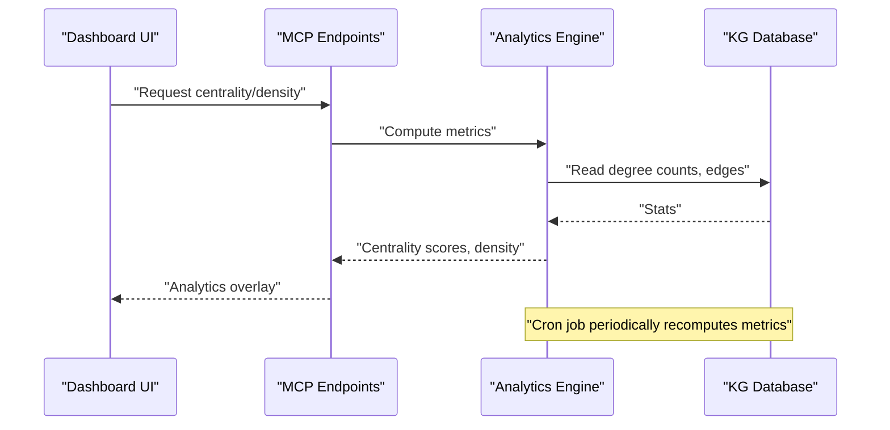

**Diagram sources**
- [graph_analytics.py](file://kg/graph_analytics.py)
- [cron_kg_analytics.py](file://cron/cron_kg_analytics.py)
- [kg_db.py](file://knowledge_graph/kg_db.py)

**Section sources**
- [graph_analytics.py](file://kg/graph_analytics.py)
- [cron_kg_analytics.py](file://cron/cron_kg_analytics.py)
- [kg_db.py](file://knowledge_graph/kg_db.py)
- [test_kg_analytics_off_save_path.py](file://tests/test_kg_analytics_off_save_path.py)

### Community Detection
- Partitioning algorithm identifies cohesive subgraphs.
- Assigns community IDs to nodes for visual grouping.
- Integrates with clustering views and concept-based grouping.

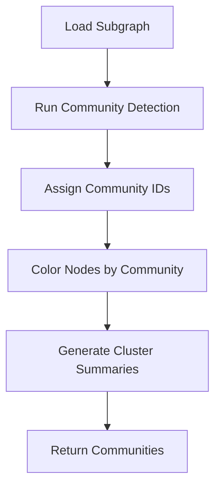

**Diagram sources**
- [graph_communities.py](file://kg/graph_communities.py)
- [kg_db.py](file://knowledge_graph/kg_db.py)

**Section sources**
- [graph_communities.py](file://kg/graph_communities.py)
- [kg_db.py](file://knowledge_graph/kg_db.py)
- [test_session_clustering_enhancement.py](file://tests/test_session_clustering_enhancement.py)

### Temporal Evolution Tracking
- Time-bounded queries allow viewing the graph at specific timestamps or within intervals.
- Snapshots enable comparison across time points.
- Temporal resolver coordinates time windows for traversal and analytics.

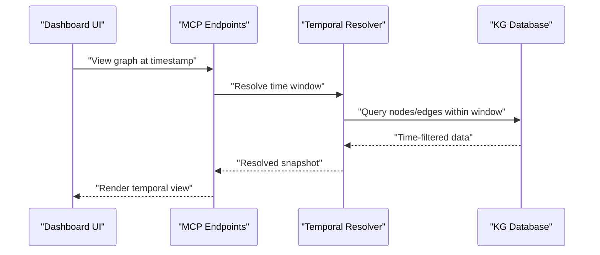

**Diagram sources**
- [temporal_resolver.py](file://kg/temporal_resolver.py)
- [kg_db.py](file://knowledge_graph/kg_db.py)

**Section sources**
- [temporal_resolver.py](file://kg/temporal_resolver.py)
- [kg_db.py](file://knowledge_graph/kg_db.py)

### Data Model and Schema
- Entities and relations are stored with typed labels and attributes.
- Schema defines constraints and indexes for efficient querying.
- Extraction pipeline populates the graph from structured/unstructured inputs.

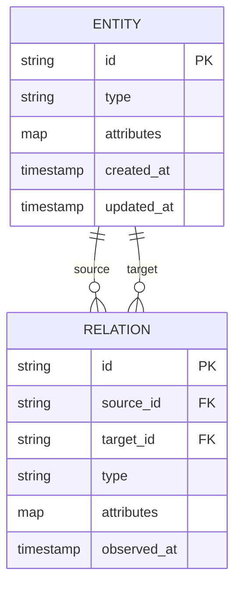

**Diagram sources**
- [kg_schema.py](file://knowledge_graph/kg_schema.py)
- [kg_extract.py](file://knowledge_graph/kg_extract.py)
- [kg_db.py](file://knowledge_graph/kg_db.py)

**Section sources**
- [kg_schema.py](file://knowledge_graph/kg_schema.py)
- [kg_extract.py](file://knowledge_graph/kg_extract.py)
- [kg_db.py](file://knowledge_graph/kg_db.py)

### MCP Endpoints for Graph Operations
- Programmatic access to traversal, filtering, and analytics.
- Standardized request/response contracts for client applications.
- Supports exporting results in multiple formats.

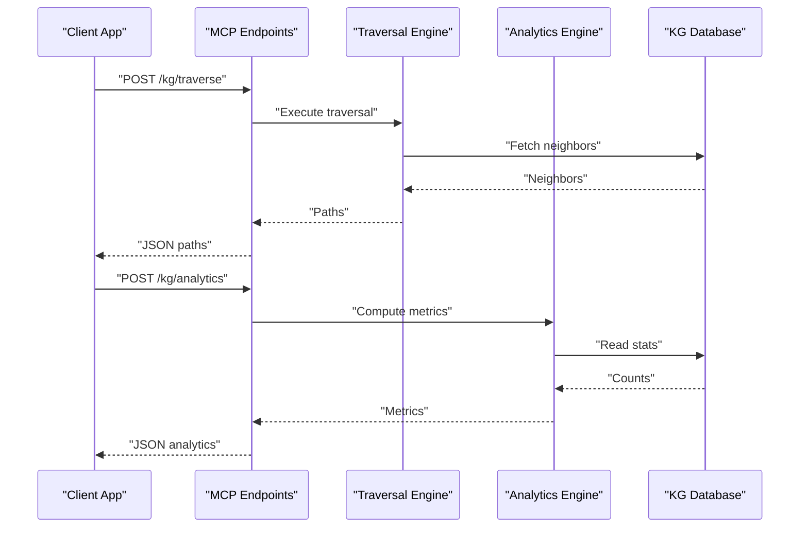

**Diagram sources**
- [mcp_kg.py](file://mcp_kg.py)
- [mcp_kg_traversal.py](file://mcp_kg_traversal.py)
- [kg_traversal.py](file://kg/kg_traversal.py)
- [graph_analytics.py](file://kg/graph_analytics.py)
- [kg_db.py](file://knowledge_graph/kg_db.py)

**Section sources**
- [mcp_kg.py](file://mcp_kg.py)
- [mcp_kg_traversal.py](file://mcp_kg_traversal.py)
- [kg_traversal.py](file://kg/kg_traversal.py)
- [graph_analytics.py](file://kg/graph_analytics.py)
- [kg_db.py](file://knowledge_graph/kg_db.py)

### Background Jobs and Backfills
- Backfill jobs reconstruct historical graph data and ensure consistency.
- Monitor jobs track progress and handle failures.
- Periodic analytics jobs keep metrics up to date.

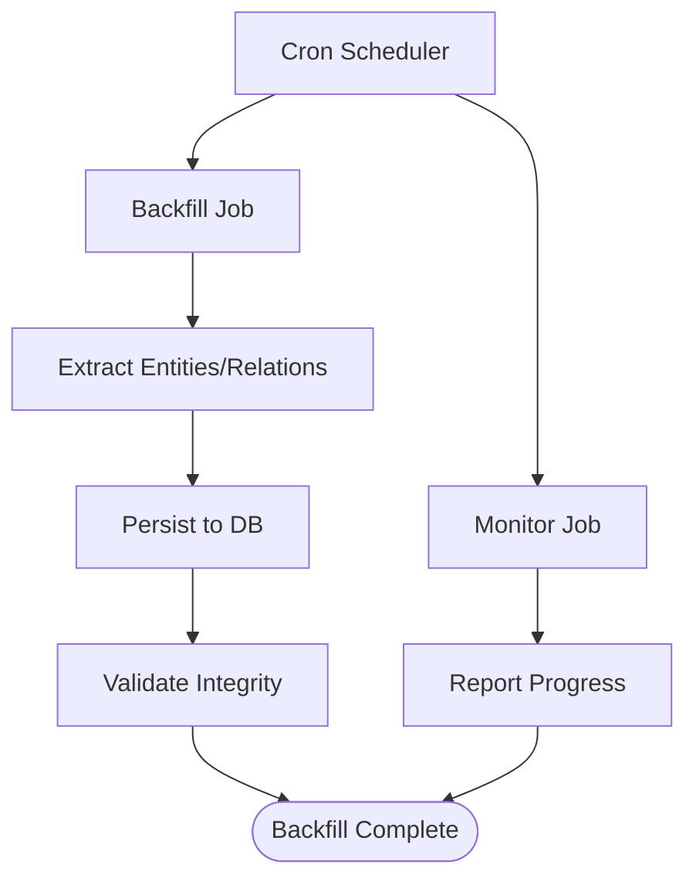

**Diagram sources**
- [cron_kg_backfill.py](file://cron/cron_kg_backfill.py)
- [cron_kg_backfill_monitor.py](file://cron/cron_kg_backfill_monitor.py)
- [kg_backfills.py](file://backfill/kg_backfills.py)
- [cron_kg_analytics.py](file://cron/cron_kg_analytics.py)

**Section sources**
- [cron_kg_backfill.py](file://cron/cron_kg_backfill.py)
- [cron_kg_backfill_monitor.py](file://cron/cron_kg_backfill_monitor.py)
- [kg_backfills.py](file://backfill/kg_backfills.py)
- [cron_kg_analytics.py](file://cron/cron_kg_analytics.py)

## Dependency Analysis
Key dependencies and coupling:
- Dashboard depends on MCP endpoints for data and operations.
- MCP endpoints depend on traversal and analytics engines.
- Engines depend on the database layer and temporal resolver.
- Background jobs depend on persistence and extraction utilities.
- Deduplication and CRDT layers ensure consistency and conflict-free updates.

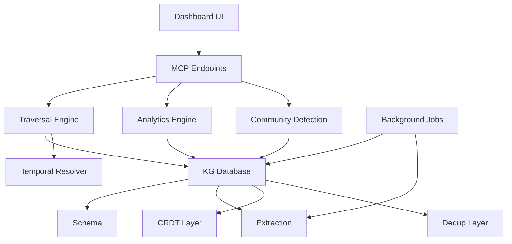

**Diagram sources**
- [tab_knowledge.py](file://dashboard/tab_knowledge.py)
- [mcp_kg.py](file://mcp_kg.py)
- [mcp_kg_traversal.py](file://mcp_kg_traversal.py)
- [kg_traversal.py](file://kg/kg_traversal.py)
- [graph_analytics.py](file://kg/graph_analytics.py)
- [graph_communities.py](file://kg/graph_communities.py)
- [temporal_resolver.py](file://kg/temporal_resolver.py)
- [kg_db.py](file://knowledge_graph/kg_db.py)
- [kg_schema.py](file://knowledge_graph/kg_schema.py)
- [kg_extract.py](file://knowledge_graph/kg_extract.py)
- [kg_crdt.py](file://kg/kg_crdt.py)
- [kg_dedup.py](file://kg/kg_dedup.py)
- [cron_kg_analytics.py](file://cron/cron_kg_analytics.py)
- [cron_kg_backfill.py](file://cron/cron_kg_backfill.py)
- [cron_kg_backfill_monitor.py](file://cron/cron_kg_backfill_monitor.py)
- [kg_backfills.py](file://backfill/kg_backfills.py)

**Section sources**
- [tab_knowledge.py](file://dashboard/tab_knowledge.py)
- [mcp_kg.py](file://mcp_kg.py)
- [mcp_kg_traversal.py](file://mcp_kg_traversal.py)
- [kg_traversal.py](file://kg/kg_traversal.py)
- [graph_analytics.py](file://kg/graph_analytics.py)
- [graph_communities.py](file://kg/graph_communities.py)
- [temporal_resolver.py](file://kg/temporal_resolver.py)
- [kg_db.py](file://knowledge_graph/kg_db.py)
- [kg_schema.py](file://knowledge_graph/kg_schema.py)
- [kg_extract.py](file://knowledge_graph/kg_extract.py)
- [kg_crdt.py](file://kg/kg_crdt.py)
- [kg_dedup.py](file://kg/kg_dedup.py)
- [cron_kg_analytics.py](file://cron/cron_kg_analytics.py)
- [cron_kg_backfill.py](file://cron/cron_kg_backfill.py)
- [cron_kg_backfill_monitor.py](file://cron/cron_kg_backfill_monitor.py)
- [kg_backfills.py](file://backfill/kg_backfills.py)

## Performance Considerations
- Large graph handling:
  - Use pagination and progressive loading for nodes and edges.
  - Apply strict filters (type, label, time window) to reduce result sets.
  - Limit traversal depth and branch factors; prefer targeted seeds.
- Indexing and queries:
  - Ensure indexes exist on frequently filtered fields (entity type, labels, timestamps).
  - Prefer precomputed analytics via cron jobs to avoid heavy on-demand calculations.
- Rendering and UX:
  - Implement zoom controls and viewport culling to render only visible regions.
  - Batch updates and debounce user interactions to prevent UI jank.
- Export formats:
  - Provide JSON, CSV, and GraphML exports for interoperability.
  - Allow selective export (filtered subgraphs) to manage file size.
- Concurrency and caching:
  - Cache frequent queries and analytics results.
  - Use background workers for long-running operations.

[No sources needed since this section provides general guidance]

## Troubleshooting Guide
- Validation errors:
  - Check entity and relation schema constraints when imports fail.
  - Review deduplication logs for conflicts and merges.
- Traversal issues:
  - Verify seed nodes exist and have expected neighbor sets.
  - Inspect hop limits and constraint filters that may prune paths.
- Analytics discrepancies:
  - Confirm cron jobs ran successfully and metrics were updated.
  - Compare on-demand vs cached metrics to identify staleness.
- Temporal queries:
  - Ensure timestamps are present and consistent across nodes and edges.
  - Validate time window boundaries and timezone handling.

**Section sources**
- [test_kg_validation.py](file://tests/test_kg_validation.py)
- [kg_dedup.py](file://kg/kg_dedup.py)
- [kg_traversal.py](file://kg/kg_traversal.py)
- [cron_kg_analytics.py](file://cron/cron_kg_analytics.py)
- [temporal_resolver.py](file://kg/temporal_resolver.py)

## Conclusion
The knowledge graph visualization interface combines a responsive dashboard, robust MCP endpoints, and powerful backend engines for traversal, analytics, and community detection. With careful filtering, indexing, and background computation, it scales to large graphs while providing rich interactive exploration, including path traversal, clustering, and temporal evolution tracking. Export capabilities and performance optimizations ensure usability across diverse workflows.

[No sources needed since this section summarizes without analyzing specific files]

## Appendices

### Querying the Graph
- Use MCP endpoints to submit filtered queries, specify time windows, and request traversal results.
- Combine filters for entity types, labels, and attributes to narrow scope.
- Request analytics overlays for centrality and density insights.

**Section sources**
- [mcp_kg.py](file://mcp_kg.py)
- [mcp_kg_traversal.py](file://mcp_kg_traversal.py)
- [kg_search.py](file://knowledge_graph/kg_search.py)

### Exporting Graph Data
- Supported formats include JSON, CSV, and GraphML.
- Selective export allows downloading filtered subgraphs.
- Background export tasks can be used for large datasets.

**Section sources**
- [kg_db.py](file://knowledge_graph/kg_db.py)
- [kg_extract.py](file://knowledge_graph/kg_extract.py)

### Analyzing Graph Topology
- Centrality measures highlight influential nodes.
- Density analysis reveals connectivity patterns.
- Community detection surfaces cohesive clusters.

**Section sources**
- [graph_analytics.py](file://kg/graph_analytics.py)
- [graph_communities.py](file://kg/graph_communities.py)