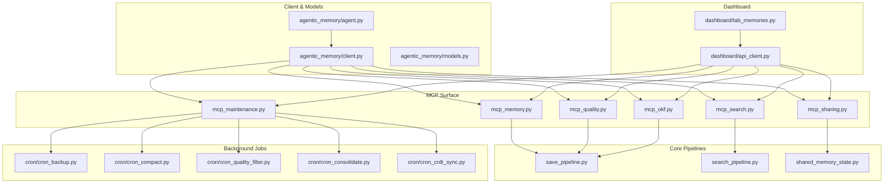
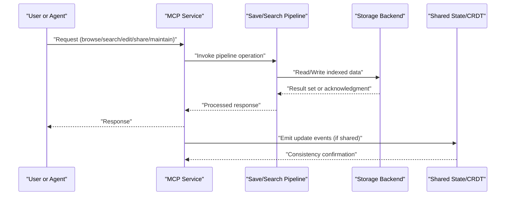
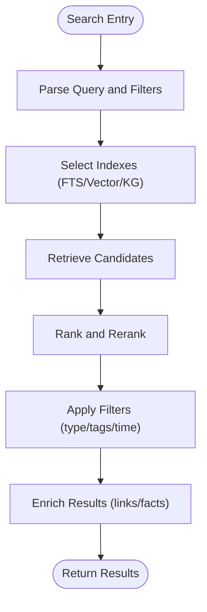
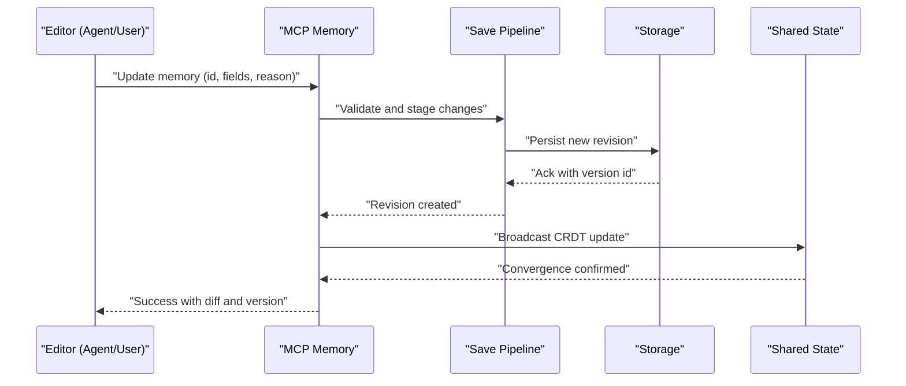
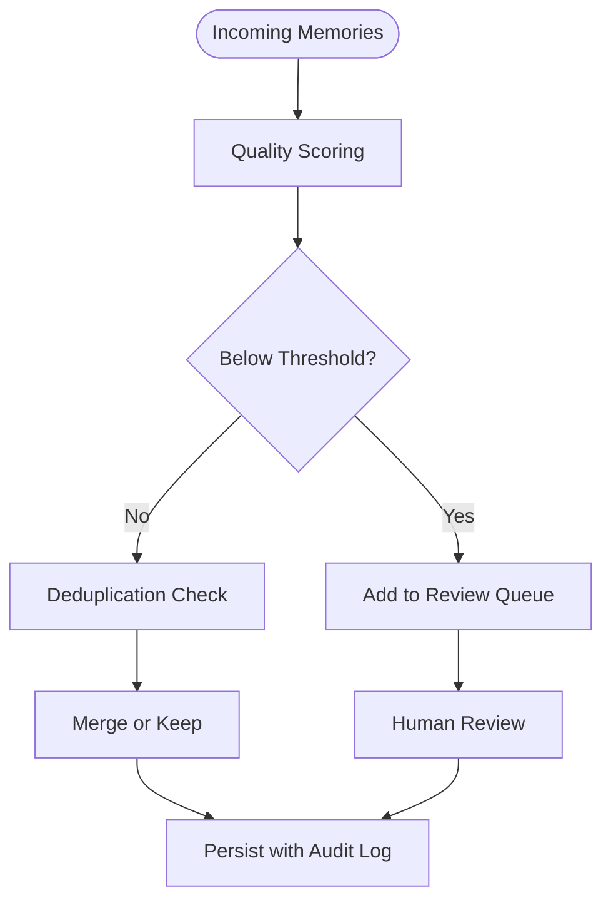
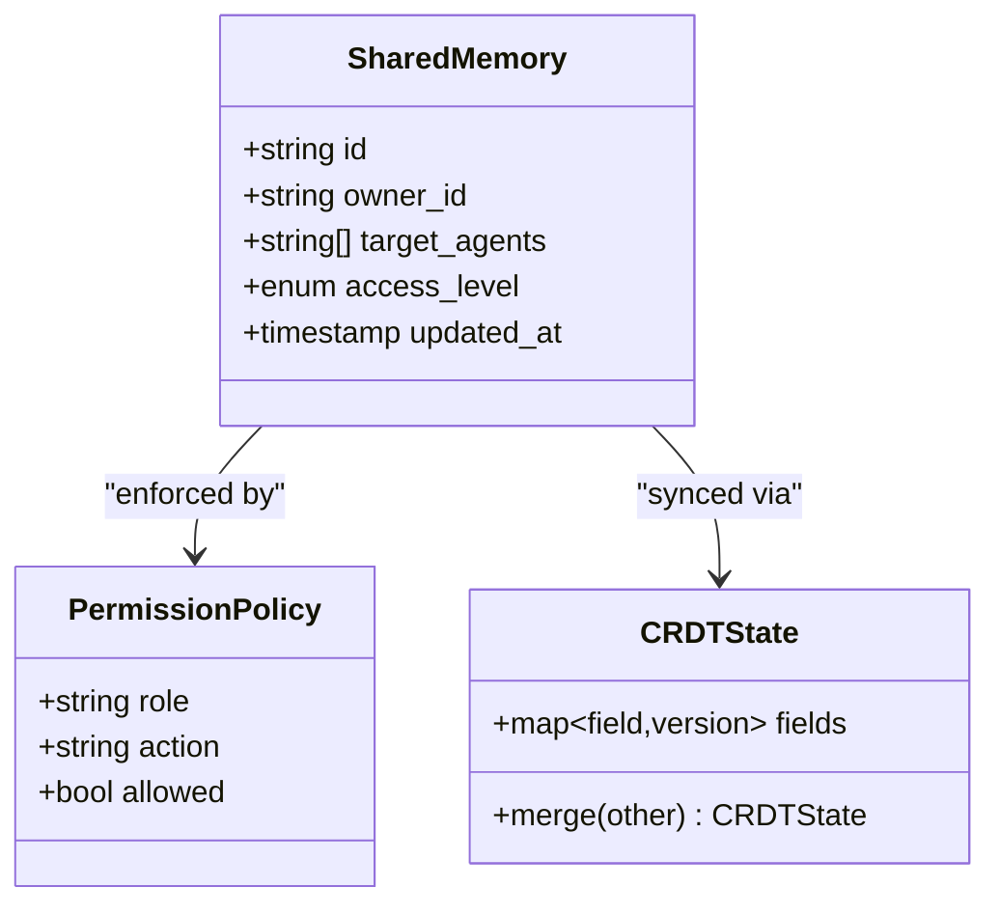
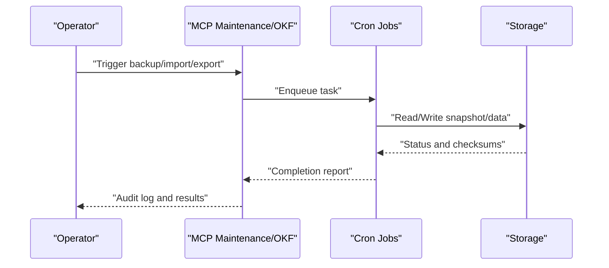
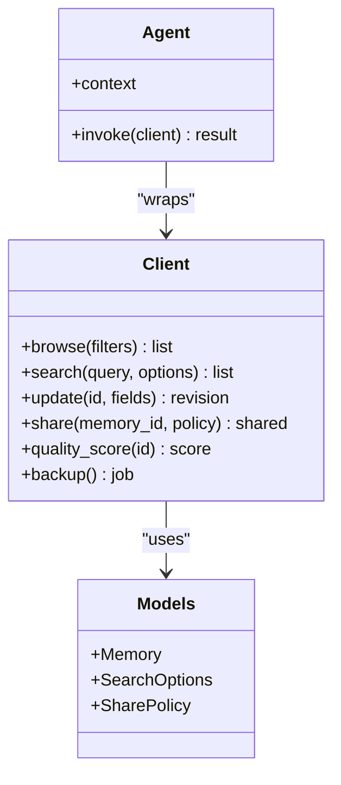
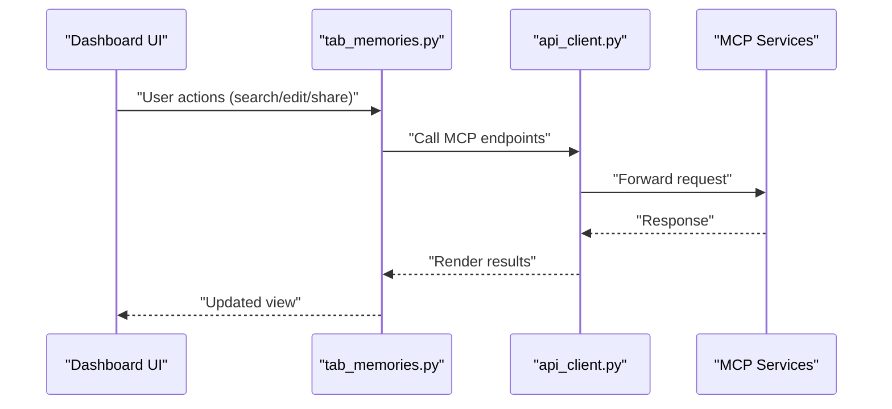
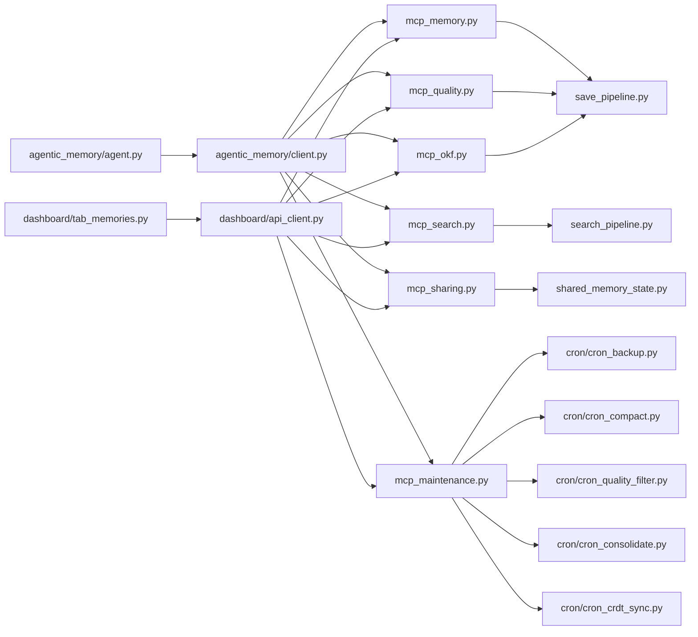

# Memory Management Interface

<cite>
**Referenced Files in This Document**
- [memory_common.py](file://memory_common.py)
- [mcp_memory.py](file://mcp_memory.py)
- [mcp_sharing.py](file://mcp_sharing.py)
- [mcp_search.py](file://mcp_search.py)
- [mcp_quality.py](file://mcp_quality.py)
- [mcp_maintenance.py](file://mcp_maintenance.py)
- [mcp_okf.py](file://mcp_okf.py)
- [cron_backup.py](file://cron/cron_backup.py)
- [cron_compact.py](file://cron/cron_compact.py)
- [cron_quality_filter.py](file://cron/cron_quality_filter.py)
- [cron_consolidate.py](file://cron/cron_consolidate.py)
- [cron_crdt_sync.py](file://cron/cron_crdt_sync.py)
- [kg_dedup.py](file://kg/kg_dedup.py)
- [save_pipeline.py](file://save_pipeline.py)
- [search_pipeline.py](file://search_pipeline.py)
- [shared_memory_state.py](file://shared_memory_state.py)
- [agentic_memory/client.py](file://agentic_memory/client.py)
- [agentic_memory/agent.py](file://agentic_memory/agent.py)
- [agentic_memory/models.py](file://agentic_memory/models.py)
- [dashboard/tab_memories.py](file://dashboard/tab_memories.py)
- [dashboard/api_client.py](file://dashboard/api_client.py)
</cite>

## Table of Contents
1. [Introduction](#introduction)
2. [Project Structure](#project-structure)
3. [Core Components](#core-components)
4. [Architecture Overview](#architecture-overview)
5. [Detailed Component Analysis](#detailed-component-analysis)
6. [Dependency Analysis](#dependency-analysis)
7. [Performance Considerations](#performance-considerations)
8. [Troubleshooting Guide](#troubleshooting-guide)
9. [Conclusion](#conclusion)
10. [Appendices](#appendices)

## Introduction
This document provides comprehensive documentation for the memory management interface, focusing on:
- Browsing, searching, and filtering memories across types and time periods
- Editing memories with version history tracking and collaborative workflows
- Quality assessment, deduplication tools, and bulk operations
- Sharing interfaces, permission management, and cross-agent collaboration
- Import/export functionality, backup operations, and data migration tools

The goal is to help both technical and non-technical users understand how to operate the system effectively and safely.

## Project Structure
At a high level, the memory management interface spans multiple layers:
- MCP surface exposing operations for browsing, search, editing, sharing, quality, maintenance, and import/export
- Core pipelines for saving and searching memories
- Background jobs for backups, compaction, quality filtering, consolidation, and CRDT sync
- Shared state and client abstractions for multi-agent collaboration
- Dashboard UI components for interactive browsing and operations

**Diagram sources**
- [mcp_memory.py](file://mcp_memory.py)
- [mcp_sharing.py](file://mcp_sharing.py)
- [mcp_search.py](file://mcp_search.py)
- [mcp_quality.py](file://mcp_quality.py)
- [mcp_maintenance.py](file://mcp_maintenance.py)
- [mcp_okf.py](file://mcp_okf.py)
- [save_pipeline.py](file://save_pipeline.py)
- [search_pipeline.py](file://search_pipeline.py)
- [shared_memory_state.py](file://shared_memory_state.py)
- [agentic_memory/client.py](file://agentic_memory/client.py)
- [agentic_memory/agent.py](file://agentic_memory/agent.py)
- [agentic_memory/models.py](file://agentic_memory/models.py)
- [dashboard/tab_memories.py](file://dashboard/tab_memories.py)
- [dashboard/api_client.py](file://dashboard/api_client.py)
- [cron/cron_backup.py](file://cron/cron_backup.py)
- [cron/cron_compact.py](file://cron/cron_compact.py)
- [cron/cron_quality_filter.py](file://cron/cron_quality_filter.py)
- [cron/cron_consolidate.py](file://cron/cron_consolidate.py)
- [cron/cron_crdt_sync.py](file://cron/cron_crdt_sync.py)

**Section sources**
- [mcp_memory.py](file://mcp_memory.py)
- [mcp_sharing.py](file://mcp_sharing.py)
- [mcp_search.py](file://mcp_search.py)
- [mcp_quality.py](file://mcp_quality.py)
- [mcp_maintenance.py](file://mcp_maintenance.py)
- [mcp_okf.py](file://mcp_okf.py)
- [save_pipeline.py](file://save_pipeline.py)
- [search_pipeline.py](file://search_pipeline.py)
- [shared_memory_state.py](file://shared_memory_state.py)
- [agentic_memory/client.py](file://agentic_memory/client.py)
- [agentic_memory/agent.py](file://agentic_memory/agent.py)
- [agentic_memory/models.py](file://agentic_memory/models.py)
- [dashboard/tab_memories.py](file://dashboard/tab_memories.py)
- [dashboard/api_client.py](file://dashboard/api_client.py)
- [cron/cron_backup.py](file://cron/cron_backup.py)
- [cron/cron_compact.py](file://cron/cron_compact.py)
- [cron/cron_quality_filter.py](file://cron/cron_quality_filter.py)
- [cron/cron_consolidate.py](file://cron/cron_consolidate.py)
- [cron/cron_crdt_sync.py](file://cron/cron_crdt_sync.py)

## Core Components
- MCP Memory Operations: Provide endpoints for listing, retrieving, updating, and deleting memories; support filters by type, tags, and time ranges; expose version history and diffs.
- MCP Search: Implements full-text, semantic, and hybrid search with query parsing, ranking, and reranking; supports temporal queries and result enrichment.
- MCP Sharing: Manages shared memories, permissions, and cross-agent collaboration via shared state and CRDT synchronization.
- MCP Quality: Exposes quality scoring, review queues, and automated quality filtering.
- MCP Maintenance: Orchestrates background tasks such as backups, compaction, consolidation, and CRDT sync.
- MCP OKF: Handles Open Knowledge Format (OKF) import/export for interoperability.
- Save Pipeline: Validates, indexes, and persists memories with audit logging and optional CRDT fields.
- Search Pipeline: Executes retrieval phases including BM25, vector, and reranking; integrates knowledge graph facts when applicable.
- Shared Memory State: Maintains consistent view of shared memories across agents and coordinates updates.
- Client and Agent Abstractions: Provide typed APIs for programmatic access to memory operations.
- Dashboard: Interactive UI for browsing, searching, editing, and managing memories and related operations.

**Section sources**
- [mcp_memory.py](file://mcp_memory.py)
- [mcp_search.py](file://mcp_search.py)
- [mcp_sharing.py](file://mcp_sharing.py)
- [mcp_quality.py](file://mcp_quality.py)
- [mcp_maintenance.py](file://mcp_maintenance.py)
- [mcp_okf.py](file://mcp_okf.py)
- [save_pipeline.py](file://save_pipeline.py)
- [search_pipeline.py](file://search_pipeline.py)
- [shared_memory_state.py](file://shared_memory_state.py)
- [agentic_memory/client.py](file://agentic_memory/client.py)
- [agentic_memory/agent.py](file://agentic_memory/agent.py)
- [agentic_memory/models.py](file://agentic_memory/models.py)
- [dashboard/tab_memories.py](file://dashboard/tab_memories.py)
- [dashboard/api_client.py](file://dashboard/api_client.py)

## Architecture Overview
The memory management interface follows a layered architecture:
- Presentation Layer: Dashboard UI and MCP clients
- API Layer: MCP services for memory, search, sharing, quality, maintenance, and OKF
- Processing Layer: Save and search pipelines
- Persistence Layer: Storage backends (database, vector index, FTS)
- Coordination Layer: Shared state and CRDT synchronization for multi-agent consistency
- Background Services: Cron-driven jobs for operational tasks

**Diagram sources**
- [mcp_memory.py](file://mcp_memory.py)
- [mcp_search.py](file://mcp_search.py)
- [mcp_sharing.py](file://mcp_sharing.py)
- [save_pipeline.py](file://save_pipeline.py)
- [search_pipeline.py](file://search_pipeline.py)
- [shared_memory_state.py](file://shared_memory_state.py)

## Detailed Component Analysis

### Memory Browsing, Searching, and Filtering
- Browsing: List memories with pagination, sort options, and filters by type, tags, author, and observed_at ranges.
- Searching: Full-text, semantic, and hybrid search with query expansion, reranking, and temporal constraints.
- Filtering: Combine filters for type, tags, confidence scores, and time windows; support advanced query syntax.

**Diagram sources**
- [mcp_search.py](file://mcp_search.py)
- [search_pipeline.py](file://search_pipeline.py)

**Section sources**
- [mcp_search.py](file://mcp_search.py)
- [search_pipeline.py](file://search_pipeline.py)

### Memory Editing, Version History, and Collaborative Workflows
- Editing: Update fields atomically with validation and audit logging; support partial updates and field-level CRDTs.
- Version History: Track revisions with timestamps, authors, and diffs; enable rollback to prior versions.
- Collaboration: Multi-agent edits reconciled via CRDT merge strategies; conflict resolution policies applied automatically.

**Diagram sources**
- [mcp_memory.py](file://mcp_memory.py)
- [save_pipeline.py](file://save_pipeline.py)
- [shared_memory_state.py](file://shared_memory_state.py)

**Section sources**
- [mcp_memory.py](file://mcp_memory.py)
- [save_pipeline.py](file://save_pipeline.py)
- [shared_memory_state.py](file://shared_memory_state.py)

### Memory Quality Assessment, Deduplication, and Bulk Operations
- Quality Assessment: Automated scoring based on completeness, recency, and coherence; human-in-the-loop review queue.
- Deduplication: Semantic and exact matching to identify duplicates; merging strategies preserve provenance and links.
- Bulk Operations: Batch updates, tagging, archival, and deletion with transactional guarantees and audit trails.

**Diagram sources**
- [mcp_quality.py](file://mcp_quality.py)
- [kg/kg_dedup.py](file://kg/kg_dedup.py)
- [save_pipeline.py](file://save_pipeline.py)

**Section sources**
- [mcp_quality.py](file://mcp_quality.py)
- [kg/kg_dedup.py](file://kg/kg_dedup.py)
- [save_pipeline.py](file://save_pipeline.py)

### Sharing Interfaces, Permission Management, and Cross-Agent Collaboration
- Sharing: Create shared memories visible to authorized agents; manage visibility scopes and targets.
- Permissions: Role-based access control for read/write/admin actions; enforce tenant isolation.
- Collaboration: Real-time synchronization using CRDTs; conflict-free merges ensure eventual consistency.

**Diagram sources**
- [mcp_sharing.py](file://mcp_sharing.py)
- [shared_memory_state.py](file://shared_memory_state.py)

**Section sources**
- [mcp_sharing.py](file://mcp_sharing.py)
- [shared_memory_state.py](file://shared_memory_state.py)

### Import/Export, Backup, and Data Migration Tools
- Import/Export: OKF-based import/export for portability; schema validation and transformation hooks.
- Backup: Scheduled snapshots with integrity checks and restore procedures.
- Migration: Schema migrations and data backfills executed via cron jobs; idempotent and audited.

**Diagram sources**
- [mcp_maintenance.py](file://mcp_maintenance.py)
- [mcp_okf.py](file://mcp_okf.py)
- [cron/cron_backup.py](file://cron/cron_backup.py)
- [cron/cron_compact.py](file://cron/cron_compact.py)
- [cron/cron_quality_filter.py](file://cron/cron_quality_filter.py)
- [cron/cron_consolidate.py](file://cron/cron_consolidate.py)
- [cron/cron_crdt_sync.py](file://cron/cron_crdt_sync.py)

**Section sources**
- [mcp_maintenance.py](file://mcp_maintenance.py)
- [mcp_okf.py](file://mcp_okf.py)
- [cron/cron_backup.py](file://cron/cron_backup.py)
- [cron/cron_compact.py](file://cron/cron_compact.py)
- [cron/cron_quality_filter.py](file://cron/cron_quality_filter.py)
- [cron/cron_consolidate.py](file://cron/cron_consolidate.py)
- [cron/cron_crdt_sync.py](file://cron/cron_crdt_sync.py)

### Programmatic Access and SDK Integration
- Client: Typed methods for browse, search, edit, share, quality, and maintenance operations.
- Agent: Contextual agent integration with automatic session scoping and credential handling.
- Models: Structured schemas for requests and responses ensuring compatibility across versions.

**Diagram sources**
- [agentic_memory/client.py](file://agentic_memory/client.py)
- [agentic_memory/agent.py](file://agentic_memory/agent.py)
- [agentic_memory/models.py](file://agentic_memory/models.py)

**Section sources**
- [agentic_memory/client.py](file://agentic_memory/client.py)
- [agentic_memory/agent.py](file://agentic_memory/agent.py)
- [agentic_memory/models.py](file://agentic_memory/models.py)

### Dashboard Interaction
- Tab Memories: Browse, filter, edit, and manage memories through a user-friendly interface.
- API Client: Communicates with MCP services to perform operations and display real-time status.

**Diagram sources**
- [dashboard/tab_memories.py](file://dashboard/tab_memories.py)
- [dashboard/api_client.py](file://dashboard/api_client.py)
- [mcp_memory.py](file://mcp_memory.py)
- [mcp_search.py](file://mcp_search.py)
- [mcp_sharing.py](file://mcp_sharing.py)
- [mcp_quality.py](file://mcp_quality.py)
- [mcp_maintenance.py](file://mcp_maintenance.py)
- [mcp_okf.py](file://mcp_okf.py)

**Section sources**
- [dashboard/tab_memories.py](file://dashboard/tab_memories.py)
- [dashboard/api_client.py](file://dashboard/api_client.py)

## Dependency Analysis
Key dependencies and relationships:
- MCP services depend on save and search pipelines for core operations
- Shared state and CRDT synchronization underpin collaborative features
- Background jobs rely on storage backends and orchestrate maintenance tasks
- Client and agent abstractions provide stable interfaces over MCP services
- Dashboard UI depends on MCP endpoints for interactive operations

**Diagram sources**
- [mcp_memory.py](file://mcp_memory.py)
- [mcp_search.py](file://mcp_search.py)
- [mcp_sharing.py](file://mcp_sharing.py)
- [mcp_quality.py](file://mcp_quality.py)
- [mcp_maintenance.py](file://mcp_maintenance.py)
- [mcp_okf.py](file://mcp_okf.py)
- [save_pipeline.py](file://save_pipeline.py)
- [search_pipeline.py](file://search_pipeline.py)
- [shared_memory_state.py](file://shared_memory_state.py)
- [agentic_memory/client.py](file://agentic_memory/client.py)
- [agentic_memory/agent.py](file://agentic_memory/agent.py)
- [dashboard/tab_memories.py](file://dashboard/tab_memories.py)
- [dashboard/api_client.py](file://dashboard/api_client.py)
- [cron/cron_backup.py](file://cron/cron_backup.py)
- [cron/cron_compact.py](file://cron/cron_compact.py)
- [cron/cron_quality_filter.py](file://cron/cron_quality_filter.py)
- [cron/cron_consolidate.py](file://cron/cron_consolidate.py)
- [cron/cron_crdt_sync.py](file://cron/cron_crdt_sync.py)

**Section sources**
- [mcp_memory.py](file://mcp_memory.py)
- [mcp_search.py](file://mcp_search.py)
- [mcp_sharing.py](file://mcp_sharing.py)
- [mcp_quality.py](file://mcp_quality.py)
- [mcp_maintenance.py](file://mcp_maintenance.py)
- [mcp_okf.py](file://mcp_okf.py)
- [save_pipeline.py](file://save_pipeline.py)
- [search_pipeline.py](file://search_pipeline.py)
- [shared_memory_state.py](file://shared_memory_state.py)
- [agentic_memory/client.py](file://agentic_memory/client.py)
- [agentic_memory/agent.py](file://agentic_memory/agent.py)
- [dashboard/tab_memories.py](file://dashboard/tab_memories.py)
- [dashboard/api_client.py](file://dashboard/api_client.py)
- [cron/cron_backup.py](file://cron/cron_backup.py)
- [cron/cron_compact.py](file://cron/cron_compact.py)
- [cron/cron_quality_filter.py](file://cron/cron_quality_filter.py)
- [cron/cron_consolidate.py](file://cron/cron_consolidate.py)
- [cron/cron_crdt_sync.py](file://cron/cron_crdt_sync.py)

## Performance Considerations
- Indexing Strategy: Use hybrid indexing (BM25 + vector) to balance recall and precision; maintain separate indices for speed and accuracy.
- Reranking: Apply lightweight rerankers for top-k candidates to reduce latency while improving relevance.
- Temporal Queries: Leverage indexes on observed_at and updated_at to optimize time-range filtering.
- Concurrency: Employ distributed locks and write queues to prevent contention during concurrent edits.
- Caching: Cache frequent queries and shared states to reduce backend load.
- Compaction: Schedule periodic compaction to keep indices efficient and storage lean.

[No sources needed since this section provides general guidance]

## Troubleshooting Guide
Common issues and resolutions:
- Search Latency: Verify index health, check reranker configuration, and monitor query cache hits.
- Edit Conflicts: Inspect CRDT merge logs and shared state convergence; adjust conflict resolution policies if necessary.
- Quality Scores: Review scoring thresholds and feature weights; retrain models if drift is detected.
- Backup Failures: Validate storage permissions and disk space; inspect integrity checksums and retry failed jobs.
- Import Errors: Ensure OKF schema compliance and validate transformations; consult audit logs for detailed error traces.

**Section sources**
- [mcp_search.py](file://mcp_search.py)
- [mcp_sharing.py](file://mcp_sharing.py)
- [mcp_quality.py](file://mcp_quality.py)
- [mcp_maintenance.py](file://mcp_maintenance.py)
- [mcp_okf.py](file://mcp_okf.py)
- [cron/cron_backup.py](file://cron/cron_backup.py)
- [cron/cron_compact.py](file://cron/cron_compact.py)
- [cron/cron_quality_filter.py](file://cron/cron_quality_filter.py)
- [cron/cron_consolidate.py](file://cron/cron_consolidate.py)
- [cron/cron_crdt_sync.py](file://cron/cron_crdt_sync.py)

## Conclusion
The memory management interface provides a robust, extensible platform for browsing, searching, editing, sharing, and maintaining memories at scale. With strong collaboration features, quality controls, and operational tooling, it supports diverse use cases from single-agent workflows to multi-agent ecosystems. Adhering to best practices in indexing, concurrency, and auditing ensures reliable performance and data integrity.

[No sources needed since this section summarizes without analyzing specific files]

## Appendices
- Configuration Reference: Environment variables and settings for tuning search, quality, and background jobs.
- Security Model: RBAC, tenant isolation, and SSO integration details.
- Migration Guides: Step-by-step instructions for schema upgrades and data backfills.

[No sources needed since this section provides general guidance]