# Operations and Administration

<cite>
**Referenced Files in This Document**
- [tab_operations.py](file://dashboard/tab_operations.py)
- [tabs.py](file://dashboard/tabs.py)
- [sidebar.py](file://dashboard/sidebar.py)
- [api_client.py](file://dashboard/api_client.py)
- [background_worker.py](file://background/background_worker.py)
- [background_queue.py](file://background/background_queue.py)
- [config.py](file://background/config.py)
- [daemon.py](file://background/daemon.py)
- [fleet_entry.py](file://background/fleet_entry.py)
- [fleet_worker.py](file://background/fleet_worker.py)
- [cron_scheduler.py](file://cron/scheduler.py)
- [jobs.py](file://cron/jobs.py)
- [enqueue_task.py](file://cron/enqueue_task.py)
- [monitor_task_queue.py](file://cron/monitor_task_queue.py)
- [manage_task_timeouts.py](file://cron/manage_task_timeouts.py)
- [maintenance.py](file://agentic_memory/maintenance.py)
- [mcp_maintenance.py](file://mcp_maintenance.py)
- [mcp_maintenance_ops.py](file://mcp_maintenance_ops.py)
- [db.py](file://infra/db.py)
- [db_migrations.py](file://infra/db_migrations.py)
- [fts.py](file://infra/fts.py)
- [vector_store.py](file://infra/vector_store.py)
- [rbac.py](file://infra/rbac.py)
- [audit.py](file://infra/audit.py)
- [audit_sink_file.py](file://infra/audit_sink_file.py)
- [audit_sink_http.py](file://infra/audit_sink_http.py)
- [saga.py](file://infra/saga.py)
- [metrics_server.py](file://infra/metrics_server.py)
- [cron_backup.py](file://cron/cron_backup.py)
- [cron_backup_validate.py](file://cron/cron_backup_validate.py)
</cite>

## Table of Contents
1. [Introduction](#introduction)
2. [Project Structure](#project-structure)
3. [Core Components](#core-components)
4. [Architecture Overview](#architecture-overview)
5. [Detailed Component Analysis](#detailed-component-analysis)
6. [Dependency Analysis](#dependency-analysis)
7. [Performance Considerations](#performance-considerations)
8. [Troubleshooting Guide](#troubleshooting-guide)
9. [Conclusion](#conclusion)
10. [Appendices](#appendices)

## Introduction
This document explains the Operations and Administration dashboard tab, focusing on operational visibility and control for background jobs, task queues, scheduled jobs, worker processes, resource allocation, performance tuning, system maintenance, database operations, index management, security administration (users, roles, audit), backup and restore, disaster recovery, and system updates. It maps dashboard UI capabilities to backend services and MCP tools that implement these functions.

## Project Structure
The Operations and Administration tab is implemented as a Streamlit tab within the dashboard package and integrates with background job infrastructure, cron scheduling, MCP maintenance tools, and core infra services.

```mermaid
graph TB
subgraph "Dashboard"
T["tab_operations.py"]
S["sidebar.py"]
TABS["tabs.py"]
API["api_client.py"]
end
subgraph "Background Workers"
BW["background_worker.py"]
BQ["background_queue.py"]
CFG["config.py"]
D["daemon.py"]
FE["fleet_entry.py"]
FW["fleet_worker.py"]
end
subgraph "Cron Scheduler"
SCH["scheduler.py"]
JOBS["jobs.py"]
ENQ["enqueue_task.py"]
MON["monitor_task_queue.py"]
MTO["manage_task_timeouts.py"]
end
subgraph "Maintenance & DB"
MAINT["maintenance.py"]
MCPM["mcp_maintenance.py"]
MCPO["mcp_maintenance_ops.py"]
DBI["db.py"]
MIG["db_migrations.py"]
FTS["fts.py"]
VST["vector_store.py"]
end
subgraph "Security"
RBAC["rbac.py"]
AUD["audit.py"]
ASF["audit_sink_file.py"]
ASH["audit_sink_http.py"]
end
subgraph "Backup & Recovery"
CBK["cron_backup.py"]
CBV["cron_backup_validate.py"]
end
subgraph "Metrics"
MET["metrics_server.py"]
end
T --> API
T --> MCPM
T --> MCPO
T --> SCH
T --> BW
T --> BQ
T --> CFG
T --> D
T --> FE
T --> FW
T --> DBI
T --> MIG
T --> FTS
T --> VST
T --> RBAC
T --> AUD
T --> ASF
T --> ASH
T --> CBK
T --> CBV
T --> MET
```

**Diagram sources**
- [tab_operations.py](file://dashboard/tab_operations.py)
- [tabs.py](file://dashboard/tabs.py)
- [sidebar.py](file://dashboard/sidebar.py)
- [api_client.py](file://dashboard/api_client.py)
- [background_worker.py](file://background/background_worker.py)
- [background_queue.py](file://background/background_queue.py)
- [config.py](file://background/config.py)
- [daemon.py](file://background/daemon.py)
- [fleet_entry.py](file://background/fleet_entry.py)
- [fleet_worker.py](file://background/fleet_worker.py)
- [cron/scheduler.py](file://cron/scheduler.py)
- [cron/jobs.py](file://cron/jobs.py)
- [cron/enqueue_task.py](file://cron/enqueue_task.py)
- [cron/monitor_task_queue.py](file://cron/monitor_task_queue.py)
- [cron/manage_task_timeouts.py](file://cron/manage_task_timeouts.py)
- [agentic_memory/maintenance.py](file://agentic_memory/maintenance.py)
- [mcp_maintenance.py](file://mcp_maintenance.py)
- [mcp_maintenance_ops.py](file://mcp_maintenance_ops.py)
- [infra/db.py](file://infra/db.py)
- [infra/db_migrations.py](file://infra/db_migrations.py)
- [infra/fts.py](file://infra/fts.py)
- [infra/vector_store.py](file://infra/vector_store.py)
- [infra/rbac.py](file://infra/rbac.py)
- [infra/audit.py](file://infra/audit.py)
- [infra/audit_sink_file.py](file://infra/audit_sink_file.py)
- [infra/audit_sink_http.py](file://infra/audit_sink_http.py)
- [cron/cron_backup.py](file://cron/cron_backup.py)
- [cron/cron_backup_validate.py](file://cron/cron_backup_validate.py)
- [infra/metrics_server.py](file://infra/metrics_server.py)

**Section sources**
- [tab_operations.py](file://dashboard/tab_operations.py)
- [tabs.py](file://dashboard/tabs.py)
- [sidebar.py](file://dashboard/sidebar.py)
- [api_client.py](file://dashboard/api_client.py)

## Core Components
- Operations Tab UI: Presents sections for background jobs, task queue, scheduled jobs, workers, resources, performance tuning, maintenance, database/index ops, security, backups, and updates.
- Background Worker System: Manages worker processes, queues, configuration, daemon lifecycle, and fleet coordination.
- Cron Scheduler: Defines jobs, enqueues tasks, monitors queues, and manages timeouts.
- Maintenance and Ops Tools: Provide safe operations for DB, indexes, and system health via MCP endpoints.
- Security Admin: Role-based access control, principals, and audit logging sinks.
- Backup and Restore: Scheduled backup creation and validation.
- Metrics: Operational metrics exposed for monitoring.

**Section sources**
- [tab_operations.py](file://dashboard/tab_operations.py)
- [background_worker.py](file://background/background_worker.py)
- [background_queue.py](file://background/background_queue.py)
- [config.py](file://background/config.py)
- [daemon.py](file://background/daemon.py)
- [fleet_entry.py](file://background/fleet_entry.py)
- [fleet_worker.py](file://background/fleet_worker.py)
- [cron/scheduler.py](file://cron/scheduler.py)
- [cron/jobs.py](file://cron/jobs.py)
- [cron/enqueue_task.py](file://cron/enqueue_task.py)
- [cron/monitor_task_queue.py](file://cron/monitor_task_queue.py)
- [cron/manage_task_timeouts.py](file://cron/manage_task_timeouts.py)
- [agentic_memory/maintenance.py](file://agentic_memory/maintenance.py)
- [mcp_maintenance.py](file://mcp_maintenance.py)
- [mcp_maintenance_ops.py](file://mcp_maintenance_ops.py)
- [infra/db.py](file://infra/db.py)
- [infra/db_migrations.py](file://infra/db_migrations.py)
- [infra/fts.py](file://infra/fts.py)
- [infra/vector_store.py](file://infra/vector_store.py)
- [infra/rbac.py](file://infra/rbac.py)
- [infra/audit.py](file://infra/audit.py)
- [infra/audit_sink_file.py](file://infra/audit_sink_file.py)
- [infra/audit_sink_http.py](file://infra/audit_sink_http.py)
- [cron/cron_backup.py](file://cron/cron_backup.py)
- [cron/cron_backup_validate.py](file://cron/cron_backup_validate.py)
- [infra/metrics_server.py](file://infra/metrics_server.py)

## Architecture Overview
The Operations tab orchestrates multiple subsystems through MCP tools and direct service calls. The following sequence shows how an admin action flows from the UI to backend components.

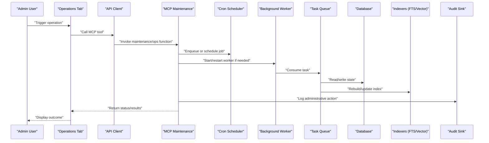

**Diagram sources**
- [tab_operations.py](file://dashboard/tab_operations.py)
- [api_client.py](file://dashboard/api_client.py)
- [mcp_maintenance.py](file://mcp_maintenance.py)
- [mcp_maintenance_ops.py](file://mcp_maintenance_ops.py)
- [cron/scheduler.py](file://cron/scheduler.py)
- [cron/enqueue_task.py](file://cron/enqueue_task.py)
- [background_worker.py](file://background/background_worker.py)
- [background_queue.py](file://background/background_queue.py)
- [infra/db.py](file://infra/db.py)
- [infra/fts.py](file://infra/fts.py)
- [infra/vector_store.py](file://infra/vector_store.py)
- [infra/audit.py](file://infra/audit.py)
- [infra/audit_sink_file.py](file://infra/audit_sink_file.py)
- [infra/audit_sink_http.py](file://infra/audit_sink_http.py)

## Detailed Component Analysis

### Background Job Monitoring
- Purpose: View active/pending/completed jobs, retry counts, durations, and errors.
- Key elements:
  - Task queue inspection and filtering.
  - Per-job details and logs.
  - Retry and re-enqueue controls.
- Implementation anchors:
  - Queue monitor and timeout manager.
  - Worker process status and fleet entries.

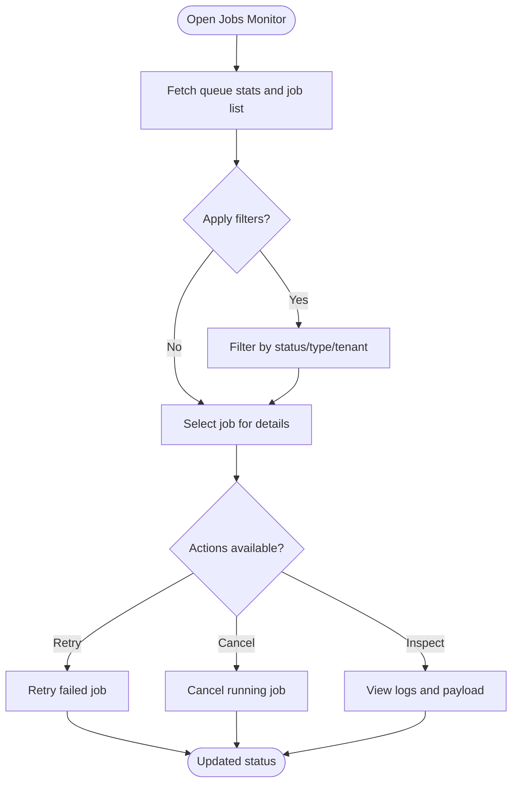

**Diagram sources**
- [cron/monitor_task_queue.py](file://cron/monitor_task_queue.py)
- [cron/manage_task_timeouts.py](file://cron/manage_task_timeouts.py)
- [background_worker.py](file://background/background_worker.py)
- [background_queue.py](file://background/background_queue.py)
- [fleet_entry.py](file://background/fleet_entry.py)
- [fleet_worker.py](file://background/fleet_worker.py)

**Section sources**
- [cron/monitor_task_queue.py](file://cron/monitor_task_queue.py)
- [cron/manage_task_timeouts.py](file://cron/manage_task_timeouts.py)
- [background_worker.py](file://background/background_worker.py)
- [background_queue.py](file://background/background_queue.py)
- [fleet_entry.py](file://background/fleet_entry.py)
- [fleet_worker.py](file://background/fleet_worker.py)

### Task Queue Management
- Purpose: Enqueue, inspect, and manage tasks across tenants and priorities.
- Key elements:
  - Enqueue new tasks with parameters.
  - Bulk operations (retry, purge).
  - Timeout policies and auto-retry behavior.
- Implementation anchors:
  - Enqueue helper and scheduler integration.
  - Timeout policy enforcement.

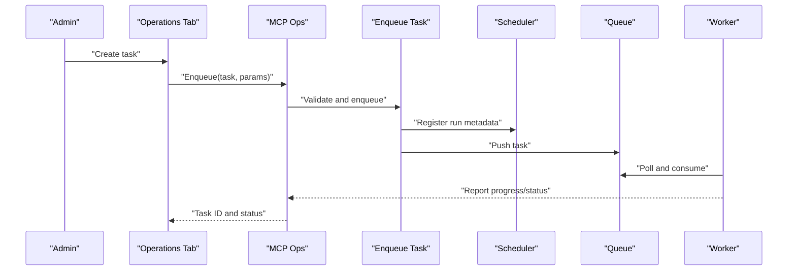

**Diagram sources**
- [cron/enqueue_task.py](file://cron/enqueue_task.py)
- [cron/scheduler.py](file://cron/scheduler.py)
- [background_worker.py](file://background/background_worker.py)
- [background_queue.py](file://background/background_queue.py)
- [mcp_maintenance_ops.py](file://mcp_maintenance_ops.py)

**Section sources**
- [cron/enqueue_task.py](file://cron/enqueue_task.py)
- [cron/scheduler.py](file://cron/scheduler.py)
- [background_worker.py](file://background/background_worker.py)
- [background_queue.py](file://background/background_queue.py)
- [mcp_maintenance_ops.py](file://mcp_maintenance_ops.py)

### Scheduled Job Configuration
- Purpose: Configure, enable/disable, and inspect cron jobs.
- Key elements:
  - Job registry and definitions.
  - Run history and last-run timestamps.
  - Manual triggers and dry-run options.
- Implementation anchors:
  - Scheduler and job definitions.
  - Dashboard integration for visibility.

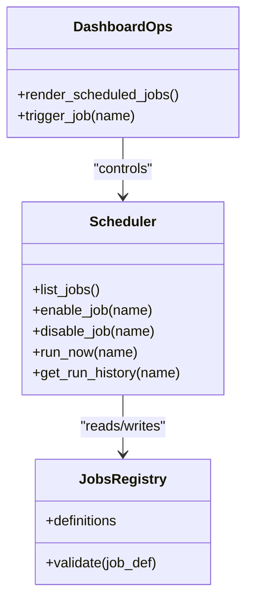

**Diagram sources**
- [cron/scheduler.py](file://cron/scheduler.py)
- [cron/jobs.py](file://cron/jobs.py)
- [tab_operations.py](file://dashboard/tab_operations.py)

**Section sources**
- [cron/scheduler.py](file://cron/scheduler.py)
- [cron/jobs.py](file://cron/jobs.py)
- [tab_operations.py](file://dashboard/tab_operations.py)

### Worker Process Management
- Purpose: Manage worker lifecycle, scaling, and fleet coordination.
- Key elements:
  - Start/stop/restart workers.
  - Fleet entry registration and health checks.
  - Resource limits and concurrency settings.
- Implementation anchors:
  - Worker runtime and daemon.
  - Fleet entry and worker modules.
  - Background config.

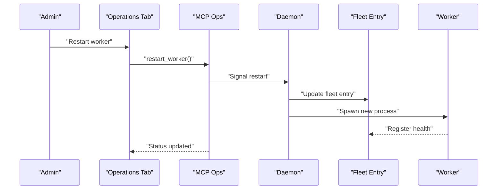

**Diagram sources**
- [background/daemon.py](file://background/daemon.py)
- [background/fleet_entry.py](file://background/fleet_entry.py)
- [background/fleet_worker.py](file://background/fleet_worker.py)
- [background/config.py](file://background/config.py)
- [mcp_maintenance_ops.py](file://mcp_maintenance_ops.py)

**Section sources**
- [background/daemon.py](file://background/daemon.py)
- [background/fleet_entry.py](file://background/fleet_entry.py)
- [background/fleet_worker.py](file://background/fleet_worker.py)
- [background/config.py](file://background/config.py)
- [mcp_maintenance_ops.py](file://mcp_maintenance_ops.py)

### Resource Allocation and Performance Tuning
- Purpose: Adjust concurrency, memory, and I/O settings; view metrics.
- Key elements:
  - Worker concurrency and queue depth.
  - Indexer batch sizes and cache settings.
  - Metrics dashboards and thresholds.
- Implementation anchors:
  - Background config and metrics server.
  - Indexer and vector store tuning.

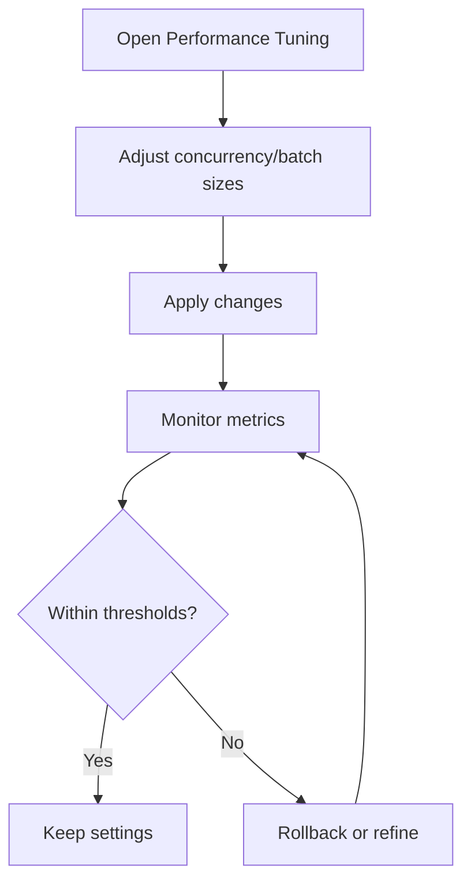

**Diagram sources**
- [background/config.py](file://background/config.py)
- [infra/metrics_server.py](file://infra/metrics_server.py)
- [infra/fts.py](file://infra/fts.py)
- [infra/vector_store.py](file://infra/vector_store.py)

**Section sources**
- [background/config.py](file://background/config.py)
- [infra/metrics_server.py](file://infra/metrics_server.py)
- [infra/fts.py](file://infra/fts.py)
- [infra/vector_store.py](file://infra/vector_store.py)

### System Maintenance Tasks
- Purpose: Perform safe maintenance operations such as compaction, integrity checks, and cleanup.
- Key elements:
  - Health checks and diagnostics.
  - Compaction and pruning.
  - Backpressure and circuit breaker status.
- Implementation anchors:
  - Maintenance module and MCP ops.

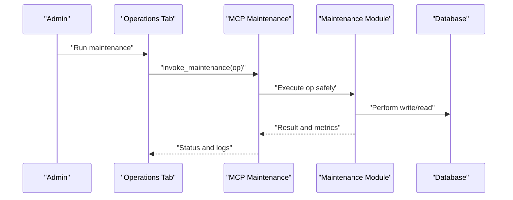

**Diagram sources**
- [agentic_memory/maintenance.py](file://agentic_memory/maintenance.py)
- [mcp_maintenance.py](file://mcp_maintenance.py)
- [mcp_maintenance_ops.py](file://mcp_maintenance_ops.py)
- [infra/db.py](file://infra/db.py)

**Section sources**
- [agentic_memory/maintenance.py](file://agentic_memory/maintenance.py)
- [mcp_maintenance.py](file://mcp_maintenance.py)
- [mcp_maintenance_ops.py](file://mcp_maintenance_ops.py)
- [infra/db.py](file://infra/db.py)

### Database Operations
- Purpose: Inspect schema version, run migrations, and perform safe DB operations.
- Key elements:
  - Schema version and migration status.
  - Migration execution and rollback safeguards.
  - Connection pooling and WAL mode.
- Implementation anchors:
  - DB interface and migration runner.

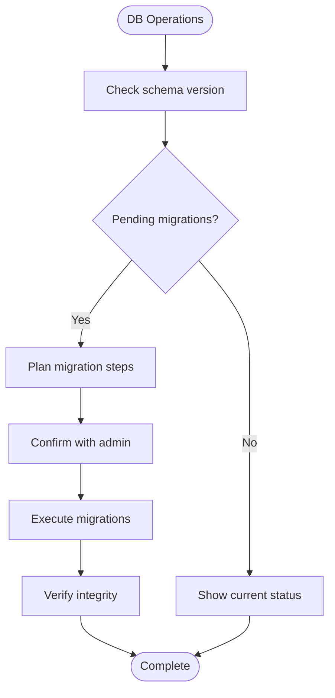

**Diagram sources**
- [infra/db.py](file://infra/db.py)
- [infra/db_migrations.py](file://infra/db_migrations.py)

**Section sources**
- [infra/db.py](file://infra/db.py)
- [infra/db_migrations.py](file://infra/db_migrations.py)

### Index Management
- Purpose: Rebuild and optimize full-text search and vector indices.
- Key elements:
  - Trigger rebuilds for text and vector stores.
  - Monitor progress and rollback on failure.
  - Tune chunking and embedding parameters.
- Implementation anchors:
  - FTS and vector store modules.

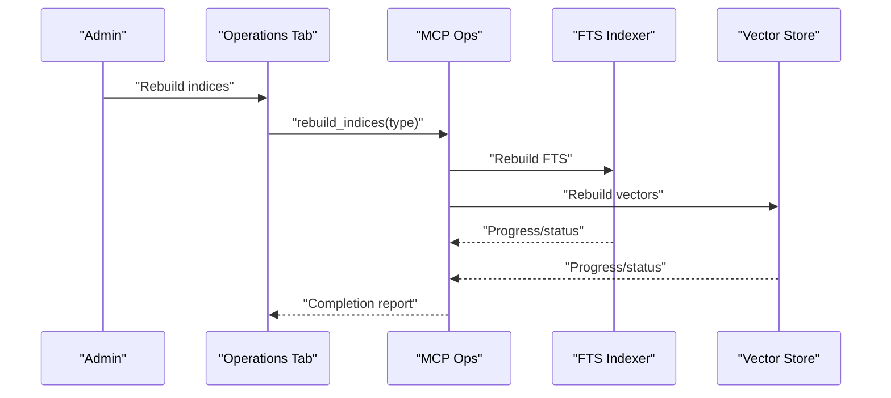

**Diagram sources**
- [infra/fts.py](file://infra/fts.py)
- [infra/vector_store.py](file://infra/vector_store.py)
- [mcp_maintenance_ops.py](file://mcp_maintenance_ops.py)

**Section sources**
- [infra/fts.py](file://infra/fts.py)
- [infra/vector_store.py](file://infra/vector_store.py)
- [mcp_maintenance_ops.py](file://mcp_maintenance_ops.py)

### Security Administration
- Purpose: Manage users, roles, and audit trails.
- Key elements:
  - Principal and role assignment.
  - Audit log ingestion and export.
  - Policy enforcement and tenant isolation.
- Implementation anchors:
  - RBAC, audit core, and sinks.

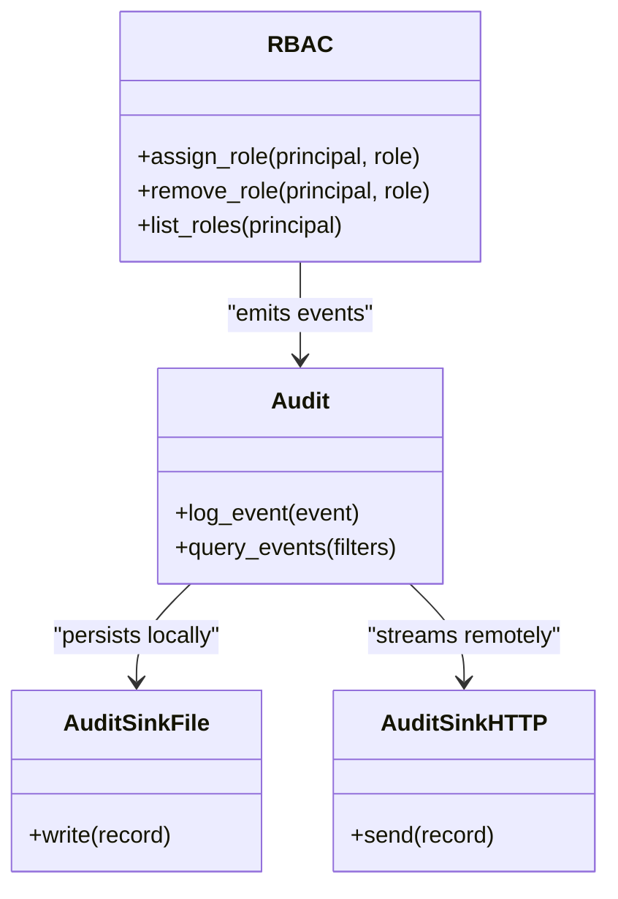

**Diagram sources**
- [infra/rbac.py](file://infra/rbac.py)
- [infra/audit.py](file://infra/audit.py)
- [infra/audit_sink_file.py](file://infra/audit_sink_file.py)
- [infra/audit_sink_http.py](file://infra/audit_sink_http.py)

**Section sources**
- [infra/rbac.py](file://infra/rbac.py)
- [infra/audit.py](file://infra/audit.py)
- [infra/audit_sink_file.py](file://infra/audit_sink_file.py)
- [infra/audit_sink_http.py](file://infra/audit_sink_http.py)

### Backup and Restore
- Purpose: Create backups, validate integrity, and plan restores.
- Key elements:
  - Scheduled backup jobs.
  - Validation of backup artifacts.
  - Restore procedures and verification.
- Implementation anchors:
  - Backup cron jobs and validation.

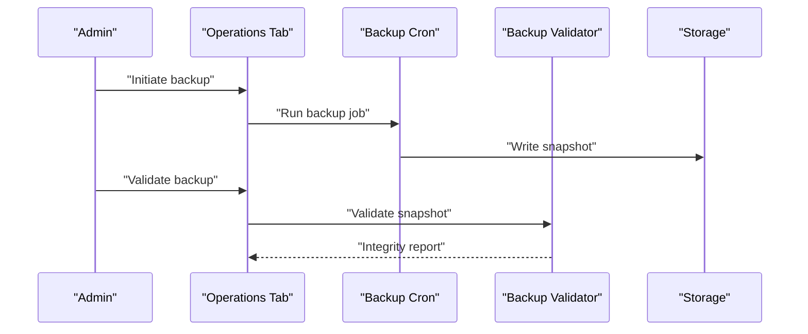

**Diagram sources**
- [cron/cron_backup.py](file://cron/cron_backup.py)
- [cron/cron_backup_validate.py](file://cron/cron_backup_validate.py)

**Section sources**
- [cron/cron_backup.py](file://cron/cron_backup.py)
- [cron/cron_backup_validate.py](file://cron/cron_backup_validate.py)

### Disaster Recovery Procedures
- Purpose: Outline steps to recover from failures using backups and consistent snapshots.
- Key elements:
  - Identify failure scope (data vs. index).
  - Restore data from validated backups.
  - Rebuild indices post-restore.
  - Validate consistency and resume operations.
- Implementation anchors:
  - Backup validation and index rebuild utilities.

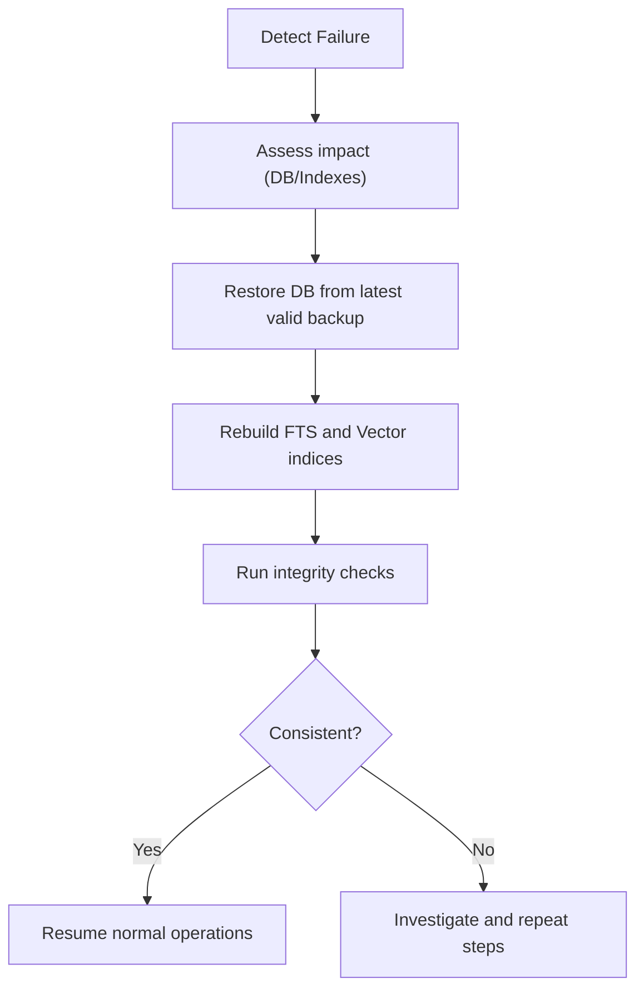

[No sources needed since this section provides procedural guidance]

### System Updates
- Purpose: Manage application updates and ensure compatibility with schema and dependencies.
- Key elements:
  - Review pending migrations before update.
  - Rollback strategy and safety checks.
  - Post-update verification and health checks.
- Implementation anchors:
  - Migration runner and maintenance checks.

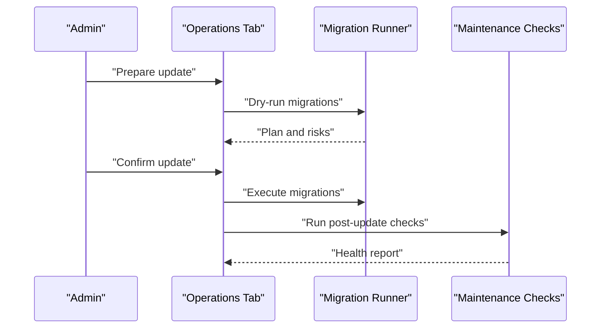

**Diagram sources**
- [infra/db_migrations.py](file://infra/db_migrations.py)
- [agentic_memory/maintenance.py](file://agentic_memory/maintenance.py)

**Section sources**
- [infra/db_migrations.py](file://infra/db_migrations.py)
- [agentic_memory/maintenance.py](file://agentic_memory/maintenance.py)

## Dependency Analysis
The Operations tab depends on MCP tools for safe operations, which in turn coordinate with scheduler, workers, DB, and indexers. Security and audit layers provide governance and traceability.

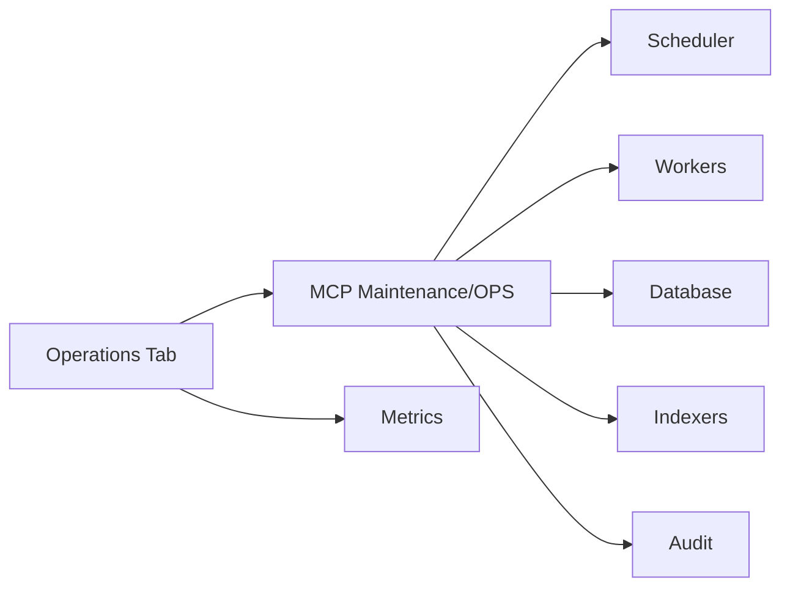

**Diagram sources**
- [tab_operations.py](file://dashboard/tab_operations.py)
- [mcp_maintenance.py](file://mcp_maintenance.py)
- [mcp_maintenance_ops.py](file://mcp_maintenance_ops.py)
- [cron/scheduler.py](file://cron/scheduler.py)
- [background_worker.py](file://background/background_worker.py)
- [infra/db.py](file://infra/db.py)
- [infra/fts.py](file://infra/fts.py)
- [infra/vector_store.py](file://infra/vector_store.py)
- [infra/audit.py](file://infra/audit.py)
- [infra/metrics_server.py](file://infra/metrics_server.py)

**Section sources**
- [tab_operations.py](file://dashboard/tab_operations.py)
- [mcp_maintenance.py](file://mcp_maintenance.py)
- [mcp_maintenance_ops.py](file://mcp_maintenance_ops.py)
- [cron/scheduler.py](file://cron/scheduler.py)
- [background_worker.py](file://background/background_worker.py)
- [infra/db.py](file://infra/db.py)
- [infra/fts.py](file://infra/fts.py)
- [infra/vector_store.py](file://infra/vector_store.py)
- [infra/audit.py](file://infra/audit.py)
- [infra/metrics_server.py](file://infra/metrics_server.py)

## Performance Considerations
- Tune worker concurrency and queue depths based on workload patterns.
- Use batch sizes appropriate for index rebuilds to avoid excessive memory pressure.
- Monitor metrics for latency spikes and adjust thresholds accordingly.
- Schedule heavy maintenance during off-peak hours to minimize impact.

[No sources needed since this section provides general guidance]

## Troubleshooting Guide
- Background jobs stuck:
  - Inspect queue monitor and timeout policies.
  - Restart workers and review fleet entries.
- Index rebuild failures:
  - Validate storage availability and permissions.
  - Re-run with reduced concurrency and check logs.
- DB migration issues:
  - Dry-run migrations and review planned changes.
  - Ensure consistent schema version before proceeding.
- Audit gaps:
  - Verify sink connectivity and disk space.
  - Confirm principal identity mapping and tenant scoping.

**Section sources**
- [cron/monitor_task_queue.py](file://cron/monitor_task_queue.py)
- [cron/manage_task_timeouts.py](file://cron/manage_task_timeouts.py)
- [background/daemon.py](file://background/daemon.py)
- [background/fleet_entry.py](file://background/fleet_entry.py)
- [infra/fts.py](file://infra/fts.py)
- [infra/vector_store.py](file://infra/vector_store.py)
- [infra/db_migrations.py](file://infra/db_migrations.py)
- [infra/audit_sink_file.py](file://infra/audit_sink_file.py)
- [infra/audit_sink_http.py](file://infra/audit_sink_http.py)

## Conclusion
The Operations and Administration tab centralizes control over background jobs, task queues, scheduled jobs, workers, resources, performance tuning, maintenance, database and index operations, security administration, backups, disaster recovery, and system updates. By leveraging MCP tools and well-defined subsystems, administrators can maintain system health, enforce security policies, and execute safe operational changes with clear visibility and auditability.

[No sources needed since this section summarizes without analyzing specific files]

## Appendices
- Quick references:
  - Background worker configuration keys and defaults.
  - Cron job registry and common operations.
  - RBAC roles and principal management actions.
  - Backup retention and validation criteria.

[No sources needed since this section provides general guidance]