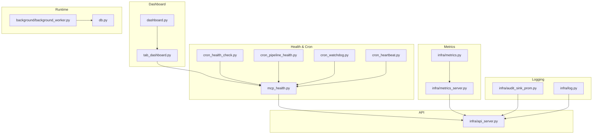
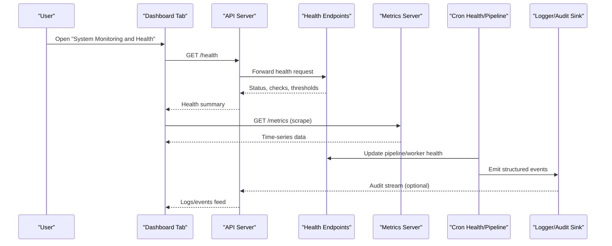
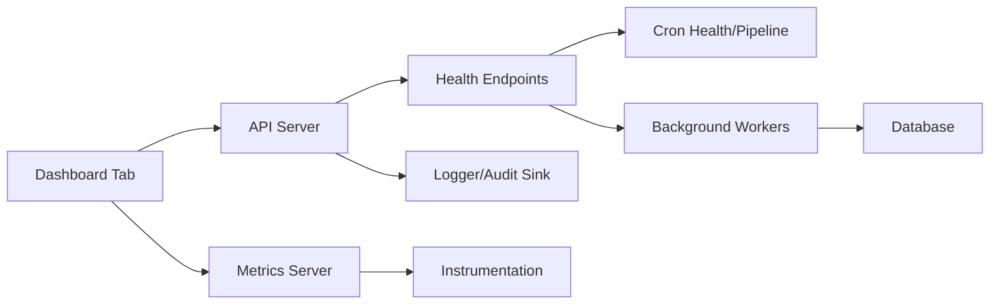

# System Monitoring and Health

<cite>
**Referenced Files in This Document**
- [dashboard.py](file://dashboard.py)
- [tab_dashboard.py](file://dashboard/tab_dashboard.py)
- [mcp_health.py](file://mcp_health.py)
- [cron_health_check.py](file://cron/cron_health_check.py)
- [metrics.py](file://infra/metrics.py)
- [metrics_server.py](file://infra/metrics_server.py)
- [api_server.py](file://infra/api_server.py)
- [log.py](file://infra/log.py)
- [audit_sink_prom.py](file://infra/audit_sink_prom.py)
- [cron_pipeline_health.py](file://cron/cron_pipeline_health.py)
- [cron_watchdog.py](file://cron/cron_watchdog.py)
- [cron_heartbeat.py](file://cron/cron_heartbeat.py)
- [background_worker.py](file://background/background_worker.py)
- [db.py](file://db.py)
</cite>

## Table of Contents
1. [Introduction](#introduction)
2. [Project Structure](#project-structure)
3. [Core Components](#core-components)
4. [Architecture Overview](#architecture-overview)
5. [Detailed Component Analysis](#detailed-component-analysis)
6. [Dependency Analysis](#dependency-analysis)
7. [Performance Considerations](#performance-considerations)
8. [Troubleshooting Guide](#troubleshooting-guide)
9. [Conclusion](#conclusion)
10. [Appendices](#appendices)

## Introduction
This document explains the system monitoring and health dashboard tab, focusing on real-time metrics visualization (CPU usage, memory consumption, database performance, network activity), health check indicators, alert thresholds, and status monitoring. It also covers interpreting performance charts, identifying bottlenecks, troubleshooting issues, log viewing, error tracking, diagnostic tools, metric retention policies, data export options, and integration with external monitoring systems.

## Project Structure
The monitoring and health features span several modules:
- Dashboard UI and tabs for operational views
- Health checks via MCP endpoints and cron jobs
- Metrics collection and exposition
- Logging and audit sinks including Prometheus-compatible output
- Background workers and watchdogs that influence system health signals

**Diagram sources**
- [dashboard.py](file://dashboard.py)
- [tab_dashboard.py](file://dashboard/tab_dashboard.py)
- [mcp_health.py](file://mcp_health.py)
- [cron/cron_health_check.py](file://cron/cron_health_check.py)
- [cron/cron_pipeline_health.py](file://cron/cron_pipeline_health.py)
- [cron/cron_watchdog.py](file://cron/cron_watchdog.py)
- [cron/cron_heartbeat.py](file://cron/cron_heartbeat.py)
- [infra/metrics.py](file://infra/metrics.py)
- [infra/metrics_server.py](file://infra/metrics_server.py)
- [infra/api_server.py](file://infra/api_server.py)
- [infra/log.py](file://infra/log.py)
- [infra/audit_sink_prom.py](file://infra/audit_sink_prom.py)
- [background/background_worker.py](file://background/background_worker.py)
- [db.py](file://db.py)

**Section sources**
- [dashboard.py](file://dashboard.py)
- [tab_dashboard.py](file://dashboard/tab_dashboard.py)
- [mcp_health.py](file://mcp_health.py)
- [cron/cron_health_check.py](file://cron/cron_health_check.py)
- [infra/metrics.py](file://infra/metrics.py)
- [infra/metrics_server.py](file://infra/metrics_server.py)
- [infra/api_server.py](file://infra/api_server.py)
- [infra/log.py](file://infra/log.py)
- [infra/audit_sink_prom.py](file://infra/audit_sink_prom.py)
- [cron/cron_pipeline_health.py](file://cron/cron_pipeline_health.py)
- [cron/cron_watchdog.py](file://cron/cron_watchdog.py)
- [cron/cron_heartbeat.py](file://cron/cron_heartbeat.py)
- [background/background_worker.py](file://background/background_worker.py)
- [db.py](file://db.py)

## Core Components
- Dashboard tab: Provides a unified view of system health, recent logs, and key metrics. It consumes health endpoints and metrics to render charts and status indicators.
- Health checks: Exposed via MCP and cron-based routines to validate service readiness, dependency liveness, and pipeline health.
- Metrics subsystem: Collects process-level and application-level metrics and exposes them over HTTP for scraping by dashboards or external systems.
- Logging and audit: Centralized logging with optional Prometheus-compatible audit sink for exporting structured events.
- Background workers and watchdogs: Influence CPU/memory usage and provide heartbeat signals used by health checks.

Key responsibilities:
- Real-time visualization of CPU, memory, DB latency, and network throughput
- Health indicators for services, queues, and background tasks
- Alerting thresholds surfaced in the UI and/or exported as metrics
- Log streaming and filtering for diagnostics
- Export and integration points for external monitoring stacks

**Section sources**
- [tab_dashboard.py](file://dashboard/tab_dashboard.py)
- [mcp_health.py](file://mcp_health.py)
- [infra/metrics.py](file://infra/metrics.py)
- [infra/metrics_server.py](file://infra/metrics_server.py)
- [infra/log.py](file://infra/log.py)
- [infra/audit_sink_prom.py](file://infra/audit_sink_prom.py)
- [cron/cron_health_check.py](file://cron/cron_health_check.py)
- [cron/cron_pipeline_health.py](file://cron/cron_pipeline_health.py)
- [cron/cron_watchdog.py](file://cron/cron_watchdog.py)
- [cron/cron_heartbeat.py](file://cron/cron_heartbeat.py)
- [background/background_worker.py](file://background/background_worker.py)
- [db.py](file://db.py)

## Architecture Overview
The dashboard tab aggregates health and metrics from internal endpoints and cron-driven collectors. The metrics server exposes time-series data; the API server routes requests; health checks validate dependencies; logging provides traceability.

**Diagram sources**
- [tab_dashboard.py](file://dashboard/tab_dashboard.py)
- [infra/api_server.py](file://infra/api_server.py)
- [mcp_health.py](file://mcp_health.py)
- [infra/metrics_server.py](file://infra/metrics_server.py)
- [cron/cron_health_check.py](file://cron/cron_health_check.py)
- [cron/cron_pipeline_health.py](file://cron/cron_pipeline_health.py)
- [infra/log.py](file://infra/log.py)
- [infra/audit_sink_prom.py](file://infra/audit_sink_prom.py)

## Detailed Component Analysis

### Dashboard Tab: Real-Time Metrics Visualization
- Visualizes CPU usage, memory consumption, database performance, and network activity using time-series data from the metrics server.
- Displays health indicators derived from health endpoints and cron-updated states.
- Provides filters and refresh controls to focus on relevant time windows.

Interpretation guidance:
- CPU spikes often correlate with search indexing, embedding recomputation, or heavy background tasks.
- Memory growth may indicate unbounded caches or long-running tasks without cleanup.
- Database latency increases can signal lock contention, slow queries, or WAL pressure.
- Network activity spikes may reflect sync operations or external calls.

Bottleneck identification:
- Cross-correlate CPU/memory with DB latency and queue depth to isolate hotspots.
- Use log timestamps to align anomalies with specific operations.

**Section sources**
- [tab_dashboard.py](file://dashboard/tab_dashboard.py)
- [infra/metrics_server.py](file://infra/metrics_server.py)
- [mcp_health.py](file://mcp_health.py)

### Health Check Indicators and Alert Thresholds
- Health endpoints aggregate component statuses (service, DB, queues, pipelines).
- Cron jobs periodically update pipeline health and worker liveness.
- Thresholds are surfaced as part of health responses and metrics for alerting.

Operational notes:
- Degraded states typically show warnings; critical failures show errors.
- Heartbeat signals help detect stalled workers or deadlocks.

**Section sources**
- [mcp_health.py](file://mcp_health.py)
- [cron/cron_health_check.py](file://cron/cron_health_check.py)
- [cron/cron_pipeline_health.py](file://cron/cron_pipeline_health.py)
- [cron/cron_watchdog.py](file://cron/cron_watchdog.py)
- [cron/cron_heartbeat.py](file://cron/cron_heartbeat.py)

### Metrics Collection and Exposition
- Application metrics include process stats, DB performance, and custom counters/gauges.
- Metrics server exposes an endpoint suitable for scraping by dashboards or external systems.
- Retention is governed by the metrics backend configuration and scrape cadence.

Export and integration:
- For Prometheus-style setups, configure a scraper to pull from the metrics endpoint.
- Audit sink supports Prometheus-compatible output for selected events.

**Section sources**
- [infra/metrics.py](file://infra/metrics.py)
- [infra/metrics_server.py](file://infra/metrics_server.py)
- [infra/audit_sink_prom.py](file://infra/audit_sink_prom.py)

### Logging, Error Tracking, and Diagnostics
- Centralized logging captures structured events, errors, and audit trails.
- The dashboard tab streams recent logs and allows filtering by severity and source.
- Diagnostic tools include health summaries, pipeline status, and worker heartbeats.

Best practices:
- Correlate log entries with metric spikes using timestamps.
- Use audit sink exports to analyze trends outside the app.

**Section sources**
- [infra/log.py](file://infra/log.py)
- [infra/audit_sink_prom.py](file://infra/audit_sink_prom.py)
- [tab_dashboard.py](file://dashboard/tab_dashboard.py)

### Background Workers and Watchdogs
- Background workers perform periodic tasks that impact resource utilization.
- Watchdogs monitor task lifecycles and report anomalies.
- Heartbeat cron ensures timely updates for liveness checks.

Troubleshooting tips:
- If CPU/memory remain high, inspect worker queues and task durations.
- Stalled heartbeats suggest blocked tasks or resource starvation.

**Section sources**
- [background/background_worker.py](file://background/background_worker.py)
- [cron/cron_watchdog.py](file://cron/cron_watchdog.py)
- [cron/cron_heartbeat.py](file://cron/cron_heartbeat.py)

### Database Performance Monitoring
- Monitor query latency, connection pool saturation, and write journal throughput.
- Sudden latency increases often indicate schema changes, missing indexes, or heavy compactions.

Diagnostics:
- Compare DB latency with background job schedules.
- Review WAL and checkpoint behavior during peak loads.

**Section sources**
- [db.py](file://db.py)
- [infra/metrics.py](file://infra/metrics.py)

## Dependency Analysis
The dashboard depends on health endpoints and metrics; health endpoints depend on cron-driven state and runtime components; metrics depend on instrumentation throughout the system; logging integrates with audit sinks.

**Diagram sources**
- [tab_dashboard.py](file://dashboard/tab_dashboard.py)
- [infra/api_server.py](file://infra/api_server.py)
- [mcp_health.py](file://mcp_health.py)
- [cron/cron_health_check.py](file://cron/cron_health_check.py)
- [cron/cron_pipeline_health.py](file://cron/cron_pipeline_health.py)
- [background/background_worker.py](file://background/background_worker.py)
- [infra/metrics_server.py](file://infra/metrics_server.py)
- [infra/metrics.py](file://infra/metrics.py)
- [infra/log.py](file://infra/log.py)
- [infra/audit_sink_prom.py](file://infra/audit_sink_prom.py)
- [db.py](file://db.py)

**Section sources**
- [tab_dashboard.py](file://dashboard/tab_dashboard.py)
- [infra/api_server.py](file://infra/api_server.py)
- [mcp_health.py](file://mcp_health.py)
- [cron/cron_health_check.py](file://cron/cron_health_check.py)
- [cron/cron_pipeline_health.py](file://cron/cron_pipeline_health.py)
- [background/background_worker.py](file://background/background_worker.py)
- [infra/metrics_server.py](file://infra/metrics_server.py)
- [infra/metrics.py](file://infra/metrics.py)
- [infra/log.py](file://infra/log.py)
- [infra/audit_sink_prom.py](file://infra/audit_sink_prom.py)
- [db.py](file://db.py)

## Performance Considerations
- Scrape cadence vs. storage: Higher frequency improves resolution but increases load.
- Metric cardinality: Avoid excessive label dimensions to prevent growth.
- Log rotation and sampling: Balance detail with disk usage.
- Worker scheduling: Spread heavy tasks to avoid contention with user-facing operations.

[No sources needed since this section provides general guidance]

## Troubleshooting Guide
Common symptoms and actions:
- High CPU: Identify heavy jobs via worker logs and pause non-critical tasks if necessary.
- Memory leaks: Look for growing gauges and restart affected components after investigation.
- DB latency spikes: Check for long transactions, lock waits, and index usage.
- Network anomalies: Inspect sync traffic and external call rates.
- Health degraded: Review cron outputs and heartbeat staleness.

Diagnostic steps:
- Pull recent logs filtered by severity and module.
- Export metrics for offline analysis.
- Validate health endpoints directly to isolate UI issues.

**Section sources**
- [infra/log.py](file://infra/log.py)
- [infra/metrics_server.py](file://infra/metrics_server.py)
- [mcp_health.py](file://mcp_health.py)
- [cron/cron_health_check.py](file://cron/cron_health_check.py)
- [cron/cron_pipeline_health.py](file://cron/cron_pipeline_health.py)
- [cron/cron_watchdog.py](file://cron/cron_watchdog.py)
- [cron/cron_heartbeat.py](file://cron/cron_heartbeat.py)
- [background/background_worker.py](file://background/background_worker.py)
- [db.py](file://db.py)

## Conclusion
The monitoring and health dashboard consolidates real-time metrics, health indicators, and logs into a single operational view. By understanding how health checks, metrics, and logs interoperate, operators can quickly identify bottlenecks, tune thresholds, and integrate with external monitoring systems for comprehensive observability.

[No sources needed since this section summarizes without analyzing specific files]

## Appendices

### Interpreting Performance Charts
- CPU: Correlate with background job schedules and search/indexing phases.
- Memory: Track steady-state levels and sudden jumps indicating cache growth or leaks.
- DB latency: Watch for sustained increases during compaction or heavy writes.
- Network: Peaks often align with sync or external integrations.

[No sources needed since this section provides general guidance]

### Alert Thresholds and Policies
- Define per-metric thresholds for warning and critical states.
- Surface thresholds in health responses and metrics labels for consistent alerting.
- Combine multiple signals (e.g., latency + error rate) to reduce false positives.

[No sources needed since this section provides general guidance]

### Metric Retention and Data Export
- Retention is controlled by the metrics backend and scrape strategy.
- Use the metrics endpoint for scraping by external systems.
- Export audit events via the Prometheus-compatible sink when available.

**Section sources**
- [infra/metrics_server.py](file://infra/metrics_server.py)
- [infra/audit_sink_prom.py](file://infra/audit_sink_prom.py)

### Integration with External Monitoring Systems
- Configure scrapers to pull from the metrics endpoint at appropriate intervals.
- Map health status to alert rules based on threshold breaches.
- Route audit events to SIEM or analytics platforms via the audit sink.

**Section sources**
- [infra/metrics_server.py](file://infra/metrics_server.py)
- [infra/audit_sink_prom.py](file://infra/audit_sink_prom.py)