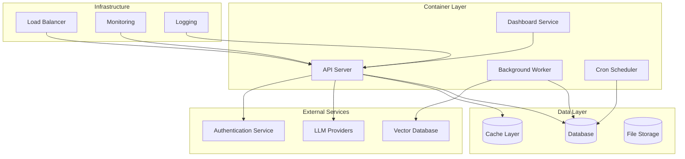
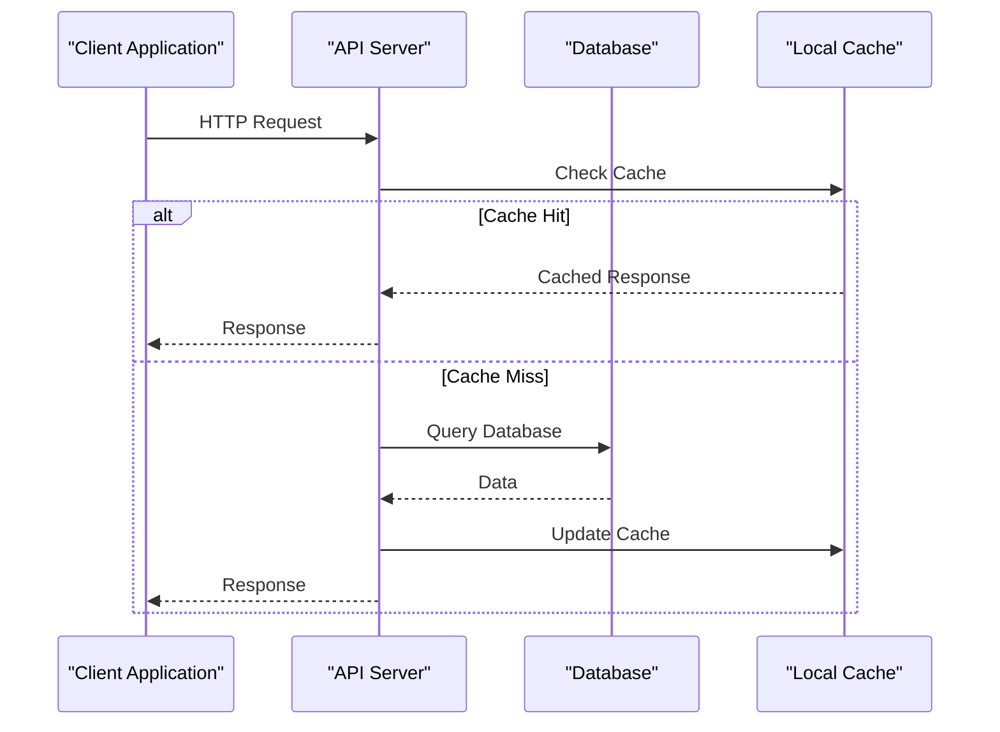
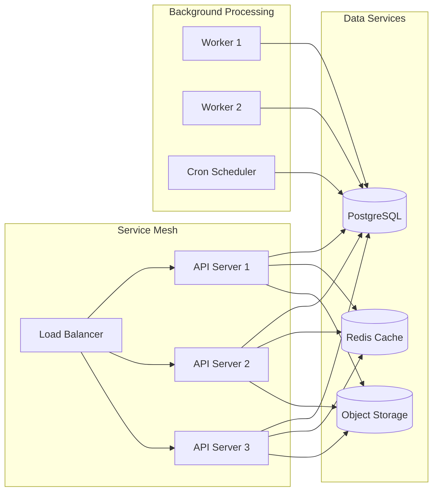
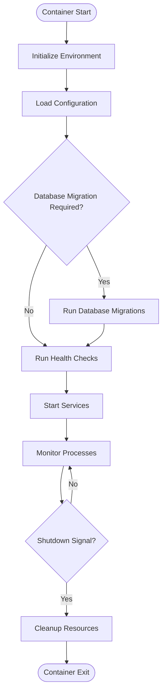
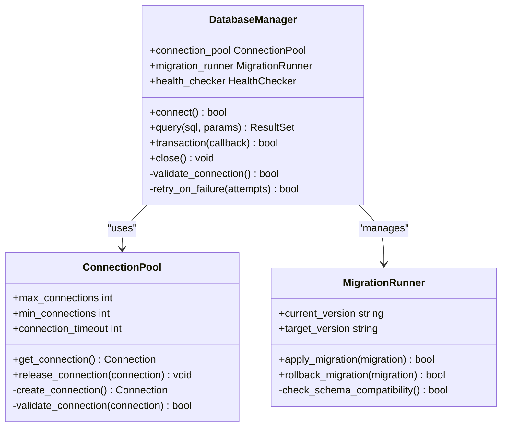
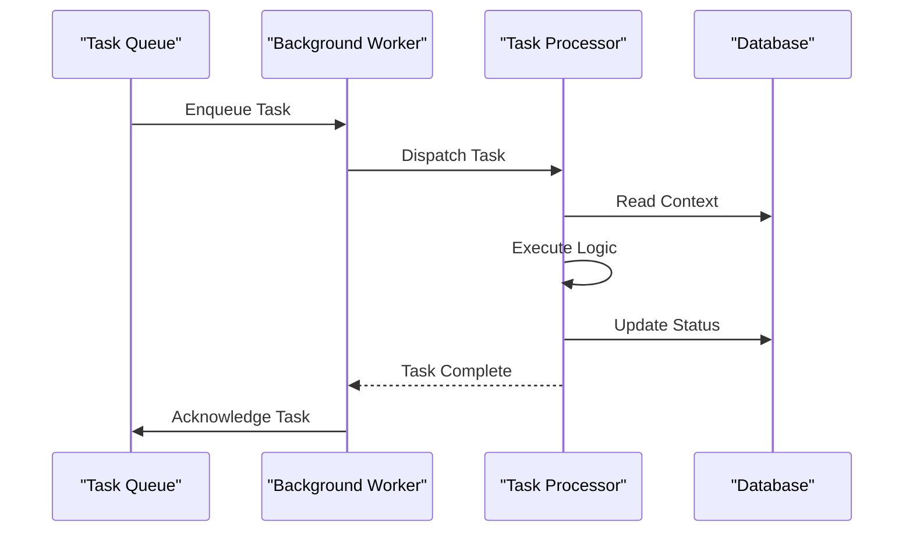
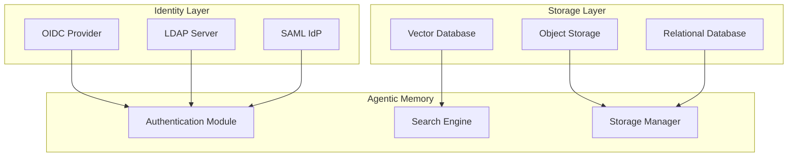

# Deployment Strategies

<cite>
**Referenced Files in This Document**
- [Dockerfile](file://Dockerfile)
- [docker-compose.yml](file://docker-compose.yml)
- [docker/README.md](file://docker/README.md)
- [docker/entrypoint.sh](file://docker/entrypoint.sh)
- [docker/cron_runner.py](file://docker/cron_runner.py)
- [memory.toml](file://memory.toml)
- [docs/self-hosting.md](file://docs/self-hosting.md)
- [infra/api_server.py](file://infra/api_server.py)
- [infra/config.py](file://infra/config.py)
- [infra/db.py](file://infra/db.py)
- [cron/scheduler.py](file://cron/scheduler.py)
- [background/daemon.py](file://background/daemon.py)
- [scripts/start_services.sh](file://scripts/start_services.sh)
</cite>

## Table of Contents
1. [Introduction](#introduction)
2. [Project Structure](#project-structure)
3. [Core Components](#core-components)
4. [Architecture Overview](#architecture-overview)
5. [Detailed Component Analysis](#detailed-component-analysis)
6. [Dependency Analysis](#dependency-analysis)
7. [Performance Considerations](#performance-considerations)
8. [Troubleshooting Guide](#troubleshooting-guide)
9. [Conclusion](#conclusion)
10. [Appendices](#appendices)

## Introduction

Agentic Memory is a sophisticated memory management system designed for AI agents, providing persistent knowledge storage, retrieval, and coordination capabilities. This deployment guide covers comprehensive strategies for containerizing, orchestrating, and deploying Agentic Memory across various environments including single-instance setups, multi-container deployments, Kubernetes clusters, cloud providers, and on-premises installations.

The system supports multiple deployment patterns ranging from development environments to production-grade high-availability configurations, with built-in support for database persistence, external service dependencies, security hardening, and disaster recovery procedures.

## Project Structure

The Agentic Memory deployment architecture consists of several key components organized in a modular fashion:



**Diagram sources**
- [docker-compose.yml:1-50](file://docker-compose.yml#L1-L50)
- [infra/api_server.py:1-100](file://infra/api_server.py#L1-L100)
- [infra/db.py:1-50](file://infra/db.py#L1-L50)

**Section sources**
- [Dockerfile:1-100](file://Dockerfile#L1-L100)
- [docker-compose.yml:1-200](file://docker-compose.yml#L1-L200)
- [docker/README.md:1-100](file://docker/README.md#L1-L100)

## Core Components

### Container Architecture

The system is designed around a microservices architecture with clear separation of concerns:

- **API Server**: Handles HTTP requests, authentication, and business logic
- **Background Workers**: Process asynchronous tasks, embeddings, and maintenance operations  
- **Cron Scheduler**: Manages scheduled tasks like backups, cleanup, and analytics
- **Dashboard**: Provides web-based administration interface

### Configuration Management

Configuration is managed through TOML files and environment variables, supporting different deployment profiles:

- **Development**: Local development with minimal dependencies
- **Staging**: Pre-production testing environment
- **Production**: High-availability configuration with monitoring and logging

**Section sources**
- [memory.toml:1-200](file://memory.toml#L1-L200)
- [infra/config.py:1-150](file://infra/config.py#L1-L150)
- [docs/self-hosting.md:1-100](file://docs/self-hosting.md#L1-L100)

## Architecture Overview

### Single Instance Deployment

The simplest deployment pattern runs all services within a single container or process:



**Diagram sources**
- [infra/api_server.py:1-200](file://infra/api_server.py#L1-L200)
- [infra/db.py:1-100](file://infra/db.py#L1-L100)

### Multi-Container Orchestration

For production deployments, services are separated into independent containers orchestrated by Docker Compose or Kubernetes:



**Diagram sources**
- [docker-compose.yml:1-300](file://docker-compose.yml#L1-L300)
- [infra/api_server.py:1-100](file://infra/api_server.py#L1-L100)

## Detailed Component Analysis

### Docker Containerization

The Docker setup provides a complete runtime environment with optimized layers for different deployment scenarios:

#### Base Image Strategy

The containerization uses a multi-stage build approach to minimize image size and improve security:

- **Build Stage**: Compiles dependencies and assets
- **Runtime Stage**: Contains only necessary runtime components
- **Development Stage**: Includes debugging tools and development dependencies

#### Container Entrypoint

The entrypoint script handles initialization, health checks, and graceful shutdown:



**Diagram sources**
- [docker/entrypoint.sh:1-200](file://docker/entrypoint.sh#L1-L200)
- [docker/cron_runner.py:1-100](file://docker/cron_runner.py#L1-L100)

**Section sources**
- [Dockerfile:1-150](file://Dockerfile#L1-L150)
- [docker/entrypoint.sh:1-200](file://docker/entrypoint.sh#L1-L200)
- [docker/cron_runner.py:1-100](file://docker/cron_runner.py#L1-L100)

### Database Configuration

The system supports multiple database backends with automatic migration handling:

#### Supported Databases

- **SQLite**: Development and single-instance deployments
- **PostgreSQL**: Production deployments with advanced features
- **MySQL**: Alternative relational database support

#### Connection Management

Database connections are managed through connection pooling with automatic retry logic:



**Diagram sources**
- [infra/db.py:1-200](file://infra/db.py#L1-L200)
- [infra/db_migrations.py:1-150](file://infra/db_migrations.py#L1-L150)

**Section sources**
- [infra/db.py:1-200](file://infra/db.py#L1-L200)
- [infra/db_migrations.py:1-150](file://infra/db_migrations.py#L1-L150)

### Background Task Processing

The background processing system handles long-running tasks asynchronously:

#### Worker Architecture

Workers process tasks from a distributed queue with automatic scaling and failure recovery:



**Diagram sources**
- [background/daemon.py:1-200](file://background/daemon.py#L1-L200)
- [background/background_worker.py:1-150](file://background/background_worker.py#L1-L150)

**Section sources**
- [background/daemon.py:1-200](file://background/daemon.py#L1-L200)
- [background/background_worker.py:1-150](file://background/background_worker.py#L1-L150)

### Scheduled Tasks

The cron scheduler manages periodic maintenance and analytics tasks:

#### Task Categories

- **Maintenance**: Database optimization, cleanup, backup validation
- **Analytics**: Usage metrics, performance monitoring, trend analysis
- **Integration**: External service synchronization, webhook processing
- **Health**: System health checks, dependency verification

**Section sources**
- [cron/scheduler.py:1-200](file://cron/scheduler.py#L1-L200)
- [cron/jobs.py:1-300](file://cron/jobs.py#L1-L300)

## Dependency Analysis

### External Service Dependencies

The system integrates with several external services that require careful configuration:

#### Authentication Services

- **OAuth2/OIDC**: Enterprise authentication integration
- **LDAP/Active Directory**: Corporate identity management
- **SAML**: Enterprise SSO support

#### Vector Databases

- **Chroma**: Built-in vector search for small deployments
- **Pinecone**: Cloud-native vector database
- **Weaviate**: Advanced vector search with filtering
- **Qdrant**: High-performance vector database

#### Object Storage

- **S3**: AWS S3 compatible storage
- **MinIO**: Self-hosted object storage
- **Azure Blob**: Microsoft Azure storage



**Diagram sources**
- [infra/config.py:1-200](file://infra/config.py#L1-L200)
- [infra/authlib_sso.py:1-150](file://infra/authlib_sso.py#L1-L150)

**Section sources**
- [infra/config.py:1-200](file://infra/config.py#L1-L200)
- [infra/authlib_sso.py:1-150](file://infra/authlib_sso.py#L1-L150)

### Network Configuration

Network topology varies significantly between deployment environments:

#### Development Networks

- **Bridge Networks**: Isolated container networking
- **Host Networking**: Direct host access for development
- **Port Mapping**: Manual port exposure for debugging

#### Production Networks

- **Service Mesh**: Istio/Linkerd for traffic management
- **Ingress Controllers**: Nginx/Traefik for external access
- **Load Balancers**: HAProxy/ALB for high availability

**Section sources**
- [docker-compose.yml:1-300](file://docker-compose.yml#L1-L300)
- [scripts/start_services.sh:1-100](file://scripts/start_services.sh#L1-L100)

## Performance Considerations

### Resource Allocation

Optimal resource allocation depends on workload characteristics:

#### CPU Requirements

- **API Server**: 2-4 cores per instance for moderate load
- **Background Workers**: Scale horizontally based on task volume
- **Cron Scheduler**: Minimal resources (1 core sufficient)

#### Memory Configuration

- **Base Memory**: 2GB minimum for stable operation
- **Cache Size**: Allocate 25-50% of available memory for caching
- **Connection Pools**: Tune based on concurrent request volume

#### Storage Performance

- **Database**: SSD storage recommended for production
- **Vector Indexes**: Separate fast storage for embedding indexes
- **Backup Storage**: Cost-effective storage for historical data

### Scaling Strategies

#### Horizontal Scaling

- **Stateless API Servers**: Scale out behind load balancer
- **Worker Pools**: Auto-scale based on queue depth
- **Read Replicas**: Database read replicas for query-heavy workloads

#### Vertical Scaling

- **Memory Optimization**: Tune JVM/runtime settings
- **Connection Pooling**: Optimize database connections
- **Cache Tuning**: Adjust cache sizes based on usage patterns

**Section sources**
- [infra/metrics.py:1-150](file://infra/metrics.py#L1-L150)
- [infra/cache.py:1-200](file://infra/cache.py#L1-L200)

## Troubleshooting Guide

### Common Deployment Issues

#### Container Startup Failures

**Symptoms**: Containers crash immediately after startup
**Causes**: Missing environment variables, database connectivity issues, permission problems
**Resolution**: Check logs, verify configuration, validate permissions

#### Database Connection Problems

**Symptoms**: Connection timeouts, authentication failures, schema mismatches
**Causes**: Incorrect credentials, network policies, migration failures
**Resolution**: Verify connection strings, check firewall rules, run migrations manually

#### Performance Degradation

**Symptoms**: Slow response times, high memory usage, increased error rates
**Causes**: Insufficient resources, inefficient queries, cache misses
**Resolution**: Monitor metrics, optimize queries, adjust resource limits

### Monitoring and Observability

#### Health Checks

Implement comprehensive health checking for all components:

- **Liveness Probes**: Detect deadlocked processes
- **Readiness Probes**: Ensure service is ready to handle traffic
- **Startup Probes**: Allow time for initialization

#### Logging Strategy

Structured logging with correlation IDs for request tracing:

- **Application Logs**: Business logic and errors
- **Access Logs**: HTTP request/response tracking
- **Audit Logs**: Security and compliance events

**Section sources**
- [infra/log.py:1-200](file://infra/log.py#L1-L200)
- [infra/metrics.py:1-150](file://infra/metrics.py#L1-L150)

## Conclusion

Agentic Memory provides a robust, scalable platform for AI agent memory management with flexible deployment options. The containerized architecture supports everything from single-instance development environments to large-scale production deployments with high availability and disaster recovery capabilities.

Key deployment considerations include proper resource allocation, security hardening, monitoring setup, and backup strategies. The modular design allows for incremental adoption and customization based on specific organizational requirements.

## Appendices

### Quick Start Commands

#### Development Setup

```bash
# Clone repository
git clone https://github.com/agentic-memory/agentic-memory.git
cd agentic-memory

# Install dependencies
pip install -r requirements.txt

# Initialize database
python memory_bootstrap.py --init-db

# Start development server
python cli.py serve --dev
```

#### Docker Compose Deployment

```bash
# Start all services
docker-compose up -d

# View logs
docker-compose logs -f api-server

# Scale workers
docker-compose up -d --scale worker=3
```

### Configuration Reference

Environment variables and configuration files support extensive customization for different deployment scenarios. Refer to the configuration documentation for detailed parameter descriptions and default values.

**Section sources**
- [docs/self-hosting.md:1-200](file://docs/self-hosting.md#L1-L200)
- [memory.toml:1-300](file://memory.toml#L1-L300)