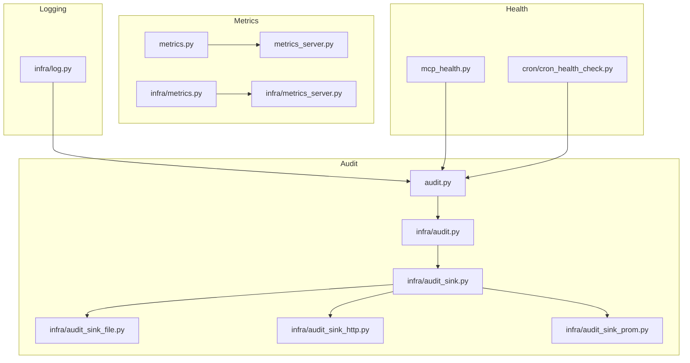
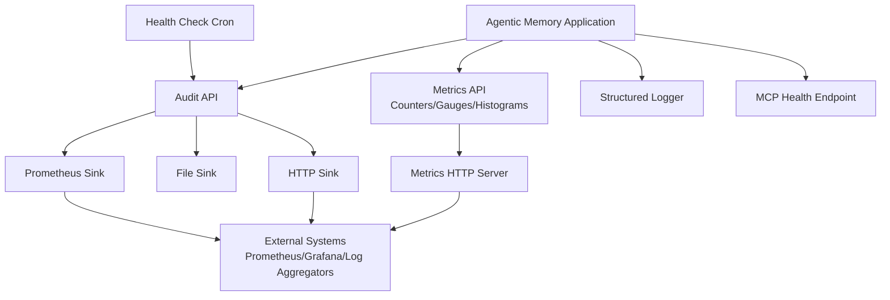
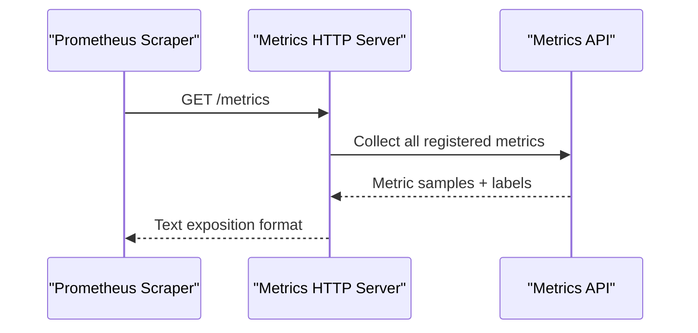
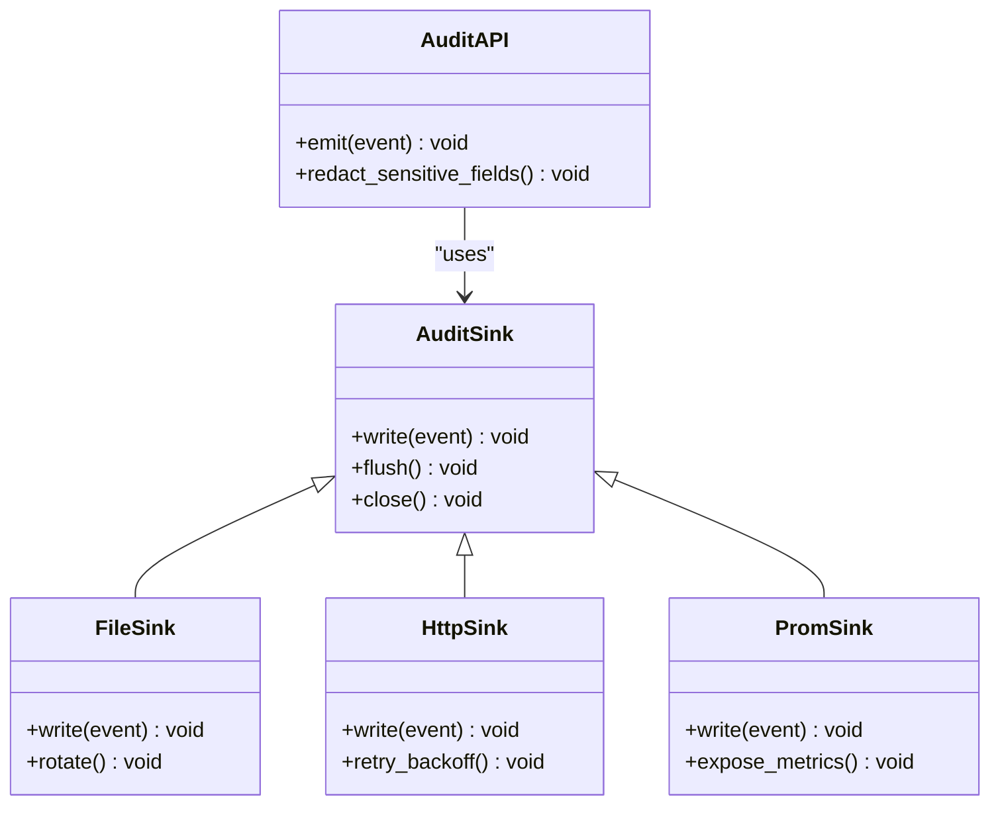
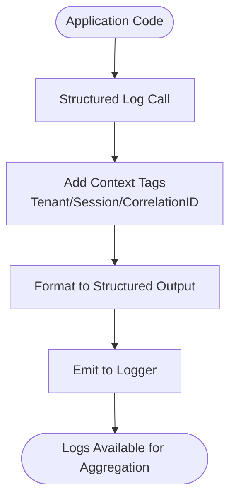
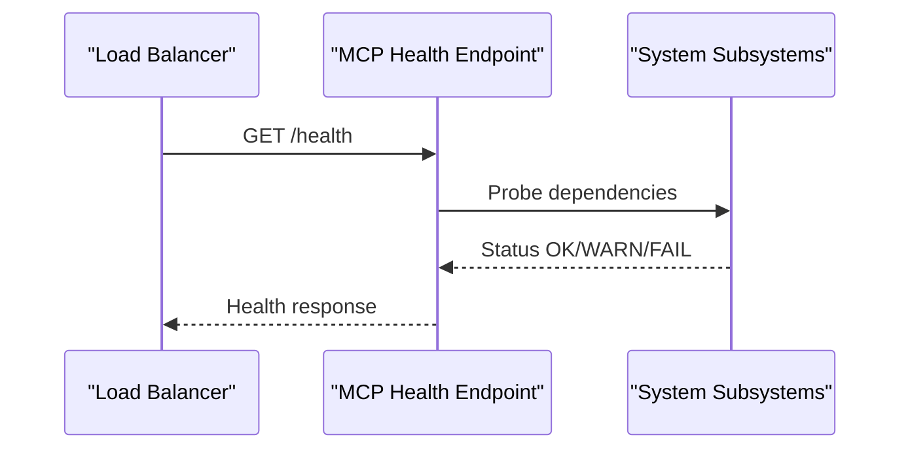
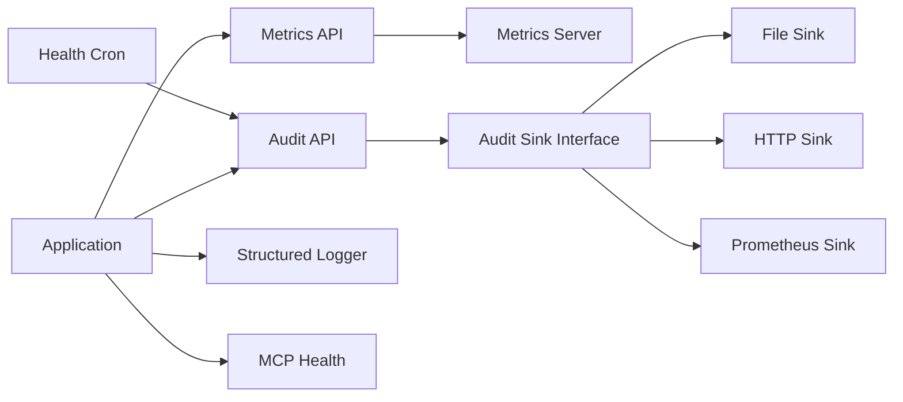

# Monitoring and Metrics

<cite>
**Referenced Files in This Document**
- [metrics.py](file://metrics.py)
- [metrics_server.py](file://metrics_server.py)
- [audit.py](file://audit.py)
- [infra/audit.py](file://infra/audit.py)
- [infra/audit_sink.py](file://infra/audit_sink.py)
- [infra/audit_sink_file.py](file://infra/audit_sink_file.py)
- [infra/audit_sink_http.py](file://infra/audit_sink_http.py)
- [infra/audit_sink_prom.py](file://infra/audit_sink_prom.py)
- [infra/log.py](file://infra/log.py)
- [cron/cron_health_check.py](file://cron/cron_health_check.py)
- [mcp_health.py](file://mcp_health.py)
- [mcp_metrics.py](file://mcp_metrics.py)
- [infra/metrics_server.py](file://infra/metrics_server.py)
- [infra/metrics.py](file://infra/metrics.py)
- [test_observability.py](file://test_observability.py)
- [test_audit_logging.py](file://test_audit_logging.py)
- [test_audit_sink_http.py](file://test_audit_sink_http.py)
- [test_audit_sink_dead_letter.py](file://test_audit_sink_dead_letter.py)
- [test_audit_sink_drops_on_5xx.py](file://test_audit_sink_drops_on_5xx.py)
- [test_audit_sink_principal_redact.py](file://test_audit_sink_principal_redact.py)
</cite>

## Table of Contents
1. [Introduction](#introduction)
2. [Project Structure](#project-structure)
3. [Core Components](#core-components)
4. [Architecture Overview](#architecture-overview)
5. [Detailed Component Analysis](#detailed-component-analysis)
6. [Dependency Analysis](#dependency-analysis)
7. [Performance Considerations](#performance-considerations)
8. [Troubleshooting Guide](#troubleshooting-guide)
9. [Conclusion](#conclusion)
10. [Appendices](#appendices)

## Introduction
This document explains monitoring and observability in Agentic Memory with a focus on:
- Built-in metrics server and metric collection
- Audit logging and sinks (file, HTTP, Prometheus)
- Health check endpoints and cron-based health checks
- Structured logging and log aggregation strategies
- Alerting guidance and interpreting system metrics
- Custom metric collection, performance profiling, and capacity planning
- Integration with external systems such as Prometheus and Grafana

The goal is to help operators and developers instrument, observe, and troubleshoot the system effectively.

## Project Structure
Observability-related code spans both top-level modules and the infra package:
- Metrics: top-level metrics module and server; infra equivalents for internal use
- Audit: core audit API and multiple sinks (file, HTTP, Prometheus)
- Logging: structured logger configuration
- Health: MCP health endpoint and cron-based health checker
- Tests: coverage for observability features and sinks

**Diagram sources**
- [metrics.py](file://metrics.py)
- [metrics_server.py](file://metrics_server.py)
- [infra/metrics.py](file://infra/metrics.py)
- [infra/metrics_server.py](file://infra/metrics_server.py)
- [audit.py](file://audit.py)
- [infra/audit.py](file://infra/audit.py)
- [infra/audit_sink.py](file://infra/audit_sink.py)
- [infra/audit_sink_file.py](file://infra/audit_sink_file.py)
- [infra/audit_sink_http.py](file://infra/audit_sink_http.py)
- [infra/audit_sink_prom.py](file://infra/audit_sink_prom.py)
- [infra/log.py](file://infra/log.py)
- [mcp_health.py](file://mcp_health.py)
- [cron/cron_health_check.py](file://cron/cron_health_check.py)

**Section sources**
- [metrics.py](file://metrics.py)
- [metrics_server.py](file://metrics_server.py)
- [infra/metrics.py](file://infra/metrics.py)
- [infra/metrics_server.py](file://infra/metrics_server.py)
- [audit.py](file://audit.py)
- [infra/audit.py](file://infra/audit.py)
- [infra/audit_sink.py](file://infra/audit_sink.py)
- [infra/audit_sink_file.py](file://infra/audit_sink_file.py)
- [infra/audit_sink_http.py](file://infra/audit_sink_http.py)
- [infra/audit_sink_prom.py](file://infra/audit_sink_prom.py)
- [infra/log.py](file://infra/log.py)
- [mcp_health.py](file://mcp_health.py)
- [cron/cron_health_check.py](file://cron/cron_health_check.py)

## Core Components
- Metrics API and Server
  - Top-level metrics module exposes counters, gauges, histograms, and labels for application KPIs.
  - The metrics server exposes an HTTP endpoint for scraping by external collectors.
  - Infra-level equivalents provide internal wiring and server lifecycle management.
- Audit Logging
  - Centralized audit API records security-relevant events with structured fields.
  - Multiple sinks support file-based storage, HTTP forwarding, and Prometheus exposition.
  - Sinks implement backpressure, retries, and redaction policies.
- Structured Logging
  - Logger configuration provides consistent JSON-like structure, correlation IDs, and contextual tags.
- Health Checks
  - MCP health endpoint returns service readiness/liveness.
  - Cron job periodically validates subsystem health and emits audit events.

**Section sources**
- [metrics.py](file://metrics.py)
- [metrics_server.py](file://metrics_server.py)
- [infra/metrics.py](file://infra/metrics.py)
- [infra/metrics_server.py](file://infra/metrics_server.py)
- [audit.py](file://audit.py)
- [infra/audit.py](file://infra/audit.py)
- [infra/audit_sink.py](file://infra/audit_sink.py)
- [infra/audit_sink_file.py](file://infra/audit_sink_file.py)
- [infra/audit_sink_http.py](file://infra/audit_sink_http.py)
- [infra/audit_sink_prom.py](file://infra/audit_sink_prom.py)
- [infra/log.py](file://infra/log.py)
- [mcp_health.py](file://mcp_health.py)
- [cron/cron_health_check.py](file://cron/cron_health_check.py)

## Architecture Overview
The observability architecture composes metrics, audit, logging, and health into a cohesive surface for internal and external consumers.

**Diagram sources**
- [metrics.py](file://metrics.py)
- [metrics_server.py](file://metrics_server.py)
- [infra/metrics.py](file://infra/metrics.py)
- [infra/metrics_server.py](file://infra/metrics_server.py)
- [audit.py](file://audit.py)
- [infra/audit.py](file://infra/audit.py)
- [infra/audit_sink.py](file://infra/audit_sink.py)
- [infra/audit_sink_file.py](file://infra/audit_sink_file.py)
- [infra/audit_sink_http.py](file://infra/audit_sink_http.py)
- [infra/audit_sink_prom.py](file://infra/audit_sink_prom.py)
- [infra/log.py](file://infra/log.py)
- [mcp_health.py](file://mcp_health.py)
- [cron/cron_health_check.py](file://cron/cron_health_check.py)

## Detailed Component Analysis

### Metrics API and Server
- Purpose
  - Provide application-level KPIs via counters, gauges, histograms, and labeled dimensions.
  - Expose a stable HTTP endpoint for Prometheus-style scraping.
- Key responsibilities
  - Define metric types and label schemas.
  - Increment counters and update gauges around critical paths.
  - Record latency distributions using histograms.
  - Serve metrics over HTTP for external scrapers.
- Configuration and lifecycle
  - Server binds to a configurable host/port and can be enabled/disabled.
  - Graceful shutdown ensures open connections are drained.
- Example usage patterns
  - Wrap request handlers to record request counts and latencies.
  - Track resource utilization (e.g., queue lengths, cache hit ratios).
  - Emit custom business metrics (e.g., memory saves per tenant).

**Diagram sources**
- [metrics_server.py](file://metrics_server.py)
- [metrics.py](file://metrics.py)
- [infra/metrics_server.py](file://infra/metrics_server.py)
- [infra/metrics.py](file://infra/metrics.py)

**Section sources**
- [metrics.py](file://metrics.py)
- [metrics_server.py](file://metrics_server.py)
- [infra/metrics.py](file://infra/metrics.py)
- [infra/metrics_server.py](file://infra/metrics_server.py)

### Audit Logging and Sinks
- Purpose
  - Record security-relevant events with structured fields for compliance and forensics.
- Core components
  - Audit API: centralizes event emission with consistent schema and principal context.
  - Base sink interface: defines write semantics, batching, retry, and error handling.
  - File sink: appends structured entries to local files with rotation.
  - HTTP sink: forwards events to remote collectors with retries and backoff.
  - Prometheus sink: exposes selected audit-derived metrics for scraping.
- Redaction and privacy
  - Principal identifiers and sensitive fields are redacted before persistence or transmission.
- Reliability
  - Dead-letter behavior for unrecoverable errors.
  - Drops on specific server-side failures to avoid blocking the hot path.

**Diagram sources**
- [infra/audit_sink.py](file://infra/audit_sink.py)
- [infra/audit_sink_file.py](file://infra/audit_sink_file.py)
- [infra/audit_sink_http.py](file://infra/audit_sink_http.py)
- [infra/audit_sink_prom.py](file://infra/audit_sink_prom.py)
- [audit.py](file://audit.py)
- [infra/audit.py](file://infra/audit.py)

**Section sources**
- [audit.py](file://audit.py)
- [infra/audit.py](file://infra/audit.py)
- [infra/audit_sink.py](file://infra/audit_sink.py)
- [infra/audit_sink_file.py](file://infra/audit_sink_file.py)
- [infra/audit_sink_http.py](file://infra/audit_sink_http.py)
- [infra/audit_sink_prom.py](file://infra/audit_sink_prom.py)

### Structured Logging
- Purpose
  - Provide consistent, machine-parseable logs with correlation IDs and contextual tags.
- Features
  - JSON-like structured output for easy ingestion by log aggregators.
  - Configurable log levels and sampling for high-throughput environments.
  - Enrichment with tenant, session, and operation context.

**Diagram sources**
- [infra/log.py](file://infra/log.py)

**Section sources**
- [infra/log.py](file://infra/log.py)

### Health Checks
- MCP Health Endpoint
  - Returns liveness/readiness status for orchestration and load balancers.
- Cron Health Checker
  - Periodically probes subsystems and emits audit events on anomalies.

**Diagram sources**
- [mcp_health.py](file://mcp_health.py)
- [cron/cron_health_check.py](file://cron/cron_health_check.py)

**Section sources**
- [mcp_health.py](file://mcp_health.py)
- [cron/cron_health_check.py](file://cron/cron_health_check.py)

## Dependency Analysis
- Metrics
  - Application code depends on the metrics API to emit telemetry.
  - The metrics server depends on the API to collect and serialize metrics.
- Audit
  - Application code calls the audit API.
  - The audit API delegates to configured sinks; sinks may depend on I/O libraries and network clients.
- Logging
  - All components use the structured logger for consistent output.
- Health
  - MCP health endpoint depends on subsystem probes.
  - Cron health checker depends on audit API to record results.

**Diagram sources**
- [metrics.py](file://metrics.py)
- [metrics_server.py](file://metrics_server.py)
- [infra/metrics.py](file://infra/metrics.py)
- [infra/metrics_server.py](file://infra/metrics_server.py)
- [audit.py](file://audit.py)
- [infra/audit.py](file://infra/audit.py)
- [infra/audit_sink.py](file://infra/audit_sink.py)
- [infra/audit_sink_file.py](file://infra/audit_sink_file.py)
- [infra/audit_sink_http.py](file://infra/audit_sink_http.py)
- [infra/audit_sink_prom.py](file://infra/audit_sink_prom.py)
- [infra/log.py](file://infra/log.py)
- [mcp_health.py](file://mcp_health.py)
- [cron/cron_health_check.py](file://cron/cron_health_check.py)

**Section sources**
- [metrics.py](file://metrics.py)
- [metrics_server.py](file://metrics_server.py)
- [infra/metrics.py](file://infra/metrics.py)
- [infra/metrics_server.py](file://infra/metrics_server.py)
- [audit.py](file://audit.py)
- [infra/audit.py](file://infra/audit.py)
- [infra/audit_sink.py](file://infra/audit_sink.py)
- [infra/audit_sink_file.py](file://infra/audit_sink_file.py)
- [infra/audit_sink_http.py](file://infra/audit_sink_http.py)
- [infra/audit_sink_prom.py](file://infra/audit_sink_prom.py)
- [infra/log.py](file://infra/log.py)
- [mcp_health.py](file://mcp_health.py)
- [cron/cron_health_check.py](file://cron/cron_health_check.py)

## Performance Considerations
- Metrics
  - Prefer gauges for stateful values and histograms for latency distributions.
  - Avoid excessive label cardinality to prevent memory growth and slow scraping.
  - Batch metric updates where possible to reduce overhead.
- Audit
  - Use asynchronous sinks (HTTP) with bounded queues and backoff to avoid blocking hot paths.
  - Enable file sink rotation to manage disk usage.
  - Apply redaction early to minimize payload size and PII exposure.
- Logging
  - Adjust log levels and sampling rates under load.
  - Correlate logs across services using correlation IDs.
- Health
  - Keep health probes lightweight; fail fast on non-critical dependencies.

[No sources needed since this section provides general guidance]

## Troubleshooting Guide
- Metrics not exposed
  - Verify metrics server is enabled and bound to the expected address.
  - Confirm scrape targets can reach the endpoint.
- Missing audit events
  - Inspect sink configuration and connectivity for HTTP sink.
  - Check file permissions and rotation settings for file sink.
  - Review dead-letter behavior and drop-on-5xx policies.
- High log volume
  - Reduce verbosity or enable sampling.
  - Ensure structured fields do not include large payloads.
- Health check failures
  - Validate dependency probes and timeouts.
  - Review cron health logs and audit events for root causes.

**Section sources**
- [test_observability.py](file://test_observability.py)
- [test_audit_logging.py](file://test_audit_logging.py)
- [test_audit_sink_http.py](file://test_audit_sink_http.py)
- [test_audit_sink_dead_letter.py](file://test_audit_sink_dead_letter.py)
- [test_audit_sink_drops_on_5xx.py](file://test_audit_sink_drops_on_5xx.py)
- [test_audit_sink_principal_redact.py](file://test_audit_sink_principal_redact.py)

## Conclusion
Agentic Memory provides a comprehensive observability stack:
- Rich metrics via a built-in server for Prometheus integration
- Robust audit logging with multiple sinks and privacy safeguards
- Structured logging for centralized analysis
- Health endpoints and periodic checks for operational assurance

Adopting these capabilities enables effective alerting, debugging, and capacity planning.

[No sources needed since this section summarizes without analyzing specific files]

## Appendices

### Configuration and Setup
- Metrics server
  - Enable/disable via configuration.
  - Configure bind address and port.
- Audit sinks
  - Select one or more sinks (file, HTTP, Prometheus).
  - For HTTP sink, configure endpoint URL, headers, and retry/backoff parameters.
  - For file sink, configure path and rotation policy.
- Logging
  - Set log level and structured output options.
  - Add default tags (tenant, environment) for filtering.

[No sources needed since this section provides general guidance]

### Alerting Rules and Dashboards
- Metrics
  - Create alerts for error rate spikes, latency p95/p99 thresholds, and resource saturation.
  - Build dashboards for request throughput, latency distributions, and queue depths.
- Audit
  - Alert on failed sink writes, dead-letter queue growth, and unexpected redactions.
- Health
  - Alert on repeated health check failures or degraded subsystem states.

[No sources needed since this section provides general guidance]

### Custom Metrics Collection
- Identify key business operations (e.g., save/search, model inference).
- Instrument with counters for occurrences and histograms for durations.
- Use labels sparingly; prefer dimensions that are stable and low-cardinality.
- Validate metrics via the metrics endpoint and test with synthetic traffic.

[No sources needed since this section provides general guidance]

### Performance Profiling and Capacity Planning
- Profile hot paths using standard Python profilers.
- Correlate profile data with metrics (latency histograms, queue sizes).
- Plan capacity based on observed peak QPS, tail latencies, and storage growth from audit logs.

[No sources needed since this section provides general guidance]

### External Integrations
- Prometheus
  - Scrape the metrics endpoint at regular intervals.
  - Store and query metrics using PromQL.
- Grafana
  - Connect to Prometheus as a data source.
  - Build dashboards and set up alerts.
- Centralized Logging
  - Ship structured logs to your aggregator (e.g., Elasticsearch, Loki).
  - Use correlation IDs to trace requests across services.

[No sources needed since this section provides general guidance]