# Troubleshooting Guide

<cite>
**Referenced Files in This Document**
- [exceptions.py](file://agentic_memory/exceptions.py)
- [log.py](file://infra/log.py)
- [config.py](file://infra/config.py)
- [db.py](file://infra/db.py)
- [sync_client.py](file://infra/sync_client.py)
- [sync_server.py](file://infra/sync_server.py)
- [cron_health_check.py](file://cron/cron_health_check.py)
- [cron_integrity_check.py](file://cron/cron_integrity_check.py)
- [cron_watchdog.py](file://cron/cron_watchdog.py)
- [background_worker.py](file://background/background_worker.py)
- [saga.py](file://infra/saga.py)
- [dist_lock.py](file://infra/dist_lock.py)
- [rate_limiter.py](file://infra/rate_limiter.py)
- [error_counter.py](file://infra/error_counter.py)
- [metrics.py](file://infra/metrics.py)
- [audit_sink_http.py](file://infra/audit_sink_http.py)
- [mcp_health.py](file://mcp_health.py)
- [test_connection_leak.py](file://eval/test_connection_leak.py)
- [test_safe_close_db.py](file://eval/test_safe_close_db.py)
- [test_wal_mode.py](file://eval/test_wal_mode.py)
- [test_wal_checkpoint.py](file://eval/test_wal_checkpoint.py)
- [test_config_drift.py](file://eval/test_config_drift.py)
- [test_cron_integration.py](file://eval/test_cron_integration.py)
- [test_cron_watchdog.py](file://eval/test_cron_watchdog.py)
- [test_sync_tenant_isolation.py](file://eval/test_sync_tenant_isolation.py)
- [test_sync_server_tls.py](file://eval/test_sync_server_tls.py)
- [test_backpressure.py](file://eval/test_backpressure.py)
- [test_rate_limiter.py](file://eval/test_rate_limiter.py)
- [test_saga_crash_safety.py](file://eval/test_saga_crash_safety.py)
- [test_dist_lock.py](file://eval/test_dist_lock.py)
- [test_file_lock.py](file://eval/test_file_lock.py)
- [test_maintenance_ops_unit.py](file://eval/test_mcp_maintenance_ops_unit.py)
- [test_pipeline_health.py](file://eval/test_pipeline_health.py)
</cite>

## Table of Contents
1. [Introduction](#introduction)
2. [Project Structure](#project-structure)
3. [Core Components](#core-components)
4. [Architecture Overview](#architecture-overview)
5. [Detailed Component Analysis](#detailed-component-analysis)
6. [Dependency Analysis](#dependency-analysis)
7. [Performance Considerations](#performance-considerations)
8. [Troubleshooting Guide](#troubleshooting-guide)
9. [Conclusion](#conclusion)
10. [Appendices](#appendices)

## Introduction
This guide provides comprehensive troubleshooting procedures for Agentic Memory operations. It focuses on diagnosing and resolving common issues such as configuration errors, deployment failures, runtime exceptions, performance problems, connection issues, data inconsistencies, memory leaks, database corruption recovery, and synchronization problems. It also includes log analysis methods, system health checks, debugging techniques, escalation procedures, and guidance for seeking community support.

## Project Structure
Agentic Memory is organized into layered modules:
- Core API and client interfaces (agentic_memory)
- Infrastructure services (infra): logging, configuration, database, sync, locking, rate limiting, metrics, audit sinks
- Background processing and scheduling (background, cron)
- Health and maintenance utilities (cron health checks, MCP health endpoints)
- Tests that validate operational behaviors and edge cases

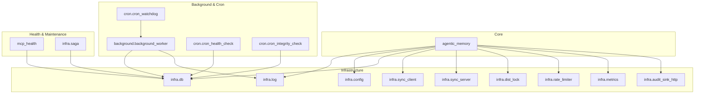

**Diagram sources**
- [log.py](file://infra/log.py)
- [config.py](file://infra/config.py)
- [db.py](file://infra/db.py)
- [sync_client.py](file://infra/sync_client.py)
- [sync_server.py](file://infra/sync_server.py)
- [background_worker.py](file://background/background_worker.py)
- [cron_health_check.py](file://cron/cron_health_check.py)
- [cron_integrity_check.py](file://cron/cron_integrity_check.py)
- [cron_watchdog.py](file://cron/cron_watchdog.py)
- [mcp_health.py](file://mcp_health.py)
- [saga.py](file://infra/saga.py)

**Section sources**
- [log.py](file://infra/log.py)
- [config.py](file://infra/config.py)
- [db.py](file://infra/db.py)
- [sync_client.py](file://infra/sync_client.py)
- [sync_server.py](file://infra/sync_server.py)
- [background_worker.py](file://background/background_worker.py)
- [cron_health_check.py](file://cron/cron_health_check.py)
- [cron_integrity_check.py](file://cron/cron_integrity_check.py)
- [cron_watchdog.py](file://cron/cron_watchdog.py)
- [mcp_health.py](file://mcp_health.py)
- [saga.py](file://infra/saga.py)

## Core Components
- Exception taxonomy and propagation: centralized exception types to standardize error signaling across components.
- Logging and observability: structured logs, metrics, and audit sinks for traceability.
- Configuration management: validation, drift detection, and hot reload mechanisms.
- Database access: connection pooling, WAL mode, safe close semantics, and migration readiness.
- Sync subsystem: client/server connectivity, TLS, tenant isolation, and backpressure handling.
- Background workers and cron jobs: task execution, watchdog monitoring, and health checks.
- Distributed coordination: locks, sagas, and idempotency guarantees.
- Rate limiting and error accounting: throttling and counters for resilience.

**Section sources**
- [exceptions.py](file://agentic_memory/exceptions.py)
- [log.py](file://infra/log.py)
- [config.py](file://infra/config.py)
- [db.py](file://infra/db.py)
- [sync_client.py](file://infra/sync_client.py)
- [sync_server.py](file://infra/sync_server.py)
- [background_worker.py](file://background/background_worker.py)
- [cron_health_check.py](file://cron/cron_health_check.py)
- [cron_integrity_check.py](file://cron/cron_integrity_check.py)
- [cron_watchdog.py](file://cron/cron_watchdog.py)
- [saga.py](file://infra/saga.py)
- [dist_lock.py](file://infra/dist_lock.py)
- [rate_limiter.py](file://infra/rate_limiter.py)
- [error_counter.py](file://infra/error_counter.py)
- [metrics.py](file://infra/metrics.py)
- [audit_sink_http.py](file://infra/audit_sink_http.py)

## Architecture Overview
The system integrates core memory operations with infrastructure services for reliability and observability. Health checks and integrity monitors run periodically via cron, while background workers execute long-running tasks. The sync layer ensures multi-agent consistency with tenant isolation and security controls.

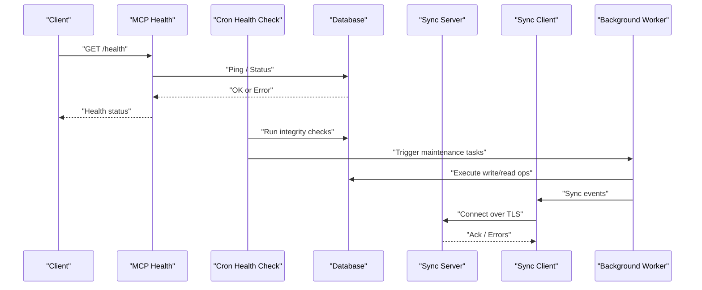

**Diagram sources**
- [mcp_health.py](file://mcp_health.py)
- [cron_health_check.py](file://cron/cron_health_check.py)
- [cron_integrity_check.py](file://cron/cron_integrity_check.py)
- [background_worker.py](file://background/background_worker.py)
- [sync_client.py](file://infra/sync_client.py)
- [sync_server.py](file://infra/sync_server.py)
- [db.py](file://infra/db.py)

## Detailed Component Analysis

### Exceptions and Error Signaling
- Centralized exception types provide consistent error codes and messages.
- Use these types to categorize failures (e.g., configuration, I/O, sync, DB).
- Propagate exceptions up the call stack; avoid swallowing errors.

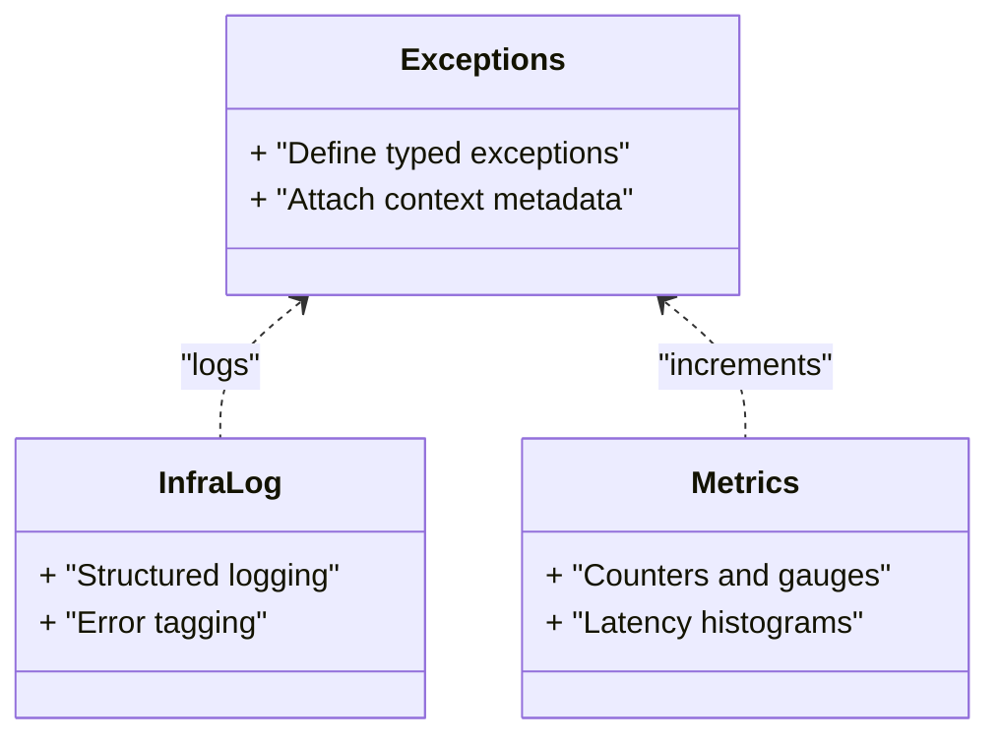

**Diagram sources**
- [exceptions.py](file://agentic_memory/exceptions.py)
- [log.py](file://infra/log.py)
- [metrics.py](file://infra/metrics.py)

**Section sources**
- [exceptions.py](file://agentic_memory/exceptions.py)
- [log.py](file://infra/log.py)
- [metrics.py](file://infra/metrics.py)

### Logging and Observability
- Structured logs include timestamps, levels, and contextual fields.
- Audit sinks forward critical events to external systems.
- Metrics expose key indicators for latency, throughput, and error rates.

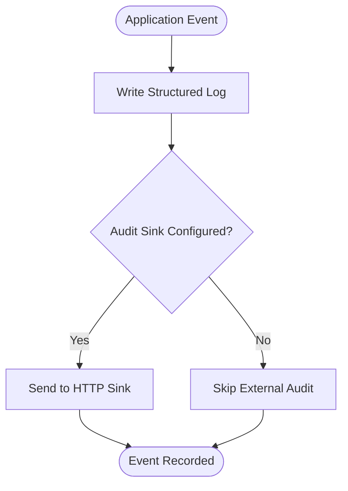

**Diagram sources**
- [log.py](file://infra/log.py)
- [audit_sink_http.py](file://infra/audit_sink_http.py)

**Section sources**
- [log.py](file://infra/log.py)
- [audit_sink_http.py](file://infra/audit_sink_http.py)
- [metrics.py](file://infra/metrics.py)

### Configuration Management and Drift
- Validate configuration at startup and during hot reload.
- Detect drift between expected and actual settings.
- Enforce policies and tier overrides consistently.

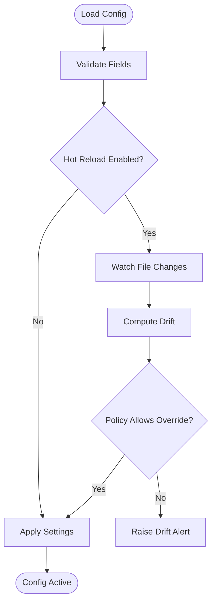

**Diagram sources**
- [config.py](file://infra/config.py)

**Section sources**
- [config.py](file://infra/config.py)
- [test_config_drift.py](file://eval/test_config_drift.py)

### Database Access and Integrity
- Connection pooling and safe close semantics prevent resource leaks.
- WAL mode improves concurrency and durability.
- Integrity checks detect anomalies and guide recovery.

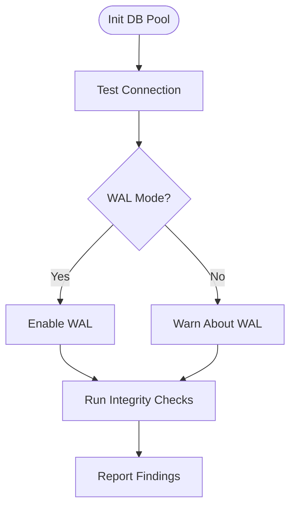

**Diagram sources**
- [db.py](file://infra/db.py)
- [cron_integrity_check.py](file://cron/cron_integrity_check.py)

**Section sources**
- [db.py](file://infra/db.py)
- [cron_integrity_check.py](file://cron/cron_integrity_check.py)
- [test_safe_close_db.py](file://eval/test_safe_close_db.py)
- [test_wal_mode.py](file://eval/test_wal_mode.py)
- [test_wal_checkpoint.py](file://eval/test_wal_checkpoint.py)

### Sync Subsystem (Client/Server)
- Client connects to server with TLS and tenant isolation.
- Backpressure prevents overwhelming downstream systems.
- Health checks verify connectivity and state.

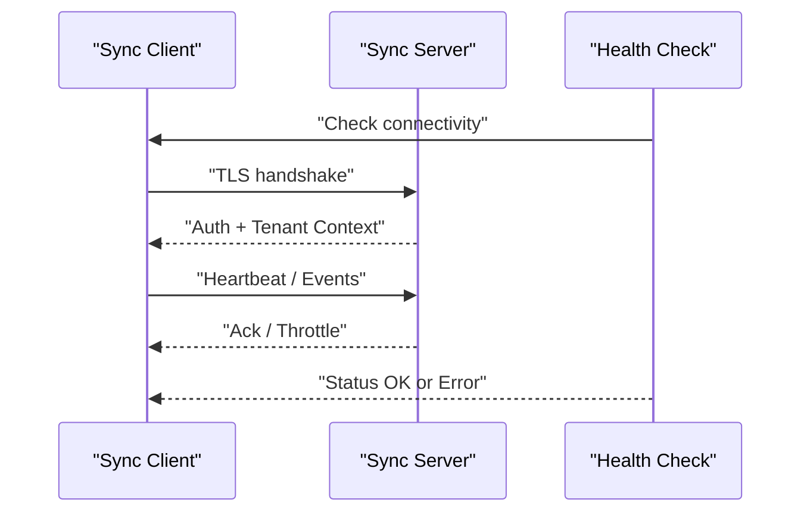

**Diagram sources**
- [sync_client.py](file://infra/sync_client.py)
- [sync_server.py](file://infra/sync_server.py)
- [cron_health_check.py](file://cron/cron_health_check.py)

**Section sources**
- [sync_client.py](file://infra/sync_client.py)
- [sync_server.py](file://infra/sync_server.py)
- [test_sync_tenant_isolation.py](file://eval/test_sync_tenant_isolation.py)
- [test_sync_server_tls.py](file://eval/test_sync_server_tls.py)
- [test_backpressure.py](file://eval/test_backpressure.py)

### Background Workers and Cron Jobs
- Workers execute scheduled tasks with retry and timeout policies.
- Watchdog monitors worker liveness and restarts unhealthy processes.
- Health checks surface job queue depth and failure rates.

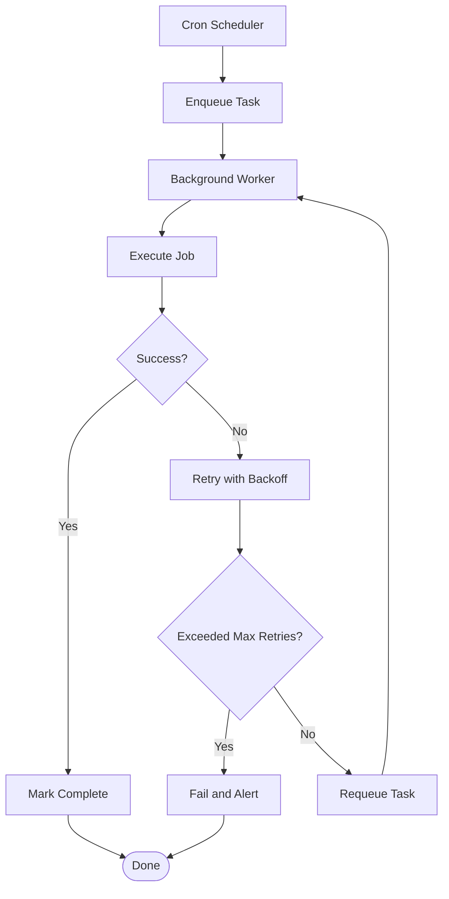

**Diagram sources**
- [background_worker.py](file://background/background_worker.py)
- [cron_watchdog.py](file://cron/cron_watchdog.py)
- [cron_health_check.py](file://cron/cron_health_check.py)

**Section sources**
- [background_worker.py](file://background/background_worker.py)
- [cron_watchdog.py](file://cron/cron_watchdog.py)
- [cron_health_check.py](file://cron/cron_health_check.py)
- [test_cron_integration.py](file://eval/test_cron_integration.py)
- [test_cron_watchdog.py](file://eval/test_cron_watchdog.py)

### Distributed Coordination (Locks and Sagas)
- Distributed locks coordinate concurrent writes and prevent conflicts.
- Sagas orchestrate multi-step transactions with compensation logic.
- File locks protect local resources when distributed locks are unavailable.

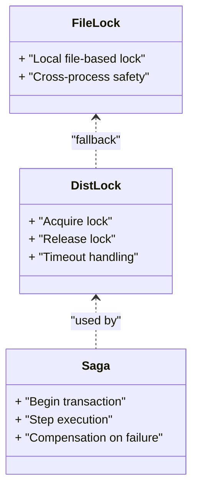

**Diagram sources**
- [dist_lock.py](file://infra/dist_lock.py)
- [saga.py](file://infra/saga.py)
- [test_file_lock.py](file://eval/test_file_lock.py)

**Section sources**
- [dist_lock.py](file://infra/dist_lock.py)
- [saga.py](file://infra/saga.py)
- [test_dist_lock.py](file://eval/test_dist_lock.py)
- [test_saga_crash_safety.py](file://eval/test_saga_crash_safety.py)
- [test_file_lock.py](file://eval/test_file_lock.py)

### Rate Limiting and Error Accounting
- Rate limiter enforces quotas per tenant or endpoint.
- Error counter aggregates failures for alerting and dashboards.

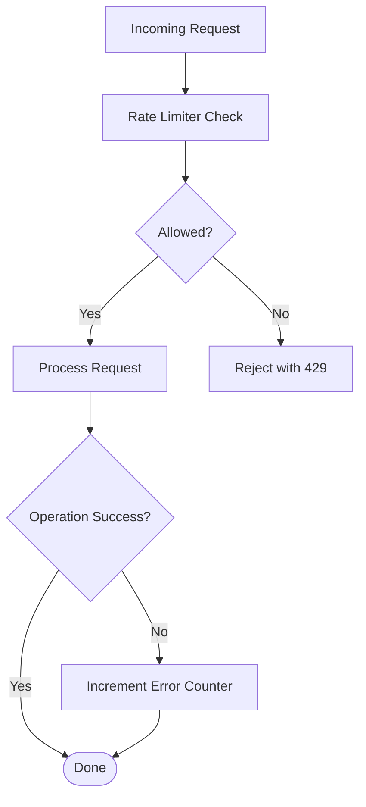

**Diagram sources**
- [rate_limiter.py](file://infra/rate_limiter.py)
- [error_counter.py](file://infra/error_counter.py)

**Section sources**
- [rate_limiter.py](file://infra/rate_limiter.py)
- [error_counter.py](file://infra/error_counter.py)
- [test_rate_limiter.py](file://eval/test_rate_limiter.py)

## Dependency Analysis
Key dependencies and interactions:
- Core depends on infra services for logging, config, DB, sync, locking, rate limiting, metrics, and audit sinks.
- Background workers depend on DB and logging; they may invoke sync client for cross-agent updates.
- Cron jobs depend on DB and background workers for maintenance and health checks.
- Health endpoints depend on DB and sync layers to report system status.

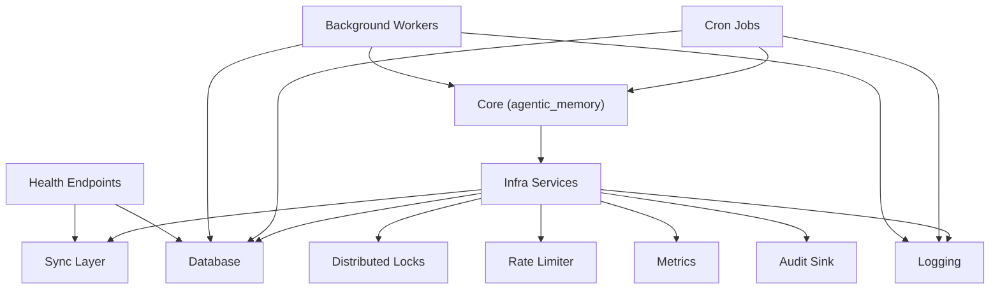

**Diagram sources**
- [log.py](file://infra/log.py)
- [config.py](file://infra/config.py)
- [db.py](file://infra/db.py)
- [sync_client.py](file://infra/sync_client.py)
- [sync_server.py](file://infra/sync_server.py)
- [dist_lock.py](file://infra/dist_lock.py)
- [rate_limiter.py](file://infra/rate_limiter.py)
- [metrics.py](file://infra/metrics.py)
- [audit_sink_http.py](file://infra/audit_sink_http.py)
- [background_worker.py](file://background/background_worker.py)
- [cron_health_check.py](file://cron/cron_health_check.py)
- [cron_integrity_check.py](file://cron/cron_integrity_check.py)
- [mcp_health.py](file://mcp_health.py)

**Section sources**
- [log.py](file://infra/log.py)
- [config.py](file://infra/config.py)
- [db.py](file://infra/db.py)
- [sync_client.py](file://infra/sync_client.py)
- [sync_server.py](file://infra/sync_server.py)
- [dist_lock.py](file://infra/dist_lock.py)
- [rate_limiter.py](file://infra/rate_limiter.py)
- [metrics.py](file://infra/metrics.py)
- [audit_sink_http.py](file://infra/audit_sink_http.py)
- [background_worker.py](file://background/background_worker.py)
- [cron_health_check.py](file://cron/cron_health_check.py)
- [cron_integrity_check.py](file://cron/cron_integrity_check.py)
- [mcp_health.py](file://mcp_health.py)

## Performance Considerations
- Monitor latency histograms and error rates via metrics.
- Tune background worker concurrency and cron schedules based on workload.
- Ensure WAL mode is enabled for improved write throughput and durability.
- Use rate limiting to protect against overload and maintain stability.
- Profile search and indexing paths if retrieval latency increases.

[No sources needed since this section provides general guidance]

## Troubleshooting Guide

### Common Issues and Resolutions
- Configuration errors:
  - Symptom: Startup fails or unexpected behavior after reload.
  - Actions: Validate config fields, check drift alerts, review hot reload logs.
  - References: [config.py](file://infra/config.py), [test_config_drift.py](file://eval/test_config_drift.py)

- Deployment failures:
  - Symptom: Service does not start or health endpoint returns errors.
  - Actions: Inspect logs, verify DB connectivity, confirm TLS certs for sync server.
  - References: [mcp_health.py](file://mcp_health.py), [sync_server.py](file://infra/sync_server.py), [test_sync_server_tls.py](file://eval/test_sync_server_tls.py)

- Runtime exceptions:
  - Symptom: Unhandled exceptions in workers or cron jobs.
  - Actions: Capture structured logs, check error counters, review saga compensation logs.
  - References: [exceptions.py](file://agentic_memory/exceptions.py), [log.py](file://infra/log.py), [saga.py](file://infra/saga.py), [test_saga_crash_safety.py](file://eval/test_saga_crash_safety.py)

- Performance problems:
  - Symptom: High latency or low throughput.
  - Actions: Review metrics, adjust worker concurrency, ensure WAL mode, profile search/indexing.
  - References: [metrics.py](file://infra/metrics.py), [test_pipeline_health.py](file://eval/test_pipeline_health.py)

- Connection issues:
  - Symptom: Sync client cannot connect or drops connections.
  - Actions: Verify TLS configuration, tenant isolation settings, backpressure behavior.
  - References: [sync_client.py](file://infra/sync_client.py), [sync_server.py](file://infra/sync_server.py), [test_sync_tenant_isolation.py](file://eval/test_sync_tenant_isolation.py), [test_backpressure.py](file://eval/test_backpressure.py)

- Data inconsistencies:
  - Symptom: Conflicting facts or missing entities.
  - Actions: Run integrity checks, review saga logs, re-run backfills if necessary.
  - References: [cron_integrity_check.py](file://cron/cron_integrity_check.py), [saga.py](file://infra/saga.py)

- Memory leaks:
  - Symptom: Gradual increase in memory usage.
  - Actions: Check DB connection lifecycle, ensure safe close, monitor worker lifetimes.
  - References: [test_connection_leak.py](file://eval/test_connection_leak.py), [test_safe_close_db.py](file://eval/test_safe_close_db.py)

- Database corruption recovery:
  - Symptom: Integrity checks fail or queries return errors.
  - Actions: Enable WAL, run integrity checks, restore from backup if needed.
  - References: [db.py](file://infra/db.py), [cron_integrity_check.py](file://cron/cron_integrity_check.py), [test_wal_mode.py](file://eval/test_wal_mode.py), [test_wal_checkpoint.py](file://eval/test_wal_checkpoint.py)

- Synchronization issues:
  - Symptom: Multi-agent states diverge.
  - Actions: Verify sync server availability, check tenant isolation, inspect backpressure and retries.
  - References: [sync_client.py](file://infra/sync_client.py), [sync_server.py](file://infra/sync_server.py), [test_sync_tenant_isolation.py](file://eval/test_sync_tenant_isolation.py)

### Diagnostic Procedures
- System health checks:
  - Call health endpoints and review cron health reports.
  - References: [mcp_health.py](file://mcp_health.py), [cron_health_check.py](file://cron/cron_health_check.py)

- Log analysis:
  - Filter logs by level and component; correlate with metrics spikes.
  - References: [log.py](file://infra/log.py), [metrics.py](file://infra/metrics.py)

- Database diagnostics:
  - Verify WAL mode, connection pool size, and safe close behavior.
  - References: [db.py](file://infra/db.py), [test_wal_mode.py](file://eval/test_wal_mode.py), [test_safe_close_db.py](file://eval/test_safe_close_db.py)

- Sync diagnostics:
  - Confirm TLS handshake success, tenant context propagation, and backpressure signals.
  - References: [sync_client.py](file://infra/sync_client.py), [sync_server.py](file://infra/sync_server.py), [test_sync_server_tls.py](file://eval/test_sync_server_tls.py)

- Worker and cron diagnostics:
  - Inspect job queue depth, retry counts, and watchdog status.
  - References: [background_worker.py](file://background/background_worker.py), [cron_watchdog.py](file://cron/cron_watchdog.py), [test_cron_integration.py](file://eval/test_cron_integration.py), [test_cron_watchdog.py](file://eval/test_cron_watchdog.py)

- Coordination diagnostics:
  - Check lock acquisition times and saga step durations.
  - References: [dist_lock.py](file://infra/dist_lock.py), [saga.py](file://infra/saga.py), [test_dist_lock.py](file://eval/test_dist_lock.py), [test_saga_crash_safety.py](file://eval/test_saga_crash_safety.py)

### Step-by-Step Guides
- Resolve configuration errors:
  - Validate config schema, apply drift policy, and confirm hot reload.
  - References: [config.py](file://infra/config.py), [test_config_drift.py](file://eval/test_config_drift.py)

- Fix deployment failures:
  - Verify service dependencies, TLS certificates, and environment variables.
  - References: [mcp_health.py](file://mcp_health.py), [sync_server.py](file://infra/sync_server.py), [test_sync_server_tls.py](file://eval/test_sync_server_tls.py)

- Handle runtime exceptions:
  - Capture stack traces, tag errors in logs, and review saga compensations.
  - References: [exceptions.py](file://agentic_memory/exceptions.py), [log.py](file://infra/log.py), [saga.py](file://infra/saga.py)

- Recover from database corruption:
  - Enable WAL, run integrity checks, and restore from backups if required.
  - References: [db.py](file://infra/db.py), [cron_integrity_check.py](file://cron/cron_integrity_check.py), [test_wal_mode.py](file://eval/test_wal_mode.py), [test_wal_checkpoint.py](file://eval/test_wal_checkpoint.py)

- Address synchronization divergence:
  - Check server health, tenant isolation, and backpressure; re-sync if needed.
  - References: [sync_client.py](file://infra/sync_client.py), [sync_server.py](file://infra/sync_server.py), [test_sync_tenant_isolation.py](file://eval/test_sync_tenant_isolation.py), [test_backpressure.py](file://eval/test_backpressure.py)

- Mitigate memory leaks:
  - Ensure safe DB close, monitor worker lifecycles, and audit connection pools.
  - References: [test_connection_leak.py](file://eval/test_connection_leak.py), [test_safe_close_db.py](file://eval/test_safe_close_db.py)

### Escalation Procedures
- When to escalate:
  - Persistent health check failures despite remediation steps.
  - Data integrity issues unresolved by integrity checks and backfills.
  - Security-related sync failures (TLS or tenant isolation).
  - Recurring memory leaks or resource exhaustion.

- Where to seek community support:
  - Provide logs, metrics snapshots, and reproduction steps.
  - Include configuration diffs and drift reports.
  - Reference relevant tests that validate expected behavior.

[No sources needed since this section summarizes without analyzing specific files]

## Conclusion
Use this guide to systematically diagnose and resolve issues across configuration, deployment, runtime, performance, connectivity, data integrity, and synchronization. Leverage structured logs, metrics, health checks, and integrity tools to identify root causes quickly. Follow escalation procedures when automated remediation is insufficient, and engage community support with detailed diagnostics.

[No sources needed since this section summarizes without analyzing specific files]

## Appendices

### Quick Reference: Key Operational Tools
- Health endpoints: [mcp_health.py](file://mcp_health.py)
- Cron health and integrity: [cron_health_check.py](file://cron/cron_health_check.py), [cron_integrity_check.py](file://cron/cron_integrity_check.py)
- Background worker and watchdog: [background_worker.py](file://background/background_worker.py), [cron_watchdog.py](file://cron/cron_watchdog.py)
- Sync client/server: [sync_client.py](file://infra/sync_client.py), [sync_server.py](file://infra/sync_server.py)
- Database and WAL: [db.py](file://infra/db.py), [test_wal_mode.py](file://eval/test_wal_mode.py), [test_wal_checkpoint.py](file://eval/test_wal_checkpoint.py)
- Locks and sagas: [dist_lock.py](file://infra/dist_lock.py), [saga.py](file://infra/saga.py)
- Rate limiting and error accounting: [rate_limiter.py](file://infra/rate_limiter.py), [error_counter.py](file://infra/error_counter.py)
- Logging and audit: [log.py](file://infra/log.py), [audit_sink_http.py](file://infra/audit_sink_http.py)
- Metrics: [metrics.py](file://infra/metrics.py)

**Section sources**
- [mcp_health.py](file://mcp_health.py)
- [cron_health_check.py](file://cron/cron_health_check.py)
- [cron_integrity_check.py](file://cron/cron_integrity_check.py)
- [background_worker.py](file://background/background_worker.py)
- [cron_watchdog.py](file://cron/cron_watchdog.py)
- [sync_client.py](file://infra/sync_client.py)
- [sync_server.py](file://infra/sync_server.py)
- [db.py](file://infra/db.py)
- [test_wal_mode.py](file://eval/test_wal_mode.py)
- [test_wal_checkpoint.py](file://eval/test_wal_checkpoint.py)
- [dist_lock.py](file://infra/dist_lock.py)
- [saga.py](file://infra/saga.py)
- [rate_limiter.py](file://infra/rate_limiter.py)
- [error_counter.py](file://infra/error_counter.py)
- [log.py](file://infra/log.py)
- [audit_sink_http.py](file://infra/audit_sink_http.py)
- [metrics.py](file://infra/metrics.py)