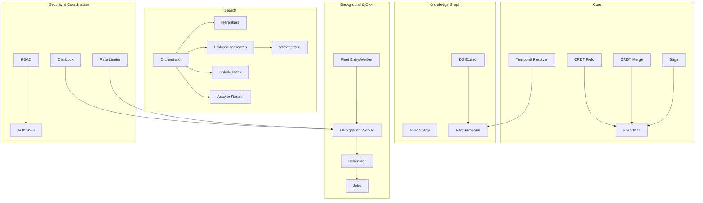
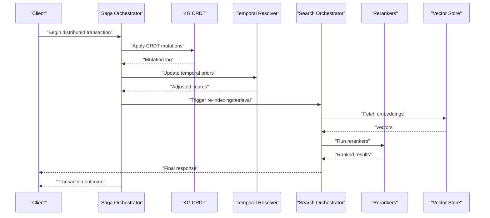
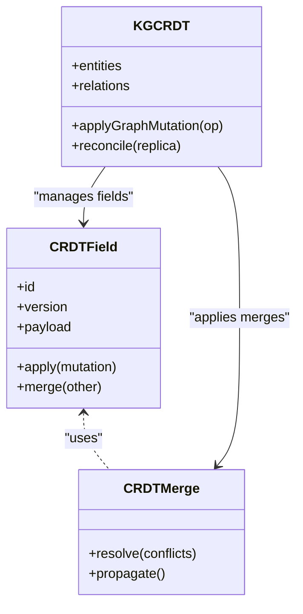
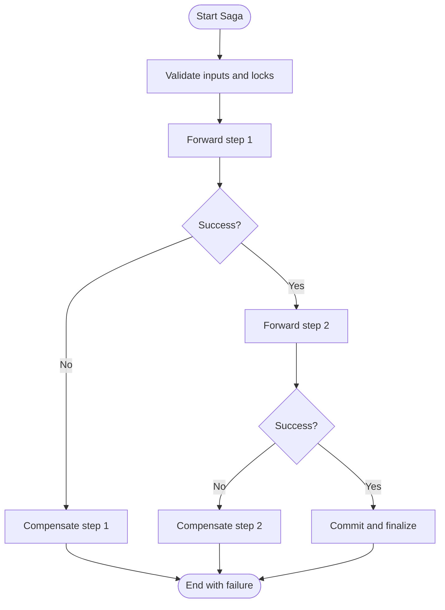
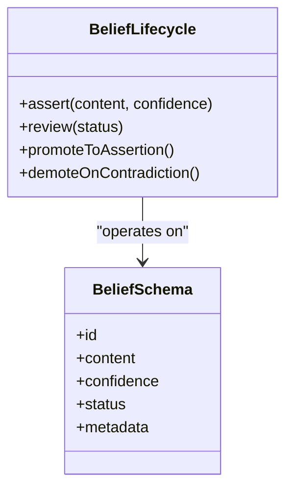
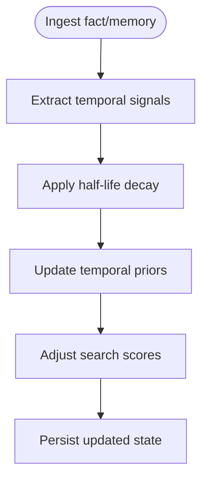
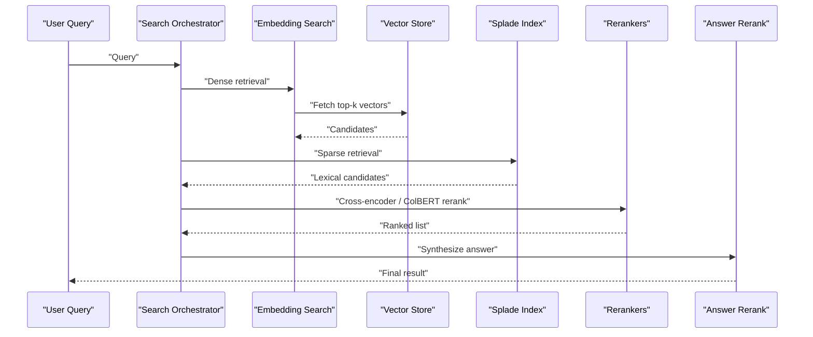
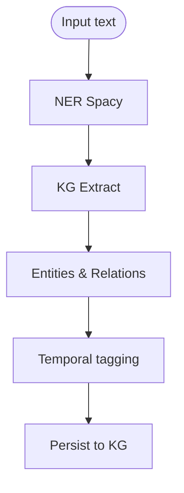
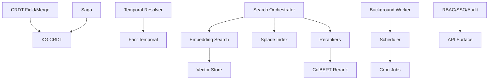

# Advanced Topics

<cite>
**Referenced Files in This Document**
- [crdt_field.py](file://crdt/crdt_field.py)
- [crdt_merge.py](file://crdt/crdt_merge.py)
- [kg_crdt.py](file://kg/kg_crdt.py)
- [saga.py](file://infra/saga.py)
- [belief_lifecycle.py](file://belief/belief_lifecycle.py)
- [belief_schema.py](file://belief/belief_schema.py)
- [temporal_resolver.py](file://kg/temporal_resolver.py)
- [fact_temporal.py](file://fact/fact_temporal.py)
- [reranker.py](file://infra/reranker.py)
- [colbert_rerank.py](file://search/colbert_rerank.py)
- [splade_index.py](file://search/splade_index.py)
- [embedding_search.py](file://infra/embedding_search.py)
- [vector_store.py](file://infra/vector_store.py)
- [orchestrator.py](file://search/orchestrator.py)
- [config.py](file://search/config.py)
- [skill_lookup.py](file://search/skill_lookup.py)
- [enrichment.py](file://search/enrichment.py)
- [scoring.py](file://search/scoring.py)
- [query_parser.py](file://search/query_parser.py)
- [state.py](file://search/state.py)
- [answer_rerank.py](file://search/answer_rerank.py)
- [kg_extract.py](file://knowledge_graph/kg_extract.py)
- [ner_spacy.py](file://knowledge_graph/ner_spacy.py)
- [db_write_queue.py](file://infra/db_write_queue.py)
- [dist_lock.py](file://infra/dist_lock.py)
- [rate_limiter.py](file://infra/rate_limiter.py)
- [audit_sink_http.py](file://infra/audit_sink_http.py)
- [authlib_sso.py](file://infra/authlib_sso.py)
- [rbac.py](file://infra/rbac.py)
- [cron_kg_backfill.py](file://cron/cron_kg_backfill.py)
- [cron_rebuild_fts.py](file://cron/cron_rebuild_fts.py)
- [cron_embedding_recompute.py](file://cron/cron_embedding_recompute.py)
- [cron_train_forget_model.py](file://cron/cron_train_forget_model.py)
- [cron_review_beliefs.py](file://cron/cron_review_beliefs.py)
- [cron_resolve_contradictions.py](file://cron/cron_resolve_contradictions.py)
- [cron_tune_rewrites.py](file://cron/cron_tune_rewrites.py)
- [cron_semantic_clusters.py](file://cron/cron_semantic_clusters.py)
- [cron_skill_extraction.py](file://cron/cron_skill_extraction.py)
- [cron_quality_filter.py](file://cron/cron_quality_filter.py)
- [cron_pinned_decay.py](file://cron/cron_pinned_decay.py)
- [cron_retention_stats.py](file://cron/cron_retention_stats.py)
- [cron_health_check.py](file://cron/cron_health_check.py)
- [cron_watchdog.py](file://cron/cron_watchdog.py)
- [cron_runs.py](file://cron/cron_runs.py)
- [scheduler.py](file://cron/scheduler.py)
- [jobs.py](file://cron/jobs.py)
- [enqueue_task.py](file://cron/enqueue_task.py)
- [background_worker.py](file://background/background_worker.py)
- [background_queue.py](file://background/background_queue.py)
- [daemon.py](file://background/daemon.py)
- [fleet_entry.py](file://background/fleet_entry.py)
- [fleet_worker.py](file://background/fleet_worker.py)
- [circuit_breaker.py](file://background/circuit_breaker.py)
- [corpus_budget_guard.py](file://background/corpus_budget_guard.py)
- [daily_digest.py](file://background/daily_digest.py)
- [inbox.py](file://background/inbox.py)
- [purge.py](file://background/purge.py)
- [retention_coordinator.py](file://background/retention_coordinator.py)
- [tool_complete.py](file://background/tool_complete.py)
- [adaptive_retention.py](file://background/adaptive_retention.py)
- [auto_save.py](file://background/auto_save.py)
- [config.py](file://background/config.py)
- [cron_model_lock.py](file://background/cron_model_lock.py)
</cite>

## Table of Contents
1. [Introduction](#introduction)
2. [Project Structure](#project-structure)
3. [Core Components](#core-components)
4. [Architecture Overview](#architecture-overview)
5. [Detailed Component Analysis](#detailed-component-analysis)
6. [Dependency Analysis](#dependency-analysis)
7. [Performance Considerations](#performance-considerations)
8. [Troubleshooting Guide](#troubleshooting-guide)
9. [Conclusion](#conclusion)
10. [Appendices](#appendices)

## Introduction
This document focuses on advanced features and customization options for the system, including:
- CRDT internals for conflict-free state evolution
- Custom embedding model integration and vector store backends
- Performance tuning strategies across search, indexing, and background workloads
- Saga pattern for distributed transactions with durability guarantees
- Belief system architecture and lifecycle management
- Temporal reasoning capabilities over facts and memories
- Advanced search customization, reranking strategies, and domain-specific entity extraction
- Extensibility patterns for storage backends and custom components
- Security hardening, scalability patterns, and production deployment considerations

## Project Structure
The repository is organized by subsystems and responsibilities:
- Core data structures and algorithms (CRDT, saga, temporal)
- Search pipeline and reranking infrastructure
- Knowledge graph extraction and reasoning
- Background workers, cron jobs, and orchestration
- Security, coordination, and observability primitives

**Diagram sources**
- [crdt_field.py](file://crdt/crdt_field.py)
- [crdt_merge.py](file://crdt/crdt_merge.py)
- [kg_crdt.py](file://kg/kg_crdt.py)
- [saga.py](file://infra/saga.py)
- [temporal_resolver.py](file://kg/temporal_resolver.py)
- [orchestrator.py](file://search/orchestrator.py)
- [reranker.py](file://infra/reranker.py)
- [colbert_rerank.py](file://search/colbert_rerank.py)
- [embedding_search.py](file://infra/embedding_search.py)
- [vector_store.py](file://infra/vector_store.py)
- [splade_index.py](file://search/splade_index.py)
- [answer_rerank.py](file://search/answer_rerank.py)
- [kg_extract.py](file://knowledge_graph/kg_extract.py)
- [ner_spacy.py](file://knowledge_graph/ner_spacy.py)
- [fact_temporal.py](file://fact/fact_temporal.py)
- [background_worker.py](file://background/background_worker.py)
- [scheduler.py](file://cron/scheduler.py)
- [jobs.py](file://cron/jobs.py)
- [fleet_entry.py](file://background/fleet_entry.py)
- [fleet_worker.py](file://background/fleet_worker.py)
- [rbac.py](file://infra/rbac.py)
- [authlib_sso.py](file://infra/authlib_sso.py)
- [dist_lock.py](file://infra/dist_lock.py)
- [rate_limiter.py](file://infra/rate_limiter.py)

**Section sources**
- [crdt_field.py](file://crdt/crdt_field.py)
- [crdt_merge.py](file://crdt/crdt_merge.py)
- [kg_crdt.py](file://kg/kg_crdt.py)
- [saga.py](file://infra/saga.py)
- [temporal_resolver.py](file://kg/temporal_resolver.py)
- [orchestrator.py](file://search/orchestrator.py)
- [reranker.py](file://infra/reranker.py)
- [colbert_rerank.py](file://search/colbert_rerank.py)
- [embedding_search.py](file://infra/embedding_search.py)
- [vector_store.py](file://infra/vector_store.py)
- [splade_index.py](file://search/splade_index.py)
- [answer_rerank.py](file://search/answer_rerank.py)
- [kg_extract.py](file://knowledge_graph/kg_extract.py)
- [ner_spacy.py](file://knowledge_graph/ner_spacy.py)
- [fact_temporal.py](file://fact/fact_temporal.py)
- [background_worker.py](file://background/background_worker.py)
- [scheduler.py](file://cron/scheduler.py)
- [jobs.py](file://cron/jobs.py)
- [fleet_entry.py](file://background/fleet_entry.py)
- [fleet_worker.py](file://background/fleet_worker.py)
- [rbac.py](file://infra/rbac.py)
- [authlib_sso.py](file://infra/authlib_sso.py)
- [dist_lock.py](file://infra/dist_lock.py)
- [rate_limiter.py](file://infra/rate_limiter.py)

## Core Components
- CRDT field-level mutation tracking and merge semantics ensure convergence across replicas without central coordination.
- The saga pattern provides durable, compensatable workflows for multi-step operations that span services or storage layers.
- The belief system models confidence, lifecycle transitions, and review queues to manage evolving knowledge.
- Temporal reasoning integrates time-aware scoring and resolution for facts and memories.
- Search orchestrator composes retrieval phases, rerankers, and enrichment steps with configurable strategies.

**Section sources**
- [crdt_field.py](file://crdt/crdt_field.py)
- [crdt_merge.py](file://crdt/crdt_merge.py)
- [kg_crdt.py](file://kg/kg_crdt.py)
- [saga.py](file://infra/saga.py)
- [belief_lifecycle.py](file://belief/belief_lifecycle.py)
- [belief_schema.py](file://belief/belief_schema.py)
- [temporal_resolver.py](file://kg/temporal_resolver.py)
- [fact_temporal.py](file://fact/fact_temporal.py)
- [orchestrator.py](file://search/orchestrator.py)

## Architecture Overview
The advanced feature set spans multiple subsystems that interact through well-defined interfaces:
- CRDT layer coordinates conflict-free updates and merges at field and graph levels.
- Saga orchestrates long-running transactions with compensation logic and audit trails.
- Belief system manages assertion states and review processes.
- Temporal resolver applies time-based priors and half-life decay to facts and memories.
- Search pipeline orchestrates retrieval, reranking, and answer synthesis with pluggable components.

**Diagram sources**
- [saga.py](file://infra/saga.py)
- [kg_crdt.py](file://kg/kg_crdt.py)
- [temporal_resolver.py](file://kg/temporal_resolver.py)
- [orchestrator.py](file://search/orchestrator.py)
- [reranker.py](file://infra/reranker.py)
- [colbert_rerank.py](file://search/colbert_rerank.py)
- [embedding_search.py](file://infra/embedding_search.py)
- [vector_store.py](file://infra/vector_store.py)

## Detailed Component Analysis

### CRDT Internals
Field-level CRDTs track mutations with metadata enabling deterministic merges. The KG CRDT extends this to graph entities and relationships, ensuring eventual consistency across writers.

**Diagram sources**
- [crdt_field.py](file://crdt/crdt_field.py)
- [crdt_merge.py](file://crdt/crdt_merge.py)
- [kg_crdt.py](file://kg/kg_crdt.py)

**Section sources**
- [crdt_field.py](file://crdt/crdt_field.py)
- [crdt_merge.py](file://crdt/crdt_merge.py)
- [kg_crdt.py](file://kg/kg_crdt.py)

### Saga Pattern for Distributed Transactions
Sagas coordinate multi-step operations with explicit forward and compensation steps, backed by durable logs and idempotency keys.

**Diagram sources**
- [saga.py](file://infra/saga.py)

**Section sources**
- [saga.py](file://infra/saga.py)

### Belief System Architecture
Beliefs encapsulate assertions with confidence levels, lifecycle states, and review queues. The schema defines core attributes and constraints; the lifecycle governs transitions and triggers.

**Diagram sources**
- [belief_schema.py](file://belief/belief_schema.py)
- [belief_lifecycle.py](file://belief/belief_lifecycle.py)

**Section sources**
- [belief_schema.py](file://belief/belief_schema.py)
- [belief_lifecycle.py](file://belief/belief_lifecycle.py)

### Temporal Reasoning Capabilities
Temporal reasoning adjusts fact and memory relevance based on observed timestamps, half-life decay, and event ordering. It integrates with the knowledge graph and search scoring.

**Diagram sources**
- [temporal_resolver.py](file://kg/temporal_resolver.py)
- [fact_temporal.py](file://fact/fact_temporal.py)

**Section sources**
- [temporal_resolver.py](file://kg/temporal_resolver.py)
- [fact_temporal.py](file://fact/fact_temporal.py)

### Advanced Search Customization and Reranking
The search orchestrator composes retrieval phases, rerankers, and enrichment steps. Pluggable rerankers include cross-encoders and specialized models like ColBERT. Splade indexing supports sparse lexical retrieval alongside dense vectors.

**Diagram sources**
- [orchestrator.py](file://search/orchestrator.py)
- [embedding_search.py](file://infra/embedding_search.py)
- [vector_store.py](file://infra/vector_store.py)
- [splade_index.py](file://search/splade_index.py)
- [reranker.py](file://infra/reranker.py)
- [colbert_rerank.py](file://search/colbert_rerank.py)
- [answer_rerank.py](file://search/answer_rerank.py)

**Section sources**
- [orchestrator.py](file://search/orchestrator.py)
- [embedding_search.py](file://infra/embedding_search.py)
- [vector_store.py](file://infra/vector_store.py)
- [splade_index.py](file://search/splade_index.py)
- [reranker.py](file://infra/reranker.py)
- [colbert_rerank.py](file://search/colbert_rerank.py)
- [answer_rerank.py](file://search/answer_rerank.py)

### Domain-Specific Entity Extraction
Entity extraction leverages NER pipelines and knowledge graph extractors to identify domain-relevant entities and relations, feeding into the KG and temporal modules.

**Diagram sources**
- [ner_spacy.py](file://knowledge_graph/ner_spacy.py)
- [kg_extract.py](file://knowledge_graph/kg_extract.py)
- [fact_temporal.py](file://fact/fact_temporal.py)

**Section sources**
- [ner_spacy.py](file://knowledge_graph/ner_spacy.py)
- [kg_extract.py](file://knowledge_graph/kg_extract.py)
- [fact_temporal.py](file://fact/fact_temporal.py)

### Extending Core Functionality
- Custom embedding models: Implement a compatible encoder interface and register it within the embedding search configuration.
- Custom rerankers: Provide a reranker implementation conforming to the reranker contract and wire it into the orchestrator’s phase pipeline.
- Custom storage backends: Implement the vector store interface to plug in alternative persistence mechanisms.
- Search configuration: Adjust retrieval weights, candidate sizes, and reranker selection via configuration objects.

**Section sources**
- [embedding_search.py](file://infra/embedding_search.py)
- [reranker.py](file://infra/reranker.py)
- [colbert_rerank.py](file://search/colbert_rerank.py)
- [vector_store.py](file://infra/vector_store.py)
- [config.py](file://search/config.py)
- [orchestrator.py](file://search/orchestrator.py)

### Practical Examples of Extensibility
- Add a new reranker strategy: Implement the reranker protocol and integrate it into the orchestrator’s reranking phase.
- Integrate a custom vector store: Provide implementations for create, upsert, and query methods matching the vector store contract.
- Customize entity types: Extend the NER pipeline and KG extractor schemas to recognize domain-specific entities.

[No sources needed since this section provides general guidance]

### Production Deployment Considerations
- Background workers: Use the worker process and queue abstractions to scale ingestion and maintenance tasks.
- Fleet mode: Deploy fleet entry and worker processes for horizontal scaling and resilience.
- Cron orchestration: Schedule periodic jobs for backfills, index rebuilds, model training, and health checks.
- Circuit breakers and budget guards: Protect downstream services and control corpus size during heavy operations.

**Section sources**
- [background_worker.py](file://background/background_worker.py)
- [background_queue.py](file://background/background_queue.py)
- [fleet_entry.py](file://background/fleet_entry.py)
- [fleet_worker.py](file://background/fleet_worker.py)
- [scheduler.py](file://cron/scheduler.py)
- [jobs.py](file://cron/jobs.py)
- [circuit_breaker.py](file://background/circuit_breaker.py)
- [corpus_budget_guard.py](file://background/corpus_budget_guard.py)

### Security Hardening
- Authentication and authorization: Configure SSO and RBAC policies to enforce access control.
- Audit logging: Stream audit events to HTTP sinks for centralized monitoring and compliance.
- Rate limiting: Apply rate limits to protect APIs and background jobs from overload.
- Distributed locks: Ensure exclusive access to critical resources during maintenance and migrations.

**Section sources**
- [authlib_sso.py](file://infra/authlib_sso.py)
- [rbac.py](file://infra/rbac.py)
- [audit_sink_http.py](file://infra/audit_sink_http.py)
- [rate_limiter.py](file://infra/rate_limiter.py)
- [dist_lock.py](file://infra/dist_lock.py)

## Dependency Analysis
Key dependencies and interactions among advanced components:

**Diagram sources**
- [crdt_field.py](file://crdt/crdt_field.py)
- [crdt_merge.py](file://crdt/crdt_merge.py)
- [kg_crdt.py](file://kg/kg_crdt.py)
- [saga.py](file://infra/saga.py)
- [temporal_resolver.py](file://kg/temporal_resolver.py)
- [fact_temporal.py](file://fact/fact_temporal.py)
- [orchestrator.py](file://search/orchestrator.py)
- [embedding_search.py](file://infra/embedding_search.py)
- [splade_index.py](file://search/splade_index.py)
- [reranker.py](file://infra/reranker.py)
- [colbert_rerank.py](file://search/colbert_rerank.py)
- [vector_store.py](file://infra/vector_store.py)
- [background_worker.py](file://background/background_worker.py)
- [scheduler.py](file://cron/scheduler.py)
- [jobs.py](file://cron/jobs.py)
- [rbac.py](file://infra/rbac.py)
- [authlib_sso.py](file://infra/authlib_sso.py)
- [audit_sink_http.py](file://infra/audit_sink_http.py)

**Section sources**
- [crdt_field.py](file://crdt/crdt_field.py)
- [crdt_merge.py](file://crdt/crdt_merge.py)
- [kg_crdt.py](file://kg/kg_crdt.py)
- [saga.py](file://infra/saga.py)
- [temporal_resolver.py](file://kg/temporal_resolver.py)
- [fact_temporal.py](file://fact/fact_temporal.py)
- [orchestrator.py](file://search/orchestrator.py)
- [embedding_search.py](file://infra/embedding_search.py)
- [splade_index.py](file://search/splade_index.py)
- [reranker.py](file://infra/reranker.py)
- [colbert_rerank.py](file://search/colbert_rerank.py)
- [vector_store.py](file://infra/vector_store.py)
- [background_worker.py](file://background/background_worker.py)
- [scheduler.py](file://cron/scheduler.py)
- [jobs.py](file://cron/jobs.py)
- [rbac.py](file://infra/rbac.py)
- [authlib_sso.py](file://infra/authlib_sso.py)
- [audit_sink_http.py](file://infra/audit_sink_http.py)

## Performance Considerations
- Tuning retrieval parameters: Adjust candidate sizes, hybrid weights, and reranker thresholds to balance latency and recall.
- Indexing strategies: Use Splade for sparse retrieval and dense vectors for semantic similarity; schedule rebuilds during low-traffic windows.
- Background workload pacing: Employ circuit breakers and budget guards to prevent resource exhaustion during large-scale operations.
- Database write throughput: Leverage write queues and distributed locks to avoid contention and ensure durability.
- Model caching and reuse: Cache embeddings and reranker outputs where appropriate to reduce repeated computation.

[No sources needed since this section provides general guidance]

## Troubleshooting Guide
Common issues and diagnostics:
- Stale indices: Rebuild full-text and vector indices using scheduled jobs; monitor job runs and failures.
- Sync drift: Run integrity checks and backfills to reconcile state across replicas.
- Model drift: Retrain forget models and recompute embeddings periodically.
- Belief hygiene: Review beliefs and resolve contradictions to maintain knowledge quality.
- Health and watchdog: Monitor service health and watchdog status to detect anomalies early.

**Section sources**
- [cron_rebuild_fts.py](file://cron/cron_rebuild_fts.py)
- [cron_kg_backfill.py](file://cron/cron_kg_backfill.py)
- [cron_embedding_recompute.py](file://cron/cron_embedding_recompute.py)
- [cron_train_forget_model.py](file://cron/cron_train_forget_model.py)
- [cron_review_beliefs.py](file://cron/cron_review_beliefs.py)
- [cron_resolve_contradictions.py](file://cron/cron_resolve_contradictions.py)
- [cron_health_check.py](file://cron/cron_health_check.py)
- [cron_watchdog.py](file://cron/cron_watchdog.py)
- [cron_runs.py](file://cron/cron_runs.py)

## Conclusion
Advanced features in this system are designed for extensibility, resilience, and performance. CRDTs provide conflict-free evolution, sagas ensure durable transactions, and the belief and temporal systems enable robust knowledge management. The search pipeline supports rich customization through pluggable rerankers and vector stores. With careful tuning, security hardening, and scalable deployment patterns, the system can meet demanding production requirements.

## Appendices

### Cron Job Reference
- Backfills and maintenance:
  - [cron_kg_backfill.py](file://cron/cron_kg_backfill.py)
  - [cron_rebuild_fts.py](file://cron/cron_rebuild_fts.py)
  - [cron_embedding_recompute.py](file://cron/cron_embedding_recompute.py)
- Learning and refinement:
  - [cron_train_forget_model.py](file://cron/cron_train_forget_model.py)
  - [cron_tune_rewrites.py](file://cron/cron_tune_rewrites.py)
  - [cron_semantic_clusters.py](file://cron/cron_semantic_clusters.py)
  - [cron_skill_extraction.py](file://cron/cron_skill_extraction.py)
- Quality and retention:
  - [cron_quality_filter.py](file://cron/cron_quality_filter.py)
  - [cron_pinned_decay.py](file://cron/cron_pinned_decay.py)
  - [cron_retention_stats.py](file://cron/cron_retention_stats.py)
- Operational health:
  - [cron_health_check.py](file://cron/cron_health_check.py)
  - [cron_watchdog.py](file://cron/cron_watchdog.py)
  - [cron_runs.py](file://cron/cron_runs.py)

**Section sources**
- [cron_kg_backfill.py](file://cron/cron_kg_backfill.py)
- [cron_rebuild_fts.py](file://cron/cron_rebuild_fts.py)
- [cron_embedding_recompute.py](file://cron/cron_embedding_recompute.py)
- [cron_train_forget_model.py](file://cron/cron_train_forget_model.py)
- [cron_tune_rewrites.py](file://cron/cron_tune_rewrites.py)
- [cron_semantic_clusters.py](file://cron/cron_semantic_clusters.py)
- [cron_skill_extraction.py](file://cron/cron_skill_extraction.py)
- [cron_quality_filter.py](file://cron/cron_quality_filter.py)
- [cron_pinned_decay.py](file://cron/cron_pinned_decay.py)
- [cron_retention_stats.py](file://cron/cron_retention_stats.py)
- [cron_health_check.py](file://cron/cron_health_check.py)
- [cron_watchdog.py](file://cron/cron_watchdog.py)
- [cron_runs.py](file://cron/cron_runs.py)

### Background Services Reference
- Workers and orchestration:
  - [background_worker.py](file://background/background_worker.py)
  - [background_queue.py](file://background/background_queue.py)
  - [daemon.py](file://background/daemon.py)
- Fleet scaling:
  - [fleet_entry.py](file://background/fleet_entry.py)
  - [fleet_worker.py](file://background/fleet_worker.py)
- Resilience and controls:
  - [circuit_breaker.py](file://background/circuit_breaker.py)
  - [corpus_budget_guard.py](file://background/corpus_budget_guard.py)
- Auxiliary tasks:
  - [daily_digest.py](file://background/daily_digest.py)
  - [inbox.py](file://background/inbox.py)
  - [purge.py](file://background/purge.py)
  - [retention_coordinator.py](file://background/retention_coordinator.py)
  - [tool_complete.py](file://background/tool_complete.py)
  - [adaptive_retention.py](file://background/adaptive_retention.py)
  - [auto_save.py](file://background/auto_save.py)
  - [config.py](file://background/config.py)
  - [cron_model_lock.py](file://background/cron_model_lock.py)

**Section sources**
- [background_worker.py](file://background/background_worker.py)
- [background_queue.py](file://background/background_queue.py)
- [daemon.py](file://background/daemon.py)
- [fleet_entry.py](file://background/fleet_entry.py)
- [fleet_worker.py](file://background/fleet_worker.py)
- [circuit_breaker.py](file://background/circuit_breaker.py)
- [corpus_budget_guard.py](file://background/corpus_budget_guard.py)
- [daily_digest.py](file://background/daily_digest.py)
- [inbox.py](file://background/inbox.py)
- [purge.py](file://background/purge.py)
- [retention_coordinator.py](file://background/retention_coordinator.py)
- [tool_complete.py](file://background/tool_complete.py)
- [adaptive_retention.py](file://background/adaptive_retention.py)
- [auto_save.py](file://background/auto_save.py)
- [config.py](file://background/config.py)
- [cron_model_lock.py](file://background/cron_model_lock.py)