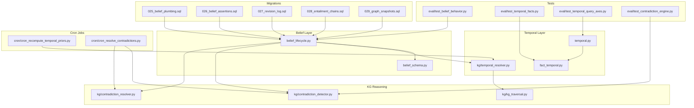
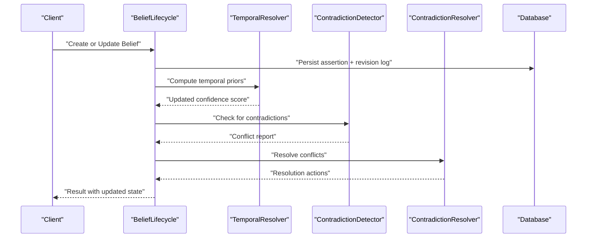
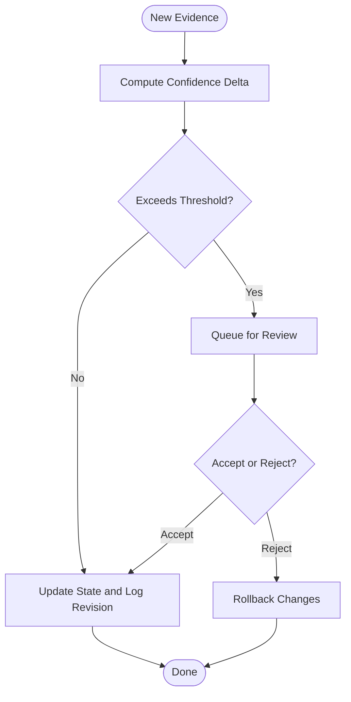
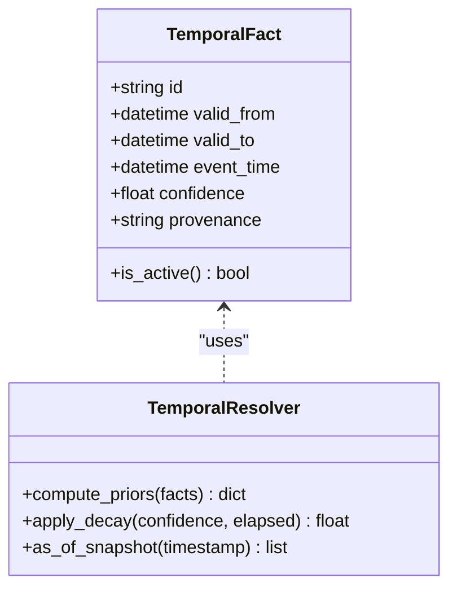
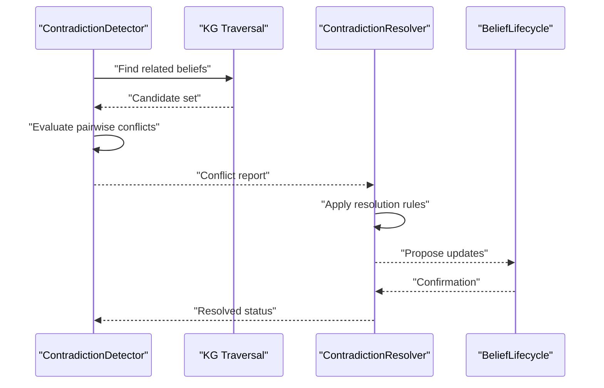
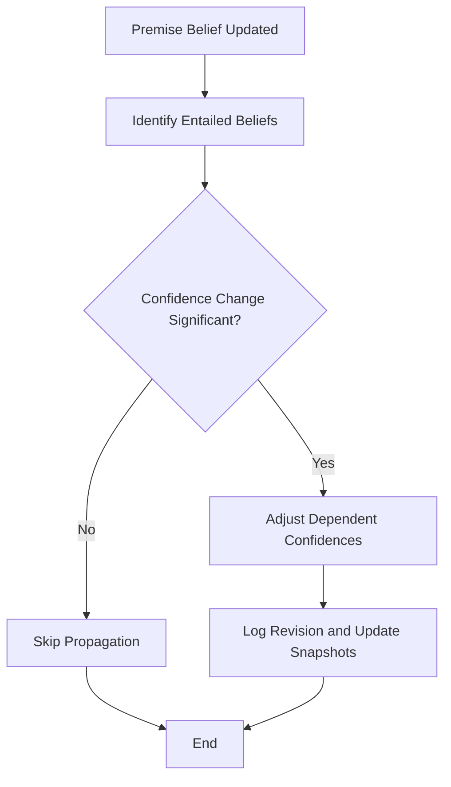
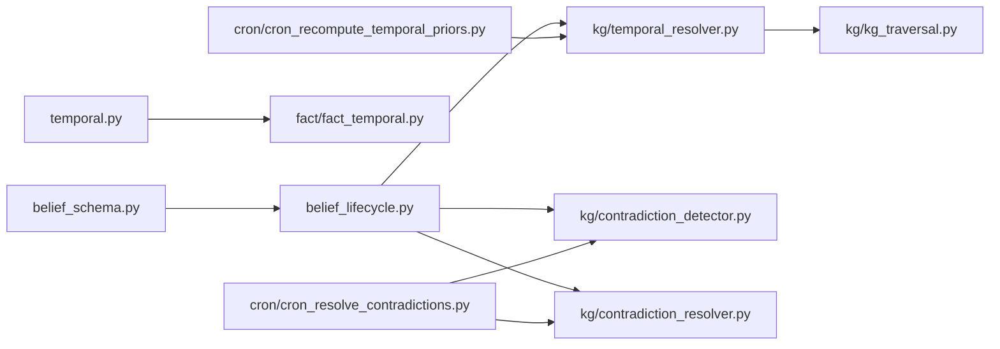

# Belief System Architecture

<cite>
**Referenced Files in This Document**
- [belief_lifecycle.py](file://belief/belief_lifecycle.py)
- [belief_schema.py](file://belief/belief_schema.py)
- [temporal.py](file://agentic_memory/temporal.py)
- [fact_temporal.py](file://fact/fact_temporal.py)
- [kg_traversal.py](file://kg/kg_traversal.py)
- [contradiction_detector.py](file://kg/contradiction_detector.py)
- [contradiction_resolver.py](file://kg/contradiction_resolver.py)
- [temporal_resolver.py](file://kg/temporal_resolver.py)
- [cron_recompute_temporal_priors.py](file://cron/cron_recompute_temporal_priors.py)
- [cron_resolve_contradictions.py](file://cron/cron_resolve_contradictions.py)
- [test_belief_behavior.py](file://eval/test_belief_behavior.py)
- [test_temporal_facts.py](file://eval/test_temporal_facts.py)
- [test_temporal_query_axes.py](file://eval/test_temporal_query_axes.py)
- [test_contradiction_engine.py](file://eval/test_contradiction_engine.py)
- [025_belief_plumbing.sql](file://migrations/025_belief_plumbing.sql)
- [026_belief_assertions.sql](file://migrations/026_belief_assertions.sql)
- [027_revision_log.sql](file://migrations/027_revision_log.sql)
- [028_entailment_chains.sql](file://migrations/028_entailment_chains.sql)
- [029_graph_snapshots.sql](file://migrations/029_graph_snapshots.sql)
</cite>

## Table of Contents
1. [Introduction](#introduction)
2. [Project Structure](#project-structure)
3. [Core Components](#core-components)
4. [Architecture Overview](#architecture-overview)
5. [Detailed Component Analysis](#detailed-component-analysis)
6. [Dependency Analysis](#dependency-analysis)
7. [Performance Considerations](#performance-considerations)
8. [Troubleshooting Guide](#troubleshooting-guide)
9. [Conclusion](#conclusion)
10. [Appendices](#appendices)

## Introduction
This document explains the belief system architecture and temporal reasoning capabilities, focusing on:
- Belief lifecycle management and revision process
- Confidence scoring algorithms and uncertainty quantification
- Contradiction detection and resolution mechanisms
- Temporal fact representation, time-aware queries, and historical reasoning
- Evidence accumulation and propagation
- Practical examples for custom belief types, temporal constraints, and historical queries
- Consistency checking and performance optimization for large-scale knowledge graphs

The goal is to provide both a high-level understanding and actionable guidance for extending and operating the belief system at scale.

## Project Structure
The belief system spans several modules:
- belief: schema and lifecycle management
- kg: contradiction detection/resolution and temporal resolution
- cron: scheduled jobs for recompute and resolution
- eval: tests that validate behavior and edge cases
- migrations: database schema for beliefs, assertions, revisions, entailments, and snapshots

**Diagram sources**
- [belief_lifecycle.py](file://belief/belief_lifecycle.py)
- [belief_schema.py](file://belief/belief_schema.py)
- [temporal.py](file://agentic_memory/temporal.py)
- [fact_temporal.py](file://fact/fact_temporal.py)
- [kg_traversal.py](file://kg/kg_traversal.py)
- [contradiction_detector.py](file://kg/contradiction_detector.py)
- [contradiction_resolver.py](file://kg/contradiction_resolver.py)
- [temporal_resolver.py](file://kg/temporal_resolver.py)
- [cron_recompute_temporal_priors.py](file://cron/cron_recompute_temporal_priors.py)
- [cron_resolve_contradictions.py](file://cron/cron_resolve_contradictions.py)
- [test_belief_behavior.py](file://eval/test_belief_behavior.py)
- [test_temporal_facts.py](file://eval/test_temporal_facts.py)
- [test_temporal_query_axes.py](file://eval/test_temporal_query_axes.py)
- [test_contradiction_engine.py](file://eval/test_contradiction_engine.py)
- [025_belief_plumbing.sql](file://migrations/025_belief_plumbing.sql)
- [026_belief_assertions.sql](file://migrations/026_belief_assertions.sql)
- [027_revision_log.sql](file://migrations/027_revision_log.sql)
- [028_entailment_chains.sql](file://migrations/028_entailment_chains.sql)
- [029_graph_snapshots.sql](file://migrations/029_graph_snapshots.sql)

**Section sources**
- [belief_lifecycle.py](file://belief/belief_lifecycle.py)
- [belief_schema.py](file://belief/belief_schema.py)
- [temporal.py](file://agentic_memory/temporal.py)
- [fact_temporal.py](file://fact/fact_temporal.py)
- [kg_traversal.py](file://kg/kg_traversal.py)
- [contradiction_detector.py](file://kg/contradiction_detector.py)
- [contradiction_resolver.py](file://kg/contradiction_resolver.py)
- [temporal_resolver.py](file://kg/temporal_resolver.py)
- [cron_recompute_temporal_priors.py](file://cron/cron_recompute_temporal_priors.py)
- [cron_resolve_contradictions.py](file://cron/cron_resolve_contradictions.py)
- [test_belief_behavior.py](file://eval/test_belief_behavior.py)
- [test_temporal_facts.py](file://eval/test_temporal_facts.py)
- [test_temporal_query_axes.py](file://eval/test_temporal_query_axes.py)
- [test_contradiction_engine.py](file://eval/test_contradiction_engine.py)
- [025_belief_plumbing.sql](file://migrations/025_belief_plumbing.sql)
- [026_belief_assertions.sql](file://migrations/026_belief_assertions.sql)
- [027_revision_log.sql](file://migrations/027_revision_log.sql)
- [028_entailment_chains.sql](file://migrations/028_entailment_chains.sql)
- [029_graph_snapshots.sql](file://migrations/029_graph_snapshots.sql)

## Core Components
- Belief Schema and Lifecycle
  - Defines belief entities, states, and transitions (assertion, review, acceptance, rejection).
  - Tracks confidence scores, evidence counts, timestamps, and provenance.
  - Provides APIs to create, update, and query beliefs with versioned revisions.
- Temporal Fact Representation
  - Encodes facts with valid-from/valid-to intervals and event times.
  - Supports half-life decay and time-aware priors for dynamic confidence.
- Contradiction Detection and Resolution
  - Detects conflicting beliefs across time windows and contexts.
  - Resolves via prioritization rules, evidence strength, and temporal precedence.
- Cron-Driven Maintenance
  - Recomputes temporal priors and resolves contradictions periodically.
  - Ensures consistency and freshness of belief states.

**Section sources**
- [belief_schema.py](file://belief/belief_schema.py)
- [belief_lifecycle.py](file://belief/belief_lifecycle.py)
- [temporal.py](file://agentic_memory/temporal.py)
- [fact_temporal.py](file://fact/fact_temporal.py)
- [contradiction_detector.py](file://kg/contradiction_detector.py)
- [contradiction_resolver.py](file://kg/contradiction_resolver.py)
- [cron_recompute_temporal_priors.py](file://cron/cron_recompute_temporal_priors.py)
- [cron_resolve_contradictions.py](file://cron/cron_resolve_contradictions.py)

## Architecture Overview
The belief system integrates schema-driven state management, temporal modeling, and graph-based reasoning. Scheduled jobs maintain consistency by recomputing priors and resolving contradictions.

**Diagram sources**
- [belief_lifecycle.py](file://belief/belief_lifecycle.py)
- [temporal.py](file://agentic_memory/temporal.py)
- [fact_temporal.py](file://fact/fact_temporal.py)
- [kg_traversal.py](file://kg/kg_traversal.py)
- [contradiction_detector.py](file://kg/contradiction_detector.py)
- [contradiction_resolver.py](file://kg/contradiction_resolver.py)

## Detailed Component Analysis

### Belief Lifecycle Management
- States and Transitions
  - New -> Under Review -> Accepted/Rejected -> Revising -> Final
  - Each transition records a revision entry with reason, confidence delta, and timestamp.
- Confidence Scoring and Uncertainty Quantification
  - Base confidence derived from evidence count and source reliability.
  - Temporal decay adjusts confidence based on recency and half-life parameters.
  - Uncertainty represented as a distribution over confidence values; point estimates used for ranking.
- Evidence Accumulation
  - Aggregates supporting and opposing evidence with weights.
  - Deduplicates near-duplicate evidence using semantic hashing.
- Revision Process
  - On new evidence, compute delta and propose revision.
  - If delta exceeds threshold, trigger review queue and optional human-in-the-loop.

**Diagram sources**
- [belief_lifecycle.py](file://belief/belief_lifecycle.py)
- [belief_schema.py](file://belief/belief_schema.py)

**Section sources**
- [belief_lifecycle.py](file://belief/belief_lifecycle.py)
- [belief_schema.py](file://belief/belief_schema.py)
- [025_belief_plumbing.sql](file://migrations/025_belief_plumbing.sql)
- [026_belief_assertions.sql](file://migrations/026_belief_assertions.sql)
- [027_revision_log.sql](file://migrations/027_revision_log.sql)

### Temporal Fact Representation and Time-Aware Queries
- Interval-Based Facts
  - Each fact has valid_from and valid_to; event_time marks observation.
  - Supports open-ended intervals for ongoing facts.
- Half-Life Decay and Priors
  - Confidence decays exponentially with elapsed time since last update.
  - Priors are recomputed periodically to reflect long-term trends.
- Historical Reasoning Patterns
  - As-of queries retrieve belief states at specific timestamps.
  - Trend analysis computes confidence trajectories over time windows.
- Time-Aware Query Axes
  - Filters by validity intervals, event times, and observation recency.
  - Combines temporal filters with semantic search and KG traversal.

**Diagram sources**
- [temporal.py](file://agentic_memory/temporal.py)
- [fact_temporal.py](file://fact/fact_temporal.py)
- [temporal_resolver.py](file://kg/temporal_resolver.py)

**Section sources**
- [temporal.py](file://agentic_memory/temporal.py)
- [fact_temporal.py](file://fact/fact_temporal.py)
- [temporal_resolver.py](file://kg/temporal_resolver.py)
- [cron_recompute_temporal_priors.py](file://cron/cron_recompute_temporal_priors.py)
- [test_temporal_facts.py](file://eval/test_temporal_facts.py)
- [test_temporal_query_axes.py](file://eval/test_temporal_query_axes.py)

### Contradiction Detection and Resolution
- Detection Mechanisms
  - Identifies mutually exclusive beliefs within overlapping time windows.
  - Uses KG traversal to find related nodes and infer indirect conflicts.
- Resolution Strategies
  - Prioritizes recent, high-evidence beliefs.
  - Applies domain-specific rules (e.g., explicit overrides, source trust levels).
  - Records resolution rationale in revision logs.
- Consistency Checking
  - Periodic scans ensure no unresolved contradictions remain.
  - Integration with review queues for complex cases.

**Diagram sources**
- [contradiction_detector.py](file://kg/contradiction_detector.py)
- [kg_traversal.py](file://kg/kg_traversal.py)
- [contradiction_resolver.py](file://kg/contradiction_resolver.py)
- [belief_lifecycle.py](file://belief/belief_lifecycle.py)

**Section sources**
- [contradiction_detector.py](file://kg/contradiction_detector.py)
- [contradiction_resolver.py](file://kg/contradiction_resolver.py)
- [kg_traversal.py](file://kg/kg_traversal.py)
- [cron_resolve_contradictions.py](file://cron/cron_resolve_contradictions.py)
- [test_contradiction_engine.py](file://eval/test_contradiction_engine.py)

### Belief Propagation and Entailment Chains
- Entailment Modeling
  - Captures logical implications between beliefs.
  - Maintains chains to propagate confidence changes.
- Propagation Rules
  - When a premise belief’s confidence changes, update dependent conclusions proportionally.
  - Apply thresholds to prevent noise amplification.
- Snapshotting
  - Periodic snapshots capture graph state for auditability and rollback.

**Diagram sources**
- [belief_lifecycle.py](file://belief/belief_lifecycle.py)
- [028_entailment_chains.sql](file://migrations/028_entailment_chains.sql)
- [029_graph_snapshots.sql](file://migrations/029_graph_snapshots.sql)

**Section sources**
- [belief_lifecycle.py](file://belief/belief_lifecycle.py)
- [028_entailment_chains.sql](file://migrations/028_entailment_chains.sql)
- [029_graph_snapshots.sql](file://migrations/029_graph_snapshots.sql)

### Practical Examples
- Defining Custom Belief Types
  - Extend the belief schema with additional fields and validation rules.
  - Implement type-specific confidence aggregation logic in the lifecycle module.
  - Reference: [belief_schema.py](file://belief/belief_schema.py), [belief_lifecycle.py](file://belief/belief_lifecycle.py)
- Implementing Temporal Constraints
  - Add valid_from/valid_to bounds and enforce overlap checks during updates.
  - Use temporal resolver to apply decay and compute priors.
  - Reference: [temporal.py](file://agentic_memory/temporal.py), [fact_temporal.py](file://fact/fact_temporal.py), [temporal_resolver.py](file://kg/temporal_resolver.py)
- Querying Historical States
  - Use as-of queries to retrieve belief states at specific timestamps.
  - Combine temporal filters with KG traversal for context-rich results.
  - Reference: [test_temporal_query_axes.py](file://eval/test_temporal_query_axes.py), [kg_traversal.py](file://kg/kg_traversal.py)

**Section sources**
- [belief_schema.py](file://belief/belief_schema.py)
- [belief_lifecycle.py](file://belief/belief_lifecycle.py)
- [temporal.py](file://agentic_memory/temporal.py)
- [fact_temporal.py](file://fact/fact_temporal.py)
- [temporal_resolver.py](file://kg/temporal_resolver.py)
- [test_temporal_query_axes.py](file://eval/test_temporal_query_axes.py)
- [kg_traversal.py](file://kg/kg_traversal.py)

## Dependency Analysis
The belief system exhibits clear layering:
- belief depends on schema definitions and interacts with temporal and KG components.
- temporal and fact modules provide utilities for interval handling and decay.
- kg modules implement reasoning primitives (contradiction detection/resolution, traversal).
- cron jobs orchestrate maintenance tasks that depend on the above layers.
- tests validate behavior across layers and edge cases.

**Diagram sources**
- [belief_schema.py](file://belief/belief_schema.py)
- [belief_lifecycle.py](file://belief/belief_lifecycle.py)
- [temporal.py](file://agentic_memory/temporal.py)
- [fact_temporal.py](file://fact/fact_temporal.py)
- [kg_traversal.py](file://kg/kg_traversal.py)
- [contradiction_detector.py](file://kg/contradiction_detector.py)
- [contradiction_resolver.py](file://kg/contradiction_resolver.py)
- [temporal_resolver.py](file://kg/temporal_resolver.py)
- [cron_recompute_temporal_priors.py](file://cron/cron_recompute_temporal_priors.py)
- [cron_resolve_contradictions.py](file://cron/cron_resolve_contradictions.py)

**Section sources**
- [belief_schema.py](file://belief/belief_schema.py)
- [belief_lifecycle.py](file://belief/belief_lifecycle.py)
- [temporal.py](file://agentic_memory/temporal.py)
- [fact_temporal.py](file://fact/fact_temporal.py)
- [kg_traversal.py](file://kg/kg_traversal.py)
- [contradiction_detector.py](file://kg/contradiction_detector.py)
- [contradiction_resolver.py](file://kg/contradiction_resolver.py)
- [temporal_resolver.py](file://kg/temporal_resolver.py)
- [cron_recompute_temporal_priors.py](file://cron/cron_recompute_temporal_priors.py)
- [cron_resolve_contradictions.py](file://cron/cron_resolve_contradictions.py)

## Performance Considerations
- Indexing and Query Optimization
  - Ensure indexes on temporal fields (valid_from, valid_to, event_time) and belief IDs.
  - Use materialized views or precomputed aggregates for frequent as-of queries.
- Batch Processing
  - Schedule batch recomputation of temporal priors and contradiction resolution.
  - Partition large datasets by tenant or time window to reduce scan costs.
- Memory and Concurrency
  - Limit traversal depth and fan-out in KG queries.
  - Employ connection pooling and read replicas for heavy analytical workloads.
- Snapshot Strategy
  - Compress snapshots and retain only necessary versions for rollback and audit.

[No sources needed since this section provides general guidance]

## Troubleshooting Guide
- Common Issues
  - Stale temporal priors: verify cron job execution and data freshness.
  - Unresolved contradictions: check resolution rules and evidence thresholds.
  - Slow as-of queries: inspect indexes and consider precomputation.
- Diagnostics
  - Inspect revision logs for unexpected state transitions.
  - Review conflict reports and resolution rationales.
  - Validate snapshot integrity and consistency with current state.

**Section sources**
- [cron_recompute_temporal_priors.py](file://cron/cron_recompute_temporal_priors.py)
- [cron_resolve_contradictions.py](file://cron/cron_resolve_contradictions.py)
- [027_revision_log.sql](file://migrations/027_revision_log.sql)
- [029_graph_snapshots.sql](file://migrations/029_graph_snapshots.sql)

## Conclusion
The belief system combines robust lifecycle management, temporal reasoning, and graph-based consistency checks to maintain accurate, evolving knowledge. By leveraging scheduled maintenance, careful indexing, and well-defined resolution strategies, it scales effectively while preserving traceability and correctness.

[No sources needed since this section summarizes without analyzing specific files]

## Appendices
- Database Schema References
  - Belief plumbing and assertions tables
  - Revision logging and entailment chains
  - Graph snapshots for auditability

**Section sources**
- [025_belief_plumbing.sql](file://migrations/025_belief_plumbing.sql)
- [026_belief_assertions.sql](file://migrations/026_belief_assertions.sql)
- [027_revision_log.sql](file://migrations/027_revision_log.sql)
- [028_entailment_chains.sql](file://migrations/028_entailment_chains.sql)
- [029_graph_snapshots.sql](file://migrations/029_graph_snapshots.sql)