# CRDT Implementation Details

<cite>
**Referenced Files in This Document**
- [crdt/__init__.py](file://crdt/__init__.py)
- [crdt/crdt_field.py](file://crdt/crdt_field.py)
- [crdt/crdt_merge.py](file://crdt/crdt_merge.py)
- [kg/kg_crdt.py](file://kg/kg_crdt.py)
- [cron/cron_crdt_sync.py](file://cron/cron_crdt_sync.py)
- [save/crdt_helpers.py](file://save/crdt_helpers.py)
- [migrations/013_field_level_crdt.sql](file://migrations/013_field_level_crdt.sql)
- [migrations/021_kg_crdt.sql](file://migrations/021_kg_crdt.sql)
- [migrations/051_field_crdt_tenant_id.sql](file://migrations/051_field_crdt_tenant_id.sql)
- [migrations/055_kg_crdt_tenant_id.sql](file://migrations/055_kg_crdt_tenant_id.sql)
- [migrations/065_kg_crdt_append_only.sql](file://migrations/065_kg_crdt_append_only.sql)
- [migrations/066_kg_crdt_tenant_id.sql](file://migrations/066_kg_crdt_tenant_id.sql)
- [migrations/073_kg_crdt_redirect_writes_to_append_tables.sql](file://migrations/073_kg_crdt_redirect_writes_to_append_tables.sql)
- [test/test_crdt_field.py](file://test/test_crdt_field.py)
- [test/test_crdt_merge.py](file://test/test_crdt_merge.py)
- [test/test_crdt_integration.py](file://test/test_crdt_integration.py)
- [test/test_crdt_sync.py](file://test/test_crdt_sync.py)
- [test/test_cron_crdt_sync.py](file://test/test_cron_crdt_sync.py)
</cite>

## Table of Contents
1. [Introduction](#introduction)
2. [Project Structure](#project-structure)
3. [Core Components](#core-components)
4. [Architecture Overview](#architecture-overview)
5. [Detailed Component Analysis](#detailed-component-analysis)
6. [Dependency Analysis](#dependency-analysis)
7. [Performance Considerations](#performance-considerations)
8. [Troubleshooting Guide](#troubleshooting-guide)
9. [Conclusion](#conclusion)
10. [Appendices](#appendices)

## Introduction
This document explains the Conflict-Free Replicated Data Types (CRDT) implementation with a focus on content-keyed design, field-level operations, merge algorithms, and distributed consistency guarantees. It covers schema design, operation encoding/decoding, state reconciliation, synchronization workflows, and practical guidance for implementing custom CRDT types, handling network partitions, and debugging synchronization issues. Performance characteristics, memory usage patterns, and scalability limits are also addressed.

## Project Structure
The CRDT subsystem is organized into focused modules:
- crdt: Core CRDT primitives and merge logic
- kg: Knowledge graph integration with CRDT-backed entities
- cron: Scheduled synchronization tasks
- save: Helpers to integrate CRDT mutations into the save pipeline
- migrations: Database schema evolution for CRDT storage

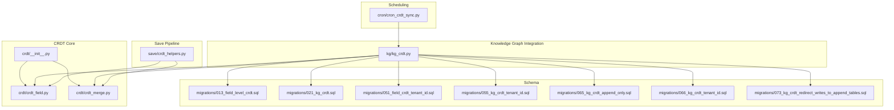

**Diagram sources**
- [crdt/__init__.py](file://crdt/__init__.py)
- [crdt/crdt_field.py](file://crdt/crdt_field.py)
- [crdt/crdt_merge.py](file://crdt/crdt_merge.py)
- [kg/kg_crdt.py](file://kg/kg_crdt.py)
- [cron/cron_crdt_sync.py](file://cron/cron_crdt_sync.py)
- [save/crdt_helpers.py](file://save/crdt_helpers.py)
- [migrations/013_field_level_crdt.sql](file://migrations/013_field_level_crdt.sql)
- [migrations/021_kg_crdt.sql](file://migrations/021_kg_crdt.sql)
- [migrations/051_field_crdt_tenant_id.sql](file://migrations/051_field_crdt_tenant_id.sql)
- [migrations/055_kg_crdt_tenant_id.sql](file://migrations/055_kg_crdt_tenant_id.sql)
- [migrations/065_kg_crdt_append_only.sql](file://migrations/065_kg_crdt_append_only.sql)
- [migrations/066_kg_crdt_tenant_id.sql](file://migrations/066_kg_crdt_tenant_id.sql)
- [migrations/073_kg_crdt_redirect_writes_to_append_tables.sql](file://migrations/073_kg_crdt_redirect_writes_to_append_tables.sql)

**Section sources**
- [crdt/__init__.py](file://crdt/__init__.py)
- [crdt/crdt_field.py](file://crdt/crdt_field.py)
- [crdt/crdt_merge.py](file://crdt/crdt_merge.py)
- [kg/kg_crdt.py](file://kg/kg_crdt.py)
- [cron/cron_crdt_sync.py](file://cron/cron_crdt_sync.py)
- [save/crdt_helpers.py](file://save/crdt_helpers.py)
- [migrations/013_field_level_crdt.sql](file://migrations/013_field_level_crdt.sql)
- [migrations/021_kg_crdt.sql](file://migrations/021_kg_crdt.sql)
- [migrations/051_field_crdt_tenant_id.sql](file://migrations/051_field_crdt_tenant_id.sql)
- [migrations/055_kg_crdt_tenant_id.sql](file://migrations/055_kg_crdt_tenant_id.sql)
- [migrations/065_kg_crdt_append_only.sql](file://migrations/065_kg_crdt_append_only.sql)
- [migrations/066_kg_crdt_tenant_id.sql](file://migrations/066_kg_crdt_tenant_id.sql)
- [migrations/073_kg_crdt_redirect_writes_to_append_tables.sql](file://migrations/073_kg_crdt_redirect_writes_to_append_tables.sql)

## Core Components
- Content-keyed CRDT model: Entities are identified by stable content-derived keys rather than mutable IDs, enabling deterministic merging across replicas.
- Field-level CRDTs: Each field maintains its own conflict-free state, allowing independent updates and merges without global locks.
- Merge algorithm: Deterministic, commutative, and idempotent merge semantics ensure convergence regardless of update order or delivery duplicates.
- Vector clock synchronization: Logical timestamps capture causal relationships between updates, enabling efficient diff computation and consistent reconciliation.
- Distributed consistency guarantees: Strong eventual consistency is achieved through content-keying, field-level independence, and monotonic vector clocks.

Key responsibilities:
- crdt_field: Defines field-level CRDT structures and operations (e.g., append-only counters, last-writer-wins with vector clocks).
- crdt_merge: Implements merge functions that combine two states deterministically.
- kg_crdt: Integrates CRDT-backed knowledge graph entities with persistence and indexing.
- cron_crdt_sync: Schedules periodic synchronization jobs to exchange diffs and reconcile state.
- save/crdt_helpers: Bridges application writes to CRDT mutation pipelines.

**Section sources**
- [crdt/crdt_field.py](file://crdt/crdt_field.py)
- [crdt/crdt_merge.py](file://crdt/crdt_merge.py)
- [kg/kg_crdt.py](file://kg/kg_crdt.py)
- [cron/cron_crdt_sync.py](file://cron/cron_crdt_sync.py)
- [save/crdt_helpers.py](file://save/crdt_helpers.py)

## Architecture Overview
The CRDT architecture separates concerns across core primitives, domain integration, scheduling, and persistence.

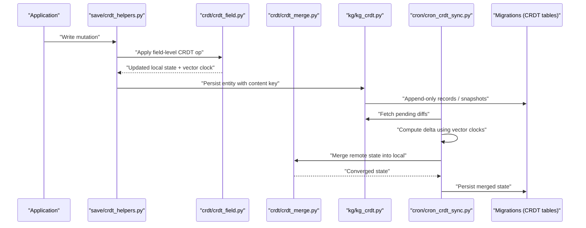

**Diagram sources**
- [save/crdt_helpers.py](file://save/crdt_helpers.py)
- [crdt/crdt_field.py](file://crdt/crdt_field.py)
- [crdt/crdt_merge.py](file://crdt/crdt_merge.py)
- [kg/kg_crdt.py](file://kg/kg_crdt.py)
- [cron/cron_crdt_sync.py](file://cron/cron_crdt_sync.py)
- [migrations/013_field_level_crdt.sql](file://migrations/013_field_level_crdt.sql)
- [migrations/021_kg_crdt.sql](file://migrations/021_kg_crdt.sql)
- [migrations/065_kg_crdt_append_only.sql](file://migrations/065_kg_crdt_append_only.sql)
- [migrations/073_kg_crdt_redirect_writes_to_append_tables.sql](file://migrations/073_kg_crdt_redirect_writes_to_append_tables.sql)

## Detailed Component Analysis

### Content-Keyed Entity Model
Content-keyed entities use deterministic identifiers derived from their content or semantic fingerprint. This ensures that replicas can match and merge the same logical entity without coordination.

- Key derivation: Stable hashing over canonicalized fields.
- Identity resolution: Lookup by content key instead of mutable IDs.
- Convergence: Same content yields same identity; merges operate on identical keys across replicas.

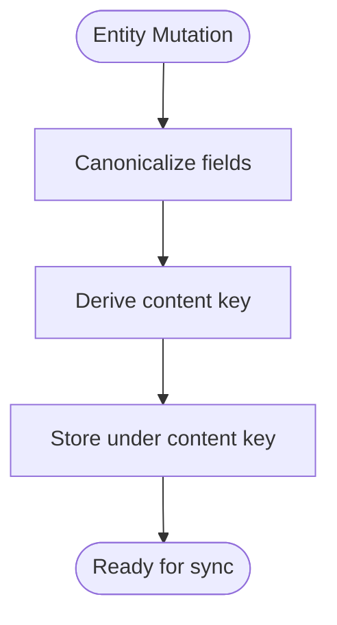

**Diagram sources**
- [kg/kg_crdt.py](file://kg/kg_crdt.py)
- [migrations/021_kg_crdt.sql](file://migrations/021_kg_crdt.sql)

**Section sources**
- [kg/kg_crdt.py](file://kg/kg_crdt.py)
- [migrations/021_kg_crdt.sql](file://migrations/021_kg_crdt.sql)

### Field-Level CRDT Operations
Field-level CRDTs enable fine-grained concurrency control and reduce merge overhead.

- Append-only lists: Commutative concatenation with deduplication via content keys.
- Counters: Monotonic increments with vector clock ordering.
- Last-writer-wins with causality: Timestamps include vector clocks to resolve conflicts deterministically.

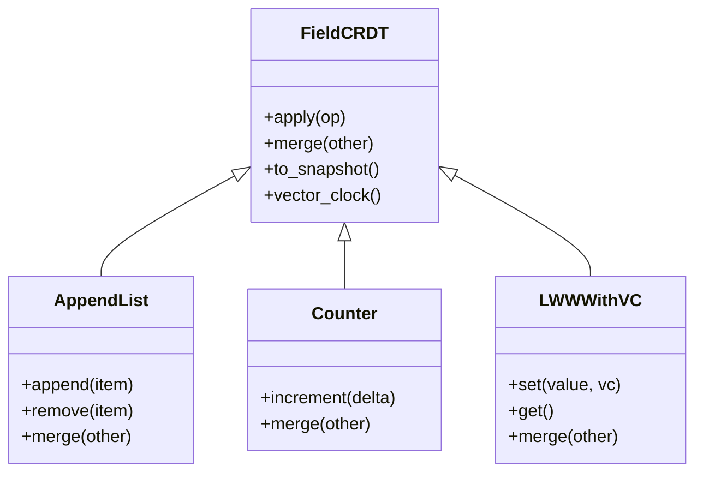

**Diagram sources**
- [crdt/crdt_field.py](file://crdt/crdt_field.py)

**Section sources**
- [crdt/crdt_field.py](file://crdt/crdt_field.py)

### Merge Algorithms and Conflict Resolution
The merge function combines two states deterministically, ensuring commutativity and idempotence.

- Pairwise merge: For each field, apply type-specific merge rules.
- Vector clock join: Combine clocks to reflect union of causal histories.
- Deduplication: Use content keys to avoid duplicate entries in append-only structures.

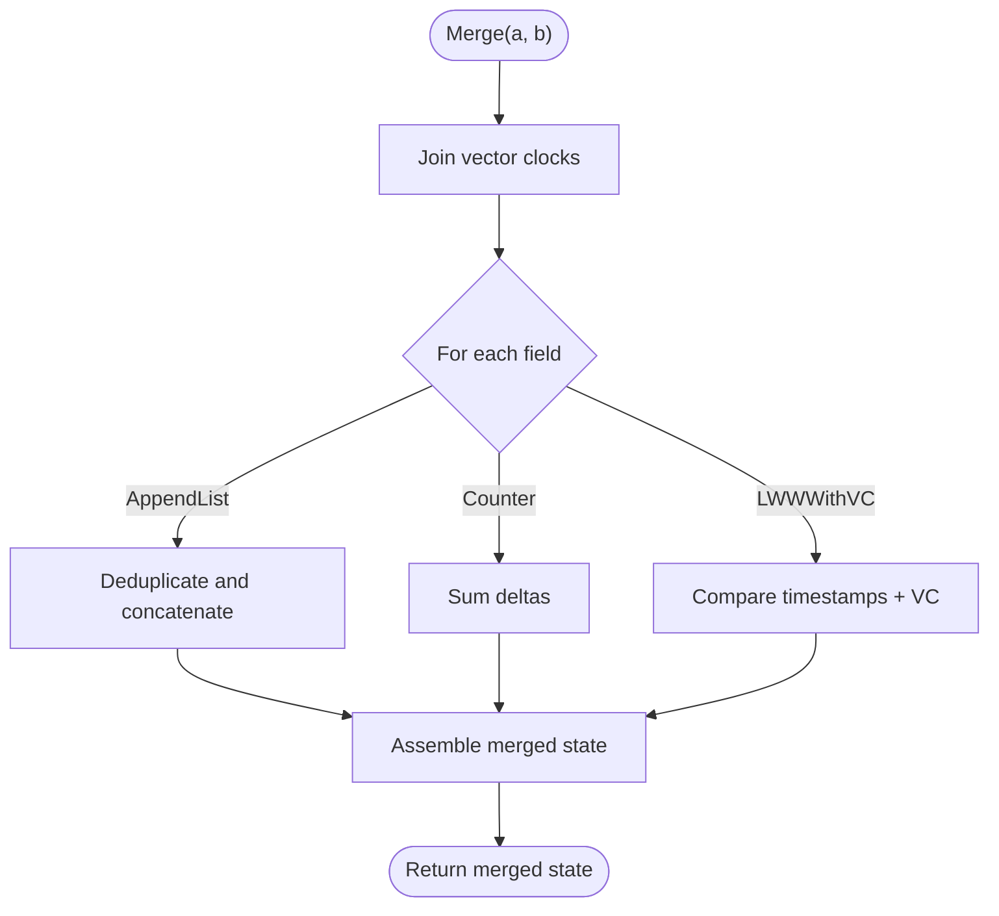

**Diagram sources**
- [crdt/crdt_merge.py](file://crdt/crdt_merge.py)
- [crdt/crdt_field.py](file://crdt/crdt_field.py)

**Section sources**
- [crdt/crdt_merge.py](file://crdt/crdt_merge.py)
- [crdt/crdt_field.py](file://crdt/crdt_field.py)

### Vector Clock Synchronization
Vector clocks track causal relationships across replicas.

- Increment per write: Each replica increments its own component when writing.
- Diff computation: Compare clocks to identify missing updates.
- Reconciliation: Exchange only necessary deltas to minimize bandwidth.

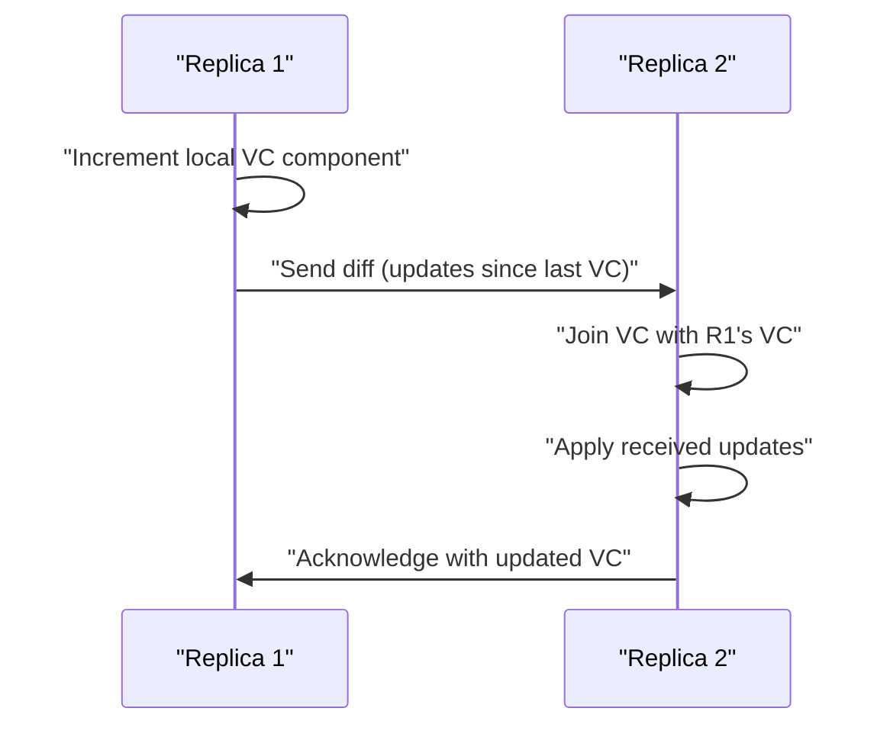

**Diagram sources**
- [crdt/crdt_field.py](file://crdt/crdt_field.py)
- [crdt/crdt_merge.py](file://crdt/crdt_merge.py)

**Section sources**
- [crdt/crdt_field.py](file://crdt/crdt_field.py)
- [crdt/crdt_merge.py](file://crdt/crdt_merge.py)

### Schema Design and Persistence
CRDT data is persisted using append-only tables and tenant-scoped indexes.

- Field-level CRDT table: Stores per-field operations and snapshots.
- Knowledge graph CRDT table: Stores entity-level CRDT state keyed by content.
- Tenant isolation: Separate namespaces for multi-tenant environments.
- Append-only enforcement: Prevents in-place mutations to preserve history.

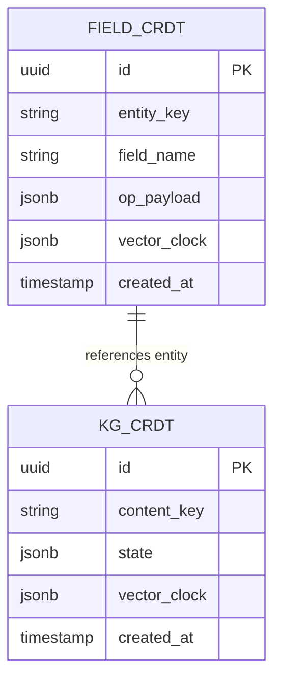

**Diagram sources**
- [migrations/013_field_level_crdt.sql](file://migrations/013_field_level_crdt.sql)
- [migrations/021_kg_crdt.sql](file://migrations/021_kg_crdt.sql)
- [migrations/051_field_crdt_tenant_id.sql](file://migrations/051_field_crdt_tenant_id.sql)
- [migrations/055_kg_crdt_tenant_id.sql](file://migrations/055_kg_crdt_tenant_id.sql)
- [migrations/065_kg_crdt_append_only.sql](file://migrations/065_kg_crdt_append_only.sql)
- [migrations/066_kg_crdt_tenant_id.sql](file://migrations/066_kg_crdt_tenant_id.sql)
- [migrations/073_kg_crdt_redirect_writes_to_append_tables.sql](file://migrations/073_kg_crdt_redirect_writes_to_append_tables.sql)

**Section sources**
- [migrations/013_field_level_crdt.sql](file://migrations/013_field_level_crdt.sql)
- [migrations/021_kg_crdt.sql](file://migrations/021_kg_crdt.sql)
- [migrations/051_field_crdt_tenant_id.sql](file://migrations/051_field_crdt_tenant_id.sql)
- [migrations/055_kg_crdt_tenant_id.sql](file://migrations/055_kg_crdt_tenant_id.sql)
- [migrations/065_kg_crdt_append_only.sql](file://migrations/065_kg_crdt_append_only.sql)
- [migrations/066_kg_crdt_tenant_id.sql](file://migrations/066_kg_crdt_tenant_id.sql)
- [migrations/073_kg_crdt_redirect_writes_to_append_tables.sql](file://migrations/073_kg_crdt_redirect_writes_to_append_tables.sql)

### Operation Encoding/Decoding
Operations are serialized for transport and storage.

- Encoding: Convert field-level ops to JSON payloads with vector clocks.
- Decoding: Parse incoming payloads and validate structure before applying.
- Versioning: Include schema version to support evolution.

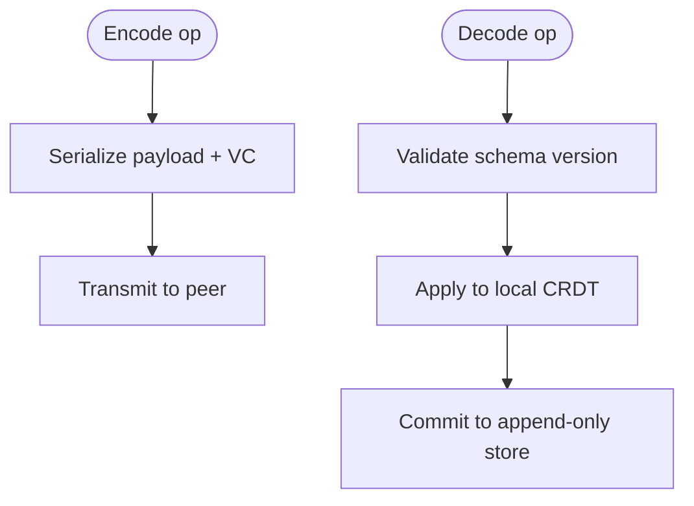

**Diagram sources**
- [crdt/crdt_field.py](file://crdt/crdt_field.py)
- [crdt/crdt_merge.py](file://crdt/crdt_merge.py)

**Section sources**
- [crdt/crdt_field.py](file://crdt/crdt_field.py)
- [crdt/crdt_merge.py](file://crdt/crdt_merge.py)

### State Reconciliation Process
Reconciliation merges remote state into local state while preserving causality.

- Fetch remote diffs based on vector clocks.
- Apply incremental updates to local CRDTs.
- Recompute snapshots if needed for compact reads.

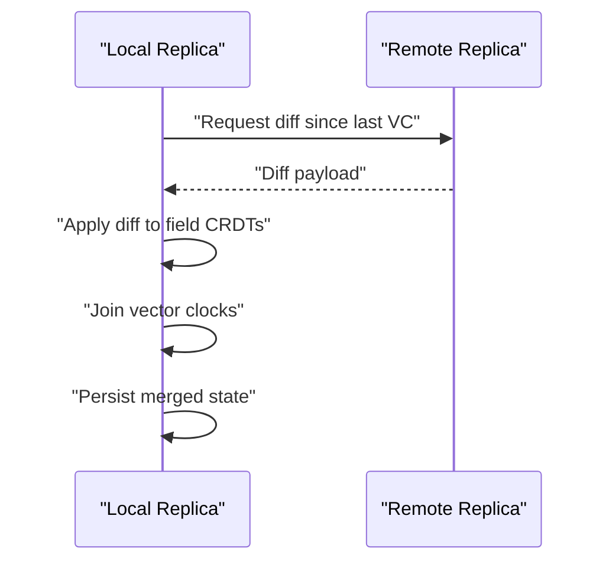

**Diagram sources**
- [cron/cron_crdt_sync.py](file://cron/cron_crdt_sync.py)
- [kg/kg_crdt.py](file://kg/kg_crdt.py)

**Section sources**
- [cron/cron_crdt_sync.py](file://cron/cron_crdt_sync.py)
- [kg/kg_crdt.py](file://kg/kg_crdt.py)

### Practical Examples

#### Implementing Custom CRDT Types
- Define a new field CRDT class with apply, merge, and snapshot methods.
- Ensure commutativity and idempotence for all operations.
- Integrate with the merge dispatcher in the merge module.

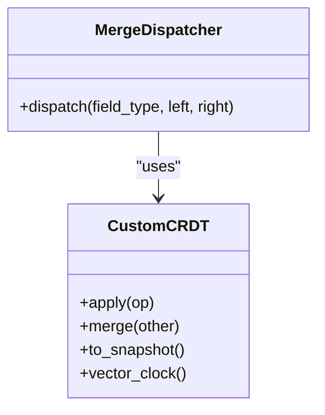

**Diagram sources**
- [crdt/crdt_field.py](file://crdt/crdt_field.py)
- [crdt/crdt_merge.py](file://crdt/crdt_merge.py)

**Section sources**
- [crdt/crdt_field.py](file://crdt/crdt_field.py)
- [crdt/crdt_merge.py](file://crdt/crdt_merge.py)

#### Handling Network Partitions
- Buffer local writes during partition.
- On reconnection, compute minimal diffs using vector clocks.
- Resolve conflicts deterministically via merge rules.

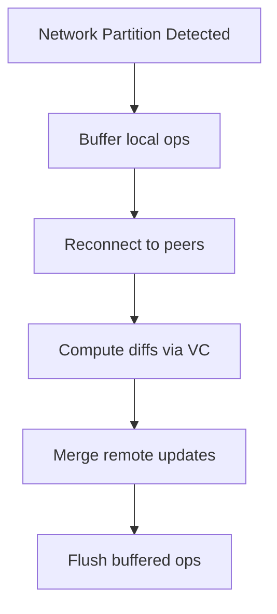

**Diagram sources**
- [cron/cron_crdt_sync.py](file://cron/cron_crdt_sync.py)
- [crdt/crdt_merge.py](file://crdt/crdt_merge.py)

**Section sources**
- [cron/cron_crdt_sync.py](file://cron/cron_crdt_sync.py)
- [crdt/crdt_merge.py](file://crdt/crdt_merge.py)

#### Debugging Synchronization Issues
- Inspect vector clocks for causal gaps.
- Verify content keys for identity mismatches.
- Review append-only logs for duplicate or out-of-order ops.

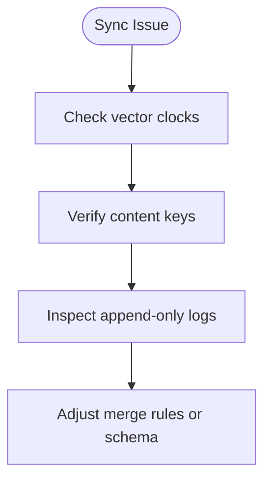

**Diagram sources**
- [test/test_crdt_sync.py](file://test/test_crdt_sync.py)
- [test/test_cron_crdt_sync.py](file://test/test_cron_crdt_sync.py)

**Section sources**
- [test/test_crdt_sync.py](file://test/test_crdt_sync.py)
- [test/test_cron_crdt_sync.py](file://test/test_cron_crdt_sync.py)

## Dependency Analysis
The CRDT system exhibits clear separation between core primitives and domain integrations.

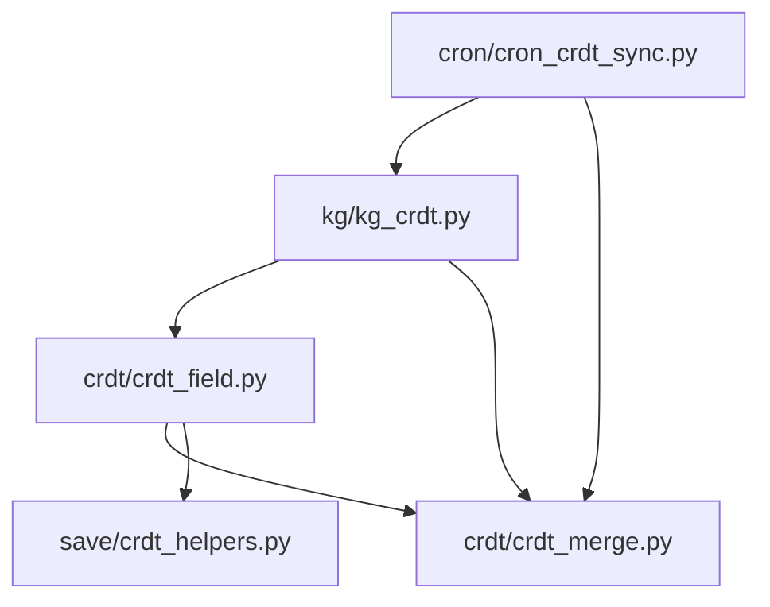

**Diagram sources**
- [crdt/crdt_field.py](file://crdt/crdt_field.py)
- [crdt/crdt_merge.py](file://crdt/crdt_merge.py)
- [kg/kg_crdt.py](file://kg/kg_crdt.py)
- [cron/cron_crdt_sync.py](file://cron/cron_crdt_sync.py)
- [save/crdt_helpers.py](file://save/crdt_helpers.py)

**Section sources**
- [crdt/crdt_field.py](file://crdt/crdt_field.py)
- [crdt/crdt_merge.py](file://crdt/crdt_merge.py)
- [kg/kg_crdt.py](file://kg/kg_crdt.py)
- [cron/cron_crdt_sync.py](file://cron/cron_crdt_sync.py)
- [save/crdt_helpers.py](file://save/crdt_helpers.py)

## Performance Considerations
- Memory usage: Prefer append-only logs with periodic compaction to bound memory growth.
- Merge complexity: Keep field-level CRDTs small; use content-keyed deduplication to reduce merge size.
- Sync bandwidth: Minimize diffs by leveraging vector clocks and incremental updates.
- Indexing: Maintain lightweight indexes on content keys and vector clocks for fast lookups.
- Scalability: Shard by tenant and entity key; parallelize merges across independent fields.

[No sources needed since this section provides general guidance]

## Troubleshooting Guide
Common issues and resolutions:
- Duplicate entries in append-only lists: Ensure content-keyed deduplication is applied during merge.
- Stale reads after merge: Recompute snapshots or refresh read caches post-reconciliation.
- Non-convergence: Verify commutativity and idempotence of merge functions; check vector clock joins.
- Tenant leakage: Confirm tenant-scoped queries and indexes are enforced in all paths.

**Section sources**
- [test/test_crdt_field.py](file://test/test_crdt_field.py)
- [test/test_crdt_merge.py](file://test/test_crdt_merge.py)
- [test/test_crdt_integration.py](file://test/test_crdt_integration.py)

## Conclusion
The CRDT implementation leverages content-keyed identities, field-level independence, and vector clock synchronization to achieve strong eventual consistency across distributed replicas. The append-only persistence model and deterministic merge algorithms provide robustness against network partitions and concurrent writes. By following the guidelines for custom CRDT types, careful schema design, and targeted troubleshooting, teams can scale CRDT-backed systems effectively while maintaining correctness and performance.

[No sources needed since this section summarizes without analyzing specific files]

## Appendices

### API and Workflow References
- Field-level CRDT tests: [test/test_crdt_field.py](file://test/test_crdt_field.py)
- Merge behavior tests: [test/test_crdt_merge.py](file://test/test_crdt_merge.py)
- Integration tests: [test/test_crdt_integration.py](file://test/test_crdt_integration.py)
- Sync workflow tests: [test/test_crdt_sync.py](file://test/test_crdt_sync.py)
- Cron sync tests: [test/test_cron_crdt_sync.py](file://test/test_cron_crdt_sync.py)

**Section sources**
- [test/test_crdt_field.py](file://test/test_crdt_field.py)
- [test/test_crdt_merge.py](file://test/test_crdt_merge.py)
- [test/test_crdt_integration.py](file://test/test_crdt_integration.py)
- [test/test_crdt_sync.py](file://test/test_crdt_sync.py)
- [test/test_cron_crdt_sync.py](file://test/test_cron_crdt_sync.py)