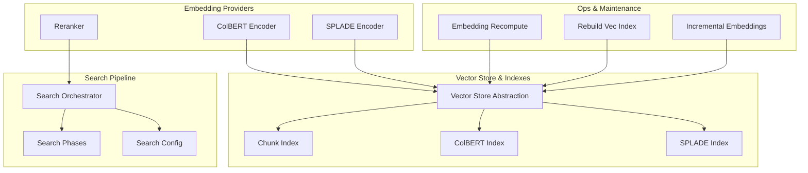
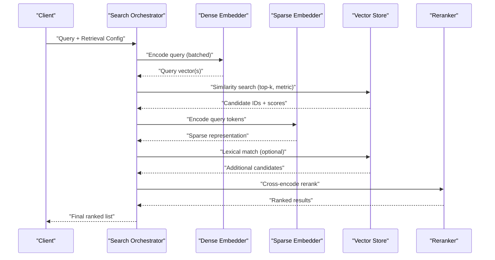
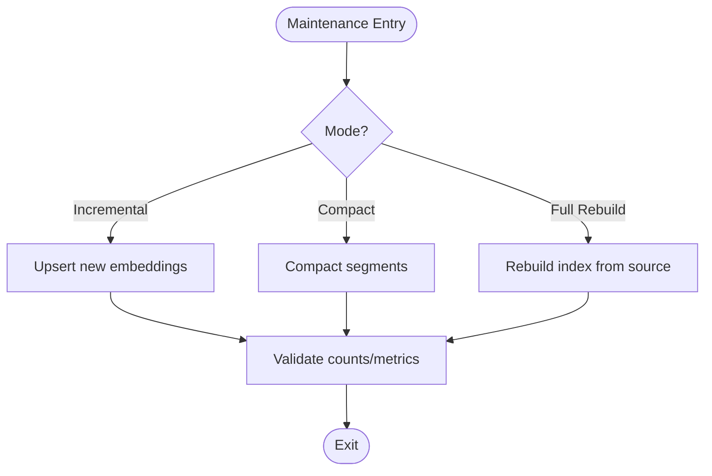
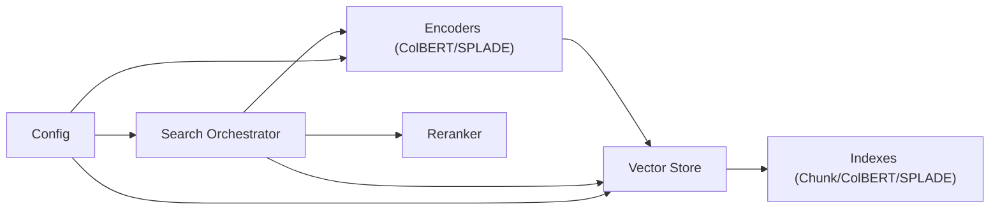

# Custom Embedding Models

<cite>
**Referenced Files in This Document**
- [vector_store.py](file://vector_store.py)
- [embedding_search.py](file://embedding_search.py)
- [embedding_recompute.py](file://embedding_recompute.py)
- [colbert_encoder.py](file://infra/colbert_encoder.py)
- [splade_encoder.py](file://infra/splade_encoder.py)
- [reranker.py](file://infra/reranker.py)
- [search/config.py](file://search/config.py)
- [search/orchestrator.py](file://search/orchestrator.py)
- [search/phases/search_phases.py](file://search/phases/search_phases.py)
- [search/chunk_index.py](file://search/chunk_index.py)
- [search/colbert_index.py](file://search/colbert_index.py)
- [search/splade_index.py](file://search/splade_index.py)
- [memory_config.py](file://memory_config.py)
- [config.py](file://config.py)
- [embedding_incremental.py](file://embedding_incremental.py)
- [rebuild_vec_index.py](file://rebuild_vec_index.py)
- [cron_embedding_recompute.py](file://cron/cron_embedding_recompute.py)
- [test_embedding_singleton.py](file://test/test_embedding_singleton.py)
- [test_embedding_cache.py](file://test/test_embedding_cache.py)
- [test_vec_index.py](file://test/test_vec_index.py)
- [test_vec_index_search.py](file://test/test_vec_index_search.py)
- [test_colbert.py](file://test/test_colbert.py)
- [test_splade.py](file://test/test_splade.py)
- [test_reranker.py](file://test/test_reranker.py)
- [test_hybrid_strategy.py](file://test/test_hybrid_strategy.py)
- [test_search_pipeline_unit.py](file://test/test_search_pipeline_unit.py)
</cite>

## Table of Contents
1. [Introduction](#introduction)
2. [Project Structure](#project-structure)
3. [Core Components](#core-components)
4. [Architecture Overview](#architecture-overview)
5. [Detailed Component Analysis](#detailed-component-analysis)
6. [Dependency Analysis](#dependency-analysis)
7. [Performance Considerations](#performance-considerations)
8. [Troubleshooting Guide](#troubleshooting-guide)
9. [Conclusion](#conclusion)
10. [Appendices](#appendices)

## Introduction
This document explains how to integrate custom embedding models and vector stores into the system, focusing on the embedding interface contract, model loading strategies, batch processing optimization, vector store abstraction, similarity search algorithms, index maintenance, domain-specific fine-tuning, dimensionality optimization, memory-efficient storage formats, caching, model versioning, fallback mechanisms, retrieval configuration, benchmarking, and operational best practices. It is designed for both developers extending the platform and operators tuning performance and reliability.

## Project Structure
The embedding and retrieval subsystem spans several modules:
- Embedding providers and encoders (e.g., ColBERT, SPLADE, rerankers)
- Vector store abstraction and index builders
- Search orchestration and phases
- Configuration and runtime wiring
- Maintenance and recompute utilities
- Tests validating behavior and performance

**Diagram sources**
- [colbert_encoder.py](file://infra/colbert_encoder.py)
- [splade_encoder.py](file://infra/splade_encoder.py)
- [reranker.py](file://infra/reranker.py)
- [vector_store.py](file://vector_store.py)
- [chunk_index.py](file://search/chunk_index.py)
- [colbert_index.py](file://search/colbert_index.py)
- [splade_index.py](file://search/splade_index.py)
- [search/orchestrator.py](file://search/orchestrator.py)
- [search/phases/search_phases.py](file://search/phases/search_phases.py)
- [search/config.py](file://search/config.py)
- [embedding_recompute.py](file://embedding_recompute.py)
- [rebuild_vec_index.py](file://rebuild_vec_index.py)
- [embedding_incremental.py](file://embedding_incremental.py)

**Section sources**
- [vector_store.py](file://vector_store.py)
- [embedding_search.py](file://embedding_search.py)
- [embedding_recompute.py](file://embedding_recompute.py)
- [colbert_encoder.py](file://infra/colbert_encoder.py)
- [splade_encoder.py](file://infra/splade_encoder.py)
- [reranker.py](file://infra/reranker.py)
- [search/config.py](file://search/config.py)
- [search/orchestrator.py](file://search/orchestrator.py)
- [search/phases/search_phases.py](file://search/phases/search_phases.py)
- [search/chunk_index.py](file://search/chunk_index.py)
- [search/colbert_index.py](file://search/colbert_index.py)
- [search/splade_index.py](file://search/splade_index.py)
- [memory_config.py](file://memory_config.py)
- [config.py](file://config.py)
- [embedding_incremental.py](file://embedding_incremental.py)
- [rebuild_vec_index.py](file://rebuild_vec_index.py)
- [cron/cron_embedding_recompute.py](file://cron/cron_embedding_recompute.py)

## Core Components
- Embedding Interface Contract: A unified interface for encoding text into vectors or token-level representations, with support for batching, device placement, and metadata tracking (model name, version, dimensions).
- Vector Store Abstraction: A pluggable backend for storing and querying embeddings, exposing methods for upsert, delete, and similarity search with configurable parameters (top-k, distance metric, filters).
- Index Builders: Specialized indexes for dense vectors (chunk-level), token-aware representations (ColBERT), and sparse lexical features (SPLADE).
- Search Orchestration: Coordinates candidate generation via multiple signals (dense, sparse, lexical), optional reranking, and result synthesis.
- Model Management: Singleton-like lifecycle for encoder instances, caching, versioning, and fallbacks when a provider fails.
- Maintenance Utilities: Batch recomputation of embeddings, incremental updates, and full rebuilds of vector indexes.

Key responsibilities:
- Provide deterministic, reproducible embeddings per model/version.
- Optimize throughput via batching and memory pooling.
- Ensure robustness through retries, fallbacks, and graceful degradation.
- Expose configuration knobs for latency vs recall trade-offs.

**Section sources**
- [vector_store.py](file://vector_store.py)
- [embedding_search.py](file://embedding_search.py)
- [colbert_encoder.py](file://infra/colbert_encoder.py)
- [splade_encoder.py](file://infra/splade_encoder.py)
- [reranker.py](file://infra/reranker.py)
- [search/orchestrator.py](file://search/orchestrator.py)
- [search/config.py](file://search/config.py)
- [memory_config.py](file://memory_config.py)
- [config.py](file://config.py)

## Architecture Overview
The system composes multiple embedding backends and vector stores behind a common interface. The search pipeline orchestrates retrieval across dense and sparse signals, optionally reranks results, and returns ranked candidates.

**Diagram sources**
- [search/orchestrator.py](file://search/orchestrator.py)
- [colbert_encoder.py](file://infra/colbert_encoder.py)
- [splade_encoder.py](file://infra/splade_encoder.py)
- [vector_store.py](file://vector_store.py)
- [reranker.py](file://infra/reranker.py)

## Detailed Component Analysis

### Embedding Interface Contract
- Responsibilities:
  - Encode text into fixed-length vectors or token-level embeddings.
  - Accept batch inputs for efficiency.
  - Return consistent outputs for the same input/model/version.
  - Expose model metadata (name, version, embedding_dim).
- Expected methods:
  - encode(text_or_batch) -> vectors/tokens
  - metadata() -> {model_name, version, embedding_dim}
  - supports_batching() -> bool
  - device() -> device type
- Error handling:
  - Raise clear exceptions for unsupported inputs or device errors.
  - Provide fallback behavior if configured (e.g., smaller model).

Implementation guidance:
- Implement a thin wrapper around your model that normalizes inputs and handles batching.
- Cache model weights and tokenizer objects to avoid reload overhead.
- Track model fingerprint (hash of weights/config) for versioning.

**Section sources**
- [colbert_encoder.py](file://infra/colbert_encoder.py)
- [splade_encoder.py](file://infra/splade_encoder.py)
- [reranker.py](file://infra/reranker.py)
- [memory_config.py](file://memory_config.py)
- [config.py](file://config.py)

### Model Loading Strategies
- Singleton pattern:
  - Load once per process; reuse across requests.
  - Use lazy initialization to reduce startup time.
- Device management:
  - Auto-select GPU/CPU based on availability.
  - Pin memory where supported to speed transfers.
- Versioning:
  - Bind model path/hash to a version key.
  - Invalidate cache on version change.
- Fallbacks:
  - If primary model fails, switch to a compatible fallback (e.g., smaller dimension).
  - Graceful degradation to lexical-only mode if all embedders fail.

Operational tips:
- Pre-warm models at service start.
- Monitor memory usage and set explicit limits.
- Log model load times and failures.

**Section sources**
- [colbert_encoder.py](file://infra/colbert_encoder.py)
- [splade_encoder.py](file://infra/splade_encoder.py)
- [test_embedding_singleton.py](file://test/test_embedding_singleton.py)

### Batch Processing Optimization
- Batching strategy:
  - Group queries by size to maximize throughput.
  - Pad/truncate to uniform lengths when required.
- Memory pooling:
  - Reuse tensors/buffers to reduce GC pressure.
- Concurrency:
  - Parallelize across workers while respecting device limits.
- Backpressure:
  - Queue large batches and stream results incrementally.

Best practices:
- Tune batch size based on available VRAM/CPU cores.
- Avoid excessive padding; use dynamic shapes where possible.
- Measure latency and throughput under realistic loads.

**Section sources**
- [colbert_encoder.py](file://infra/colbert_encoder.py)
- [splade_encoder.py](file://infra/splade_encoder.py)

### Vector Store Abstraction Layer
- API surface:
  - upsert(ids, vectors, metadata)
  - delete(ids)
  - similarity(query_vector, top_k, metric, filters)
  - build_index(data_source, config)
  - compact/reindex operations
- Supported metrics:
  - cosine, dot-product, euclidean (configurable per index).
- Filters:
  - Tenant scoping, tags, temporal ranges.
- Persistence:
  - On-disk or in-memory depending on deployment.
- Sharding/partitioning:
  - Partition by tenant or time window for scalability.

Implementation notes:
- Normalize vectors before storage for cosine/dot products.
- Maintain an ID-to-metadata mapping for efficient filtering.
- Support atomic transactions for consistency during bulk ops.

**Section sources**
- [vector_store.py](file://vector_store.py)
- [search/chunk_index.py](file://search/chunk_index.py)
- [search/colbert_index.py](file://search/colbert_index.py)
- [search/splade_index.py](file://search/splade_index.py)

### Similarity Search Algorithms
- Dense retrieval:
  - Approximate nearest neighbor (ANN) for high-dimensional vectors.
  - Trade-off between recall and latency via index parameters.
- Token-aware retrieval:
  - ColBERT-style late interaction for finer-grained matching.
- Sparse retrieval:
  - SPLADE-style lexical scoring for exact term matches.
- Hybrid fusion:
  - Combine dense and sparse scores (e.g., reciprocal rank fusion).

Algorithm selection:
- Prefer ANN for large corpora; tune k and nprobe for recall.
- Use ColBERT when phrase-level semantics matter.
- Use SPLADE to capture rare terms and synonyms.

**Section sources**
- [search/chunk_index.py](file://search/chunk_index.py)
- [search/colbert_index.py](file://search/colbert_index.py)
- [search/splade_index.py](file://search/splade_index.py)
- [search/orchestrator.py](file://search/orchestrator.py)

### Index Maintenance Procedures
- Incremental updates:
  - Append new embeddings without rebuilding entire index.
- Periodic compaction:
  - Merge segments to improve read performance.
- Full rebuild:
  - Rebuild from source data for consistency after schema/model changes.
- Health checks:
  - Validate index integrity and cardinality.

Operational flow:

**Diagram sources**
- [embedding_recompute.py](file://embedding_recompute.py)
- [rebuild_vec_index.py](file://rebuild_vec_index.py)
- [embedding_incremental.py](file://embedding_incremental.py)

**Section sources**
- [embedding_recompute.py](file://embedding_recompute.py)
- [rebuild_vec_index.py](file://rebuild_vec_index.py)
- [embedding_incremental.py](file://embedding_incremental.py)
- [cron/cron_embedding_recompute.py](file://cron/cron_embedding_recompute.py)

### Domain-Specific Fine-Tuning Approaches
- Data curation:
  - Curate domain-relevant pairs or triplets.
  - Balance positive/negative samples.
- Training objectives:
  - Contrastive loss for separation.
  - In-batch negatives for efficiency.
- Evaluation:
  - Use domain benchmarks and synthetic queries.
  - Track precision@k and recall@k.
- Deployment:
  - Version models and validate drift over time.
  - Canary rollout with shadow traffic.

Guidance:
- Start with small datasets and iterate.
- Monitor calibration and confidence scores.
- Retrain periodically as corpus evolves.

**Section sources**
- [search/config.py](file://search/config.py)
- [memory_config.py](file://memory_config.py)

### Embedding Dimensionality Optimization
- Choosing dimensions:
  - Larger dims increase recall but cost more memory and latency.
  - Smaller dims improve speed and storage footprint.
- Quantization:
  - FP16/INT8 for reduced memory and faster inference.
- Projection:
  - Post-hoc PCA or learned projection to target dim.
- Storage formats:
  - Use compact binary formats (e.g., packed arrays).
  - Choose appropriate serialization for ANN libraries.

Recommendations:
- Profile memory and latency at different dims.
- Use quantization where accuracy impact is minimal.
- Keep dimension metadata for compatibility checks.

**Section sources**
- [colbert_encoder.py](file://infra/colbert_encoder.py)
- [splade_encoder.py](file://infra/splade_encoder.py)
- [vector_store.py](file://vector_store.py)

### Caching Strategies
- Embedding cache:
  - Hash-based cache keyed by content and model fingerprint.
  - TTL policies for stale entries.
- Query cache:
  - Cache frequent queries with result sets.
- Model cache:
  - Persist model artifacts locally to avoid network fetch.
- Eviction:
  - LRU eviction with size thresholds.

Implementation tips:
- Include model version/hash in cache keys.
- Invalidate on model updates.
- Monitor hit rates and adjust TTL.

**Section sources**
- [test_embedding_cache.py](file://test/test_embedding_cache.py)
- [colbert_encoder.py](file://infra/colbert_encoder.py)
- [splade_encoder.py](file://infra/splade_encoder.py)

### Model Versioning and Fallback Mechanisms
- Versioning:
  - Assign semantic versions to models.
  - Track fingerprints for reproducibility.
- Routing:
  - Route queries to specific versions via config.
- Fallback:
  - Switch to compatible model on failure.
  - Degenerate to lexical-only if needed.
- Rollback:
  - Quick rollback to previous stable version.

Operational practices:
- Canary deployments and gradual rollout.
- Health checks and automatic failover.
- Audit logs for version switches.

**Section sources**
- [memory_config.py](file://memory_config.py)
- [config.py](file://config.py)
- [test_embedding_singleton.py](file://test/test_embedding_singleton.py)

### Retrieval Parameter Configuration
- Top-k:
  - Controls number of candidates returned.
- Distance metric:
  - Cosine, dot, euclidean depending on normalization.
- Filters:
  - Tenant, tags, time windows.
- Hybrid fusion:
  - Weights for dense vs sparse vs reranked results.
- Latency budgets:
  - Timeouts and early stopping.

Configuration examples are provided in the referenced files; adjust based on workload characteristics.

**Section sources**
- [search/config.py](file://search/config.py)
- [search/orchestrator.py](file://search/orchestrator.py)

### Benchmarking Different Model Architectures
- Benchmarks:
  - Throughput (queries/sec) and latency (p50/p95).
  - Recall@k and precision@k on curated sets.
- Scenarios:
  - Small vs large corpora.
  - High concurrency vs single-threaded.
- Tools:
  - Synthetic workloads and real query logs.
  - Profiling memory and CPU/GPU utilization.

Recommended approach:
- Run controlled experiments with fixed datasets.
- Report both accuracy and efficiency metrics.
- Iterate on model and index parameters.

**Section sources**
- [test_colbert.py](file://test/test_colbert.py)
- [test_splade.py](file://test/test_splade.py)
- [test_reranker.py](file://test/test_reranker.py)
- [test_hybrid_strategy.py](file://test/test_hybrid_strategy.py)
- [test_search_pipeline_unit.py](file://test/test_search_pipeline_unit.py)

## Dependency Analysis
The embedding and retrieval components have clear dependencies:
- Encoders depend on model artifacts and device resources.
- Vector stores depend on persistence backends and index libraries.
- Search orchestrator depends on encoders, vector stores, and rerankers.
- Configuration drives component selection and parameters.

**Diagram sources**
- [colbert_encoder.py](file://infra/colbert_encoder.py)
- [splade_encoder.py](file://infra/splade_encoder.py)
- [vector_store.py](file://vector_store.py)
- [search/chunk_index.py](file://search/chunk_index.py)
- [search/colbert_index.py](file://search/colbert_index.py)
- [search/splade_index.py](file://search/splade_index.py)
- [search/orchestrator.py](file://search/orchestrator.py)
- [search/config.py](file://search/config.py)

**Section sources**
- [search/orchestrator.py](file://search/orchestrator.py)
- [search/config.py](file://search/config.py)
- [vector_store.py](file://vector_store.py)

## Performance Considerations
- Batch sizing:
  - Tune based on hardware constraints and latency targets.
- Index choice:
  - ANN for large-scale; ensure proper parameter tuning.
- Quantization:
  - Reduce memory and improve speed with minimal accuracy loss.
- Caching:
  - Increase hit rates to reduce compute.
- Concurrency:
  - Limit parallelism to avoid resource contention.
- Monitoring:
  - Track latency percentiles, error rates, and memory usage.

[No sources needed since this section provides general guidance]

## Troubleshooting Guide
Common issues and resolutions:
- Model load failures:
  - Verify artifact paths and permissions.
  - Check device availability and memory.
- Embedding mismatches:
  - Ensure consistent model versions and preprocessing.
- Slow searches:
  - Adjust top-k, nprobe, and batch sizes.
  - Validate index health and compaction status.
- Cache misses:
  - Review TTL and key composition.
- Fallback triggers:
  - Inspect health checks and error logs.

Debugging steps:
- Enable detailed logging for encoder and vector store calls.
- Validate index cardinality and sample queries.
- Run unit tests for encoders and indexes.

**Section sources**
- [test_embedding_singleton.py](file://test/test_embedding_singleton.py)
- [test_vec_index.py](file://test/test_vec_index.py)
- [test_vec_index_search.py](file://test/test_vec_index_search.py)

## Conclusion
Integrating custom embedding models and vector stores requires a clear interface contract, robust model management, efficient indexing, and resilient search orchestration. By following the guidelines here—covering batching, caching, versioning, fallbacks, and performance tuning—you can extend the system with domain-specific models while maintaining reliability and scalability.

[No sources needed since this section summarizes without analyzing specific files]

## Appendices

### Example Implementation Checklist
- Implement encode(batch) returning consistent vectors/tokens.
- Expose metadata(model_name, version, embedding_dim).
- Integrate with vector store upsert/similarity APIs.
- Configure hybrid retrieval and reranking.
- Add caching and versioning hooks.
- Write tests for correctness and performance.

[No sources needed since this section provides general guidance]