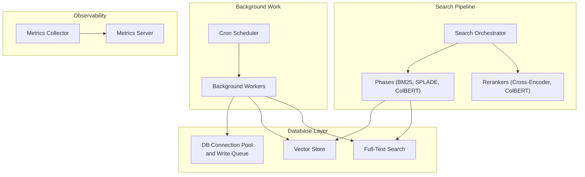
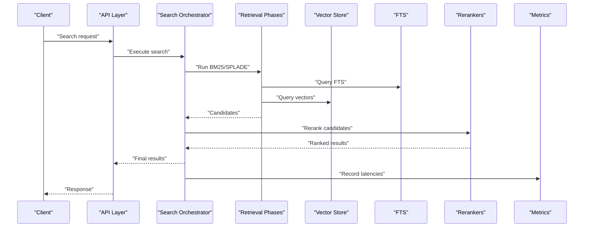
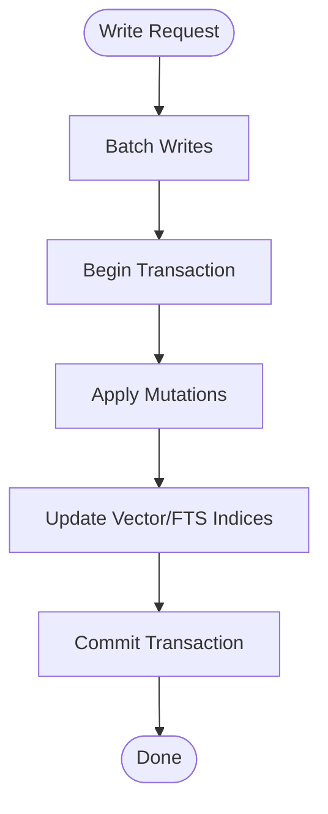
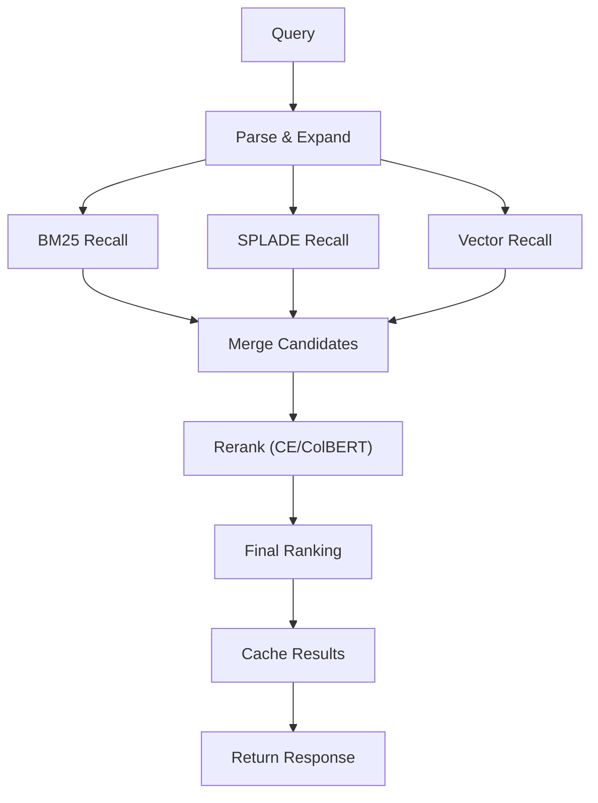
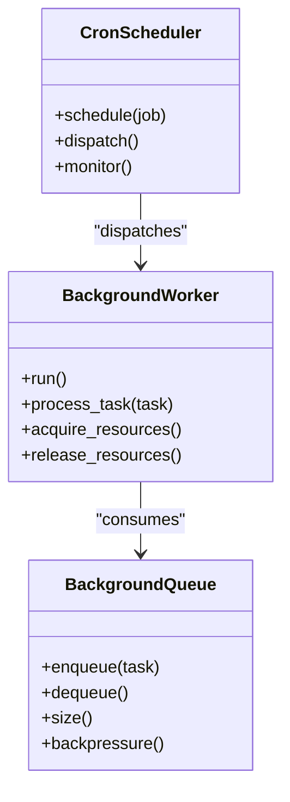
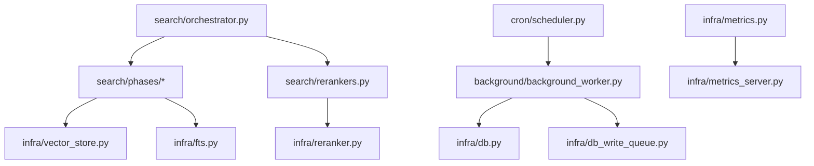

# Performance Optimization

<cite>
**Referenced Files in This Document**
- [db.py](file://db.py)
- [infra/db.py](file://infra/db.py)
- [infra/db_write_queue.py](file://infra/db_write_queue.py)
- [background/background_worker.py](file://background/background_worker.py)
- [background/background_queue.py](file://background/background_queue.py)
- [cron/scheduler.py](file://cron/scheduler.py)
- [search/orchestrator.py](file://search/orchestrator.py)
- [search/phases/](file://search/phases/)
- [search/rerankers.py](file://search/rerankers.py)
- [infra/reranker.py](file://infra/reranker.py)
- [infra/vector_store.py](file://infra/vector_store.py)
- [infra/fts.py](file://infra/fts.py)
- [infra/metrics.py](file://infra/metrics.py)
- [infra/metrics_server.py](file://infra/metrics_server.py)
- [scripts/perf_regression_check.py](file://scripts/perf_regression_check.py)
- [eval/benchmarks/bench_search.py](file://eval/benchmarks/bench_search.py)
- [eval/profile_search.py](file://eval/profile_search.py)
- [mcp/mcp_metrics.py](file://mcp/mcp_metrics.py)
</cite>

## Table of Contents
1. [Introduction](#introduction)
2. [Project Structure](#project-structure)
3. [Core Components](#core-components)
4. [Architecture Overview](#architecture-overview)
5. [Detailed Component Analysis](#detailed-component-analysis)
6. [Dependency Analysis](#dependency-analysis)
7. [Performance Considerations](#performance-considerations)
8. [Troubleshooting Guide](#troubleshooting-guide)
9. [Conclusion](#conclusion)
10. [Appendices](#appendices)

## Introduction
This document provides a comprehensive performance tuning and optimization guide for the system, focusing on database query optimization, connection pooling configuration, indexing strategies, search pipeline tuning, reranking optimization, result caching, background worker scaling, task queue optimization, resource allocation patterns, memory management, garbage collection tuning, profiling techniques, load testing, bottleneck identification, capacity planning, monitoring metrics, alerting thresholds, and performance regression detection. The guidance is grounded in the repository’s implementation details and best practices.

## Project Structure
The performance-critical subsystems are organized across several modules:
- Database layer and write queue for efficient persistence
- Search orchestration with multiple phases and rerankers
- Vector store and full-text search (FTS) backends
- Background workers and cron scheduler for asynchronous workloads
- Metrics collection and server for observability
- Evaluation and benchmarking utilities for profiling and regression checks

**Diagram sources**
- [infra/db.py](file://infra/db.py)
- [infra/db_write_queue.py](file://infra/db_write_queue.py)
- [infra/vector_store.py](file://infra/vector_store.py)
- [infra/fts.py](file://infra/fts.py)
- [search/orchestrator.py](file://search/orchestrator.py)
- [search/phases/](file://search/phases/)
- [search/rerankers.py](file://search/rerankers.py)
- [infra/reranker.py](file://infra/reranker.py)
- [background/background_worker.py](file://background/background_worker.py)
- [cron/scheduler.py](file://cron/scheduler.py)
- [infra/metrics.py](file://infra/metrics.py)
- [infra/metrics_server.py](file://infra/metrics_server.py)

**Section sources**
- [db.py](file://db.py)
- [infra/db.py](file://infra/db.py)
- [infra/db_write_queue.py](file://infra/db_write_queue.py)
- [infra/vector_store.py](file://infra/vector_store.py)
- [infra/fts.py](file://infra/fts.py)
- [search/orchestrator.py](file://search/orchestrator.py)
- [search/phases/](file://search/phases/)
- [search/rerankers.py](file://search/rerankers.py)
- [infra/reranker.py](file://infra/reranker.py)
- [background/background_worker.py](file://background/background_worker.py)
- [cron/scheduler.py](file://cron/scheduler.py)
- [infra/metrics.py](file://infra/metrics.py)
- [infra/metrics_server.py](file://infra/metrics_server.py)

## Core Components
- Database connection pool and write queue: Centralizes DB connections, manages concurrency, and batches writes to reduce contention and improve throughput.
- Search orchestrator: Coordinates multi-phase retrieval (BM25, SPLADE, vector), applies budget-aware filtering, and integrates rerankers.
- Rerankers: Implements cross-encoder and ColBERT reranking strategies with configurable budgets and timeouts.
- Vector store and FTS: Provide high-performance similarity search and text matching; both support indexing and query-time optimizations.
- Background workers and cron scheduler: Execute long-running tasks, maintenance jobs, and periodic reindexing with controlled concurrency.
- Metrics and observability: Collect latency, throughput, error rates, and resource utilization; expose endpoints for dashboards and alerts.

**Section sources**
- [infra/db.py](file://infra/db.py)
- [infra/db_write_queue.py](file://infra/db_write_queue.py)
- [search/orchestrator.py](file://search/orchestrator.py)
- [search/rerankers.py](file://search/rerankers.py)
- [infra/reranker.py](file://infra/reranker.py)
- [infra/vector_store.py](file://infra/vector_store.py)
- [infra/fts.py](file://infra/fts.py)
- [background/background_worker.py](file://background/background_worker.py)
- [cron/scheduler.py](file://cron/scheduler.py)
- [infra/metrics.py](file://infra/metrics.py)
- [infra/metrics_server.py](file://infra/metrics_server.py)

## Architecture Overview
The performance architecture emphasizes layered retrieval, bounded compute, and robust concurrency control:
- Read path: Query parsing -> phase-based recall (BM25/SPLADE/vector) -> candidate merging -> reranking -> final ranking.
- Write path: Journaling and batching via write queue -> DB transactions -> index updates (vector/FTS).
- Background path: Cron-scheduled tasks and workers execute maintenance, reindexing, and model training with resource limits.
- Observability: Metrics collected at key stages; server exposes endpoints for real-time monitoring.

**Diagram sources**
- [search/orchestrator.py](file://search/orchestrator.py)
- [search/phases/](file://search/phases/)
- [infra/vector_store.py](file://infra/vector_store.py)
- [infra/fts.py](file://infra/fts.py)
- [search/rerankers.py](file://search/rerankers.py)
- [infra/reranker.py](file://infra/reranker.py)
- [infra/metrics.py](file://infra/metrics.py)

## Detailed Component Analysis

### Database Query Optimization and Connection Pooling
- Connection pooling: Configure pool size based on CPU cores and I/O characteristics; ensure max connections do not exceed DB limits. Use separate pools for read/write if needed.
- Write batching: Leverage the write queue to batch mutations, reducing transaction overhead and lock contention.
- Query design: Prefer targeted queries with selective filters; avoid SELECT *; use appropriate indexes for frequent predicates.
- WAL and durability: Tune WAL settings for write-heavy workloads; consider checkpoint frequency to balance durability and performance.
- Index strategy: Maintain composite indexes for common filter combinations; periodically analyze slow queries and rebuild indexes during low-traffic windows.

**Diagram sources**
- [infra/db_write_queue.py](file://infra/db_write_queue.py)
- [infra/db.py](file://infra/db.py)

**Section sources**
- [db.py](file://db.py)
- [infra/db.py](file://infra/db.py)
- [infra/db_write_queue.py](file://infra/db_write_queue.py)

### Indexing Strategies
- Vector indices: Choose dimensionality and distance metric aligned with embedding models; maintain index refresh cadence to minimize staleness.
- FTS indices: Optimize tokenization and stopword lists; leverage phrase and fuzzy matching judiciously to avoid excessive cost.
- Composite indexes: Align with query patterns; monitor index usage and drop unused indexes to reduce write amplification.
- Rebuild schedules: Schedule heavy rebuilds off-peak; use incremental updates where supported.

**Section sources**
- [infra/vector_store.py](file://infra/vector_store.py)
- [infra/fts.py](file://infra/fts.py)

### Search Pipeline Tuning
- Phase selection: Enable BM25 and SPLADE for lexical recall; add vector recall for semantic matches. Adjust per-query budgets to cap compute.
- Candidate merging: Use reciprocal rank fusion or weighted scoring to combine phase outputs; tune weights based on precision/recall trade-offs.
- Budget-aware retrieval: Limit top-k per phase to constrain downstream reranking cost.
- Caching: Cache frequent queries and intermediate results; implement TTL policies and invalidation on index updates.

**Diagram sources**
- [search/orchestrator.py](file://search/orchestrator.py)
- [search/phases/](file://search/phases/)
- [search/rerankers.py](file://search/rerankers.py)
- [infra/reranker.py](file://infra/reranker.py)

**Section sources**
- [search/orchestrator.py](file://search/orchestrator.py)
- [search/phases/](file://search/phases/)
- [search/rerankers.py](file://search/rerankers.py)
- [infra/reranker.py](file://infra/reranker.py)

### Reranking Optimization
- Model selection: Cross-encoders provide higher accuracy but higher latency; ColBERT offers balanced speed/quality.
- Batching: Batch reranking requests to maximize GPU/CPU utilization; enforce per-request timeouts.
- Early exits: Skip reranking when candidate set is small or confidence is high; apply heuristic gating.
- Resource caps: Enforce maximum tokens and sequence lengths; pre-truncate inputs to reduce compute.

**Section sources**
- [search/rerankers.py](file://search/rerankers.py)
- [infra/reranker.py](file://infra/reranker.py)

### Result Caching Mechanisms
- Cache layers: Implement LRU/TTL caches for query responses and intermediate scores.
- Invalidation: Invalidate cache entries upon index updates or content changes; use versioned keys for consistency.
- Scope isolation: Ensure tenant-scoped caches to prevent cross-tenant leakage.
- Monitoring: Track hit ratios and latency improvements; adjust TTLs based on data freshness requirements.

**Section sources**
- [infra/metrics.py](file://infra/metrics.py)
- [infra/metrics_server.py](file://infra/metrics_server.py)

### Background Worker Scaling and Task Queue Optimization
- Concurrency controls: Set worker count proportional to available resources; use semaphores to limit concurrent DB/index operations.
- Backpressure: Implement queue depth limits and adaptive throttling to prevent overload.
- Retry and idempotency: Ensure tasks are idempotent; configure exponential backoff with jitter for retries.
- Scheduling: Use cron scheduler to stagger heavy jobs; avoid peak-hour contention.

**Diagram sources**
- [background/background_worker.py](file://background/background_worker.py)
- [background/background_queue.py](file://background/background_queue.py)
- [cron/scheduler.py](file://cron/scheduler.py)

**Section sources**
- [background/background_worker.py](file://background/background_worker.py)
- [background/background_queue.py](file://background/background_queue.py)
- [cron/scheduler.py](file://cron/scheduler.py)

### Memory Management and Garbage Collection Tuning
- Object lifecycle: Minimize large temporary allocations; reuse buffers where possible.
- GC tuning: Adjust GC thresholds for workload characteristics; prefer incremental collections under latency-sensitive paths.
- Profiling: Use sampling profilers to identify hotspots; track memory growth over time to detect leaks.
- Resource cleanup: Ensure deterministic release of file handles, network sockets, and DB connections.

**Section sources**
- [infra/metrics.py](file://infra/metrics.py)
- [infra/metrics_server.py](file://infra/metrics_server.py)

### Profiling Techniques
- Latency breakdown: Instrument search phases and rerankers to measure per-step durations.
- Throughput analysis: Monitor requests/sec and p95/p99 latencies; correlate with resource utilization.
- Sampling profiles: Capture CPU and memory profiles under load; focus on hot functions and loops.
- Regression detection: Compare current metrics against baselines; flag significant deviations.

**Section sources**
- [infra/metrics.py](file://infra/metrics.py)
- [infra/metrics_server.py](file://infra/metrics_server.py)
- [scripts/perf_regression_check.py](file://scripts/perf_regression_check.py)

### Load Testing, Bottleneck Identification, and Capacity Planning
- Load tests: Use benchmark scripts to simulate realistic traffic patterns; vary payload sizes and concurrency levels.
- Bottleneck identification: Analyze latency distributions, queue depths, and resource saturation; pinpoint slow phases.
- Capacity planning: Model expected growth; provision DB connections, worker threads, and storage accordingly.
- Stress testing: Validate graceful degradation under overload; verify circuit breakers and rate limiters.

**Section sources**
- [eval/benchmarks/bench_search.py](file://eval/benchmarks/bench_search.py)
- [eval/profile_search.py](file://eval/profile_search.py)
- [scripts/perf_regression_check.py](file://scripts/perf_regression_check.py)

### Monitoring Metrics, Alerting Thresholds, and Performance Regression Detection
- Metrics: Track latency percentiles, error rates, queue lengths, index update times, and cache hit ratios.
- Alerts: Define thresholds for p95 latency spikes, error rate increases, and queue backlog growth; notify operators promptly.
- Dashboards: Visualize trends and correlations; enable drill-down into specific phases and workers.
- Regression checks: Automate comparisons against historical baselines; fail builds on significant regressions.

**Section sources**
- [infra/metrics.py](file://infra/metrics.py)
- [infra/metrics_server.py](file://infra/metrics_server.py)
- [mcp/mcp_metrics.py](file://mcp/mcp_metrics.py)
- [scripts/perf_regression_check.py](file://scripts/perf_regression_check.py)

## Dependency Analysis
The following diagram highlights core dependencies among performance-critical components:

**Diagram sources**
- [search/orchestrator.py](file://search/orchestrator.py)
- [search/phases/](file://search/phases/)
- [search/rerankers.py](file://search/rerankers.py)
- [infra/reranker.py](file://infra/reranker.py)
- [infra/vector_store.py](file://infra/vector_store.py)
- [infra/fts.py](file://infra/fts.py)
- [background/background_worker.py](file://background/background_worker.py)
- [infra/db.py](file://infra/db.py)
- [infra/db_write_queue.py](file://infra/db_write_queue.py)
- [cron/scheduler.py](file://cron/scheduler.py)
- [infra/metrics.py](file://infra/metrics.py)
- [infra/metrics_server.py](file://infra/metrics_server.py)

**Section sources**
- [search/orchestrator.py](file://search/orchestrator.py)
- [search/phases/](file://search/phases/)
- [search/rerankers.py](file://search/rerankers.py)
- [infra/reranker.py](file://infra/reranker.py)
- [infra/vector_store.py](file://infra/vector_store.py)
- [infra/fts.py](file://infra/fts.py)
- [background/background_worker.py](file://background/background_worker.py)
- [infra/db.py](file://infra/db.py)
- [infra/db_write_queue.py](file://infra/db_write_queue.py)
- [cron/scheduler.py](file://cron/scheduler.py)
- [infra/metrics.py](file://infra/metrics.py)
- [infra/metrics_server.py](file://infra/metrics_server.py)

## Performance Considerations
- Prioritize low-latency reads by leveraging caching and optimized indexes; defer expensive reranking to necessary cases.
- Balance write throughput with index freshness; schedule heavy updates during off-peak hours.
- Enforce strict resource caps and timeouts to protect system stability under load.
- Continuously profile and benchmark; automate regression checks to catch performance drops early.

[No sources needed since this section provides general guidance]

## Troubleshooting Guide
- High latency: Inspect per-phase timings; check reranker queues and vector store response times; validate cache hit ratios.
- Queue backlogs: Review worker concurrency and backpressure settings; ensure idempotency and retry policies are effective.
- DB contention: Analyze transaction durations and lock waits; adjust pool sizes and batching strategies.
- Memory pressure: Profile heap usage; look for growing objects and unclosed resources; tune GC thresholds.
- Regression detection: Run automated perf checks; compare against baselines; investigate recent changes in search phases or rerankers.

**Section sources**
- [infra/metrics.py](file://infra/metrics.py)
- [infra/metrics_server.py](file://infra/metrics_server.py)
- [scripts/perf_regression_check.py](file://scripts/perf_regression_check.py)

## Conclusion
Effective performance optimization requires coordinated tuning across database access, search pipelines, reranking, background workloads, and observability. By applying the strategies outlined—query and index optimization, pipeline budgeting, worker scaling, caching, profiling, and rigorous monitoring—you can achieve stable, scalable, and responsive performance under varying loads.

[No sources needed since this section summarizes without analyzing specific files]

## Appendices
- Practical examples:
  - Load testing: Use benchmark scripts to generate realistic traffic and measure latency distributions.
  - Profiling: Capture CPU/memory profiles during peak loads to identify hotspots.
  - Regression checks: Integrate automated comparisons into CI to prevent performance regressions.

**Section sources**
- [eval/benchmarks/bench_search.py](file://eval/benchmarks/bench_search.py)
- [eval/profile_search.py](file://eval/profile_search.py)
- [scripts/perf_regression_check.py](file://scripts/perf_regression_check.py)