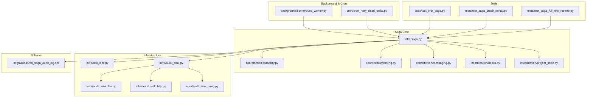
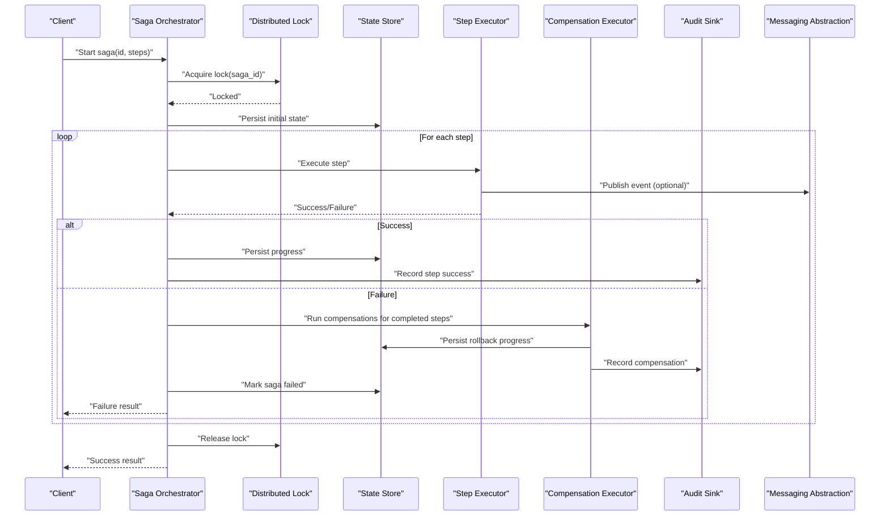
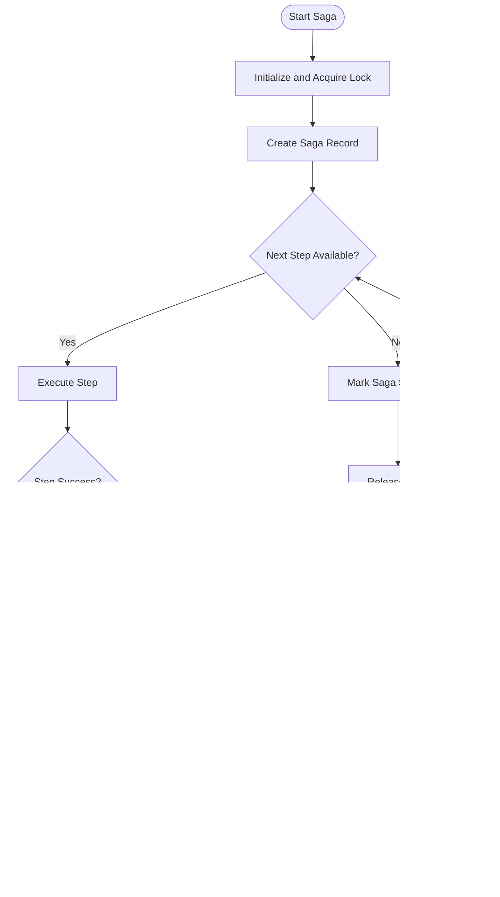
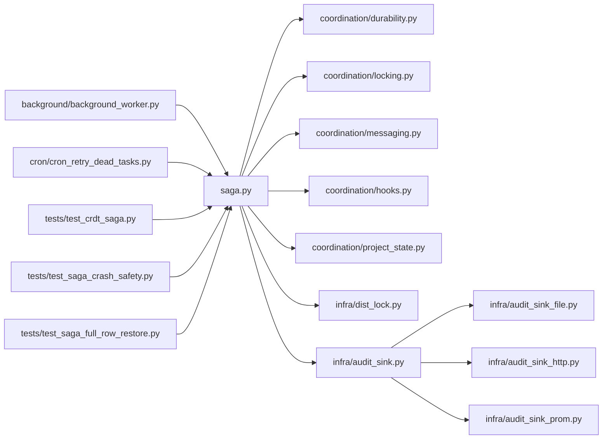

# Saga Pattern Implementation

<cite>
**Referenced Files in This Document**
- [saga.py](file://infra/saga.py)
- [test_crdt_saga.py](file://tests/test_crdt_saga.py)
- [test_saga_crash_safety.py](file://tests/test_saga_crash_safety.py)
- [test_saga_full_row_restore.py](file://tests/test_saga_full_row_restore.py)
- [068_saga_audit_log.sql](file://migrations/068_saga_audit_log.sql)
- [coordination/durability.py](file://coordination/durability.py)
- [coordination/locking.py](file://coordination/locking.py)
- [coordination/messaging.py](file://coordination/messaging.py)
- [coordination/hooks.py](file://coordination/hooks.py)
- [coordination/project_state.py](file://coordination/project_state.py)
- [background/background_worker.py](file://background/background_worker.py)
- [cron/cron_retry_dead_tasks.py](file://cron/cron_retry_dead_tasks.py)
- [infra/dist_lock.py](file://infra/dist_lock.py)
- [infra/audit_sink.py](file://infra/audit_sink.py)
- [infra/audit_sink_file.py](file://infra/audit_sink_file.py)
- [infra/audit_sink_http.py](file://infra/audit_sink_http.py)
- [infra/audit_sink_prom.py](file://infra/audit_sink_prom.py)
</cite>

## Table of Contents
1. [Introduction](#introduction)
2. [Project Structure](#project-structure)
3. [Core Components](#core-components)
4. [Architecture Overview](#architecture-overview)
5. [Detailed Component Analysis](#detailed-component-analysis)
6. [Dependency Analysis](#dependency-analysis)
7. [Performance Considerations](#performance-considerations)
8. [Troubleshooting Guide](#troubleshooting-guide)
9. [Conclusion](#conclusion)
10. [Appendices](#appendices)

## Introduction
This document explains the saga pattern implementation for distributed transactions within the project. It covers orchestration, compensating transactions, failure recovery, lifecycle management, state persistence, retry strategies, distributed locking coordination, idempotency guarantees, and audit trail maintenance. It also provides practical examples for complex workflows, partial failure handling, debugging rollbacks, monitoring execution, performance analysis, and scaling considerations for high-throughput scenarios.

## Project Structure
The saga implementation is centered around a core saga engine with supporting modules for durability, locking, messaging, hooks, and background processing. Tests validate crash safety, full row restore behavior, and CRDT-based saga semantics. Migration scripts provide schema for saga audit logs.

**Diagram sources**
- [saga.py](file://infra/saga.py)
- [coordination/durability.py](file://coordination/durability.py)
- [coordination/locking.py](file://coordination/locking.py)
- [coordination/messaging.py](file://coordination/messaging.py)
- [coordination/hooks.py](file://coordination/hooks.py)
- [coordination/project_state.py](file://coordination/project_state.py)
- [background/background_worker.py](file://background/background_worker.py)
- [cron/cron_retry_dead_tasks.py](file://cron/cron_retry_dead_tasks.py)
- [infra/dist_lock.py](file://infra/dist_lock.py)
- [infra/audit_sink.py](file://infra/audit_sink.py)
- [infra/audit_sink_file.py](file://infra/audit_sink_file.py)
- [infra/audit_sink_http.py](file://infra/audit_sink_http.py)
- [infra/audit_sink_prom.py](file://infra/audit_sink_prom.py)
- [068_saga_audit_log.sql](file://migrations/068_saga_audit_log.sql)
- [test_crdt_saga.py](file://tests/test_crdt_saga.py)
- [test_saga_crash_safety.py](file://tests/test_saga_crash_safety.py)
- [test_saga_full_row_restore.py](file://tests/test_saga_full_row_restore.py)

**Section sources**
- [saga.py](file://infra/saga.py)
- [coordination/durability.py](file://coordination/durability.py)
- [coordination/locking.py](file://coordination/locking.py)
- [coordination/messaging.py](file://coordination/messaging.py)
- [coordination/hooks.py](file://coordination/hooks.py)
- [coordination/project_state.py](file://coordination/project_state.py)
- [background/background_worker.py](file://background/background_worker.py)
- [cron/cron_retry_dead_tasks.py](file://cron/cron_retry_dead_tasks.py)
- [infra/dist_lock.py](file://infra/dist_lock.py)
- [infra/audit_sink.py](file://infra/audit_sink.py)
- [infra/audit_sink_file.py](file://infra/audit_sink_file.py)
- [infra/audit_sink_http.py](file://infra/audit_sink_http.py)
- [infra/audit_sink_prom.py](file://infra/audit_sink_prom.py)
- [068_saga_audit_log.sql](file://migrations/068_saga_audit_log.sql)
- [test_crdt_saga.py](file://tests/test_crdt_saga.py)
- [test_saga_crash_safety.py](file://tests/test_saga_crash_safety.py)
- [test_saga_full_row_restore.py](file://tests/test_saga_full_row_restore.py)

## Core Components
- Saga Orchestration Engine: Defines the saga lifecycle, step execution, compensation, and state transitions. It persists saga state and coordinates retries and rollbacks.
- Durability Layer: Ensures saga state and events are durable across process restarts and crashes.
- Distributed Locking Coordination: Provides cross-process locks to prevent concurrent saga instance interference.
- Messaging Abstraction: Publishes saga events and compensations to external systems or internal queues.
- Hooks and Project State: Integrates with project-scoped state and allows hook-driven side effects during saga steps.
- Background Worker and Retry Cron: Replays failed steps, recovers from dead tasks, and ensures eventual consistency.
- Audit Sink Implementations: Persist and forward audit records for observability and compliance.

Key responsibilities:
- Orchestrate forward steps and backward compensations deterministically.
- Maintain an immutable audit trail of all actions and outcomes.
- Guarantee idempotent operations via unique tokens and deduplication.
- Provide robust retry policies with backoff and circuit-breaking safeguards.

**Section sources**
- [saga.py](file://infra/saga.py)
- [coordination/durability.py](file://coordination/durability.py)
- [coordination/locking.py](file://coordination/locking.py)
- [coordination/messaging.py](file://coordination/messaging.py)
- [coordination/hooks.py](file://coordination/hooks.py)
- [coordination/project_state.py](file://coordination/project_state.py)
- [background/background_worker.py](file://background/background_worker.py)
- [cron/cron_retry_dead_tasks.py](file://cron/cron_retry_dead_tasks.py)
- [infra/audit_sink.py](file://infra/audit_sink.py)
- [infra/audit_sink_file.py](file://infra/audit_sink_file.py)
- [infra/audit_sink_http.py](file://infra/audit_sink_http.py)
- [infra/audit_sink_prom.py](file://infra/audit_sink_prom.py)

## Architecture Overview
The saga architecture separates orchestration from side effects. The orchestrator persists state before each step and after each compensation, ensuring recoverability. Distributed locks guard critical sections to avoid race conditions. Auditing is decoupled via sink implementations that can write to files, HTTP endpoints, or metrics backends.

**Diagram sources**
- [saga.py](file://infra/saga.py)
- [coordination/locking.py](file://coordination/locking.py)
- [coordination/messaging.py](file://coordination/messaging.py)
- [infra/audit_sink.py](file://infra/audit_sink.py)

## Detailed Component Analysis

### Saga Orchestration Engine
Responsibilities:
- Define step and compensation functions.
- Manage saga state machine transitions (created, running, succeeded, failed).
- Enforce idempotency using unique tokens.
- Persist state at safe points to ensure crash safety.
- Coordinate retries and escalation to compensations on failures.

Lifecycle:
- Initialization: Validate inputs, acquire locks, create saga record.
- Forward Execution: Execute steps sequentially; persist after each successful step.
- Compensation: On failure, execute compensations in reverse order; persist after each compensation.
- Completion: Mark saga succeeded or failed; release locks; emit final audit entries.

Idempotency:
- Each step and compensation should be designed to be idempotent.
- Use unique request IDs or tokens to deduplicate repeated executions.

Retry Strategy:
- Configurable retry counts and backoff intervals.
- Dead-letter handling for unrecoverable steps.

**Diagram sources**
- [saga.py](file://infra/saga.py)
- [coordination/locking.py](file://coordination/locking.py)
- [coordination/durability.py](file://coordination/durability.py)

**Section sources**
- [saga.py](file://infra/saga.py)
- [coordination/durability.py](file://coordination/durability.py)
- [coordination/locking.py](file://coordination/locking.py)

### Distributed Locking Coordination
Purpose:
- Prevent concurrent modifications to the same saga instance.
- Ensure only one worker executes a given saga’s steps or compensations.

Behavior:
- Acquire lock before starting saga execution.
- Scope locks by saga ID and tenant/project context.
- Release lock on completion or failure.
- Handle lock timeouts and contention gracefully.

Integration:
- Used by the orchestrator to serialize access.
- May be backed by database constraints or external lock services.

**Section sources**
- [coordination/locking.py](file://coordination/locking.py)
- [infra/dist_lock.py](file://infra/dist_lock.py)

### Messaging Abstraction
Purpose:
- Decouple saga steps from specific message brokers.
- Support optional event publishing for downstream consumers.

Capabilities:
- Publish step start, success, failure, and compensation events.
- Allow pluggable transports (in-memory, file, HTTP, etc.).

**Section sources**
- [coordination/messaging.py](file://coordination/messaging.py)

### Hooks and Project State
Purpose:
- Integrate saga execution with project-scoped state.
- Enable hook-driven side effects such as notifications or additional indexing.

Usage:
- Before/after step hooks for logging, metrics, or validation.
- Project state updates tied to saga milestones.

**Section sources**
- [coordination/hooks.py](file://coordination/hooks.py)
- [coordination/project_state.py](file://coordination/project_state.py)

### Background Worker and Retry Cron
Background Worker:
- Processes long-running or asynchronous saga steps.
- Manages task lifecycles and error propagation.

Retry Cron:
- Scans for dead or stalled tasks.
- Applies retry policies and escalates to compensations when necessary.

**Section sources**
- [background/background_worker.py](file://background/background_worker.py)
- [cron/cron_retry_dead_tasks.py](file://cron/cron_retry_dead_tasks.py)

### Audit Trail Maintenance
Components:
- Centralized audit sink interface.
- File-based sink for local persistence.
- HTTP sink for remote ingestion.
- Prometheus sink for metrics exposure.

Guarantees:
- Append-only records for all saga events.
- Idempotent writes where applicable.
- Resilient delivery with retry and fallback mechanisms.

**Section sources**
- [infra/audit_sink.py](file://infra/audit_sink.py)
- [infra/audit_sink_file.py](file://infra/audit_sink_file.py)
- [infra/audit_sink_http.py](file://infra/audit_sink_http.py)
- [infra/audit_sink_prom.py](file://infra/audit_sink_prom.py)
- [068_saga_audit_log.sql](file://migrations/068_saga_audit_log.sql)

### Practical Examples

#### Example: Complex Workflow with Partial Failures
- Scenario: A multi-step workflow involving data enrichment, indexing, and notification.
- Approach:
  - Define forward steps and corresponding compensations.
  - Use idempotency tokens per step to handle retries safely.
  - Persist state after each step to enable recovery.
  - On failure, run compensations in reverse order to restore consistency.
- Outcome:
  - Partial failures trigger targeted compensations without affecting unrelated steps.
  - Audit trail captures all actions for post-mortem analysis.

[No sources needed since this section provides conceptual guidance]

#### Example: Debugging Transaction Rollbacks
- Steps:
  - Inspect saga state transitions and audit entries.
  - Identify the failing step and its compensation outcome.
  - Verify idempotency token usage and lock acquisition/release.
  - Check background worker logs and cron retry attempts.
- Tools:
  - Audit sinks for persistent logs.
  - Metrics backend for performance insights.
  - Test suites for reproducing edge cases.

**Section sources**
- [test_saga_crash_safety.py](file://tests/test_saga_crash_safety.py)
- [test_saga_full_row_restore.py](file://tests/test_saga_full_row_restore.py)
- [test_crdt_saga.py](file://tests/test_crdt_saga.py)

## Dependency Analysis
The saga engine depends on coordination primitives (durability, locking, messaging), infrastructure components (distributed locks, audit sinks), and operational utilities (background workers, retry cron). Tests validate correctness under crash and restore scenarios.

**Diagram sources**
- [saga.py](file://infra/saga.py)
- [coordination/durability.py](file://coordination/durability.py)
- [coordination/locking.py](file://coordination/locking.py)
- [coordination/messaging.py](file://coordination/messaging.py)
- [coordination/hooks.py](file://coordination/hooks.py)
- [coordination/project_state.py](file://coordination/project_state.py)
- [infra/dist_lock.py](file://infra/dist_lock.py)
- [infra/audit_sink.py](file://infra/audit_sink.py)
- [infra/audit_sink_file.py](file://infra/audit_sink_file.py)
- [infra/audit_sink_http.py](file://infra/audit_sink_http.py)
- [infra/audit_sink_prom.py](file://infra/audit_sink_prom.py)
- [background/background_worker.py](file://background/background_worker.py)
- [cron/cron_retry_dead_tasks.py](file://cron/cron_retry_dead_tasks.py)
- [test_crdt_saga.py](file://tests/test_crdt_saga.py)
- [test_saga_crash_safety.py](file://tests/test_saga_crash_safety.py)
- [test_saga_full_row_restore.py](file://tests/test_saga_full_row_restore.py)

**Section sources**
- [saga.py](file://infra/saga.py)
- [coordination/durability.py](file://coordination/durability.py)
- [coordination/locking.py](file://coordination/locking.py)
- [coordination/messaging.py](file://coordination/messaging.py)
- [coordination/hooks.py](file://coordination/hooks.py)
- [coordination/project_state.py](file://coordination/project_state.py)
- [infra/dist_lock.py](file://infra/dist_lock.py)
- [infra/audit_sink.py](file://infra/audit_sink.py)
- [infra/audit_sink_file.py](file://infra/audit_sink_file.py)
- [infra/audit_sink_http.py](file://infra/audit_sink_http.py)
- [infra/audit_sink_prom.py](file://infra/audit_sink_prom.py)
- [background/background_worker.py](file://background/background_worker.py)
- [cron/cron_retry_dead_tasks.py](file://cron/cron_retry_dead_tasks.py)
- [test_crdt_saga.py](file://tests/test_crdt_saga.py)
- [test_saga_crash_safety.py](file://tests/test_saga_crash_safety.py)
- [test_saga_full_row_restore.py](file://tests/test_saga_full_row_restore.py)

## Performance Considerations
- Batched Auditing: Group audit writes to reduce I/O overhead.
- Asynchronous Messaging: Offload event publishing to background workers.
- Efficient Locking: Minimize lock scope and duration; use short-lived locks where possible.
- Retry Backoff: Apply exponential backoff with jitter to avoid thundering herds.
- Monitoring: Track step latency, compensation frequency, and retry rates via metrics sinks.
- Scaling: Horizontal scaling of workers with partitioned saga IDs to distribute load.

[No sources needed since this section provides general guidance]

## Troubleshooting Guide
Common issues and resolutions:
- Stalled Sagas:
  - Check background worker health and retry cron status.
  - Inspect audit logs for stuck steps and compensation outcomes.
- Lock Contention:
  - Review lock acquisition patterns and timeouts.
  - Ensure proper lock scoping by saga ID and tenant/project.
- Non-Idempotent Steps:
  - Validate idempotency tokens and deduplication logic.
  - Refactor steps to be safe for retries.
- Audit Gaps:
  - Verify audit sink connectivity and retry policies.
  - Confirm append-only semantics and consistent ordering.

Operational checks:
- Monitor metrics for step durations and failure rates.
- Correlate saga states with audit entries for root cause analysis.
- Reproduce failures using test suites focused on crash safety and full row restore.

**Section sources**
- [test_saga_crash_safety.py](file://tests/test_saga_crash_safety.py)
- [test_saga_full_row_restore.py](file://tests/test_saga_full_row_restore.py)
- [infra/audit_sink.py](file://infra/audit_sink.py)
- [infra/audit_sink_file.py](file://infra/audit_sink_file.py)
- [infra/audit_sink_http.py](file://infra/audit_sink_http.py)
- [infra/audit_sink_prom.py](file://infra/audit_sink_prom.py)

## Conclusion
The saga pattern implementation provides a robust framework for managing distributed transactions with clear orchestration, compensating transactions, and comprehensive failure recovery. By leveraging durable state persistence, distributed locking, idempotency guarantees, and rich audit trails, the system ensures reliability and observability. With background workers and retry cron jobs, it supports high-throughput scenarios while maintaining consistency and traceability.

[No sources needed since this section summarizes without analyzing specific files]

## Appendices

### Data Models and Schema
- Saga Audit Log:
  - Purpose: Immutable record of saga events, including step executions and compensations.
  - Fields: Typically include saga ID, step name, action type, timestamp, status, and metadata.
  - Migration: Provided by dedicated migration script.

**Section sources**
- [068_saga_audit_log.sql](file://migrations/068_saga_audit_log.sql)

### Testing Strategies
- Crash Safety:
  - Validates saga recovery after process termination mid-execution.
- Full Row Restore:
  - Ensures complete saga state restoration from persisted records.
- CRDT Integration:
  - Confirms saga behavior aligns with conflict-free replicated data types.

**Section sources**
- [test_crdt_saga.py](file://tests/test_crdt_saga.py)
- [test_saga_crash_safety.py](file://tests/test_saga_crash_safety.py)
- [test_saga_full_row_restore.py](file://tests/test_saga_full_row_restore.py)