# Security Hardening

<cite>
**Referenced Files in This Document**
- [security_model.md](file://docs/concepts/security-model.md)
- [tenant_isolation.md](file://docs/security/tenant_isolation.md)
- [audit_sink.md](file://docs/security/audit_sink.md)
- [gdpr_erase.md](file://docs/security/gdpr_erase.md)
- [sso_setup.md](file://docs/security/sso_setup.md)
- [ACCESS_CONTROL_POLICY.md](file://docs/compliance/ACCESS_CONTROL_POLICY.md)
- [INCIDENT_RESPONSE_PLAN.md](file://docs/compliance/INCIDENT_RESPONSE_PLAN.md)
- [RISK_ASSESSMENT.md](file://docs/compliance/RISK_ASSESSMENT.md)
- [EVIDENCE_COLLECTION_GUIDE.md](file://docs/compliance/EVIDENCE_COLLECTION_GUIDE.md)
- [CHANGE_MANAGEMENT_POLICY.md](file://docs/compliance/CHANGE_MANAGEMENT_POLICY.md)
- [DATA_RETENTION_POLICY.md](file://docs/compliance/DATA_RETENTION_POLICY.md)
- [infra/authlib_sso.py](file://infra/authlib_sso.py)
- [infra/rbac.py](file://infra/rbac.py)
- [infra/authorizer.py](file://infra/authorizer.py)
- [infra/audit.py](file://infra/audit.py)
- [infra/audit_sink.py](file://infra/audit_sink.py)
- [infra/audit_sink_file.py](file://infra/audit_sink_file.py)
- [infra/audit_sink_http.py](file://infra/audit_sink_http.py)
- [infra/audit_sink_prom.py](file://infra/audit_sink_prom.py)
- [infra/gdpr.py](file://infra/gdpr.py)
- [infra/scope.py](file://infra/scope.py)
- [infra/tenant_query.py](file://infra/tenant_query.py)
- [infra/config_drift_policy.py](file://infra/config_drift_policy.py)
- [infra/config_drift_runtime.py](file://infra/config_drift_runtime.py)
- [infra/config_drift_audit.py](file://infra/config_drift_audit.py)
- [infra/config_drift_escape.py](file://infra/config_drift_escape.py)
- [infra/config_drift_tier_patch.py](file://infra/config_drift_tier_patch.py)
- [infra/config_drift.py](file://infra/config_drift.py)
- [infra/mcp_auth.py](file://mcp_auth.py)
- [infra/api_server.py](file://infra/api_server.py)
- [infra/db.py](file://infra/db.py)
- [infra/memory_config.py](file://infra/memory_config.py)
- [infra/lock_manager.py](file://infra/lock_manager.py)
- [infra/file_lock.py](file://infra/file_lock.py)
- [infra/dist_lock.py](file://infra/dist_lock.py)
- [infra/sync_server.py](file://infra/sync_server.py)
- [infra/sync_client.py](file://infra/sync_client.py)
- [infra/pex_protocol.py](file://infra/pex_protocol.py)
- [infra/metrics_server.py](file://infra/metrics_server.py)
- [infra/alert.py](file://infra/alert.py)
- [infra/error_counter.py](file://infra/error_counter.py)
- [infra/log.py](file://infra/log.py)
- [infra/safe_call.py](file://infra/safe_call.py)
- [infra/rate_limiter.py](file://infra/rate_limiter.py)
- [infra/hash_utils.py](file://infra/hash_utils.py)
- [infra/circuit_breaker.py](file=background/circuit_breaker.py)
- [cron/cron_health_check.py](file=cron/cron_health_check.py)
- [cron/cron_watchdog.py](file=cron/cron_watchdog.py)
- [docker/entrypoint.sh](file=docker/entrypoint.sh)
- [Dockerfile](file=Dockerfile)
- [docker-compose.yml](file=docker-compose.yml)
- [test_api_auth_cookie.py](file=test/test_api_auth_cookie.py)
- [test_rbac_allows_with_role.py](file=test/test_rbac_allows_with_role.py)
- [test_rbac_denies_without_role.py](file=test/test_rbac_denies_without_role.py)
- [test_rbac_multi_tenant.py](file=test/test_rbac_multi_tenant.py)
- [test_rbac_admin_authz.py](file=test/test_rbac_admin_authz.py)
- [test_rbac_acl_override.py](file=test/test_rbac_acl_override.py)
- [test_rbac_schema.py](file/test/test_rbac_schema.py)
- [test_rest_tenant_isolation_e2e.py](file=test/test_rest_tenant_isolation_e2e.py)
- [test_sync_tenant_isolation.py](file=test/test_sync_tenant_isolation.py)
- [test_tenant_isolation_exhaustive.py](file=test/test_tenant_isolation_exhaustive.py)
- [test_audit_logging.py](file=test/test_audit_logging.py)
- [test_audit_log.py](file=test/test_audit_log.py)
- [test_audit_sink_http.py](file=test/test_audit_sink_http.py)
- [test_audit_sink_dead_letter.py](file=test/test_audit_sink_dead_letter.py)
- [test_audit_sink_drops_on_5xx.py](file=test/test_audit_sink_drops_on_5xx.py)
- [test_audit_sink_principal_redact.py](file=test/test_audit_sink_principal_redact.py)
- [test_gdpr_erase_full_cascade.py](file=test/test_gdpr_erase_full_cascade.py)
- [test_gdpr_erase_certificate.py](file=test/test_gdpr_erase_certificate.py)
- [test_gdpr_subject_fallback.py](file=test/test_gdpr_subject_fallback.py)
- [test_gdpr_erase_refuses_cross_tenant.py](file=test/test_gdpr_erase_refuses_cross_tenant.py)
- [test_security_health_check.py](file=test/test_security_health_check.py)
- [test_security_sync_auth.py](file=test/test_security_sync_auth.py)
- [test_sso_idp_metadata_cache.py](file=test/test_sso_idp_metadata_cache.py)
- [test_sso_jwt_validation.py](file=test/test_sso_jwt_validation.py)
- [test_sso_principal_creation.py](file=test/test_sso_principal_creation.py)
- [test_closed_auth_client.py](file=test/test_closed_auth_client.py)
- [test_config_drift_policy.py](file=test/test_config_drift_policy.py)
- [test_config_drift_runtime.py](file=test/test_config_drift_runtime.py)
- [test_config_drift_audit.py](file=test/test_config_drift_audit.py)
- [test_config_drift_escape.py](file=test/test_config_drift_escape.py)
- [test_config_drift_init_hook.py](file=test/test_config_drift_init_hook.py)
- [test_config_drift_persistence.py](file=test/test_config_drift_persistence.py)
- [test_config_drift_tier_overrides.py](file=test/test_config_drift_tier_overrides.py)
- [test_config_drift_tier_patching.py](file=test/test_config_drift_tier_patching.py)
- [test_config_drift_tier_reset.py](file=test/test_config_drift_tier_reset.py)
- [test_config_drift_enforcement.py](file=test/test_config_drift_enforcement.py)
- [test_config_drift_policy_hash.py](file=test/test_config_drift_policy_hash.py)
- [test_config_drift_policy_status.py](file=test/test_config_drift_policy_status.py)
- [test_config_drift_policy_fetcher.py](file=test/test_config_drift_policy_fetcher.py)
- [test_config_drift_policy_hash_cache.py](file=test/test_config_drift_policy_hash_cache.py)
- [test_config_drift_policy_hash_diff.py](file=test/test_config_drift_policy_hash_diff.py)
- [test_config_drift_policy_hash_status.py](file=test/test_config_drift_policy_hash_status.py)
- [test_config_drift_policy_hash_fetcher.py](file=test/test_config_drift_policy_hash_fetcher.py)
- [test_config_drift_policy_hash_cache.py](file=test/test_config_drift_policy_hash_cache.py)
- [test_config_drift_policy_hash_diff.py](file=test/test_config_drift_policy_hash_diff.py)
- [test_config_drift_policy_hash_status.py](file=test/test_config_drift_policy_hash_status.py)
- [test_config_drift_policy_hash_fetcher.py](file=test/test_config_drift_policy_hash_fetcher.py)
- [test_config_drift_policy_hash_cache.py](file=test/test_config_drift_policy_hash_cache.py)
- [test_config_drift_policy_hash_diff.py](file=test/test_config_drift_policy_hash_diff.py)
- [test_config_drift_policy_hash_status.py](file=test/test_config_drift_policy_hash_status.py)
- [test_config_drift_policy_hash_fetcher.py](file=test/test_config_drift_policy_hash_fetcher.py)
</cite>

## Table of Contents
1. Introduction
2. Project Structure
3. Core Components
4. Architecture Overview
5. Detailed Component Analysis
6. Dependency Analysis
7. Performance Considerations
8. Troubleshooting Guide
9. Conclusion
10. Appendices

## Introduction
This document provides security hardening and production deployment guidance for the system, focusing on authentication mechanisms, role-based access control (RBAC), tenant isolation, audit logging, compliance requirements, data privacy protections, input validation, SQL injection prevention, secure API design patterns, vulnerability assessment, penetration testing guidelines, incident response procedures, secure configuration management, secret handling, and environment isolation. It synthesizes implementation details from source files and tests to provide actionable guidance for operators and developers.

## Project Structure
Security-related capabilities are implemented across several modules:
- Authentication and SSO integration
- RBAC policy enforcement and authorization
- Tenant scoping and isolation
- Audit logging and sinks
- GDPR and data privacy features
- Configuration drift detection and enforcement
- Secure transport and runtime hardening

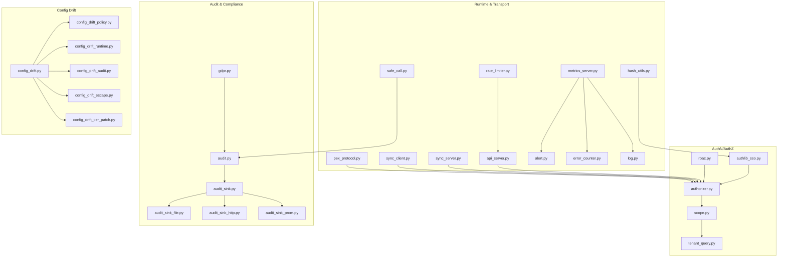

**Diagram sources**
- [infra/authlib_sso.py](file://infra/authlib_sso.py)
- [infra/rbac.py](file://infra/rbac.py)
- [infra/authorizer.py](file://infra/authorizer.py)
- [infra/scope.py](file://infra/scope.py)
- [infra/tenant_query.py](file://infra/tenant_query.py)
- [infra/audit.py](file://infra/audit.py)
- [infra/audit_sink.py](file://infra/audit_sink.py)
- [infra/audit_sink_file.py](file://infra/audit_sink_file.py)
- [infra/audit_sink_http.py](file://infra/audit_sink_http.py)
- [infra/audit_sink_prom.py](file://infra/audit_sink_prom.py)
- [infra/gdpr.py](file://infra/gdpr.py)
- [infra/api_server.py](file://infra/api_server.py)
- [infra/sync_server.py](file://infra/sync_server.py)
- [infra/sync_client.py](file://infra/sync_client.py)
- [infra/pex_protocol.py](file://infra/pex_protocol.py)
- [infra/metrics_server.py](file://infra/metrics_server.py)
- [infra/alert.py](file://infra/alert.py)
- [infra/error_counter.py](file://infra/error_counter.py)
- [infra/log.py](file://infra/log.py)
- [infra/safe_call.py](file://infra/safe_call.py)
- [infra/rate_limiter.py](file://infra/rate_limiter.py)
- [infra/hash_utils.py](file://infra/hash_utils.py)
- [infra/config_drift.py](file://infra/config_drift.py)
- [infra/config_drift_policy.py](file://infra/config_drift_policy.py)
- [infra/config_drift_runtime.py](file://infra/config_drift_runtime.py)
- [infra/config_drift_audit.py](file://infra/config_drift_audit.py)
- [infra/config_drift_escape.py](file://infra/config_drift_escape.py)
- [infra/config_drift_tier_patch.py](file://infra/config_drift_tier_patch.py)

**Section sources**
- [security_model.md](file://docs/concepts/security-model.md)
- [tenant_isolation.md](file://docs/security/tenant_isolation.md)
- [audit_sink.md](file://docs/security/audit_sink.md)
- [sso_setup.md](file://docs/security/sso_setup.md)
- [ACCESS_CONTROL_POLICY.md](file://docs/compliance/ACCESS_CONTROL_POLICY.md)
- [INCIDENT_RESPONSE_PLAN.md](file://docs/compliance/INCIDENT_RESPONSE_PLAN.md)
- [RISK_ASSESSMENT.md](file://docs/compliance/RISK_ASSESSMENT.md)
- [EVIDENCE_COLLECTION_GUIDE.md](file://docs/compliance/EVIDENCE_COLLECTION_GUIDE.md)
- [CHANGE_MANAGEMENT_POLICY.md](file://docs/compliance/CHANGE_MANAGEMENT_POLICY.md)
- [DATA_RETENTION_POLICY.md](file://docs/compliance/DATA_RETENTION_POLICY.md)

## Core Components
- Authentication and SSO: Integrates with external identity providers via Authlib and validates tokens securely. See [infra/authlib_sso.py](file://infra/authlib_sso.py).
- RBAC and Authorization: Centralized policy evaluation and principal-scoped checks. See [infra/rbac.py](file://infra/rbac.py), [infra/authorizer.py](file://infra/authorizer.py).
- Tenant Isolation: Scopes queries and mutations by tenant context. See [infra/scope.py](file://infra/scope.py), [infra/tenant_query.py](file://infra/tenant_query.py).
- Audit Logging: Structured event emission and pluggable sinks (file, HTTP, Prometheus). See [infra/audit.py](file://infra/audit.py), [infra/audit_sink.py](file://infra/audit_sink.py), [infra/audit_sink_file.py](file://infra/audit_sink_file.py), [infra/audit_sink_http.py](file://infra/audit_sink_http.py), [infra/audit_sink_prom.py](file://infra/audit_sink_prom.py).
- Data Privacy (GDPR): Subject erasure workflows and cross-tenant safeguards. See [infra/gdpr.py](file://infra/gdpr.py).
- Configuration Drift Detection: Policy-driven drift detection, auditing, and escape hatch controls. See [infra/config_drift.py](file://infra/config_drift.py), [infra/config_drift_policy.py](file://infra/config_drift_policy.py), [infra/config_drift_runtime.py](file://infra/config_drift_runtime.py), [infra/config_drift_audit.py](file://infra/config_drift_audit.py), [infra/config_drift_escape.py](file://infra/config_drift_escape.py), [infra/config_drift_tier_patch.py](file://infra/config_drift_tier_patch.py).
- Secure Runtime: Rate limiting, safe call wrappers, metrics, alerts, error counters, structured logging. See [infra/rate_limiter.py](file://infra/rate_limiter.py), [infra/safe_call.py](file://infra/safe_call.py), [infra/metrics_server.py](file://infra/metrics_server.py), [infra/alert.py](file://infra/alert.py), [infra/error_counter.py](file://infra/error_counter.py), [infra/log.py](file://infra/log.py).
- Transport Security: TLS-enabled sync server/client and protocol-level protections. See [infra/sync_server.py](file://infra/sync_server.py), [infra/sync_client.py](file://infra/sync_client.py), [infra/pex_protocol.py](file://infra/pex_protocol.py).

**Section sources**
- [infra/authlib_sso.py](file://infra/authlib_sso.py)
- [infra/rbac.py](file://infra/rbac.py)
- [infra/authorizer.py](file://infra/authorizer.py)
- [infra/scope.py](file://infra/scope.py)
- [infra/tenant_query.py](file://infra/tenant_query.py)
- [infra/audit.py](file://infra/audit.py)
- [infra/audit_sink.py](file://infra/audit_sink.py)
- [infra/audit_sink_file.py](file://infra/audit_sink_file.py)
- [infra/audit_sink_http.py](file://infra/audit_sink_http.py)
- [infra/audit_sink_prom.py](file://infra/audit_sink_prom.py)
- [infra/gdpr.py](file://infra/gdpr.py)
- [infra/config_drift.py](file://infra/config_drift.py)
- [infra/config_drift_policy.py](file://infra/config_drift_policy.py)
- [infra/config_drift_runtime.py](file://infra/config_drift_runtime.py)
- [infra/config_drift_audit.py](file://infra/config_drift_audit.py)
- [infra/config_drift_escape.py](file://infra/config_drift_escape.py)
- [infra/config_drift_tier_patch.py](file://infra/config_drift_tier_patch.py)
- [infra/rate_limiter.py](file://infra/rate_limiter.py)
- [infra/safe_call.py](file://infra/safe_call.py)
- [infra/metrics_server.py](file://infra/metrics_server.py)
- [infra/alert.py](file://infra/alert.py)
- [infra/error_counter.py](file://infra/error_counter.py)
- [infra/log.py](file://infra/log.py)
- [infra/sync_server.py](file://infra/sync_server.py)
- [infra/sync_client.py](file://infra/sync_client.py)
- [infra/pex_protocol.py](file://infra/pex_protocol.py)

## Architecture Overview
The security architecture layers authentication at the edge, enforces RBAC centrally, scopes all operations by tenant, emits comprehensive audit events, and applies configuration drift policies to maintain a hardened posture.

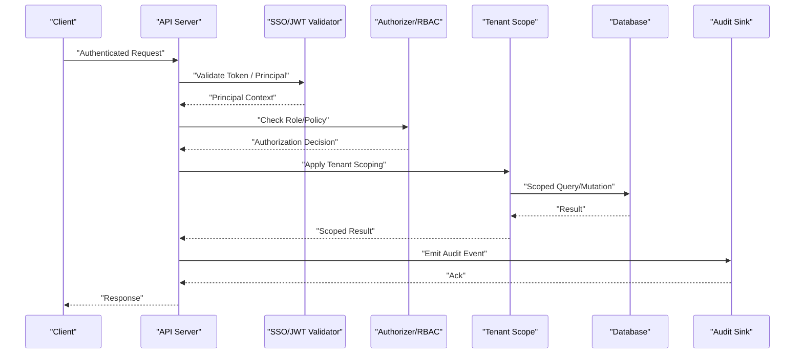

**Diagram sources**
- [infra/api_server.py](file://infra/api_server.py)
- [infra/authlib_sso.py](file://infra/authlib_sso.py)
- [infra/authorizer.py](file://infra/authorizer.py)
- [infra/rbac.py](file://infra/rbac.py)
- [infra/scope.py](file://infra/scope.py)
- [infra/tenant_query.py](file://infra/tenant_query.py)
- [infra/audit.py](file://infra/audit.py)
- [infra/audit_sink.py](file://infra/audit_sink.py)

## Detailed Component Analysis

### Authentication and SSO
- External IdP integration via Authlib with JWT validation and principal creation flows.
- Cookie-based auth support for dashboard sessions.
- Closed-auth client mode for strict environments.

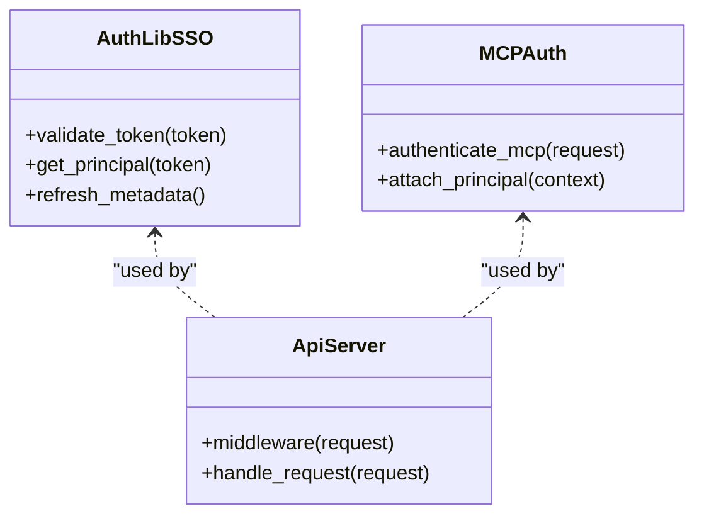

**Diagram sources**
- [infra/authlib_sso.py](file://infra/authlib_sso.py)
- [infra/mcp_auth.py](file://infra/mcp_auth.py)
- [infra/api_server.py](file://infra/api_server.py)

**Section sources**
- [infra/authlib_sso.py](file://infra/authlib_sso.py)
- [infra/mcp_auth.py](file://infra/mcp_auth.py)
- [infra/api_server.py](file://infra/api_server.py)
- [test_api_auth_cookie.py](file://test/test_api_auth_cookie.py)
- [test_closed_auth_client.py](file://test/test_closed_auth_client.py)
- [test_sso_jwt_validation.py](file://test/test_sso_jwt_validation.py)
- [test_sso_principal_creation.py](file://test/test_sso_principal_creation.py)
- [test_sso_idp_metadata_cache.py](file://test/test_sso_idp_metadata_cache.py)

### Role-Based Access Control (RBAC)
- Centralized policy evaluation with built-in roles and ACL overrides.
- Multi-tenant aware checks and admin authorizations.
- Schema-backed role definitions and default seeding.

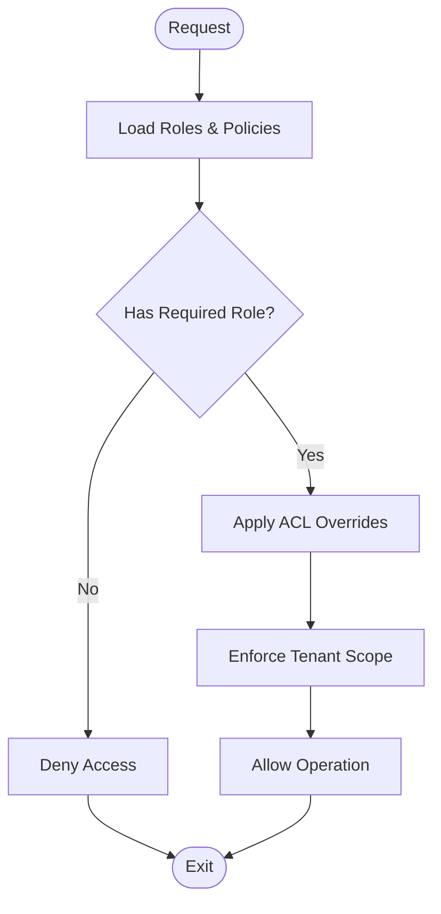

**Diagram sources**
- [infra/rbac.py](file://infra/rbac.py)
- [infra/authorizer.py](file://infra/authorizer.py)
- [infra/scope.py](file://infra/scope.py)

**Section sources**
- [infra/rbac.py](file://infra/rbac.py)
- [infra/authorizer.py](file://infra/authorizer.py)
- [test_rbac_allows_with_role.py](file://test/test_rbac_allows_with_role.py)
- [test_rbac_denies_without_role.py](file://test/test_rbac_denies_without_role.py)
- [test_rbac_multi_tenant.py](file://test/test_rbac_multi_tenant.py)
- [test_rbac_admin_authz.py](file://test/test_rbac_admin_authz.py)
- [test_rbac_acl_override.py](file://test/test_rbac_acl_override.py)
- [test_rbac_schema.py](file://test/test_rbac_schema.py)

### Tenant Isolation Strategies
- Contextual scoping ensures all reads/writes are bound to a tenant.
- Cross-tenant operations are explicitly rejected.
- End-to-end REST and sync paths enforce isolation.

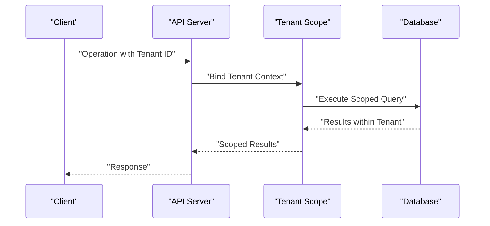

**Diagram sources**
- [infra/scope.py](file://infra/scope.py)
- [infra/tenant_query.py](file://infra/tenant_query.py)
- [infra/api_server.py](file://infra/api_server.py)

**Section sources**
- [infra/scope.py](file://infra/scope.py)
- [infra/tenant_query.py](file://infra/tenant_query.py)
- [test_rest_tenant_isolation_e2e.py](file://test/test_rest_tenant_isolation_e2e.py)
- [test_sync_tenant_isolation.py](file://test/test_sync_tenant_isolation.py)
- [test_tenant_isolation_exhaustive.py](file://test/test_tenant_isolation_exhaustive.py)

### Audit Logging and Compliance
- Structured audit events emitted across critical operations.
- Pluggable sinks: file, HTTP, Prometheus.
- Dead-letter handling and redaction of sensitive fields.

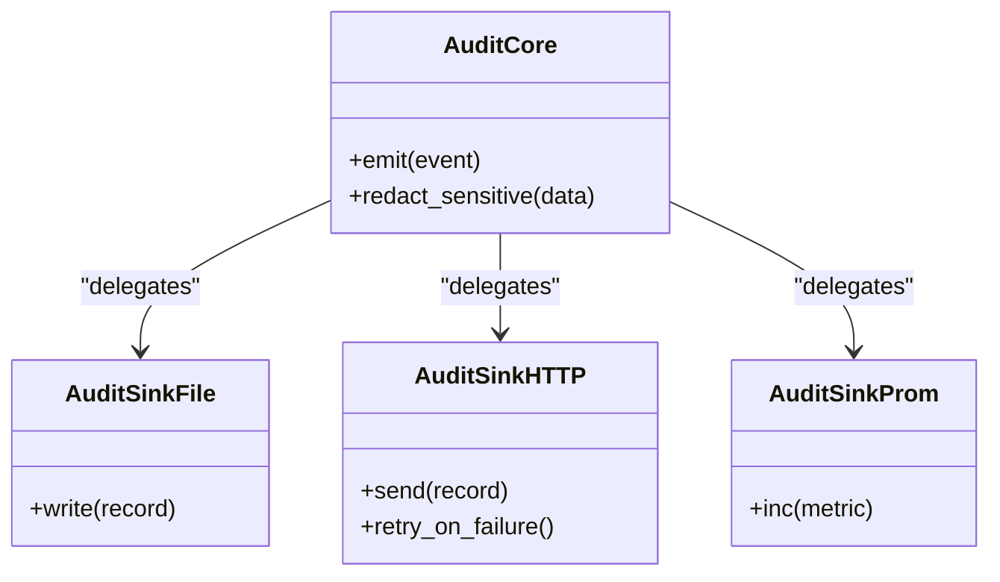

**Diagram sources**
- [infra/audit.py](file://infra/audit.py)
- [infra/audit_sink.py](file://infra/audit_sink.py)
- [infra/audit_sink_file.py](file://infra/audit_sink_file.py)
- [infra/audit_sink_http.py](file://infra/audit_sink_http.py)
- [infra/audit_sink_prom.py](file://infra/audit_sink_prom.py)

**Section sources**
- [infra/audit.py](file://infra/audit.py)
- [infra/audit_sink.py](file://infra/audit_sink.py)
- [infra/audit_sink_file.py](file://infra/audit_sink_file.py)
- [infra/audit_sink_http.py](file://infra/audit_sink_http.py)
- [infra/audit_sink_prom.py](file://infra/audit_sink_prom.py)
- [test_audit_logging.py](file://test/test_audit_logging.py)
- [test_audit_log.py](file://test/test_audit_log.py)
- [test_audit_sink_http.py](file://test/test_audit_sink_http.py)
- [test_audit_sink_dead_letter.py](file://test/test_audit_sink_dead_letter.py)
- [test_audit_sink_drops_on_5xx.py](file://test/test_audit_sink_drops_on_5xx.py)
- [test_audit_sink_principal_redact.py](file://test/test_audit_sink_principal_redact.py)

### Data Privacy Protections (GDPR)
- Subject erasure cascades across related entities.
- Certificate generation for erasure requests.
- Fallback strategies and cross-tenant refusal.

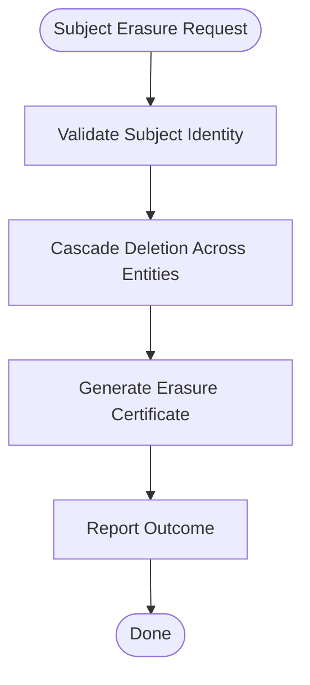

**Diagram sources**
- [infra/gdpr.py](file://infra/gdpr.py)

**Section sources**
- [infra/gdpr.py](file://infra/gdpr.py)
- [test_gdpr_erase_full_cascade.py](file://test/test_gdpr_erase_full_cascade.py)
- [test_gdpr_erase_certificate.py](file://test/test_gdpr_erase_certificate.py)
- [test_gdpr_subject_fallback.py](file://test/test_gdpr_subject_fallback.py)
- [test_gdpr_erase_refuses_cross_tenant.py](file://test/test_gdpr_erase_refuses_cross_tenant.py)

### Input Validation, SQL Injection Prevention, and Secure API Design
- Parameterized queries and ORM usage reduce SQL injection risk.
- Strict request validation and schema enforcement at API boundaries.
- Safe call wrappers and rate limiting protect against abuse.

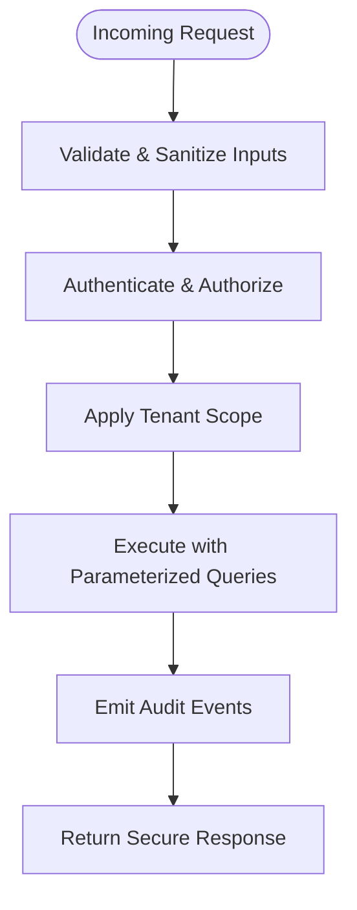

**Diagram sources**
- [infra/api_server.py](file://infra/api_server.py)
- [infra/db.py](file://infra/db.py)
- [infra/safe_call.py](file://infra/safe_call.py)
- [infra/rate_limiter.py](file://infra/rate_limiter.py)

**Section sources**
- [infra/api_server.py](file://infra/api_server.py)
- [infra/db.py](file://infra/db.py)
- [infra/safe_call.py](file://infra/safe_call.py)
- [infra/rate_limiter.py](file://infra/rate_limiter.py)

### Configuration Drift Detection and Enforcement
- Policy-driven drift detection with runtime enforcement and audit trails.
- Escape hatches and tiered patching for controlled exceptions.
- Hash caching and diffing for efficient policy comparisons.

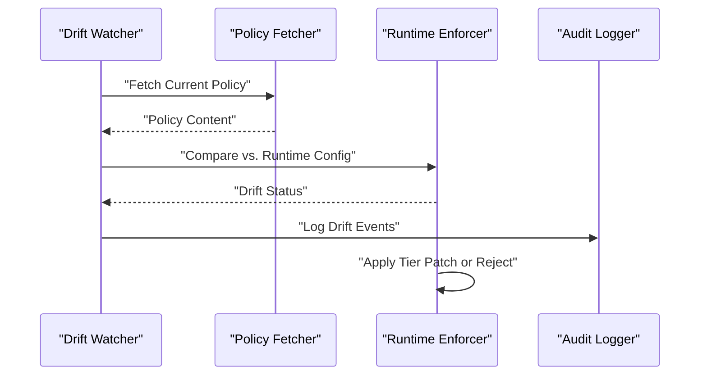

**Diagram sources**
- [infra/config_drift.py](file://infra/config_drift.py)
- [infra/config_drift_policy.py](file://infra/config_drift_policy.py)
- [infra/config_drift_runtime.py](file://infra/config_drift_runtime.py)
- [infra/config_drift_audit.py](file://infra/config_drift_audit.py)
- [infra/config_drift_escape.py](file://infra/config_drift_escape.py)
- [infra/config_drift_tier_patch.py](file://infra/config_drift_tier_patch.py)

**Section sources**
- [infra/config_drift.py](file://infra/config_drift.py)
- [infra/config_drift_policy.py](file://infra/config_drift_policy.py)
- [infra/config_drift_runtime.py](file://infra/config_drift_runtime.py)
- [infra/config_drift_audit.py](file://infra/config_drift_audit.py)
- [infra/config_drift_escape.py](file://infra/config_drift_escape.py)
- [infra/config_drift_tier_patch.py](file://infra/config_drift_tier_patch.py)
- [test_config_drift_policy.py](file://test/test_config_drift_policy.py)
- [test_config_drift_runtime.py](file://test/test_config_drift_runtime.py)
- [test_config_drift_audit.py](file://test/test_config_drift_audit.py)
- [test_config_drift_escape.py](file://test/test_config_drift_escape.py)
- [test_config_drift_init_hook.py](file://test/test_config_drift_init_hook.py)
- [test_config_drift_persistence.py](file://test/test_config_drift_persistence.py)
- [test_config_drift_tier_overrides.py](file://test/test_config_drift_tier_overrides.py)
- [test_config_drift_tier_patching.py](file://test/test_config_drift_tier_patching.py)
- [test_config_drift_tier_reset.py](file://test/test_config_drift_tier_reset.py)
- [test_config_drift_enforcement.py](file://test/test_config_drift_enforcement.py)
- [test_config_drift_policy_hash.py](file://test/test_config_drift_policy_hash.py)
- [test_config_drift_policy_status.py](file://test/test_config_drift_policy_status.py)
- [test_config_drift_policy_fetcher.py](file://test/test_config_drift_policy_fetcher.py)
- [test_config_drift_policy_hash_cache.py](file://test/test_config_drift_policy_hash_cache.py)
- [test_config_drift_policy_hash_diff.py](file://test/test_config_drift_policy_hash_diff.py)
- [test_config_drift_policy_hash_status.py](file://test/test_config_drift_policy_hash_status.py)
- [test_config_drift_policy_hash_fetcher.py](file://test/test_config_drift_policy_hash_fetcher.py)

### Secure Transport and Environment Isolation
- TLS-enabled sync server/client and protocol-level protections.
- Dockerized deployments with hardened entrypoints and compose configurations.
- Health checks and watchdogs ensure operational resilience.

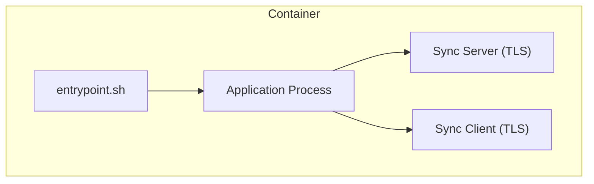

**Diagram sources**
- [docker/entrypoint.sh](file=docker/entrypoint.sh)
- [Dockerfile](file=Dockerfile)
- [docker-compose.yml](file=docker-compose.yml)
- [infra/sync_server.py](file://infra/sync_server.py)
- [infra/sync_client.py](file://infra/sync_client.py)
- [infra/pex_protocol.py](file://infra/pex_protocol.py)

**Section sources**
- [docker/entrypoint.sh](file=docker/entrypoint.sh)
- [Dockerfile](file=Dockerfile)
- [docker-compose.yml](file=docker-compose.yml)
- [infra/sync_server.py](file://infra/sync_server.py)
- [infra/sync_client.py](file://infra/sync_client.py)
- [infra/pex_protocol.py](file://infra/pex_protocol.py)
- [cron/cron_health_check.py](file=cron/cron_health_check.py)
- [cron/cron_watchdog.py](file=cron/cron_watchdog.py)

## Dependency Analysis
Security components depend on shared infrastructure for logging, metrics, locking, and database access. The following diagram highlights key relationships.

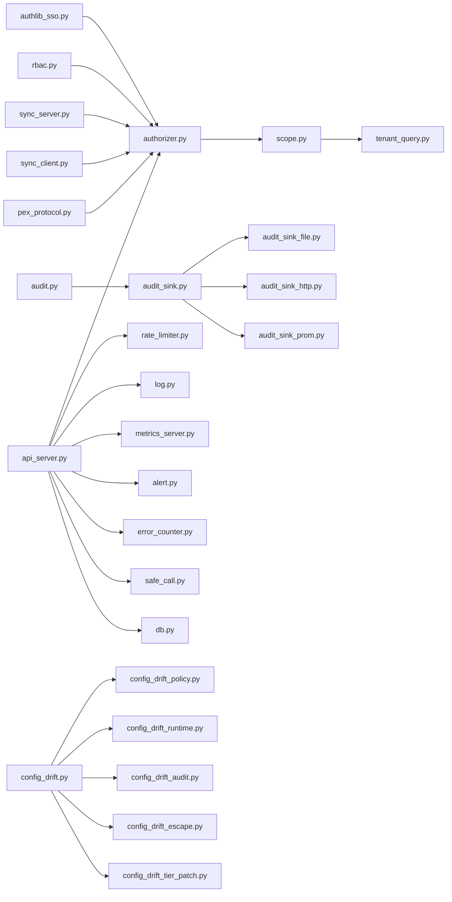

**Diagram sources**
- [infra/authlib_sso.py](file://infra/authlib_sso.py)
- [infra/authorizer.py](file://infra/authorizer.py)
- [infra/rbac.py](file://infra/rbac.py)
- [infra/scope.py](file://infra/scope.py)
- [infra/tenant_query.py](file://infra/tenant_query.py)
- [infra/audit.py](file://infra/audit.py)
- [infra/audit_sink.py](file://infra/audit_sink.py)
- [infra/audit_sink_file.py](file://infra/audit_sink_file.py)
- [infra/audit_sink_http.py](file://infra/audit_sink_http.py)
- [infra/audit_sink_prom.py](file://infra/audit_sink_prom.py)
- [infra/api_server.py](file://infra/api_server.py)
- [infra/rate_limiter.py](file://infra/rate_limiter.py)
- [infra/log.py](file://infra/log.py)
- [infra/metrics_server.py](file://infra/metrics_server.py)
- [infra/alert.py](file://infra/alert.py)
- [infra/error_counter.py](file://infra/error_counter.py)
- [infra/safe_call.py](file://infra/safe_call.py)
- [infra/db.py](file://infra/db.py)
- [infra/sync_server.py](file://infra/sync_server.py)
- [infra/sync_client.py](file://infra/sync_client.py)
- [infra/pex_protocol.py](file://infra/pex_protocol.py)
- [infra/config_drift.py](file://infra/config_drift.py)
- [infra/config_drift_policy.py](file://infra/config_drift_policy.py)
- [infra/config_drift_runtime.py](file://infra/config_drift_runtime.py)
- [infra/config_drift_audit.py](file://infra/config_drift_audit.py)
- [infra/config_drift_escape.py](file://infra/config_drift_escape.py)
- [infra/config_drift_tier_patch.py](file://infra/config_drift_tier_patch.py)

**Section sources**
- [infra/authlib_sso.py](file://infra/authlib_sso.py)
- [infra/authorizer.py](file://infra/authorizer.py)
- [infra/rbac.py](file://infra/rbac.py)
- [infra/scope.py](file://infra/scope.py)
- [infra/tenant_query.py](file://infra/tenant_query.py)
- [infra/audit.py](file://infra/audit.py)
- [infra/audit_sink.py](file://infra/audit_sink.py)
- [infra/audit_sink_file.py](file://infra/audit_sink_file.py)
- [infra/audit_sink_http.py](file://infra/audit_sink_http.py)
- [infra/audit_sink_prom.py](file://infra/audit_sink_prom.py)
- [infra/api_server.py](file://infra/api_server.py)
- [infra/rate_limiter.py](file://infra/rate_limiter.py)
- [infra/log.py](file://infra/log.py)
- [infra/metrics_server.py](file://infra/metrics_server.py)
- [infra/alert.py](file://infra/alert.py)
- [infra/error_counter.py](file://infra/error_counter.py)
- [infra/safe_call.py](file://infra/safe_call.py)
- [infra/db.py](file://infra/db.py)
- [infra/sync_server.py](file://infra/sync_server.py)
- [infra/sync_client.py](file://infra/sync_client.py)
- [infra/pex_protocol.py](file://infra/pex_protocol.py)
- [infra/config_drift.py](file://infra/config_drift.py)
- [infra/config_drift_policy.py](file://infra/config_drift_policy.py)
- [infra/config_drift_runtime.py](file://infra/config_drift_runtime.py)
- [infra/config_drift_audit.py](file://infra/config_drift_audit.py)
- [infra/config_drift_escape.py](file://infra/config_drift_escape.py)
- [infra/config_drift_tier_patch.py](file://infra/config_drift_tier_patch.py)

## Performance Considerations
- Prefer parameterized queries and avoid dynamic SQL construction to minimize overhead and risks.
- Use connection pooling and short-lived transactions to reduce contention under load.
- Enable rate limiting and circuit breakers to protect backend resources during spikes.
- Offload heavy tasks to background workers and cron jobs; monitor health and watchdogs.
- Cache policy hashes and metadata where appropriate to reduce repeated fetches.

[No sources needed since this section provides general guidance]

## Troubleshooting Guide
- Authentication failures: Inspect SSO token validation logs and principal creation flows.
- Authorization denials: Review RBAC policy evaluations and ACL overrides.
- Tenant isolation issues: Verify tenant context propagation and scoped query execution.
- Audit sink problems: Check dead-letter queues, HTTP status codes, and Prometheus metrics.
- GDPR erasures: Confirm cascade deletions and certificate issuance.
- Configuration drift: Examine drift reports, escape hatch usage, and tier patches.
- Operational health: Monitor health checks, watchdogs, alerts, and error counters.

**Section sources**
- [infra/authlib_sso.py](file://infra/authlib_sso.py)
- [infra/rbac.py](file://infra/rbac.py)
- [infra/authorizer.py](file://infra/authorizer.py)
- [infra/scope.py](file://infra/scope.py)
- [infra/tenant_query.py](file://infra/tenant_query.py)
- [infra/audit.py](file://infra/audit.py)
- [infra/audit_sink_http.py](file://infra/audit_sink_http.py)
- [infra/audit_sink_prom.py](file://infra/audit_sink_prom.py)
- [infra/gdpr.py](file://infra/gdpr.py)
- [infra/config_drift.py](file://infra/config_drift.py)
- [infra/config_drift_audit.py](file://infra/config_drift_audit.py)
- [infra/config_drift_escape.py](file://infra/config_drift_escape.py)
- [infra/config_drift_tier_patch.py](file://infra/config_drift_tier_patch.py)
- [infra/metrics_server.py](file://infra/metrics_server.py)
- [infra/alert.py](file://infra/alert.py)
- [infra/error_counter.py](file://infra/error_counter.py)
- [cron/cron_health_check.py](file=cron/cron_health_check.py)
- [cron/cron_watchdog.py](file=cron/cron_watchdog.py)

## Conclusion
By integrating robust authentication, centralized RBAC, strict tenant isolation, comprehensive audit logging, and proactive configuration drift enforcement, the system achieves a strong security posture suitable for production. Operators should continuously validate these controls through automated tests, monitoring, and periodic assessments aligned with compliance policies.

[No sources needed since this section summarizes without analyzing specific files]

## Appendices

### Practical Examples and How-To References
- Custom auth provider setup: See [sso_setup.md](file://docs/security/sso_setup.md) and [infra/authlib_sso.py](file://infra/authlib_sso.py).
- Configuring RBAC policies: See [ACCESS_CONTROL_POLICY.md](file://docs/compliance/ACCESS_CONTROL_POLICY.md), [infra/rbac.py](file://infra/rbac.py), and [infra/authorizer.py](file://infra/authorizer.py).
- Setting up audit trails: See [audit_sink.md](file://docs/security/audit_sink.md), [infra/audit.py](file://infra/audit.py), and sink implementations.
- Tenant isolation strategies: See [tenant_isolation.md](file://docs/security/tenant_isolation.md), [infra/scope.py](file://infra/scope.py), and [infra/tenant_query.py](file://infra/tenant_query.py).
- GDPR erasure workflows: See [gdpr_erase.md](file://docs/security/gdpr_erase.md) and [infra/gdpr.py](file://infra/gdpr.py).
- Vulnerability assessment and pen testing: See [RISK_ASSESSMENT.md](file://docs/compliance/RISK_ASSESSMENT.md) and [EVIDENCE_COLLECTION_GUIDE.md](file://docs/compliance/EVIDENCE_COLLECTION_GUIDE.md).
- Incident response procedures: See [INCIDENT_RESPONSE_PLAN.md](file://docs/compliance/INCIDENT_RESPONSE_PLAN.md).
- Change management and data retention: See [CHANGE_MANAGEMENT_POLICY.md](file://docs/compliance/CHANGE_MANAGEMENT_POLICY.md) and [DATA_RETENTION_POLICY.md](file://docs/compliance/DATA_RETENTION_POLICY.md).
- Secure configuration management and secrets: See [memory_config.py](file://infra/memory_config.py), [config_drift_*](file://infra/config_drift.py), and containerization artifacts ([Dockerfile](file=Dockerfile), [docker-compose.yml](file=docker-compose.yml), [docker/entrypoint.sh](file=docker/entrypoint.sh)).

**Section sources**
- [sso_setup.md](file://docs/security/sso_setup.md)
- [infra/authlib_sso.py](file://infra/authlib_sso.py)
- [ACCESS_CONTROL_POLICY.md](file://docs/compliance/ACCESS_CONTROL_POLICY.md)
- [infra/rbac.py](file://infra/rbac.py)
- [infra/authorizer.py](file://infra/authorizer.py)
- [audit_sink.md](file://docs/security/audit_sink.md)
- [infra/audit.py](file://infra/audit.py)
- [tenant_isolation.md](file://docs/security/tenant_isolation.md)
- [infra/scope.py](file://infra/scope.py)
- [infra/tenant_query.py](file://infra/tenant_query.py)
- [gdpr_erase.md](file://docs/security/gdpr_erase.md)
- [infra/gdpr.py](file://infra/gdpr.py)
- [RISK_ASSESSMENT.md](file://docs/compliance/RISK_ASSESSMENT.md)
- [EVIDENCE_COLLECTION_GUIDE.md](file://docs/compliance/EVIDENCE_COLLECTION_GUIDE.md)
- [INCIDENT_RESPONSE_PLAN.md](file://docs/compliance/INCIDENT_RESPONSE_PLAN.md)
- [CHANGE_MANAGEMENT_POLICY.md](file://docs/compliance/CHANGE_MANAGEMENT_POLICY.md)
- [DATA_RETENTION_POLICY.md](file://docs/compliance/DATA_RETENTION_POLICY.md)
- [infra/memory_config.py](file://infra/memory_config.py)
- [infra/config_drift.py](file://infra/config_drift.py)
- [Dockerfile](file=Dockerfile)
- [docker-compose.yml](file=docker-compose.yml)
- [docker/entrypoint.sh](file=docker/entrypoint.sh)