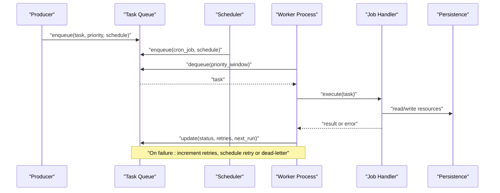
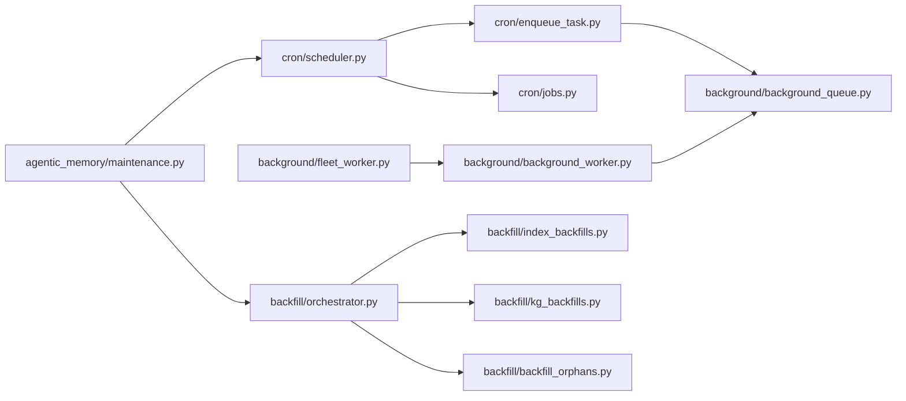

# Background Processing

<cite>
**Referenced Files in This Document**
- [background_queue.py](file://background/background_queue.py)
- [background_worker.py](file://background/background_worker.py)
- [config.py](file://background/config.py)
- [daemon.py](file://background/daemon.py)
- [fleet_entry.py](file://background/fleet_entry.py)
- [fleet_worker.py](file://background/fleet_worker.py)
- [cron/scheduler.py](file://cron/scheduler.py)
- [cron/jobs.py](file://cron/jobs.py)
- [cron/enqueue_task.py](file://cron/enqueue_task.py)
- [cron/cron_health_check.py](file://cron/cron_health_check.py)
- [cron/cron_reap_stale_tasks.py](file://cron/cron_reap_stale_tasks.py)
- [cron/cron_retry_dead_tasks.py](file://cron/cron_retry_dead_tasks.py)
- [cron/cron_compact.py](file://cron/cron_compact.py)
- [cron/cron_embedding_recompute.py](file://cron/cron_embedding_recompute.py)
- [cron/cron_kg_backfill.py](file://cron/cron_kg_backfill.py)
- [cron/cron_kg_backfill_monitor.py](file://cron/cron_kg_backfill_monitor.py)
- [cron/cron_purge_expired.py](file://cron/cron_purge_expired.py)
- [cron/cron_log_retention.py](file://cron/cron_log_retention.py)
- [cron/cron_cleanup_auto_logs.py](file://cron/cron_cleanup_auto_logs.py)
- [cron/cron_watchdog.py](file://cron/cron_watchdog.py)
- [cron/manage_task_timeouts.py](file://cron/manage_task_timeouts.py)
- [cron/monitor_task_queue.py](file://cron/monitor_task_queue.py)
- [backfill/orchestrator.py](file://backfill/orchestrator.py)
- [backfill/index_backfills.py](file://backfill/index_backfills.py)
- [backfill/kg_backfills.py](file://backfill/kg_backfills.py)
- [backfill/backfill_orphans.py](file://backfill/backfill_orphans.py)
- [maintenance.py](file://agentic_memory/maintenance.py)
- [adaptive_retention.py](file://adaptive_retention.py)
- [retention_coordinator.py](file://background/retention_coordinator.py)
- [auto_save.py](file://background/auto_save.py)
- [purge.py](file://background/purge.py)
- [daily_digest.py](file://background/daily_digest.py)
- [tool_complete.py](file://background/tool_complete.py)
- [corpus_budget_guard.py](file://background/corpus_budget_guard.py)
- [circuit_breaker.py](file://background/circuit_breaker.py)
- [inbox.py](file://background/inbox.py)
</cite>

## Table of Contents
1. [Introduction](#introduction)
2. [Project Structure](#project-structure)
3. [Core Components](#core-components)
4. [Architecture Overview](#architecture-overview)
5. [Detailed Component Analysis](#detailed-component-analysis)
6. [Dependency Analysis](#dependency-analysis)
7. [Performance Considerations](#performance-considerations)
8. [Troubleshooting Guide](#troubleshooting-guide)
9. [Conclusion](#conclusion)
10. [Appendices](#appendices)

## Introduction
This document explains the background processing system, focusing on task queue architecture, worker process management, job scheduling, and built-in maintenance tasks. It also covers custom task development, error handling strategies, retry policies, durability guarantees, observability, and scaling considerations. The goal is to provide both a high-level understanding and practical guidance for extending and operating the system effectively.

## Project Structure
The background processing subsystem spans several directories:
- background/: core queue, workers, fleet coordination, and maintenance utilities
- cron/: scheduler, job definitions, and operational crons
- backfill/: orchestrators and implementations for data backfills
- agentic_memory/maintenance.py: higher-level maintenance orchestration
- Root-level modules: adaptive retention and other cross-cutting concerns

```mermaid
graph TB
subgraph "Background"
BQ["background_queue.py"]
BW["background_worker.py"]
CFG["background/config.py"]
DAEMON["background/daemon.py"]
FLEET_ENTRY["background/fleet_entry.py"]
FLEET_WORKER["background/fleet_worker.py"]
RETENTION_COORD["background/retention_coordinator.py"]
AUTO_SAVE["background/auto_save.py"]
PURGE["background/purge.py"]
DAILY_DIGEST["background/daily_digest.py"]
TOOL_COMPLETE["background/tool_complete.py"]
CORPUS_GUARD["background/corpus_budget_guard.py"]
CIRCUIT_BREAKER["background/circuit_breaker.py"]
INBOX["background/inbox.py"]
end
subgraph "Cron"
SCHED["cron/scheduler.py"]
JOBS["cron/jobs.py"]
ENQUEUE["cron/enqueue_task.py"]
HEALTH["cron/cron_health_check.py"]
REAP["cron/cron_reap_stale_tasks.py"]
RETRY_DEAD["cron/cron_retry_dead_tasks.py"]
COMPACT["cron/cron_compact.py"]
EMB_RECOMP["cron/cron_embedding_recompute.py"]
KG_BACKFILL["cron/cron_kg_backfill.py"]
KG_BACKFILL_MON["cron/cron_kg_backfill_monitor.py"]
PURGE_EXPIRED["cron/cron_purge_expired.py"]
LOG_RETENTION["cron/cron_log_retention.py"]
CLEAN_AUTO_LOGS["cron/cron_cleanup_auto_logs.py"]
WATCHDOG["cron/cron_watchdog.py"]
MANAGE_TIMEOUTS["cron/manage_task_timeouts.py"]
MON_QUEUE["cron/monitor_task_queue.py"]
end
subgraph "Backfill"
ORCH["backfill/orchestrator.py"]
IDX_BF["backfill/index_backfills.py"]
KG_BF["backfill/kg_backfills.py"]
ORPHANS["backfill/backfill_orphans.py"]
end
subgraph "Agentic Memory"
MAINT["agentic_memory/maintenance.py"]
end
BQ --> BW
CFG --> BQ
CFG --> BW
DAEMON --> BW
FLEET_ENTRY --> FLEET_WORKER
RETENTION_COORD --> BQ
ENQUEUE --> BQ
SCHED --> ENQUEUE
SCHED --> JOBS
ORCH --> IDX_BF
ORCH --> KG_BF
ORCH --> ORPHANS
MAINT --> SCHED
MAINT --> ORCH
```

**Diagram sources**
- [background_queue.py](file://background/background_queue.py)
- [background_worker.py](file://background/background_worker.py)
- [background/config.py](file://background/config.py)
- [background/daemon.py](file://background/daemon.py)
- [background/fleet_entry.py](file://background/fleet_entry.py)
- [background/fleet_worker.py](file://background/fleet_worker.py)
- [background/retention_coordinator.py](file://background/retention_coordinator.py)
- [background/auto_save.py](file://background/auto_save.py)
- [background/purge.py](file://background/purge.py)
- [background/daily_digest.py](file://background/daily_digest.py)
- [background/tool_complete.py](file://background/tool_complete.py)
- [background/corpus_budget_guard.py](file://background/corpus_budget_guard.py)
- [background/circuit_breaker.py](file://background/circuit_breaker.py)
- [background/inbox.py](file://background/inbox.py)
- [cron/scheduler.py](file://cron/scheduler.py)
- [cron/jobs.py](file://cron/jobs.py)
- [cron/enqueue_task.py](file://cron/enqueue_task.py)
- [cron/cron_health_check.py](file://cron/cron_health_check.py)
- [cron/cron_reap_stale_tasks.py](file://cron/cron_reap_stale_tasks.py)
- [cron/cron_retry_dead_tasks.py](file://cron/cron_retry_dead_tasks.py)
- [cron/cron_compact.py](file://cron/cron_compact.py)
- [cron/cron_embedding_recompute.py](file://cron/cron_embedding_recompute.py)
- [cron/cron_kg_backfill.py](file://cron/cron_kg_backfill.py)
- [cron/cron_kg_backfill_monitor.py](file://cron/cron_kg_backfill_monitor.py)
- [cron/cron_purge_expired.py](file://cron/cron_purge_expired.py)
- [cron/cron_log_retention.py](file://cron/cron_log_retention.py)
- [cron/cron_cleanup_auto_logs.py](file://cron/cron_cleanup_auto_logs.py)
- [cron/cron_watchdog.py](file://cron/cron_watchdog.py)
- [cron/manage_task_timeouts.py](file://cron/manage_task_timeouts.py)
- [cron/monitor_task_queue.py](file://cron/monitor_task_queue.py)
- [backfill/orchestrator.py](file://backfill/orchestrator.py)
- [backfill/index_backfills.py](file://backfill/index_backfills.py)
- [backfill/kg_backfills.py](file://backfill/kg_backfills.py)
- [backfill/backfill_orphans.py](file://backfill/backfill_orphans.py)
- [agentic_memory/maintenance.py](file://agentic_memory/maintenance.py)

**Section sources**
- [background_queue.py](file://background/background_queue.py)
- [background_worker.py](file://background/background_worker.py)
- [background/config.py](file://background/config.py)
- [cron/scheduler.py](file://cron/scheduler.py)
- [cron/jobs.py](file://cron/jobs.py)
- [cron/enqueue_task.py](file://cron/enqueue_task.py)
- [backfill/orchestrator.py](file://backfill/orchestrator.py)
- [agentic_memory/maintenance.py](file://agentic_memory/maintenance.py)

## Core Components
- Task Queue: Central persistence-backed queue that stores jobs with metadata such as priority, schedule time, retries, and deadlines. Provides enqueue, dequeue, update, and status operations.
- Worker Processes: Long-running processes that poll the queue, acquire jobs, execute handlers, and report results or failures. Support graceful shutdown and health reporting.
- Scheduler: Time-based dispatcher that enqueues periodic and one-off jobs based on configuration and policy. Integrates with cron entries and internal timers.
- Fleet Coordination: Multi-process coordination for distributed workers, including leader election, fencing, and load balancing across nodes.
- Maintenance Tasks: Built-in routines for adaptive retention, index optimization, health monitoring, and data backfills.
- Observability and Resilience: Metrics, logging, circuit breakers, inbox for out-of-band messages, and timeout/retry management.

Key responsibilities:
- Durability: Jobs are persisted before execution; state transitions are recorded to survive restarts.
- Retry Policies: Configurable exponential backoff, max attempts, and dead-lettering for failed jobs.
- Priority Handling: Higher-priority jobs are dequeued first; scheduling windows can throttle heavy workloads.
- Scalability: Horizontal scaling via multiple workers and fleet-aware coordination.

**Section sources**
- [background_queue.py](file://background/background_queue.py)
- [background_worker.py](file://background/background_worker.py)
- [background/config.py](file://background/config.py)
- [background/daemon.py](file://background/daemon.py)
- [background/fleet_entry.py](file://background/fleet_entry.py)
- [background/fleet_worker.py](file://background/fleet_worker.py)
- [cron/scheduler.py](file://cron/scheduler.py)
- [cron/enqueue_task.py](file://cron/enqueue_task.py)

## Architecture Overview
The background processing system follows a producer-consumer pattern:
- Producers (API, save pipeline, cron scheduler, backfill orchestrator) enqueue tasks into the persistent queue.
- Workers consume tasks, execute handlers, and update job status.
- Cron jobs schedule recurring maintenance and operational tasks.
- Fleet coordination ensures only eligible workers run certain tasks and prevents duplicate execution.

**Diagram sources**
- [background_queue.py](file://background/background_queue.py)
- [background_worker.py](file://background/background_worker.py)
- [cron/scheduler.py](file://cron/scheduler.py)
- [cron/enqueue_task.py](file://cron/enqueue_task.py)

## Detailed Component Analysis

### Task Queue
Responsibilities:
- Persisted storage of jobs with fields like id, type, payload, priority, created_at, scheduled_at, attempts, max_attempts, last_error, next_run, status.
- Enqueue API for producers to submit tasks with optional delay and priority.
- Dequeue API with priority windowing and concurrency control.
- Update and mark-complete APIs for lifecycle management.
- Indexes and constraints ensure efficient retrieval and durability.

Operational characteristics:
- Idempotent updates using job IDs.
- Backpressure via bounded queues and throttling by priority windows.
- Dead-lettering after exceeding max attempts.

**Section sources**
- [background_queue.py](file://background/background_queue.py)

### Worker Processes
Responsibilities:
- Poll the queue for available tasks within configured priority windows.
- Acquire locks to prevent concurrent execution of conflicting tasks.
- Execute handlers with timeouts and structured logging.
- Report metrics and health status.
- Graceful shutdown on signals.

Scaling:
- Multiple worker processes per host.
- Distributed coordination via fleet entry/worker to avoid duplication across hosts.

**Section sources**
- [background_worker.py](file://background/background_worker.py)
- [background/daemon.py](file://background/daemon.py)
- [background/fleet_entry.py](file://background/fleet_entry.py)
- [background/fleet_worker.py](file://background/fleet_worker.py)

### Scheduler and Job Definitions
Responsibilities:
- Define recurring and one-off jobs with schedules and parameters.
- Enqueue jobs at appropriate times respecting rate limits and resource availability.
- Integrate with system crontabs and internal watchdogs.

Built-in jobs include:
- Health checks, reaping stale tasks, retrying dead tasks, compaction, embedding recomputation, KG backfills, purging expired items, log retention, auto-log cleanup, watchdogs, and queue monitoring.

**Section sources**
- [cron/scheduler.py](file://cron/scheduler.py)
- [cron/jobs.py](file://cron/jobs.py)
- [cron/enqueue_task.py](file://cron/enqueue_task.py)
- [cron/cron_health_check.py](file://cron/cron_health_check.py)
- [cron/cron_reap_stale_tasks.py](file://cron/cron_reap_stale_tasks.py)
- [cron/cron_retry_dead_tasks.py](file://cron/cron_retry_dead_tasks.py)
- [cron/cron_compact.py](file://cron/cron_compact.py)
- [cron/cron_embedding_recompute.py](file://cron/cron_embedding_recompute.py)
- [cron/cron_kg_backfill.py](file://cron/cron_kg_backfill.py)
- [cron/cron_kg_backfill_monitor.py](file://cron/cron_kg_backfill_monitor.py)
- [cron/cron_purge_expired.py](file://cron/cron_purge_expired.py)
- [cron/cron_log_retention.py](file://cron/cron_log_retention.py)
- [cron/cron_cleanup_auto_logs.py](file://cron/cron_cleanup_auto_logs.py)
- [cron/cron_watchdog.py](file://cron/cron_watchdog.py)
- [cron/manage_task_timeouts.py](file://cron/manage_task_timeouts.py)
- [cron/monitor_task_queue.py](file://cron/monitor_task_queue.py)

### Backfill Orchestration
Responsibilities:
- Coordinate large-scale data backfills for indexes and knowledge graph structures.
- Provide progress tracking, resumability, and safety checks.
- Monitor backfill health and alert on anomalies.

Components:
- Orchestrator manages phases and dependencies.
- Index backfills rebuild search indices.
- KG backfills reconstruct graph artifacts.
- Orphan recovery identifies and repairs inconsistent records.

**Section sources**
- [backfill/orchestrator.py](file://backfill/orchestrator.py)
- [backfill/index_backfills.py](file://backfill/index_backfills.py)
- [backfill/kg_backfills.py](file://backfill/kg_backfills.py)
- [backfill/backfill_orphans.py](file://backfill/backfill_orphans.py)
- [cron/cron_kg_backfill.py](file://cron/cron_kg_backfill.py)
- [cron/cron_kg_backfill_monitor.py](file://cron/cron_kg_backfill_monitor.py)

### Adaptive Retention and Data Lifecycle
Responsibilities:
- Apply retention policies based on content value, recency, and usage patterns.
- Coordinate with purge and auto-save mechanisms to maintain corpus budget.
- Track retention stats and expose metrics.

Key modules:
- Adaptive retention logic computes decay and thresholds.
- Retention coordinator orchestrates retention runs and integrates with the queue.
- Auto-save and purge manage ephemeral and expired data.
- Daily digest summarizes recent activity and insights.

**Section sources**
- [adaptive_retention.py](file://adaptive_retention.py)
- [background/retention_coordinator.py](file://background/retention_coordinator.py)
- [background/auto_save.py](file://background/auto_save.py)
- [background/purge.py](file://background/purge.py)
- [background/daily_digest.py](file://background/daily_digest.py)
- [background/corpus_budget_guard.py](file://background/corpus_budget_guard.py)
- [cron/cron_log_retention.py](file://cron/cron_log_retention.py)
- [cron/cron_cleanup_auto_logs.py](file://cron/cron_cleanup_auto_logs.py)

### Operational Utilities and Resilience
- Circuit breaker: Prevents cascading failures by short-circuiting calls to failing downstream services.
- Inbox: Out-of-band messaging for asynchronous notifications between components.
- Tool completion: Tracks tool invocations and outcomes for audit and analytics.
- Task timeouts and monitoring: Manage long-running tasks and detect stalls.

**Section sources**
- [background/circuit_breaker.py](file://background/circuit_breaker.py)
- [background/inbox.py](file://background/inbox.py)
- [background/tool_complete.py](file://background/tool_complete.py)
- [cron/manage_task_timeouts.py](file://cron/manage_task_timeouts.py)
- [cron/monitor_task_queue.py](file://cron/monitor_task_queue.py)

## Dependency Analysis
High-level dependency relationships:
- Scheduler depends on job definitions and enqueue utilities.
- Workers depend on queue and fleet coordination.
- Backfill orchestrator depends on index and KG backfill implementations.
- Maintenance layer coordinates scheduler and backfills.

**Diagram sources**
- [cron/scheduler.py](file://cron/scheduler.py)
- [cron/jobs.py](file://cron/jobs.py)
- [cron/enqueue_task.py](file://cron/enqueue_task.py)
- [background/background_queue.py](file://background/background_queue.py)
- [background/background_worker.py](file://background/background_worker.py)
- [background/fleet_worker.py](file://background/fleet_worker.py)
- [backfill/orchestrator.py](file://backfill/orchestrator.py)
- [backfill/index_backfills.py](file://backfill/index_backfills.py)
- [backfill/kg_backfills.py](file://backfill/kg_backfills.py)
- [backfill/backfill_orphans.py](file://backfill/backfill_orphans.py)
- [agentic_memory/maintenance.py](file://agentic_memory/maintenance.py)

**Section sources**
- [cron/scheduler.py](file://cron/scheduler.py)
- [cron/enqueue_task.py](file://cron/enqueue_task.py)
- [background/background_queue.py](file://background/background_queue.py)
- [background/background_worker.py](file://background/background_worker.py)
- [background/fleet_worker.py](file://background/fleet_worker.py)
- [backfill/orchestrator.py](file://backfill/orchestrator.py)
- [agentic_memory/maintenance.py](file://agentic_memory/maintenance.py)

## Performance Considerations
- Batch dequeue with priority windows to reduce contention and improve throughput.
- Tune worker concurrency based on CPU and I/O characteristics.
- Use circuit breakers to protect against slow or failing external services.
- Monitor queue depth, latency percentiles, and retry rates to identify bottlenecks.
- Schedule heavy backfills during off-peak hours and use incremental approaches where possible.
- Ensure database indexes support fast lookups for job queries and status updates.

[No sources needed since this section provides general guidance]

## Troubleshooting Guide
Common issues and diagnostics:
- Stale tasks: Reap stale tasks periodically and investigate causes (timeouts, crashes).
- Dead tasks: Retry dead tasks with adjusted policies; inspect error logs and payloads.
- Queue saturation: Increase worker count or adjust priority windows; review backpressure settings.
- Backfill stalls: Check monitor outputs and backfill orchestrator logs; verify resource availability.
- Health checks: Review health check results and watchdog alerts for service readiness.

Operational crons for remediation:
- Reap stale tasks
- Retry dead tasks
- Compact and optimize indexes
- Embedding recomputation
- Purge expired items
- Log retention and cleanup
- Watchdog and queue monitoring

**Section sources**
- [cron/cron_reap_stale_tasks.py](file://cron/cron_reap_stale_tasks.py)
- [cron/cron_retry_dead_tasks.py](file://cron/cron_retry_dead_tasks.py)
- [cron/cron_compact.py](file://cron/cron_compact.py)
- [cron/cron_embedding_recompute.py](file://cron/cron_embedding_recompute.py)
- [cron/cron_purge_expired.py](file://cron/cron_purge_expired.py)
- [cron/cron_log_retention.py](file://cron/cron_log_retention.py)
- [cron/cron_cleanup_auto_logs.py](file://cron/cron_cleanup_auto_logs.py)
- [cron/cron_watchdog.py](file://cron/cron_watchdog.py)
- [cron/monitor_task_queue.py](file://cron/monitor_task_queue.py)
- [cron/cron_health_check.py](file://cron/cron_health_check.py)

## Conclusion
The background processing system provides a robust, scalable foundation for executing maintenance, backfills, and operational tasks. Its design emphasizes durability, resilience, and observability, with clear separation between scheduling, queuing, and execution. By leveraging built-in maintenance tasks and following best practices for custom job development, teams can extend functionality while maintaining reliability and performance.

[No sources needed since this section summarizes without analyzing specific files]

## Appendices

### Custom Task Development
Steps:
- Define a handler function implementing the required interface.
- Register the handler with the worker registry.
- Enqueue tasks using the enqueue utility with appropriate priority and schedule.
- Implement idempotency and error handling; return structured results.
- Add tests covering success, failure, and retry scenarios.

Best practices:
- Keep handlers focused and small; compose complex workflows from multiple tasks.
- Use priorities judiciously to avoid starvation.
- Log context-rich information for debugging.
- Respect timeouts and implement cancellation points.

**Section sources**
- [cron/enqueue_task.py](file://cron/enqueue_task.py)
- [background/background_worker.py](file://background/background_worker.py)
- [background/config.py](file://background/config.py)

### Configuring Task Priorities
Guidance:
- Assign higher priorities to time-sensitive tasks (e.g., health checks, retries).
- Use lower priorities for batch backfills and non-urgent maintenance.
- Configure priority windows to balance fairness and throughput.

**Section sources**
- [background/config.py](file://background/config.py)
- [background/background_queue.py](file://background/background_queue.py)

### Scaling Worker Processes
Recommendations:
- Start multiple worker processes per host based on CPU cores and I/O capacity.
- Use fleet coordination to distribute workload across hosts.
- Monitor queue depth and latency; scale out when thresholds are exceeded.
- Ensure shared resources (database connections, file locks) are sized appropriately.

**Section sources**
- [background/fleet_entry.py](file://background/fleet_entry.py)
- [background/fleet_worker.py](file://background/fleet_worker.py)
- [background/daemon.py](file://background/daemon.py)

### Task Durability and Retry Policies
Principles:
- Persist job state before execution; record updates atomically.
- Implement exponential backoff with jitter for retries.
- Cap maximum attempts and route to dead-letter for inspection.
- Use timeouts to prevent indefinite hangs.

**Section sources**
- [background/background_queue.py](file://background/background_queue.py)
- [background/background_worker.py](file://background/background_worker.py)
- [cron/manage_task_timeouts.py](file://cron/manage_task_timeouts.py)

### Observability Features
Metrics and logs:
- Track queue depth, dequeue latency, job duration, retry counts, and error rates.
- Emit structured logs with correlation IDs for tracing.
- Expose health endpoints and dashboard integrations.

**Section sources**
- [cron/monitor_task_queue.py](file://cron/monitor_task_queue.py)
- [cron/cron_health_check.py](file://cron/cron_health_check.py)
- [background/circuit_breaker.py](file://background/circuit_breaker.py)
- [background/inbox.py](file://background/inbox.py)