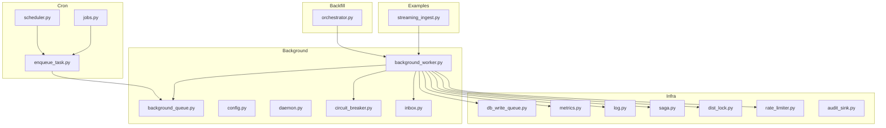
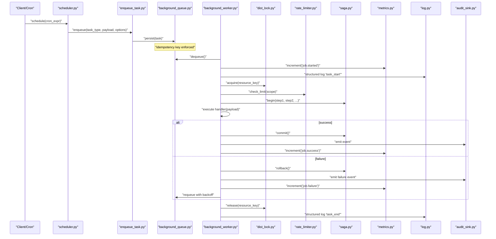
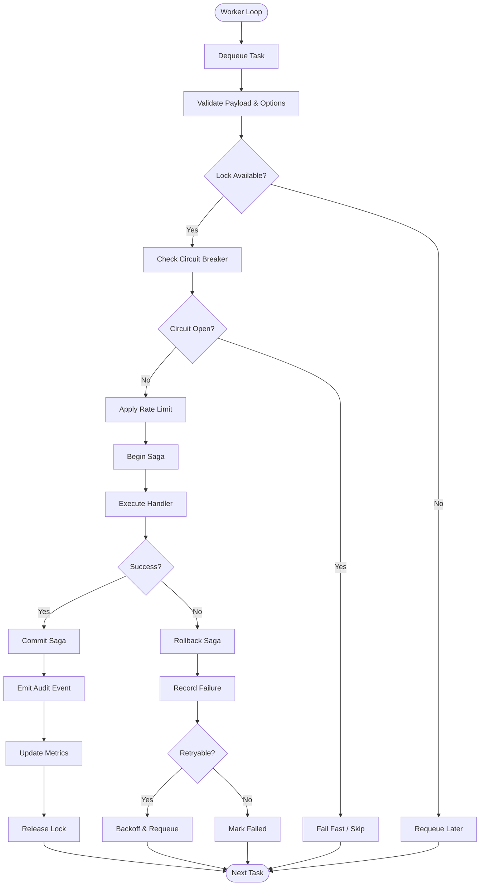
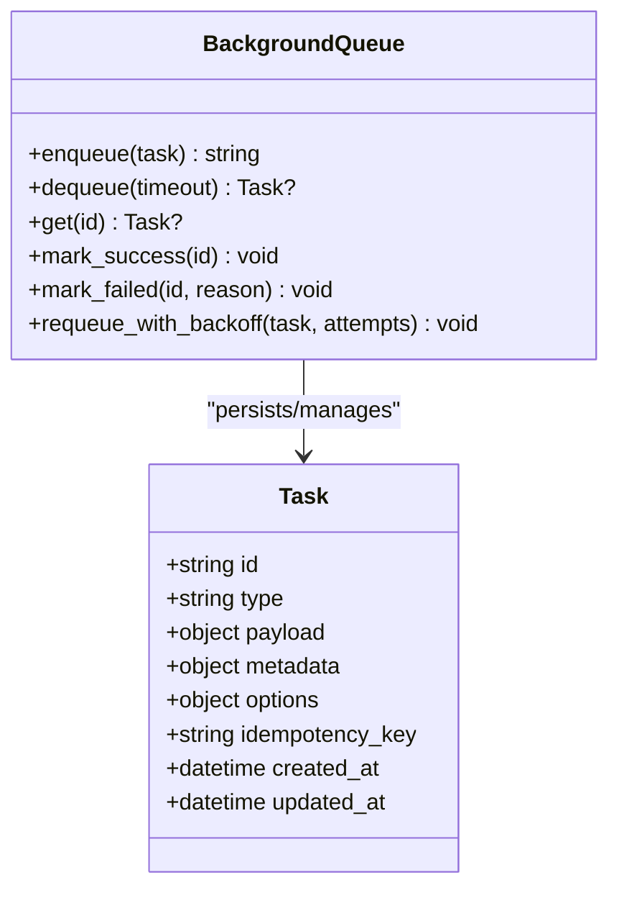
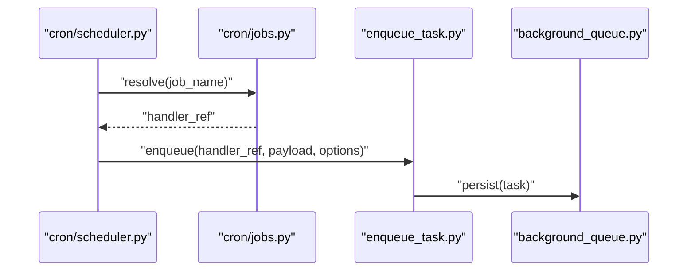
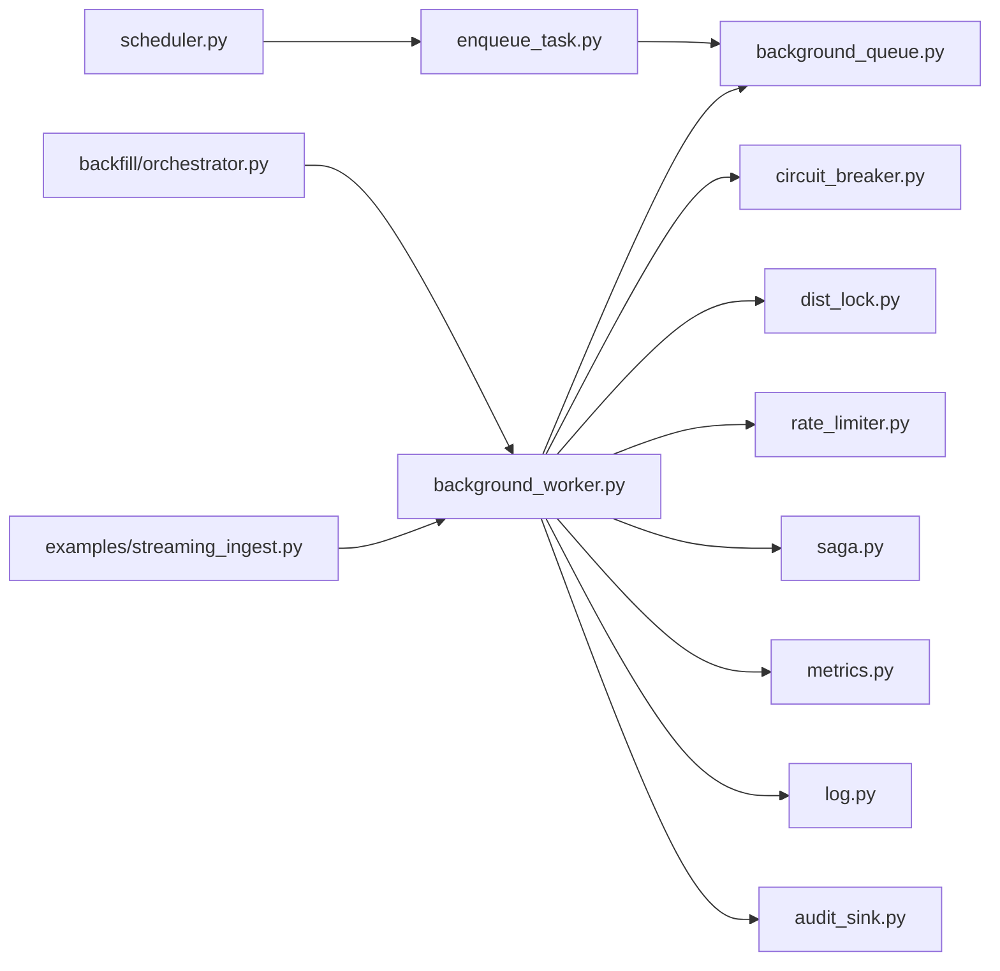

# Custom Background Jobs

<cite>
**Referenced Files in This Document**
- [background/background_worker.py](file://background/background_worker.py)
- [background/background_queue.py](file://background/background_queue.py)
- [background/config.py](file://background/config.py)
- [background/daemon.py](file://background/daemon.py)
- [background/circuit_breaker.py](file://background/circuit_breaker.py)
- [background/inbox.py](file://background/inbox.py)
- [cron/jobs.py](file://cron/jobs.py)
- [cron/scheduler.py](file://cron/scheduler.py)
- [cron/enqueue_task.py](file://cron/enqueue_task.py)
- [infra/db_write_queue.py](file://infra/db_write_queue.py)
- [infra/metrics.py](file://infra/metrics.py)
- [infra/log.py](file://infra/log.py)
- [infra/saga.py](file://infra/saga.py)
- [infra/dist_lock.py](file://infra/dist_lock.py)
- [infra/rate_limiter.py](file://infra/rate_limiter.py)
- [infra/audit_sink.py](file://infra/audit_sink.py)
- [backfill/orchestrator.py](file://backfill/orchestrator.py)
- [examples/streaming_ingest.py](file://examples/streaming_ingest.py)
</cite>

## Table of Contents
1. [Introduction](#introduction)
2. [Project Structure](#project-structure)
3. [Core Components](#core-components)
4. [Architecture Overview](#architecture-overview)
5. [Detailed Component Analysis](#detailed-component-analysis)
6. [Dependency Analysis](#dependency-analysis)
7. [Performance Considerations](#performance-considerations)
8. [Troubleshooting Guide](#troubleshooting-guide)
9. [Conclusion](#conclusion)
10. [Appendices](#appendices)

## Introduction
This document provides comprehensive guidance for creating custom background jobs in the system. It covers job development patterns, task serialization, worker communication protocols, lifecycle hooks, error handling best practices, logging strategies, testing approaches, debugging techniques, performance profiling, state management, integration with external systems, security considerations, resource limits, and monitoring requirements for production deployments.

The background job subsystem is designed to be resilient, observable, and composable. It supports durable queues, distributed coordination, circuit breaking, rate limiting, and structured audit logging. Jobs can be scheduled via cron or enqueued on demand, executed by workers with configurable concurrency, and monitored through metrics and logs.

## Project Structure
Background jobs are implemented across several modules:
- Worker runtime and queue abstraction
- Configuration and daemonization
- Scheduling and enqueueing utilities
- Coordination primitives (locks, sagas, rate limiting)
- Observability (metrics, logs, audit sink)
- Example jobs and backfill orchestrators

**Diagram sources**
- [background/background_worker.py](file://background/background_worker.py)
- [background/background_queue.py](file://background/background_queue.py)
- [background/config.py](file://background/config.py)
- [background/daemon.py](file://background/daemon.py)
- [background/circuit_breaker.py](file://background/circuit_breaker.py)
- [background/inbox.py](file://background/inbox.py)
- [cron/jobs.py](file://cron/jobs.py)
- [cron/scheduler.py](file://cron/scheduler.py)
- [cron/enqueue_task.py](file://cron/enqueue_task.py)
- [infra/db_write_queue.py](file://infra/db_write_queue.py)
- [infra/metrics.py](file://infra/metrics.py)
- [infra/log.py](file://infra/log.py)
- [infra/saga.py](file://infra/saga.py)
- [infra/dist_lock.py](file://infra/dist_lock.py)
- [infra/rate_limiter.py](file://infra/rate_limiter.py)
- [infra/audit_sink.py](file://infra/audit_sink.py)
- [backfill/orchestrator.py](file://backfill/orchestrator.py)
- [examples/streaming_ingest.py](file://examples/streaming_ingest.py)

**Section sources**
- [background/background_worker.py](file://background/background_worker.py)
- [background/background_queue.py](file://background/background_queue.py)
- [background/config.py](file://background/config.py)
- [background/daemon.py](file://background/daemon.py)
- [background/circuit_breaker.py](file://background/circuit_breaker.py)
- [background/inbox.py](file://background/inbox.py)
- [cron/jobs.py](file://cron/jobs.py)
- [cron/scheduler.py](file://cron/scheduler.py)
- [cron/enqueue_task.py](file://cron/enqueue_task.py)
- [infra/db_write_queue.py](file://infra/db_write_queue.py)
- [infra/metrics.py](file://infra/metrics.py)
- [infra/log.py](file://infra/log.py)
- [infra/saga.py](file://infra/saga.py)
- [infra/dist_lock.py](file://infra/dist_lock.py)
- [infra/rate_limiter.py](file://infra/rate_limiter.py)
- [infra/audit_sink.py](file://infra/audit_sink.py)
- [backfill/orchestrator.py](file://backfill/orchestrator.py)
- [examples/streaming_ingest.py](file://examples/streaming_ingest.py)

## Core Components
- BackgroundWorker: The main execution loop that pulls tasks from a queue, manages retries, applies circuit breakers, coordinates locks, and emits metrics/logs.
- BackgroundQueue: Abstraction over persistent storage for tasks, providing enqueue/dequeue semantics with idempotency and ordering guarantees.
- Scheduler and Cron Jobs: Declarative scheduling and periodic triggers; also supports ad-hoc enqueueing.
- Enqueue Task Utility: Programmatic API to push tasks into the queue with payloads and options.
- Circuit Breaker: Protects downstream dependencies by failing fast when errors exceed thresholds.
- Inbox: Optional message bus for inter-worker or cross-process communication.
- Infrastructure Primitives: Distributed locks, rate limiters, saga orchestration, write queues, metrics, logging, and audit sinks.

Key responsibilities:
- Serialization: Tasks are serialized as JSON-compatible structures with typed fields and optional metadata.
- Concurrency: Workers run multiple concurrent tasks with bounded resources.
- Resilience: Retries with exponential backoff, circuit breaking, and idempotent handlers.
- Observability: Metrics, structured logs, and audit events.

**Section sources**
- [background/background_worker.py](file://background/background_worker.py)
- [background/background_queue.py](file://background/background_queue.py)
- [background/circuit_breaker.py](file://background/circuit_breaker.py)
- [background/inbox.py](file://background/inbox.py)
- [cron/enqueue_task.py](file://cron/enqueue_task.py)
- [infra/saga.py](file://infra/saga.py)
- [infra/dist_lock.py](file://infra/dist_lock.py)
- [infra/rate_limiter.py](file://infra/rate_limiter.py)
- [infra/db_write_queue.py](file://infra/db_write_queue.py)
- [infra/metrics.py](file://infra/metrics.py)
- [infra/log.py](file://infra/log.py)
- [infra/audit_sink.py](file://infra/audit_sink.py)

## Architecture Overview
The background job architecture separates concerns between scheduling, queuing, execution, and observability.

**Diagram sources**
- [cron/scheduler.py](file://cron/scheduler.py)
- [cron/enqueue_task.py](file://cron/enqueue_task.py)
- [background/background_queue.py](file://background/background_queue.py)
- [background/background_worker.py](file://background/background_worker.py)
- [infra/dist_lock.py](file://infra/dist_lock.py)
- [infra/rate_limiter.py](file://infra/rate_limiter.py)
- [infra/saga.py](file://infra/saga.py)
- [infra/metrics.py](file://infra/metrics.py)
- [infra/log.py](file://infra/log.py)
- [infra/audit_sink.py](file://infra/audit_sink.py)

## Detailed Component Analysis

### BackgroundWorker
Responsibilities:
- Pull tasks from the queue and execute them within a bounded concurrency pool.
- Apply retry policies, circuit breaker checks, and lock acquisition before execution.
- Emit metrics and structured logs for each lifecycle stage.
- Integrate with sagas for multi-step transactions and rollbacks.

Lifecycle hooks:
- Pre-execution: validate payload, acquire locks, check rate limits.
- Execution: invoke handler with context including tenant, user, and tracing identifiers.
- Post-execution: commit saga, emit audit events, update metrics.

Error handling:
- Transient errors trigger retries with exponential backoff.
- Permanent errors bypass retries and mark the task failed.
- Circuit breaker prevents cascading failures to external services.

**Diagram sources**
- [background/background_worker.py](file://background/background_worker.py)
- [background/circuit_breaker.py](file://background/circuit_breaker.py)
- [infra/saga.py](file://infra/saga.py)
- [infra/dist_lock.py](file://infra/dist_lock.py)
- [infra/rate_limiter.py](file://infra/rate_limiter.py)
- [infra/metrics.py](file://infra/metrics.py)
- [infra/audit_sink.py](file://infra/audit_sink.py)

**Section sources**
- [background/background_worker.py](file://background/background_worker.py)
- [background/circuit_breaker.py](file://background/circuit_breaker.py)
- [infra/saga.py](file://infra/saga.py)
- [infra/dist_lock.py](file://infra/dist_lock.py)
- [infra/rate_limiter.py](file://infra/rate_limiter.py)
- [infra/metrics.py](file://infra/metrics.py)
- [infra/audit_sink.py](file://infra/audit_sink.py)

### BackgroundQueue
Responsibilities:
- Persist tasks with unique IDs and idempotency keys.
- Provide FIFO or priority-based dequeue semantics.
- Support task versioning and schema evolution.

Serialization:
- Tasks are represented as JSON-serializable objects with explicit fields for type, payload, metadata, and options.
- Handlers register against task types and receive deserialized payloads.

Idempotency:
- Idempotency keys prevent duplicate processing.
- Deduplication occurs at enqueue time and during requeues.

**Diagram sources**
- [background/background_queue.py](file://background/background_queue.py)

**Section sources**
- [background/background_queue.py](file://background/background_queue.py)

### Scheduler and Cron Jobs
Responsibilities:
- Define recurring jobs using declarative schedules.
- Trigger enqueue operations based on cron expressions or fixed intervals.
- Coordinate with locking to avoid overlapping runs.

Job Registration:
- Jobs are registered with names, schedules, and handler references.
- The scheduler ensures only one instance runs per schedule unless explicitly allowed.

**Diagram sources**
- [cron/scheduler.py](file://cron/scheduler.py)
- [cron/jobs.py](file://cron/jobs.py)
- [cron/enqueue_task.py](file://cron/enqueue_task.py)
- [background/background_queue.py](file://background/background_queue.py)

**Section sources**
- [cron/scheduler.py](file://cron/scheduler.py)
- [cron/jobs.py](file://cron/jobs.py)
- [cron/enqueue_task.py](file://cron/enqueue_task.py)

### Enqueue Task Utility
Responsibilities:
- Provide a programmatic API to enqueue tasks from application code.
- Accept task type, payload, and options such as idempotency key, delay, and retry policy.
- Ensure consistent serialization and validation before persistence.

Usage patterns:
- Immediate execution: enqueue now.
- Delayed execution: specify delay or scheduled time.
- Conditional execution: include predicates in metadata.

**Section sources**
- [cron/enqueue_task.py](file://cron/enqueue_task.py)

### Circuit Breaker
Responsibilities:
- Monitor failure rates for specific downstream dependencies.
- Open circuit after threshold breaches to fail fast.
- Allow limited probes to test recovery.

Integration points:
- Applied around external calls within job handlers.
- Configurable per dependency scope.

**Section sources**
- [background/circuit_breaker.py](file://background/circuit_breaker.py)

### Inbox
Responsibilities:
- Lightweight messaging channel for inter-worker or cross-process communication.
- Supports publish/subscribe patterns for notifications and fan-out.

Use cases:
- Notify other workers about completed tasks.
- Broadcast configuration changes or feature flags.

**Section sources**
- [background/inbox.py](file://background/inbox.py)

### Infrastructure Primitives
- Distributed Locks: Prevent concurrent access to shared resources.
- Rate Limiter: Throttle external API calls and database writes.
- Saga Orchestration: Manage multi-step transactions with rollback support.
- DB Write Queue: Batch and serialize writes to reduce contention.
- Metrics: Counters, gauges, histograms for observability.
- Logging: Structured logs with correlation IDs and contextual fields.
- Audit Sink: Persistent audit events for compliance and forensics.

**Section sources**
- [infra/dist_lock.py](file://infra/dist_lock.py)
- [infra/rate_limiter.py](file://infra/rate_limiter.py)
- [infra/saga.py](file://infra/saga.py)
- [infra/db_write_queue.py](file://infra/db_write_queue.py)
- [infra/metrics.py](file://infra/metrics.py)
- [infra/log.py](file://infra/log.py)
- [infra/audit_sink.py](file://infra/audit_sink.py)

### Backfill Orchestrator
Responsibilities:
- Orchestrate long-running backfills composed of multiple jobs.
- Track progress, resume on failure, and coordinate parallelism.
- Emit detailed metrics and logs for each phase.

Patterns:
- Chunked processing with idempotent steps.
- Aggregation and reconciliation phases.

**Section sources**
- [backfill/orchestrator.py](file://backfill/orchestrator.py)

### Example Job: Streaming Ingest
Responsibilities:
- Demonstrate streaming ingestion pattern with chunked processing.
- Show integration with external systems and backpressure handling.
- Illustrate proper use of rate limiting and circuit breaking.

**Section sources**
- [examples/streaming_ingest.py](file://examples/streaming_ingest.py)

## Dependency Analysis
Background jobs depend on infrastructure primitives for coordination, durability, and observability.

**Diagram sources**
- [background/background_worker.py](file://background/background_worker.py)
- [background/background_queue.py](file://background/background_queue.py)
- [background/circuit_breaker.py](file://background/circuit_breaker.py)
- [infra/dist_lock.py](file://infra/dist_lock.py)
- [infra/rate_limiter.py](file://infra/rate_limiter.py)
- [infra/saga.py](file://infra/saga.py)
- [infra/metrics.py](file://infra/metrics.py)
- [infra/log.py](file://infra/log.py)
- [infra/audit_sink.py](file://infra/audit_sink.py)
- [cron/scheduler.py](file://cron/scheduler.py)
- [cron/enqueue_task.py](file://cron/enqueue_task.py)
- [backfill/orchestrator.py](file://backfill/orchestrator.py)
- [examples/streaming_ingest.py](file://examples/streaming_ingest.py)

**Section sources**
- [background/background_worker.py](file://background/background_worker.py)
- [background/background_queue.py](file://background/background_queue.py)
- [background/circuit_breaker.py](file://background/circuit_breaker.py)
- [infra/dist_lock.py](file://infra/dist_lock.py)
- [infra/rate_limiter.py](file://infra/rate_limiter.py)
- [infra/saga.py](file://infra/saga.py)
- [infra/metrics.py](file://infra/metrics.py)
- [infra/log.py](file://infra/log.py)
- [infra/audit_sink.py](file://infra/audit_sink.py)
- [cron/scheduler.py](file://cron/scheduler.py)
- [cron/enqueue_task.py](file://cron/enqueue_task.py)
- [backfill/orchestrator.py](file://backfill/orchestrator.py)
- [examples/streaming_ingest.py](file://examples/streaming_ingest.py)

## Performance Considerations
- Concurrency tuning: Adjust worker concurrency based on CPU, I/O, and downstream capacity.
- Backpressure: Use rate limiters and circuit breakers to protect external systems.
- Batching: Aggregate writes via DB write queue to reduce contention.
- Idempotency: Design handlers to be safely retried without side effects.
- Memory usage: Stream large payloads and avoid loading entire datasets into memory.
- Indexing and caching: Leverage caches where appropriate to reduce latency.
- Monitoring: Track queue depth, processing latency, and error rates.

[No sources needed since this section provides general guidance]

## Troubleshooting Guide
Common issues and resolutions:
- Stuck tasks: Inspect queue for tasks stuck in processing; verify locks and saga states.
- High error rates: Check circuit breaker status and downstream health; adjust retry policies.
- Slow processing: Profile handlers, review rate limits, and optimize database queries.
- Deadlocks: Analyze lock acquisition order and saga boundaries.
- Missing logs: Ensure structured logging is enabled and correlation IDs are propagated.

Debugging techniques:
- Enable verbose logs for specific job types.
- Use metrics dashboards to identify bottlenecks.
- Replay failed tasks with sanitized payloads.
- Simulate failures to validate retry and rollback behavior.

**Section sources**
- [background/background_worker.py](file://background/background_worker.py)
- [infra/metrics.py](file://infra/metrics.py)
- [infra/log.py](file://infra/log.py)
- [infra/audit_sink.py](file://infra/audit_sink.py)

## Conclusion
Custom background jobs should be designed with resilience, idempotency, and observability in mind. Use the provided components—worker, queue, scheduler, circuit breaker, locks, rate limiter, saga, and audit—to build robust, scalable, and maintainable jobs. Follow best practices for error handling, logging, and monitoring to ensure reliable operation in production environments.

[No sources needed since this section summarizes without analyzing specific files]

## Appendices

### Job Development Patterns
- Stateless handlers: Prefer pure functions with explicit inputs and outputs.
- Chunked processing: Split large workloads into smaller units.
- Fan-out/fan-in: Decompose complex workflows into stages.
- Compensation actions: Implement rollbacks and compensations for partial failures.

### Task Serialization Guidelines
- Use JSON-compatible structures with explicit field types.
- Include metadata for tenant, user, and correlation IDs.
- Version payloads to support schema evolution.

### Worker Communication Protocols
- Use inbox for lightweight notifications.
- Prefer queue-based messaging for durable tasks.
- Avoid direct peer-to-peer calls between workers.

### Lifecycle Hooks
- Pre-execution: Validate inputs, acquire locks, check rate limits.
- Execution: Run handler with context and tracing.
- Post-execution: Commit saga, emit audit events, update metrics.

### Error Handling Best Practices
- Classify errors as transient vs permanent.
- Apply exponential backoff for retries.
- Fail fast with circuit breakers for unhealthy dependencies.

### Logging Strategies
- Emit structured logs with consistent fields.
- Include correlation IDs and job context.
- Redact sensitive information.

### Testing Approaches
- Unit tests: Mock external dependencies and assert handler logic.
- Integration tests: Use in-memory queue and fixtures.
- Chaos tests: Inject failures and verify retries and rollbacks.

### Debugging Techniques
- Enable debug logs for specific jobs.
- Inspect saga state and lock ownership.
- Replay failed tasks with controlled payloads.

### Performance Profiling
- Profile CPU and memory usage within handlers.
- Measure end-to-end latency and throughput.
- Identify hotspots in database and network calls.

### State Management Patterns
- Use saga for multi-step state transitions.
- Persist intermediate state for resumability.
- Ensure idempotent updates.

### Integration with External Systems
- Apply rate limiting and circuit breaking.
- Handle timeouts and retries gracefully.
- Validate responses and sanitize inputs.

### Security Considerations
- Validate and sanitize all inputs.
- Enforce tenant isolation and RBAC.
- Redact secrets in logs and metrics.

### Resource Limits
- Configure worker concurrency and memory caps.
- Set timeouts for external calls and database queries.
- Use backpressure mechanisms to prevent overload.

### Monitoring Requirements
- Track queue depth, processing latency, and error rates.
- Alert on circuit breaker openings and high failure rates.
- Maintain audit trails for compliance.

**Section sources**
- [background/background_worker.py](file://background/background_worker.py)
- [background/background_queue.py](file://background/background_queue.py)
- [background/circuit_breaker.py](file://background/circuit_breaker.py)
- [background/inbox.py](file://background/inbox.py)
- [cron/enqueue_task.py](file://cron/enqueue_task.py)
- [infra/saga.py](file://infra/saga.py)
- [infra/dist_lock.py](file://infra/dist_lock.py)
- [infra/rate_limiter.py](file://infra/rate_limiter.py)
- [infra/db_write_queue.py](file://infra/db_write_queue.py)
- [infra/metrics.py](file://infra/metrics.py)
- [infra/log.py](file://infra/log.py)
- [infra/audit_sink.py](file://infra/audit_sink.py)
- [backfill/orchestrator.py](file://backfill/orchestrator.py)
- [examples/streaming_ingest.py](file://examples/streaming_ingest.py)