# Job Scheduling

<cite>
**Referenced Files in This Document**
- [scheduler.py](file://cron/scheduler.py)
- [jobs.py](file://cron/jobs.py)
- [enqueue_task.py](file://cron/enqueue_task.py)
- [_flock.py](file://cron/_flock.py)
- [install_crontab.sh](file://cron/install_crontab.sh)
- [install_launchagent.sh](file://cron/install_launchagent.sh)
- [cron_runs.py](file://cron/cron_runs.py)
- [manage_task_timeouts.py](file://cron/manage_task_timeouts.py)
- [monitor_task_queue.py](file://cron/monitor_task_queue.py)
- [cron_heartbeat.py](file://cron/cron_heartbeat.py)
- [cron_health_check.py](file://cron/cron_health_check.py)
- [cron_cleanup_auto_logs.py](file://cron/cron_cleanup_auto_logs.py)
- [cron_purge_expired.py](file://cron/cron_purge_expired.py)
- [cron_compact.py](file://cron/cron_compact.py)
- [cron_rebuild_fts.py](file://cron/cron_rebuild_fts.py)
- [cron_embedding_recompute.py](file://cron/cron_embedding_recompute.py)
- [cron_concept_drift.py](file://cron/cron_concept_drift.py)
- [cron_cross_session_learn.py](file://cron/cron_cross_session_learn.py)
- [cron_kg_backfill.py](file://cron/cron_kg_backfill.py)
- [cron_kg_backfill_monitor.py](file://cron/cron_kg_backfill_monitor.py)
- [cron_quality_filter.py](file://cron/cron_quality_filter.py)
- [cron_review_beliefs.py](file://cron/cron_review_beliefs.py)
- [cron_skill_extraction.py](file://cron/cron_skill_extraction.py)
- [cron_tune_rewrites.py](file://cron/cron_tune_rewrites.py)
- [cron_watchdog.py](file://cron/cron_watchdog.py)
- [cron_daemon_watchdog.py](file://cron/cron_daemon_watchdog.py)
- [cron_sync.py](file://cron/cron_sync.py)
- [cron_crdt_sync.py](file://cron/cron_crdt_sync.py)
- [cron_policy_hash_status.py](file://cron/cron_policy_hash_status.py)
- [cron_retention_stats.py](file://cron/cron_retention_stats.py)
- [cron_log_retention.py](file://cron/cron_log_retention.py)
- [cron_retry_dead_tasks.py](file://cron/cron_retry_dead_tasks.py)
- [cron_resolve_contradictions.py](file://cron/cron_resolve_contradictions.py)
- [cron_revalidate_entailments.py](file://cron/cron_revalidate_entailments.py)
- [cron_rewrite_links.py](file://cron/cron_rewrite_links.py)
- [cron_semantic_clusters.py](file://cron/cron_semantic_clusters.py)
- [cron_skill_decay.py](file://cron/cron_skill_decay.py)
- [cron_pinned_decay.py](file://cron/cron_pinned_decay.py)
- [cron_tier_migration.py](file://cron/cron_tier_migration.py)
- [cron_train_forget_model.py](file://cron/cron_train_forget_model.py)
- [cron_train_ltr.py](file://cron/cron_train_ltr.py)
- [cron_train_temporal_ssm.py](file://cron/cron_train_temporal_ssm.py)
- [cron_recompute_temporal_priors.py](file://cron/cron_recompute_temporal_priors.py)
- [cron_backup.py](file://cron/cron_backup.py)
- [cron_backup_validate.py](file://cron/cron_backup_validate.py)
- [cron_integrity_check.py](file://cron/cron_integrity_check.py)
- [cron_pipeline_health.py](file://cron/cron_pipeline_health.py)
- [cron_detect_vec_drift.py](file://cron/cron_detect_vec_drift.py)
- [cron_promote_drafts.py](file://cron/cron_promote_drafts.py)
- [cron_auto_summarize.py](file://cron/cron_auto_summarize.py)
- [cron_auto_share.py](file://cron/cron_auto_share.py)
- [cron_answer_rerank.py](file://cron/cron_answer_rerank.py)
- [cron_reap_stale_tasks.py](file://cron/cron_reap_stale_tasks.py)
- [cron_purge_auto_saves.py](file://cron/cron_purge_auto_saves.py)
- [cron_analytics.py](file://cron/cron_kg_analytics.py)
- [cron_check_config_drift.py](file://cron/cron_check_config_drift.py)
- [cron_model_lock.py](file://background/cron_model_lock.py)
- [daemon.py](file://background/daemon.py)
- [background_worker.py](file://background/background_worker.py)
- [background_queue.py](file://background/background_queue.py)
- [config.py](file://background/config.py)
- [fleet_entry.py](file://background/fleet_entry.py)
- [fleet_worker.py](file://background/fleet_worker.py)
- [circuit_breaker.py](file://background/circuit_breaker.py)
- [corpus_budget_guard.py](file://background/corpus_budget_guard.py)
- [daily_digest.py](file://background/daily_digest.py)
- [inbox.py](file://background/inbox.py)
- [purge.py](file://background/purge.py)
- [retention_coordinator.py](file://background/retention_coordinator.py)
- [tool_complete.py](file://background/tool_complete.py)
- [adaptive_retention.py](file://background/adaptive_retention.py)
- [auto_save.py](file://background/auto_save.py)
</cite>

## Table of Contents
1. [Introduction](#introduction)
2. [Project Structure](#project-structure)
3. [Core Components](#core-components)
4. [Architecture Overview](#architecture-overview)
5. [Detailed Component Analysis](#detailed-component-analysis)
6. [Dependency Analysis](#dependency-analysis)
7. [Performance Considerations](#performance-considerations)
8. [Troubleshooting Guide](#troubleshooting-guide)
9. [Conclusion](#conclusion)
10. [Appendices](#appendices)

## Introduction
This document explains the job scheduling system with a focus on cron-based task scheduling, interval-based execution, and event-driven triggers. It covers scheduler architecture, job registration mechanisms, execution context management, built-in scheduled jobs (maintenance, cleanup, periodic optimizations), examples for creating custom jobs, configuring schedules, handling dependencies, timezone handling, job queuing, and failure recovery strategies.

## Project Structure
The scheduling subsystem is primarily implemented under the cron package and integrates with background workers and fleet orchestration. Key areas:
- Cron core: scheduler, job registry, flock-based locking, run tracking, timeouts, queue monitoring, heartbeat/health checks
- Cron jobs: numerous maintenance, optimization, backfill, training, and housekeeping tasks
- Background execution: daemon, worker, queue, circuit breaker, retention coordination, daily digest, purge, tool completion, adaptive retention, auto-save
- Fleet orchestration: entrypoint and worker processes for distributed scheduling and execution
- Installation helpers: crontab and launch agent installers

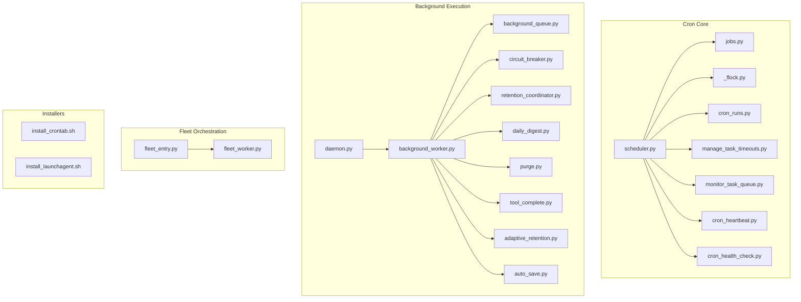

**Diagram sources**
- [scheduler.py](file://cron/scheduler.py)
- [jobs.py](file://cron/jobs.py)
- [_flock.py](file://cron/_flock.py)
- [cron_runs.py](file://cron/cron_runs.py)
- [manage_task_timeouts.py](file://cron/manage_task_timeouts.py)
- [monitor_task_queue.py](file://cron/monitor_task_queue.py)
- [cron_heartbeat.py](file://cron/cron_heartbeat.py)
- [cron_health_check.py](file://cron/cron_health_check.py)
- [daemon.py](file://background/daemon.py)
- [background_worker.py](file://background/background_worker.py)
- [background_queue.py](file://background/background_queue.py)
- [circuit_breaker.py](file://background/circuit_breaker.py)
- [retention_coordinator.py](file://background/retention_coordinator.py)
- [daily_digest.py](file://background/daily_digest.py)
- [purge.py](file://background/purge.py)
- [tool_complete.py](file://background/tool_complete.py)
- [adaptive_retention.py](file://background/adaptive_retention.py)
- [auto_save.py](file://background/auto_save.py)
- [fleet_entry.py](file://background/fleet_entry.py)
- [fleet_worker.py](file://background/fleet_worker.py)
- [install_crontab.sh](file://cron/install_crontab.sh)
- [install_launchagent.sh](file://cron/install_launchagent.sh)

**Section sources**
- [scheduler.py](file://cron/scheduler.py)
- [jobs.py](file://cron/jobs.py)
- [_flock.py](file://cron/_flock.py)
- [cron_runs.py](file://cron/cron_runs.py)
- [manage_task_timeouts.py](file://cron/manage_task_timeouts.py)
- [monitor_task_queue.py](file://cron/monitor_task_queue.py)
- [cron_heartbeat.py](file://cron/cron_heartbeat.py)
- [cron_health_check.py](file://cron/cron_health_check.py)
- [daemon.py](file://background/daemon.py)
- [background_worker.py](file://background/background_worker.py)
- [background_queue.py](file://background/background_queue.py)
- [circuit_breaker.py](file://background/circuit_breaker.py)
- [retention_coordinator.py](file://background/retention_coordinator.py)
- [daily_digest.py](file://background/daily_digest.py)
- [purge.py](file://background/purge.py)
- [tool_complete.py](file://background/tool_complete.py)
- [adaptive_retention.py](file://background/adaptive_retention.py)
- [auto_save.py](file://background/auto_save.py)
- [fleet_entry.py](file://background/fleet_entry.py)
- [fleet_worker.py](file://background/fleet_worker.py)
- [install_crontab.sh](file://cron/install_crontab.sh)
- [install_launchagent.sh](file://cron/install_launchagent.sh)

## Core Components
- Scheduler: central coordinator that discovers, locks, and executes registered jobs; tracks runs and enforces timeouts; emits heartbeats and health signals.
- Job Registry: declarative mapping of job names to handlers and schedule definitions.
- Locking: file-based flock ensures single-instance execution per job across processes and hosts.
- Run Tracking: persistent records of job invocations, durations, outcomes, and metadata.
- Timeouts: configurable maximum runtime per job; late termination and reporting.
- Queue Monitoring: observes background queues for stalled or dead tasks and triggers retries or alerts.
- Heartbeat/Health: liveness probes for scheduler and critical jobs.

Key responsibilities and interactions are illustrated below.

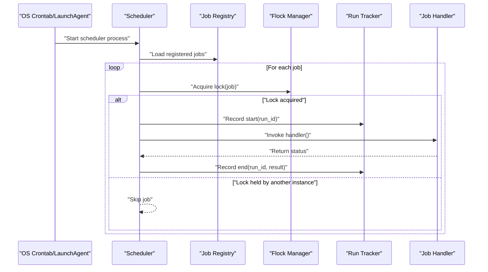

**Diagram sources**
- [scheduler.py](file://cron/scheduler.py)
- [jobs.py](file://cron/jobs.py)
- [_flock.py](file://cron/_flock.py)
- [cron_runs.py](file://cron/cron_runs.py)

**Section sources**
- [scheduler.py](file://cron/scheduler.py)
- [jobs.py](file://cron/jobs.py)
- [_flock.py](file://cron/_flock.py)
- [cron_runs.py](file://cron/cron_runs.py)

## Architecture Overview
The system supports three scheduling modalities:
- Cron-based scheduling: external orchestrators (system crontab or macOS LaunchAgents) invoke the scheduler at fixed times.
- Interval-based execution: internal loops within the scheduler or background workers execute periodic tasks based on configured intervals.
- Event-driven triggers: background workers respond to events such as tool completion, inbox messages, or retention policy changes.

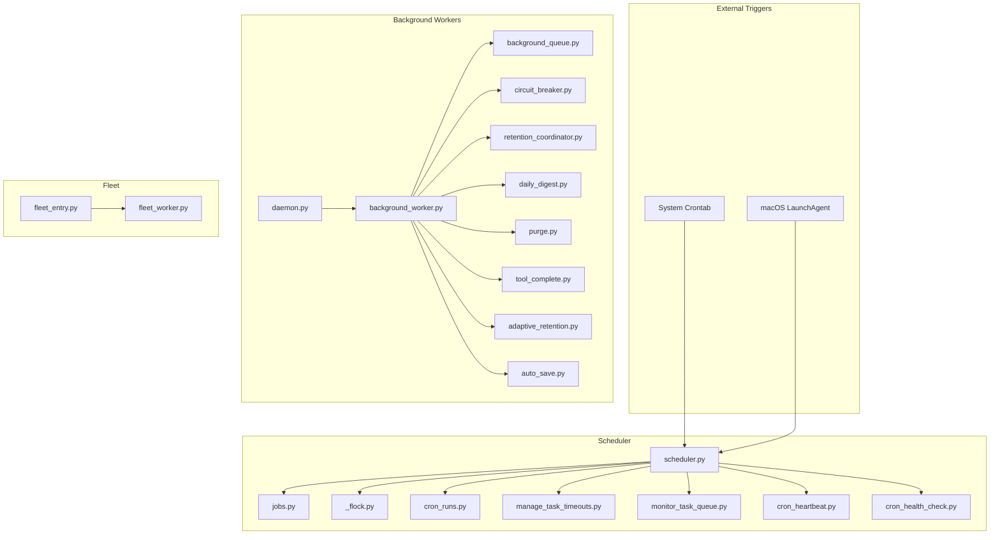

**Diagram sources**
- [scheduler.py](file://cron/scheduler.py)
- [jobs.py](file://cron/jobs.py)
- [_flock.py](file://cron/_flock.py)
- [cron_runs.py](file://cron/cron_runs.py)
- [manage_task_timeouts.py](file://cron/manage_task_timeouts.py)
- [monitor_task_queue.py](file://cron/monitor_task_queue.py)
- [cron_heartbeat.py](file://cron/cron_heartbeat.py)
- [cron_health_check.py](file://cron/cron_health_check.py)
- [daemon.py](file://background/daemon.py)
- [background_worker.py](file://background/background_worker.py)
- [background_queue.py](file://background/background_queue.py)
- [circuit_breaker.py](file://background/circuit_breaker.py)
- [retention_coordinator.py](file://background/retention_coordinator.py)
- [daily_digest.py](file://background/daily_digest.py)
- [purge.py](file://background/purge.py)
- [tool_complete.py](file://background/tool_complete.py)
- [adaptive_retention.py](file://background/adaptive_retention.py)
- [auto_save.py](file://background/auto_save.py)
- [fleet_entry.py](file://background/fleet_entry.py)
- [fleet_worker.py](file://background/fleet_worker.py)

## Detailed Component Analysis

### Scheduler and Job Registration
- The scheduler loads a registry of jobs and their schedules, acquires distributed locks, and invokes handlers.
- Jobs are defined centrally and can be extended by adding new entries to the registry.
- Each job run is recorded with timestamps, duration, and outcome for observability.

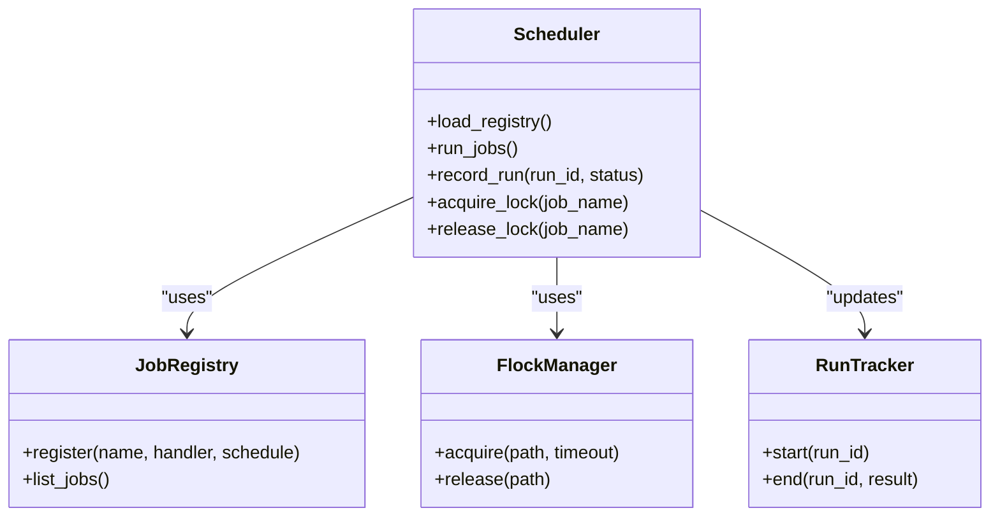

**Diagram sources**
- [scheduler.py](file://cron/scheduler.py)
- [jobs.py](file://cron/jobs.py)
- [_flock.py](file://cron/_flock.py)
- [cron_runs.py](file://cron/cron_runs.py)

**Section sources**
- [scheduler.py](file://cron/scheduler.py)
- [jobs.py](file://cron/jobs.py)
- [_flock.py](file://cron/_flock.py)
- [cron_runs.py](file://cron/cron_runs.py)

### Locking and Concurrency Control
- File-based locking prevents concurrent executions of the same job across processes and hosts.
- Lock acquisition includes timeouts to avoid indefinite blocking.
- Release occurs after successful completion or on error paths.

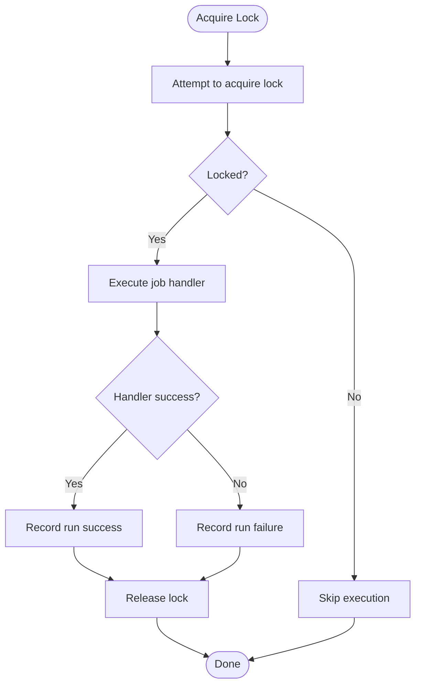

**Diagram sources**
- [_flock.py](file://cron/_flock.py)
- [scheduler.py](file://cron/scheduler.py)

**Section sources**
- [_flock.py](file://cron/_flock.py)
- [scheduler.py](file://cron/scheduler.py)

### Run Tracking and Observability
- Every job invocation is tracked with identifiers, start/end times, and results.
- Supports auditing, debugging, and performance analysis.
- Integrates with health checks and metrics.

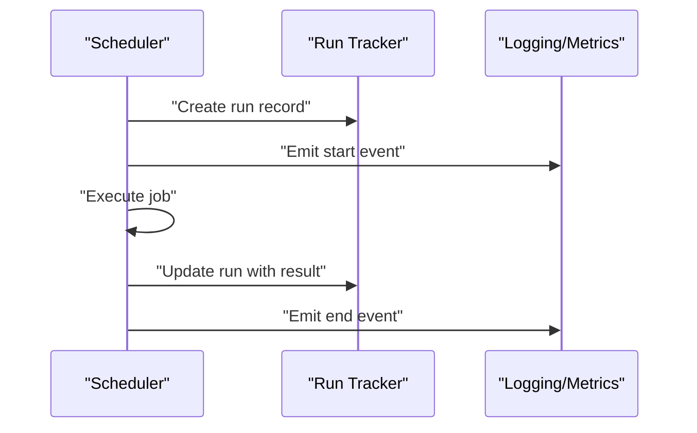

**Diagram sources**
- [cron_runs.py](file://cron/cron_runs.py)
- [scheduler.py](file://cron/scheduler.py)

**Section sources**
- [cron_runs.py](file://cron/cron_runs.py)
- [scheduler.py](file://cron/scheduler.py)

### Timeout Management
- Configurable per-job timeouts prevent long-running tasks from monopolizing resources.
- Late termination and failure recording ensure system stability.
- Integration with monitoring surfaces timeout violations.

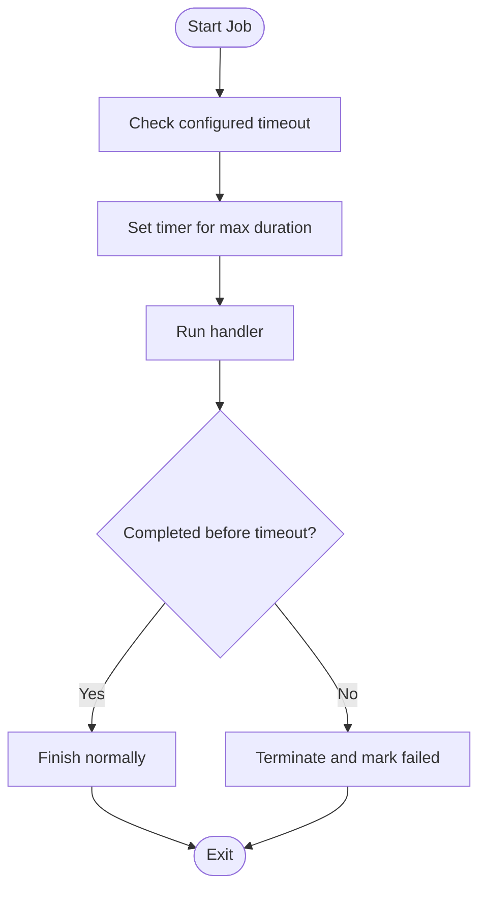

**Diagram sources**
- [manage_task_timeouts.py](file://cron/manage_task_timeouts.py)
- [scheduler.py](file://cron/scheduler.py)

**Section sources**
- [manage_task_timeouts.py](file://cron/manage_task_timeouts.py)
- [scheduler.py](file://cron/scheduler.py)

### Queue Monitoring and Dead Task Recovery
- Monitors background queues for stalled or dead tasks.
- Triggers retries or escalations based on policies.
- Works alongside retry mechanisms and circuit breakers.

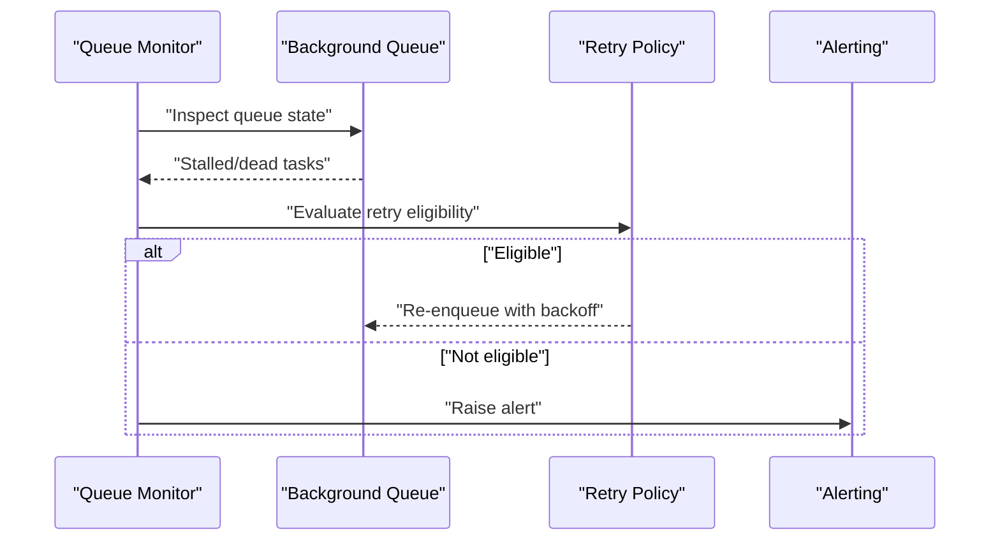

**Diagram sources**
- [monitor_task_queue.py](file://cron/monitor_task_queue.py)
- [background_queue.py](file://background/background_queue.py)
- [circuit_breaker.py](file://background/circuit_breaker.py)

**Section sources**
- [monitor_task_queue.py](file://cron/monitor_task_queue.py)
- [background_queue.py](file://background/background_queue.py)
- [circuit_breaker.py](file://background/circuit_breaker.py)

### Heartbeat and Health Checks
- Periodic heartbeats signal scheduler liveness.
- Health checks expose readiness and dependency status.
- Useful for orchestrators and dashboards.

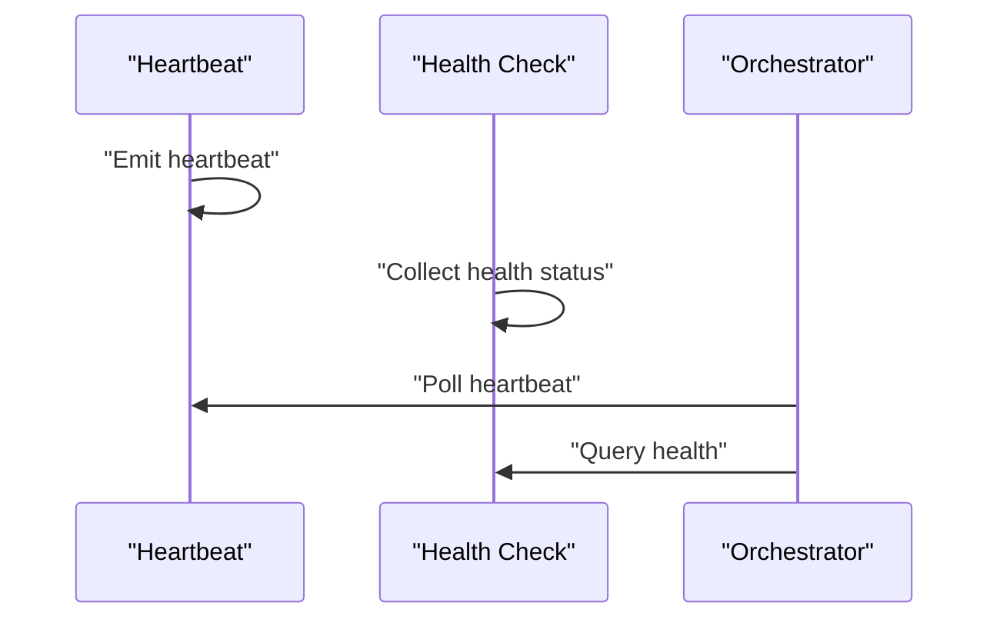

**Diagram sources**
- [cron_heartbeat.py](file://cron/cron_heartbeat.py)
- [cron_health_check.py](file://cron/cron_health_check.py)

**Section sources**
- [cron_heartbeat.py](file://cron/cron_heartbeat.py)
- [cron_health_check.py](file://cron/cron_health_check.py)

### Built-in Scheduled Jobs
The repository includes a comprehensive set of maintenance, cleanup, and optimization jobs. Examples include:
- Cleanup operations: auto log cleanup, expired item purging, stale task reaping, auto-save purging
- Indexing and search: full-text search rebuild, embedding recomputation, vector drift detection
- Knowledge graph: backfills, analytics, contradiction resolution, entailment revalidation, semantic clustering
- Quality and review: quality filtering, belief reviews, skill extraction, rewrite tuning
- Training and models: forget model training, LTR training, temporal SSM training, temporal priors recomputation
- System health: watchdogs, pipeline health, integrity checks, config drift checks, policy hash status
- Retention and lifecycle: retention stats, log retention, tier migration, pinned decay, skill decay
- Sync and sharing: sync, CRDT sync, auto summarize, auto share, answer rerank
- Backup and validation: backup creation and validation

These jobs are typically invoked via the scheduler and may also be triggered by background workers depending on their design.

**Section sources**
- [cron_cleanup_auto_logs.py](file://cron/cron_cleanup_auto_logs.py)
- [cron_purge_expired.py](file://cron/cron_purge_expired.py)
- [cron_rebuild_fts.py](file://cron/cron_rebuild_fts.py)
- [cron_embedding_recompute.py](file://cron/cron_embedding_recompute.py)
- [cron_detect_vec_drift.py](file://cron/cron_detect_vec_drift.py)
- [cron_kg_backfill.py](file://cron/cron_kg_backfill.py)
- [cron_kg_backfill_monitor.py](file://cron/cron_kg_backfill_monitor.py)
- [cron_quality_filter.py](file://cron/cron_quality_filter.py)
- [cron_review_beliefs.py](file://cron/cron_review_beliefs.py)
- [cron_skill_extraction.py](file://cron/cron_skill_extraction.py)
- [cron_tune_rewrites.py](file://cron/cron_tune_rewrites.py)
- [cron_train_forget_model.py](file://cron/cron_train_forget_model.py)
- [cron_train_ltr.py](file://cron/cron_train_ltr.py)
- [cron_train_temporal_ssm.py](file://cron/cron_train_temporal_ssm.py)
- [cron_recompute_temporal_priors.py](file://cron/cron_recompute_temporal_priors.py)
- [cron_watchdog.py](file://cron/cron_watchdog.py)
- [cron_daemon_watchdog.py](file://cron/cron_daemon_watchdog.py)
- [cron_pipeline_health.py](file://cron/cron_pipeline_health.py)
- [cron_integrity_check.py](file://cron/cron_integrity_check.py)
- [cron_check_config_drift.py](file://cron/cron_check_config_drift.py)
- [cron_policy_hash_status.py](file://cron/cron_policy_hash_status.py)
- [cron_retention_stats.py](file://cron/cron_retention_stats.py)
- [cron_log_retention.py](file://cron/cron_log_retention.py)
- [cron_retry_dead_tasks.py](file://cron/cron_retry_dead_tasks.py)
- [cron_resolve_contradictions.py](file://cron/cron_resolve_contradictions.py)
- [cron_revalidate_entailments.py](file://cron/cron_revalidate_entailments.py)
- [cron_rewrite_links.py](file://cron/cron_rewrite_links.py)
- [cron_semantic_clusters.py](file://cron/cron_semantic_clusters.py)
- [cron_skill_decay.py](file://cron/cron_skill_decay.py)
- [cron_pinned_decay.py](file://cron/cron_pinned_decay.py)
- [cron_tier_migration.py](file://cron/cron_tier_migration.py)
- [cron_sync.py](file://cron/cron_sync.py)
- [cron_crdt_sync.py](file://cron/cron_crdt_sync.py)
- [cron_auto_summarize.py](file://cron/cron_auto_summarize.py)
- [cron_auto_share.py](file://cron/cron_auto_share.py)
- [cron_answer_rerank.py](file://cron/cron_answer_rerank.py)
- [cron_reap_stale_tasks.py](file://cron/cron_reap_stale_tasks.py)
- [cron_purge_auto_saves.py](file://cron/cron_purge_auto_saves.py)
- [cron_kg_analytics.py](file://cron/cron_kg_analytics.py)
- [cron_backup.py](file://cron/cron_backup.py)
- [cron_backup_validate.py](file://cron/cron_backup_validate.py)
- [cron_compact.py](file://cron/cron_compact.py)
- [cron_concept_drift.py](file://cron/cron_concept_drift.py)
- [cron_cross_session_learn.py](file://cron/cron_cross_session_learn.py)
- [cron_promote_drafts.py](file://cron/cron_promote_drafts.py)

### Creating Custom Scheduled Jobs
To add a new scheduled job:
- Define a handler function implementing the desired logic.
- Register the job in the central registry with a unique name and schedule definition.
- Ensure idempotency and proper error handling.
- Optionally integrate with run tracking and logging.
- Use flock-aware patterns if running concurrently across hosts.

Best practices:
- Keep handlers short and focused; offload heavy work to background queues when appropriate.
- Use timeouts to bound execution time.
- Emit structured logs and metrics for observability.
- Test with dry-run modes and small datasets.

**Section sources**
- [jobs.py](file://cron/jobs.py)
- [scheduler.py](file://cron/scheduler.py)
- [_flock.py](file://cron/_flock.py)
- [cron_runs.py](file://cron/cron_runs.py)

### Configuring Schedules
- External scheduling: use system crontab or macOS LaunchAgents to invoke the scheduler at desired cadences.
- Internal scheduling: configure intervals within the scheduler or background workers for periodic tasks.
- Per-job configuration: adjust timeouts, retry policies, and resource limits through configuration files or environment variables.

Installation helpers simplify setup:
- Crontab installer script
- LaunchAgent installer script

**Section sources**
- [install_crontab.sh](file://cron/install_crontab.sh)
- [install_launchagent.sh](file://cron/install_launchagent.sh)
- [scheduler.py](file://cron/scheduler.py)
- [background/config.py](file://background/config.py)

### Handling Job Dependencies
- Explicit ordering: define dependent jobs and ensure they run in sequence using separate cron entries or workflow steps.
- Conditional execution: check prerequisites before running downstream jobs.
- Event-driven chaining: trigger downstream jobs upon completion of upstream tasks via queue messages or outbox events.
- Coordination primitives: use locks and run tracking to enforce order and avoid races.

Example patterns:
- Backfill followed by monitor: backfill job writes progress; monitor job reads progress and reports status.
- Training followed by evaluation: training job produces artifacts; evaluation job consumes them and publishes metrics.

**Section sources**
- [cron_kg_backfill.py](file://cron/cron_kg_backfill.py)
- [cron_kg_backfill_monitor.py](file://cron/cron_kg_backfill_monitor.py)
- [cron_runs.py](file://cron/cron_runs.py)
- [_flock.py](file://cron/_flock.py)

### Timezone Handling
- Align cron schedules with system timezone settings.
- Use consistent timezone references in job logs and metrics.
- Validate scheduler behavior across timezone transitions (DST).

[No sources needed since this section provides general guidance]

### Job Queuing and Execution Context
- Heavy or long-running tasks should enqueue work items into the background queue for asynchronous processing.
- Execution context includes tenant scoping, database connections, and shared services.
- Circuit breakers protect against cascading failures during high load or degraded dependencies.

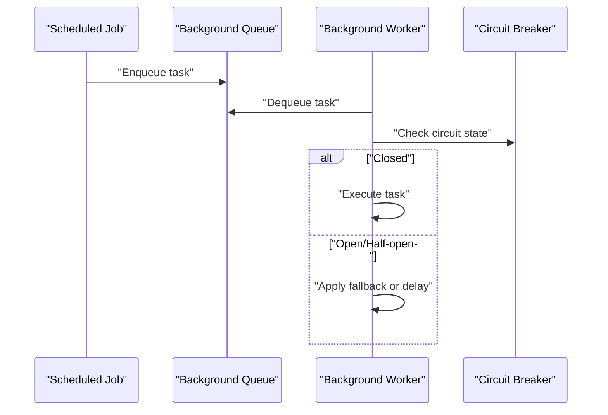

**Diagram sources**
- [background_queue.py](file://background/background_queue.py)
- [background_worker.py](file://background/background_worker.py)
- [circuit_breaker.py](file://background/circuit_breaker.py)

**Section sources**
- [background_queue.py](file://background/background_queue.py)
- [background_worker.py](file://background/background_worker.py)
- [circuit_breaker.py](file://background/circuit_breaker.py)

### Failure Recovery Strategies
- Automatic retries with exponential backoff for transient errors.
- Dead letter queues for tasks exceeding retry limits.
- Stalled task detection and remediation via queue monitors.
- Idempotent handlers to safely re-run failed jobs.
- Health checks and alerts to surface persistent issues.

**Section sources**
- [monitor_task_queue.py](file://cron/monitor_task_queue.py)
- [background_queue.py](file://background/background_queue.py)
- [circuit_breaker.py](file://background/circuit_breaker.py)
- [cron_runs.py](file://cron/cron_runs.py)

## Dependency Analysis
The scheduler depends on job registry, locking, run tracking, timeouts, and monitoring. Background workers depend on queue, circuit breaker, and various domain-specific coordinators. Fleet components coordinate multi-process scheduling and execution.

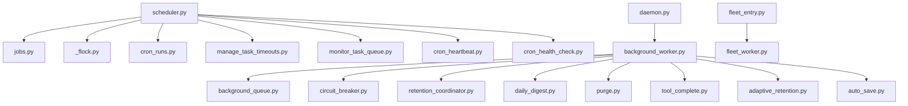

**Diagram sources**
- [scheduler.py](file://cron/scheduler.py)
- [jobs.py](file://cron/jobs.py)
- [_flock.py](file://cron/_flock.py)
- [cron_runs.py](file://cron/cron_runs.py)
- [manage_task_timeouts.py](file://cron/manage_task_timeouts.py)
- [monitor_task_queue.py](file://cron/monitor_task_queue.py)
- [cron_heartbeat.py](file://cron/cron_heartbeat.py)
- [cron_health_check.py](file://cron/cron_health_check.py)
- [daemon.py](file://background/daemon.py)
- [background_worker.py](file://background/background_worker.py)
- [background_queue.py](file://background/background_queue.py)
- [circuit_breaker.py](file://background/circuit_breaker.py)
- [retention_coordinator.py](file://background/retention_coordinator.py)
- [daily_digest.py](file://background/daily_digest.py)
- [purge.py](file://background/purge.py)
- [tool_complete.py](file://background/tool_complete.py)
- [adaptive_retention.py](file://background/adaptive_retention.py)
- [auto_save.py](file://background/auto_save.py)
- [fleet_entry.py](file://background/fleet_entry.py)
- [fleet_worker.py](file://background/fleet_worker.py)

**Section sources**
- [scheduler.py](file://cron/scheduler.py)
- [jobs.py](file://cron/jobs.py)
- [_flock.py](file://cron/_flock.py)
- [cron_runs.py](file://cron/cron_runs.py)
- [manage_task_timeouts.py](file://cron/manage_task_timeouts.py)
- [monitor_task_queue.py](file://cron/monitor_task_queue.py)
- [cron_heartbeat.py](file://cron/cron_heartbeat.py)
- [cron_health_check.py](file://cron/cron_health_check.py)
- [daemon.py](file://background/daemon.py)
- [background_worker.py](file://background/background_worker.py)
- [background_queue.py](file://background/background_queue.py)
- [circuit_breaker.py](file://background/circuit_breaker.py)
- [retention_coordinator.py](file://background/retention_coordinator.py)
- [daily_digest.py](file://background/daily_digest.py)
- [purge.py](file://background/purge.py)
- [tool_complete.py](file://background/tool_complete.py)
- [adaptive_retention.py](file://background/adaptive_retention.py)
- [auto_save.py](file://background/auto_save.py)
- [fleet_entry.py](file://background/fleet_entry.py)
- [fleet_worker.py](file://background/fleet_worker.py)

## Performance Considerations
- Prefer lightweight handlers; delegate heavy work to background queues.
- Use timeouts to cap execution time and prevent resource contention.
- Batch operations where possible to reduce overhead.
- Monitor queue depth and latency; tune worker concurrency accordingly.
- Avoid overlapping jobs that compete for the same resources; use locks and ordering.
- Cache frequently accessed data and reuse connections.

[No sources needed since this section provides general guidance]

## Troubleshooting Guide
Common issues and diagnostics:
- Jobs not executing: verify crontab/launch agent installation and scheduler process status.
- Concurrent executions: inspect lock conflicts and ensure flock is functioning.
- Long-running jobs: check timeout configurations and handler efficiency.
- Stalled tasks: review queue monitoring outputs and retry policies.
- Health issues: examine heartbeat and health check endpoints.

Operational utilities:
- Manage task timeouts
- Monitor task queue
- Heartbeat and health checks
- Run tracking queries

**Section sources**
- [install_crontab.sh](file://cron/install_crontab.sh)
- [install_launchagent.sh](file://cron/install_launchagent.sh)
- [manage_task_timeouts.py](file://cron/manage_task_timeouts.py)
- [monitor_task_queue.py](file://cron/monitor_task_queue.py)
- [cron_heartbeat.py](file://cron/cron_heartbeat.py)
- [cron_health_check.py](file://cron/cron_health_check.py)
- [cron_runs.py](file://cron/cron_runs.py)

## Conclusion
The job scheduling system combines robust cron-based orchestration, flexible internal scheduling, and event-driven background processing. With strong locking, run tracking, timeouts, and monitoring, it supports reliable maintenance, cleanup, and optimization workflows. Extensibility is straightforward via the job registry, while fleet orchestration enables scalable multi-process deployments.

[No sources needed since this section summarizes without analyzing specific files]

## Appendices

### Example Workflows
- Daily knowledge graph backfill and monitoring:
  - Backfill job populates missing data.
  - Monitor job validates progress and reports anomalies.
- Embedding recomputation and drift detection:
  - Recompute embeddings periodically.
  - Detect vector drift and trigger reindexing.

**Section sources**
- [cron_kg_backfill.py](file://cron/cron_kg_backfill.py)
- [cron_kg_backfill_monitor.py](file://cron/cron_kg_backfill_monitor.py)
- [cron_embedding_recompute.py](file://cron/cron_embedding_recompute.py)
- [cron_detect_vec_drift.py](file://cron/cron_detect_vec_drift.py)