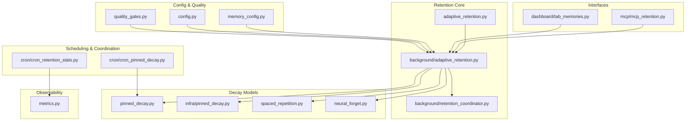
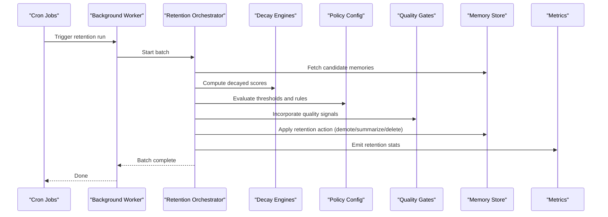
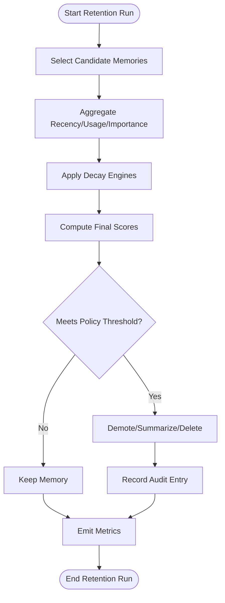
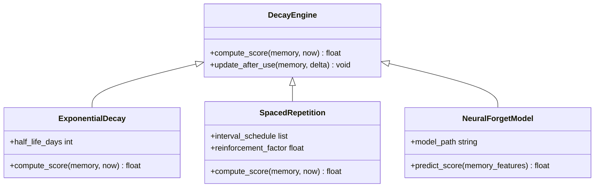
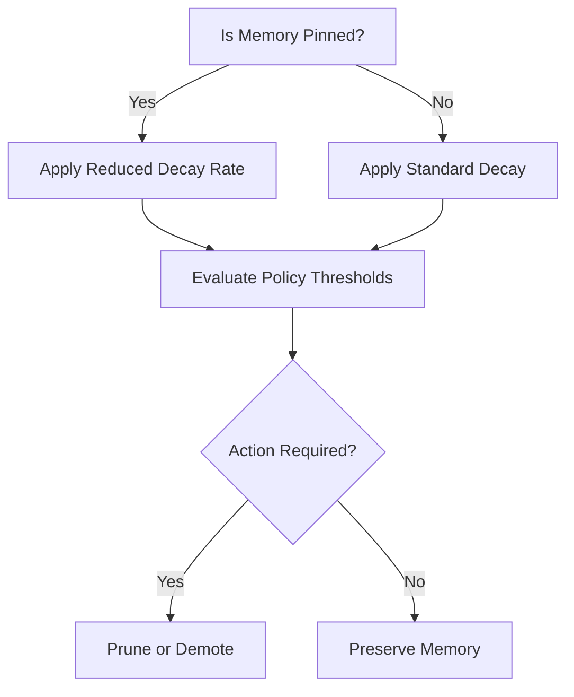
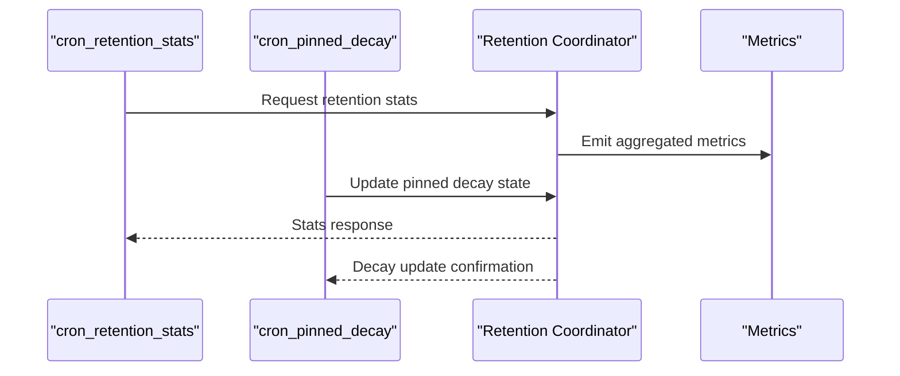
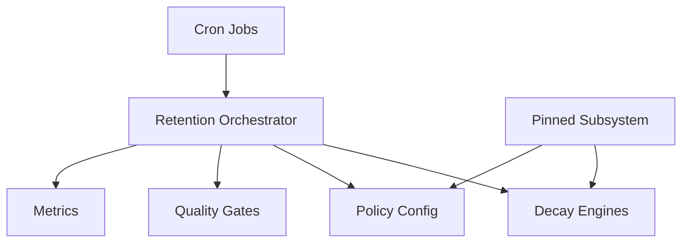

# Adaptive Retention

<cite>
**Referenced Files in This Document**
- [adaptive_retention.py](file://adaptive_retention.py)
- [background/adaptive_retention.py](file://background/adaptive_retention.py)
- [background/retention_coordinator.py](file://background/retention_coordinator.py)
- [cron/cron_retention_stats.py](file://cron/cron_retention_stats.py)
- [cron/cron_pinned_decay.py](file://cron/cron_pinned_decay.py)
- [infra/pinned_decay.py](file://infra/pinned_decay.py)
- [mcp/mcp_retention.py](file://mcp/mcp_retention.py)
- [memory_config.py](file://memory_config.py)
- [config.py](file://config.py)
- [neural_forget.py](file://neural_forget.py)
- [spaced_repetition.py](file://spaced_repetition.py)
- [pinned_decay.py](file://pinned_decay.py)
- [quality_gates.py](file://quality_gates.py)
- [metrics.py](file://metrics.py)
- [dashboard/tab_memories.py](file://dashboard/tab_memories.py)
</cite>

## Table of Contents
1. [Introduction](#introduction)
2. [Project Structure](#project-structure)
3. [Core Components](#core-components)
4. [Architecture Overview](#architecture-overview)
5. [Detailed Component Analysis](#detailed-component-analysis)
6. [Dependency Analysis](#dependency-analysis)
7. [Performance Considerations](#performance-considerations)
8. [Troubleshooting Guide](#troubleshooting-guide)
9. [Conclusion](#conclusion)
10. [Appendices](#appendices)

## Introduction
This document explains the adaptive retention system that automatically ages and prunes memories based on usage patterns, recency, and importance scores. It covers retention policy configuration, decay algorithms, scoring mechanisms, pinned memory behavior, integration with quality assessment, performance considerations for large datasets, and troubleshooting guidance. The goal is to help operators and developers understand how retention decisions are made, how to customize them, and how to monitor and maintain healthy retention behavior over time.

## Project Structure
The adaptive retention system spans several modules:
- Core retention logic and background execution
- Cron scheduling and coordination
- Decay models (exponential, spaced repetition, neural forget)
- Pinned memory handling
- Metrics and observability
- Dashboard and MCP interfaces for inspection and control

**Diagram sources**
- [adaptive_retention.py](file://adaptive_retention.py)
- [background/adaptive_retention.py](file://background/adaptive_retention.py)
- [background/retention_coordinator.py](file://background/retention_coordinator.py)
- [pinned_decay.py](file://pinned_decay.py)
- [infra/pinned_decay.py](file://infra/pinned_decay.py)
- [spaced_repetition.py](file://spaced_repetition.py)
- [neural_forget.py](file://neural_forget.py)
- [cron/cron_retention_stats.py](file://cron/cron_retention_stats.py)
- [cron/cron_pinned_decay.py](file://cron/cron_pinned_decay.py)
- [mcp/mcp_retention.py](file://mcp/mcp_retention.py)
- [dashboard/tab_memories.py](file://dashboard/tab_memories.py)
- [memory_config.py](file://memory_config.py)
- [config.py](file://config.py)
- [quality_gates.py](file://quality_gates.py)
- [metrics.py](file://metrics.py)

**Section sources**
- [adaptive_retention.py](file://adaptive_retention.py)
- [background/adaptive_retention.py](file://background/adaptive_retention.py)
- [background/retention_coordinator.py](file://background/retention_coordinator.py)
- [pinned_decay.py](file://pinned_decay.py)
- [infra/pinned_decay.py](file://infra/pinned_decay.py)
- [spaced_repetition.py](file://spaced_repetition.py)
- [neural_forget.py](file://neural_forget.py)
- [cron/cron_retention_stats.py](file://cron/cron_retention_stats.py)
- [cron/cron_pinned_decay.py](file://cron/cron_pinned_decay.py)
- [mcp/mcp_retention.py](file://mcp/mcp_retention.py)
- [dashboard/tab_memories.py](file://dashboard/tab_memories.py)
- [memory_config.py](file://memory_config.py)
- [config.py](file://config.py)
- [quality_gates.py](file://quality_gates.py)
- [metrics.py](file://metrics.py)

## Core Components
- Retention orchestrator: Coordinates candidate selection, scoring, pruning, and persistence of retention actions.
- Decay engines: Implement different forgetting curves (e.g., exponential decay, spaced repetition intervals, neural forget model).
- Pinned memory subsystem: Protects selected memories from decay or applies a slower decay rate.
- Policy configuration: Centralized settings for thresholds, half-lives, caps, and overrides.
- Quality gates: Interacts with retention by considering memory quality signals when deciding what to prune.
- Scheduling and metrics: Cron jobs trigger periodic runs; metrics capture retention outcomes and health.

Key responsibilities:
- Compute per-memory scores combining recency, usage frequency, and importance.
- Apply decay functions to reduce scores over time.
- Enforce retention policies to decide whether to demote, summarize, or delete memories.
- Respect pinned status and tier-based overrides.
- Record metrics and audit trails for retention actions.

**Section sources**
- [background/adaptive_retention.py](file://background/adaptive_retention.py)
- [background/retention_coordinator.py](file://background/retention_coordinator.py)
- [pinned_decay.py](file://pinned_decay.py)
- [infra/pinned_decay.py](file://infra/pinned_decay.py)
- [spaced_repetition.py](file://spaced_repetition.py)
- [neural_forget.py](file://neural_forget.py)
- [memory_config.py](file://memory_config.py)
- [config.py](file://config.py)
- [quality_gates.py](file://quality_gates.py)
- [metrics.py](file://metrics.py)

## Architecture Overview
The retention pipeline executes periodically via cron tasks and background workers. It selects candidates, computes scores using decay models, applies policy rules, and performs retention actions while recording metrics.

**Diagram sources**
- [cron/cron_retention_stats.py](file://cron/cron_retention_stats.py)
- [cron/cron_pinned_decay.py](file://cron/cron_pinned_decay.py)
- [background/adaptive_retention.py](file://background/adaptive_retention.py)
- [background/retention_coordinator.py](file://background/retention_coordinator.py)
- [pinned_decay.py](file://pinned_decay.py)
- [infra/pinned_decay.py](file://infra/pinned_decay.py)
- [spaced_repetition.py](file://spaced_repetition.py)
- [neural_forget.py](file://neural_forget.py)
- [memory_config.py](file://memory_config.py)
- [quality_gates.py](file://quality_gates.py)
- [metrics.py](file://metrics.py)

## Detailed Component Analysis

### Retention Orchestrator
Responsibilities:
- Select candidate memories for evaluation.
- Aggregate features: recency, usage counts, importance indicators.
- Invoke decay engines to compute current scores.
- Apply policy thresholds and tier overrides.
- Execute retention actions and record outcomes.

Operational flow:
- Candidate selection uses indexes and filters (e.g., age, tier, pinned status).
- Scoring combines multiple signals; pinned memories may receive protection or reduced decay.
- Policy enforcement decides final action based on configured thresholds.
- Actions are persisted with audit entries and metrics.

**Diagram sources**
- [background/adaptive_retention.py](file://background/adaptive_retention.py)
- [background/retention_coordinator.py](file://background/retention_coordinator.py)
- [pinned_decay.py](file://pinned_decay.py)
- [infra/pinned_decay.py](file://infra/pinned_decay.py)
- [spaced_repetition.py](file://spaced_repetition.py)
- [neural_forget.py](file://neural_forget.py)
- [memory_config.py](file://memory_config.py)
- [metrics.py](file://metrics.py)

**Section sources**
- [background/adaptive_retention.py](file://background/adaptive_retention.py)
- [background/retention_coordinator.py](file://background/retention_coordinator.py)

### Decay Engines
- Exponential decay: Reduces score over time based on half-life parameters.
- Spaced repetition: Uses interval-based reinforcement to slow decay after recent usage.
- Neural forget model: Learns forgetting curves from historical usage data.

Configuration aspects:
- Half-life durations per tier or globally.
- Reinforcement factors for recent interactions.
- Model selection and training cadence for neural forget.

**Diagram sources**
- [pinned_decay.py](file://pinned_decay.py)
- [infra/pinned_decay.py](file://infra/pinned_decay.py)
- [spaced_repetition.py](file://spaced_repetition.py)
- [neural_forget.py](file://neural_forget.py)

**Section sources**
- [pinned_decay.py](file://pinned_decay.py)
- [infra/pinned_decay.py](file://infra/pinned_decay.py)
- [spaced_repetition.py](file://spaced_repetition.py)
- [neural_forget.py](file://neural_forget.py)

### Pinned Memory Subsystem
Pinned memories are protected from aggressive pruning or subject to slower decay. Configuration includes:
- Pin flags and pin duration.
- Override decay rates for pinned items.
- Interaction with tier-based policies.

**Diagram sources**
- [pinned_decay.py](file://pinned_decay.py)
- [infra/pinned_decay.py](file://infra/pinned_decay.py)
- [cron/cron_pinned_decay.py](file://cron/cron_pinned_decay.py)

**Section sources**
- [pinned_decay.py](file://pinned_decay.py)
- [infra/pinned_decay.py](file://infra/pinned_decay.py)
- [cron/cron_pinned_decay.py](file://cron/cron_pinned_decay.py)

### Policy Configuration
Retention policies define:
- Global and per-tier thresholds for demotion, summarization, deletion.
- Minimum retention windows before any action.
- Overrides for pinned or high-importance memories.
- Integration points with quality gates to factor in reliability signals.

Typical configuration keys include:
- Thresholds for score cutoffs.
- Half-life durations.
- Tier-specific overrides.
- Quality gate weights.

**Section sources**
- [memory_config.py](file://memory_config.py)
- [config.py](file://config.py)
- [quality_gates.py](file://quality_gates.py)

### Quality Gates Integration
Quality assessment influences retention by:
- Lowering scores for low-quality memories.
- Increasing retention windows for high-quality content.
- Providing feedback loops to improve future scoring.

Interaction points:
- Score adjustments based on quality labels.
- Conditional policy relaxation for verified high-quality items.

**Section sources**
- [quality_gates.py](file://quality_gates.py)

### Scheduling and Coordination
Cron jobs orchestrate periodic retention runs:
- Stats collection and reporting.
- Pinned decay updates.
- Coordination with background workers to avoid contention.

**Diagram sources**
- [cron/cron_retention_stats.py](file://cron/cron_retention_stats.py)
- [cron/cron_pinned_decay.py](file://cron/cron_pinned_decay.py)
- [background/retention_coordinator.py](file://background/retention_coordinator.py)
- [metrics.py](file://metrics.py)

**Section sources**
- [cron/cron_retention_stats.py](file://cron/cron_retention_stats.py)
- [cron/cron_pinned_decay.py](file://cron/cron_pinned_decay.py)
- [background/retention_coordinator.py](file://background/retention_coordinator.py)

### Interfaces and Monitoring
- MCP retention interface exposes operations for querying and adjusting retention behavior.
- Dashboard memories tab provides visibility into retention outcomes and allows manual overrides.

**Section sources**
- [mcp/mcp_retention.py](file://mcp/mcp_retention.py)
- [dashboard/tab_memories.py](file://dashboard/tab_memories.py)

## Dependency Analysis
Retention depends on configuration, decay models, quality gates, and metrics. The following diagram shows key dependencies:

**Diagram sources**
- [background/adaptive_retention.py](file://background/adaptive_retention.py)
- [pinned_decay.py](file://pinned_decay.py)
- [memory_config.py](file://memory_config.py)
- [quality_gates.py](file://quality_gates.py)
- [metrics.py](file://metrics.py)
- [cron/cron_retention_stats.py](file://cron/cron_retention_stats.py)
- [cron/cron_pinned_decay.py](file://cron/cron_pinned_decay.py)

**Section sources**
- [background/adaptive_retention.py](file://background/adaptive_retention.py)
- [pinned_decay.py](file://pinned_decay.py)
- [memory_config.py](file://memory_config.py)
- [quality_gates.py](file://quality_gates.py)
- [metrics.py](file://metrics.py)
- [cron/cron_retention_stats.py](file://cron/cron_retention_stats.py)
- [cron/cron_pinned_decay.py](file://cron/cron_pinned_decay.py)

## Performance Considerations
- Batch processing: Process candidates in batches to limit memory pressure and database load.
- Index utilization: Use indexes on recency, tier, and pinned flags to speed up candidate selection.
- Incremental updates: Prefer incremental decay updates rather than recomputing all scores.
- Caching: Cache frequently accessed policy and quality gate results.
- Concurrency controls: Avoid contention between retention runs and write paths.
- Model efficiency: For neural forget, use lightweight inference and precomputed features where possible.

[No sources needed since this section provides general guidance]

## Troubleshooting Guide
Common issues and resolutions:
- No memories being pruned: Verify thresholds and half-life values; check pinned overrides; ensure quality gates are not inflating scores excessively.
- Over-pruning: Increase minimum retention windows; adjust thresholds upward; review pinned protections.
- High CPU/memory usage during runs: Reduce batch size; enable incremental updates; profile decay computations.
- Stale metrics: Confirm cron jobs are running; check coordinator locks; validate metric emission paths.
- Pinned memories still decaying too fast: Review pinned decay configuration and override rates.

Diagnostic steps:
- Inspect retention stats via MCP or dashboard.
- Validate policy configuration drift and hot reload.
- Review audit logs for retention actions.
- Monitor cron job health and worker availability.

**Section sources**
- [cron/cron_retention_stats.py](file://cron/cron_retention_stats.py)
- [mcp/mcp_retention.py](file://mcp/mcp_retention.py)
- [dashboard/tab_memories.py](file://dashboard/tab_memories.py)
- [background/retention_coordinator.py](file://background/retention_coordinator.py)
- [metrics.py](file://metrics.py)

## Conclusion
The adaptive retention system balances memory longevity with relevance by combining recency, usage, and importance signals through configurable decay models and policy thresholds. Pinned memories and quality gates provide additional control and safety. Proper configuration, monitoring, and performance tuning ensure robust operation at scale.

[No sources needed since this section summarizes without analyzing specific files]

## Appendices

### Example Customizations
- Adjust global half-life and per-tier thresholds to tune aggressiveness.
- Configure pinned decay overrides to protect critical memories longer.
- Integrate custom quality gate weights to reflect domain-specific reliability.

[No sources needed since this section provides general guidance]