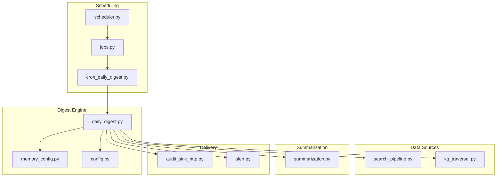
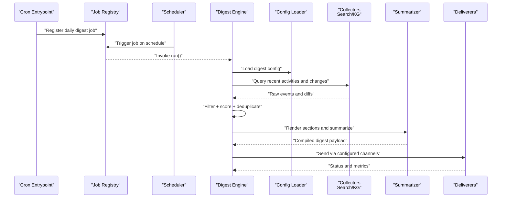
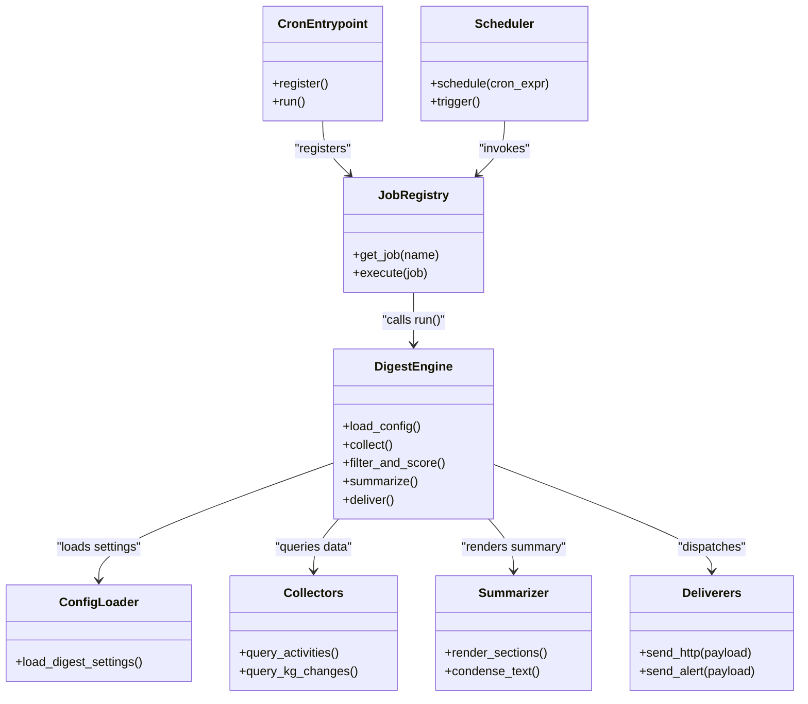
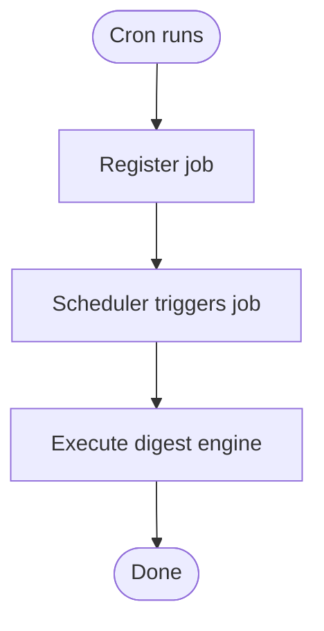
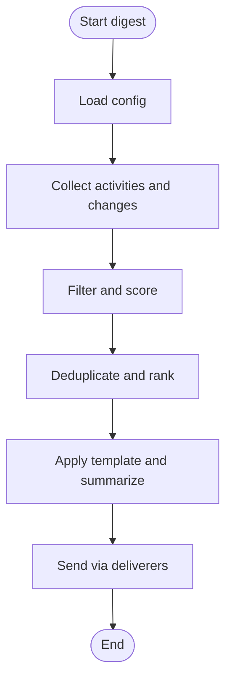
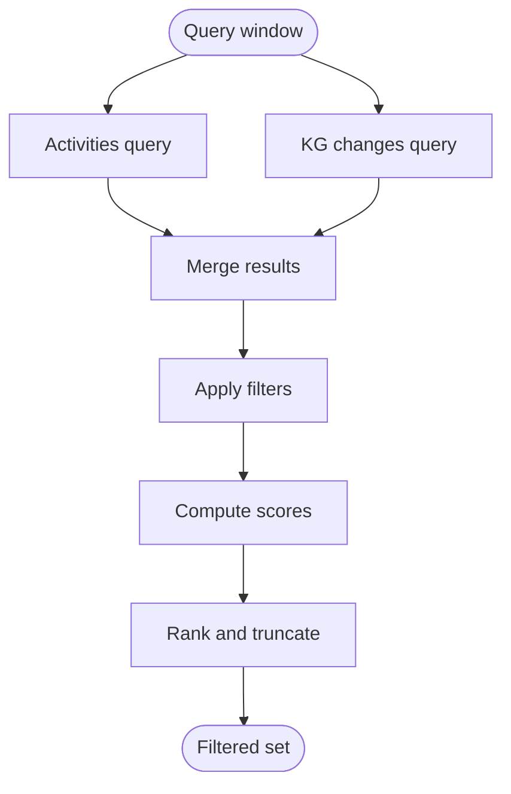
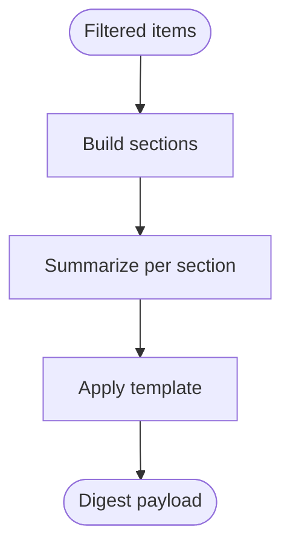
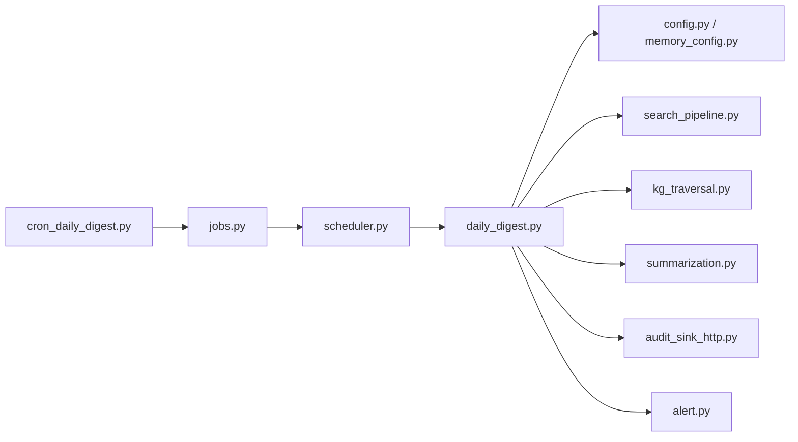

# Daily Digest Generation

<cite>
**Referenced Files in This Document**
- [daily_digest.py](file://background/daily_digest.py)
- [cron_daily_digest.py](file://cron/cron_daily_digest.py)
- [jobs.py](file://cron/jobs.py)
- [scheduler.py](file://cron/scheduler.py)
- [config.py](file://infra/config.py)
- [memory_config.py](file://infra/memory_config.py)
- [kg_traversal.py](file://kg/kg_traversal.py)
- [search_pipeline.py](file://search_pipeline.py)
- [summarization.py](file://summarization.py)
- [audit_sink_http.py](file://infra/audit_sink_http.py)
- [alert.py](file://infra/alert.py)
</cite>

## Table of Contents
1. [Introduction](#introduction)
2. [Project Structure](#project-structure)
3. [Core Components](#core-components)
4. [Architecture Overview](#architecture-overview)
5. [Detailed Component Analysis](#detailed-component-analysis)
6. [Dependency Analysis](#dependency-analysis)
7. [Performance Considerations](#performance-considerations)
8. [Troubleshooting Guide](#troubleshooting-guide)
9. [Conclusion](#conclusion)
10. [Appendices](#appendices)

## Introduction
This document explains the daily digest generation system that compiles concise summaries of agent activities, memory updates, and knowledge graph changes. It covers how digests are scheduled, what content is included, how to customize formats and filters, how to deliver digests via external channels, and how to optimize size and relevance. It also provides troubleshooting guidance for common failures.

## Project Structure
The daily digest feature spans background execution, cron scheduling, configuration, data retrieval, summarization, and delivery:

- Background worker implementation: [daily_digest.py](file://background/daily_digest.py)
- Cron job entrypoint: [cron_daily_digest.py](file://cron/cron_daily_digest.py)
- Job registration and metadata: [jobs.py](file://cron/jobs.py)
- Scheduler integration: [scheduler.py](file://cron/scheduler.py)
- Configuration loading: [config.py](file://infra/config.py), [memory_config.py](file://infra/memory_config.py)
- Knowledge graph traversal utilities: [kg_traversal.py](file://kg/kg_traversal.py)
- Search pipeline (for activity and change discovery): [search_pipeline.py](file://search_pipeline.py)
- Summarization utilities: [summarization.py](file://summarization.py)
- Delivery integrations (HTTP audit sink and alerting): [audit_sink_http.py](file://infra/audit_sink_http.py), [alert.py](file://infra/alert.py)



**Diagram sources**
- [scheduler.py](file://cron/scheduler.py)
- [jobs.py](file://cron/jobs.py)
- [cron_daily_digest.py](file://cron/cron_daily_digest.py)
- [daily_digest.py](file://background/daily_digest.py)
- [memory_config.py](file://infra/memory_config.py)
- [config.py](file://infra/config.py)
- [search_pipeline.py](file://search_pipeline.py)
- [kg_traversal.py](file://kg/kg_traversal.py)
- [summarization.py](file://summarization.py)
- [audit_sink_http.py](file://infra/audit_sink_http.py)
- [alert.py](file://infra/alert.py)

**Section sources**
- [daily_digest.py](file://background/daily_digest.py)
- [cron_daily_digest.py](file://cron/cron_daily_digest.py)
- [jobs.py](file://cron/jobs.py)
- [scheduler.py](file://cron/scheduler.py)
- [config.py](file://infra/config.py)
- [memory_config.py](file://infra/memory_config.py)
- [kg_traversal.py](file://kg/kg_traversal.py)
- [search_pipeline.py](file://search_pipeline.py)
- [summarization.py](file://summarization.py)
- [audit_sink_http.py](file://infra/audit_sink_http.py)
- [alert.py](file://infra/alert.py)

## Core Components
- Cron entrypoint: Registers and invokes the daily digest job at configured times.
- Digest engine: Orchestrates collection of agent activities, memory updates, and KG changes; applies filters and scoring; builds a structured summary; renders templates; and dispatches delivery.
- Configuration: Loads digest settings such as schedule, template, filters, and delivery endpoints.
- Data collectors: Query search and KG subsystems for recent events and changes.
- Summarizer: Condenses collected items into concise text or structured sections.
- Deliverers: Send digests via HTTP sinks or alerting channels.

Key responsibilities and interactions are illustrated below.



**Diagram sources**
- [cron_daily_digest.py](file://cron/cron_daily_digest.py)
- [jobs.py](file://cron/jobs.py)
- [scheduler.py](file://cron/scheduler.py)
- [daily_digest.py](file://background/daily_digest.py)
- [config.py](file://infra/config.py)
- [memory_config.py](file://infra/memory_config.py)
- [search_pipeline.py](file://search_pipeline.py)
- [kg_traversal.py](file://kg/kg_traversal.py)
- [summarization.py](file://summarization.py)
- [audit_sink_http.py](file://infra/audit_sink_http.py)
- [alert.py](file://infra/alert.py)

**Section sources**
- [daily_digest.py](file://background/daily_digest.py)
- [cron_daily_digest.py](file://cron/cron_daily_digest.py)
- [jobs.py](file://cron/jobs.py)
- [scheduler.py](file://cron/scheduler.py)
- [config.py](file://infra/config.py)
- [memory_config.py](file://infra/memory_config.py)
- [search_pipeline.py](file://search_pipeline.py)
- [kg_traversal.py](file://kg/kg_traversal.py)
- [summarization.py](file://summarization.py)
- [audit_sink_http.py](file://infra/audit_sink_http.py)
- [alert.py](file://infra/alert.py)

## Architecture Overview
The digest pipeline follows a clear separation of concerns:

- Scheduling layer: Uses the scheduler and job registry to trigger the digest at configured intervals.
- Orchestration layer: The digest engine coordinates data collection, filtering, summarization, and delivery.
- Data layer: Pulls from search and knowledge graph subsystems using traversal and query utilities.
- Presentation layer: Applies templates and summarizes content into digest sections.
- Delivery layer: Sends results through HTTP-based sinks or alerting channels.



**Diagram sources**
- [cron_daily_digest.py](file://cron/cron_daily_digest.py)
- [jobs.py](file://cron/jobs.py)
- [scheduler.py](file://cron/scheduler.py)
- [daily_digest.py](file://background/daily_digest.py)
- [config.py](file://infra/config.py)
- [memory_config.py](file://infra/memory_config.py)
- [search_pipeline.py](file://search_pipeline.py)
- [kg_traversal.py](file://kg/kg_traversal.py)
- [summarization.py](file://summarization.py)
- [audit_sink_http.py](file://infra/audit_sink_http.py)
- [alert.py](file://infra/alert.py)

## Detailed Component Analysis

### Cron Entrypoint and Job Registration
- Purpose: Register the daily digest job with the scheduler and provide an executable entrypoint for cron.
- Behavior: On invocation, it delegates to the job registry which triggers the digest engine’s main routine.
- Integration points:
  - Scheduler: Receives cron expressions and triggers jobs.
  - Job registry: Maps job names to implementations.



**Diagram sources**
- [cron_daily_digest.py](file://cron/cron_daily_digest.py)
- [jobs.py](file://cron/jobs.py)
- [scheduler.py](file://cron/scheduler.py)

**Section sources**
- [cron_daily_digest.py](file://cron/cron_daily_digest.py)
- [jobs.py](file://cron/jobs.py)
- [scheduler.py](file://cron/scheduler.py)

### Digest Engine Orchestration
- Responsibilities:
  - Load configuration (schedule, template, filters, delivery).
  - Collect recent agent activities and memory updates via search.
  - Discover knowledge graph changes via traversal utilities.
  - Apply content filters and relevance scoring.
  - Render digest sections using templates.
  - Dispatch to configured delivery channels.
- Error handling:
  - Graceful degradation when collectors fail.
  - Retry and fallback strategies for delivery.
  - Telemetry and logging for observability.



**Diagram sources**
- [daily_digest.py](file://background/daily_digest.py)
- [config.py](file://infra/config.py)
- [memory_config.py](file://infra/memory_config.py)
- [search_pipeline.py](file://search_pipeline.py)
- [kg_traversal.py](file://kg/kg_traversal.py)
- [summarization.py](file://summarization.py)
- [audit_sink_http.py](file://infra/audit_sink_http.py)
- [alert.py](file://infra/alert.py)

**Section sources**
- [daily_digest.py](file://background/daily_digest.py)
- [config.py](file://infra/config.py)
- [memory_config.py](file://infra/memory_config.py)
- [search_pipeline.py](file://search_pipeline.py)
- [kg_traversal.py](file://kg/kg_traversal.py)
- [summarization.py](file://summarization.py)
- [audit_sink_http.py](file://infra/audit_sink_http.py)
- [alert.py](file://infra/alert.py)

### Configuration Model
- Schedule: Defines cron expression or time window for digest runs.
- Template: Specifies section layout and formatting rules.
- Filters: Content categories, time windows, source scopes, and exclusion rules.
- Delivery: Endpoint URLs, headers, authentication, and retry policies.
- Size controls: Max tokens, max sections, truncation thresholds.
- Relevance scoring: Weights for recency, frequency, entity importance, and user-defined tags.

Configuration is loaded by the digest engine prior to collection and rendering.

**Section sources**
- [config.py](file://infra/config.py)
- [memory_config.py](file://infra/memory_config.py)
- [daily_digest.py](file://background/daily_digest.py)

### Data Collection and Filtering
- Activities and memory updates:
  - Use search pipeline queries scoped to the last day or configured window.
  - Filter by agent identity, session scope, and content type.
- Knowledge graph changes:
  - Traverse edges and nodes modified within the window.
  - Aggregate facts, entities, and relationships updated.
- Filtering and scoring:
  - Apply category filters and exclusions.
  - Score items based on recency, frequency, and entity centrality.
  - Deduplicate near-duplicates and merge related items.



**Diagram sources**
- [search_pipeline.py](file://search_pipeline.py)
- [kg_traversal.py](file://kg/kg_traversal.py)
- [daily_digest.py](file://background/daily_digest.py)

**Section sources**
- [search_pipeline.py](file://search_pipeline.py)
- [kg_traversal.py](file://kg/kg_traversal.py)
- [daily_digest.py](file://background/daily_digest.py)

### Summarization and Template Rendering
- Section composition:
  - Agent activity highlights.
  - Memory update summaries.
  - Knowledge graph change highlights.
- Summarization:
  - Condense long entries into concise bullets.
  - Preserve key entities and decisions.
- Templates:
  - Define section order, headings, and formatting.
  - Support variable substitution for dynamic content.



**Diagram sources**
- [summarization.py](file://summarization.py)
- [daily_digest.py](file://background/daily_digest.py)

**Section sources**
- [summarization.py](file://summarization.py)
- [daily_digest.py](file://background/daily_digest.py)

### Delivery Mechanisms
- HTTP sink:
  - POST digest payload to configured endpoint.
  - Supports custom headers and basic auth/token schemes.
- Alerting channel:
  - Emit alerts for high-priority items or digest completion status.
- Retries and backoff:
  - Exponential backoff on transient errors.
  - Dead-letter logging for persistent failures.

```mermaid
sequenceDiagram
participant Eng as "Digest Engine"
participant HTTP as "HTTP Sink"
participant Alt as "Alert Channel"
Eng->>HTTP : "POST payload"
HTTP-->>Eng : "2xx success"
Eng->>Alt : "Send alert/status"
Alt-->>Eng : "Acknowledged"
```

**Diagram sources**
- [audit_sink_http.py](file://infra/audit_sink_http.py)
- [alert.py](file://infra/alert.py)
- [daily_digest.py](file://background/daily_digest.py)

**Section sources**
- [audit_sink_http.py](file://infra/audit_sink_http.py)
- [alert.py](file://infra/alert.py)
- [daily_digest.py](file://background/daily_digest.py)

## Dependency Analysis
The digest system depends on scheduling, configuration, data retrieval, summarization, and delivery layers. Coupling is minimized by passing structured payloads between components.



**Diagram sources**
- [cron_daily_digest.py](file://cron/cron_daily_digest.py)
- [jobs.py](file://cron/jobs.py)
- [scheduler.py](file://cron/scheduler.py)
- [daily_digest.py](file://background/daily_digest.py)
- [config.py](file://infra/config.py)
- [memory_config.py](file://infra/memory_config.py)
- [search_pipeline.py](file://search_pipeline.py)
- [kg_traversal.py](file://kg/kg_traversal.py)
- [summarization.py](file://summarization.py)
- [audit_sink_http.py](file://infra/audit_sink_http.py)
- [alert.py](file://infra/alert.py)

**Section sources**
- [cron_daily_digest.py](file://cron/cron_daily_digest.py)
- [jobs.py](file://cron/jobs.py)
- [scheduler.py](file://cron/scheduler.py)
- [daily_digest.py](file://background/daily_digest.py)
- [config.py](file://infra/config.py)
- [memory_config.py](file://infra/memory_config.py)
- [search_pipeline.py](file://search_pipeline.py)
- [kg_traversal.py](file://kg/kg_traversal.py)
- [summarization.py](file://summarization.py)
- [audit_sink_http.py](file://infra/audit_sink_http.py)
- [alert.py](file://infra/alert.py)

## Performance Considerations
- Time-window scoping: Limit queries to the most recent period to reduce load.
- Index utilization: Ensure search indexes are up-to-date for fast retrieval.
- Truncation and ranking: Apply size caps early to avoid heavy processing on low-value items.
- Batch operations: Group deliveries and retries to minimize network overhead.
- Caching: Cache frequently accessed reference data (e.g., entity importance) across runs.

[No sources needed since this section provides general guidance]

## Troubleshooting Guide
Common issues and resolutions:

- Cron not triggering:
  - Verify job registration and scheduler configuration.
  - Check logs around expected run times.
- Empty or incomplete digests:
  - Inspect collector queries and time windows.
  - Validate filters and exclusions.
- Delivery failures:
  - Confirm endpoint reachability and credentials.
  - Review retry/backoff logs and dead-letter entries.
- High latency:
  - Reduce time window or increase index freshness.
  - Tighten filters and ranking thresholds.

Operational checks:
- Confirm configuration values for schedule, template, and delivery endpoints.
- Validate health of search and KG subsystems before digest runs.

**Section sources**
- [cron_daily_digest.py](file://cron/cron_daily_digest.py)
- [jobs.py](file://cron/jobs.py)
- [scheduler.py](file://cron/scheduler.py)
- [daily_digest.py](file://background/daily_digest.py)
- [audit_sink_http.py](file://infra/audit_sink_http.py)
- [alert.py](file://infra/alert.py)

## Conclusion
The daily digest system orchestrates scheduled collection, filtering, summarization, and delivery of agent activities, memory updates, and knowledge graph changes. By tuning configuration, filters, and templates, teams can control digest size and relevance while integrating with external notification systems. Robust error handling and performance optimizations ensure reliable operation at scale.

[No sources needed since this section summarizes without analyzing specific files]

## Appendices

### Example: Configuring Digest Schedule
- Set a cron expression or time window in configuration.
- Ensure the scheduler picks up the new schedule and the job is registered.

**Section sources**
- [config.py](file://infra/config.py)
- [memory_config.py](file://infra/memory_config.py)
- [scheduler.py](file://cron/scheduler.py)
- [jobs.py](file://cron/jobs.py)

### Example: Customizing Summary Templates
- Define sections and variables in the template configuration.
- Adjust ordering and formatting to match team preferences.

**Section sources**
- [daily_digest.py](file://background/daily_digest.py)
- [summarization.py](file://summarization.py)

### Example: Integrating with External Notification Systems
- Configure HTTP sink URL, headers, and authentication.
- Optionally enable alerting for critical updates.

**Section sources**
- [audit_sink_http.py](file://infra/audit_sink_http.py)
- [alert.py](file://infra/alert.py)
- [daily_digest.py](file://background/daily_digest.py)