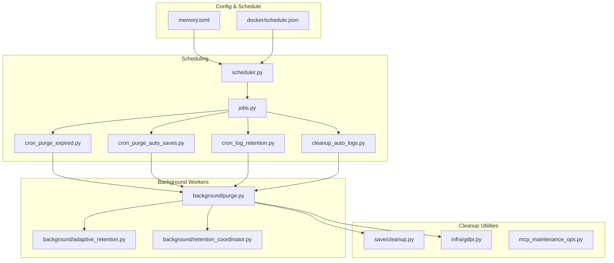
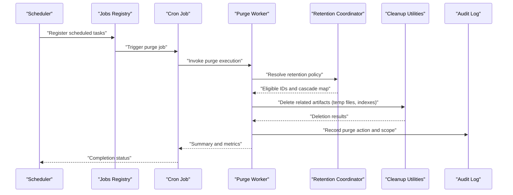
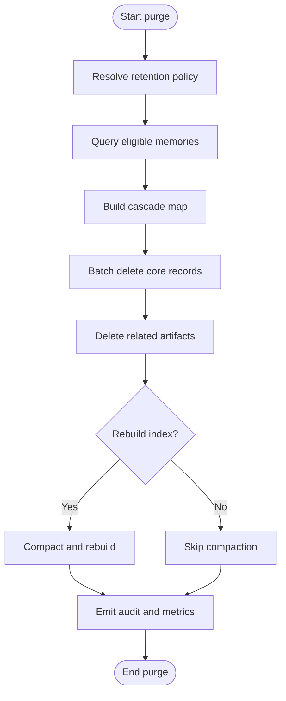
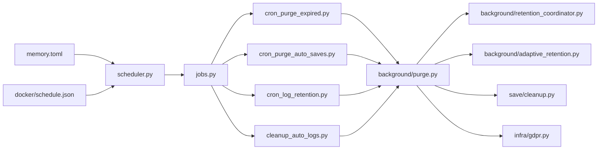

# Data Purging and Cleanup

<cite>
**Referenced Files in This Document**
- [background/purge.py](file://background/purge.py)
- [cron/cron_purge_expired.py](file://cron/cron_purge_expired.py)
- [cron/cron_purge_auto_saves.py](file://cron/cron_purge_auto_saves.py)
- [cron/cleanup_auto_logs.py](file://cron/cleanup_auto_logs.py)
- [cron/cron_log_retention.py](file://cron/cron_log_retention.py)
- [background/adaptive_retention.py](file://background/adaptive_retention.py)
- [background/retention_coordinator.py](file://background/retention_coordinator.py)
- [save/cleanup.py](file://save/cleanup.py)
- [infra/gdpr.py](file://infra/gdpr.py)
- [mcp_maintenance_ops.py](file://mcp_maintenance_ops.py)
- [cron/jobs.py](file://cron/jobs.py)
- [cron/scheduler.py](file://cron/scheduler.py)
- [docker/schedule.json](file://docker/schedule.json)
- [memory.toml](file://memory.toml)
</cite>

## Table of Contents
1. [Introduction](#introduction)
2. [Project Structure](#project-structure)
3. [Core Components](#core-components)
4. [Architecture Overview](#architecture-overview)
5. [Detailed Component Analysis](#detailed-component-analysis)
6. [Dependency Analysis](#dependency-analysis)
7. [Performance Considerations](#performance-considerations)
8. [Troubleshooting Guide](#troubleshooting-guide)
9. [Conclusion](#conclusion)
10. [Appendices](#appendices)

## Introduction
This document explains how data purging and cleanup are implemented and operated across the system. It covers automated cleanup of expired memories, temporary files, and audit logs; purge policies and retention periods; cascading deletion rules; scheduling and configuration; monitoring storage usage; safety measures including backups before purging; recovery procedures for accidental deletions; performance impact considerations; and best practices for production environments.

## Project Structure
The purging and cleanup functionality is primarily implemented under:
- Background workers and coordinators that execute periodic tasks
- Cron jobs that schedule and orchestrate maintenance operations
- Maintenance utilities for targeted cleanup and policy enforcement
- Configuration and scheduling manifests that define when and how often tasks run

**Diagram sources**
- [cron/scheduler.py](file://cron/scheduler.py)
- [cron/jobs.py](file://cron/jobs.py)
- [cron/cron_purge_expired.py](file://cron/cron_purge_expired.py)
- [cron/cron_purge_auto_saves.py](file://cron/cron_purge_auto_saves.py)
- [cron/cron_log_retention.py](file://cron/cron_log_retention.py)
- [cron/cleanup_auto_logs.py](file://cron/cleanup_auto_logs.py)
- [background/purge.py](file://background/purge.py)
- [save/cleanup.py](file://save/cleanup.py)
- [infra/gdpr.py](file://infra/gdpr.py)
- [background/adaptive_retention.py](file://background/adaptive_retention.py)
- [background/retention_coordinator.py](file://background/retention_coordinator.py)
- [memory.toml](file://memory.toml)
- [docker/schedule.json](file://docker/schedule.json)

**Section sources**
- [cron/scheduler.py](file://cron/scheduler.py)
- [cron/jobs.py](file://cron/jobs.py)
- [docker/schedule.json](file://docker/schedule.json)
- [memory.toml](file://memory.toml)

## Core Components
- Purge executor: centralizes deletion logic for expired items and enforces consistency across related tables and indexes.
- Adaptive retention: computes dynamic retention thresholds based on usage patterns and recency.
- Retention coordinator: orchestrates multi-step retention workflows and ensures idempotency and safety.
- Cleanup utilities: handle temporary file removal, auto-save pruning, and log retention.
- GDPR erasure: provides subject-scoped deletion with tenant isolation and auditability.
- Maintenance operations: expose safe, auditable endpoints to trigger or inspect purges.

Key responsibilities:
- Define and enforce retention policies (time-based and adaptive).
- Perform cascading deletions safely and atomically where possible.
- Log all actions for compliance and observability.
- Provide hooks for pre-purge backup and post-purge verification.

**Section sources**
- [background/purge.py](file://background/purge.py)
- [background/adaptive_retention.py](file://background/adaptive_retention.py)
- [background/retention_coordinator.py](file://background/retention_coordinator.py)
- [save/cleanup.py](file://save/cleanup.py)
- [infra/gdpr.py](file://infra/gdpr.py)
- [mcp_maintenance_ops.py](file://mcp_maintenance_ops.py)

## Architecture Overview
The system uses a layered approach:
- Scheduling layer defines when tasks run via cron or Docker schedules.
- Orchestration layer dispatches jobs to background workers.
- Execution layer performs purges with safeguards, logging, and optional backups.
- Policy layer determines what qualifies for deletion using time windows and adaptive signals.

**Diagram sources**
- [cron/scheduler.py](file://cron/scheduler.py)
- [cron/jobs.py](file://cron/jobs.py)
- [cron/cron_purge_expired.py](file://cron/cron_purge_expired.py)
- [background/purge.py](file://background/purge.py)
- [background/retention_coordinator.py](file://background/retention_coordinator.py)
- [save/cleanup.py](file://save/cleanup.py)

## Detailed Component Analysis

### Expired Memories Purge
Purpose:
- Remove memories that exceed configured retention windows.
- Enforce tenant scoping and avoid cross-tenant deletions.
- Cascade deletes to dependent records and indexes.

Flow:
- Identify eligible memories by observed timestamps and policy.
- Build a cascade map of related entities (embeddings, chunks, facts).
- Execute deletions in batches with transactional boundaries.
- Update indexes and compact if needed.
- Emit audit events and metrics.

**Diagram sources**
- [cron/cron_purge_expired.py](file://cron/cron_purge_expired.py)
- [background/purge.py](file://background/purge.py)
- [background/retention_coordinator.py](file://background/retention_coordinator.py)
- [save/cleanup.py](file://save/cleanup.py)

**Section sources**
- [cron/cron_purge_expired.py](file://cron/cron_purge_expired.py)
- [background/purge.py](file://background/purge.py)
- [background/retention_coordinator.py](file://background/retention_coordinator.py)
- [save/cleanup.py](file://save/cleanup.py)

### Auto-Save Purge
Purpose:
- Clean up temporary auto-saved drafts beyond their retention window.
- Ensure no active sessions reference deleted auto-saves.

Behavior:
- Identify auto-saves older than configured threshold.
- Verify session references and detach if necessary.
- Delete auto-save records and associated temp files.
- Record audit entries.

**Section sources**
- [cron/cron_purge_auto_saves.py](file://cron/cron_purge_auto_saves.py)
- [save/cleanup.py](file://save/cleanup.py)

### Audit Logs Retention
Purpose:
- Manage retention of internal and external audit logs.
- Rotate and archive logs per policy.
- Prevent excessive disk growth while preserving compliance evidence.

Behavior:
- Apply retention windows to audit log entries.
- Archive or compress logs according to policy.
- Remove archived logs after secondary retention period.
- Track retention stats and emit alerts on anomalies.

**Section sources**
- [cron/cron_log_retention.py](file://cron/cron_log_retention.py)
- [cron/cleanup_auto_logs.py](file://cron/cleanup_auto_logs.py)

### Adaptive Retention
Purpose:
- Dynamically adjust retention thresholds based on access frequency, recency, and relevance signals.
- Reduce storage pressure without sacrificing retrieval quality.

Mechanism:
- Compute decay scores for memories.
- Adjust retention windows per tier or category.
- Integrate with purge executor to apply updated thresholds.

**Section sources**
- [background/adaptive_retention.py](file://background/adaptive_retention.py)
- [background/retention_coordinator.py](file://background/retention_coordinator.py)

### GDPR Erasure
Purpose:
- Support subject-scoped deletion with strict tenant isolation.
- Provide verifiable, auditable erasure flows.

Safety:
- Validate tenant context and principal permissions.
- Scope deletions to subject-owned data only.
- Produce an erasure certificate and audit trail.

**Section sources**
- [infra/gdpr.py](file://infra/gdpr.py)

### Maintenance Operations
Purpose:
- Expose controlled operations for administrators to trigger purges, inspect status, and validate outcomes.
- Provide dry-run capabilities and detailed reporting.

Capabilities:
- Trigger purge jobs with configurable scopes.
- View purge history and metrics.
- Validate database integrity post-purge.

**Section sources**
- [mcp_maintenance_ops.py](file://mcp_maintenance_ops.py)

## Dependency Analysis
The following diagram shows key dependencies among purging components and their integration points.

**Diagram sources**
- [cron/scheduler.py](file://cron/scheduler.py)
- [cron/jobs.py](file://cron/jobs.py)
- [cron/cron_purge_expired.py](file://cron/cron_purge_expired.py)
- [cron/cron_purge_auto_saves.py](file://cron/cron_purge_auto_saves.py)
- [cron/cron_log_retention.py](file://cron/cron_log_retention.py)
- [cron/cleanup_auto_logs.py](file://cron/cleanup_auto_logs.py)
- [background/purge.py](file://background/purge.py)
- [background/retention_coordinator.py](file://background/retention_coordinator.py)
- [background/adaptive_retention.py](file://background/adaptive_retention.py)
- [save/cleanup.py](file://save/cleanup.py)
- [infra/gdpr.py](file://infra/gdpr.py)
- [memory.toml](file://memory.toml)
- [docker/schedule.json](file://docker/schedule.json)

**Section sources**
- [cron/scheduler.py](file://cron/scheduler.py)
- [cron/jobs.py](file://cron/jobs.py)
- [docker/schedule.json](file://docker/schedule.json)
- [memory.toml](file://memory.toml)

## Performance Considerations
- Batch sizes: Use moderate batch sizes to balance throughput and memory usage during large-scale purges.
- Indexing overhead: Avoid frequent full index rebuilds; prefer incremental updates and compaction windows.
- Concurrency control: Serialize purge operations per tenant to prevent contention and ensure consistency.
- I/O throttling: Limit concurrent file deletions and compactions to reduce disk pressure.
- Monitoring: Track purge duration, rows affected, and storage reclaimed to detect regressions.

[No sources needed since this section provides general guidance]

## Troubleshooting Guide
Common issues and resolutions:
- Purge job not running:
  - Verify scheduler registration and cron/Docker schedule configuration.
  - Check job logs for errors and lock contention.
- Partial deletions:
  - Inspect transaction boundaries and rollback behavior.
  - Validate cascade maps for missing relationships.
- Storage not decreasing:
  - Confirm compaction and index rebuild steps executed successfully.
  - Check for orphaned files and manual cleanup if necessary.
- Compliance concerns:
  - Review audit logs for completeness and tenant scoping.
  - Ensure GDPR erasure certificates are generated and stored.

Operational checks:
- Use maintenance operations to list recent purge runs and statuses.
- Validate database integrity after purge completion.
- Monitor metrics for purge-related KPIs.

**Section sources**
- [mcp_maintenance_ops.py](file://mcp_maintenance_ops.py)
- [cron/cron_purge_expired.py](file://cron/cron_purge_expired.py)
- [cron/cron_log_retention.py](file://cron/cron_log_retention.py)

## Conclusion
The purging and cleanup subsystem combines scheduled orchestration, robust background workers, and policy-driven retention to maintain storage health and compliance. By leveraging adaptive retention, careful cascading, comprehensive auditing, and safe operational controls, the system supports reliable, high-performance cleanup in production environments.

[No sources needed since this section summarizes without analyzing specific files]

## Appendices

### Configuration and Scheduling Examples
- Configure retention windows and purge frequencies in the main configuration file.
- Define cron schedules or Docker schedule entries to automate purge jobs.
- Customize cleanup criteria through policy parameters and adaptive retention settings.

**Section sources**
- [memory.toml](file://memory.toml)
- [docker/schedule.json](file://docker/schedule.json)

### Backup Requirements Before Purging
- Create consistent snapshots of databases and file stores prior to large-scale purges.
- Validate backups and store them offsite or in immutable storage.
- Document backup identifiers and retention alongside purge runs for traceability.

[No sources needed since this section provides general guidance]

### Recovery Procedures for Accidentally Deleted Data
- Restore from verified backups using documented runbooks.
- Rebuild indexes and perform integrity checks post-restore.
- Audit restored data against purge logs to ensure completeness.

[No sources needed since this section provides general guidance]