# Maintenance Tasks

<cite>
**Referenced Files in This Document**
- [maintenance.py](file://agentic_memory/maintenance.py)
- [adaptive_retention.py](file://background/adaptive_retention.py)
- [daily_digest.py](file://background/daily_digest.py)
- [purge.py](file://background/purge.py)
- [tool_complete.py](file://background/tool_complete.py)
- [retention_coordinator.py](file://background/retention_coordinator.py)
- [cron_purge_expired.py](file://cron/cron_purge_expired.py)
- [cron_log_retention.py](file://cron/cron_log_retention.py)
- [cron_compact.py](file://cron/cron_compact.py)
- [cron_rebuild_fts.py](file://cron/cron_rebuild_fts.py)
- [cron_embedding_recompute.py](file://cron/cron_embedding_recompute.py)
- [cron_kg_backfill.py](file://cron/cron_kg_backfill.py)
- [cron_policy_hash_status.py](file://cron/cron_policy_hash_status.py)
- [cron_retention_stats.py](file://cron/cron_retention_stats.py)
- [mcp_maintenance.py](file://mcp_maintenance.py)
- [mcp_maintenance_ops.py](file://mcp_maintenance_ops.py)
- [mcp_retention.py](file://mcp_retention.py)
- [metrics.py](file://infra/metrics.py)
- [config.py](file://infra/config.py)
- [jobs.py](file://cron/jobs.py)
- [scheduler.py](file://cron/scheduler.py)
</cite>

## Table of Contents
1. [Introduction](#introduction)
2. [Project Structure](#project-structure)
3. [Core Components](#core-components)
4. [Architecture Overview](#architecture-overview)
5. [Detailed Component Analysis](#detailed-component-analysis)
6. [Dependency Analysis](#dependency-analysis)
7. [Performance Considerations](#performance-considerations)
8. [Troubleshooting Guide](#troubleshooting-guide)
9. [Conclusion](#conclusion)
10. [Appendices](#appendices)

## Introduction
This document explains the built-in maintenance tasks that keep the system healthy, performant, and compliant with retention policies. It covers:
- Adaptive retention policies and their coordination
- Daily digest generation
- Data purging and cleanup operations
- Tool completion handlers
- Memory optimization tasks
- Index maintenance (vector and full-text search)
- Database cleanup operations
- Task configurations, execution parameters, monitoring metrics, dependencies, resource usage, and performance impact considerations

The goal is to help operators configure, run, monitor, and troubleshoot maintenance workflows effectively.

## Project Structure
Maintenance functionality spans several modules:
- Background task implementations for adaptive retention, daily digests, purging, and tool completion
- Cron job definitions that schedule and orchestrate maintenance
- MCP tools exposing maintenance operations via API
- Metrics and configuration utilities used by maintenance tasks

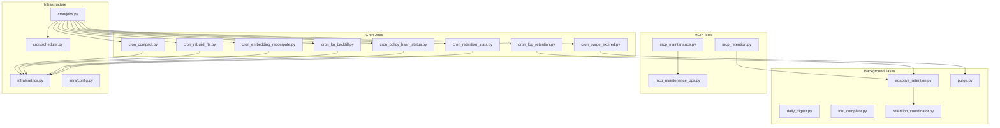

**Diagram sources**
- [adaptive_retention.py](file://background/adaptive_retention.py)
- [retention_coordinator.py](file://background/retention_coordinator.py)
- [daily_digest.py](file://background/daily_digest.py)
- [purge.py](file://background/purge.py)
- [tool_complete.py](file://background/tool_complete.py)
- [cron_purge_expired.py](file://cron/cron_purge_expired.py)
- [cron_log_retention.py](file://cron/cron_log_retention.py)
- [cron_compact.py](file://cron/cron_compact.py)
- [cron_rebuild_fts.py](file://cron/cron_rebuild_fts.py)
- [cron_embedding_recompute.py](file://cron/cron_embedding_recompute.py)
- [cron_kg_backfill.py](file://cron/cron_kg_backfill.py)
- [cron_policy_hash_status.py](file://cron/cron_policy_hash_status.py)
- [cron_retention_stats.py](file://cron/cron_retention_stats.py)
- [mcp_maintenance.py](file://mcp_maintenance.py)
- [mcp_maintenance_ops.py](file://mcp_maintenance_ops.py)
- [mcp_retention.py](file://mcp_retention.py)
- [infra/metrics.py](file://infra/metrics.py)
- [infra/config.py](file://infra/config.py)
- [cron/jobs.py](file://cron/jobs.py)
- [cron/scheduler.py](file://cron/scheduler.py)

**Section sources**
- [maintenance.py](file://agentic_memory/maintenance.py)
- [adaptive_retention.py](file://background/adaptive_retention.py)
- [daily_digest.py](file://background/daily_digest.py)
- [purge.py](file://background/purge.py)
- [tool_complete.py](file://background/tool_complete.py)
- [retention_coordinator.py](file://background/retention_coordinator.py)
- [cron_purge_expired.py](file://cron/cron_purge_expired.py)
- [cron_log_retention.py](file://cron/cron_log_retention.py)
- [cron_compact.py](file://cron/cron_compact.py)
- [cron_rebuild_fts.py](file://cron/cron_rebuild_fts.py)
- [cron_embedding_recompute.py](file://cron/cron_embedding_recompute.py)
- [cron_kg_backfill.py](file://cron/cron_kg_backfill.py)
- [cron_policy_hash_status.py](file://cron/cron_policy_hash_status.py)
- [cron_retention_stats.py](file://cron/cron_retention_stats.py)
- [mcp_maintenance.py](file://mcp_maintenance.py)
- [mcp_maintenance_ops.py](file://mcp_maintenance_ops.py)
- [mcp_retention.py](file://mcp_retention.py)
- [infra/metrics.py](file://infra/metrics.py)
- [infra/config.py](file://infra/config.py)
- [cron/jobs.py](file://cron/jobs.py)
- [cron/scheduler.py](file://cron/scheduler.py)

## Core Components
- Adaptive Retention: Dynamically adjusts memory retention based on usage patterns and recency signals. Implemented in background module and coordinated centrally.
- Daily Digest: Generates periodic summaries of activity and insights; configurable output formats.
- Purge: Removes expired or low-value data according to policy and thresholds.
- Tool Completion Handler: Ensures side effects and bookkeeping are finalized after tool executions.
- Retention Coordinator: Orchestrates retention decisions across subsystems and exposes status/stats.
- Cron Jobs: Schedule and execute maintenance tasks with timeouts, retries, and observability.
- MCP Tools: Provide operational APIs to trigger and inspect maintenance operations.

Key responsibilities and interactions are detailed in the following sections.

**Section sources**
- [adaptive_retention.py](file://background/adaptive_retention.py)
- [retention_coordinator.py](file://background/retention_coordinator.py)
- [daily_digest.py](file://background/daily_digest.py)
- [purge.py](file://background/purge.py)
- [tool_complete.py](file://background/tool_complete.py)
- [cron_purge_expired.py](file://cron/cron_purge_expired.py)
- [cron_log_retention.py](file://cron/cron_log_retention.py)
- [cron_compact.py](file://cron/cron_compact.py)
- [cron_rebuild_fts.py](file://cron/cron_rebuild_fts.py)
- [cron_embedding_recompute.py](file://cron/cron_embedding_recompute.py)
- [cron_kg_backfill.py](file://cron/cron_kg_backfill.py)
- [cron_policy_hash_status.py](file://cron/cron_policy_hash_status.py)
- [cron_retention_stats.py](file://cron/cron_retention_stats.py)
- [mcp_maintenance.py](file://mcp_maintenance.py)
- [mcp_maintenance_ops.py](file://mcp_maintenance_ops.py)
- [mcp_retention.py](file://mcp_retention.py)

## Architecture Overview
The maintenance architecture separates concerns between scheduling, execution, and observability:
- Scheduler/Cron layer defines jobs and schedules them using a central scheduler.
- Job runners invoke background task implementations.
- Background tasks use shared infrastructure (configuration, metrics, database, vector store).
- MCP tools expose control surfaces for operators.

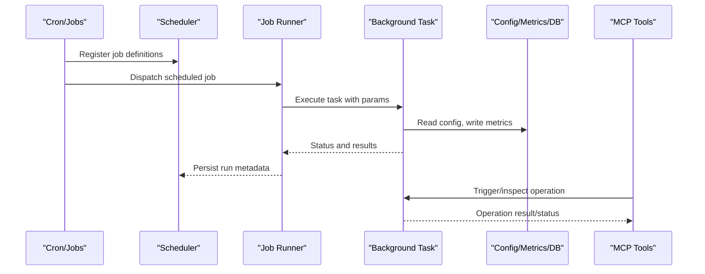

**Diagram sources**
- [cron/jobs.py](file://cron/jobs.py)
- [cron/scheduler.py](file://cron/scheduler.py)
- [cron_purge_expired.py](file://cron/cron_purge_expired.py)
- [cron_log_retention.py](file://cron/cron_log_retention.py)
- [cron_compact.py](file://cron/cron_compact.py)
- [cron_rebuild_fts.py](file://cron/cron_rebuild_fts.py)
- [cron_embedding_recompute.py](file://cron/cron_embedding_recompute.py)
- [cron_kg_backfill.py](file://cron/cron_kg_backfill.py)
- [cron_policy_hash_status.py](file://cron/cron_policy_hash_status.py)
- [cron_retention_stats.py](file://cron/cron_retention_stats.py)
- [adaptive_retention.py](file://background/adaptive_retention.py)
- [purge.py](file://background/purge.py)
- [daily_digest.py](file://background/daily_digest.py)
- [tool_complete.py](file://background/tool_complete.py)
- [mcp_maintenance.py](file://mcp_maintenance.py)
- [mcp_maintenance_ops.py](file://mcp_maintenance_ops.py)
- [mcp_retention.py](file://mcp_retention.py)
- [infra/config.py](file://infra/config.py)
- [infra/metrics.py](file://infra/metrics.py)

## Detailed Component Analysis

### Adaptive Retention Policy
Adaptive retention dynamically tunes how long memories are retained based on observed usage, recency, and policy constraints. The coordinator centralizes decisions and exposes stats.

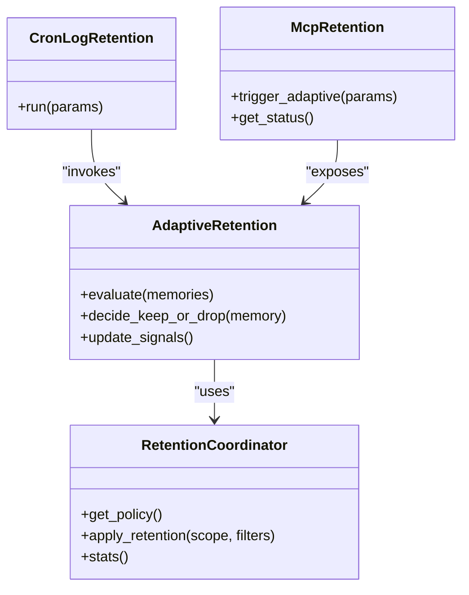

**Diagram sources**
- [retention_coordinator.py](file://background/retention_coordinator.py)
- [adaptive_retention.py](file://background/adaptive_retention.py)
- [cron_log_retention.py](file://cron/cron_log_retention.py)
- [mcp_retention.py](file://mcp_retention.py)

Configuration and execution parameters typically include:
- Scope and filters (tenant, tags, time windows)
- Thresholds for retention probability
- Dry-run vs apply modes
- Concurrency and batch sizes
- Logging and metrics verbosity

Operational notes:
- Prefer dry-run first to validate decisions
- Monitor retention stats before and after runs
- Coordinate with purge jobs to avoid conflicts

**Section sources**
- [adaptive_retention.py](file://background/adaptive_retention.py)
- [retention_coordinator.py](file://background/retention_coordinator.py)
- [cron_log_retention.py](file://cron/cron_log_retention.py)
- [mcp_retention.py](file://mcp_retention.py)

### Daily Digest Generation
Daily digest creates periodic summaries. It supports customizable formats and can be triggered via cron or MCP.

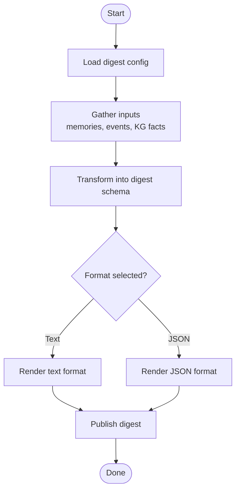

**Diagram sources**
- [daily_digest.py](file://background/daily_digest.py)

Practical examples:
- Configure digest frequency and scope via configuration
- Choose output format (text or structured JSON)
- Integrate digest publishing with notification channels if supported

**Section sources**
- [daily_digest.py](file://background/daily_digest.py)

### Data Purging and Cleanup
Purging removes expired or low-value records according to policy and thresholds. A dedicated cron job orchestrates purges safely.

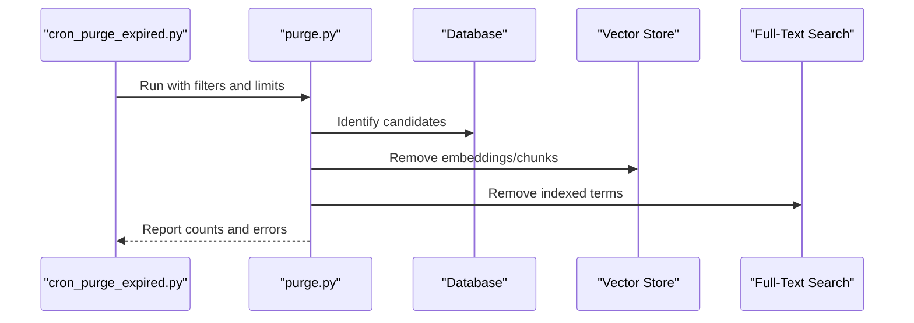

**Diagram sources**
- [cron_purge_expired.py](file://cron/cron_purge_expired.py)
- [purge.py](file://background/purge.py)

Execution parameters commonly include:
- Time cutoffs and retention windows
- Target scopes (tenants, sessions, tags)
- Batch size and concurrency
- Dry-run mode for validation
- Safety checks and idempotency keys

**Section sources**
- [cron_purge_expired.py](file://cron/cron_purge_expired.py)
- [purge.py](file://background/purge.py)

### Tool Completion Handlers
Tool completion ensures post-execution bookkeeping, such as updating state, emitting metrics, and cleaning up temporary resources.

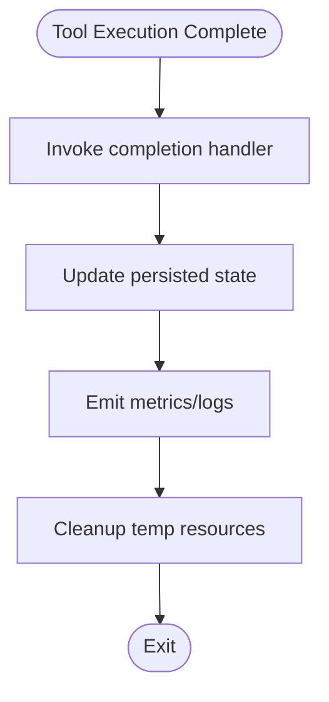

**Diagram sources**
- [tool_complete.py](file://background/tool_complete.py)

Best practices:
- Make handlers idempotent and resilient to partial failures
- Record outcomes and errors for auditability
- Avoid heavy work in hot paths; offload to background tasks when needed

**Section sources**
- [tool_complete.py](file://background/tool_complete.py)

### Memory Optimization Tasks
Tasks like compaction optimize storage layout and improve read/write performance.

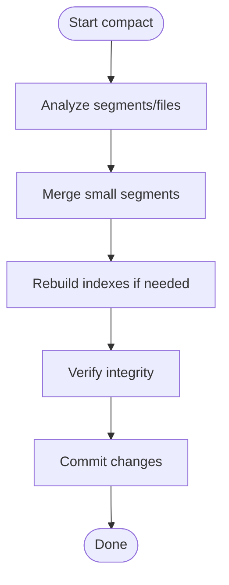

**Diagram sources**
- [cron_compact.py](file://cron/cron_compact.py)

Parameters often include:
- Segment size thresholds
- Max concurrent merges
- Safety checkpoints and rollback points
- Metrics collection during compaction

**Section sources**
- [cron_compact.py](file://cron/cron_compact.py)

### Index Maintenance
Index maintenance includes rebuilding full-text search indices and recomputing embeddings for improved retrieval quality.

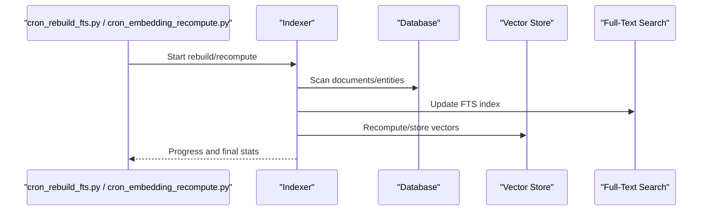

**Diagram sources**
- [cron_rebuild_fts.py](file://cron/cron_rebuild_fts.py)
- [cron_embedding_recompute.py](file://cron/cron_embedding_recompute.py)

Typical parameters:
- Scope filters (tenant, date range, entity types)
- Batch sizes and concurrency
- Resume from last checkpoint
- Validation and rollback strategies

**Section sources**
- [cron_rebuild_fts.py](file://cron/cron_rebuild_fts.py)
- [cron_embedding_recompute.py](file://cron/cron_embedding_recompute.py)

### Knowledge Graph Backfills
KG backfills ensure consistency and completeness of graph structures and derived tables.

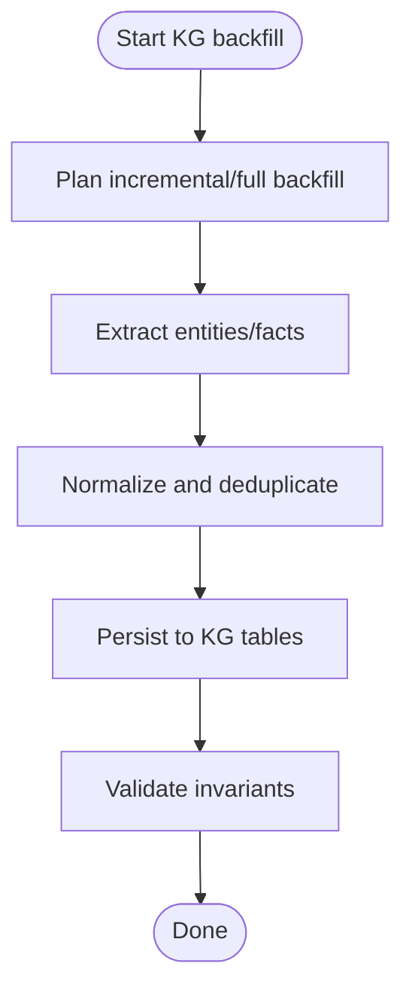

**Diagram sources**
- [cron_kg_backfill.py](file://cron/cron_kg_backfill.py)

Common parameters:
- Backfill type (incremental/full)
- Entity/fact filters
- Concurrency and rate limits
- Idempotency and resume markers

**Section sources**
- [cron_kg_backfill.py](file://cron/cron_kg_backfill.py)

### Policy Hash Status and Retention Stats
Policy hash status tracks configuration drift and policy versions. Retention stats provide visibility into retention behavior.

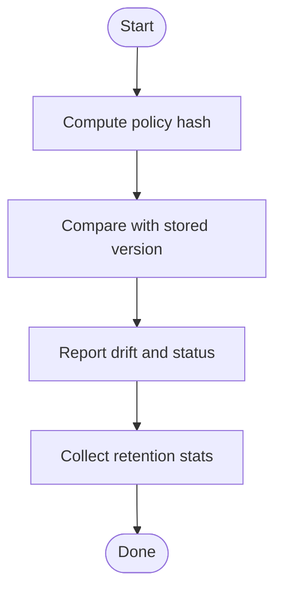

**Diagram sources**
- [cron_policy_hash_status.py](file://cron/cron_policy_hash_status.py)
- [cron_retention_stats.py](file://cron/cron_retention_stats.py)

Use cases:
- Alert on unexpected policy changes
- Audit retention effectiveness over time
- Correlate retention decisions with workload patterns

**Section sources**
- [cron_policy_hash_status.py](file://cron/cron_policy_hash_status.py)
- [cron_retention_stats.py](file://cron/cron_retention_stats.py)

### MCP Maintenance Operations
MCP tools expose maintenance operations for interactive and automated control.

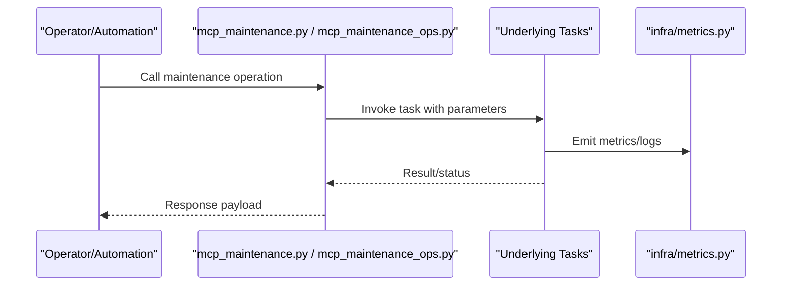

**Diagram sources**
- [mcp_maintenance.py](file://mcp_maintenance.py)
- [mcp_maintenance_ops.py](file://mcp_maintenance_ops.py)
- [infra/metrics.py](file://infra/metrics.py)

Operational guidance:
- Use MCP for targeted runs and diagnostics
- Combine with cron for routine automation
- Always review outputs and metrics after operations

**Section sources**
- [mcp_maintenance.py](file://mcp_maintenance.py)
- [mcp_maintenance_ops.py](file://mcp_maintenance_ops.py)
- [infra/metrics.py](file://infra/metrics.py)

## Dependency Analysis
Maintenance tasks depend on configuration, metrics, and storage layers. Cron jobs coordinate execution through a central scheduler.

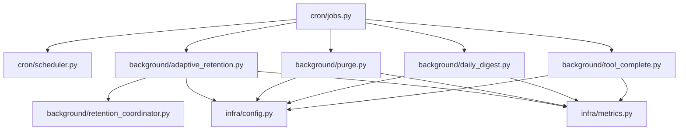

**Diagram sources**
- [infra/config.py](file://infra/config.py)
- [infra/metrics.py](file://infra/metrics.py)
- [cron/jobs.py](file://cron/jobs.py)
- [cron/scheduler.py](file://cron/scheduler.py)
- [background/adaptive_retention.py](file://background/adaptive_retention.py)
- [background/purge.py](file://background/purge.py)
- [background/daily_digest.py](file://background/daily_digest.py)
- [background/tool_complete.py](file://background/tool_complete.py)
- [background/retention_coordinator.py](file://background/retention_coordinator.py)

**Section sources**
- [infra/config.py](file://infra/config.py)
- [infra/metrics.py](file://infra/metrics.py)
- [cron/jobs.py](file://cron/jobs.py)
- [cron/scheduler.py](file://cron/scheduler.py)
- [background/adaptive_retention.py](file://background/adaptive_retention.py)
- [background/purge.py](file://background/purge.py)
- [background/daily_digest.py](file://background/daily_digest.py)
- [background/tool_complete.py](file://background/tool_complete.py)
- [background/retention_coordinator.py](file://background/retention_coordinator.py)

## Performance Considerations
- Batch sizes and concurrency: Tune to balance throughput and resource contention.
- Dry-run modes: Validate decisions and estimates before applying changes.
- Checkpointing and resumability: Prevent rework after interruptions.
- Index rebuilds: Schedule during low-traffic windows; consider incremental updates.
- Compaction: Limit concurrent merges to avoid I/O saturation.
- Metrics-driven tuning: Use retention stats and policy hash status to guide adjustments.

[No sources needed since this section provides general guidance]

## Troubleshooting Guide
Common issues and resolutions:
- Retention decisions not applied: Verify policy hash status and configuration drift; run retention stats to compare expected vs actual behavior.
- Purge job stalls: Check batch sizes, locks, and database connectivity; enable dry-run to estimate candidate counts.
- Index rebuild failures: Inspect progress logs, validate source data integrity, and resume from last checkpoint.
- Embedding recompute overhead: Reduce concurrency, increase batch sizes cautiously, and monitor vector store capacity.
- Daily digest missing entries: Confirm input gathering scope and filters; validate digest format rendering.
- Tool completion side effects not visible: Ensure completion handlers are invoked and metrics/logs are emitted; check idempotency guards.

Operational tips:
- Use MCP tools to trigger targeted runs and inspect intermediate states.
- Cross-reference cron job logs with metrics for correlation.
- Keep configuration changes auditable via policy hash tracking.

**Section sources**
- [cron_policy_hash_status.py](file://cron/cron_policy_hash_status.py)
- [cron_retention_stats.py](file://cron/cron_retention_stats.py)
- [cron_purge_expired.py](file://cron/cron_purge_expired.py)
- [cron_rebuild_fts.py](file://cron/cron_rebuild_fts.py)
- [cron_embedding_recompute.py](file://cron/cron_embedding_recompute.py)
- [daily_digest.py](file://background/daily_digest.py)
- [tool_complete.py](file://background/tool_complete.py)
- [mcp_maintenance.py](file://mcp_maintenance.py)
- [mcp_maintenance_ops.py](file://mcp_maintenance_ops.py)

## Conclusion
Built-in maintenance tasks provide robust mechanisms for retention management, data hygiene, index upkeep, and operational control. By configuring appropriate parameters, leveraging dry-run modes, and monitoring metrics, operators can maintain system health and performance while ensuring compliance with retention policies.

[No sources needed since this section summarizes without analyzing specific files]

## Appendices

### Practical Configuration Examples
- Adaptive retention: Set scope filters, thresholds, and enable dry-run to preview decisions.
- Daily digest: Choose output format (text or JSON), define time window, and select content sources.
- Purging: Define cutoff dates, target scopes, batch sizes, and safety checks.
- Index maintenance: Specify incremental vs full rebuild, concurrency, and resume options.
- KG backfills: Select entity/fact filters, concurrency, and validation flags.

[No sources needed since this section provides general guidance]

### Monitoring Metrics
- Retention decisions count and distribution
- Purge candidate and deletion counts
- Index rebuild progress and duration
- Embedding recompute throughput and error rates
- Policy hash drift alerts
- Compaction segment merge statistics

**Section sources**
- [infra/metrics.py](file://infra/metrics.py)
- [cron_retention_stats.py](file://cron/cron_retention_stats.py)
- [cron_policy_hash_status.py](file://cron/cron_policy_hash_status.py)