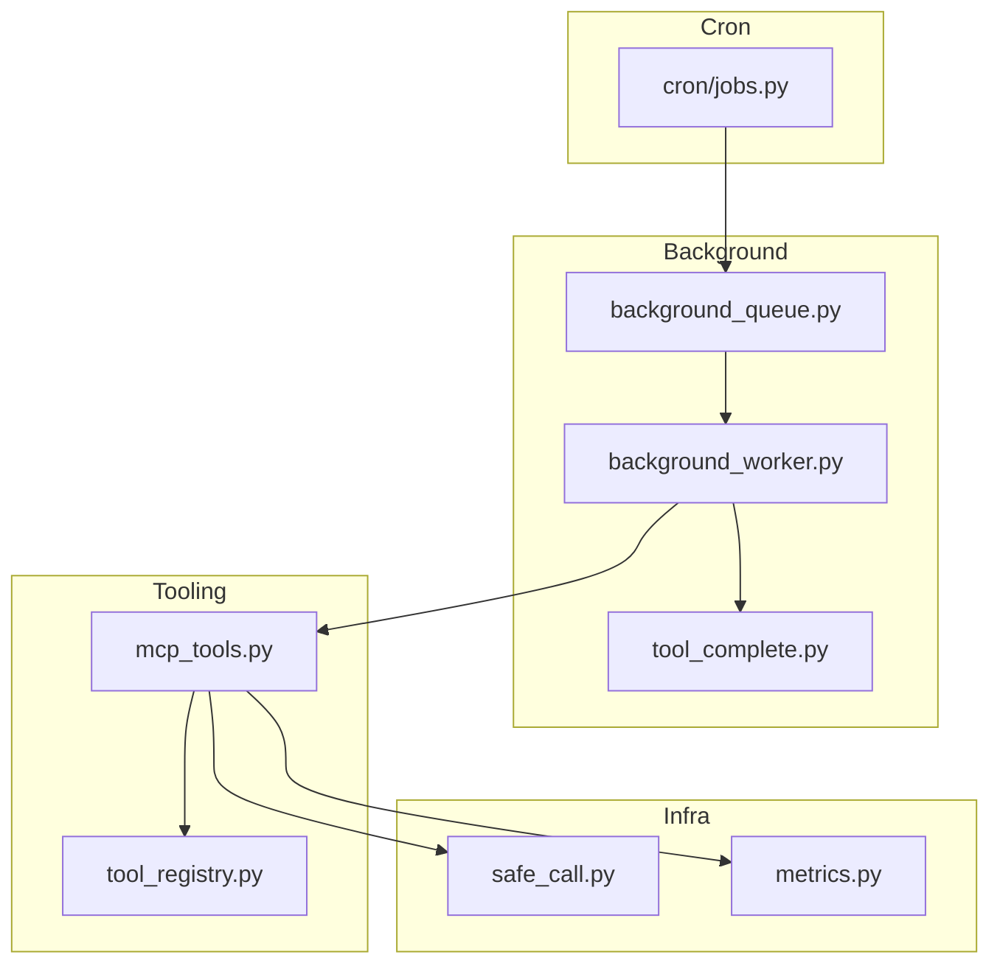
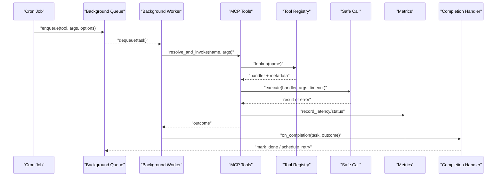
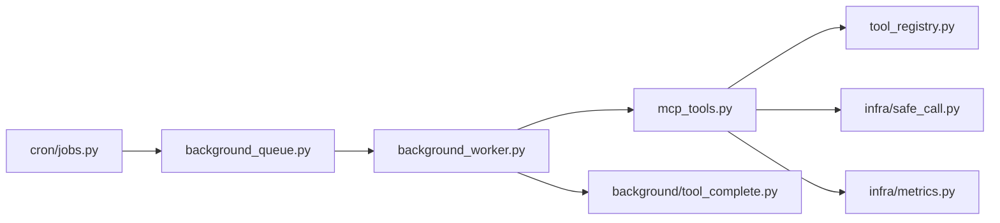

# Tool Completion Handlers

<cite>
**Referenced Files in This Document**
- [background/tool_complete.py](file://background/tool_complete.py)
- [background/background_worker.py](file://background/background_worker.py)
- [background/background_queue.py](file://background/background_queue.py)
- [mcp_tools.py](file://mcp_tools.py)
- [tool_registry.py](file://tool_registry.py)
- [infra/safe_call.py](file://infra/safe_call.py)
- [infra/metrics.py](file://infra/metrics.py)
- [cron/jobs.py](file://cron/jobs.py)
</cite>

## Table of Contents
1. [Introduction](#introduction)
2. [Project Structure](#project-structure)
3. [Core Components](#core-components)
4. [Architecture Overview](#architecture-overview)
5. [Detailed Component Analysis](#detailed-component-analysis)
6. [Dependency Analysis](#dependency-analysis)
7. [Performance Considerations](#performance-considerations)
8. [Troubleshooting Guide](#troubleshooting-guide)
9. [Conclusion](#conclusion)

## Introduction
This document explains how the system tracks tool execution status, handles completion callbacks, and manages resource cleanup for background tool tasks. It covers the tool lifecycle from dispatch to completion, error handling strategies, completion event processing, and integration with the background task queue. It also provides guidance on implementing custom completion handlers, monitoring performance, debugging failures, and ensuring safe concurrent execution with proper resource locking.

## Project Structure
The tool completion pipeline spans several modules:
- Background worker and queue orchestration
- Tool invocation and registration
- Safe execution wrapper and metrics collection
- Cron job integration for scheduled or queued work

**Diagram sources**
- [background/background_queue.py](file://background/background_queue.py)
- [background/background_worker.py](file://background/background_worker.py)
- [background/tool_complete.py](file://background/tool_complete.py)
- [mcp_tools.py](file://mcp_tools.py)
- [tool_registry.py](file://tool_registry.py)
- [infra/safe_call.py](file://infra/safe_call.py)
- [infra/metrics.py](file://infra/metrics.py)
- [cron/jobs.py](file://cron/jobs.py)

**Section sources**
- [background/background_queue.py](file://background/background_queue.py)
- [background/background_worker.py](file://background/background_worker.py)
- [background/tool_complete.py](file://background/tool_complete.py)
- [mcp_tools.py](file://mcp_tools.py)
- [tool_registry.py](file://tool_registry.py)
- [infra/safe_call.py](file://infra/safe_call.py)
- [infra/metrics.py](file://infra/metrics.py)
- [cron/jobs.py](file://cron/jobs.py)

## Core Components
- Background Queue: Enqueues tool tasks with metadata (tool name, arguments, priority, idempotency token). Provides persistence and retry semantics.
- Background Worker: Consumes tasks from the queue, invokes tools via the MCP tool surface, and records outcomes.
- Tool Invocation Layer: Resolves tools by name, validates inputs, executes safely, and emits metrics.
- Completion Handler: Processes post-execution events, updates state, performs cleanup, and triggers downstream actions.
- Safe Call Wrapper: Ensures exceptions are captured, resources are released, and timeouts are enforced.
- Metrics Collector: Records latency, success/failure counts, and per-tool stats.

Key responsibilities:
- Track execution status (pending, running, completed, failed)
- Emit completion callbacks with result/error context
- Clean up resources (locks, connections, temp files)
- Persist results and audit logs
- Integrate with cron jobs for scheduling and retries

**Section sources**
- [background/background_queue.py](file://background/background_queue.py)
- [background/background_worker.py](file://background/background_worker.py)
- [background/tool_complete.py](file://background/tool_complete.py)
- [mcp_tools.py](file://mcp_tools.py)
- [tool_registry.py](file://tool_registry.py)
- [infra/safe_call.py](file://infra/safe_call.py)
- [infra/metrics.py](file://infra/metrics.py)

## Architecture Overview
End-to-end flow from enqueue to completion:

**Diagram sources**
- [cron/jobs.py](file://cron/jobs.py)
- [background/background_queue.py](file://background/background_queue.py)
- [background/background_worker.py](file://background/background_worker.py)
- [mcp_tools.py](file://mcp_tools.py)
- [tool_registry.py](file://tool_registry.py)
- [infra/safe_call.py](file://infra/safe_call.py)
- [infra/metrics.py](file://infra/metrics.py)
- [background/tool_complete.py](file://background/tool_complete.py)

## Detailed Component Analysis

### Background Queue
Responsibilities:
- Persist tasks with unique IDs and idempotency keys
- Provide FIFO/weighted ordering and backpressure controls
- Support retry policies and dead-lettering
- Expose enqueue/dequeue APIs used by workers and cron jobs

Concurrency considerations:
- Use database-level constraints to prevent duplicate processing
- Implement lock-based or optimistic concurrency to avoid double-dequeue
- Ensure atomic transitions between states (queued -> running -> done/failed)

Error handling:
- Retry with exponential backoff for transient errors
- Dead-letter tasks after max attempts with alerting hooks

Resource management:
- Close DB connections promptly
- Purge stale entries via maintenance jobs

**Section sources**
- [background/background_queue.py](file://background/background_queue.py)

### Background Worker
Responsibilities:
- Poll the queue and execute tasks concurrently within configured limits
- Wrap each execution with safe call and metrics instrumentation
- Dispatch completion callbacks upon success or failure
- Update task status and persist audit logs

Concurrency model:
- Pool size bounded by CPU/memory constraints
- Per-task locks for shared resources (e.g., file I/O, external services)
- Graceful shutdown with draining of in-flight tasks

Error handling:
- Capture stack traces and contextual metadata
- Classify errors into retryable vs non-retryable
- Trigger circuit breakers for failing dependencies

**Section sources**
- [background/background_worker.py](file://background/background_worker.py)

### Tool Invocation Layer (MCP Tools)
Responsibilities:
- Resolve tool handlers by name using the registry
- Validate input schemas and coerce types
- Execute via safe call wrapper with timeouts
- Emit structured telemetry (latency, status, tags)

Integration points:
- Tool registry for dynamic discovery
- Safe call for robustness
- Metrics for observability

Error handling:
- Normalize exceptions into typed outcomes
- Preserve original error messages and codes
- Record partial outputs when applicable

**Section sources**
- [mcp_tools.py](file://mcp_tools.py)
- [tool_registry.py](file://tool_registry.py)
- [infra/safe_call.py](file://infra/safe_call.py)
- [infra/metrics.py](file://infra/metrics.py)

### Completion Handler
Responsibilities:
- Receive completion events with task ID, tool name, and outcome
- Update persistent state (task status, last run time, result summary)
- Perform resource cleanup (release locks, close handles)
- Trigger downstream actions (notifications, re-indexing, follow-up tasks)

Event processing:
- Idempotent updates keyed by task ID
- Deduplicate repeated completion signals
- Batch updates where appropriate

Error handling:
- Isolate handler logic from core execution
- Log and continue even if post-processing fails
- Schedule compensating actions for partial failures

**Section sources**
- [background/tool_complete.py](file://background/tool_complete.py)

### Safe Call Wrapper
Responsibilities:
- Enforce timeouts and cancellation
- Catch and normalize exceptions
- Ensure finally blocks run (resource release)
- Attach correlation IDs and timing info

Design patterns:
- Decorator-style wrapping around tool handlers
- Context propagation across async boundaries

**Section sources**
- [infra/safe_call.py](file://infra/safe_call.py)

### Metrics Collector
Responsibilities:
- Record per-tool latency histograms and counters
- Track success/failure rates and error categories
- Export metrics for dashboards and alerts

Instrumentation points:
- Before/after tool execution
- On completion callback
- On retries and dead-lettering

**Section sources**
- [infra/metrics.py](file://infra/metrics.py)

### Cron Integration
Responsibilities:
- Schedule periodic tool invocations
- Enqueue tasks with appropriate priorities and tags
- Monitor health and reschedule on failures

**Section sources**
- [cron/jobs.py](file://cron/jobs.py)

## Dependency Analysis
High-level dependency relationships:

Observations:
- Cron depends on the queue; worker depends on both queue and tool layer
- Tool layer depends on registry, safe call, and metrics
- Completion handler is invoked by the worker after tool execution

Potential circularities:
- None detected at this level; ensure completion handler does not enqueue the same task without guards

**Diagram sources**
- [cron/jobs.py](file://cron/jobs.py)
- [background/background_queue.py](file://background/background_queue.py)
- [background/background_worker.py](file://background/background_worker.py)
- [mcp_tools.py](file://mcp_tools.py)
- [tool_registry.py](file://tool_registry.py)
- [infra/safe_call.py](file://infra/safe_call.py)
- [infra/metrics.py](file://infra/metrics.py)
- [background/tool_complete.py](file://background/tool_complete.py)

**Section sources**
- [cron/jobs.py](file://cron/jobs.py)
- [background/background_queue.py](file://background/background_queue.py)
- [background/background_worker.py](file://background/background_worker.py)
- [mcp_tools.py](file://mcp_tools.py)
- [tool_registry.py](file://tool_registry.py)
- [infra/safe_call.py](file://infra/safe_call.py)
- [infra/metrics.py](file://infra/metrics.py)
- [background/tool_complete.py](file://background/tool_complete.py)

## Performance Considerations
- Tune worker pool size based on CPU-bound vs I/O-bound tools
- Use idempotency tokens to avoid redundant executions under retries
- Apply batching in completion handlers to reduce write amplification
- Instrument and monitor p95/p99 latencies per tool
- Prefer streaming outputs for long-running tools to reduce memory pressure
- Use connection pooling and short-lived contexts for DB and external calls

[No sources needed since this section provides general guidance]

## Troubleshooting Guide
Common issues and diagnostics:
- Task stuck in running state: check worker logs, DB locks, and completion handler errors
- Duplicate executions: verify idempotency keys and queue deduplication
- High latency spikes: inspect metrics histograms and identify hot tools
- Resource leaks: confirm finally blocks in safe call and explicit cleanup in handlers
- Retry storms: review backoff policies and circuit breaker thresholds

Debugging steps:
- Correlate task IDs across queue, worker, and completion logs
- Inspect error categories and stack traces emitted by safe call
- Validate schema validation failures early in the tool layer
- Check cron schedules and job parameters for misconfigurations

**Section sources**
- [background/background_worker.py](file://background/background_worker.py)
- [background/tool_complete.py](file://background/tool_complete.py)
- [infra/safe_call.py](file://infra/safe_call.py)
- [infra/metrics.py](file://infra/metrics.py)

## Conclusion
The tool completion pipeline combines a robust background queue, a resilient worker, a pluggable tool invocation layer, and a dedicated completion handler. Together they provide reliable tracking, safe execution, comprehensive telemetry, and clean resource management. By following the patterns outlined here—idempotency, bounded concurrency, structured error classification, and thorough instrumentation—you can implement custom completion handlers that are observable, maintainable, and production-ready.