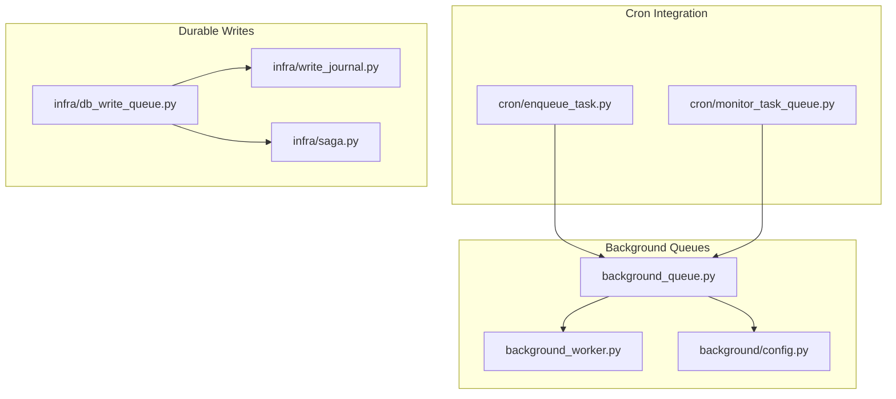
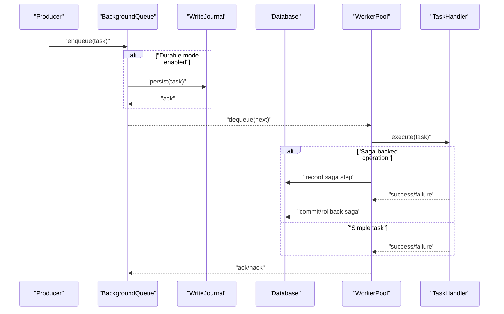
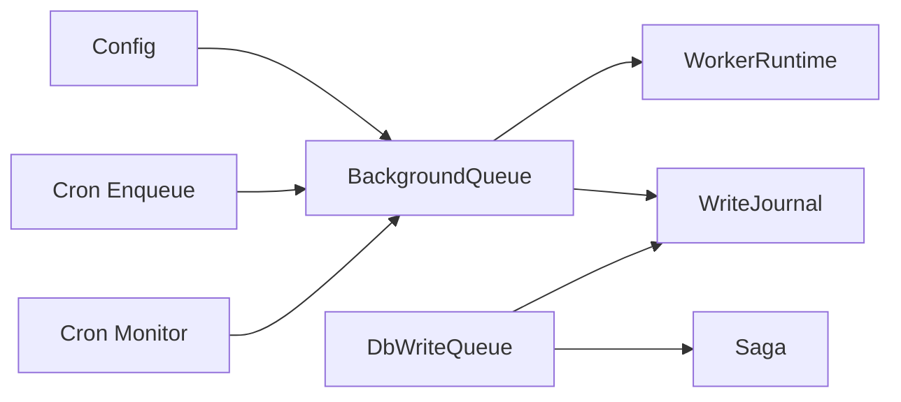

# Queue Implementation

<cite>
**Referenced Files in This Document**
- [background_queue.py](file://background/background_queue.py)
- [background_worker.py](file://background/background_worker.py)
- [config.py](file://background/config.py)
- [cron_enqueue_task.py](file://cron/enqueue_task.py)
- [cron_monitor_task_queue.py](file://cron/monitor_task_queue.py)
- [db_write_queue.py](file://infra/db_write_queue.py)
- [write_journal.py](file://infra/write_journal.py)
- [saga.py](file://infra/saga.py)
- [test_background_queue.py](file://tests/test_background_queue.py)
- [test_db_write_queue.py](file://tests/test_db_write_queue.py)
- [env_vars.md](file://docs/env_vars.md)
</cite>

## Table of Contents
1. [Introduction](#introduction)
2. [Project Structure](#project-structure)
3. [Core Components](#core-components)
4. [Architecture Overview](#architecture-overview)
5. [Detailed Component Analysis](#detailed-component-analysis)
6. [Dependency Analysis](#dependency-analysis)
7. [Performance Considerations](#performance-considerations)
8. [Troubleshooting Guide](#troubleshooting-guide)
9. [Conclusion](#conclusion)
10. [Appendices](#appendices)

## Introduction
This document explains the queue implementation used for background task processing and durable write operations. It covers core data structures, message persistence mechanisms, storage backends, serialization formats, ordering strategies, priority handling, configuration options, operational examples, durability and recovery guarantees, and consistency properties. The goal is to provide both a conceptual overview and code-level details so that developers can operate, tune, and extend the system with confidence.

## Project Structure
The queue subsystem spans several modules:
- Background task queue and worker runtime
- Configuration for queue behavior
- Cron-based enqueueing and monitoring utilities
- Durable write queue backed by a journal and database
- Saga orchestration for multi-step operations

**Diagram sources**
- [background_queue.py](file://background/background_queue.py)
- [background_worker.py](file://background/background_worker.py)
- [config.py](file://background/config.py)
- [enqueue_task.py](file://cron/enqueue_task.py)
- [monitor_task_queue.py](file://cron/monitor_task_queue.py)
- [db_write_queue.py](file://infra/db_write_queue.py)
- [write_journal.py](file://infra/write_journal.py)
- [saga.py](file://infra/saga.py)

**Section sources**
- [background_queue.py](file://background/background_queue.py)
- [background_worker.py](file://background/background_worker.py)
- [config.py](file://background/config.py)
- [enqueue_task.py](file://cron/enqueue_task.py)
- [monitor_task_queue.py](file://cron/monitor_task_queue.py)
- [db_write_queue.py](file://infra/db_write_queue.py)
- [write_journal.py](file://infra/write_journal.py)
- [saga.py](file://infra/saga.py)

## Core Components
- Background Task Queue: In-memory or persisted queue for scheduling and executing background tasks. Provides enqueue/dequeue semantics, worker lifecycle, and metrics.
- Worker Runtime: Manages concurrency, retries, timeouts, and graceful shutdown.
- Configuration: Centralized settings for capacity limits, persistence toggles, performance tuning, and logging.
- Cron Enqueue/Monitor: Utilities to schedule periodic enqueues and observe queue health.
- Durable Write Queue: Ensures writes are persisted before execution, using a write-ahead journal and saga state for crash safety.
- Saga Orchestration: Coordinates multi-step operations with idempotency and rollback support.

Key responsibilities:
- Ordering and priority: FIFO by default; optional priority fields influence scheduling order.
- Persistence: Optional on-disk journaling for durability across crashes.
- Concurrency: Configurable worker pools with bounded parallelism.
- Observability: Metrics for queue depth, latency, error rates, and throughput.

**Section sources**
- [background_queue.py](file://background/background_queue.py)
- [background_worker.py](file://background/background_worker.py)
- [config.py](file://background/config.py)
- [db_write_queue.py](file://infra/db_write_queue.py)
- [write_journal.py](file://infra/write_journal.py)
- [saga.py](file://infra/saga.py)

## Architecture Overview
The system separates producers (which enqueue tasks), the queue layer (ordering, persistence, and delivery), and consumers/workers (which execute tasks). A durable write path uses a write-ahead journal and saga state to guarantee at-least-once processing with idempotent handlers.

**Diagram sources**
- [background_queue.py](file://background/background_queue.py)
- [write_journal.py](file://infra/write_journal.py)
- [saga.py](file://infra/saga.py)
- [background_worker.py](file://background/background_worker.py)

## Detailed Component Analysis

### Background Task Queue
Responsibilities:
- Maintain an ordered sequence of tasks
- Provide enqueue/dequeue APIs
- Optionally persist tasks to disk for durability
- Expose metrics (depth, latency, errors)

Data model highlights:
- Task envelope includes identifier, payload, metadata (priority, scheduled time, retry policy)
- Ordering key derived from priority and insertion time
- Optional TTL and max-retry counters

Ordering strategy:
- Primary sort by priority (lower value higher priority)
- Secondary sort by insertion timestamp (FIFO within same priority)

Priority handling:
- Priority field influences dequeue order
- If not provided, defaults to neutral priority

Persistence mechanism:
- When enabled, each enqueue appends to a journal file
- On startup, the queue replays the journal to reconstruct state

Configuration options:
- Capacity limit (max pending tasks)
- Persistence toggle and journal path
- Batch size for dequeue operations
- Flush interval for journal writes

Operational examples:
- Enqueue: call enqueue with task payload and optional priority
- Dequeue: workers poll or pull next task respecting ordering
- Monitoring: read queue depth and latency metrics via exposed endpoints

Durability and recovery:
- Crash-safe replay of journal ensures no lost tasks
- Idempotent handlers prevent duplicate processing effects

Consistency guarantees:
- At-least-once delivery with idempotent handlers
- Exactly-once semantics require handler-side deduplication

**Section sources**
- [background_queue.py](file://background/background_queue.py)
- [test_background_queue.py](file://tests/test_background_queue.py)

### Worker Runtime
Responsibilities:
- Manage worker pool lifecycle
- Execute tasks with configurable concurrency
- Handle retries, timeouts, and dead-letter routing
- Report telemetry and metrics

Concurrency model:
- Fixed-size thread/process pool
- Backpressure when queue exceeds capacity

Timeout and retry policies:
- Per-task timeout overrides
- Exponential backoff with jitter for retries
- Dead-letter queue for permanently failed tasks

Graceful shutdown:
- Drain in-flight tasks
- Persist state before exit

**Section sources**
- [background_worker.py](file://background/background_worker.py)

### Configuration
Scope:
- Global queue settings
- Worker pool sizing
- Persistence and journal parameters
- Performance tuning knobs

Key options:
- Max queue capacity
- Persistence enabled flag
- Journal flush interval
- Worker count
- Default timeout and retry policy
- Logging verbosity

Environment variables:
- Many settings are configurable via environment variables documented in the project’s env reference

**Section sources**
- [config.py](file://background/config.py)
- [env_vars.md](file://docs/env_vars.md)

### Cron Enqueue and Monitor
Enqueue utility:
- Periodically enqueues maintenance or recurring tasks
- Supports batched enqueue and rate limiting

Monitor utility:
- Reports queue health metrics
- Alerts on backlog growth and high error rates

Integration points:
- Uses the public enqueue API
- Reads metrics from the queue and worker runtime

**Section sources**
- [enqueue_task.py](file://cron/enqueue_task.py)
- [monitor_task_queue.py](file://cron/monitor_task_queue.py)

### Durable Write Queue
Purpose:
- Ensure writes are durable before execution
- Coordinate multi-step operations safely

Components:
- Write-ahead journal for append-only persistence
- Database-backed saga state for tracking progress
- Transactional commit/rollback semantics

Flow:
- Producer requests a write
- Write is appended to journal
- Worker executes steps, updating saga state
- On success, journal entries are acknowledged and cleaned up
- On failure, saga rolls back or marks for retry

Idempotency:
- Handlers must be idempotent to avoid side effects on retries

**Section sources**
- [db_write_queue.py](file://infra/db_write_queue.py)
- [write_journal.py](file://infra/write_journal.py)
- [saga.py](file://infra/saga.py)
- [test_db_write_queue.py](file://tests/test_db_write_queue.py)

### Serialization Formats
Task envelope:
- Stable JSON-like structure with typed fields
- Includes identifiers, payload, metadata, and control flags

Schema evolution:
- Backward-compatible extensions via versioned fields
- Unknown fields are ignored by older consumers

Validation:
- Schema validation on enqueue and dequeue paths
- Reject malformed messages early

**Section sources**
- [background_queue.py](file://background/background_queue.py)
- [db_write_queue.py](file://infra/db_write_queue.py)

### Ordering Strategies and Priority Algorithms
- Primary ordering by priority (ascending)
- Secondary ordering by insertion time (FIFO)
- Optional scheduling delay for deferred execution
- Priority inheritance for dependent tasks

Edge cases:
- Equal priority and timestamps resolved by stable tie-breaker (e.g., internal sequence number)
- Priority updates not supported after enqueue

**Section sources**
- [background_queue.py](file://background/background_queue.py)

### Storage Backends
- In-memory queue for ephemeral workloads
- File-backed journal for durability
- Database-backed saga tables for coordination and audit

Trade-offs:
- In-memory: lowest latency, no durability
- Journal: durable but requires disk I/O
- Database: strong consistency and cross-process visibility

**Section sources**
- [background_queue.py](file://background/background_queue.py)
- [write_journal.py](file://infra/write_journal.py)
- [saga.py](file://infra/saga.py)

### Practical Examples
- Enqueue a task with priority:
  - Use the enqueue API with payload and priority
- Dequeue and process:
  - Workers pull next task and execute handler
- Monitor metrics:
  - Read queue depth, latency percentiles, error counts
- Recover after crash:
  - Restart service; queue replays journal and resumes

Note: Refer to test files for concrete usage patterns and assertions.

**Section sources**
- [test_background_queue.py](file://tests/test_background_queue.py)
- [test_db_write_queue.py](file://tests/test_db_write_queue.py)

## Dependency Analysis
High-level dependencies:
- Background queue depends on configuration and optional journal
- Worker runtime depends on queue and handler registry
- Durable write queue depends on journal and saga
- Cron utilities depend on queue APIs and metrics

**Diagram sources**
- [config.py](file://background/config.py)
- [background_queue.py](file://background/background_queue.py)
- [background_worker.py](file://background/background_worker.py)
- [db_write_queue.py](file://infra/db_write_queue.py)
- [write_journal.py](file://infra/write_journal.py)
- [saga.py](file://infra/saga.py)
- [enqueue_task.py](file://cron/enqueue_task.py)
- [monitor_task_queue.py](file://cron/monitor_task_queue.py)

**Section sources**
- [background_queue.py](file://background/background_queue.py)
- [background_worker.py](file://background/background_worker.py)
- [config.py](file://background/config.py)
- [db_write_queue.py](file://infra/db_write_queue.py)
- [write_journal.py](file://infra/write_journal.py)
- [saga.py](file://infra/saga.py)
- [enqueue_task.py](file://cron/enqueue_task.py)
- [monitor_task_queue.py](file://cron/monitor_task_queue.py)

## Performance Considerations
- Tune worker pool size based on CPU and I/O characteristics
- Enable persistence only when required; consider async flush intervals
- Batch dequeues to reduce overhead
- Use priorities judiciously to avoid starvation
- Monitor queue depth and latency; set alerts for anomalies
- Prefer idempotent handlers to allow safe retries

[No sources needed since this section provides general guidance]

## Troubleshooting Guide
Common issues:
- Queue backlog growing: check worker capacity and handler latency
- High error rates: inspect dead-letter queue and retry policies
- Durability gaps: verify journal path permissions and flush settings
- Stuck tasks: review timeouts and saga state for partial commits

Diagnostic steps:
- Inspect queue metrics and logs
- Validate task payloads against schema
- Replay journal to confirm recovery behavior
- Review cron schedules for unexpected load spikes

**Section sources**
- [monitor_task_queue.py](file://cron/monitor_task_queue.py)
- [test_background_queue.py](file://tests/test_background_queue.py)
- [test_db_write_queue.py](file://tests/test_db_write_queue.py)

## Conclusion
The queue implementation provides a robust foundation for background task processing and durable writes. With clear ordering rules, optional persistence, and strong durability guarantees via journaling and saga state, it supports scalable and reliable operations. Proper configuration and observability ensure predictable performance and easy troubleshooting.

[No sources needed since this section summarizes without analyzing specific files]

## Appendices

### Configuration Options Reference
- Capacity limits: maximum pending tasks
- Persistence: enable/disable journaling and path
- Performance: worker count, flush interval, batch size
- Timeouts and retries: default policies and per-task overrides
- Logging: verbosity and structured output

**Section sources**
- [config.py](file://background/config.py)
- [env_vars.md](file://docs/env_vars.md)