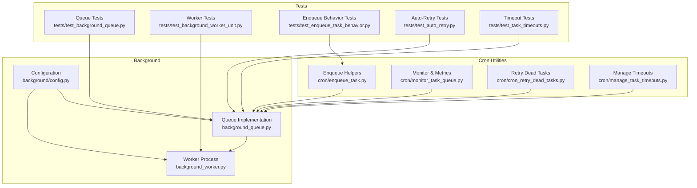
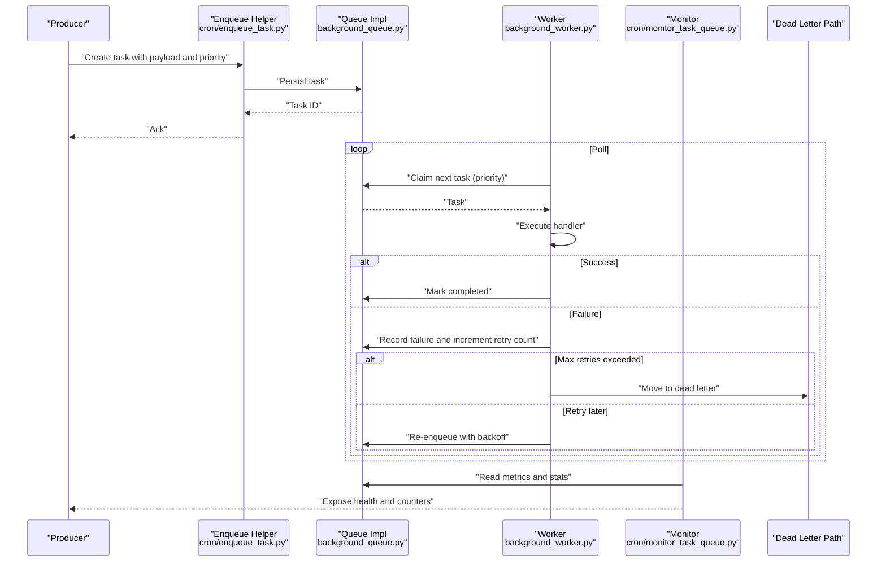
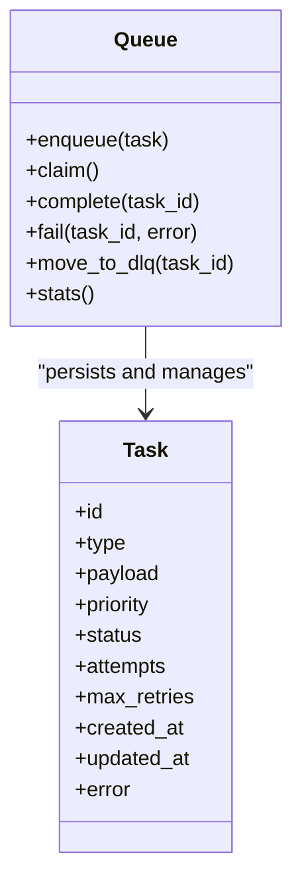
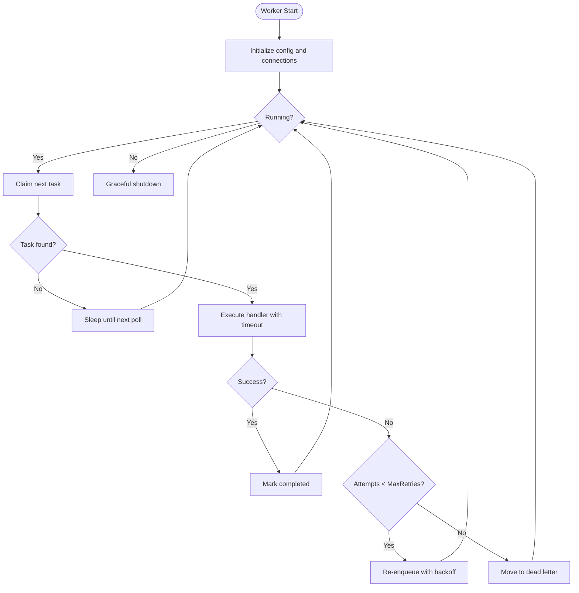
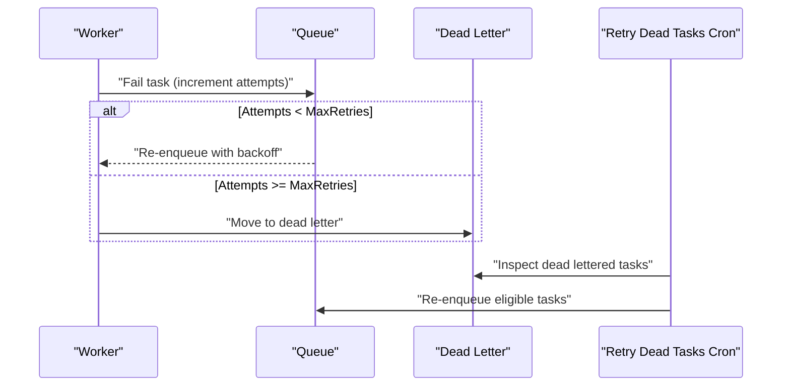
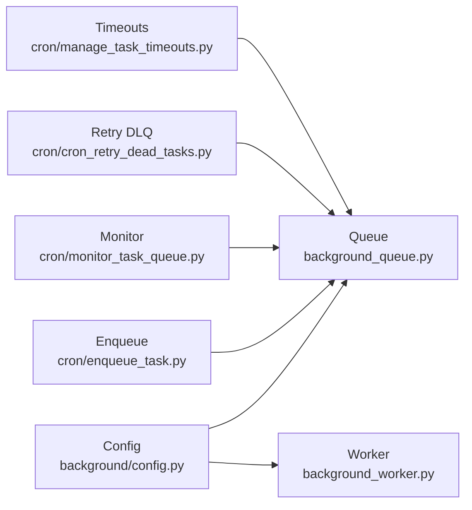

# Task Queue Architecture

<cite>
**Referenced Files in This Document**
- [background_queue.py](file://background/background_queue.py)
- [background_worker.py](file://background/background_worker.py)
- [config.py](file://background/config.py)
- [cron_retry_dead_tasks.py](file://cron/cron_retry_dead_tasks.py)
- [monitor_task_queue.py](file://cron/monitor_task_queue.py)
- [enqueue_task.py](file://cron/enqueue_task.py)
- [manage_task_timeouts.py](file://cron/manage_task_timeouts.py)
- [test_background_queue.py](file://tests/test_background_queue.py)
- [test_background_worker_unit.py](file://tests/test_background_worker_unit.py)
- [test_enqueue_task_behavior.py](file://tests/test_enqueue_task_behavior.py)
- [test_auto_retry.py](file://tests/test_auto_retry.py)
- [test_task_timeouts.py](file://tests/test_task_timeouts.py)
</cite>

## Table of Contents
1. [Introduction](#introduction)
2. [Project Structure](#project-structure)
3. [Core Components](#core-components)
4. [Architecture Overview](#architecture-overview)
5. [Detailed Component Analysis](#detailed-component-analysis)
6. [Dependency Analysis](#dependency-analysis)
7. [Performance Considerations](#performance-considerations)
8. [Troubleshooting Guide](#troubleshooting-guide)
9. [Conclusion](#conclusion)
10. [Appendices](#appendices)

## Introduction
This document explains the task queue architecture, focusing on the core queue implementation, message persistence, worker process management, and operational lifecycle from creation to completion. It covers priority handling, distribution and load balancing across workers, configuration options, scaling strategies, performance tuning, practical examples for custom tasks, monitoring health, error handling, retry mechanisms, and dead letter queues.

## Project Structure
The task queue is implemented under the background subsystem with supporting cron utilities and tests:
- background_queue.py: Core queue abstraction and operations
- background_worker.py: Worker process that polls and executes tasks
- background/config.py: Configuration schema and defaults for queue and workers
- cron/enqueue_task.py: Utilities to enqueue tasks (used by cron jobs and other components)
- cron/monitor_task_queue.py: Monitoring helpers and metrics
- cron/cron_retry_dead_tasks.py: Cron job to re-enqueue failed tasks into a dead letter path or retry
- cron/manage_task_timeouts.py: Utility to manage timeouts and cleanup
- Tests: Validate behavior around queueing, retries, timeouts, and worker execution

**Diagram sources**
- [background_queue.py](file://background/background_queue.py)
- [background_worker.py](file://background/background_worker.py)
- [config.py](file://background/config.py)
- [enqueue_task.py](file://cron/enqueue_task.py)
- [monitor_task_queue.py](file://cron/monitor_task_queue.py)
- [cron_retry_dead_tasks.py](file://cron/cron_retry_dead_tasks.py)
- [manage_task_timeouts.py](file://cron/manage_task_timeouts.py)
- [test_background_queue.py](file://tests/test_background_queue.py)
- [test_background_worker_unit.py](file://tests/test_background_worker_unit.py)
- [test_enqueue_task_behavior.py](file://tests/test_enqueue_task_behavior.py)
- [test_auto_retry.py](file://tests/test_auto_retry.py)
- [test_task_timeouts.py](file://tests/test_task_timeouts.py)

**Section sources**
- [background_queue.py](file://background/background_queue.py)
- [background_worker.py](file://background/background_worker.py)
- [config.py](file://background/config.py)
- [enqueue_task.py](file://cron/enqueue_task.py)
- [monitor_task_queue.py](file://cron/monitor_task_queue.py)
- [cron_retry_dead_tasks.py](file://cron/cron_retry_dead_tasks.py)
- [manage_task_timeouts.py](file://cron/manage_task_timeouts.py)
- [test_background_queue.py](file://tests/test_background_queue.py)
- [test_background_worker_unit.py](file://tests/test_background_worker_unit.py)
- [test_enqueue_task_behavior.py](file://tests/test_enqueue_task_behavior.py)
- [test_auto_retry.py](file://tests/test_auto_retry.py)
- [test_task_timeouts.py](file://tests/test_task_timeouts.py)

## Core Components
- Queue Implementation: Provides enqueue/dequeue semantics, persistence, and ordering/priority support. It exposes methods to push tasks, claim tasks for processing, mark success/failure, and inspect state.
- Worker Process: A long-running process that claims and executes tasks, handles timeouts, retries, and updates status. It respects concurrency limits and backpressure.
- Configuration: Centralized settings for queue capacity, polling intervals, concurrency, timeouts, retry policies, and dead letter routing.
- Cron Utilities: Enqueue helpers, monitoring, timeout management, and dead-letter retry scheduling.

Key responsibilities:
- Persistence: Ensure durable storage of tasks and their states.
- Priority Handling: Order tasks by priority when dequeuing.
- Distribution and Load Balancing: Workers compete to claim tasks; multiple workers scale throughput.
- Error Handling and Retries: Automatic retries with exponential backoff and configurable max attempts.
- Dead Letter Queues: Failed tasks after max retries are routed to a dead letter path for inspection and manual recovery.

**Section sources**
- [background_queue.py](file://background/background_queue.py)
- [background_worker.py](file://background/background_worker.py)
- [config.py](file://background/config.py)

## Architecture Overview
The system follows a producer-consumer pattern:
- Producers call enqueue helpers to persist tasks with optional priority and metadata.
- The queue persists tasks and supports priority-based dequeue.
- One or more workers poll the queue, claim tasks, execute them, and update status.
- Cron jobs monitor queue health, manage timeouts, and retry dead-lettered tasks.

**Diagram sources**
- [enqueue_task.py](file://cron/enqueue_task.py)
- [background_queue.py](file://background/background_queue.py)
- [background_worker.py](file://background/background_worker.py)
- [monitor_task_queue.py](file://cron/monitor_task_queue.py)
- [cron_retry_dead_tasks.py](file://cron/cron_retry_dead_tasks.py)

## Detailed Component Analysis

### Queue Implementation
Responsibilities:
- Persist tasks with fields such as id, type, payload, priority, status, attempt counts, timestamps, and error details.
- Provide enqueue with priority ordering.
- Provide claim-and-reserve semantics to avoid duplicate processing.
- Support marking complete, failure, and moving to dead letter.
- Expose metrics and introspection endpoints for monitoring.

Design considerations:
- Concurrency-safe claiming to prevent double-processing.
- Indexing on priority and status for efficient dequeue.
- Atomic state transitions to ensure durability.

**Diagram sources**
- [background_queue.py](file://background/background_queue.py)

**Section sources**
- [background_queue.py](file://background/background_queue.py)
- [test_background_queue.py](file://tests/test_background_queue.py)

### Worker Process Management
Responsibilities:
- Poll the queue at configured intervals.
- Claim tasks up to a concurrency limit.
- Execute task handlers with timeouts.
- Handle retries with backoff and move to dead letter when exhausted.
- Update metrics and logs for observability.

Concurrency and load balancing:
- Multiple workers compete to claim tasks; each claim is atomic.
- Concurrency per worker can be tuned via configuration.
- Backpressure is enforced by limiting in-flight tasks and queue depth.

**Diagram sources**
- [background_worker.py](file://background/background_worker.py)

**Section sources**
- [background_worker.py](file://background/background_worker.py)
- [test_background_worker_unit.py](file://tests/test_background_worker_unit.py)

### Message Persistence and State Model
Tasks are persisted with rich metadata to support retries, timeouts, and auditing:
- Idempotency keys may be supported to prevent duplicate processing.
- Status transitions: pending -> processing -> completed | failed -> dlq.
- Attempt counters and last error messages aid diagnostics.
- Priority influences dequeue order.

Operational implications:
- Robust indexing ensures fast dequeue by priority and status.
- Atomic claim prevents race conditions between workers.
- Durable writes guarantee no task loss under failures.

**Section sources**
- [background_queue.py](file://background/background_queue.py)
- [test_enqueue_task_behavior.py](file://tests/test_enqueue_task_behavior.py)

### Priority Handling and Task Distribution
Priority handling:
- Higher priority tasks are dequeued first.
- Within same priority, FIFO ordering is typical.

Distribution and load balancing:
- Workers independently claim tasks; contention is resolved atomically.
- Scaling out workers increases throughput linearly until resource constraints.

**Section sources**
- [background_queue.py](file://background/background_queue.py)
- [background_worker.py](file://background/background_worker.py)

### Error Handling, Retry Mechanisms, and Dead Letter Queues
Error handling:
- Failures increment attempt counts and record errors.
- Configurable max retries and backoff strategy control re-enqueue timing.

Dead letter queues:
- After exceeding max retries, tasks are moved to a dead letter path for inspection.
- Cron job periodically retries or archives dead-lettered tasks based on policy.

**Diagram sources**
- [background_worker.py](file://background/background_worker.py)
- [cron_retry_dead_tasks.py](file://cron/cron_retry_dead_tasks.py)

**Section sources**
- [test_auto_retry.py](file://tests/test_auto_retry.py)
- [cron_retry_dead_tasks.py](file://cron/cron_retry_dead_tasks.py)

### Timeout Management
Timeouts:
- Each task has a maximum execution time.
- If exceeded, the worker marks the task as failed and applies retry logic.
- Cron utility helps clean up stale processing entries and enforce policies.

**Section sources**
- [manage_task_timeouts.py](file://cron/manage_task_timeouts.py)
- [test_task_timeouts.py](file://tests/test_task_timeouts.py)

### Monitoring and Health
Monitoring:
- Queue stats include counts by status, latency percentiles, and throughput.
- Cron monitor reads metrics and exposes health checks.

Health indicators:
- Stuck tasks (processing beyond timeout).
- Growing backlog and high retry rates.
- Dead letter accumulation.

**Section sources**
- [monitor_task_queue.py](file://cron/monitor_task_queue.py)

### Practical Examples
Creating custom tasks:
- Use enqueue helpers to create tasks with a type identifier, payload, and optional priority.
- Implement a handler function registered with the worker to process the task type.

Setting priorities:
- Assign higher numeric priority values to urgent tasks during enqueue.

Monitoring queue health:
- Use monitor helpers to read queue stats and expose metrics.

Note: Refer to test files for concrete usage patterns and assertions.

**Section sources**
- [enqueue_task.py](file://cron/enqueue_task.py)
- [test_enqueue_task_behavior.py](file://tests/test_enqueue_task_behavior.py)
- [monitor_task_queue.py](file://cron/monitor_task_queue.py)

## Dependency Analysis
The following diagram shows key dependencies among queue, worker, configuration, and cron utilities.

**Diagram sources**
- [config.py](file://background/config.py)
- [background_queue.py](file://background/background_queue.py)
- [background_worker.py](file://background/background_worker.py)
- [enqueue_task.py](file://cron/enqueue_task.py)
- [monitor_task_queue.py](file://cron/monitor_task_queue.py)
- [cron_retry_dead_tasks.py](file://cron/cron_retry_dead_tasks.py)
- [manage_task_timeouts.py](file://cron/manage_task_timeouts.py)

**Section sources**
- [config.py](file://background/config.py)
- [background_queue.py](file://background/background_queue.py)
- [background_worker.py](file://background/background_worker.py)
- [enqueue_task.py](file://cron/enqueue_task.py)
- [monitor_task_queue.py](file://cron/monitor_task_queue.py)
- [cron_retry_dead_tasks.py](file://cron/cron_retry_dead_tasks.py)
- [manage_task_timeouts.py](file://cron/manage_task_timeouts.py)

## Performance Considerations
- Concurrency tuning: Adjust worker concurrency to match CPU and I/O characteristics.
- Batch operations: Prefer batching where possible to reduce overhead.
- Indexing: Ensure indexes on priority and status columns for fast dequeue.
- Backpressure: Limit queue depth and in-flight tasks to protect downstream systems.
- Timeouts: Set appropriate timeouts to fail fast and free resources.
- Retries: Use exponential backoff to avoid thundering herds.
- Monitoring: Track latency percentiles and throughput to detect bottlenecks.

[No sources needed since this section provides general guidance]

## Troubleshooting Guide
Common issues and remedies:
- Tasks stuck in processing: Check timeout management and worker liveness.
- High retry rate: Inspect handler errors and adjust backoff or max retries.
- Dead letter growth: Review dead letter tasks and re-enqueue eligible ones.
- Low throughput: Scale workers, tune concurrency, and verify queue indexing.
- Priority inversion: Verify priority assignment and dequeue logic.

Useful references:
- Worker unit tests for expected behaviors and edge cases.
- Auto-retry tests for retry mechanics.
- Timeout tests for deadline enforcement.
- Enqueue behavior tests for priority and idempotency.

**Section sources**
- [test_background_worker_unit.py](file://tests/test_background_worker_unit.py)
- [test_auto_retry.py](file://tests/test_auto_retry.py)
- [test_task_timeouts.py](file://tests/test_task_timeouts.py)
- [test_enqueue_task_behavior.py](file://tests/test_enqueue_task_behavior.py)

## Conclusion
The task queue architecture provides durable, prioritized, and scalable background processing with robust error handling and observability. By tuning configuration, scaling workers, and leveraging monitoring and dead letter queues, teams can achieve reliable throughput and resilience.

[No sources needed since this section summarizes without analyzing specific files]

## Appendices

### Configuration Options
Key configuration areas:
- Queue capacity and backpressure thresholds
- Worker concurrency and poll interval
- Task timeouts and retry policies (max attempts, backoff strategy)
- Dead letter routing and archival policies

Refer to the configuration module for detailed keys and defaults.

**Section sources**
- [config.py](file://background/config.py)