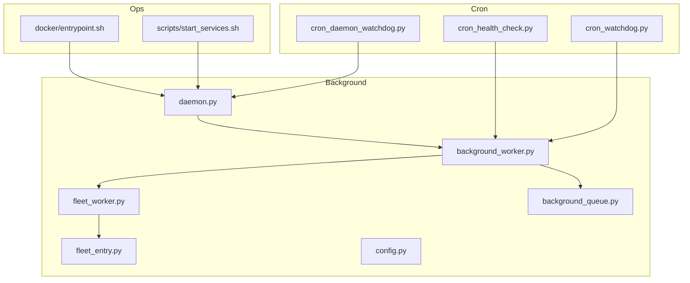
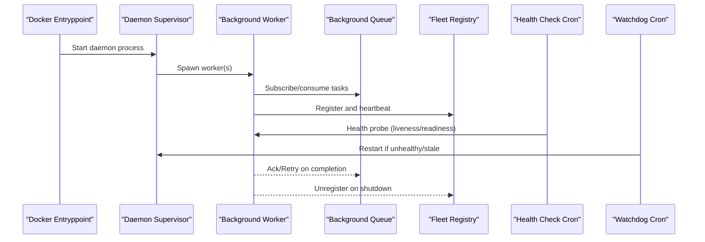
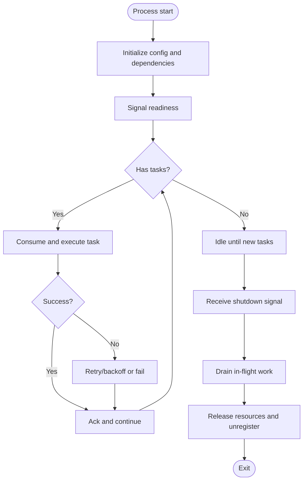
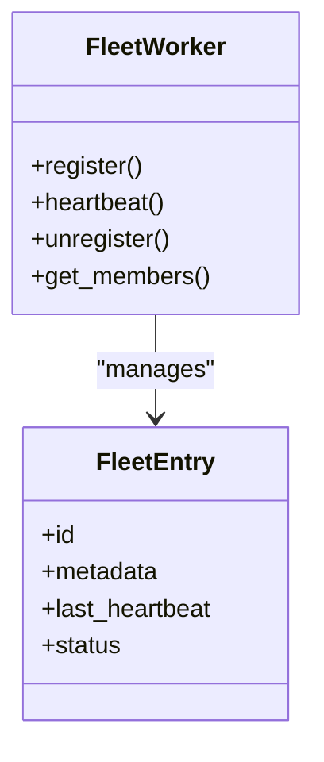
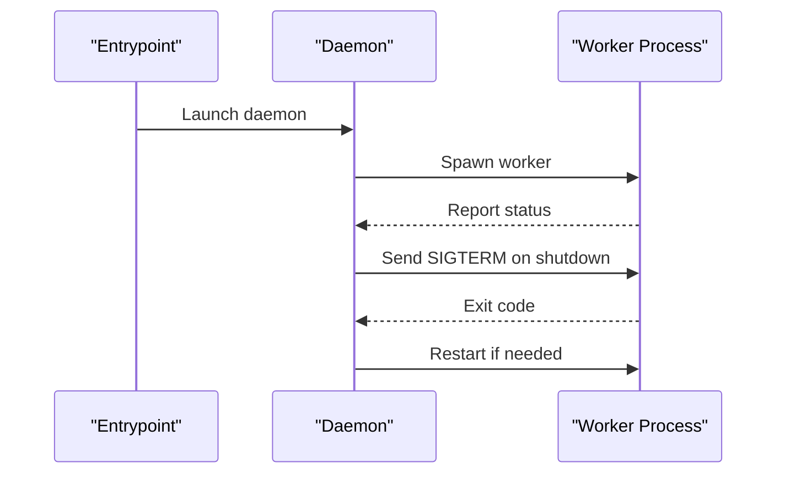
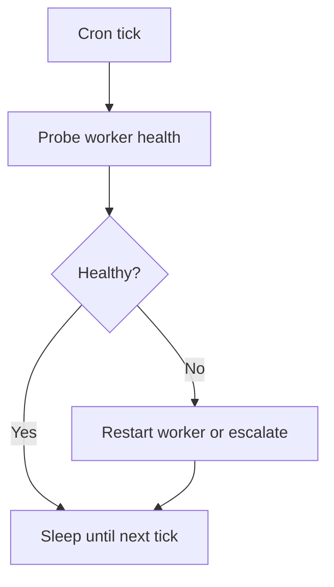
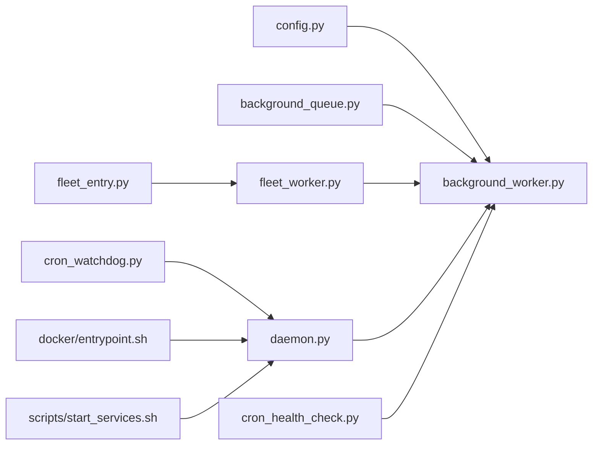

# Worker Management

<cite>
**Referenced Files in This Document**
- [background_worker.py](file://background/background_worker.py)
- [fleet_worker.py](file://background/fleet_worker.py)
- [fleet_entry.py](file://background/fleet_entry.py)
- [daemon.py](file://background/daemon.py)
- [config.py](file://background/config.py)
- [background_queue.py](file://background/background_queue.py)
- [cron_health_check.py](file://cron/cron_health_check.py)
- [cron_watchdog.py](file://cron/cron_watchdog.py)
- [cron_daemon_watchdog.py](file://cron/cron_daemon_watchdog.py)
- [test_background_worker_unit.py](file://test/test_background_worker_unit.py)
- [test_graceful_shutdown.py](file://test/test_graceful_shutdown.py)
- [test_multiworker_reconciler_fleet.py](file://test/test_multiworker_reconciler_fleet.py)
- [docker/entrypoint.sh](file://docker/entrypoint.sh)
- [scripts/start_services.sh](file://scripts/start_services.sh)
</cite>

## Table of Contents
1. [Introduction](#introduction)
2. [Project Structure](#project-structure)
3. [Core Components](#core-components)
4. [Architecture Overview](#architecture-overview)
5. [Detailed Component Analysis](#detailed-component-analysis)
6. [Dependency Analysis](#dependency-analysis)
7. [Performance Considerations](#performance-considerations)
8. [Troubleshooting Guide](#troubleshooting-guide)
9. [Conclusion](#conclusion)
10. [Appendices](#appendices)

## Introduction
This document explains worker process management across the system, focusing on lifecycle, isolation, resource management, pool configuration, scaling and load balancing, health monitoring, graceful shutdown, failure recovery, security, and debugging. It synthesizes implementation details from background workers, fleet coordination, daemon supervision, and cron-based watchdogs to provide a comprehensive operational guide.

## Project Structure
Worker-related functionality is primarily implemented under the background package with supporting orchestration via cron jobs and Docker entrypoints. The key modules include:
- Background worker runtime and task queue
- Fleet worker registration and discovery
- Daemon supervisor for long-running processes
- Cron-based health checks and watchdogs
- Configuration for worker pools and behavior
- Tests validating lifecycle, shutdown, and multi-worker behaviors

**Diagram sources**
- [background_worker.py](file://background/background_worker.py)
- [fleet_worker.py](file://background/fleet_worker.py)
- [fleet_entry.py](file://background/fleet_entry.py)
- [daemon.py](file://background/daemon.py)
- [config.py](file://background/config.py)
- [background_queue.py](file://background/background_queue.py)
- [cron_health_check.py](file://cron/cron_health_check.py)
- [cron_watchdog.py](file://cron/cron_watchdog.py)
- [cron_daemon_watchdog.py](file://cron/cron_daemon_watchdog.py)
- [docker/entrypoint.sh](file://docker/entrypoint.sh)
- [scripts/start_services.sh](file://scripts/start_services.sh)

**Section sources**
- [background_worker.py](file://background/background_worker.py)
- [fleet_worker.py](file://background/fleet_worker.py)
- [fleet_entry.py](file://background/fleet_entry.py)
- [daemon.py](file://background/daemon.py)
- [config.py](file://background/config.py)
- [background_queue.py](file://background/background_queue.py)
- [cron_health_check.py](file://cron/cron_health_check.py)
- [cron_watchdog.py](file://cron/cron_watchdog.py)
- [cron_daemon_watchdog.py](file://cron/cron_daemon_watchdog.py)
- [docker/entrypoint.sh](file://docker/entrypoint.sh)
- [scripts/start_services.sh](file://scripts/start_services.sh)

## Core Components
- Background worker runtime: manages worker process lifecycle, task dispatching, and integration with the background queue.
- Fleet worker: handles registration, heartbeat, and membership updates within a distributed worker set.
- Fleet entry: represents a single worker’s metadata and state used by the fleet registry.
- Daemon supervisor: supervises long-running worker processes, restarts them on failure, and coordinates startup/shutdown.
- Cron health check and watchdogs: periodically verify worker liveness and trigger corrective actions.
- Configuration: defines pool size, concurrency, backpressure, timeouts, and feature toggles.
- Background queue: provides durable task submission, retry, and scheduling semantics consumed by workers.

**Section sources**
- [background_worker.py](file://background/background_worker.py)
- [fleet_worker.py](file://background/fleet_worker.py)
- [fleet_entry.py](file://background/fleet_entry.py)
- [daemon.py](file://background/daemon.py)
- [config.py](file://background/config.py)
- [background_queue.py](file://background/background_queue.py)

## Architecture Overview
The worker architecture combines a supervised daemon with one or more worker processes that consume tasks from a shared queue. Workers register into a fleet registry to enable discovery and coordinated operations. Cron jobs monitor health and enforce policies such as reaping stale workers or restarting failed daemons.

**Diagram sources**
- [docker/entrypoint.sh](file://docker/entrypoint.sh)
- [daemon.py](file://background/daemon.py)
- [background_worker.py](file://background/background_worker.py)
- [background_queue.py](file://background/background_queue.py)
- [fleet_worker.py](file://background/fleet_worker.py)
- [cron_health_check.py](file://cron/cron_health_check.py)
- [cron_watchdog.py](file://cron/cron_watchdog.py)

## Detailed Component Analysis

### Background Worker Lifecycle
The worker lifecycle covers initialization, readiness signaling, task consumption, and graceful shutdown. Key aspects include:
- Initialization: load configuration, connect to the queue, initialize resources, and prepare the execution context.
- Readiness: expose a readiness signal so orchestrators can route traffic only when the worker is ready.
- Consumption: poll or subscribe to the queue, execute tasks with retries and timeouts, and report results.
- Shutdown: drain in-flight work, release resources, unregister from the fleet, and exit cleanly.

**Diagram sources**
- [background_worker.py](file://background/background_worker.py)
- [background_queue.py](file://background/background_queue.py)

**Section sources**
- [background_worker.py](file://background/background_worker.py)
- [background_queue.py](file://background/background_queue.py)
- [test_background_worker_unit.py](file://test/test_background_worker_unit.py)
- [test_graceful_shutdown.py](file://test/test_graceful_shutdown.py)

### Fleet Coordination and Discovery
Workers participate in a fleet to enable horizontal scaling and load distribution. Responsibilities include:
- Registration: announce presence and capabilities upon startup.
- Heartbeat: periodically update liveness to the registry.
- Membership changes: handle joins/leaves and reconcile state.
- Load balancing: distribute tasks across available workers based on capacity and current load.

**Diagram sources**
- [fleet_worker.py](file://background/fleet_worker.py)
- [fleet_entry.py](file://background/fleet_entry.py)

**Section sources**
- [fleet_worker.py](file://background/fleet_worker.py)
- [fleet_entry.py](file://background/fleet_entry.py)
- [test_multiworker_reconciler_fleet.py](file://test/test_multiworker_reconciler_fleet.py)

### Daemon Supervision
The daemon supervises worker processes, ensuring high availability and resilience:
- Spawns and monitors worker processes.
- Restarts workers on unexpected exits.
- Coordinates global signals for graceful shutdown.
- Integrates with external supervisors (e.g., Docker).

**Diagram sources**
- [daemon.py](file://background/daemon.py)
- [docker/entrypoint.sh](file://docker/entrypoint.sh)
- [scripts/start_services.sh](file://scripts/start_services.sh)

**Section sources**
- [daemon.py](file://background/daemon.py)
- [docker/entrypoint.sh](file://docker/entrypoint.sh)
- [scripts/start_services.sh](file://scripts/start_services.sh)

### Cron-Based Health Monitoring and Watchdogs
Cron jobs provide periodic checks and remediation:
- Health check: probes worker readiness and liveness endpoints.
- Watchdog: detects stale or unresponsive workers and triggers restarts.
- Daemon watchdog: ensures the supervisor itself remains healthy.

**Diagram sources**
- [cron_health_check.py](file://cron/cron_health_check.py)
- [cron_watchdog.py](file://cron/cron_watchdog.py)
- [cron_daemon_watchdog.py](file://cron/cron_daemon_watchdog.py)

**Section sources**
- [cron_health_check.py](file://cron/cron_health_check.py)
- [cron_watchdog.py](file://cron/cron_watchdog.py)
- [cron_daemon_watchdog.py](file://cron/cron_daemon_watchdog.py)

### Worker Pool Configuration and Scaling
Configuration controls pool sizing, concurrency, and backpressure:
- Pool size: number of concurrent workers per process or total workers.
- Concurrency limits: per-worker task parallelism.
- Backpressure: queue depth thresholds to throttle ingestion.
- Timeouts: task execution and heartbeat intervals.
- Feature flags: enable/disable advanced features like adaptive scaling.

Practical examples:
- Configure pool size and concurrency via environment variables or configuration files referenced by the worker runtime.
- Set backpressure thresholds to prevent queue overflow during spikes.
- Adjust timeouts to match expected task durations and SLAs.

**Section sources**
- [config.py](file://background/config.py)
- [background_worker.py](file://background/background_worker.py)

### Load Balancing Across Multiple Workers
Load distribution strategies:
- Round-robin or least-loaded selection among registered fleet members.
- Capacity-aware routing using heartbeat metrics and queue depth.
- Sticky sessions where appropriate for stateful tasks.

Operational guidance:
- Ensure consistent worker capabilities to avoid skew.
- Monitor per-worker utilization and rebalance by adjusting pool sizes.
- Use health checks to exclude degraded workers from routing.

**Section sources**
- [fleet_worker.py](file://background/fleet_worker.py)
- [fleet_entry.py](file://background/fleet_entry.py)
- [cron_health_check.py](file://cron/cron_health_check.py)

### Graceful Shutdown Procedures
Graceful shutdown steps:
- Stop accepting new tasks.
- Drain in-flight tasks with bounded wait time.
- Release external resources (DB connections, caches).
- Unregister from the fleet registry.
- Exit with a clean status code.

Validation:
- Unit tests cover shutdown sequences and resource cleanup.
- Integration tests validate end-to-end shutdown behavior.

**Section sources**
- [background_worker.py](file://background/background_worker.py)
- [test_graceful_shutdown.py](file://test/test_graceful_shutdown.py)

### Failure Recovery Mechanisms
Recovery patterns:
- Automatic retries with exponential backoff for transient failures.
- Dead-letter queues for persistent failures requiring manual intervention.
- Watchdog-driven restarts for crashed workers.
- Idempotent task processing to safely re-run after failures.

**Section sources**
- [background_queue.py](file://background/background_queue.py)
- [cron_watchdog.py](file://cron/cron_watchdog.py)
- [daemon.py](file://background/daemon.py)

### Security and Resource Limits
Security considerations:
- Isolate worker processes to limit blast radius.
- Enforce least privilege for file and network access.
- Validate inputs and sanitize outputs to prevent injection.
- Rotate secrets and credentials securely at runtime.

Resource limits:
- Apply OS-level limits (CPU, memory, file descriptors).
- Enqueue rate limiting and backpressure to protect shared resources.
- Monitor resource usage and alert on threshold breaches.

**Section sources**
- [daemon.py](file://background/daemon.py)
- [config.py](file://background/config.py)

### Debugging Techniques for Worker Processes
Recommended practices:
- Enable structured logging with correlation IDs for tracing tasks across components.
- Expose lightweight health and metrics endpoints for observability.
- Capture stack traces and context on failures for post-mortem analysis.
- Use targeted test suites to reproduce issues in controlled environments.

**Section sources**
- [background_worker.py](file://background/background_worker.py)
- [cron_health_check.py](file://cron/cron_health_check.py)
- [test_background_worker_unit.py](file://test/test_background_worker_unit.py)

## Dependency Analysis
The following diagram shows core dependencies between worker subsystems:

**Diagram sources**
- [config.py](file://background/config.py)
- [background_worker.py](file://background/background_worker.py)
- [background_queue.py](file://background/background_queue.py)
- [fleet_worker.py](file://background/fleet_worker.py)
- [fleet_entry.py](file://background/fleet_entry.py)
- [daemon.py](file://background/daemon.py)
- [cron_health_check.py](file://cron/cron_health_check.py)
- [cron_watchdog.py](file://cron/cron_watchdog.py)
- [docker/entrypoint.sh](file://docker/entrypoint.sh)
- [scripts/start_services.sh](file://scripts/start_services.sh)

**Section sources**
- [config.py](file://background/config.py)
- [background_worker.py](file://background/background_worker.py)
- [background_queue.py](file://background/background_queue.py)
- [fleet_worker.py](file://background/fleet_worker.py)
- [fleet_entry.py](file://background/fleet_entry.py)
- [daemon.py](file://background/daemon.py)
- [cron_health_check.py](file://cron/cron_health_check.py)
- [cron_watchdog.py](file://cron/cron_watchdog.py)
- [docker/entrypoint.sh](file://docker/entrypoint.sh)
- [scripts/start_services.sh](file://scripts/start_services.sh)

## Performance Considerations
- Tune pool size and concurrency to match CPU and I/O characteristics.
- Use backpressure to smooth bursts and protect downstream systems.
- Prefer idempotent tasks to reduce cost of retries.
- Monitor queue depth, latency percentiles, and error rates to detect bottlenecks.
- Avoid excessive serialization; batch operations where safe.

[No sources needed since this section provides general guidance]

## Troubleshooting Guide
Common issues and resolutions:
- Worker not registering: verify fleet connectivity and heartbeat configuration.
- Tasks stuck in queue: inspect backpressure settings and consumer throughput.
- Frequent restarts: review watchdog logs and crash diagnostics.
- Slow responses: profile task execution and database/network calls.
- Resource exhaustion: adjust OS limits and application-level quotas.

Useful references:
- Health check and watchdog implementations for probing and remediation.
- Daemon supervision logic for restart policies.
- Unit and integration tests for expected behaviors and edge cases.

**Section sources**
- [cron_health_check.py](file://cron/cron_health_check.py)
- [cron_watchdog.py](file://cron/cron_watchdog.py)
- [daemon.py](file://background/daemon.py)
- [test_background_worker_unit.py](file://test/test_background_worker_unit.py)
- [test_graceful_shutdown.py](file://test/test_graceful_shutdown.py)

## Conclusion
Effective worker management hinges on clear lifecycle control, robust supervision, and proactive monitoring. By configuring pools appropriately, enforcing backpressure, and leveraging fleet coordination, teams can scale horizontally while maintaining reliability. Health checks and watchdogs ensure rapid detection and recovery from failures, while security and resource limits protect system stability.

[No sources needed since this section summarizes without analyzing specific files]

## Appendices

### Practical Configuration Examples
- Define pool size and concurrency via configuration keys referenced by the worker runtime.
- Set backpressure thresholds to cap queue depth and throttle producers.
- Configure timeouts for heartbeats and task execution to align with SLAs.
- Enable feature flags for advanced behaviors like adaptive scaling.

**Section sources**
- [config.py](file://background/config.py)
- [background_worker.py](file://background/background_worker.py)

### Health Check Setup
- Implement periodic probes for readiness and liveness.
- Return explicit statuses to allow orchestrators to route traffic safely.
- Integrate with watchdogs to auto-recover unhealthy workers.

**Section sources**
- [cron_health_check.py](file://cron/cron_health_check.py)
- [cron_watchdog.py](file://cron/cron_watchdog.py)

### Monitoring and Observability
- Emit metrics for queue depth, task latency, error rates, and worker counts.
- Log structured events with correlation IDs for cross-process tracing.
- Alert on anomalies such as prolonged idle states or repeated failures.

**Section sources**
- [background_worker.py](file://background/background_worker.py)
- [cron_health_check.py](file://cron/cron_health_check.py)