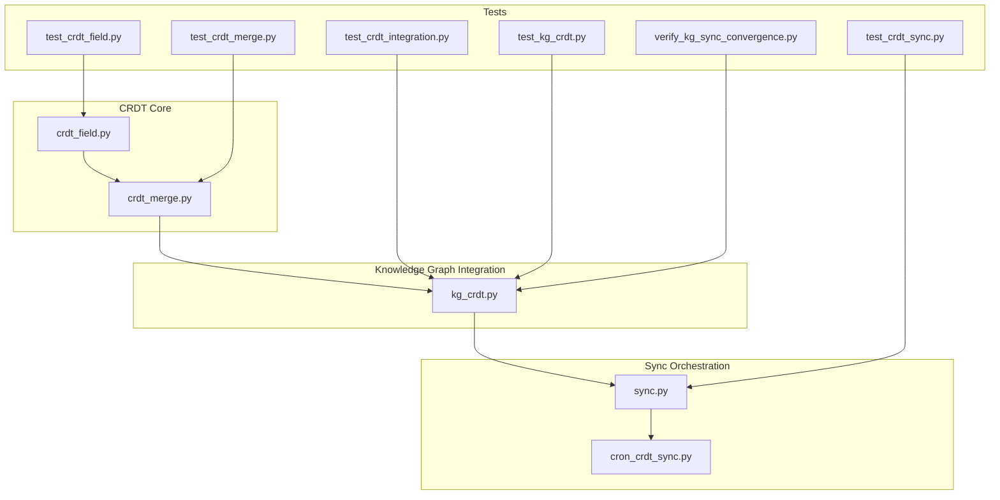
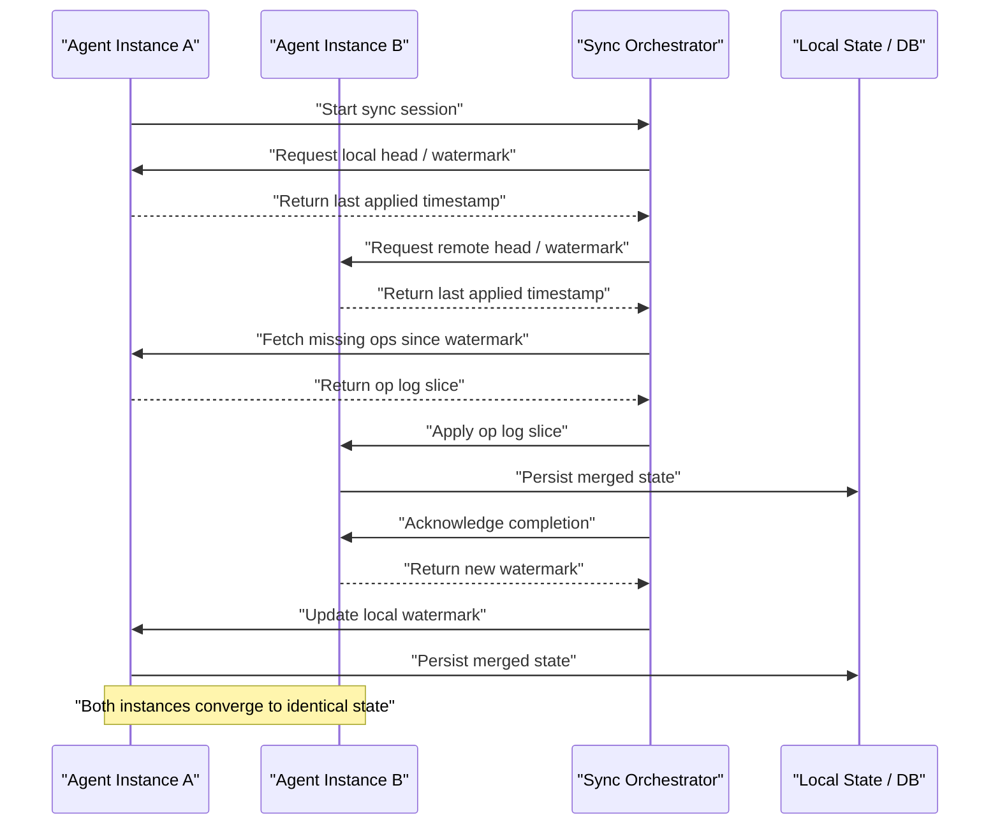
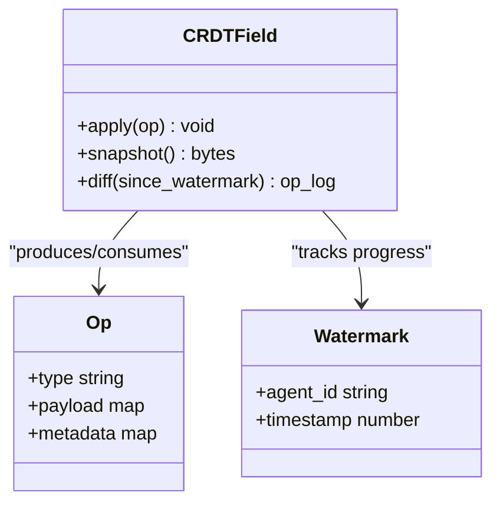
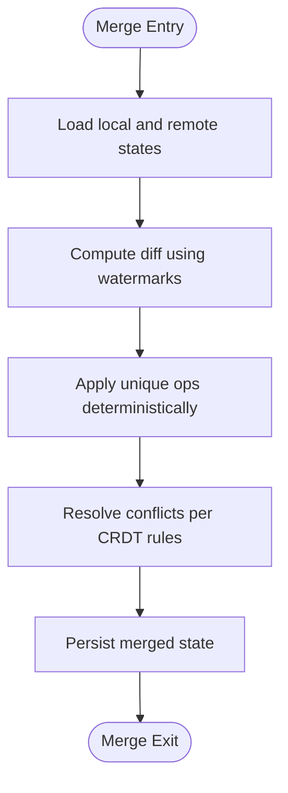
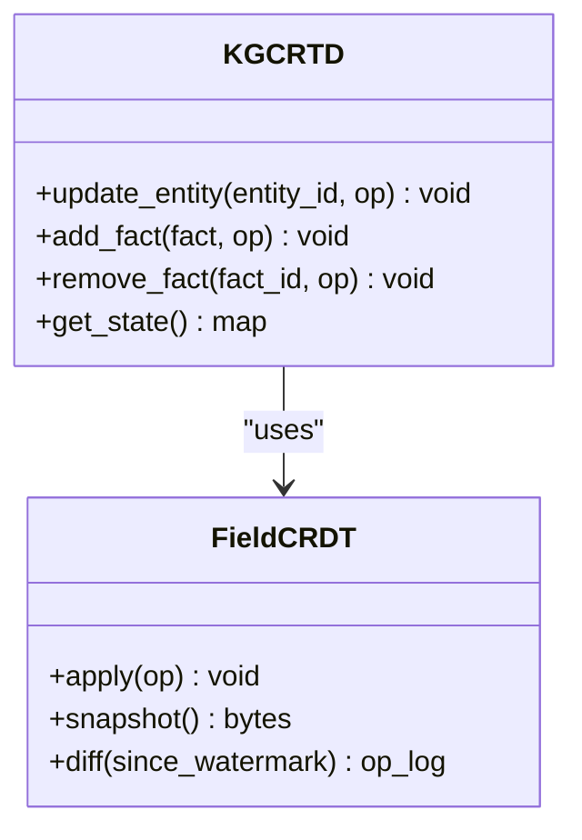
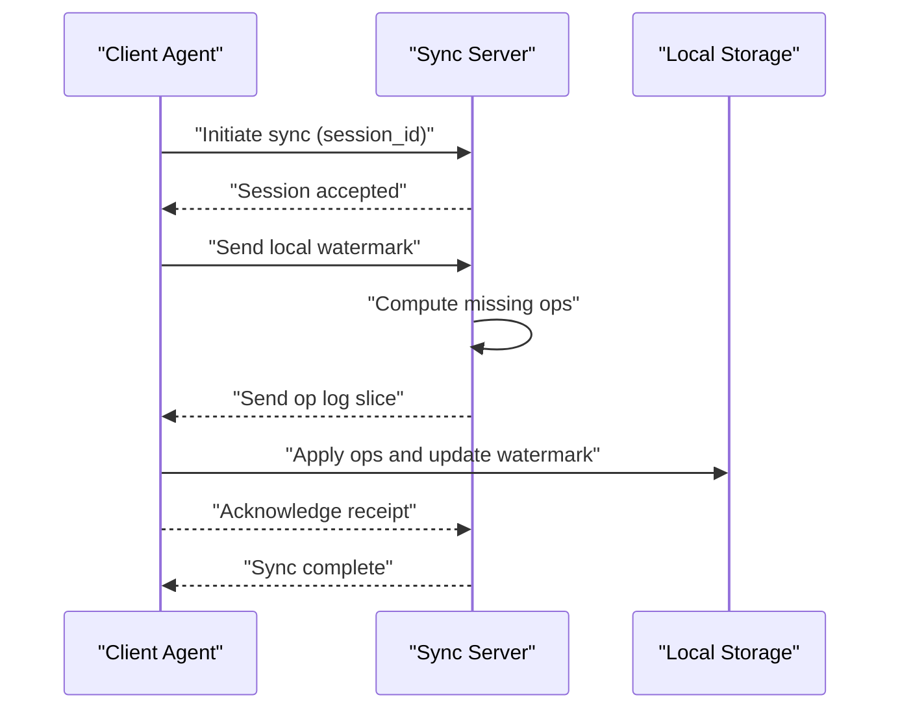
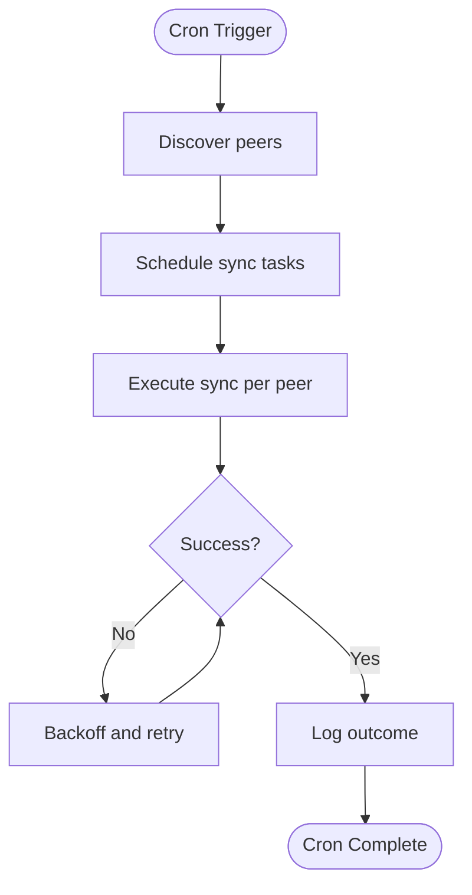
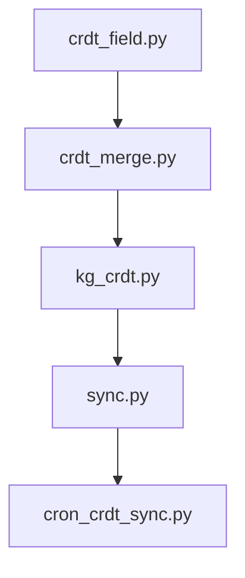

# CRDT Synchronization

<cite>
**Referenced Files in This Document**
- [crdt_field.py](file://agentic_memory/crdt/crdt_field.py)
- [crdt_merge.py](file://agentic_memory/crdt/crdt_merge.py)
- [kg_crdt.py](file://agentic_memory/kg/kg_crdt.py)
- [sync.py](file://agentic_memory/sync.py)
- [cron_crdt_sync.py](file://cron/cron_crdt_sync.py)
- [test_crdt_field.py](file://eval/test_crdt_field.py)
- [test_crdt_merge.py](file://eval/test_crdt_merge.py)
- [test_crdt_integration.py](file://eval/test_crdt_integration.py)
- [test_crdt_sync.py](file://eval/test_crdt_sync.py)
- [test_kg_crdt.py](file://eval/test_kg_crdt.py)
- [verify_kg_sync_convergence.py](file://eval/verify_kg_sync_convergence.py)
</cite>

## Table of Contents
1. [Introduction](#introduction)
2. [Project Structure](#project-structure)
3. [Core Components](#core-components)
4. [Architecture Overview](#architecture-overview)
5. [Detailed Component Analysis](#detailed-component-analysis)
6. [Dependency Analysis](#dependency-analysis)
7. [Performance Considerations](#performance-considerations)
8. [Troubleshooting Guide](#troubleshooting-guide)
9. [Conclusion](#conclusion)
10. [Appendices](#appendices)

## Introduction
This document explains how Conflict-Free Replicated Data Types (CRDTs) are implemented and used for synchronization in Agentic Memory. It focuses on field-level CRDT operations, merge algorithms, conflict resolution strategies, and the sync protocol that enables distributed consistency across multiple agent instances without coordination overhead. It also covers message formats, convergence guarantees, practical examples, performance considerations, scalability limits, and troubleshooting guidance.

## Project Structure
The CRDT subsystem is organized into focused modules:
- Field-level CRDT primitives and operations
- Merge logic and helpers
- Knowledge graph CRDT integration
- Sync orchestration and cron scheduling
- Tests validating behavior and convergence

**Diagram sources**
- [crdt_field.py](file://agentic_memory/crdt/crdt_field.py)
- [crdt_merge.py](file://agentic_memory/crdt/crdt_merge.py)
- [kg_crdt.py](file://agentic_memory/kg/kg_crdt.py)
- [sync.py](file://agentic_memory/sync.py)
- [cron_crdt_sync.py](file://cron/cron_crdt_sync.py)
- [test_crdt_field.py](file://eval/test_crdt_field.py)
- [test_crdt_merge.py](file://eval/test_crdt_merge.py)
- [test_crdt_integration.py](file://eval/test_crdt_integration.py)
- [test_crdt_sync.py](file://eval/test_crdt_sync.py)
- [test_kg_crdt.py](file://eval/test_kg_crdt.py)
- [verify_kg_sync_convergence.py](file://eval/verify_kg_sync_convergence.py)

**Section sources**
- [crdt_field.py](file://agentic_memory/crdt/crdt_field.py)
- [crdt_merge.py](file://agentic_memory/crdt/crdt_merge.py)
- [kg_crdt.py](file://agentic_memory/kg/kg_crdt.py)
- [sync.py](file://agentic_memory/sync.py)
- [cron_crdt_sync.py](file://cron/cron_crdt_sync.py)
- [test_crdt_field.py](file://eval/test_crdt_field.py)
- [test_crdt_merge.py](file://eval/test_crdt_merge.py)
- [test_crdt_integration.py](file://eval/test_crdt_integration.py)
- [test_crdt_sync.py](file://eval/test_crdt_sync.py)
- [test_kg_crdt.py](file://eval/test_kg_crdt.py)
- [verify_kg_sync_convergence.py](file://eval/verify_kg_sync_convergence.py)

## Core Components
- Field-level CRDT operations: define atomic mutations (e.g., append, set, delete) with metadata such as vector clocks or logical timestamps to ensure commutativity and idempotency.
- Merge algorithm: combines two states by applying all unique operations from both sides, resolving conflicts deterministically using CRDT semantics.
- KG CRDT integration: maps field-level CRDTs to knowledge graph entities/facts, ensuring consistent updates across replicas.
- Sync protocol: defines message formats for exchanging CRDT deltas and state snapshots between agents; includes handshake, delta exchange, and reconciliation phases.
- Cron scheduler: periodically triggers CRDT synchronization tasks across instances.

Key responsibilities:
- crdt_field.py: CRDT field types, mutation API, and local application of operations.
- crdt_merge.py: merge functions, conflict resolution rules, and helper utilities.
- kg_crdt.py: mapping between CRDT fields and KG structures, including persistence and retrieval.
- sync.py: orchestrates sync sessions, marshals messages, and applies remote changes.
- cron_crdt_sync.py: schedules and runs periodic sync jobs.

**Section sources**
- [crdt_field.py](file://agentic_memory/crdt/crdt_field.py)
- [crdt_merge.py](file://agentic_memory/crdt/crdt_merge.py)
- [kg_crdt.py](file://agentic_memory/kg/kg_crdt.py)
- [sync.py](file://agentic_memory/sync.py)
- [cron_crdt_sync.py](file://cron/cron_crdt_sync.py)

## Architecture Overview
The CRDT synchronization architecture ensures eventual consistency across multiple agent instances without requiring a central coordinator. Each instance maintains its own local state and CRDT history. During sync, instances exchange operation logs or compacted deltas, apply them locally, and converge to a consistent state.

**Diagram sources**
- [sync.py](file://agentic_memory/sync.py)
- [cron_crdt_sync.py](file://cron/cron_crdt_sync.py)
- [kg_crdt.py](file://agentic_memory/kg/kg_crdt.py)

## Detailed Component Analysis

### Field-Level CRDT Operations
Field-level CRDTs provide a small set of well-defined operations that are commutative and idempotent. Typical operations include:
- Append: add an element to a sequence or set-like structure.
- Set: assign a value to a key with versioning.
- Delete: remove an element or key, often with tombstones or causal markers.
- Update: modify structured data atomically with conflict-free semantics.

Each operation carries metadata (e.g., source agent ID, logical timestamp, vector clock components) to enable deterministic merging. Local application of operations is safe under concurrent writes because the merge function resolves any conflicts consistently.

**Diagram sources**
- [crdt_field.py](file://agentic_memory/crdt/crdt_field.py)

**Section sources**
- [crdt_field.py](file://agentic_memory/crdt/crdt_field.py)
- [test_crdt_field.py](file://eval/test_crdt_field.py)

### Merge Algorithm and Conflict Resolution
The merge algorithm takes two CRDT states and produces a unified state by:
- Identifying unique operations from each side based on watermarks or IDs.
- Applying operations in a deterministic order.
- Resolving conflicts using CRDT semantics (e.g., last-writer-wins with causality, OR-sets for concurrent adds/deletes).

Conflict resolution strategies:
- Commutative merges: order-independent combination of operations.
- Idempotent application: repeated application does not change state.
- Causal ordering: respects happens-before relationships via timestamps or vector clocks.

**Diagram sources**
- [crdt_merge.py](file://agentic_memory/crdt/crdt_merge.py)

**Section sources**
- [crdt_merge.py](file://agentic_memory/crdt/crdt_merge.py)
- [test_crdt_merge.py](file://eval/test_crdt_merge.py)

### Knowledge Graph CRDT Integration
KG CRDTs extend field-level CRDTs to knowledge graph entities and facts. The integration ensures:
- Consistent entity updates across replicas.
- Fact addition/removal with conflict-free semantics.
- Persistence of CRDT histories and watermarks.

**Diagram sources**
- [kg_crdt.py](file://agentic_memory/kg/kg_crdt.py)
- [crdt_field.py](file://agentic_memory/crdt/crdt_field.py)

**Section sources**
- [kg_crdt.py](file://agentic_memory/kg/kg_crdt.py)
- [test_kg_crdt.py](file://eval/test_kg_crdt.py)

### Sync Protocol and Message Formats
The sync protocol coordinates exchanges between instances:
- Handshake: establish session identifiers and capabilities.
- Watermark exchange: share last applied timestamps to compute diffs.
- Delta transfer: send operation logs or compacted deltas.
- Application and acknowledgment: apply remote ops, persist, and confirm.

Message format elements typically include:
- Session ID
- Source agent ID
- Watermark (agent ID + timestamp)
- Operation list (type, payload, metadata)
- Status codes and error details

**Diagram sources**
- [sync.py](file://agentic_memory/sync.py)

**Section sources**
- [sync.py](file://agentic_memory/sync.py)
- [test_crdt_sync.py](file://eval/test_crdt_sync.py)

### Cron Scheduling for CRDT Sync
Periodic CRDT synchronization is orchestrated by a cron job that:
- Scans active instances.
- Initiates sync sessions.
- Retries failed attempts with backoff.
- Logs outcomes and metrics.

**Diagram sources**
- [cron_crdt_sync.py](file://cron/cron_crdt_sync.py)

**Section sources**
- [cron_crdt_sync.py](file://cron/cron_crdt_sync.py)

## Dependency Analysis
The CRDT subsystem has clear layering:
- Field-level CRDTs depend only on core primitives and metadata.
- Merge logic depends on field-level operations and helper utilities.
- KG CRDT depends on field-level CRDTs and storage interfaces.
- Sync orchestrator depends on KG CRDT and network I/O.
- Cron job depends on sync orchestrator and discovery mechanisms.

**Diagram sources**
- [crdt_field.py](file://agentic_memory/crdt/crdt_field.py)
- [crdt_merge.py](file://agentic_memory/crdt/crdt_merge.py)
- [kg_crdt.py](file://agentic_memory/kg/kg_crdt.py)
- [sync.py](file://agentic_memory/sync.py)
- [cron_crdt_sync.py](file://cron/cron_crdt_sync.py)

**Section sources**
- [crdt_field.py](file://agentic_memory/crdt/crdt_field.py)
- [crdt_merge.py](file://agentic_memory/crdt/crdt_merge.py)
- [kg_crdt.py](file://agentic_memory/kg/kg_crdt.py)
- [sync.py](file://agentic_memory/sync.py)
- [cron_crdt_sync.py](file://cron/cron_crdt_sync.py)

## Performance Considerations
- Delta size: Minimize operation payloads and use compaction strategies to reduce bandwidth.
- Watermark granularity: Finer-grained watermarks improve incremental sync but increase overhead.
- Merge complexity: Ensure merge functions are linear or near-linear in the number of operations.
- Concurrency: Avoid contention by applying operations idempotently and batching writes.
- Network reliability: Implement retries and backoff to handle transient failures.
- Storage efficiency: Use append-only logs and periodic snapshots to balance read/write performance.

[No sources needed since this section provides general guidance]

## Troubleshooting Guide
Common issues and resolutions:
- Stalled sync: Check watermarks and ensure both sides have consistent views of last applied timestamps.
- Duplicate operations: Verify idempotency and deduplication logic in the merge path.
- Divergent states: Inspect conflict resolution rules and ensure deterministic ordering.
- High latency: Profile delta sizes and consider compaction or batching.
- Cron failures: Review logs for discovery errors, network timeouts, and retry policies.

Validation tools:
- Unit tests for field operations and merge correctness.
- Integration tests for end-to-end sync flows.
- Convergence verification scripts to assert eventual consistency.

**Section sources**
- [test_crdt_field.py](file://eval/test_crdt_field.py)
- [test_crdt_merge.py](file://eval/test_crdt_merge.py)
- [test_crdt_integration.py](file://eval/test_crdt_integration.py)
- [test_crdt_sync.py](file://eval/test_crdt_sync.py)
- [test_kg_crdt.py](file://eval/test_kg_crdt.py)
- [verify_kg_sync_convergence.py](file://eval/verify_kg_sync_convergence.py)

## Conclusion
Agentic Memory’s CRDT-based synchronization provides robust, coordinated-free consistency across multiple agent instances. By leveraging field-level CRDTs, deterministic merge algorithms, and a well-defined sync protocol, the system achieves eventual convergence with minimal operational overhead. Proper configuration of watermarks, compaction, and retry policies ensures scalable and reliable synchronization in production environments.

[No sources needed since this section summarizes without analyzing specific files]

## Appendices

### Practical Examples
- Field-level append and delete with concurrent edits: demonstrate idempotent application and conflict-free merge.
- Knowledge graph entity update: show consistent entity modifications across replicas.
- Sync workflow: illustrate handshake, watermark exchange, delta transfer, and acknowledgment.

For concrete scenarios and assertions, refer to the test suite and convergence verification script.

**Section sources**
- [test_crdt_field.py](file://eval/test_crdt_field.py)
- [test_crdt_merge.py](file://eval/test_crdt_merge.py)
- [test_crdt_integration.py](file://eval/test_crdt_integration.py)
- [test_crdt_sync.py](file://eval/test_crdt_sync.py)
- [test_kg_crdt.py](file://eval/test_kg_crdt.py)
- [verify_kg_sync_convergence.py](file://eval/verify_kg_sync_convergence.py)