# Core Concepts

<cite>
**Referenced Files in This Document**
- [README.md](file://README.md)
- [architecture/overview.md](file://docs/architecture/overview.md)
- [concepts/knowledge-graph.md](file://docs/concepts/knowledge-graph.md)
- [concepts/multi-agent-sync.md](file://docs/concepts/multi-agent-sync.md)
- [concepts/search-pipeline.md](file://docs/concepts/search-pipeline.md)
- [concepts/temporal-kg.md](file://docs/concepts/temporal-kg.md)
- [agentic_memory/__init__.py](file://agentic_memory/__init__.py)
- [agentic_memory/models.py](file://agentic_memory/models.py)
- [agentic_memory/kg.py](file://agentic_memory/kg.py)
- [agentic_memory/sync.py](file://agentic_memory/sync.py)
- [agentic_memory/temporal.py](file://agentic_memory/temporal.py)
- [crdt/crdt_field.py](file://crdt/crdt_field.py)
- [crdt/crdt_merge.py](file://crdt/crdt_merge.py)
- [save/pipeline.py](file://save/pipeline.py)
- [recall/search_memory.py](file://recall/search_memory.py)
- [kg/kg_crdt.py](file://kg/kg_crdt.py)
- [kg/temporal_resolver.py](file://kg/temporal_resolver.py)
- [search/orchestrator.py](file://search/orchestrator.py)
- [infra/shared_memory_state.py](file://infra/shared_memory_state.py)
- [cron/cron_crdt_sync.py](file://cron/cron_crdt_sync.py)
</cite>

## Table of Contents
1. [Introduction](#introduction)
2. [Project Structure](#project-structure)
3. [Core Components](#core-components)
4. [Architecture Overview](#architecture-overview)
5. [Detailed Component Analysis](#detailed-component-analysis)
6. [Dependency Analysis](#dependency-analysis)
7. [Performance Considerations](#performance-considerations)
8. [Troubleshooting Guide](#troubleshooting-guide)
9. [Conclusion](#conclusion)

## Introduction
This document explains the fundamental concepts behind Agentic Memory architecture, focusing on:
- The memory lifecycle from creation to persistence and retrieval
- Agent-scoped storage model and shared memory spaces
- Conflict-free replicated data types (CRDTs) for synchronization across agents
- Temporal reasoning capabilities over facts and memories
- Knowledge graph fundamentals and how they integrate with search
- Hybrid search pipeline that combines semantic, lexical, and graph-based retrieval
- Practical workflows such as memory persistence, semantic retrieval, and cross-agent collaboration

The goal is to provide a clear mental model for both new users and experienced practitioners who need to understand how memories are structured, indexed, and retrieved, and how multiple agents collaborate safely and consistently.

## Project Structure
At a high level, the repository organizes core concepts into focused modules:
- Public API surface and models under agentic_memory
- CRDT implementation and merge logic under crdt
- Knowledge graph operations and temporal resolution under kg
- Save pipeline for persistence and indexing under save
- Search orchestration and phases under search
- Shared memory state and multi-agent coordination under infra and cron

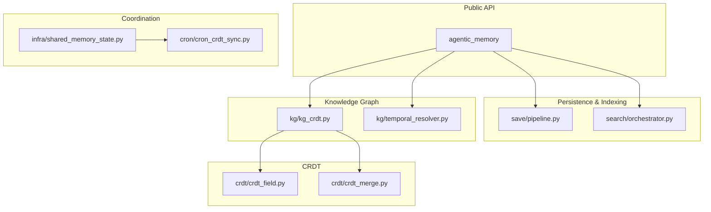

**Diagram sources**
- [agentic_memory/__init__.py](file://agentic_memory/__init__.py)
- [save/pipeline.py](file://save/pipeline.py)
- [search/orchestrator.py](file://search/orchestrator.py)
- [kg/kg_crdt.py](file://kg/kg_crdt.py)
- [kg/temporal_resolver.py](file://kg/temporal_resolver.py)
- [crdt/crdt_field.py](file://crdt/crdt_field.py)
- [crdt/crdt_merge.py](file://crdt/crdt_merge.py)
- [infra/shared_memory_state.py](file://infra/shared_memory_state.py)
- [cron/cron_crdt_sync.py](file://cron/cron_crdt_sync.py)

**Section sources**
- [README.md](file://README.md)
- [architecture/overview.md](file://docs/architecture/overview.md)

## Core Components
- Memory model and lifecycle: Memories are created, enriched, persisted, indexed, and later retrieved via hybrid search. The save pipeline orchestrates these steps and ensures consistent updates to relational stores, vector indexes, and knowledge graphs.
- Agent-scoped storage: Each agent has its own scope for writing and reading, while shared memory spaces enable controlled collaboration across agents.
- CRDT-based synchronization: Field-level CRDTs and content-keyed merges ensure convergence without central coordination, enabling conflict-free replication across agents and deployments.
- Temporal reasoning: Facts and memories carry time-aware metadata; temporal resolvers support queries “as-of” a point in time and maintain evolving beliefs.
- Knowledge graph fundamentals: Entities, relations, and facts form a graph that supports traversal, deduplication, contradiction detection, and integration with search results.
- Hybrid search pipeline: Combines lexical full-text search, dense vector similarity, and graph-based recall, then reranks and synthesizes answers.

**Section sources**
- [agentic_memory/models.py](file://agentic_memory/models.py)
- [save/pipeline.py](file://save/pipeline.py)
- [recall/search_memory.py](file://recall/search_memory.py)
- [kg/kg_crdt.py](file://kg/kg_crdt.py)
- [kg/temporal_resolver.py](file://kg/temporal_resolver.py)
- [concepts/search-pipeline.md](file://docs/concepts/search-pipeline.md)
- [concepts/knowledge-graph.md](file://docs/concepts/knowledge-graph.md)
- [concepts/temporal-kg.md](file://docs/concepts/temporal-kg.md)

## Architecture Overview
The system exposes a public API that coordinates saving, indexing, and searching while leveraging CRDTs for consistency and temporal reasoning for time-aware retrieval.

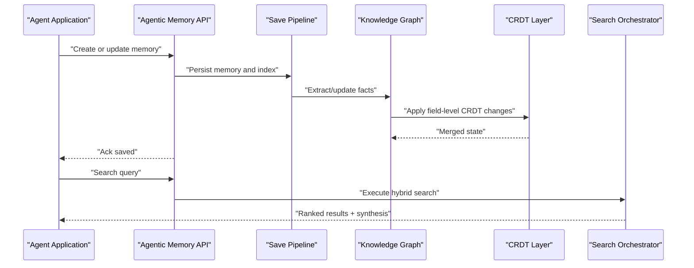

**Diagram sources**
- [agentic_memory/__init__.py](file://agentic_memory/__init__.py)
- [save/pipeline.py](file://save/pipeline.py)
- [kg/kg_crdt.py](file://kg/kg_crdt.py)
- [search/orchestrator.py](file://search/orchestrator.py)

## Detailed Component Analysis

### Memory Lifecycle
Memories flow through a well-defined lifecycle:
- Creation and enrichment: Inputs are validated, frontmatter extracted, and optional skills or context attached.
- Persistence and indexing: The save pipeline writes to relational storage, updates vector embeddings, and triggers post-save hooks.
- Knowledge graph updates: New facts are extracted and merged using CRDTs to avoid conflicts.
- Retrieval: Hybrid search composes lexical, vector, and graph signals, followed by reranking and synthesis.

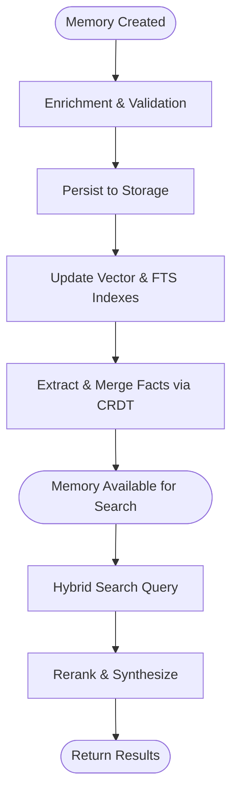

**Diagram sources**
- [save/pipeline.py](file://save/pipeline.py)
- [recall/search_memory.py](file://recall/search_memory.py)
- [kg/kg_crdt.py](file://kg/kg_crdt.py)

**Section sources**
- [save/pipeline.py](file://save/pipeline.py)
- [recall/search_memory.py](file://recall/search_memory.py)

### Agent-Scoped Storage and Shared Memory Spaces
Agents operate within scoped contexts to isolate writes and reads, while shared memory spaces allow controlled collaboration:
- Agent scope: Ensures isolation and prevents accidental cross-agent mutations.
- Shared spaces: Provide explicit boundaries where multiple agents can read/write according to policy.
- Coordination: Background tasks and shared state helpers manage visibility and synchronization.

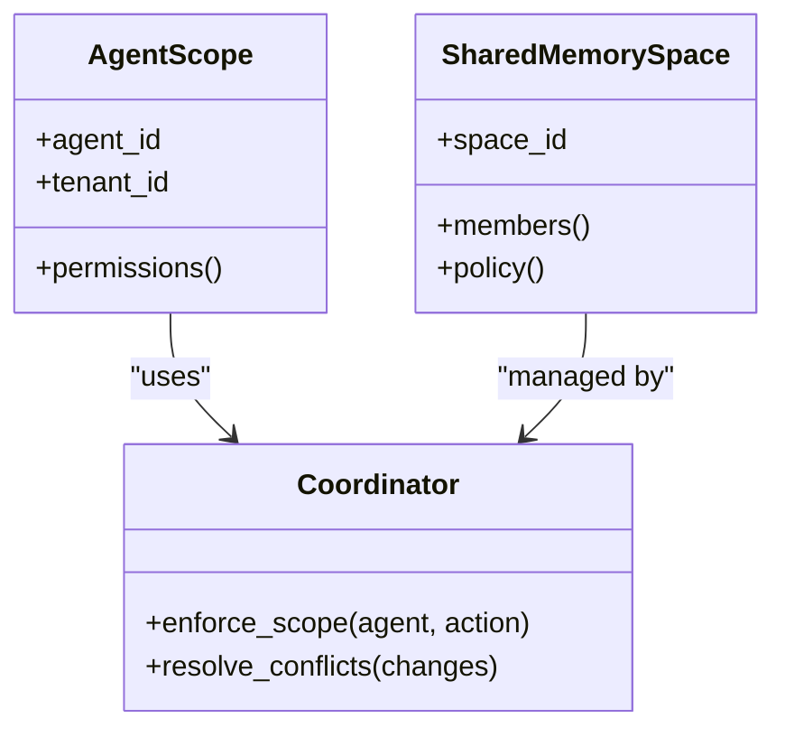

**Diagram sources**
- [infra/shared_memory_state.py](file://infra/shared_memory_state.py)

**Section sources**
- [infra/shared_memory_state.py](file://infra/shared_memory_state.py)
- [concepts/multi-agent-sync.md](file://docs/concepts/multi-agent-sync.md)

### CRDT-Based Synchronization
Field-level CRDTs enable conflict-free merging of concurrent edits:
- Content-keyed fields: Changes are identified by stable keys rather than positions, reducing merge conflicts.
- Merge semantics: Commutative, associative, and idempotent operations guarantee eventual consistency.
- Sync workflow: Periodic sync jobs reconcile differences between replicas and apply merges deterministically.

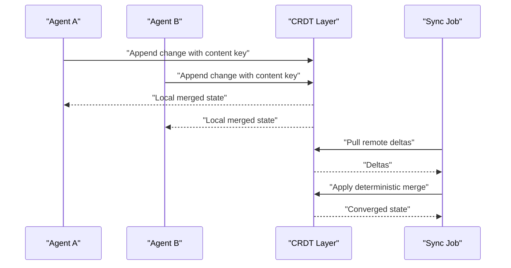

**Diagram sources**
- [crdt/crdt_field.py](file://crdt/crdt_field.py)
- [crdt/crdt_merge.py](file://crdt/crdt_merge.py)
- [cron/cron_crdt_sync.py](file://cron/cron_crdt_sync.py)

**Section sources**
- [crdt/crdt_field.py](file://crdt/crdt_field.py)
- [crdt/crdt_merge.py](file://crdt/crdt_merge.py)
- [cron/cron_crdt_sync.py](file://cron/cron_crdt_sync.py)

### Temporal Reasoning Capabilities
Temporal reasoning allows agents to reason about facts and memories at specific points in time:
- Time-aware facts: Facts include observed timestamps and validity windows.
- As-of queries: Retrieve state as of a given timestamp to reconstruct past beliefs.
- Temporal resolvers: Maintain priors and decay models to handle drift and contradictions over time.

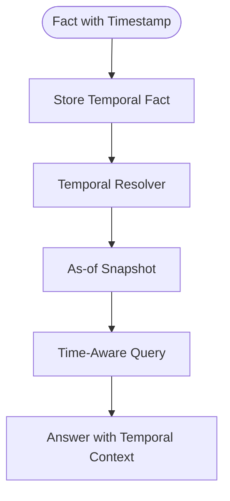

**Diagram sources**
- [kg/temporal_resolver.py](file://kg/temporal_resolver.py)
- [temporal.py](file://agentic_memory/temporal.py)

**Section sources**
- [kg/temporal_resolver.py](file://kg/temporal_resolver.py)
- [agentic_memory/temporal.py](file://agentic_memory/temporal.py)
- [concepts/temporal-kg.md](file://docs/concepts/temporal-kg.md)

### Knowledge Graph Fundamentals
The knowledge graph represents entities, relations, and facts extracted from memories:
- Extraction: From text and structured inputs, facts are normalized and linked to entities.
- Deduplication and validation: Prevents redundant edges and enforces schema constraints.
- Integration with search: Graph traversal augments recall and improves precision.

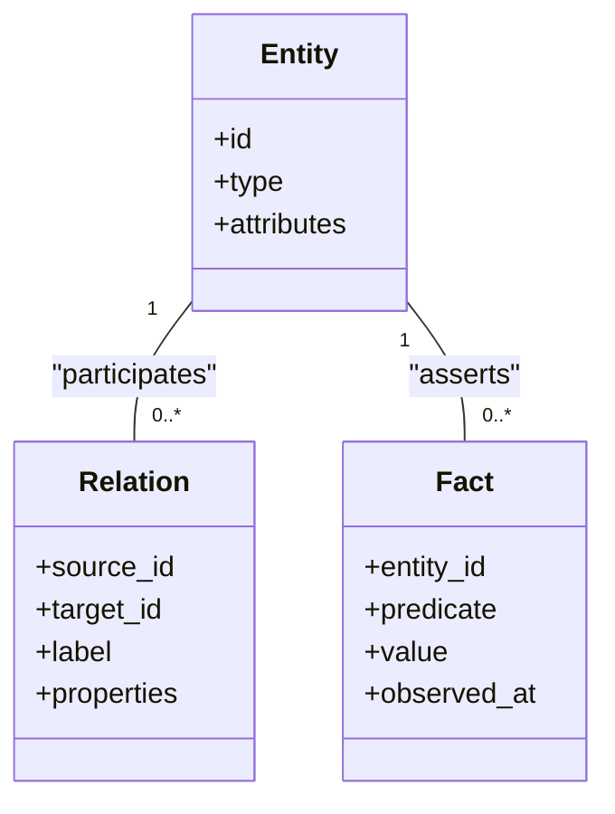

**Diagram sources**
- [kg/kg_crdt.py](file://kg/kg_crdt.py)
- [knowledge_graph/kg_schema.py](file://knowledge_graph/kg_schema.py)

**Section sources**
- [kg/kg_crdt.py](file://kg/kg_crdt.py)
- [concepts/knowledge-graph.md](file://docs/concepts/knowledge-graph.md)

### Hybrid Search Pipeline
The hybrid search pipeline composes multiple retrieval strategies:
- Lexical search: Full-text search over memory content and titles.
- Semantic search: Dense vector similarity over embeddings.
- Graph recall: Traversal-based retrieval using entity links and relations.
- Reranking and synthesis: Cross-encoders or learned models refine scores and generate concise answers.

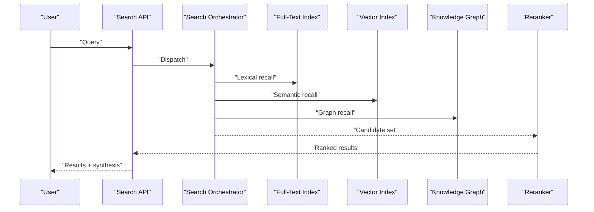

**Diagram sources**
- [search/orchestrator.py](file://search/orchestrator.py)
- [recall/search_memory.py](file://recall/search_memory.py)

**Section sources**
- [search/orchestrator.py](file://search/orchestrator.py)
- [concepts/search-pipeline.md](file://docs/concepts/search-pipeline.md)

### Practical Workflows

#### Memory Persistence Workflow
- Create memory with metadata and content.
- Persist to storage and update indexes.
- Extract facts and apply CRDT merges.
- Confirm availability for search.

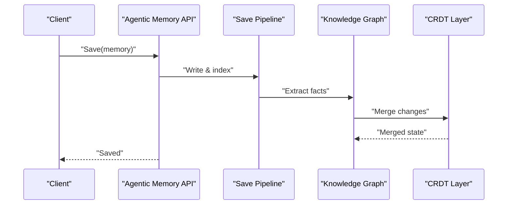

**Diagram sources**
- [save/pipeline.py](file://save/pipeline.py)
- [kg/kg_crdt.py](file://kg/kg_crdt.py)

#### Semantic Retrieval Workflow
- Parse and expand query.
- Execute hybrid recall across FTS, vectors, and graph.
- Rerank candidates and synthesize answer.

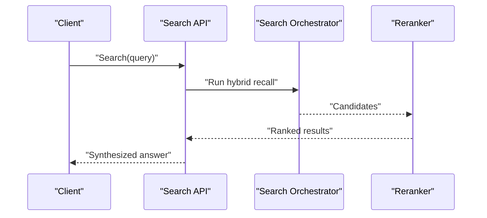

**Diagram sources**
- [search/orchestrator.py](file://search/orchestrator.py)
- [recall/search_memory.py](file://recall/search_memory.py)

#### Cross-Agent Collaboration Workflow
- Agents write to shared memory space with scoped permissions.
- CRDT merges resolve concurrent edits.
- Sync job reconciles replicas and maintains consistency.

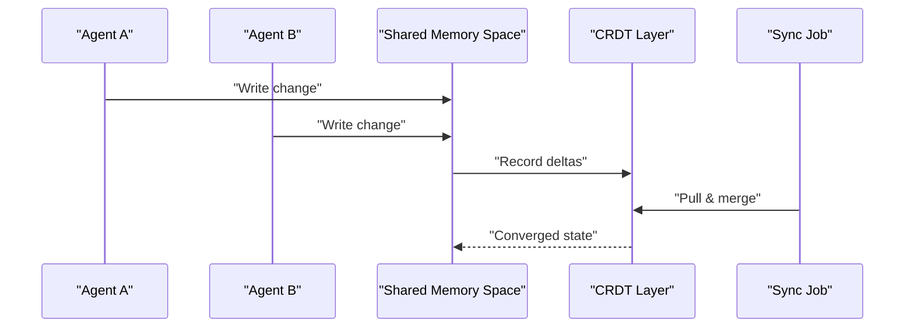

**Diagram sources**
- [infra/shared_memory_state.py](file://infra/shared_memory_state.py)
- [cron/cron_crdt_sync.py](file://cron/cron_crdt_sync.py)

## Dependency Analysis
Key dependencies among components:
- Public API depends on save pipeline, search orchestrator, and knowledge graph services.
- Knowledge graph relies on CRDT layer for conflict-free merges.
- Shared memory state coordinates multi-agent access and delegates to sync jobs.

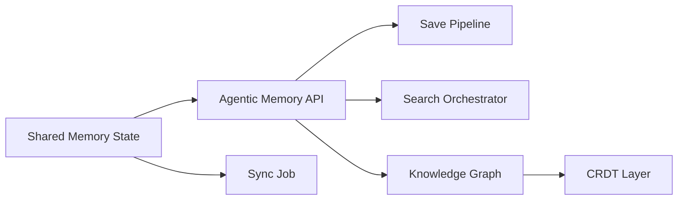

**Diagram sources**
- [agentic_memory/__init__.py](file://agentic_memory/__init__.py)
- [save/pipeline.py](file://save/pipeline.py)
- [search/orchestrator.py](file://search/orchestrator.py)
- [kg/kg_crdt.py](file://kg/kg_crdt.py)
- [crdt/crdt_field.py](file://crdt/crdt_field.py)
- [infra/shared_memory_state.py](file://infra/shared_memory_state.py)
- [cron/cron_crdt_sync.py](file://cron/cron_crdt_sync.py)

**Section sources**
- [agentic_memory/__init__.py](file://agentic_memory/__init__.py)
- [save/pipeline.py](file://save/pipeline.py)
- [search/orchestrator.py](file://search/orchestrator.py)
- [kg/kg_crdt.py](file://kg/kg_crdt.py)
- [crdt/crdt_field.py](file://crdt/crdt_field.py)
- [infra/shared_memory_state.py](file://infra/shared_memory_state.py)
- [cron/cron_crdt_sync.py](file://cron/cron_crdt_sync.py)

## Performance Considerations
- Indexing throughput: Batch updates to vector and full-text indexes to reduce overhead.
- Embedding caching: Reuse embeddings when possible to minimize recomputation.
- Reranker cost: Limit candidate sets before reranking to balance latency and quality.
- CRDT merge efficiency: Use content-keyed fields to reduce merge complexity and network traffic.
- Temporal queries: Cache snapshots for frequent as-of timestamps to speed up repeated queries.

[No sources needed since this section provides general guidance]

## Troubleshooting Guide
Common issues and diagnostics:
- Sync divergence: Inspect sync logs and verify CRDT merge outcomes.
- Stale search results: Trigger reindexing if embeddings or FTS drift.
- Contradictions in knowledge graph: Review contradiction detection logs and adjust extraction policies.
- Temporal inconsistencies: Validate observed timestamps and resolver configuration.

**Section sources**
- [cron/cron_crdt_sync.py](file://cron/cron_crdt_sync.py)
- [kg/kg_crdt.py](file://kg/kg_crdt.py)
- [kg/temporal_resolver.py](file://kg/temporal_resolver.py)

## Conclusion
Agentic Memory integrates agent-scoped storage, CRDT-based synchronization, temporal reasoning, and a hybrid search pipeline to deliver robust, collaborative, and time-aware memory systems. By understanding the lifecycle, graph foundations, and synchronization mechanisms, developers can build reliable multi-agent applications that persist, retrieve, and share knowledge safely and efficiently.