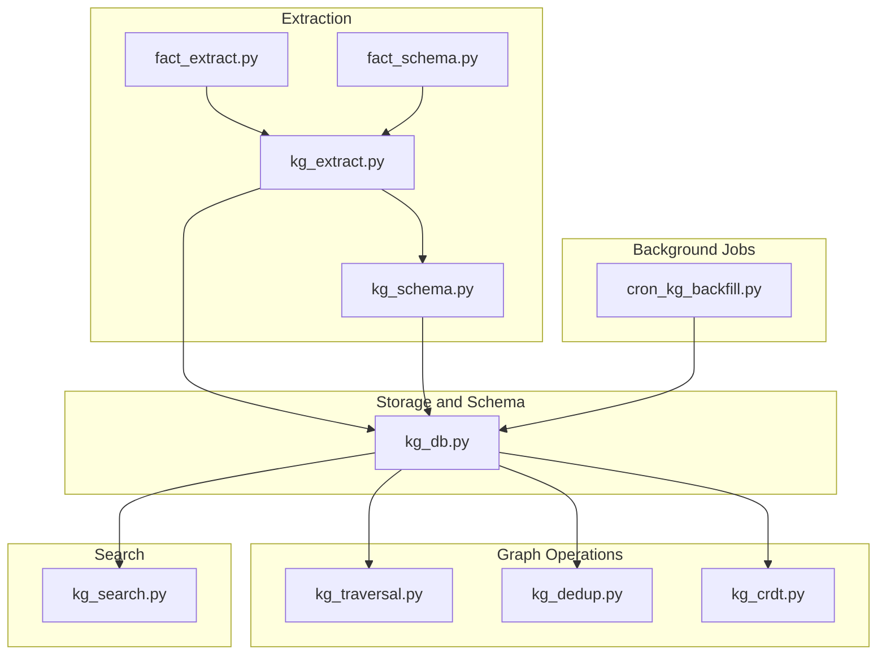
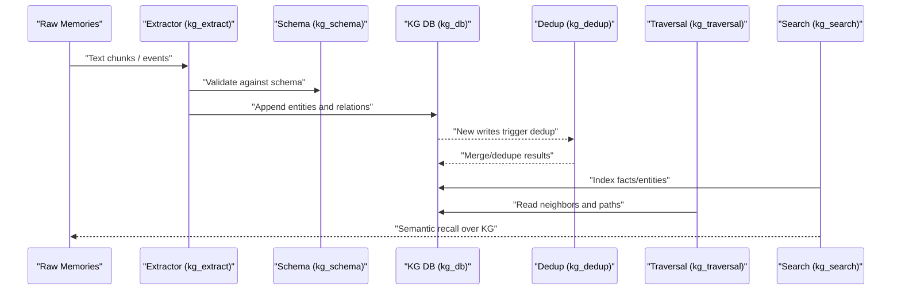
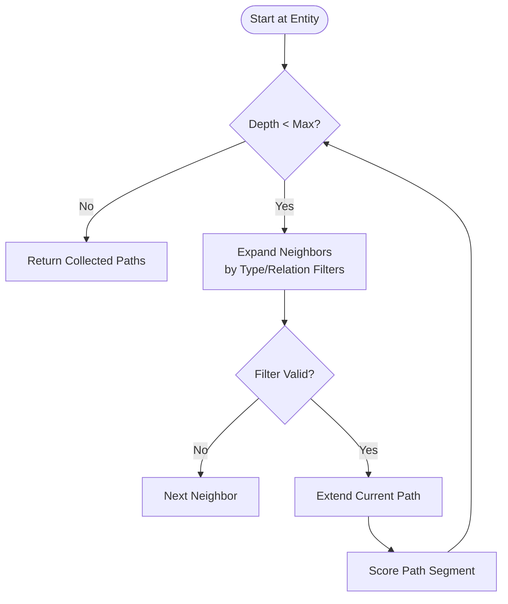
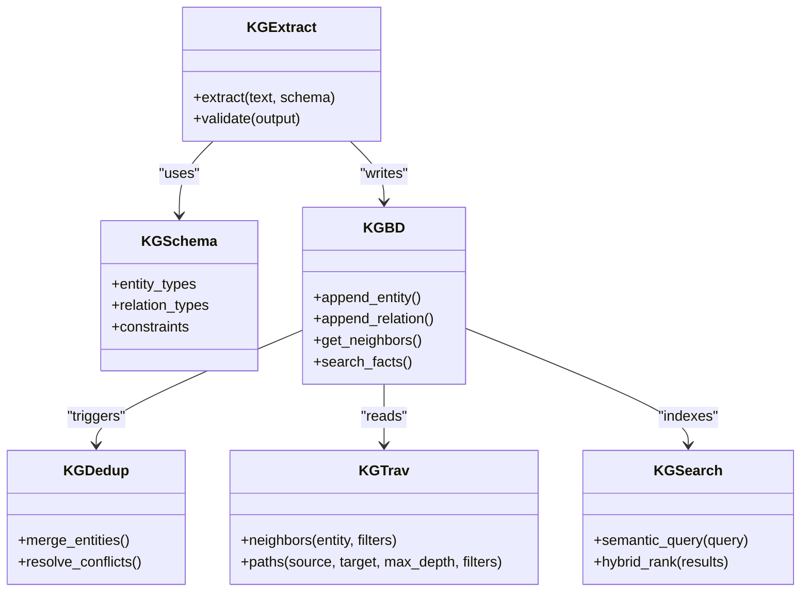
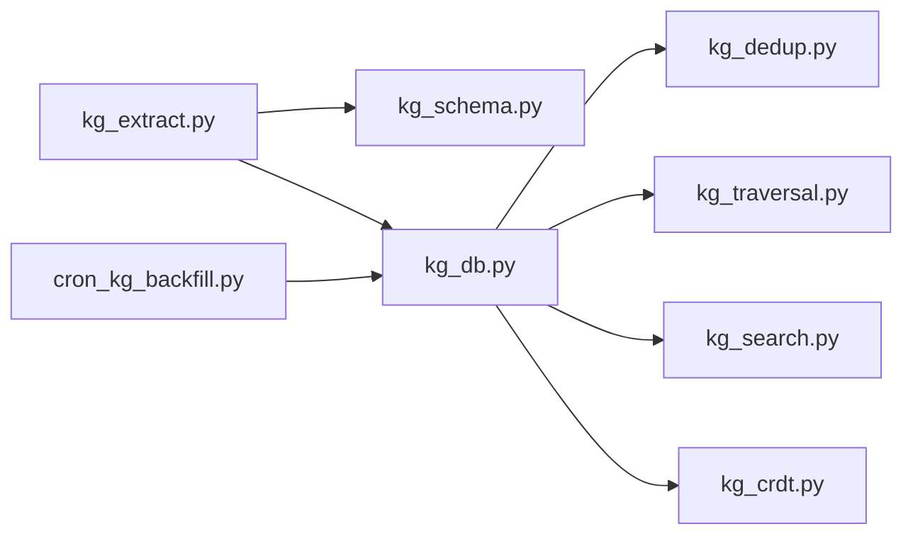

# Knowledge Graph Fundamentals

<cite>
**Referenced Files in This Document**
- [kg.py](file://agentic_memory/kg.py)
- [kg_extract.py](file://knowledge_graph/kg_extract.py)
- [kg_schema.py](file://knowledge_graph/kg_schema.py)
- [kg_search.py](file://knowledge_graph/kg_search.py)
- [kg_traversal.py](file://kg/kg_traversal.py)
- [kg_dedup.py](file://kg/kg_dedup.py)
- [kg_crdt.py](file://kg/kg_crdt.py)
- [fact_extract.py](file://fact/fact_extract.py)
- [fact_schema.py](file://fact/fact_schema.py)
- [kg_db.py](file://knowledge_graph/kg_db.py)
- [cron_kg_backfill.py](file://cron/cron_kg_backfill.py)
- [test_kg_traversal.py](file://eval/test_kg_traversal.py)
- [test_multi_hop_traversal.py](file://eval/test_multi_hop_traversal.py)
- [test_kg_dedup.py](file://eval/test_kg_dedup.py)
- [test_kg_dedup_semantic.py](file://eval/test_kg_dedup_semantic.py)
- [test_knowledge_graph.py](file://eval/test_knowledge_graph.py)
</cite>

## Table of Contents
1. [Introduction](#introduction)
2. [Project Structure](#project-structure)
3. [Core Components](#core-components)
4. [Architecture Overview](#architecture-overview)
5. [Detailed Component Analysis](#detailed-component-analysis)
6. [Dependency Analysis](#dependency-analysis)
7. [Performance Considerations](#performance-considerations)
8. [Troubleshooting Guide](#troubleshooting-guide)
9. [Conclusion](#conclusion)
10. [Appendices](#appendices)

## Introduction
This document explains the knowledge graph fundamentals in Agentic Memory, focusing on how raw memories are transformed into structured entities and relationships, how the graph is maintained and deduplicated, and how it supports traversal, path finding, and semantic search. It also provides practical examples for entity extraction, relationship creation, and querying the graph, along with guidance on integration with the broader memory system.

## Project Structure
The knowledge graph subsystem spans several modules:
- Extraction and schema definition live under knowledge_graph/ and fact/.
- Graph operations (traversal, analytics, CRDT-backed persistence) live under kg/.
- Search over the graph integrates with the general search pipeline.
- Background jobs orchestrate backfills and maintenance.

**Diagram sources**
- [kg_extract.py](file://knowledge_graph/kg_extract.py)
- [kg_schema.py](file://knowledge_graph/kg_schema.py)
- [kg_db.py](file://knowledge_graph/kg_db.py)
- [kg_traversal.py](file://kg/kg_traversal.py)
- [kg_dedup.py](file://kg/kg_dedup.py)
- [kg_crdt.py](file://kg/kg_crdt.py)
- [kg_search.py](file://knowledge_graph/kg_search.py)
- [fact_extract.py](file://fact/fact_extract.py)
- [fact_schema.py](file://fact/fact_schema.py)
- [cron_kg_backfill.py](file://cron/cron_kg_backfill.py)

**Section sources**
- [kg_extract.py](file://knowledge_graph/kg_extract.py)
- [kg_schema.py](file://knowledge_graph/kg_schema.py)
- [kg_db.py](file://knowledge_graph/kg_db.py)
- [kg_traversal.py](file://kg/kg_traversal.py)
- [kg_dedup.py](file://kg/kg_dedup.py)
- [kg_crdt.py](file://kg/kg_crdt.py)
- [kg_search.py](file://knowledge_graph/kg_search.py)
- [fact_extract.py](file://fact/fact_extract.py)
- [fact_schema.py](file://fact/fact_schema.py)
- [cron_kg_backfill.py](file://cron/cron_kg_backfill.py)

## Core Components
- Entity and relation extraction from text via LLMs or heuristics, producing normalized entities and typed relations.
- A stable graph schema that defines entity types, relation types, and constraints.
- Storage layer backed by a relational database with append-only updates and conflict-free merges.
- Traversal and path-finding utilities to explore neighborhoods and multi-hop paths.
- Deduplication strategies to merge equivalent entities and consolidate relations.
- Semantic search over facts and entities, integrated with vector and full-text indexes.

Key responsibilities:
- Extract: transform unstructured text into structured triples and metadata.
- Store: persist entities, relations, and temporal attributes safely.
- Maintain: deduplicate, reconcile conflicts, and keep indexes consistent.
- Query: support neighborhood exploration, path queries, and semantic retrieval.

**Section sources**
- [kg_extract.py](file://knowledge_graph/kg_extract.py)
- [kg_schema.py](file://knowledge_graph/kg_schema.py)
- [kg_db.py](file://knowledge_graph/kg_db.py)
- [kg_traversal.py](file://kg/kg_traversal.py)
- [kg_dedup.py](file://kg/kg_dedup.py)
- [kg_crdt.py](file://kg/kg_crdt.py)
- [kg_search.py](file://knowledge_graph/kg_search.py)

## Architecture Overview
The knowledge graph pipeline connects raw memories to structured knowledge and exposes query surfaces for agents and tools.

**Diagram sources**
- [kg_extract.py](file://knowledge_graph/kg_extract.py)
- [kg_schema.py](file://knowledge_graph/kg_schema.py)
- [kg_db.py](file://knowledge_graph/kg_db.py)
- [kg_dedup.py](file://kg/kg_dedup.py)
- [kg_traversal.py](file://kg/kg_traversal.py)
- [kg_search.py](file://knowledge_graph/kg_search.py)

## Detailed Component Analysis

### Entity Extraction from Text
- Purpose: Convert raw text into normalized entities and typed relations with optional attributes and temporal context.
- Inputs: Raw memory text, optional prompts or schemas, and provider configuration.
- Outputs: Entities, relations, and associated metadata ready for storage.
- Integration points:
  - Uses schema definitions to constrain outputs.
  - Emits changes consumed by background backfills and indexers.

Practical example pattern:
- Provide a paragraph describing people, places, and events.
- Run extraction to obtain entities and relations aligned to the schema.
- Persist and verify via dashboard or API.

**Section sources**
- [kg_extract.py](file://knowledge_graph/kg_extract.py)
- [fact_extract.py](file://fact/fact_extract.py)
- [fact_schema.py](file://fact/fact_schema.py)
- [kg_schema.py](file://knowledge_graph/kg_schema.py)

### Relationship Mapping and Graph Schema Design
- The schema defines:
  - Entity types and their properties.
  - Relation types and allowed source/target types.
  - Constraints such as uniqueness and cardinality.
- Relationship mapping ensures consistent typing and normalization across extractions.
- Temporal attributes can be attached to relations and facts for time-aware reasoning.

Design guidelines:
- Prefer coarse-grained entity types with rich properties when appropriate.
- Use explicit relation types to capture semantics rather than free-form labels.
- Normalize entity names and aliases at extraction time to aid deduplication.

**Section sources**
- [kg_schema.py](file://knowledge_graph/kg_schema.py)
- [fact_schema.py](file://fact/fact_schema.py)

### Graph Traversal Algorithms and Path Finding
- Neighborhood queries: retrieve immediate neighbors of an entity by type and relation direction.
- Multi-hop traversal: explore paths up to a configurable depth with filters on relation/entity types.
- Path scoring: combine structural features with semantic similarity and recency to rank candidate paths.

Common use cases:
- Explainability: surface short paths between queried concepts.
- Context assembly: gather related facts for agent reasoning.
- Discovery: find indirect connections across domains.

**Diagram sources**
- [kg_traversal.py](file://kg/kg_traversal.py)

**Section sources**
- [kg_traversal.py](file://kg/kg_traversal.py)
- [test_kg_traversal.py](file://eval/test_kg_traversal.py)
- [test_multi_hop_traversal.py](file://eval/test_multi_hop_traversal.py)

### Semantic Search Over Structured Knowledge
- Combines vector embeddings and full-text search over entities, relations, and facts.
- Supports hybrid ranking and reranking strategies.
- Integrates with the broader search pipeline to return ranked snippets and provenance.

Typical flow:
- Parse user query into keywords and semantic vectors.
- Retrieve candidates from KG tables and indexes.
- Rerank using cross-encoder or learned models.
- Return top-k results with explanations and links to original memories.

**Section sources**
- [kg_search.py](file://knowledge_graph/kg_search.py)

### Relationship Between Raw Memories and Extracted Graph Elements
- Each extracted entity/relation references its source memory(s), enabling traceability.
- Backlinks connect memories to relevant graph elements for contextual recall.
- When memories are updated or deleted, the graph reflects these changes through append-only updates and eventual consistency.

Operational implications:
- Provenance aids debugging and compliance.
- Enables “show me where this came from” UX.
- Supports incremental re-extraction when upstream memories change.

**Section sources**
- [kg_extract.py](file://knowledge_graph/kg_extract.py)
- [kg_db.py](file://knowledge_graph/kg_db.py)

### Practical Examples

#### Example 1: Entity Extraction
- Input: A paragraph about a project milestone involving a person, a date, and a deliverable.
- Process: Run extractor with schema constraints; validate output types and required fields.
- Output: Normalized entities and a relation linking person to deliverable with observed_at timestamp.
- Verification: Inspect via dashboard or query API; confirm backlinks to the source memory.

**Section sources**
- [kg_extract.py](file://knowledge_graph/kg_extract.py)
- [fact_extract.py](file://fact/fact_extract.py)
- [kg_schema.py](file://knowledge_graph/kg_schema.py)

#### Example 2: Relationship Creation
- Input: Two existing entities (e.g., Person and Project).
- Process: Create a typed relation with attributes (role, confidence, validity window).
- Validation: Ensure relation types match schema constraints and target types.
- Result: Relation persisted with provenance and temporal metadata.

**Section sources**
- [kg_schema.py](file://knowledge_graph/kg_schema.py)
- [kg_db.py](file://knowledge_graph/kg_db.py)

#### Example 3: Graph Queries
- Neighborhood query: List all outgoing relations from an entity filtered by type.
- Multi-hop path: Find paths of length up to 3 between two entities with type filters.
- Semantic search: Retrieve top-k facts/entities matching a natural language query.

**Section sources**
- [kg_traversal.py](file://kg/kg_traversal.py)
- [kg_search.py](file://knowledge_graph/kg_search.py)
- [test_kg_traversal.py](file://eval/test_kg_traversal.py)
- [test_multi_hop_traversal.py](file://eval/test_multi_hop_traversal.py)

### Graph Maintenance and Deduplication Strategies
- Deduplication:
  - Name-based merging for near-duplicates.
  - Semantic similarity checks for concept-level equivalence.
  - Conflict resolution policies for conflicting attributes or relations.
- Consistency:
  - Append-only writes with CRDT-style merges ensure convergence across writers.
  - Redirects and canonical IDs maintain referential integrity after merges.
- Backfills:
  - Periodic jobs rebuild indexes and repair orphaned edges.
  - Batched re-extraction improves coverage and quality.

**Diagram sources**
- [kg_extract.py](file://knowledge_graph/kg_extract.py)
- [kg_schema.py](file://knowledge_graph/kg_schema.py)
- [kg_db.py](file://knowledge_graph/kg_db.py)
- [kg_dedup.py](file://kg/kg_dedup.py)
- [kg_traversal.py](file://kg/kg_traversal.py)
- [kg_search.py](file://knowledge_graph/kg_search.py)

**Section sources**
- [kg_dedup.py](file://kg/kg_dedup.py)
- [kg_crdt.py](file://kg/kg_crdt.py)
- [cron_kg_backfill.py](file://cron/cron_kg_backfill.py)
- [test_kg_dedup.py](file://eval/test_kg_dedup.py)
- [test_kg_dedup_semantic.py](file://eval/test_kg_dedup_semantic.py)

### Integration with the Broader Memory System
- Save pipeline: After saving memories, extraction runs asynchronously to update the graph.
- Hooks and cron: Scheduled tasks perform backfills, analytics, and health checks.
- Dashboard and APIs: Expose graph inspection, search, and maintenance operations.
- Cross-session learning: Graph structures inform cross-session summarization and skill discovery.

**Section sources**
- [kg.py](file://agentic_memory/kg.py)
- [cron_kg_backfill.py](file://cron/cron_kg_backfill.py)
- [test_knowledge_graph.py](file://eval/test_knowledge_graph.py)

## Dependency Analysis
High-level dependencies among core modules:

**Diagram sources**
- [kg_extract.py](file://knowledge_graph/kg_extract.py)
- [kg_schema.py](file://knowledge_graph/kg_schema.py)
- [kg_db.py](file://knowledge_graph/kg_db.py)
- [kg_dedup.py](file://kg/kg_dedup.py)
- [kg_traversal.py](file://kg/kg_traversal.py)
- [kg_search.py](file://knowledge_graph/kg_search.py)
- [kg_crdt.py](file://kg/kg_crdt.py)
- [cron_kg_backfill.py](file://cron/cron_kg_backfill.py)

**Section sources**
- [kg_extract.py](file://knowledge_graph/kg_extract.py)
- [kg_schema.py](file://knowledge_graph/kg_schema.py)
- [kg_db.py](file://knowledge_graph/kg_db.py)
- [kg_dedup.py](file://kg/kg_dedup.py)
- [kg_traversal.py](file://kg/kg_traversal.py)
- [kg_search.py](file://knowledge_graph/kg_search.py)
- [kg_crdt.py](file://kg/kg_crdt.py)
- [cron_kg_backfill.py](file://cron/cron_kg_backfill.py)

## Performance Considerations
- Indexing: Keep vector and full-text indexes updated incrementally to avoid heavy rebuilds.
- Batching: Group entity/relation writes and dedup operations to reduce contention.
- Filtering: Apply strict type and relation filters in traversal to limit expansion.
- Caching: Cache frequent neighbor lookups and small subgraphs for hot paths.
- Concurrency: Leverage append-only writes and CRDT merges to scale across workers.

[No sources needed since this section provides general guidance]

## Troubleshooting Guide
- Extraction failures:
  - Validate schema constraints and prompt configurations.
  - Check logs for malformed outputs or missing required fields.
- Dedup issues:
  - Review merge policies and redirect handling after entity consolidation.
  - Re-run dedup backfill if inconsistencies appear.
- Traversal performance:
  - Reduce max depth and tighten filters.
  - Profile expensive hops and consider precomputing popular neighborhoods.
- Search relevance:
  - Tune hybrid weights and reranker thresholds.
  - Verify embedding model versions and index freshness.

**Section sources**
- [kg_extract.py](file://knowledge_graph/kg_extract.py)
- [kg_dedup.py](file://kg/kg_dedup.py)
- [kg_traversal.py](file://kg/kg_traversal.py)
- [kg_search.py](file://knowledge_graph/kg_search.py)

## Conclusion
Agentic Memory’s knowledge graph transforms raw memories into a structured, searchable, and traversable representation of knowledge. By combining robust extraction, a clear schema, safe persistence, deduplication, and powerful traversal/search capabilities, it enables agents to reason over long-term, evolving knowledge with strong provenance and operational reliability.

[No sources needed since this section summarizes without analyzing specific files]

## Appendices

### Quick Reference: Common Workflows
- Extract entities and relations from new text.
- Persist and verify via dashboard or API.
- Explore neighborhoods and multi-hop paths.
- Perform semantic search over facts and entities.
- Schedule backfills and monitor health.

**Section sources**
- [kg_extract.py](file://knowledge_graph/kg_extract.py)
- [kg_traversal.py](file://kg/kg_traversal.py)
- [kg_search.py](file://knowledge_graph/kg_search.py)
- [cron_kg_backfill.py](file://cron/cron_kg_backfill.py)