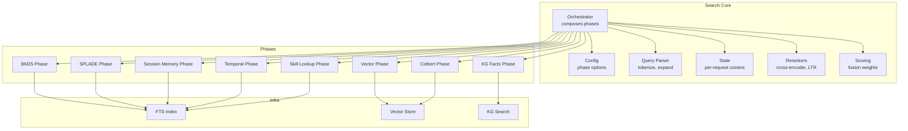
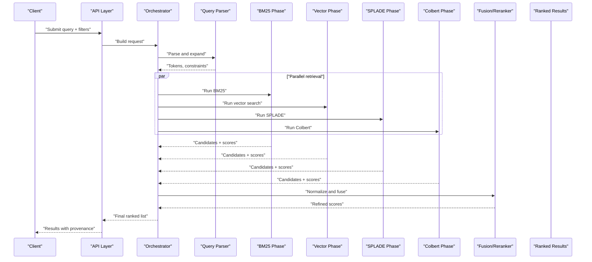
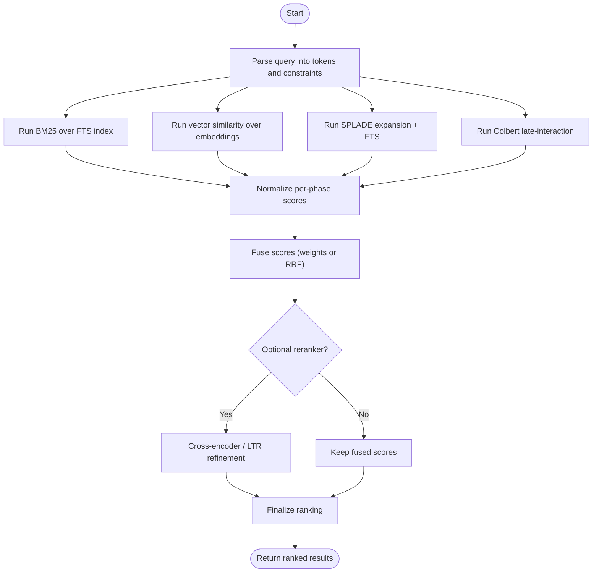
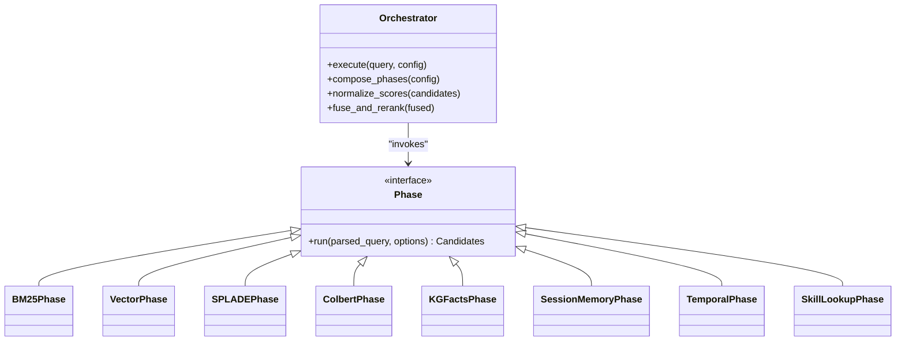
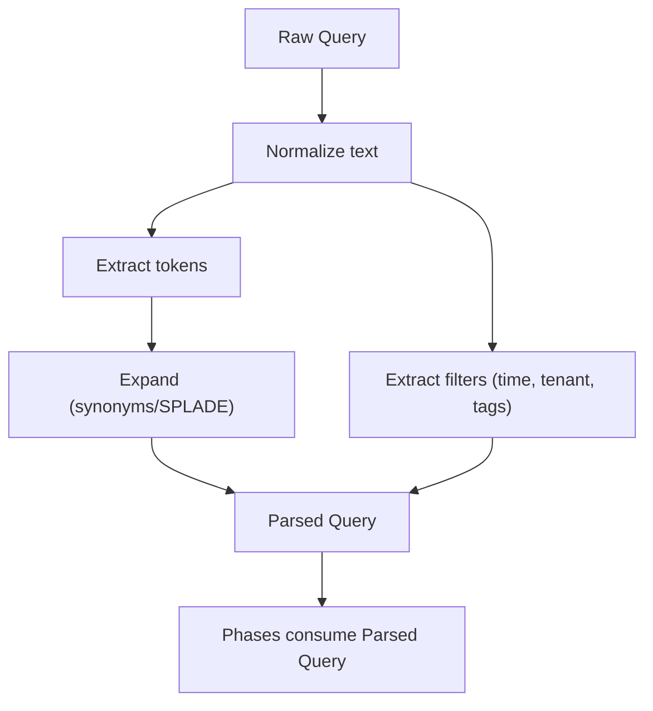
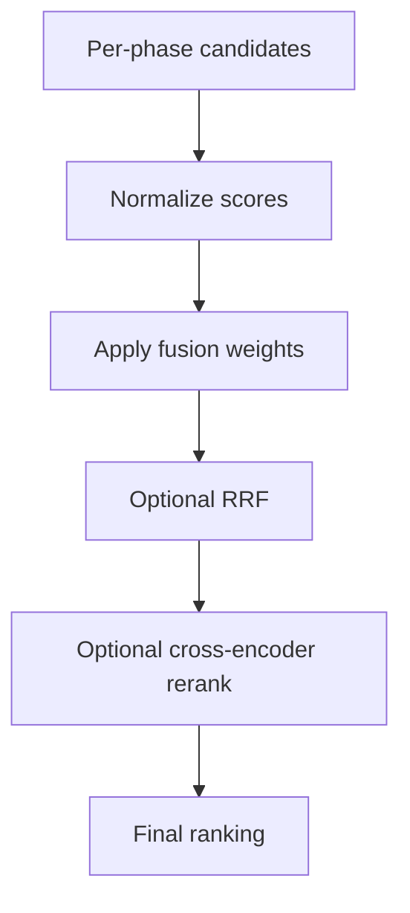
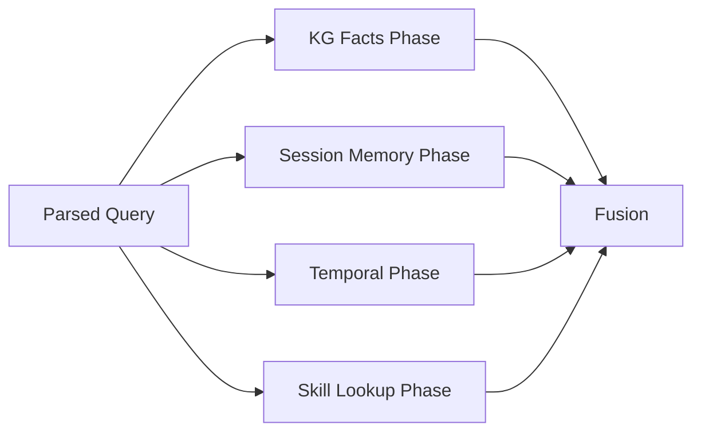
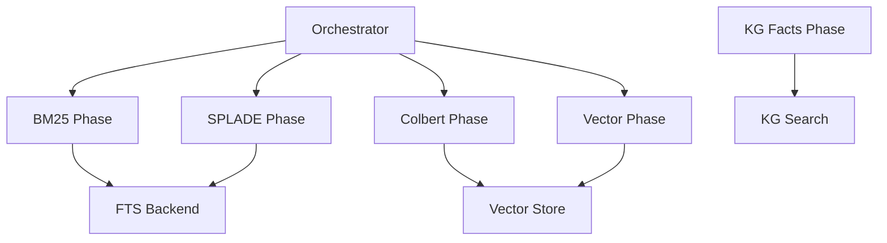

# Search Pipeline Overview

<cite>
**Referenced Files in This Document**
- [search/orchestrator.py](file://search/orchestrator.py)
- [search/config.py](file://search/config.py)
- [search/query_parser.py](file://search/query_parser.py)
- [search/phases/bm25_phase.py](file://search/phases/bm25_phase.py)
- [search/phases/vector_phase.py](file://search/phases/vector_phase.py)
- [search/phases/colbert_phase.py](file://search/phases/colbert_phase.py)
- [search/phases/splade_phase.py](file://search/phases/splade_phase.py)
- [search/phases/kg_facts_phase.py](file://search/phases/kg_facts_phase.py)
- [search/phases/session_memory_phase.py](file://search/phases/session_memory_phase.py)
- [search/phases/temporal_phase.py](file://search/phases/temporal_phase.py)
- [search/phases/skill_lookup_phase.py](file://search/phases/skill_lookup_phase.py)
- [search/rerankers.py](file://search/rerankers.py)
- [search/scoring.py](file://search/scoring.py)
- [search/state.py](file://search/state.py)
- [infra/fts.py](file://infra/fts.py)
- [infra/vector_store.py](file://infra/vector_store.py)
- [knowledge_graph/kg_search.py](file://knowledge_graph/kg_search.py)
- [recall/search_memory.py](file://recall/search_memory.py)
- [docs/concepts/search-pipeline.md](file://docs/concepts/search-pipeline.md)
- [docs/how-to/debug-search.md](file://docs/how-to/debug-search.md)
- [eval/run_eval_main_pipeline.py](file://eval/run_eval_main_pipeline.py)
- [eval/hybrid_strategy.py](file://eval/hybrid_strategy.py)
</cite>

## Table of Contents
1. [Introduction](#introduction)
2. [Project Structure](#project-structure)
3. [Core Components](#core-components)
4. [Architecture Overview](#architecture-overview)
5. [Detailed Component Analysis](#detailed-component-analysis)
6. [Dependency Analysis](#dependency-analysis)
7. [Performance Considerations](#performance-considerations)
8. [Troubleshooting Guide](#troubleshooting-guide)
9. [Conclusion](#conclusion)
10. [Appendices](#appendices)

## Introduction
This document explains the multi-phase search pipeline architecture, focusing on the hybrid approach that combines BM25 keyword matching with vector similarity search. It covers how phases are orchestrated, how results are fused and ranked, how queries are parsed, and how to configure and tune performance. Practical examples demonstrate query construction, phase customization, and result interpretation. The guide also includes optimization strategies, caching approaches, and debugging techniques for diagnosing pipeline issues.

## Project Structure
The search subsystem is organized around a central orchestrator that composes multiple retrieval phases (BM25, vector, SPLADE, Colbert, knowledge graph facts, session memory, temporal filters, skill lookup). Each phase returns candidate items with scores; an aggregation and reranking stage fuses these candidates into a final ordered list. Supporting modules provide configuration parsing, query parsing, scoring utilities, and state management.

**Diagram sources**
- [search/orchestrator.py](file://search/orchestrator.py)
- [search/phases/bm25_phase.py](file://search/phases/bm25_phase.py)
- [search/phases/vector_phase.py](file://search/phases/vector_phase.py)
- [search/phases/splade_phase.py](file://search/phases/splade_phase.py)
- [search/phases/colbert_phase.py](file://search/phases/colbert_phase.py)
- [search/phases/kg_facts_phase.py](file://search/phases/kg_facts_phase.py)
- [search/phases/session_memory_phase.py](file://search/phases/session_memory_phase.py)
- [search/phases/temporal_phase.py](file://search/phases/temporal_phase.py)
- [search/phases/skill_lookup_phase.py](file://search/phases/skill_lookup_phase.py)
- [infra/fts.py](file://infra/fts.py)
- [infra/vector_store.py](file://infra/vector_store.py)
- [knowledge_graph/kg_search.py](file://knowledge_graph/kg_search.py)

**Section sources**
- [search/orchestrator.py](file://search/orchestrator.py)
- [search/config.py](file://search/config.py)
- [search/query_parser.py](file://search/query_parser.py)
- [search/phases/bm25_phase.py](file://search/phases/bm25_phase.py)
- [search/phases/vector_phase.py](file://search/phases/vector_phase.py)
- [search/phases/splade_phase.py](file://search/phases/splade_phase.py)
- [search/phases/colbert_phase.py](file://search/phases/colbert_phase.py)
- [search/phases/kg_facts_phase.py](file://search/phases/kg_facts_phase.py)
- [search/phases/session_memory_phase.py](file://search/phases/session_memory_phase.py)
- [search/phases/temporal_phase.py](file://search/phases/temporal_phase.py)
- [search/phases/skill_lookup_phase.py](file://search/phases/skill_lookup_phase.py)
- [search/rerankers.py](file://search/rerankers.py)
- [search/scoring.py](file://search/scoring.py)
- [search/state.py](file://search/state.py)
- [infra/fts.py](file://infra/fts.py)
- [infra/vector_store.py](file://infra/vector_store.py)
- [knowledge_graph/kg_search.py](file://knowledge_graph/kg_search.py)

## Core Components
- Orchestrator: Builds the execution plan from configuration, runs phases, aggregates results, applies fusion and reranking, and returns the final ranking.
- Phases: Independent retrieval components that each produce scored candidates. Examples include BM25, vector similarity, SPLADE, Colbert, KG facts, session memory, temporal filtering, and skill lookup.
- Query Parser: Normalizes and expands user input into structured tokens and constraints consumed by phases.
- Fusion and Ranking: Combines per-phase scores using configurable weights and optional cross-encoder or learning-to-rank models.
- Configuration: Defines which phases run, their parameters, and fusion strategy.
- State: Holds per-request metadata such as tenant scope, time bounds, and cache keys.

Key responsibilities and interactions are implemented across the following files:
- Orchestration and composition: [search/orchestrator.py](file://search/orchestrator.py)
- Phase definitions: [search/phases/*.py](file://search/phases/bm25_phase.py), [search/phases/vector_phase.py](file://search/phases/vector_phase.py), [search/phases/splade_phase.py](file://search/phases/splade_phase.py), [search/phases/colbert_phase.py](file://search/phases/colbert_phase.py), [search/phases/kg_facts_phase.py](file://search/phases/kg_facts_phase.py), [search/phases/session_memory_phase.py](file://search/phases/session_memory_phase.py), [search/phases/temporal_phase.py](file://search/phases/temporal_phase.py), [search/phases/skill_lookup_phase.py](file://search/phases/skill_lookup_phase.py)
- Query parsing: [search/query_parser.py](file://search/query_parser.py)
- Fusion and reranking: [search/rerankers.py](file://search/rerankers.py), [search/scoring.py](file://search/scoring.py)
- Request state: [search/state.py](file://search/state.py)
- Infrastructure backends: [infra/fts.py](file://infra/fts.py), [infra/vector_store.py](file://infra/vector_store.py), [knowledge_graph/kg_search.py](file://knowledge_graph/kg_search.py)

**Section sources**
- [search/orchestrator.py](file://search/orchestrator.py)
- [search/phases/bm25_phase.py](file://search/phases/bm25_phase.py)
- [search/phases/vector_phase.py](file://search/phases/vector_phase.py)
- [search/phases/splade_phase.py](file://search/phases/splade_phase.py)
- [search/phases/colbert_phase.py](file://search/phases/colbert_phase.py)
- [search/phases/kg_facts_phase.py](file://search/phases/kg_facts_phase.py)
- [search/phases/session_memory_phase.py](file://search/phases/session_memory_phase.py)
- [search/phases/temporal_phase.py](file://search/phases/temporal_phase.py)
- [search/phases/skill_lookup_phase.py](file://search/phases/skill_lookup_phase.py)
- [search/query_parser.py](file://search/query_parser.py)
- [search/rerankers.py](file://search/rerankers.py)
- [search/scoring.py](file://search/scoring.py)
- [search/state.py](file://search/state.py)
- [infra/fts.py](file://infra/fts.py)
- [infra/vector_store.py](file://infra/vector_store.py)
- [knowledge_graph/kg_search.py](file://knowledge_graph/kg_search.py)

## Architecture Overview
The pipeline follows a modular, composable design:
- Input: A natural language query plus optional filters (time window, tenant, tags).
- Parsing: Tokens, synonyms, and constraints are extracted.
- Parallel Retrieval: Multiple phases execute concurrently where possible, leveraging FTS and vector indexes.
- Aggregation: Candidate IDs are unified; per-phase scores are normalized and combined.
- Reranking: Optional cross-encoder or LTR model refines order.
- Output: Ranked results with metadata and provenance (which phases contributed).

**Diagram sources**
- [search/orchestrator.py](file://search/orchestrator.py)
- [search/query_parser.py](file://search/query_parser.py)
- [search/phases/bm25_phase.py](file://search/phases/bm25_phase.py)
- [search/phases/vector_phase.py](file://search/phases/vector_phase.py)
- [search/phases/splade_phase.py](file://search/phases/splade_phase.py)
- [search/phases/colbert_phase.py](file://search/phases/colbert_phase.py)
- [search/rerankers.py](file://search/rerankers.py)
- [search/scoring.py](file://search/scoring.py)

## Detailed Component Analysis

### Hybrid Search Strategy: BM25 + Vector Similarity
- BM25 provides precise lexical recall for exact terms and phrases.
- Vector similarity captures semantic proximity and paraphrases.
- Fusion typically uses weighted sum or reciprocal rank fusion (RRF) to balance both signals.
- SPLADE can enhance BM25 by expanding terms via learned sparse representations.
- Colbert offers late-interaction dense retrieval for fine-grained relevance.

**Diagram sources**
- [search/phases/bm25_phase.py](file://search/phases/bm25_phase.py)
- [search/phases/vector_phase.py](file://search/phases/vector_phase.py)
- [search/phases/splade_phase.py](file://search/phases/splade_phase.py)
- [search/phases/colbert_phase.py](file://search/phases/colbert_phase.py)
- [search/scoring.py](file://search/scoring.py)
- [search/rerankers.py](file://search/rerankers.py)

**Section sources**
- [search/phases/bm25_phase.py](file://search/phases/bm25_phase.py)
- [search/phases/vector_phase.py](file://search/phases/vector_phase.py)
- [search/phases/splade_phase.py](file://search/phases/splade_phase.py)
- [search/phases/colbert_phase.py](file://search/phases/colbert_phase.py)
- [search/scoring.py](file://search/scoring.py)
- [search/rerankers.py](file://search/rerankers.py)

### Orchestration and Phase Composition
- The orchestrator reads configuration to determine active phases, their parameters, and fusion strategy.
- It constructs a dependency graph and executes independent phases concurrently.
- It normalizes scores across phases and applies fusion rules before optional reranking.
- It attaches provenance metadata indicating which phases contributed to each result.

**Diagram sources**
- [search/orchestrator.py](file://search/orchestrator.py)
- [search/phases/bm25_phase.py](file://search/phases/bm25_phase.py)
- [search/phases/vector_phase.py](file://search/phases/vector_phase.py)
- [search/phases/splade_phase.py](file://search/phases/splade_phase.py)
- [search/phases/colbert_phase.py](file://search/phases/colbert_phase.py)
- [search/phases/kg_facts_phase.py](file://search/phases/kg_facts_phase.py)
- [search/phases/session_memory_phase.py](file://search/phases/session_memory_phase.py)
- [search/phases/temporal_phase.py](file://search/phases/temporal_phase.py)
- [search/phases/skill_lookup_phase.py](file://search/phases/skill_lookup_phase.py)

**Section sources**
- [search/orchestrator.py](file://search/orchestrator.py)

### Query Parsing and Constraints
- Tokenization and normalization: lowercasing, stemming/lemmatization, punctuation handling.
- Synonym and query expansion: leveraging SPLADE or dictionary-based expansions.
- Constraint extraction: time windows, tenant scoping, tags, and entity filters.
- Output: Structured representation consumed by all phases.

**Diagram sources**
- [search/query_parser.py](file://search/query_parser.py)

**Section sources**
- [search/query_parser.py](file://search/query_parser.py)

### Fusion Strategies and Ranking Algorithms
- Score normalization: min-max or z-score per phase to make scores comparable.
- Fusion methods:
  - Weighted sum: configurable weights per phase.
  - Reciprocal Rank Fusion (RRF): robust to score calibration differences.
- Reranking:
  - Cross-encoder models for pairwise or listwise refinement.
  - Learning-to-rank features combining lexical, semantic, and temporal signals.

**Diagram sources**
- [search/scoring.py](file://search/scoring.py)
- [search/rerankers.py](file://search/rerankers.py)

**Section sources**
- [search/scoring.py](file://search/scoring.py)
- [search/rerankers.py](file://search/rerankers.py)

### Knowledge Graph and Session-Aware Retrieval
- KG facts phase retrieves relevant entities and relations to boost contextual recall.
- Session memory phase prioritizes recent or salient memories within the current session.
- Temporal phase enforces time-window constraints and decay priors.
- Skill lookup phase matches skills/tools to improve task-oriented retrieval.

**Diagram sources**
- [search/phases/kg_facts_phase.py](file://search/phases/kg_facts_phase.py)
- [search/phases/session_memory_phase.py](file://search/phases/session_memory_phase.py)
- [search/phases/temporal_phase.py](file://search/phases/temporal_phase.py)
- [search/phases/skill_lookup_phase.py](file://search/phases/skill_lookup_phase.py)
- [knowledge_graph/kg_search.py](file://knowledge_graph/kg_search.py)

**Section sources**
- [search/phases/kg_facts_phase.py](file://search/phases/kg_facts_phase.py)
- [search/phases/session_memory_phase.py](file://search/phases/session_memory_phase.py)
- [search/phases/temporal_phase.py](file://search/phases/temporal_phase.py)
- [search/phases/skill_lookup_phase.py](file://search/phases/skill_lookup_phase.py)
- [knowledge_graph/kg_search.py](file://knowledge_graph/kg_search.py)

### Practical Examples

#### Constructing a Hybrid Search Query
- Use natural language with explicit filters when needed (e.g., time range, tags).
- Enable BM25 and vector phases by default; add SPLADE for term expansion if recall is low.
- Optionally enable Colbert for high-precision late interaction on top candidates.

Example references:
- Conceptual overview and usage patterns: [docs/concepts/search-pipeline.md](file://docs/concepts/search-pipeline.md)
- Evaluation harness showing main pipeline invocation: [eval/run_eval_main_pipeline.py](file://eval/run_eval_main_pipeline.py)
- Hybrid strategy tuning example: [eval/hybrid_strategy.py](file://eval/hybrid_strategy.py)

#### Customizing Phases
- Adjust phase weights in configuration to emphasize BM25 vs vector depending on domain vocabulary density.
- Toggle SPLADE for synonym-heavy domains; disable Colbert for latency-sensitive paths.
- Enable KG facts and session memory for conversational or tool-assisted workflows.

Configuration entry points:
- [search/config.py](file://search/config.py)
- [search/orchestrator.py](file://search/orchestrator.py)

#### Interpreting Results
- Provenance metadata indicates which phases contributed to each result.
- High BM25 scores imply strong lexical match; high vector scores imply semantic relevance.
- Reranked results reflect deeper semantic alignment when rerankers are enabled.

Relevant implementation:
- [search/orchestrator.py](file://search/orchestrator.py)
- [search/rerankers.py](file://search/rerankers.py)

**Section sources**
- [docs/concepts/search-pipeline.md](file://docs/concepts/search-pipeline.md)
- [eval/run_eval_main_pipeline.py](file://eval/run_eval_main_pipeline.py)
- [eval/hybrid_strategy.py](file://eval/hybrid_strategy.py)
- [search/config.py](file://search/config.py)
- [search/orchestrator.py](file://search/orchestrator.py)
- [search/rerankers.py](file://search/rerankers.py)

## Dependency Analysis
The search pipeline depends on infrastructure services for indexing and storage:
- Full-text search via FTS backend.
- Vector similarity via vector store.
- Knowledge graph search for fact-based retrieval.

**Diagram sources**
- [search/orchestrator.py](file://search/orchestrator.py)
- [search/phases/bm25_phase.py](file://search/phases/bm25_phase.py)
- [search/phases/splade_phase.py](file://search/phases/splade_phase.py)
- [search/phases/colbert_phase.py](file://search/phases/colbert_phase.py)
- [search/phases/vector_phase.py](file://search/phases/vector_phase.py)
- [search/phases/kg_facts_phase.py](file://search/phases/kg_facts_phase.py)
- [infra/fts.py](file://infra/fts.py)
- [infra/vector_store.py](file://infra/vector_store.py)
- [knowledge_graph/kg_search.py](file://knowledge_graph/kg_search.py)

**Section sources**
- [infra/fts.py](file://infra/fts.py)
- [infra/vector_store.py](file://infra/vector_store.py)
- [knowledge_graph/kg_search.py](file://knowledge_graph/kg_search.py)

## Performance Considerations
- Phase selection: Disable expensive phases (Colbert, rerankers) for low-latency paths; enable selectively for precision-critical queries.
- Batch operations: Prefer batched vector searches and FTS queries to reduce overhead.
- Caching:
  - Cache parsed queries and SPLADE expansions.
  - Cache frequent vector embeddings and shortlist candidates.
  - Use query fingerprinting keyed by tenant and filters.
- Index tuning:
  - Ensure FTS tokenization aligns with domain terminology.
  - Maintain embedding freshness and dimensionality appropriate for workload.
- Concurrency:
  - Execute independent phases in parallel.
  - Apply timeouts and circuit breakers for slow backends.
- Fusion stability:
  - Normalize scores consistently to avoid dominance by one phase.
  - Use RRF when score distributions vary widely across phases.

[No sources needed since this section provides general guidance]

## Troubleshooting Guide
Common issues and diagnostics:
- No results returned:
  - Verify FTS index health and coverage.
  - Check query parser output for over-constrained filters.
  - Inspect phase logs for empty candidate sets.
- Poor precision:
  - Increase BM25 weight or enable SPLADE for better lexical recall.
  - Enable rerankers for semantic refinement.
- High latency:
  - Disable Colbert or rerankers temporarily.
  - Reduce candidate set sizes and limit reranking depth.
- Inconsistent rankings:
  - Confirm score normalization and fusion weights.
  - Validate deterministic behavior under same inputs.

Useful resources:
- Debugging guide: [docs/how-to/debug-search.md](file://docs/how-to/debug-search.md)
- Integration tests for search pipeline behavior: [recall/search_memory.py](file://recall/search_memory.py)

**Section sources**
- [docs/how-to/debug-search.md](file://docs/how-to/debug-search.md)
- [recall/search_memory.py](file://recall/search_memory.py)

## Conclusion
The multi-phase search pipeline delivers robust hybrid retrieval by combining BM25, vector similarity, SPLADE, and Colbert, augmented by KG facts, session memory, temporal constraints, and skill lookup. The orchestrator composes these phases, normalizes and fuses scores, and optionally reranks results. With careful configuration, caching, and monitoring, the system balances recall, precision, and latency across diverse use cases.

[No sources needed since this section summarizes without analyzing specific files]

## Appendices

### Configuration Options Summary
- Phase toggles and parameters: [search/config.py](file://search/config.py)
- Fusion weights and reranker settings: [search/scoring.py](file://search/scoring.py), [search/rerankers.py](file://search/rerankers.py)
- Per-request state and scoping: [search/state.py](file://search/state.py)

**Section sources**
- [search/config.py](file://search/config.py)
- [search/scoring.py](file://search/scoring.py)
- [search/rerankers.py](file://search/rerankers.py)
- [search/state.py](file://search/state.py)