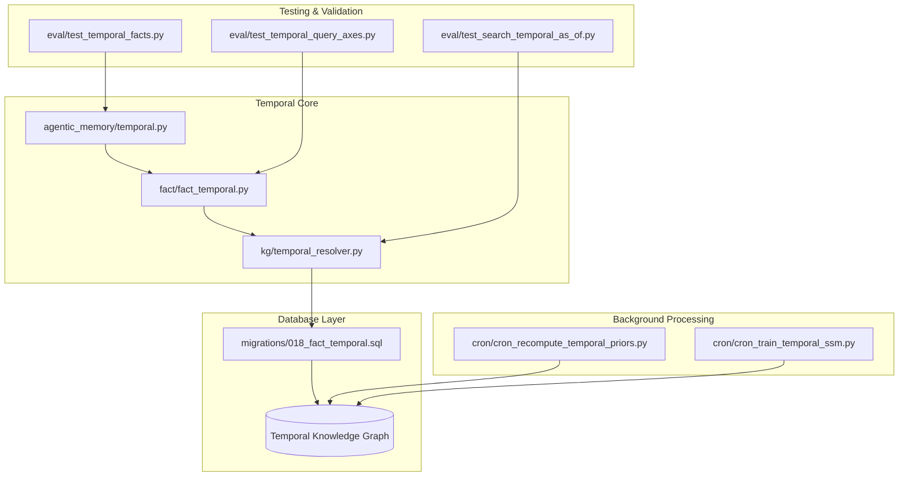
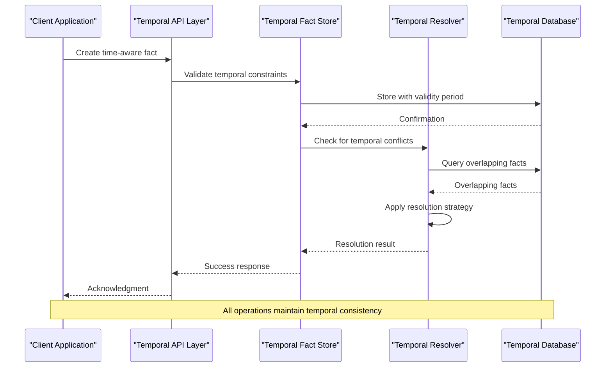
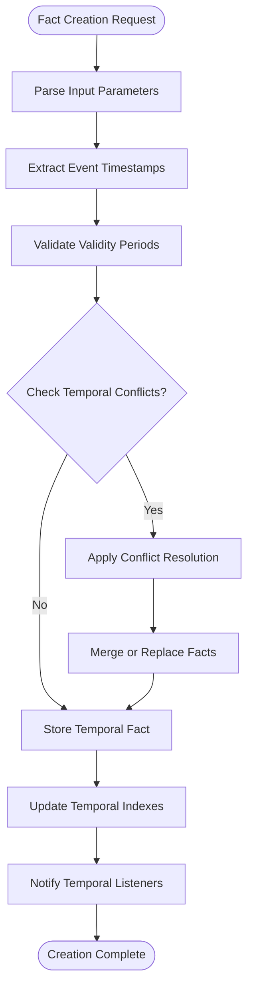
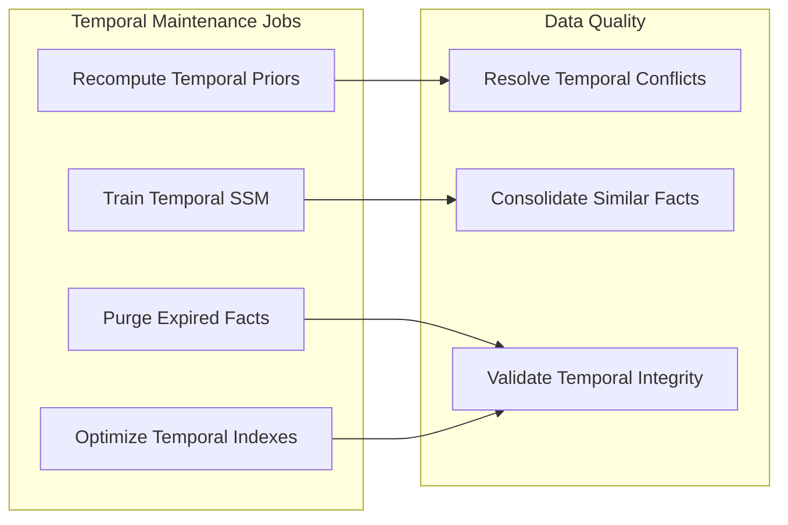
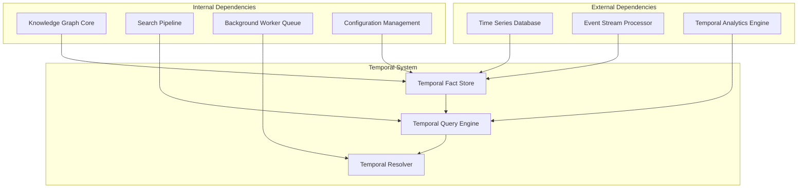

# Temporal Reasoning

<cite>
**Referenced Files in This Document**
- [agentic_memory/temporal.py](file://agentic_memory/temporal.py)
- [fact/fact_temporal.py](file://fact/fact_temporal.py)
- [kg/temporal_resolver.py](file://kg/temporal_resolver.py)
- [migrations/018_fact_temporal.sql](file://migrations/018_fact_temporal.sql)
- [cron/cron_recompute_temporal_priors.py](file://cron/cron_recompute_temporal_priors.py)
- [cron/cron_train_temporal_ssm.py](file://cron/cron_train_temporal_ssm.py)
- [eval/test_temporal_facts.py](file://eval/test_temporal_facts.py)
- [eval/test_temporal_query_axes.py](file://eval/test_temporal_query_axes.py)
- [eval/test_search_temporal_as_of.py](file://eval/test_search_temporal_as_of.py)
</cite>

## Table of Contents
1. [Introduction](#introduction)
2. [Project Structure](#project-structure)
3. [Core Components](#core-components)
4. [Architecture Overview](#architecture-overview)
5. [Detailed Component Analysis](#detailed-component-analysis)
6. [Dependency Analysis](#dependency-analysis)
7. [Performance Considerations](#performance-considerations)
8. [Troubleshooting Guide](#troubleshooting-guide)
9. [Conclusion](#conclusion)
10. [Appendices](#appendices)

## Introduction

Temporal reasoning in Agentic Memory represents a sophisticated approach to handling time-aware knowledge and facts within intelligent agent systems. This capability enables agents to understand, store, query, and reason about information that changes over time, maintaining accurate historical context while supporting forward-looking predictions and state reconstruction.

The temporal reasoning system addresses several critical challenges:
- **Time-Aware Fact Representation**: Storing facts with explicit validity periods and event timestamps
- **Temporal Query Operations**: Supporting complex time-based filtering and historical state queries
- **Fact Evolution Tracking**: Maintaining complete history of how knowledge changes over time
- **Temporal Relationship Analysis**: Understanding causal relationships and dependencies across time
- **Historical State Reconstruction**: Rebuilding system state at any point in time for analysis and debugging

This comprehensive system integrates seamlessly with the existing knowledge graph infrastructure while providing powerful temporal reasoning capabilities essential for long-running autonomous agents.

## Project Structure

The temporal reasoning system is distributed across multiple modules, each responsible for specific aspects of time-aware knowledge management:

**Diagram sources**
- [agentic_memory/temporal.py](file://agentic_memory/temporal.py)
- [fact/fact_temporal.py](file://fact/fact_temporal.py)
- [kg/temporal_resolver.py](file://kg/temporal_resolver.py)
- [migrations/018_fact_temporal.sql](file://migrations/018_fact_temporal.sql)

**Section sources**
- [agentic_memory/temporal.py](file://agentic_memory/temporal.py)
- [fact/fact_temporal.py](file://fact/fact_temporal.py)
- [kg/temporal_resolver.py](file://kg/temporal_resolver.py)

## Core Components

### Temporal Fact Model

The foundation of temporal reasoning lies in the enhanced fact model that extends traditional knowledge representation with time-awareness. Each fact now includes:

- **Validity Periods**: Explicit start and end times defining when a fact is true
- **Event Timestamps**: Precise timing information for when facts were observed or created
- **Temporal Confidence Scores**: Time-decayed confidence values reflecting staleness
- **Evolution History**: Complete audit trail of fact modifications over time

### Temporal Query Engine

The query engine supports sophisticated temporal operations including:
- **As-of Queries**: Retrieving facts valid at specific points in time
- **Range Queries**: Finding facts within temporal boundaries
- **Temporal Joins**: Combining facts across different time periods
- **Trend Analysis**: Identifying patterns and changes over time

### Temporal Resolution System

A dedicated resolver handles conflicts between temporally overlapping facts, applying sophisticated conflict resolution strategies based on recency, confidence scores, and domain-specific rules.

**Section sources**
- [fact/fact_temporal.py](file://fact/fact_temporal.py)
- [kg/temporal_resolver.py](file://kg/temporal_resolver.py)

## Architecture Overview

The temporal reasoning architecture follows a layered approach, integrating seamlessly with existing memory systems while providing powerful time-aware capabilities:

**Diagram sources**
- [agentic_memory/temporal.py](file://agentic_memory/temporal.py)
- [fact/fact_temporal.py](file://fact/fact_temporal.py)
- [kg/temporal_resolver.py](file://kg/temporal_resolver.py)

The architecture ensures:
- **Temporal Consistency**: All operations maintain logical time ordering
- **Conflict Resolution**: Automatic handling of contradictory temporal facts
- **Performance Optimization**: Efficient indexing and querying of temporal data
- **Scalability**: Support for large-scale temporal knowledge graphs

## Detailed Component Analysis

### Temporal Fact Creation and Storage

The temporal fact creation process involves several sophisticated steps to ensure data integrity and temporal consistency:

**Diagram sources**
- [fact/fact_temporal.py](file://fact/fact_temporal.py)
- [kg/temporal_resolver.py](file://kg/temporal_resolver.py)

Key features include automatic timestamp extraction, validity period validation, and conflict detection during fact insertion.

### Temporal Query Operations

The temporal query system supports a rich set of operations for time-based data retrieval:

#### As-of Queries
Retrieve the state of knowledge at any specific point in time, enabling historical analysis and debugging scenarios.

#### Range Queries
Find facts that were valid within specified time ranges, supporting trend analysis and pattern recognition.

#### Temporal Joins
Combine facts from different time periods to understand evolution and causality.

#### Historical Reconstruction
Rebuild complete knowledge states at arbitrary points in time for comprehensive analysis.

**Section sources**
- [eval/test_temporal_query_axes.py](file://eval/test_temporal_query_axes.py)
- [eval/test_search_temporal_as_of.py](file://eval/test_search_temporal_as_of.py)

### Temporal Index Optimization

The system implements specialized indexing strategies for efficient temporal queries:

- **Time-Series Indexes**: Optimized for range queries and time-based filtering
- **Validity Period Indexes**: Accelerate as-of queries and temporal joins
- **Composite Indexes**: Combine temporal and semantic dimensions for hybrid queries
- **Materialized Views**: Pre-compute common temporal aggregations

### Background Processing and Maintenance

Several background processes ensure temporal data quality and performance:

**Diagram sources**
- [cron/cron_recompute_temporal_priors.py](file://cron/cron_recompute_temporal_priors.py)
- [cron/cron_train_temporal_ssm.py](file://cron/cron_train_temporal_ssm.py)

**Section sources**
- [cron/cron_recompute_temporal_priors.py](file://cron/cron_recompute_temporal_priors.py)
- [cron/cron_train_temporal_ssm.py](file://cron/cron_train_temporal_ssm.py)

## Dependency Analysis

The temporal reasoning system has well-defined dependencies and integration points:

**Diagram sources**
- [agentic_memory/temporal.py](file://agentic_memory/temporal.py)
- [fact/fact_temporal.py](file://fact/fact_temporal.py)

**Section sources**
- [agentic_memory/temporal.py](file://agentic_memory/temporal.py)
- [fact/fact_temporal.py](file://fact/fact_temporal.py)

## Performance Considerations

### Temporal Data Volume Management

Large-scale temporal datasets require careful management strategies:

- **Partitioning by Time**: Organize data into time-based partitions for efficient querying
- **Compression Strategies**: Apply temporal compression techniques to reduce storage overhead
- **Caching Policies**: Implement smart caching for frequently accessed temporal queries
- **Index Maintenance**: Regular optimization of temporal indexes for sustained performance

### Query Performance Optimization

The system employs several techniques to optimize temporal query performance:

- **Pre-computed Aggregates**: Cache common temporal aggregations and summaries
- **Lazy Loading**: Load temporal data on-demand to minimize memory usage
- **Parallel Processing**: Distribute temporal computations across multiple workers
- **Query Rewriting**: Optimize temporal query execution plans automatically

### Memory Management

Efficient memory management is crucial for temporal reasoning:

- **Streaming Processing**: Process temporal data in streams rather than loading entire datasets
- **Memory-Mapped Files**: Use memory-mapped files for large temporal datasets
- **Garbage Collection**: Implement temporal-aware garbage collection policies
- **Resource Limits**: Enforce memory limits for temporal operations

## Troubleshooting Guide

### Common Temporal Issues

#### Temporal Inconsistencies
When temporal inconsistencies occur, the system provides detailed diagnostics:

- **Conflict Detection**: Automated identification of contradictory temporal facts
- **Resolution Logging**: Comprehensive logging of conflict resolution decisions
- **Audit Trail**: Complete history of temporal modifications for debugging

#### Performance Degradation
Monitor temporal query performance using built-in metrics:

- **Query Latency Tracking**: Monitor temporal query execution times
- **Index Health Checks**: Verify temporal index integrity and performance
- **Resource Utilization**: Track memory and CPU usage for temporal operations

#### Data Integrity Problems
Ensure temporal data integrity through automated validation:

- **Temporal Consistency Checks**: Validate logical time ordering of events
- **Completeness Verification**: Ensure no gaps in temporal coverage
- **Cross-Reference Validation**: Verify relationships between temporal facts

**Section sources**
- [eval/test_temporal_facts.py](file://eval/test_temporal_facts.py)

## Conclusion

The temporal reasoning capabilities in Agentic Memory provide a robust foundation for building intelligent agents that can understand and operate effectively in dynamic environments. By combining sophisticated time-aware data structures, efficient query mechanisms, and automated maintenance processes, the system enables agents to maintain accurate historical context while supporting forward-looking decision making.

Key benefits include:
- **Enhanced Context Awareness**: Agents can understand how situations evolve over time
- **Improved Decision Making**: Historical patterns inform future actions
- **Better Debugging**: Complete temporal audit trails facilitate troubleshooting
- **Scalable Performance**: Optimized temporal operations support large-scale deployments

The modular architecture ensures easy integration with existing systems while providing extensibility for future temporal reasoning enhancements.

## Appendices

### Practical Examples

#### Creating Time-Aware Facts
Demonstrate creating facts with explicit validity periods and event timestamps.

#### Performing Temporal Queries
Show examples of as-of queries, range queries, and temporal joins.

#### Analyzing Temporal Patterns
Illustrate trend analysis and temporal relationship discovery.

### Configuration Options

#### Temporal Settings
Configure temporal behavior including retention policies and resolution strategies.

#### Performance Tuning
Adjust temporal query performance parameters and resource allocation.

### Migration Guide

#### Upgrading to Temporal Features
Step-by-step guide for migrating existing knowledge graphs to support temporal reasoning.

#### Data Backfill Procedures
Procedures for backfilling temporal metadata into existing fact databases.