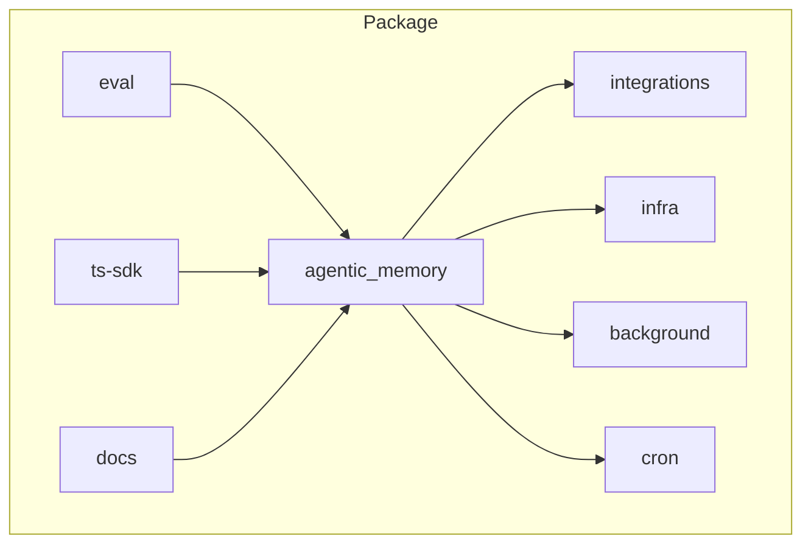
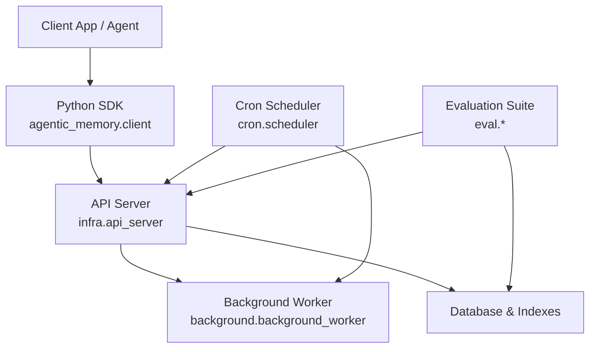
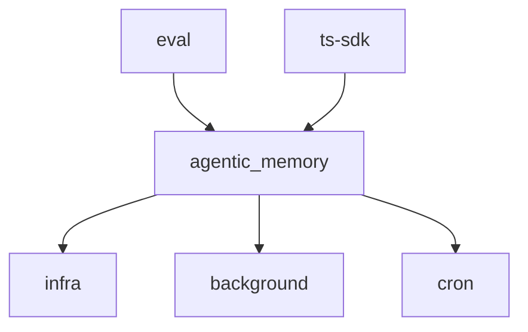

# Development Guide

<cite>
**Referenced Files in This Document**
- [README.md](file://README.md)
- [CONTRIBUTING.md](file://CONTRIBUTING.md)
- [Makefile](file://Makefile)
- [pyproject.toml](file://pyproject.toml)
- [setup.py](file://setup.py)
- [requirements.txt](file://requirements.txt)
- [docker-compose.yml](file://docker-compose.yml)
- [Dockerfile](file://Dockerfile)
- [.pre-commit-config.yaml](file://.pre-commit-config.yaml)
- [ruff.toml](file://ruff.toml)
- [mkdocs.yml](file://mkdocs.yml)
- [scripts/start_services.sh](file://scripts/start_services.sh)
- [scripts/perf_regression_check.py](file://scripts/perf_regression_check.py)
- [eval/run_full_suite.py](file://eval/run_full_suite.py)
- [eval/conftest.py](file://eval/conftest.py)
- [infra/api_server.py](file://infra/api_server.py)
- [cron/scheduler.py](file://cron/scheduler.py)
- [background/background_worker.py](file://background/background_worker.py)
- [agentic_memory/__init__.py](file://agentic_memory/__init__.py)
- [agentic_memory/client.py](file://agentic_memory/client.py)
- [agentic_memory/agent.py](file://agentic_memory/agent.py)
- [agentic_memory/models.py](file://agentic_memory/models.py)
- [agentic_memory/utils.py](file://agentic_memory/utils.py)
- [agentic_memory/admin.py](file://agentic_memory/admin.py)
- [agentic_memory/maintenance.py](file://agentic_memory/maintenance.py)
- [agentic_memory/temporal.py](file://agentic_memory/temporal.py)
- [agentic_memory/sync.py](file://agentic_memory/sync.py)
- [agentic_memory/kg.py](file://agentic_memory/kg.py)
- [agentic_memory/exceptions.py](file://agentic_memory/exceptions.py)
- [agentic_memory/integrations/langchain/__init__.py](file://agentic_memory/integrations/langchain/__init__.py)
- [agentic_memory/integrations/crewai/__init__.py](file://agentic_memory/integrations/crewai/__init__.py)
- [examples/basic_save_search.py](file://examples/basic_save_search.py)
- [examples/streaming_ingest.py](file://examples/streaming_ingest.py)
- [examples/agent_memory.py](file://examples/agent_memory.py)
- [examples/langchain_agent.py](file://examples/langchain_agent.py)
- [examples/crewai_crew.py](file://examples/crewai_crew.py)
- [docs/guides/quick-start.md](file://docs/guides/quick-start.md)
- [docs/how-to/build-docs-site.md](file://docs/how-to/build-docs-site.md)
- [docs/reference/configuration.md](file://docs/reference/configuration.md)
- [docs/architecture/overview.md](file://docs/architecture/overview.md)
- [docs/benchmarks/README.md](file://docs/benchmarks/README.md)
- [paper_pipeline/README.md](file://paper_pipeline/README.md)
- [ts-sdk/package.json](file://ts-sdk/package.json)
- [ts-sdk/jest.config.js](file://ts-sdk/jest.config.js)
</cite>

## Table of Contents
1. [Introduction](#introduction)
2. [Project Structure](#project-structure)
3. [Core Components](#core-components)
4. [Architecture Overview](#architecture-overview)
5. [Detailed Component Analysis](#detailed-component-analysis)
6. [Dependency Analysis](#dependency-analysis)
7. [Performance Considerations](#performance-considerations)
8. [Troubleshooting Guide](#troubleshooting-guide)
9. [Conclusion](#conclusion)
10. [Appendices](#appendices)

## Introduction
This Development Guide explains how to set up the Agentic Memory development environment, run tests and benchmarks, follow coding standards, generate documentation, and participate in reviews and releases. It also covers continuous integration workflows, debugging techniques, evaluation suites, and best practices for adding features while maintaining backward compatibility.

## Project Structure
Agentic Memory is a Python package with multiple subsystems:
- Core library under agentic_memory (public API, client, agent wiring, models, utilities)
- Integrations for LangChain and CrewAI
- Background workers, cron scheduler, and infrastructure services
- Evaluation suite and benchmarks under eval
- Documentation site under docs
- TypeScript SDK under ts-sdk
- Docker and deployment assets

**Section sources**
- [README.md](file://README.md)
- [docs/architecture/overview.md](file://docs/architecture/overview.md)

## Core Components
- Public API surface: agentic_memory exposes client, agent, models, and utilities for memory operations.
- Integrations: LangChain and CrewAI adapters enable embedding into existing agent frameworks.
- Infrastructure: API server, background worker, cron scheduler, database migrations, and persistence layers.
- Evaluation: Comprehensive test harnesses, golden datasets, and benchmark scripts.

Key entry points:
- Client usage and agent setup are demonstrated in examples and guides.
- The API server and background processes are orchestrated via scripts and configuration.

**Section sources**
- [agentic_memory/__init__.py](file://agentic_memory/__init__.py)
- [agentic_memory/client.py](file://agentic_memory/client.py)
- [agentic_memory/agent.py](file://agentic_memory/agent.py)
- [agentic_memory/models.py](file://agentic_memory/models.py)
- [agentic_memory/utils.py](file://agentic_memory/utils.py)
- [agentic_memory/integrations/langchain/__init__.py](file://agentic_memory/integrations/langchain/__init__.py)
- [agentic_memory/integrations/crewai/__init__.py](file://agentic_memory/integrations/crewai/__init__.py)
- [examples/basic_save_search.py](file://examples/basic_save_search.py)
- [examples/streaming_ingest.py](file://examples/streaming_ingest.py)
- [examples/agent_memory.py](file://examples/agent_memory.py)
- [examples/langchain_agent.py](file://examples/langchain_agent.py)
- [examples/crewai_crew.py](file://examples/crewai_crew.py)

## Architecture Overview
The system comprises an API layer, background processing, scheduled tasks, and persistent storage. Clients interact through the Python SDK or integrations; background workers handle long-running jobs; cron jobs orchestrate maintenance and analytics.

**Diagram sources**
- [infra/api_server.py](file://infra/api_server.py)
- [background/background_worker.py](file://background/background_worker.py)
- [cron/scheduler.py](file://cron/scheduler.py)
- [agentic_memory/client.py](file://agentic_memory/client.py)

## Detailed Component Analysis

### Build System and Environment Setup
- Python packaging uses pyproject.toml and setup.py for distribution metadata.
- Dependencies are managed via requirements.txt and optional extras.
- Pre-commit hooks enforce linting and formatting using ruff and other tools.
- Docker assets provide containerized builds and runtime environments.

Recommended steps:
- Install dependencies from requirements.txt or use the provided Make targets.
- Configure pre-commit hooks to ensure code quality on commit.
- Use Docker Compose to spin up local services for end-to-end testing.

**Section sources**
- [pyproject.toml](file://pyproject.toml)
- [setup.py](file://setup.py)
- [requirements.txt](file://requirements.txt)
- [.pre-commit-config.yaml](file://.pre-commit-config.yaml)
- [ruff.toml](file://ruff.toml)
- [Dockerfile](file://Dockerfile)
- [docker-compose.yml](file://docker-compose.yml)

### Testing Framework Usage
- Tests are organized under eval with pytest fixtures and conftest configurations.
- Golden datasets and regression suites support stable evaluation over time.
- Benchmark scripts measure performance across retrieval and save paths.

To run tests:
- Use pytest directly against eval/test_*.py files or invoke the full suite runner.
- Leverage fixtures defined in eval/conftest.py for consistent setup.

**Section sources**
- [eval/run_full_suite.py](file://eval/run_full_suite.py)
- [eval/conftest.py](file://eval/conftest.py)
- [scripts/perf_regression_check.py](file://scripts/perf_regression_check.py)

### Code Organization Principles
- Feature-based modules: Each subsystem (search, save, kg, fact, recall) encapsulates related logic.
- Clear separation between public API (agentic_memory), internal infrastructure (infra), and background/cron services.
- Examples demonstrate idiomatic usage patterns for clients and integrations.

Best practices:
- Keep public APIs stable and versioned; deprecate gradually.
- Isolate side effects behind interfaces to facilitate testing.
- Use configuration-driven behavior for environment-specific settings.

**Section sources**
- [agentic_memory/__init__.py](file://agentic_memory/__init__.py)
- [agentic_memory/client.py](file://agentic_memory/client.py)
- [agentic_memory/agent.py](file://agentic_memory/agent.py)
- [agentic_memory/models.py](file://agentic_memory/models.py)
- [agentic_memory/utils.py](file://agentic_memory/utils.py)
- [agentic_memory/integrations/langchain/__init__.py](file://agentic_memory/integrations/langchain/__init__.py)
- [agentic_memory/integrations/crewai/__init__.py](file://agentic_memory/integrations/crewai/__init__.py)

### Build, Release, and Continuous Integration
- Makefile centralizes common commands for building, testing, and releasing.
- Docker images are built with the provided Dockerfile; compose orchestrates multi-service setups.
- CI workflows typically trigger on pull requests and tags; verify linting, tests, and benchmarks.

Release process:
- Validate all tests and benchmarks pass locally.
- Update versioning and changelog entries.
- Build and publish artifacts via standard packaging tools.

**Section sources**
- [Makefile](file://Makefile)
- [Dockerfile](file://Dockerfile)
- [docker-compose.yml](file://docker-compose.yml)

### Coding Standards and Documentation Generation
- Linting and formatting enforced by ruff and pre-commit hooks.
- Documentation site generated via MkDocs; reference docs include configuration and schema.
- Guides and architecture docs explain concepts and usage patterns.

To build docs:
- Follow the guide under docs/how-to/build-docs-site.md.
- Ensure markdown references and links are valid before committing.

**Section sources**
- [ruff.toml](file://ruff.toml)
- [.pre-commit-config.yaml](file://.pre-commit-config.yaml)
- [mkdocs.yml](file://mkdocs.yml)
- [docs/how-to/build-docs-site.md](file://docs/how-to/build-docs-site.md)
- [docs/reference/configuration.md](file://docs/reference/configuration.md)

### Debugging Techniques
- Start local services using scripts/start_services.sh for interactive debugging.
- Use logging and metrics exposed by infra components to trace issues.
- Evaluate specific test cases with pytest -v and leverage fixtures for isolation.

Common pitfalls:
- Misconfigured environment variables can break API endpoints or background workers.
- Database migration mismatches cause startup failures; ensure migrations are applied.

**Section sources**
- [scripts/start_services.sh](file://scripts/start_services.sh)
- [infra/api_server.py](file://infra/api_server.py)
- [background/background_worker.py](file://background/background_worker.py)
- [cron/scheduler.py](file://cron/scheduler.py)

### Practical Examples: Writing Tests, Adding Features, Backward Compatibility
- Write tests under eval with clear fixtures and assertions; use golden datasets for regression checks.
- Add new features within appropriate subsystems; expose via stable public APIs when needed.
- Maintain backward compatibility by avoiding breaking changes; introduce deprecation warnings and migration paths.

Example references:
- Basic save/search usage demonstrates client interactions.
- Streaming ingest shows advanced ingestion patterns.
- Integration examples illustrate LangChain and CrewAI usage.

**Section sources**
- [eval/conftest.py](file://eval/conftest.py)
- [eval/run_full_suite.py](file://eval/run_full_suite.py)
- [examples/basic_save_search.py](file://examples/basic_save_search.py)
- [examples/streaming_ingest.py](file://examples/streaming_ingest.py)
- [examples/langchain_agent.py](file://examples/langchain_agent.py)
- [examples/crewai_crew.py](file://examples/crewai_crew.py)

### Review Process, Issue Reporting, and Community Guidelines
- Follow CONTRIBUTING.md for contribution workflow, PR templates, and review expectations.
- Use GitHub issue templates to report bugs and feature requests consistently.
- Adhere to security and compliance policies outlined in SECURITY.md and docs/compliance.

**Section sources**
- [CONTRIBUTING.md](file://CONTRIBUTING.md)
- [SECURITY.md](file://SECURITY.md)

### Evaluation Suite, Benchmarking, and Performance Regression Testing
- The evaluation suite includes comprehensive tests, golden sets, and benchmark runners.
- Performance regression checks automate comparisons against baselines.
- Paper pipeline documents experimental evaluations and reproducibility steps.

Running evaluations:
- Execute the full suite runner to validate functionality and performance.
- Use benchmark scripts to measure latency and throughput across key paths.

**Section sources**
- [eval/run_full_suite.py](file://eval/run_full_suite.py)
- [scripts/perf_regression_check.py](file://scripts/perf_regression_check.py)
- [docs/benchmarks/README.md](file://docs/benchmarks/README.md)
- [paper_pipeline/README.md](file://paper_pipeline/README.md)

## Dependency Analysis
Agentic Memory depends on several core libraries and subsystems:
- Python SDK and client libraries for external communication.
- Infrastructure services for API, background processing, and scheduling.
- Evaluation and benchmarking tools for validation and performance measurement.

**Diagram sources**
- [agentic_memory/__init__.py](file://agentic_memory/__init__.py)
- [infra/api_server.py](file://infra/api_server.py)
- [background/background_worker.py](file://background/background_worker.py)
- [cron/scheduler.py](file://cron/scheduler.py)
- [eval/run_full_suite.py](file://eval/run_full_suite.py)
- [ts-sdk/package.json](file://ts-sdk/package.json)

**Section sources**
- [pyproject.toml](file://pyproject.toml)
- [requirements.txt](file://requirements.txt)

## Performance Considerations
- Optimize search and indexing pipelines to reduce latency.
- Use background workers for long-running tasks to keep API responsive.
- Monitor metrics and logs to identify bottlenecks and regressions.
- Run benchmarks regularly to catch performance regressions early.

[No sources needed since this section provides general guidance]

## Troubleshooting Guide
Common issues and resolutions:
- API server startup failures: Check configuration and database migrations.
- Background worker errors: Inspect task queues and retry policies.
- Cron job failures: Verify scheduling and lock management.
- Test flakiness: Use deterministic fixtures and isolate stateful resources.

Debugging tips:
- Enable verbose logging and metrics collection.
- Reproduce issues with minimal test cases.
- Use Docker Compose to simulate production-like environments.

**Section sources**
- [infra/api_server.py](file://infra/api_server.py)
- [background/background_worker.py](file://background/background_worker.py)
- [cron/scheduler.py](file://cron/scheduler.py)

## Conclusion
This guide provides a comprehensive overview of setting up, developing, testing, and contributing to Agentic Memory. By following the documented workflows, coding standards, and evaluation procedures, contributors can maintain high quality and reliability while extending functionality.

[No sources needed since this section summarizes without analyzing specific files]

## Appendices

### Quick Start and Guides
- Refer to the quick start guide for initial setup and basic usage.
- Explore architecture docs for deeper understanding of subsystems.

**Section sources**
- [docs/guides/quick-start.md](file://docs/guides/quick-start.md)
- [docs/architecture/overview.md](file://docs/architecture/overview.md)

### TypeScript SDK
- The TypeScript SDK provides client capabilities for Node.js environments.
- Jest configuration supports unit testing for TypeScript components.

**Section sources**
- [ts-sdk/package.json](file://ts-sdk/package.json)
- [ts-sdk/jest.config.js](file://ts-sdk/jest.config.js)