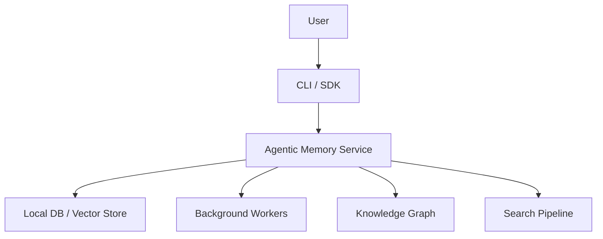
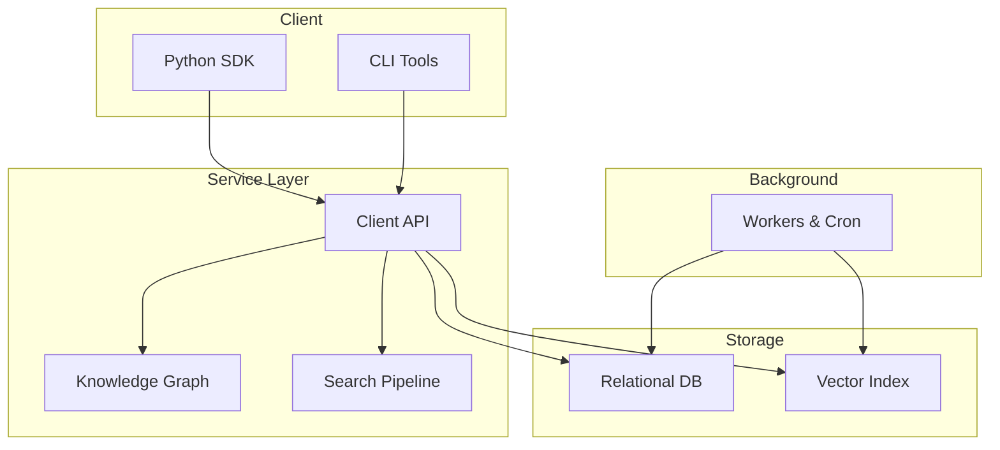
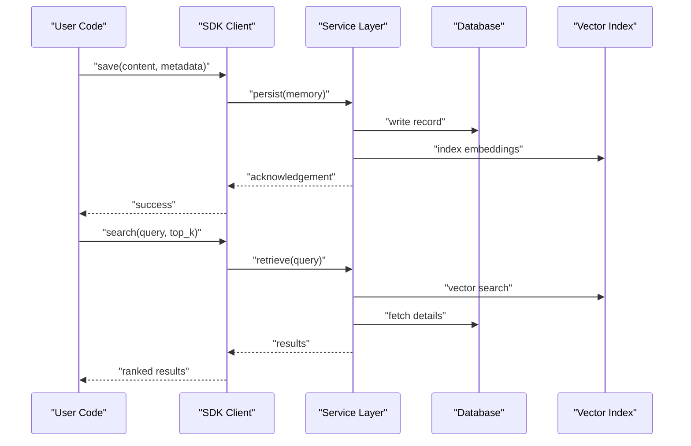
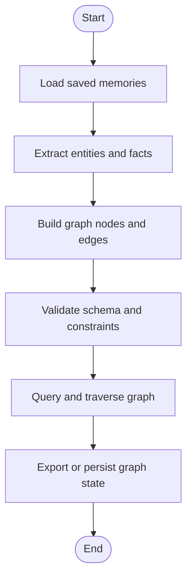
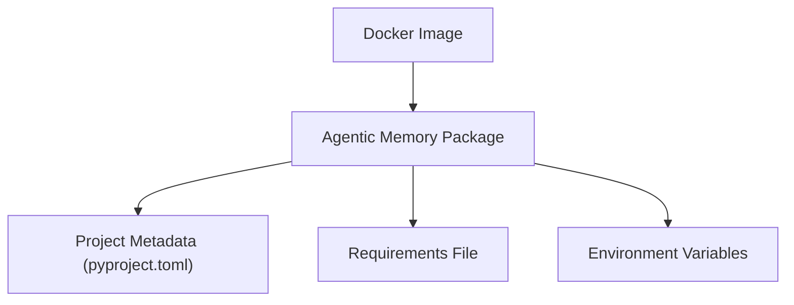

# Getting Started

<cite>
**Referenced Files in This Document**
- [README.md](file://README.md)
- [pyproject.toml](file://pyproject.toml)
- [requirements.txt](file://requirements.txt)
- [Dockerfile](file://Dockerfile)
- [docker-compose.yml](file://docker-compose.yml)
- [docker/README.md](file://docker/README.md)
- [memory.toml](file://memory.toml)
- [agentic_memory/__init__.py](file://agentic_memory/__init__.py)
- [agentic_memory/client.py](file://agentic_memory/client.py)
- [agentic_memory/kg.py](file://agentic_memory/kg.py)
- [examples/basic_save_search.py](file://examples/basic_save_search.py)
- [examples/agent_memory.py](file://examples/agent_memory.py)
- [docs/guides/quick-start.md](file://docs/guides/quick-start.md)
- [docs/reference/configuration.md](file://docs/reference/configuration.md)
- [docs/env_vars.md](file://docs/env_vars.md)
- [docs/self-hosting.md](file://docs/self-hosting.md)
- [infra/config.py](file://infra/config.py)
- [infra/memory_config.py](file://infra/memory_config.py)
- [infra/db.py](file://infra/db.py)
- [cli.py](file://cli.py)
</cite>

## Table of Contents
1. Introduction
2. Project Structure
3. Core Components
4. Architecture Overview
5. Detailed Component Analysis
6. Dependency Analysis
7. Performance Considerations
8. Troubleshooting Guide
9. Conclusion
10. Appendices

## Introduction
This guide helps you install, configure, and run the Agentic Memory framework quickly. You will:
- Install via pip, Docker, or from source
- Set up environment variables and configuration files
- Initialize a project and save your first memories
- Perform semantic search and build a simple knowledge graph
- Understand next steps for deeper exploration

The examples are beginner-friendly and reference concrete files so you can explore further at any time.

## Project Structure
At a high level, the repository provides:
- Python package entry points and SDK surface under agentic_memory
- Examples demonstrating basic usage
- Documentation including quick start and configuration references
- Docker artifacts for containerized operation
- Configuration files for runtime behavior

[No sources needed since this diagram shows conceptual workflow, not actual code structure]

**Section sources**
- [README.md](file://README.md)
- [docs/guides/quick-start.md](file://docs/guides/quick-start.md)

## Core Components
- Client and SDK surface: Provides programmatic access to memory operations such as saving, searching, and knowledge graph interactions.
- Knowledge graph module: Supports entity/fact modeling and traversal.
- Configuration and environment: Centralized config loading and environment variable resolution.
- Database and storage: Initializes and manages local persistence and vector indices.
- CLI: Command-line utilities for common tasks like initialization and maintenance.

Key implementation anchors:
- Public API surface and client wiring
- Knowledge graph helpers
- Config and env resolution
- Storage initialization

**Section sources**
- [agentic_memory/__init__.py](file://agentic_memory/__init__.py)
- [agentic_memory/client.py](file://agentic_memory/client.py)
- [agentic_memory/kg.py](file://agentic_memory/kg.py)
- [infra/config.py](file://infra/config.py)
- [infra/memory_config.py](file://infra/memory_config.py)
- [infra/db.py](file://infra/db.py)
- [cli.py](file://cli.py)

## Architecture Overview
The system exposes an SDK/CLI that interacts with a service layer backed by persistent storage and background workers. The knowledge graph and search pipeline are integrated components used by both the SDK and internal processes.

**Diagram sources**
- [agentic_memory/client.py](file://agentic_memory/client.py)
- [agentic_memory/kg.py](file://agentic_memory/kg.py)
- [infra/db.py](file://infra/db.py)
- [infra/memory_config.py](file://infra/memory_config.py)

## Detailed Component Analysis

### Installation Methods
Choose one of the following installation paths based on your environment.

- Pip (recommended for development and scripting)
  - Ensure Python is installed and meets the version requirements defined in the project metadata.
  - Install the package using pip.
  - Verify installation by importing the top-level package.

- Docker (recommended for isolated environments)
  - Use the provided Dockerfile to build a local image or pull a published image if available.
  - Run the container with appropriate volume mounts for persistent data and configuration.
  - Refer to the Docker README for detailed flags and examples.

- From Source (for contributors and advanced users)
  - Clone the repository.
  - Create a virtual environment and install dependencies listed in the project metadata and requirements file.
  - Optionally install editable mode for development.

Environment setup requirements:
- Python version and OS compatibility as specified in the project metadata.
- Optional LLM provider credentials if you plan to use extraction or summarization features.
- Disk space for database and vector index growth.

Dependency management:
- Primary dependency specification is in the project metadata file.
- A requirements file is also present for convenience.
- For Docker builds, ensure network access to fetch dependencies unless you provide a prebuilt image.

Common pitfalls:
- Missing Python version mismatch.
- Insufficient permissions for writing to the configured data directory.
- Network issues when installing packages or pulling images.

**Section sources**
- [pyproject.toml](file://pyproject.toml)
- [requirements.txt](file://requirements.txt)
- [Dockerfile](file://Dockerfile)
- [docker/README.md](file://docker/README.md)
- [README.md](file://README.md)

### Basic Configuration Setup
Configuration is loaded from a TOML file and environment variables. Key areas include:
- Data path and storage backend selection
- Embedding model settings
- Search and indexing options
- Background worker toggles

Steps:
- Create a configuration file (e.g., memory.toml) in your project root or a known location.
- Populate required fields such as data path and embedding model identifiers.
- Provide environment variables for secrets (e.g., API keys) as documented in the environment variables reference.
- Validate configuration by running a simple initialization command or import.

Tips:
- Keep secrets out of version control; prefer environment variables.
- Start with minimal configuration and enable features incrementally.
- Use the configuration reference to understand all available options.

**Section sources**
- [memory.toml](file://memory.toml)
- [docs/reference/configuration.md](file://docs/reference/configuration.md)
- [docs/env_vars.md](file://docs/env_vars.md)
- [infra/config.py](file://infra/config.py)
- [infra/memory_config.py](file://infra/memory_config.py)

### Initial Project Initialization
Initialize your project and verify connectivity:
- Use the CLI to initialize the project directory structure and apply migrations.
- Confirm that the database and vector index are created successfully.
- Optionally run a health check or status command to validate the setup.

If using Docker:
- Mount a persistent volume for data.
- Run the container with the correct configuration mounted.
- Execute initialization commands inside the container.

**Section sources**
- [cli.py](file://cli.py)
- [infra/db.py](file://infra/db.py)
- [docs/self-hosting.md](file://docs/self-hosting.md)

### Quick Start: Save Memories, Semantic Search, and Build a Simple Knowledge Graph
Follow these steps to perform core operations:

1. Save memories
   - Import the SDK client.
   - Call the save method with content and optional metadata.
   - Confirm the response indicates success.

2. Perform semantic search
   - Use the search method with a natural language query.
   - Adjust parameters such as top_k or filters as needed.
   - Review results for relevance and refine queries accordingly.

3. Build a simple knowledge graph
   - Extract entities and facts from saved memories using the knowledge graph helpers.
   - Query relationships and traverse the graph to discover connections.
   - Visualize or export the graph as needed.

Reference implementations:
- Example scripts demonstrate saving and searching.
- The knowledge graph module provides helper functions for building and querying graphs.

**Section sources**
- [examples/basic_save_search.py](file://examples/basic_save_search.py)
- [examples/agent_memory.py](file://examples/agent_memory.py)
- [agentic_memory/client.py](file://agentic_memory/client.py)
- [agentic_memory/kg.py](file://agentic_memory/kg.py)
- [docs/guides/quick-start.md](file://docs/guides/quick-start.md)

### Sequence: Saving and Searching Memories

**Diagram sources**
- [agentic_memory/client.py](file://agentic_memory/client.py)
- [infra/db.py](file://infra/db.py)

### Flowchart: Building a Simple Knowledge Graph

**Diagram sources**
- [agentic_memory/kg.py](file://agentic_memory/kg.py)

## Dependency Analysis
Core runtime dependencies include:
- Python standard library and third-party packages defined in the project metadata
- Optional providers for embeddings and LLMs
- Database drivers and vector store backends

**Diagram sources**
- [pyproject.toml](file://pyproject.toml)
- [requirements.txt](file://requirements.txt)
- [Dockerfile](file://Dockerfile)

**Section sources**
- [pyproject.toml](file://pyproject.toml)
- [requirements.txt](file://requirements.txt)
- [Dockerfile](file://Dockerfile)

## Performance Considerations
- Start with smaller top_k values during search to reduce latency.
- Monitor disk usage as embeddings and indexes grow over time.
- Tune background workers and cron jobs according to workload.
- Use appropriate embedding models balancing accuracy and speed.
- Periodically rebuild or compact indices as recommended by documentation.

[No sources needed since this section provides general guidance]

## Troubleshooting Guide
Common issues and resolutions:
- Permission errors when writing to data directories: ensure the process has write access.
- Missing environment variables for LLM providers: set required keys and test connectivity.
- Docker volume mount problems: verify mount paths and ownership.
- Migration failures: re-run initialization or consult migration logs.
- Search returns no results: confirm embeddings were indexed and queries match stored content.

Useful checks:
- Validate configuration by inspecting resolved settings.
- Run CLI health/status commands to verify service readiness.
- Review logs for errors related to DB connections or vector indexing.

**Section sources**
- [docs/self-hosting.md](file://docs/self-hosting.md)
- [infra/config.py](file://infra/config.py)
- [infra/memory_config.py](file://infra/memory_config.py)
- [cli.py](file://cli.py)

## Conclusion
You now have the essentials to install, configure, and operate Agentic Memory. Begin with saving and searching memories, then expand into knowledge graph workflows. Explore the guides and references for advanced topics such as multi-agent integration, background tasks, and performance tuning.

[No sources needed since this section summarizes without analyzing specific files]

## Appendices

### Environment Variables Reference
- Provider credentials for embeddings and LLMs
- Data path overrides
- Feature flags and toggles
- Logging and debugging levels

**Section sources**
- [docs/env_vars.md](file://docs/env_vars.md)

### Configuration Options Reference
- Storage and indexing options
- Search pipeline parameters
- Background worker settings
- Security and access controls

**Section sources**
- [docs/reference/configuration.md](file://docs/reference/configuration.md)
- [memory.toml](file://memory.toml)

### Next Steps
- Read the quick start guide for step-by-step tutorials.
- Explore integrations with agent frameworks.
- Learn about background tasks and cron jobs.
- Dive into architecture and subsystems for deep understanding.

**Section sources**
- [docs/guides/quick-start.md](file://docs/guides/quick-start.md)
- [README.md](file://README.md)